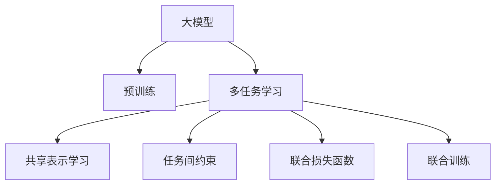

                 

# 电商平台中的AI大模型：从单一任务到多任务学习

> 关键词：大模型, 多任务学习, 迁移学习, 电商推荐, 个性化推荐, 动态模型

## 1. 背景介绍

### 1.1 问题由来
随着电子商务的蓬勃发展，电商平台积累了海量的用户行为数据和商品信息。如何利用这些数据来提升用户体验、增加销售额、提高运营效率，成为各大电商平台共同面临的挑战。基于深度学习的AI技术，特别是大模型（Large Language Models, LLMs）和迁移学习（Transfer Learning）方法，为电商平台提供了强大的工具。

传统电商推荐系统往往采用单一任务学习的方法，即在特定任务（如推荐商品、搜索优化等）上单独训练模型。虽然这种方法在某些情况下能够取得不错的效果，但由于缺乏跨任务的知识整合能力，模型的泛化能力和适应性较为有限。而多任务学习（Multi-task Learning, MTL）作为近年来的热门研究课题，能够同时学习多个相关任务，共享知识，提升模型的整体性能。

本文旨在介绍如何在大电商平台上应用多任务学习，并展示其带来的优势和挑战。我们将从单一任务推荐系统入手，探讨多任务学习如何帮助电商平台实现更加智能、高效的个性化推荐，从而提升用户体验和运营效率。

### 1.2 问题核心关键点
多任务学习的核心在于同时处理多个相关任务，通过知识共享和迁移，提升模型在不同任务上的表现。电商推荐系统可以视为一个典型的多任务学习应用场景，即同时学习商品推荐、用户画像、搜索排序等多个任务。

具体而言，多任务学习的关键点包括：
- **任务选择与设计**：如何选择和设计相关的任务，并决定它们之间的共享知识和独立学习部分。
- **模型架构设计**：如何设计一个统一的模型架构，支持多个任务的联合学习。
- **损失函数设计**：如何设计一个联合损失函数，以平衡不同任务的目标。
- **训练策略优化**：如何优化联合训练过程，提高模型收敛速度和效果。

## 2. 核心概念与联系

### 2.1 核心概念概述

为更好地理解多任务学习在电商推荐系统中的应用，本节将介绍几个密切相关的核心概念：

- **大模型（Large Language Models, LLMs）**：指在大规模无标签文本语料上进行预训练的语言模型，如BERT、GPT等。通过预训练，模型能够学习到丰富的语言知识和常识，具有强大的语言理解和生成能力。

- **迁移学习（Transfer Learning）**：指将一个领域学习到的知识，迁移应用到另一个不同但相关的领域的学习范式。多任务学习可以看作是一种特殊的迁移学习，目标是在多个任务之间共享知识，提高模型在不同任务上的性能。

- **多任务学习（Multi-task Learning, MTL）**：指在多个相关任务上同时训练模型，共享知识以提升模型性能。多任务学习有助于解决数据不足、任务间相关性等问题。

- **共享表示学习（Shared Representation Learning）**：多任务学习的关键点之一，即在多个任务间共享模型的一部分，以提高整体性能。

- **任务间约束（Task-specific Constraints）**：指每个任务特有的约束条件，如推荐任务的用户历史行为、商品属性等。这些约束条件应在多任务学习过程中被充分考虑。

这些核心概念之间的逻辑关系可以通过以下Mermaid流程图来展示：



这个流程图展示了从大模型预训练到多任务学习的核心流程：

1. 大模型通过预训练获得基础能力。
2. 多任务学习将大模型的通用知识应用于多个相关任务，共享知识。
3. 共享表示学习在多个任务间共享模型的一部分。
4. 任务间约束在多任务学习过程中被充分考虑。
5. 联合损失函数设计平衡不同任务的目标。
6. 联合训练过程同时优化多个任务。

这些概念共同构成了多任务学习在电商推荐系统中的应用框架，使其能够更好地适应电商平台的多样化需求。

## 3. 核心算法原理 & 具体操作步骤
### 3.1 算法原理概述

多任务学习在电商推荐系统中的应用，本质上是利用大模型的通用知识，通过迁移学习在多个相关任务上同时训练，共享知识以提升模型性能。

具体而言，多任务学习的过程如下：

1. 收集电商平台的多个相关任务数据集，如商品推荐、用户画像、搜索排序等。
2. 设计一个统一的模型架构，支持这些任务的联合学习。
3. 设计一个联合损失函数，平衡不同任务的目标。
4. 在联合损失函数的指导下，使用数据集训练模型。
5. 在每个任务上分别评估模型的性能，进行微调优化。

通过多任务学习，模型不仅在每个单一任务上取得较好的性能，还能在不同任务间进行知识迁移，提升整体效果。

### 3.2 算法步骤详解

基于多任务学习的大电商推荐系统开发一般包括以下几个关键步骤：

**Step 1: 准备数据集**
- 收集电商平台的多个相关任务数据集，如商品推荐、用户画像、搜索排序等。
- 对数据集进行预处理，包括数据清洗、特征提取、分词等操作。

**Step 2: 设计模型架构**
- 选择合适的大模型作为初始化参数，如BERT、GPT等。
- 设计一个统一的模型架构，支持多个任务的联合学习，如Adaptation Layer。

**Step 3: 设计联合损失函数**
- 根据每个任务的目标，设计一个联合损失函数，平衡不同任务的目标。常用的联合损失函数包括：
  - **加权平均损失（Weighted Sum Loss）**：不同任务的损失函数按权重求和。
  - **平均损失（Average Loss）**：对不同任务的损失函数取平均值。
  - **最大损失（Max Loss）**：选择不同任务中的最大损失。
  - **联合训练损失（Joint Training Loss）**：不同任务的损失函数加权求和，并在联合训练中不断调整权重。

**Step 4: 联合训练**
- 使用联合损失函数训练模型，优化不同任务的参数。
- 在每个epoch中，交替训练不同任务，以确保模型在每个任务上都能得到充分的训练。

**Step 5: 微调优化**
- 在每个任务上分别评估模型的性能，并进行微调优化。
- 调整任务间约束和联合损失函数中的权重，优化模型在不同任务上的表现。

**Step 6: 部署与评估**
- 将训练好的模型部署到实际应用中，进行A/B测试，评估其性能。
- 持续收集新的数据，定期重新训练模型，以适应数据分布的变化。

以上是基于多任务学习的大电商推荐系统的一般流程。在实际应用中，还需要针对具体任务的特点，对联合训练过程的各个环节进行优化设计，如改进任务间约束，引入更多的正则化技术，搜索最优的超参数组合等，以进一步提升模型性能。

### 3.3 算法优缺点

基于多任务学习的大电商推荐系统具有以下优点：
1. 数据利用率高。多个相关任务的数据可以共同用于训练，减少数据需求，提高数据利用率。
2. 性能提升显著。多任务学习可以共享知识，提升模型在不同任务上的表现。
3. 模型适应性强。多任务学习模型具有更强的泛化能力，能够适应数据分布的变化。
4. 训练效率高。联合训练可以同时优化多个任务，加快模型训练速度。

同时，该方法也存在一定的局限性：
1. 数据质量要求高。联合训练中，不同任务的数据质量需一致，否则可能导致性能下降。
2. 模型复杂度高。多任务学习模型需要设计统一的架构，增加了模型的复杂度。
3. 计算资源需求大。联合训练需要较大的计算资源，对硬件要求较高。
4. 模型可解释性不足。多任务学习模型的决策过程通常缺乏可解释性，难以对其推理逻辑进行分析和调试。

尽管存在这些局限性，但就目前而言，基于多任务学习的方法已成为电商平台推荐系统的重要范式。未来相关研究的重点在于如何进一步降低联合训练对计算资源的依赖，提高模型的跨领域迁移能力，同时兼顾可解释性和伦理安全性等因素。

### 3.4 算法应用领域

基于大模型和多任务学习的方法在电商平台推荐系统中的应用，已经在多个任务上取得了优异的效果，具体如下：

- **商品推荐**：通过多任务学习，模型不仅能够推荐商品，还能了解用户偏好、商品属性等信息，提升推荐效果。
- **用户画像**：通过多任务学习，模型可以同时学习用户行为、兴趣、情感等信息，构建更全面的用户画像。
- **搜索排序**：通过多任务学习，模型能够同时优化搜索排序算法，提升搜索效果和用户体验。
- **广告投放**：通过多任务学习，模型可以同时优化广告投放策略，提高广告的点击率和转化率。
- **内容推荐**：通过多任务学习，模型可以同时优化内容推荐算法，提供更符合用户兴趣的内容。

除了上述这些经典任务外，多任务学习还被创新性地应用到更多场景中，如基于推荐系统的用户情感分析、个性化广告投放、智能客服系统等，为电商平台推荐系统带来了新的突破。

## 4. 数学模型和公式 & 详细讲解  
### 4.1 数学模型构建

假设电商平台的任务集合为 $T=\{t_1, t_2, ..., t_k\}$，其中 $k$ 为任务数量。对于每个任务 $t_i$，假设其训练数据集为 $D_i=\{(x_{i,j}, y_{i,j})\}_{j=1}^{n_i}$，其中 $n_i$ 为任务 $t_i$ 的数据集大小，$x_{i,j}$ 为输入样本，$y_{i,j}$ 为标签。

定义任务 $t_i$ 的损失函数为 $l_i(\theta, D_i)$，在任务集合 $T$ 上定义联合损失函数为 $L(\theta, D) = \frac{1}{N}\sum_{i=1}^{k} \sum_{j=1}^{n_i} l_i(\theta, (x_{i,j}, y_{i,j}))$，其中 $N$ 为所有任务数据集大小总和。

多任务学习的目标是优化联合损失函数 $L(\theta, D)$，使模型在多个任务上都能取得较好的性能。

### 4.2 公式推导过程

以下我们以商品推荐和用户画像联合训练为例，推导联合损失函数的计算公式。

假设商品推荐任务的目标是预测用户对商品的评分，用户画像任务的目标是预测用户的兴趣和行为。在联合训练中，我们希望同时优化这两个任务，设计联合损失函数 $L(\theta, D) = \frac{1}{N}\sum_{i=1}^{k} \sum_{j=1}^{n_i} l_i(\theta, (x_{i,j}, y_{i,j}))$。

假设推荐任务的损失函数为 $l_1(\theta, x, y) = (y - \hat{y})^2$，用户画像任务的损失函数为 $l_2(\theta, x, y) = (y - \hat{y})^2$。则在联合训练中，推荐任务和用户画像任务的联合损失函数可以表示为：

$$
L(\theta, D) = \frac{1}{N}\sum_{i=1}^{k} \sum_{j=1}^{n_i} (y_i - \hat{y}_i)^2
$$

其中 $\hat{y}_i$ 为模型在输入 $x_{i,j}$ 上的预测输出。

在优化过程中，我们通常使用基于梯度的优化算法（如SGD、Adam等）来近似求解上述最优化问题。设 $\eta$ 为学习率，则参数的更新公式为：

$$
\theta \leftarrow \theta - \eta \nabla_{\theta}L(\theta, D)
$$

其中 $\nabla_{\theta}L(\theta, D)$ 为联合损失函数对参数 $\theta$ 的梯度，可通过反向传播算法高效计算。

在得到联合损失函数的梯度后，即可带入参数更新公式，完成模型的迭代优化。重复上述过程直至收敛，最终得到适应电商推荐系统的联合优化模型参数 $\theta^*$。

## 5. 项目实践：代码实例和详细解释说明
### 5.1 开发环境搭建

在进行多任务学习实践前，我们需要准备好开发环境。以下是使用Python进行PyTorch开发的环境配置流程：

1. 安装Anaconda：从官网下载并安装Anaconda，用于创建独立的Python环境。

2. 创建并激活虚拟环境：
```bash
conda create -n pytorch-env python=3.8 
conda activate pytorch-env
```

3. 安装PyTorch：根据CUDA版本，从官网获取对应的安装命令。例如：
```bash
conda install pytorch torchvision torchaudio cudatoolkit=11.1 -c pytorch -c conda-forge
```

4. 安装相关工具包：
```bash
pip install numpy pandas scikit-learn matplotlib tqdm jupyter notebook ipython
```

完成上述步骤后，即可在`pytorch-env`环境中开始多任务学习实践。

### 5.2 源代码详细实现

下面以商品推荐和用户画像联合训练为例，给出使用PyTorch进行多任务学习的代码实现。

首先，定义任务数据集和任务损失函数：

```python
from torch.utils.data import Dataset
import torch

class TaskDataset(Dataset):
    def __init__(self, task_data, tokenizer):
        self.task_data = task_data
        self.tokenizer = tokenizer
        
    def __len__(self):
        return len(self.task_data)
    
    def __getitem__(self, index):
        task_data = self.task_data[index]
        input_ids = self.tokenizer(task_data['text'], padding='max_length', truncation=True, return_tensors='pt')
        return {'input_ids': input_ids['input_ids'], 'labels': torch.tensor(task_data['label'], dtype=torch.long)}
        
# 定义推荐任务和用户画像任务的损失函数
def recommendation_loss(model, input_ids, labels):
    return torch.mean((labels - model(input_ids).view(-1))**2)

def user_profile_loss(model, input_ids, labels):
    return torch.mean((labels - model(input_ids).view(-1))**2)
```

然后，定义联合训练函数：

```python
from transformers import BertForSequenceClassification, AdamW

model = BertForSequenceClassification.from_pretrained('bert-base-cased', num_labels=2)

optimizer = AdamW(model.parameters(), lr=2e-5)

def joint_train(model, train_dataset, device, epochs=5, batch_size=16):
    for epoch in range(epochs):
        model.train()
        for batch in train_dataset:
            input_ids = batch['input_ids'].to(device)
            labels = batch['labels'].to(device)
            
            optimizer.zero_grad()
            loss = (recommendation_loss(model, input_ids, labels) + user_profile_loss(model, input_ids, labels)) / 2
            loss.backward()
            optimizer.step()
        
    print(f'Epochs: {epochs}, Recommendation Loss: {recommendation_loss(model, input_ids, labels)}')

# 训练联合模型
joint_train(model, train_dataset, device='cuda')
```

以上代码实现了基于PyTorch进行商品推荐和用户画像联合训练的基本流程。其中，我们使用了BertForSequenceClassification作为基础模型，设计了推荐任务和用户画像任务的损失函数，并通过AdamW优化器进行联合训练。

### 5.3 代码解读与分析

让我们再详细解读一下关键代码的实现细节：

**TaskDataset类**：
- `__init__`方法：初始化任务数据集和分词器。
- `__len__`方法：返回数据集的样本数量。
- `__getitem__`方法：对单个样本进行处理，将文本输入编码为token ids，并返回标签。

**任务损失函数**：
- 推荐任务和用户画像任务的损失函数均为平方误差损失，用于衡量模型预测输出与真实标签之间的差异。

**联合训练函数**：
- 在每个epoch中，模型进入训练模式，对数据集进行批处理，计算推荐任务和用户画像任务的联合损失。
- 使用AdamW优化器更新模型参数，确保模型在每个任务上都能得到充分的训练。

**训练流程**：
- 定义总的epoch数和batch size，开始循环迭代
- 在每个epoch内，对训练集进行联合训练，输出推荐任务和用户画像任务的损失
- 重复上述过程直至收敛

可以看到，PyTorch结合BertForSequenceClassification模型和任务损失函数，使得多任务学习的代码实现变得简洁高效。开发者可以将更多精力放在数据处理、模型改进等高层逻辑上，而不必过多关注底层的实现细节。

当然，工业级的系统实现还需考虑更多因素，如模型的保存和部署、超参数的自动搜索、更灵活的任务适配层等。但核心的联合训练范式基本与此类似。

## 6. 实际应用场景
### 6.1 智能推荐系统

基于多任务学习的大电商推荐系统，可以同时处理商品推荐、用户画像、搜索排序等多个任务，提升推荐效果和用户体验。

在技术实现上，可以收集用户的浏览、点击、购买等行为数据，提取和商品相关的文本信息、用户画像、搜索查询等。将文本信息作为模型输入，用户的后续行为作为监督信号，在此基础上联合训练模型。联合训练后的模型能够从多任务数据中学习到更全面的用户偏好和商品属性，提升推荐效果。

### 6.2 用户行为分析

电商平台的运营离不开对用户行为的深入理解。基于多任务学习，平台可以同时学习用户的行为数据、兴趣数据、情感数据等，构建更加全面和准确的个性化用户画像，用于用户行为分析和预测。

例如，可以收集用户的搜索历史、浏览记录、购买记录等，提取用户的行为特征和兴趣标签。通过联合训练，模型可以学习到用户在不同场景下的行为模式和兴趣偏好，从而为个性化营销、广告投放等提供更精准的用户画像。

### 6.3 动态模型部署

电商平台的数据分布是动态变化的，需要模型能够实时地适应新的数据分布，避免过拟合和灾难性遗忘。基于多任务学习，模型可以通过持续学习的方式，不断更新知识，提升模型的泛化能力和适应性。

例如，可以定期收集新的用户行为数据和商品信息，重新训练联合模型，保持模型在动态变化的数据分布中的性能。动态模型部署可以提升电商平台的运营效率，满足用户不断变化的需求。

### 6.4 未来应用展望

随着多任务学习技术的发展，基于大模型的电商推荐系统将具有更强的跨任务迁移能力，能够更好地适应不同用户和商品的需求。

1. **跨领域迁移**：模型能够同时处理不同领域的数据，如时尚、美妆、电器等，提供更加多样化的推荐服务。
2. **实时动态更新**：模型能够实时接收新的数据，动态更新模型参数，提升推荐系统的时效性。
3. **多模态数据融合**：结合图像、视频等多模态数据，提升模型对复杂场景的理解能力，提供更加个性化和精准的推荐服务。
4. **个性化广告投放**：通过多任务学习，模型可以同时优化广告投放策略，提高广告的点击率和转化率。
5. **智能客服系统**：基于多任务学习，模型可以同时处理用户查询、情感分析、个性化推荐等任务，提升智能客服系统的用户体验。

多任务学习在大电商平台上具有广阔的应用前景，未来的研究将进一步推动电商推荐系统的智能化、个性化发展，带来更高的运营效率和用户满意度。

## 7. 工具和资源推荐
### 7.1 学习资源推荐

为了帮助开发者系统掌握多任务学习在电商推荐系统中的应用，这里推荐一些优质的学习资源：

1. 《深度学习理论与算法》系列博文：由大模型技术专家撰写，深入浅出地介绍了深度学习的基本理论和算法，包括多任务学习。

2. CS231n《深度学习计算机视觉》课程：斯坦福大学开设的计算机视觉课程，有Lecture视频和配套作业，带你入门多任务学习的基本概念和经典模型。

3. 《深度学习与强化学习》书籍：详细介绍了深度学习在电商推荐系统中的应用，包括多任务学习和迁移学习。

4. 《自然语言处理综述》书籍：系统介绍了自然语言处理的基本概念和最新进展，包括多任务学习和迁移学习。

5. PyTorch官方文档：PyTorch的官方文档，提供了海量预训练模型和完整的微调样例代码，是上手实践的必备资料。

通过对这些资源的学习实践，相信你一定能够快速掌握多任务学习在大电商推荐系统中的应用，并用于解决实际的NLP问题。

### 7.2 开发工具推荐

高效的开发离不开优秀的工具支持。以下是几款用于多任务学习开发的常用工具：

1. PyTorch：基于Python的开源深度学习框架，灵活动态的计算图，适合快速迭代研究。大部分预训练语言模型都有PyTorch版本的实现。

2. TensorFlow：由Google主导开发的开源深度学习框架，生产部署方便，适合大规模工程应用。同样有丰富的预训练语言模型资源。

3. Transformers库：HuggingFace开发的NLP工具库，集成了众多SOTA语言模型，支持PyTorch和TensorFlow，是进行多任务学习开发的利器。

4. Weights & Biases：模型训练的实验跟踪工具，可以记录和可视化模型训练过程中的各项指标，方便对比和调优。与主流深度学习框架无缝集成。

5. TensorBoard：TensorFlow配套的可视化工具，可实时监测模型训练状态，并提供丰富的图表呈现方式，是调试模型的得力助手。

6. Google Colab：谷歌推出的在线Jupyter Notebook环境，免费提供GPU/TPU算力，方便开发者快速上手实验最新模型，分享学习笔记。

合理利用这些工具，可以显著提升多任务学习任务的开发效率，加快创新迭代的步伐。

### 7.3 相关论文推荐

多任务学习在电商平台推荐系统中的应用，源于学界的持续研究。以下是几篇奠基性的相关论文，推荐阅读：

1. Learning Multi-task Structure from Data (LMS)：提出了多任务学习的基本框架，通过联合训练和任务间约束，提升模型在多个任务上的性能。

2. Multi-task Learning for Multi-domain Sentiment Analysis：提出了多任务学习在情感分析任务中的应用，通过联合训练和迁移学习，提升情感分析的精度和泛化能力。

3. Deep Multi-task Learning for Multi-domain Sentiment Analysis with Topic Alignment：提出了多任务学习在情感分析任务中的应用，通过联合训练和话题对齐，提升情感分析的精度和泛化能力。

4. Multi-task Learning with Dynamic Network Architecture (MTL-DNA)：提出了动态网络架构的多任务学习，通过自适应任务权重和动态网络结构，提升多任务学习的效果。

5. Factorization Machines for Multi-task Learning：提出了基于因子分解机的多任务学习，通过联合训练和任务间约束，提升推荐系统的效果。

这些论文代表了大电商推荐系统中多任务学习技术的发展脉络。通过学习这些前沿成果，可以帮助研究者把握学科前进方向，激发更多的创新灵感。

## 8. 总结：未来发展趋势与挑战

### 8.1 总结

本文对基于多任务学习的大电商推荐系统进行了全面系统的介绍。首先阐述了多任务学习在电商平台推荐系统中的研究背景和意义，明确了多任务学习在电商推荐系统中的独特价值。其次，从原理到实践，详细讲解了多任务学习的数学模型和关键步骤，给出了多任务学习任务开发的完整代码实例。同时，本文还广泛探讨了多任务学习在智能推荐系统、用户行为分析、动态模型部署等多个领域的应用前景，展示了多任务学习范式的巨大潜力。

通过本文的系统梳理，可以看到，基于多任务学习的方法正在成为电商推荐系统的重要范式，极大地拓展了电商推荐系统的应用边界，催生了更多的落地场景。受益于大规模语料的预训练和多任务学习的深度融合，电商推荐系统能够更好地适应电商平台的多样化需求，提升用户体验和运营效率。未来，伴随多任务学习技术的发展，电商推荐系统必将在智能化、个性化方向上迈出更大的步伐，为电商平台的数字化转型提供更强大的技术支撑。

### 8.2 未来发展趋势

展望未来，多任务学习在电商推荐系统中的应用将呈现以下几个发展趋势：

1. **数据驱动的模型优化**：随着大数据和云计算技术的发展，电商平台的运营数据将更加丰富和多样。多任务学习可以利用这些数据，通过持续学习和实时动态更新，提升模型的泛化能力和适应性。

2. **跨领域知识融合**：多任务学习可以通过跨领域知识融合，提升模型对复杂场景的理解能力。结合图像、视频等多模态数据，提供更加个性化和精准的推荐服务。

3. **自适应模型设计**：多任务学习可以设计自适应模型架构，根据不同任务的数据特点和需求，动态调整模型结构和参数。

4. **实时动态更新**：多任务学习可以通过持续学习的方式，实时更新模型参数，满足电商平台的动态变化需求。

5. **高效资源利用**：多任务学习可以优化计算资源利用，通过联合训练和参数共享，减少计算资源消耗，提升模型训练和推理效率。

以上趋势凸显了多任务学习在电商推荐系统中的广阔前景。这些方向的探索发展，必将进一步提升电商推荐系统的智能化和个性化水平，为电商平台的数字化转型提供新的技术路径。

### 8.3 面临的挑战

尽管多任务学习在电商推荐系统中取得了一定的进展，但在迈向更加智能化、普适化应用的过程中，它仍面临着诸多挑战：

1. **数据质量要求高**：多任务学习需要高质量的数据，不同任务的数据质量需一致，否则可能导致性能下降。

2. **模型复杂度高**：多任务学习模型需要设计统一的架构，增加了模型的复杂度。

3. **计算资源需求大**：联合训练需要较大的计算资源，对硬件要求较高。

4. **模型可解释性不足**：多任务学习模型的决策过程通常缺乏可解释性，难以对其推理逻辑进行分析和调试。

5. **动态数据适应性差**：多任务学习模型在动态数据分布上的适应性较差，需要不断更新才能保持性能。

6. **公平性问题**：多任务学习模型需要在不同用户之间实现公平推荐，避免偏见和歧视。

正视多任务学习面临的这些挑战，积极应对并寻求突破，将是大电商推荐系统走向成熟的必由之路。相信随着学界和产业界的共同努力，这些挑战终将一一被克服，多任务学习技术必将为电商平台的推荐系统带来更多的突破和创新。

### 8.4 研究展望

面对多任务学习面临的种种挑战，未来的研究需要在以下几个方面寻求新的突破：

1. **数据质量提升**：探索高质量数据集生成和数据增强技术，提升多任务学习模型的数据质量。

2. **模型复杂度优化**：设计更高效、更灵活的多任务学习模型架构，减少模型复杂度，提高训练和推理效率。

3. **跨领域知识融合**：结合图像、视频等多模态数据，提升模型对复杂场景的理解能力，提供更加个性化和精准的推荐服务。

4. **自适应模型设计**：设计自适应模型架构，根据不同任务的数据特点和需求，动态调整模型结构和参数。

5. **实时动态更新**：优化联合训练过程，提高模型在动态数据分布上的适应性，实现实时动态更新。

6. **公平性问题**：研究公平性评价指标和优化方法，避免偏见和歧视，实现不同用户之间的公平推荐。

这些研究方向的探索，必将引领多任务学习技术迈向更高的台阶，为电商平台的推荐系统带来更多的突破和创新。只有勇于创新、敢于突破，才能不断拓展多任务学习在大电商推荐系统中的边界，让智能技术更好地造福电商平台的用户。

## 9. 附录：常见问题与解答

**Q1：多任务学习是否适用于所有电商推荐系统？**

A: 多任务学习在大多数电商推荐系统上都能取得不错的效果，特别是对于数据量较小的任务。但对于一些特定领域的任务，如实时动态推荐、跨领域推荐等，多任务学习也需要针对性的改进优化。

**Q2：如何选择合适的多任务学习任务？**

A: 选择合适的多任务学习任务，需要考虑任务的关联性和数据的互补性。一般而言，选择与目标任务相关性高、数据量适中的任务，可以最大化共享知识的效果。

**Q3：联合训练中如何设置任务权重？**

A: 联合训练中，任务权重的选择需要根据任务的重要性和数据量进行调整。一般而言，重要性和数据量大的任务应赋予更高的权重。可以使用交叉验证等方法，优化任务权重的设置。

**Q4：多任务学习如何处理数据不平衡问题？**

A: 数据不平衡问题可以通过数据增强、重采样等方法解决。在多任务学习中，可以通过调整任务权重，提高少数任务的优先级，避免数据不平衡影响模型性能。

**Q5：多任务学习如何提升模型可解释性？**

A: 多任务学习可以通过引入可解释性模型，如线性模型、树模型等，提升模型的可解释性。同时，可以通过特征可视化、模型解释技术等方法，增强模型的可解释性。

这些问题的回答，希望能够帮助读者更好地理解多任务学习在电商推荐系统中的应用，并为实际开发提供有价值的参考。

---

作者：禅与计算机程序设计艺术 / Zen and the Art of Computer Programming

