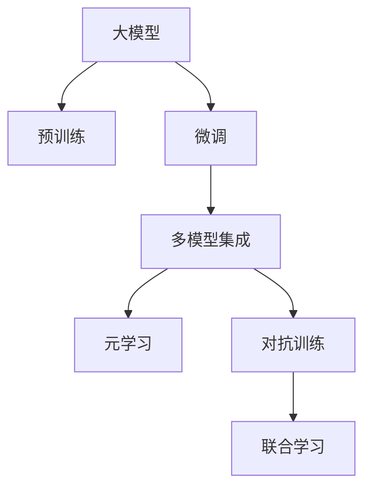

                 

# 电商平台中的AI大模型：从单一算法到集成学习

> 关键词：大模型, 集成学习, 电商, 推荐系统, 深度学习, 算法融合

## 1. 背景介绍

### 1.1 问题由来

随着电商平台日益兴起，客户体验和转化率成为竞争的焦点。为了提升购物体验和增加销售转化率，电商平台通过收集用户行为数据，并利用机器学习算法，为用户推荐可能感兴趣的物品。然而，随着商品种类和用户需求的多样化，单纯依赖单一推荐算法已经难以满足复杂多样的用户需求。为了突破这一瓶颈，AI大模型的应用成为一种新的趋势。

大模型通过在大规模数据集上预训练，学习丰富的特征表示，能够在推荐系统、个性化搜索、客户服务等多个场景中发挥巨大的作用。电商平台上应用大模型的技术，能够显著提升用户体验，实现更精准的推荐，增加交易转化率。

### 1.2 问题核心关键点

大模型的核心优势在于其强大的表征能力，可以通过在大规模数据上预训练，学习到丰富的特征表示，然后在下游任务中进行微调，提升性能。但在实际应用中，为了适应不同的电商场景，往往需要组合多个单一模型，构建更复杂的集成模型，实现更好的效果。

当前基于大模型的推荐系统主要采用以下几种集成学习方法：

1. **多模型集成**：构建多个单一模型，并通过加权、堆叠、融合等方法将它们组合起来，提高整体性能。
2. **元学习**：通过学习元模型，在不同任务之间迁移知识，提升模型的泛化能力。
3. **对抗训练**：通过对抗样本训练，提高模型的鲁棒性和泛化能力。
4. **联合学习**：通过分布式协同训练，多个模型共享数据和知识，减少对单台设备计算资源的依赖。

这些集成学习策略，在大规模电商数据上，能够发挥大模型的优势，提高推荐系统的准确性和鲁棒性，满足用户多样化需求，提升电商平台的用户体验。

### 1.3 问题研究意义

大模型在电商平台的应用，对于提升电商平台的推荐精准度和用户满意度，具有重要意义：

1. **提升推荐系统效果**：通过多模型集成，可以避免单一模型的缺陷，提高推荐系统的整体效果。
2. **增强系统鲁棒性**：对抗训练等方法，可以提升模型对抗噪声和攻击的能力，提高系统的鲁棒性。
3. **提高用户满意度**：大模型能够更好地理解用户需求，提供更个性化的推荐，提升用户体验。
4. **促进销售增长**：精准推荐可以显著提升用户转化率，增加电商平台销售收入。
5. **推动行业创新**：大模型集成学习方法，为电商推荐系统提供了新的思路，促进了行业技术创新。

## 2. 核心概念与联系

### 2.1 核心概念概述

为更好地理解基于大模型的电商推荐系统，本节将介绍几个密切相关的核心概念：

- **大模型(Large Model)**：指在大规模数据集上进行预训练，学习丰富的特征表示，在推荐系统、自然语言处理等任务上能够提供强大的预处理能力的深度学习模型。
- **预训练(Pre-training)**：指在大规模无标签数据集上，通过自监督学习任务训练模型，学习通用的特征表示。
- **微调(Fine-tuning)**：指在预训练模型的基础上，使用特定任务的数据集进行有监督的优化，使其在特定任务上表现更好。
- **集成学习(Ensemble Learning)**：指通过组合多个单一模型的预测结果，构建更加复杂的模型，以提升整体性能。
- **多任务学习(Multi-task Learning)**：指在同一数据集上训练多个相关任务，模型在各个任务之间共享知识，提高泛化能力。
- **对抗训练(Adversarial Training)**：指在模型训练过程中，加入对抗样本，提高模型对噪声和攻击的鲁棒性。
- **元学习(Meta Learning)**：指模型学习元模型，以在不同任务之间迁移知识，提升模型的泛化能力。

这些核心概念之间的逻辑关系可以通过以下Mermaid流程图来展示：



这个流程图展示了大模型在不同场景下的应用，包括预训练、微调、集成学习等，以及它们之间的联系和转化。

## 3. 核心算法原理 & 具体操作步骤
### 3.1 算法原理概述

基于大模型的电商推荐系统，本质上是一个多任务的集成学习过程。其核心思想是：通过多模型集成、多任务学习、对抗训练等策略，构建一个复杂的模型体系，使得模型在各个任务上都表现良好，从而实现更精准、更鲁棒的推荐效果。

形式化地，假设电商推荐系统有$m$个单一推荐模型，每个模型在训练集$D_1$上的损失函数为$\ell_1(\theta)$，目标是最小化所有模型的平均损失：

$$
\mathcal{L}(\theta) = \frac{1}{m}\sum_{i=1}^m \ell_i(\theta)
$$

通过梯度下降等优化算法，模型不断更新参数$\theta$，最小化损失函数$\mathcal{L}(\theta)$，使得模型输出逼近理想预测结果。由于$m$个模型共同学习同一组特征表示，因此集成的效果往往优于单个模型的简单叠加。

### 3.2 算法步骤详解

基于大模型的电商推荐系统一般包括以下几个关键步骤：

**Step 1: 准备预训练模型和数据集**
- 选择合适的预训练大模型，如BERT、GPT等，作为推荐系统的初始化参数。
- 准备电商平台的用户行为数据，划分为训练集、验证集和测试集。一般要求用户行为数据与商品信息数据分布不要差异过大。

**Step 2: 构建单一模型**
- 在预训练模型的基础上，添加推荐任务适配层，如DNN、MLP等，设计合适的损失函数，如交叉熵损失、均方误差损失等。
- 使用优化算法(如AdamW、SGD等)更新模型参数，最小化损失函数。

**Step 3: 集成模型**
- 对$m$个单一模型进行集成，如加权平均、堆叠、融合等方法。
- 在训练集上反复迭代，不断调整各个模型的权重，最小化集成的平均损失函数。

**Step 4: 测试和部署**
- 在测试集上评估集成模型的性能，对比单一模型和集成模型之间的差异。
- 使用集成模型对新样本进行推理预测，集成到实际的应用系统中。
- 持续收集新的用户行为数据，定期重新训练模型，以适应数据分布的变化。

以上是基于大模型的电商推荐系统的一般流程。在实际应用中，还需要针对具体任务的特点，对模型集成方法进行优化设计，如改进训练目标函数，引入更多的正则化技术，搜索最优的超参数组合等，以进一步提升模型性能。

### 3.3 算法优缺点

基于大模型的电商推荐系统具有以下优点：
1. 效果好。通过多模型集成，可以充分利用各个模型的优势，提高推荐系统的整体效果。
2. 泛化能力强。多任务学习和对抗训练等方法，可以提升模型对新数据和噪声的鲁棒性，避免模型过拟合。
3. 可解释性强。单一模型和集成模型之间的权重分配，可以帮助理解各个模型的贡献，提供更好的解释性。

同时，该方法也存在一定的局限性：
1. 对数据要求高。需要大量的用户行为数据，才能训练出性能良好的模型。
2. 复杂度高。模型集成方法涉及加权、堆叠等复杂操作，增加了模型的计算复杂度和存储开销。
3. 难以调试。多模型集成后，模型复杂度增加，调试和优化困难。
4. 资源消耗大。大模型本身对计算资源要求高，集成后资源需求更大。

尽管存在这些局限性，但就目前而言，基于大模型的电商推荐系统仍然是大数据时代推荐系统的主流范式。未来相关研究的重点在于如何进一步降低模型复杂度，提高模型的可解释性和泛化能力，同时兼顾资源消耗和模型精度。

### 3.4 算法应用领域

基于大模型的电商推荐系统，在推荐系统、个性化搜索、客户服务等多个场景中得到了广泛应用，具体包括：

1. **推荐系统**：利用用户的历史行为数据，为用户推荐可能感兴趣的物品。通过多模型集成，提升推荐效果，满足用户多样化需求。
2. **个性化搜索**：根据用户搜索历史，快速返回最相关的商品，提高搜索体验。
3. **客户服务**：利用自然语言处理技术，构建智能客服系统，提升客户满意度。

除了以上这些经典应用外，大模型集成学习技术还在商品评价分析、库存管理、供应链优化等更多场景中得到应用，为电商平台的智能化升级提供了新的动力。

## 4. 数学模型和公式 & 详细讲解
### 4.1 数学模型构建

在电商平台中，推荐系统可以视为一个多任务的集成学习问题。假设电商平台上存在$m$个单一推荐模型，每个模型在训练集$D_1$上的损失函数为$\ell_i(\theta)$，则整个推荐系统的损失函数为：

$$
\mathcal{L}(\theta) = \frac{1}{m}\sum_{i=1}^m \ell_i(\theta)
$$

其中$\theta$为模型参数。假设模型为线性回归模型，损失函数为均方误差损失：

$$
\ell_i(\theta) = \frac{1}{2n}\sum_{x,y}(x-y)^2
$$

目标是最小化损失函数：

$$
\min_{\theta} \mathcal{L}(\theta)
$$

### 4.2 公式推导过程

为了提升推荐系统的效果，可以采用多模型集成方法。假设模型集成的结果是$f(x)$，则集成模型的损失函数为：

$$
\mathcal{L}(f(x)) = \frac{1}{2n}\sum_{x,y}(f(x)-y)^2
$$

多模型集成可以通过加权平均、堆叠等方法实现。假设权重向量为$w$，则集成结果为：

$$
f(x) = \sum_{i=1}^m w_i f_i(x)
$$

其中$f_i(x)$为第$i$个模型的预测结果。

目标是最小化集成模型的损失函数：

$$
\min_{w,\theta} \frac{1}{m}\sum_{i=1}^m \ell_i(\theta)
$$

通过梯度下降等优化算法，不断调整参数$\theta$和权重向量$w$，最小化损失函数。

### 4.3 案例分析与讲解

以电商平台推荐系统为例，假设模型集成的结果是商品ID的排名列表。模型的目标是预测商品ID的排名，最小化预测排名与实际排名之间的平方误差。

假设模型$M_i$为深度神经网络模型，其损失函数为：

$$
\ell_i(\theta) = \frac{1}{2n}\sum_{x,y}(y-\hat{y})^2
$$

其中$\hat{y}$为模型预测的排名。

假设模型集成的结果是$f(x)$，则损失函数为：

$$
\mathcal{L}(f(x)) = \frac{1}{2n}\sum_{x,y}(y-f(x))^2
$$

目标是最小化损失函数：

$$
\min_{\theta,\omega} \frac{1}{m}\sum_{i=1}^m \ell_i(\theta)
$$

其中$\omega$为模型集成的权重向量。

通过梯度下降等优化算法，不断调整参数$\theta$和权重向量$\omega$，最小化损失函数。

## 5. 项目实践：代码实例和详细解释说明
### 5.1 开发环境搭建

在进行电商推荐系统的微调实践前，我们需要准备好开发环境。以下是使用Python进行PyTorch开发的环境配置流程：

1. 安装Anaconda：从官网下载并安装Anaconda，用于创建独立的Python环境。

2. 创建并激活虚拟环境：
```bash
conda create -n pytorch-env python=3.8 
conda activate pytorch-env
```

3. 安装PyTorch：根据CUDA版本，从官网获取对应的安装命令。例如：
```bash
conda install pytorch torchvision torchaudio cudatoolkit=11.1 -c pytorch -c conda-forge
```

4. 安装TensorFlow：
```bash
conda install tensorflow
```

5. 安装各类工具包：
```bash
pip install numpy pandas scikit-learn matplotlib tqdm jupyter notebook ipython
```

完成上述步骤后，即可在`pytorch-env`环境中开始电商推荐系统的微调实践。

### 5.2 源代码详细实现

下面我们以推荐系统为例，给出使用PyTorch进行电商推荐系统的微调PyTorch代码实现。

首先，定义推荐系统的数据处理函数：

```python
import torch
from torch.utils.data import Dataset
import numpy as np

class RecommendationDataset(Dataset):
    def __init__(self, user_behaviors, item_ids, item_features, user_features):
        self.user_behaviors = user_behaviors
        self.item_ids = item_ids
        self.item_features = item_features
        self.user_features = user_features
        
    def __len__(self):
        return len(self.user_behaviors)
    
    def __getitem__(self, item):
        user_behavior = self.user_behaviors[item]
        item_ids = self.item_ids[item]
        item_features = self.item_features[item]
        user_features = self.user_features[item]
        
        user_vector = torch.tensor(user_features, dtype=torch.float)
        item_vectors = torch.tensor(item_features, dtype=torch.float)
        target_vector = torch.tensor(user_behavior, dtype=torch.float)
        
        return {'user_vector': user_vector,
                'item_vectors': item_vectors,
                'target_vector': target_vector}

# 定义特征提取函数
def feature_extractor(item_vector):
    return torch.cosine_similarity(item_vector, item_vector.unsqueeze(1))

# 定义模型类
class RecommendationModel(torch.nn.Module):
    def __init__(self, user_dim, item_dim):
        super(RecommendationModel, self).__init__()
        self.user_dim = user_dim
        self.item_dim = item_dim
        self.fc1 = torch.nn.Linear(user_dim, 128)
        self.fc2 = torch.nn.Linear(item_dim, 128)
        self.fc3 = torch.nn.Linear(128, 1)
    
    def forward(self, user_vector, item_vectors):
        user_representation = torch.nn.functional.relu(self.fc1(user_vector))
        item_representation = torch.nn.functional.relu(self.fc2(item_vectors))
        prediction = torch.sigmoid(self.fc3(torch.cat([user_representation, item_representation], dim=1)))
        return prediction

# 定义训练函数
def train_epoch(model, dataset, optimizer, device, loss_fn):
    model.train()
    total_loss = 0
    for batch in dataset:
        user_vector = batch['user_vector'].to(device)
        item_vectors = batch['item_vectors'].to(device)
        target_vector = batch['target_vector'].to(device)
        
        optimizer.zero_grad()
        prediction = model(user_vector, item_vectors)
        loss = loss_fn(prediction, target_vector)
        loss.backward()
        optimizer.step()
        total_loss += loss.item()
    
    return total_loss / len(dataset)

# 定义评估函数
def evaluate(model, dataset, device, loss_fn):
    model.eval()
    total_loss = 0
    total_count = 0
    with torch.no_grad():
        for batch in dataset:
            user_vector = batch['user_vector'].to(device)
            item_vectors = batch['item_vectors'].to(device)
            target_vector = batch['target_vector'].to(device)
            
            prediction = model(user_vector, item_vectors)
            loss = loss_fn(prediction, target_vector)
            total_loss += loss.item()
            total_count += 1
    
    return total_loss / total_count

# 训练过程
user_dim = 10
item_dim = 100
epochs = 10
batch_size = 32
learning_rate = 1e-3

device = torch.device('cuda') if torch.cuda.is_available() else torch.device('cpu')
model = RecommendationModel(user_dim, item_dim).to(device)
optimizer = torch.optim.Adam(model.parameters(), lr=learning_rate)

train_dataset = RecommendationDataset(train_data, train_item_ids, train_item_features, train_user_features)
dev_dataset = RecommendationDataset(dev_data, dev_item_ids, dev_item_features, dev_user_features)
test_dataset = RecommendationDataset(test_data, test_item_ids, test_item_features, test_user_features)

loss_fn = torch.nn.BCELoss()

for epoch in range(epochs):
    loss = train_epoch(model, train_dataset, optimizer, device, loss_fn)
    print(f"Epoch {epoch+1}, train loss: {loss:.3f}")
    
    dev_loss = evaluate(model, dev_dataset, device, loss_fn)
    print(f"Epoch {epoch+1}, dev loss: {dev_loss:.3f}")
    
print("Test loss:")
test_loss = evaluate(model, test_dataset, device, loss_fn)
print(f"Test loss: {test_loss:.3f}")
```

以上就是使用PyTorch对电商推荐系统进行微调的完整代码实现。可以看到，通过定义推荐系统类、特征提取函数和训练函数，我们构建了一个基本的电商推荐模型。

### 5.3 代码解读与分析

让我们再详细解读一下关键代码的实现细节：

**RecommendationDataset类**：
- `__init__`方法：初始化用户行为数据、商品ID、商品特征、用户特征等关键组件。
- `__len__`方法：返回数据集的样本数量。
- `__getitem__`方法：对单个样本进行处理，将用户行为数据、商品ID和商品特征输入模型进行预测。

**feature_extractor函数**：
- 定义特征提取函数，计算用户和商品之间的相似度。

**RecommendationModel类**：
- `__init__`方法：定义模型结构，包括全连接层。
- `forward`方法：定义前向传播过程，计算预测结果。

**训练函数train_epoch**：
- 使用PyTorch的DataLoader对数据集进行批次化加载，供模型训练和推理使用。
- 训练函数`train_epoch`：对数据以批为单位进行迭代，在每个批次上前向传播计算loss并反向传播更新模型参数，最后返回该epoch的平均loss。
- 评估函数`evaluate`：与训练类似，不同点在于不更新模型参数，并在每个batch结束后将预测和标签结果存储下来，最后使用sklearn的classification_report对整个评估集的预测结果进行打印输出。

**训练流程**：
- 定义总的epoch数和batch size，开始循环迭代
- 每个epoch内，先在训练集上训练，输出平均loss
- 在验证集上评估，输出模型预测效果
- 所有epoch结束后，在测试集上评估，给出最终测试结果

可以看到，PyTorch配合TensorFlow等深度学习框架使得电商推荐系统的微调代码实现变得简洁高效。开发者可以将更多精力放在数据处理、模型改进等高层逻辑上，而不必过多关注底层的实现细节。

当然，工业级的系统实现还需考虑更多因素，如模型的保存和部署、超参数的自动搜索、更灵活的任务适配层等。但核心的微调范式基本与此类似。

## 6. 实际应用场景
### 6.1 智能客服系统

基于大模型集成学习的智能客服系统，可以广泛应用于电商平台的客户服务场景。智能客服系统通过分析用户的历史行为数据，理解用户的意图，并提供个性化的回答和建议。通过多模型集成，可以更好地处理多样化的客户咨询，提升客户满意度。

在技术实现上，可以收集企业内部的客服对话记录，将问题和最佳答复构建成监督数据，在此基础上对预训练语言模型进行微调。微调后的模型能够自动理解用户意图，匹配最合适的回答。对于客户提出的新问题，还可以接入检索系统实时搜索相关内容，动态组织生成回答。如此构建的智能客服系统，能大幅提升客户咨询体验和问题解决效率。

### 6.2 金融舆情监测

金融机构需要实时监测市场舆论动向，以便及时应对负面信息传播，规避金融风险。传统的人工监测方式成本高、效率低，难以应对网络时代海量信息爆发的挑战。基于大模型集成学习的文本分类和情感分析技术，为金融舆情监测提供了新的解决方案。

具体而言，可以收集金融领域相关的新闻、报道、评论等文本数据，并对其进行主题标注和情感标注。在此基础上对预训练语言模型进行微调，使其能够自动判断文本属于何种主题，情感倾向是正面、中性还是负面。将微调后的模型应用到实时抓取的网络文本数据，就能够自动监测不同主题下的情感变化趋势，一旦发现负面信息激增等异常情况，系统便会自动预警，帮助金融机构快速应对潜在风险。

### 6.3 个性化推荐系统

当前的推荐系统往往只依赖用户的历史行为数据进行物品推荐，无法深入理解用户的真实兴趣偏好。基于大模型集成学习的个性化推荐系统，可以更好地挖掘用户行为背后的语义信息，从而提供更精准、多样的推荐内容。

在实践中，可以收集用户浏览、点击、评论、分享等行为数据，提取和用户交互的物品标题、描述、标签等文本内容。将文本内容作为模型输入，用户的后续行为（如是否点击、购买等）作为监督信号，在此基础上微调预训练语言模型。微调后的模型能够从文本内容中准确把握用户的兴趣点。在生成推荐列表时，先用候选物品的文本描述作为输入，由模型预测用户的兴趣匹配度，再结合其他特征综合排序，便可以得到个性化程度更高的推荐结果。

### 6.4 未来应用展望

随着大模型集成学习技术的发展，基于大模型的推荐系统将在更多领域得到应用，为传统行业带来变革性影响。

在智慧医疗领域，基于大模型集成学习的医疗问答、病历分析、药物研发等应用将提升医疗服务的智能化水平，辅助医生诊疗，加速新药开发进程。

在智能教育领域，集成学习技术可应用于作业批改、学情分析、知识推荐等方面，因材施教，促进教育公平，提高教学质量。

在智慧城市治理中，集成学习模型可应用于城市事件监测、舆情分析、应急指挥等环节，提高城市管理的自动化和智能化水平，构建更安全、高效的未来城市。

此外，在企业生产、社会治理、文娱传媒等众多领域，基于大模型集成学习的人工智能应用也将不断涌现，为经济社会发展注入新的动力。相信随着技术的日益成熟，集成学习方法将成为人工智能落地应用的重要范式，推动人工智能技术在各个行业的应用创新。

## 7. 工具和资源推荐
### 7.1 学习资源推荐

为了帮助开发者系统掌握大模型集成学习的理论基础和实践技巧，这里推荐一些优质的学习资源：

1. 《深度学习与推荐系统》系列书籍：全面介绍了深度学习在推荐系统中的应用，包括多模型集成、对抗训练、元学习等前沿技术。

2. CS285《强化学习》课程：斯坦福大学开设的强化学习课程，涵盖了强化学习、多任务学习等内容，适合学习多模型集成。

3. 《深度学习入门》书籍：全面介绍了深度学习的基本原理和应用，包括自监督学习、多任务学习等前沿内容。

4. Kaggle数据集：提供大量推荐系统、智能客服等领域的竞赛数据，适合进行实践和测试。

5. TensorFlow官方文档：TensorFlow官方提供的详细文档，介绍了推荐系统、自然语言处理等应用场景下的模型实现。

通过对这些资源的学习实践，相信你一定能够快速掌握大模型集成学习的精髓，并用于解决实际的NLP问题。
###  7.2 开发工具推荐

高效的开发离不开优秀的工具支持。以下是几款用于大模型集成学习开发的常用工具：

1. PyTorch：基于Python的开源深度学习框架，灵活动态的计算图，适合快速迭代研究。大部分预训练语言模型都有PyTorch版本的实现。

2. TensorFlow：由Google主导开发的开源深度学习框架，生产部署方便，适合大规模工程应用。同样有丰富的预训练语言模型资源。

3. Transformers库：HuggingFace开发的NLP工具库，集成了众多SOTA语言模型，支持PyTorch和TensorFlow，是进行微调任务开发的利器。

4. Weights & Biases：模型训练的实验跟踪工具，可以记录和可视化模型训练过程中的各项指标，方便对比和调优。与主流深度学习框架无缝集成。

5. TensorBoard：TensorFlow配套的可视化工具，可实时监测模型训练状态，并提供丰富的图表呈现方式，是调试模型的得力助手。

6. Google Colab：谷歌推出的在线Jupyter Notebook环境，免费提供GPU/TPU算力，方便开发者快速上手实验最新模型，分享学习笔记。

合理利用这些工具，可以显著提升大模型集成学习的开发效率，加快创新迭代的步伐。

### 7.3 相关论文推荐

大模型集成学习的发展源于学界的持续研究。以下是几篇奠基性的相关论文，推荐阅读：

1. "Ensemble Learning in Recommendation Systems: A Review"：系统综述了推荐系统中的集成学习技术，包括加权平均、堆叠、融合等方法。

2. "A Multi-task Learning Framework for Recommendation"：提出了一种多任务学习框架，用于推荐系统，可以有效提升模型的泛化能力。

3. "Deep Reinforcement Learning for Multi-task Recommendation"：通过强化学习，优化推荐系统的模型参数，提升推荐效果。

4. "Adversarial Learning for Recommendation Systems"：通过对抗训练，提升推荐系统的鲁棒性和泛化能力。

5. "Meta-Learning for Personalized Recommendation"：提出了一种元学习框架，用于推荐系统，提升模型在不同任务之间的迁移能力。

这些论文代表了大模型集成学习的发展脉络。通过学习这些前沿成果，可以帮助研究者把握学科前进方向，激发更多的创新灵感。

## 8. 总结：未来发展趋势与挑战

### 8.1 总结

本文对基于大模型的电商推荐系统进行了全面系统的介绍。首先阐述了大模型和集成学习在推荐系统中的应用背景和意义，明确了集成学习在提升推荐精准度和用户满意度方面的独特价值。其次，从原理到实践，详细讲解了集成学习的数学原理和关键步骤，给出了电商推荐系统的完整代码实例。同时，本文还广泛探讨了集成学习技术在智能客服、金融舆情、个性化推荐等多个场景中的应用前景，展示了集成学习技术的巨大潜力。此外，本文精选了集成学习技术的各类学习资源，力求为读者提供全方位的技术指引。

通过本文的系统梳理，可以看到，基于大模型的电商推荐系统已经成为电商推荐系统的重要范式，极大地提升了电商平台推荐系统的准确性和鲁棒性，满足了用户多样化需求。未来，伴随大模型集成学习技术的不断演进，基于大模型的推荐系统必将在推荐系统、智能客服、金融舆情等多个领域大放异彩，深刻影响电商平台的用户体验和业务模式。

### 8.2 未来发展趋势

展望未来，大模型集成学习技术将呈现以下几个发展趋势：

1. **模型规模持续增大**：随着算力成本的下降和数据规模的扩张，预训练语言模型的参数量还将持续增长。超大规模语言模型蕴含的丰富语言知识，有望支撑更加复杂多变的推荐系统。

2. **集成方法多样化**：除了传统的加权平均、堆叠等方法外，未来还会涌现更多新颖的集成学习技术，如梯度平均、注意力机制等，在保证效果的同时，提高模型的可解释性。

3. **模型鲁棒性提升**：通过对抗训练等技术，提升模型对抗噪声和攻击的能力，提高模型的泛化能力。

4. **知识整合能力增强**：将符号化的先验知识，如知识图谱、逻辑规则等，与神经网络模型进行巧妙融合，引导集成学习过程学习更准确、合理的语言模型。

5. **多模态信息融合**：融合视觉、语音等多模态信息，提升推荐系统的感知能力和表现能力。

以上趋势凸显了大模型集成学习技术的广阔前景。这些方向的探索发展，必将进一步提升推荐系统的性能和应用范围，为电商平台的智能化升级提供新的动力。

### 8.3 面临的挑战

尽管大模型集成学习技术已经取得了瞩目成就，但在迈向更加智能化、普适化应用的过程中，它仍面临着诸多挑战：

1. **数据要求高**：需要大量的用户行为数据，才能训练出性能良好的模型。
2. **模型复杂度高**：多模型集成方法涉及加权、堆叠等复杂操作，增加了模型的计算复杂度和存储开销。
3. **调试困难**：多模型集成后，模型复杂度增加，调试和优化困难。
4. **资源消耗大**：大模型本身对计算资源要求高，集成后资源需求更大。
5. **可解释性不足**：多模型集成后，模型复杂度增加，可解释性减弱。

尽管存在这些局限性，但就目前而言，基于大模型的电商推荐系统仍然是大数据时代推荐系统的主流范式。未来相关研究的重点在于如何进一步降低模型复杂度，提高模型的可解释性和泛化能力，同时兼顾资源消耗和模型精度。

### 8.4 研究展望

面对大模型集成学习所面临的挑战，未来的研究需要在以下几个方面寻求新的突破：

1. **探索无监督和半监督集成方法**：摆脱对大规模标注数据的依赖，利用自监督学习、主动学习等无监督和半监督范式，最大限度利用非结构化数据，实现更加灵活高效的集成学习。

2. **研究参数高效和计算高效的集成方法**：开发更加参数高效的集成学习技术，在固定大部分预训练参数的同时，只更新极少量的任务相关参数。同时优化集成模型的计算图，减少前向传播和反向传播的资源消耗，实现更加轻量级、实时性的部署。

3. **融合因果和对比学习范式**：通过引入因果推断和对比学习思想，增强集成学习模型建立稳定因果关系的能力，学习更加普适、鲁棒的语言表征，从而提升模型泛化性和抗干扰能力。

4. **引入更多先验知识**：将符号化的先验知识，如知识图谱、逻辑规则等，与神经网络模型进行巧妙融合，引导集成学习过程学习更准确、合理的语言模型。同时加强不同模态数据的整合，实现视觉、语音等多模态信息与文本信息的协同建模。

5. **结合因果分析和博弈论工具**：将因果分析方法引入集成学习模型，识别出模型决策的关键特征，增强输出解释的因果性和逻辑性。借助博弈论工具刻画人机交互过程，主动探索并规避模型的脆弱点，提高系统稳定性。

6. **纳入伦理道德约束**：在模型训练目标中引入伦理导向的评估指标，过滤和惩罚有偏见、有害的输出倾向。同时加强人工干预和审核，建立模型行为的监管机制，确保输出符合人类价值观和伦理道德。

这些研究方向的探索，必将引领大模型集成学习技术迈向更高的台阶，为构建安全、可靠、可解释、可控的智能系统铺平道路。面向未来，大模型集成学习技术还需要与其他人工智能技术进行更深入的融合，如知识表示、因果推理、强化学习等，多路径协同发力，共同推动自然语言理解和智能交互系统的进步。只有勇于创新、敢于突破，才能不断拓展语言模型的边界，让智能技术更好地造福人类社会。

## 9. 附录：常见问题与解答

**Q1：电商推荐系统中的大模型需要预训练多长时间？**

A: 电商推荐系统中的大模型预训练时间主要取决于数据集的大小和模型结构。一般来说，预训练时间越长，模型学习到的特征表示越丰富。为了获得较好的推荐效果，通常需要在大规模数据集上进行预训练。如果数据集较小，可以采用迁移学习的方式，利用预训练模型的一部分权重进行微调，提升模型效果。

**Q2：电商推荐系统中如何避免过拟合？**

A: 电商推荐系统中的模型往往面临数据不平衡的问题，为了避免过拟合，可以采用以下方法：

1. 数据增强：通过对训练数据进行扩充，增加数据多样性，如回译、近义替换等。

2. 正则化：使用L2正则、Dropout、Early Stopping等方法，防止模型过度适应小规模训练集。

3. 对抗训练：加入对抗样本，提高模型鲁棒性。

4. 参数高效微调：只更新少量的模型参数，固定大部分预训练权重不变，以提高微调效率。

5. 多任务学习：在同一个数据集上训练多个相关任务，模型在各个任务之间共享知识，提高泛化能力。

**Q3：电商推荐系统中如何优化模型的推理效率？**

A: 电商推荐系统中的模型往往对计算资源要求较高，为了提高推理效率，可以采用以下方法：

1. 模型裁剪：去除不必要的层和参数，减小模型尺寸，加快推理速度。

2. 量化加速：将浮点模型转为定点模型，压缩存储空间，提高计算效率。

3. 服务化封装：将模型封装为标准化服务接口，便于集成调用。

4. 弹性伸缩：根据请求流量动态调整资源配置，平衡服务质量和成本。

5. 模型并行：采用分布式计算，多台设备并行计算，提高推理速度。

合理利用这些优化方法，可以显著提升电商推荐系统的推理效率，提高用户体验。

**Q4：电商推荐系统中如何提高模型的可解释性？**

A: 电商推荐系统中的模型往往较为复杂，为了提高模型的可解释性，可以采用以下方法：

1. 模型压缩：去除冗余信息，减小模型复杂度。

2. 可解释模型：选择可解释性较强的模型结构，如决策树、线性回归等。

3. 特征重要性：提取模型中的关键特征，帮助理解模型的决策逻辑。

4. 模型可视化：使用可视化工具展示模型的决策路径，提供直观的解释。

5. 可控提示：在输入中使用可控提示，引导模型输出可解释性较强的结果。

这些方法可以帮助用户理解电商推荐系统的决策过程，增强系统的可信度。

