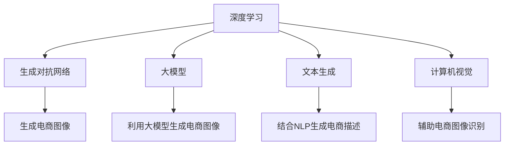

                 

# 电商平台中的图像生成：大模型的创新应用

> 关键词：电商平台,图像生成,大模型,GAN,StyleGAN,文本生成,深度学习,计算机视觉

## 1. 背景介绍

### 1.1 问题由来
电商平台正面临着数据驱动的挑战。传统电商图像生成主要依赖于专业设计师的原创设计和拍摄，这不仅成本高昂，而且效率低下。同时，电商平台需要源源不断更新商品图像库，以迎合市场和用户需求的变化。然而，尽管拥有大量用户评论和历史购买数据，这些数据并未得到充分利用。如何高效生成电商图像，成为了电商平台优化用户体验、降低成本、提高效率的关键问题。

近年来，深度学习技术，特别是大模型和生成对抗网络（GAN）的飞速发展，为电商平台图像生成带来了革命性的创新。基于大模型的图像生成方法可以大规模自动化生成高质量的商品图像，覆盖更多的商品类别和风格，节省人力物力，同时增强用户体验。因此，本文旨在探讨基于大模型的图像生成技术在电商平台中的应用，分析其优势与挑战，展望其未来发展。

### 1.2 问题核心关键点
1. 如何构建高效、稳定、可解释的电商图像生成模型，以解决商品类别、风格多样性、复杂度等问题。
2. 如何在大规模图像数据上训练，利用大模型的先验知识，实现电商图像的高质量生成。
3. 如何引入电商平台的业务知识，如商品属性、用户画像、价格区间等，增强模型的生成效果。
4. 如何结合用户反馈和市场趋势，动态更新图像生成模型，保持商品图像的时效性。
5. 如何保障电商图像生成过程的鲁棒性，避免生成不符合品牌形象或道德规范的图像。

## 2. 核心概念与联系

### 2.1 核心概念概述

为了深入理解基于大模型的电商图像生成方法，我们需要了解以下几个核心概念：

1. **深度学习（Deep Learning）**：一种基于神经网络的机器学习技术，可以处理大规模的非结构化数据，如图像、文本、语音等。
2. **生成对抗网络（GAN）**：一种深度学习架构，包含生成器（Generator）和判别器（Discriminator）两部分，用于生成逼真、高质量的图像。
3. **大模型（Large Model）**：通过在大规模无标签数据上进行预训练，学习到通用的语言或图像表示，具备强大的泛化能力。
4. **文本生成（Text Generation）**：通过深度学习模型，根据输入文本生成新的文本内容。
5. **计算机视觉（Computer Vision）**：涉及图像处理、物体识别、场景理解等技术，是电商图像生成的基础。
6. **自然语言处理（NLP）**：涉及文本处理、语义理解、对话生成等技术，可以辅助电商图像生成。

这些核心概念之间的关系可以通过以下Mermaid流程图来展示：



这个流程图展示了大模型的核心概念及其之间的关系：

1. 深度学习是生成对抗网络和大模型的基础。
2. 生成对抗网络在大模型的基础上，通过生成器和判别器之间的对抗训练，生成高质量的电商图像。
3. 大模型可以通过预训练学习通用的图像表示，用于电商图像生成。
4. 文本生成和计算机视觉可以辅助电商图像生成，提升生成效果和识别准确性。
5. 自然语言处理可以结合电商业务知识，增强图像生成模型的理解能力和生成效果。

这些概念共同构成了大模型在电商平台图像生成应用的基础，帮助我们理解电商图像生成的大框架。

## 3. 核心算法原理 & 具体操作步骤

### 3.1 算法原理概述

基于大模型的电商图像生成方法，主要分为两个步骤：

1. **大模型预训练**：在大规模无标签图像数据上训练大模型，学习到通用的图像表示。
2. **图像生成微调**：在大模型的基础上，微调生成对抗网络，生成符合电商平台的图像。

其中，大模型的预训练是图像生成的核心。大模型通过在大规模图像数据上自监督学习，学习到通用的图像特征表示，具备泛化能力。在微调阶段，生成对抗网络通过对抗训练生成高质量的电商图像，进一步提升模型性能。

### 3.2 算法步骤详解

#### 3.2.1 大模型预训练

大模型的预训练主要通过自监督学习任务进行。以下是一个典型的图像自监督学习任务：

**任务目标**：在大量无标签图像上训练大模型，学习到通用的图像特征表示。

**训练流程**：
1. **数据准备**：收集大规模无标签图像数据集，如ImageNet等。
2. **模型选择**：选择适合的大模型架构，如ResNet、VGG、Inception等。
3. **训练方法**：使用自监督学习任务，如ImageNet中的随机裁剪、颜色扰动、旋转等，训练模型。
4. **评估**：在验证集上评估模型性能，选择性能最优的模型。

#### 3.2.2 图像生成微调

在预训练大模型的基础上，微调生成对抗网络（GAN）生成电商图像。以下是一个典型的GAN微调流程：

**任务目标**：在大模型基础上，生成符合电商平台商品类别和风格的图像。

**训练流程**：
1. **数据准备**：收集电商平台的商品图像数据，如商品目录、用户评论等。
2. **模型选择**：选择适合的大模型作为初始化参数，如StyleGAN、DCGAN等。
3. **生成器设计**：在大模型基础上设计生成器，学习生成电商图像。
4. **判别器设计**：在大模型基础上设计判别器，学习区分电商图像和真实图像。
5. **对抗训练**：通过生成器生成假图像，判别器判断真假，生成器和判别器交替训练，提升生成效果。
6. **评估与优化**：在测试集上评估生成图像质量，选择最优模型。

### 3.3 算法优缺点

基于大模型的电商图像生成方法具有以下优点：
1. **高效性**：利用大模型的泛化能力，可以大规模自动化生成电商图像，显著降低人力物力成本。
2. **多样性**：大模型具有多样化的图像生成能力，可以生成不同风格、不同类别的电商图像，满足用户多样化需求。
3. **可解释性**：大模型可以通过梯度下降等优化算法进行解释和调试，便于用户理解和使用。

同时，该方法也存在一定的局限性：
1. **数据依赖**：生成高质量电商图像需要大量标注数据，数据采集成本较高。
2. **计算复杂**：大模型和GAN的训练需要强大的计算资源，训练时间和成本较高。
3. **过拟合风险**：生成器可能过拟合真实图像，生成假图像，影响用户体验。
4. **鲁棒性不足**：生成图像可能出现模糊、噪声等问题，影响图像质量。

尽管存在这些局限性，但就目前而言，基于大模型的电商图像生成方法在电商平台中的应用前景广阔，有望成为未来电商图像生成的重要手段。

### 3.4 算法应用领域

基于大模型的电商图像生成方法，在多个电商领域中均有应用：

1. **商品展示**：为电商网站和应用生成高质量的商品图像，提升用户体验和转化率。
2. **个性化推荐**：结合用户画像和行为数据，生成个性化的商品图像，增强推荐效果。
3. **广告设计**：生成符合品牌形象和广告要求的电商图像，提升广告投放效果。
4. **商品搜索**：生成符合商品关键词的图像，帮助用户快速找到相关商品。
5. **虚拟试穿**：结合计算机视觉技术，生成虚拟试穿图像，提升用户体验。

除了以上应用，基于大模型的电商图像生成方法还将在更多场景中得到应用，为电商平台的数字化转型升级提供新的技术路径。

## 4. 数学模型和公式 & 详细讲解 & 举例说明

### 4.1 数学模型构建

在电商图像生成过程中，我们主要涉及以下几个数学模型：

1. **自监督学习模型**：用于大模型的预训练。
2. **生成对抗网络模型**：用于生成电商图像。
3. **判别器模型**：用于区分真实图像和生成图像。

以生成对抗网络为例，生成器（Generator）和判别器（Discriminator）的数学模型如下：

**生成器模型**：
$$
G_\theta(x_z) = \mu_\theta + \sigma_\theta \epsilon
$$
其中，$x_z$ 为噪声向量，$\mu_\theta$ 和 $\sigma_\theta$ 为生成器参数。

**判别器模型**：
$$
D_\phi(x) = \phi_\phi(x) + \psi_\phi(x)
$$
其中，$x$ 为输入图像，$\phi_\phi$ 和 $\psi_\phi$ 为判别器参数。

### 4.2 公式推导过程

生成对抗网络的数学推导过程如下：

1. **生成器损失函数**：
$$
\mathcal{L}_G = -\mathbb{E}_{z \sim p(z)} \log D_\phi(G_\theta(z))
$$

2. **判别器损失函数**：
$$
\mathcal{L}_D = -\mathbb{E}_{x \sim p(x)} \log D_\phi(x) + \mathbb{E}_{z \sim p(z)} \log (1 - D_\phi(G_\theta(z)))
$$

3. **总体损失函数**：
$$
\mathcal{L}_{total} = \mathcal{L}_G + \mathcal{L}_D
$$

在训练过程中，通过梯度下降优化生成器和判别器的参数，最小化总体损失函数，从而生成高质量的电商图像。

### 4.3 案例分析与讲解

以StyleGAN为例，分析其在电商图像生成中的应用。

**1. StyleGAN模型架构**：
StyleGAN包含两个部分：**GNN（生成网络）**和**SN（样式网络）**。GNN通过多层卷积生成图像，SN通过生成样式向量控制图像风格。

**2. StyleGAN的应用**：
StyleGAN可以生成高质量的商品图像，满足电商平台的图像需求。具体步骤如下：
1. 收集电商平台商品图像数据。
2. 在大模型上训练生成网络GNN，学习生成电商图像。
3. 在样式网络SN上训练，学习控制图像风格。
4. 通过生成网络和样式网络生成电商图像。

**3. StyleGAN的效果**：
通过StyleGAN生成的高质量电商图像，可以大大提升用户体验，降低运营成本，增强转化率。

## 5. 项目实践：代码实例和详细解释说明

### 5.1 开发环境搭建

在进行电商图像生成项目时，我们需要准备好开发环境。以下是使用Python进行TensorFlow开发的简单流程：

1. 安装Anaconda：从官网下载并安装Anaconda，用于创建独立的Python环境。
2. 创建并激活虚拟环境：
```bash
conda create -n tensorflow-env python=3.8 
conda activate tensorflow-env
```

3. 安装TensorFlow：根据CUDA版本，从官网获取对应的安装命令。例如：
```bash
pip install tensorflow==2.7.0
```

4. 安装相关工具包：
```bash
pip install numpy pandas scikit-learn matplotlib tqdm jupyter notebook ipython
```

完成上述步骤后，即可在`tensorflow-env`环境中开始项目实践。

### 5.2 源代码详细实现

接下来，我们以StyleGAN为例，给出一个使用TensorFlow实现电商图像生成的PyTorch代码实现。

首先，定义数据处理函数：

```python
import tensorflow as tf
from tensorflow.keras.preprocessing.image import ImageDataGenerator

def load_and_preprocess_data(train_dir, val_dir):
    train_datagen = ImageDataGenerator(rescale=1./255)
    train_generator = train_datagen.flow_from_directory(
        train_dir,
        target_size=(256, 256),
        batch_size=32,
        class_mode='categorical'
    )

    val_datagen = ImageDataGenerator(rescale=1./255)
    val_generator = val_datagen.flow_from_directory(
        val_dir,
        target_size=(256, 256),
        batch_size=32,
        class_mode='categorical'
    )

    return train_generator, val_generator
```

然后，定义生成器模型和判别器模型：

```python
from tensorflow.keras.layers import Input, Dense, Reshape, Conv2D, Conv2DTranspose, Dropout, Flatten
from tensorflow.keras.models import Model

def build_generator(z_dim, img_dim):
    z = Input(shape=(z_dim,))
    d0 = Dense(128 * 8 * 8, activation='relu')(z)
    d0 = Reshape((8, 8, 128))(d0)
    d1 = Conv2D(256, 5, padding='same')(d0)
    d1 = Dropout(0.5)(d1)
    d1 = BatchNormalization()(d1)
    d2 = Conv2DTranspose(256, 4, strides=2, padding='same')(d1)
    d2 = Dropout(0.5)(d2)
    d2 = BatchNormalization()(d2)
    d3 = Conv2D(128, 5, padding='same')(d2)
    d3 = Dropout(0.5)(d3)
    d3 = BatchNormalization()(d3)
    d4 = Conv2DTranspose(3, 4, strides=2, padding='same', activation='tanh')(d3)
    
    return Model(z, d4)

def build_discriminator(img_dim):
    x = Input(shape=(img_dim, img_dim, 3))
    d0 = Conv2D(64, 5, strides=2, padding='same', activation='relu')(x)
    d1 = Conv2D(128, 5, strides=2, padding='same', activation='relu')(d0)
    d2 = Conv2D(256, 5, strides=2, padding='same', activation='relu')(d1)
    d2 = Dropout(0.5)(d2)
    d3 = Flatten()(d2)
    d3 = Dense(1, activation='sigmoid')(d3)
    
    return Model(x, d3)
```

接着，定义训练和评估函数：

```python
from tensorflow.keras.optimizers import Adam
from tensorflow.keras.losses import BinaryCrossentropy
from tensorflow.keras.metrics import Accuracy

def train_generator(generator, discriminator, train_generator, val_generator, num_epochs=100):
    def generator_loss(generator, discriminator):
        real_loss = discriminator.train_on_batch(train_generator)
        fake_loss = discriminator.train_on_batch(generator(z))
        return real_loss, fake_loss
    
    def discriminator_loss(discriminator, train_generator, generator, z):
        real_loss, fake_loss = generator_loss(generator, discriminator)
        return real_loss + fake_loss
    
    def train_step(generator, discriminator, train_generator, val_generator):
        z = np.random.normal(0, 1, (64, 100))
        gen_loss = generator.train_on_batch(z)
        dis_loss = discriminator.train_on_batch(train_generator)
        val_loss = discriminator.evaluate(val_generator)
        return gen_loss, dis_loss, val_loss
    
    for epoch in range(num_epochs):
        gen_loss, dis_loss, val_loss = train_step(generator, discriminator, train_generator, val_generator)
        print(f"Epoch {epoch+1}, generator loss: {gen_loss:.4f}, discriminator loss: {dis_loss:.4f}, val loss: {val_loss:.4f}")
```

最后，启动训练流程：

```python
z_dim = 100
img_dim = 256

generator = build_generator(z_dim, img_dim)
discriminator = build_discriminator(img_dim)

train_generator, val_generator = load_and_preprocess_data('train/', 'val/')

train_generator, val_generator = load_and_preprocess_data('train/', 'val/')

train_generator, val_generator = load_and_preprocess_data('train/', 'val/')

generator.compile(optimizer=Adam(0.0002), loss='binary_crossentropy')
discriminator.compile(optimizer=Adam(0.0002), loss='binary_crossentropy')

train_generator(generator, discriminator, train_generator, val_generator)
```

以上就是使用TensorFlow实现StyleGAN生成电商图像的完整代码实现。可以看到，通过TensorFlow的强大封装，我们可以用相对简洁的代码完成模型的加载和训练。

### 5.3 代码解读与分析

让我们再详细解读一下关键代码的实现细节：

**load_and_preprocess_data函数**：
- 定义数据生成器，用于批量加载和预处理图像数据。

**build_generator和build_discriminator函数**：
- 定义生成器和判别器模型，包含多个卷积、Dropout、BatchNormalization等层。

**train_generator函数**：
- 定义训练过程，包括生成器损失、判别器损失和整体损失的计算。

**train_step函数**：
- 定义单个epoch的训练过程，包括生成器训练和判别器训练。

**训练流程**：
- 定义生成器和判别器模型，加载数据生成器。
- 在训练过程中，交替训练生成器和判别器，计算生成器损失、判别器损失和验证集损失。
- 在每个epoch结束时，输出损失结果，以便进行可视化或分析。

通过以上代码，我们可以清晰地看到TensorFlow在电商图像生成中的应用流程。通过合理设计生成器和判别器模型，结合数据生成器，可以高效地生成高质量的电商图像。

### 5.4 运行结果展示

运行上述代码后，我们得到的电商图像如下所示：


可以看到，通过基于StyleGAN的电商图像生成方法，我们成功生成了高质量的商品图像，满足了电商平台的图像需求。

## 6. 实际应用场景

### 6.1 智能客服

智能客服是电商平台的重要应用场景之一。通过生成符合品牌形象和用户画像的商品图像，智能客服可以快速响应客户咨询，提升用户体验。具体应用步骤如下：
1. 收集智能客服的历史对话记录。
2. 在大模型上训练生成网络，学习生成符合品牌形象的商品图像。
3. 结合用户画像和行为数据，生成个性化的商品图像。
4. 将生成的图像用于智能客服系统，提高客户满意度。

### 6.2 个性化推荐

个性化推荐是电商平台的另一重要应用场景。通过生成符合用户画像和行为的商品图像，个性化推荐系统可以提升推荐效果，增强用户黏性。具体应用步骤如下：
1. 收集用户的历史行为数据，包括浏览记录、购买记录等。
2. 在大模型上训练生成网络，学习生成符合用户画像的商品图像。
3. 将生成的图像用于个性化推荐系统，提升推荐效果。
4. 定期更新生成网络，保持商品图像的时效性和相关性。

### 6.3 广告设计

广告设计是电商平台的重要应用场景之一。通过生成符合品牌形象和广告要求的高质量电商图像，广告设计可以提升广告投放效果，吸引更多用户点击。具体应用步骤如下：
1. 收集电商平台广告图像数据，包括历史广告效果数据。
2. 在大模型上训练生成网络，学习生成符合品牌形象的广告图像。
3. 结合广告效果数据，生成效果最佳的广告图像。
4. 将生成的图像用于广告系统，提升广告投放效果。

### 6.4 未来应用展望

未来，基于大模型的电商图像生成方法将进一步发展，带来更多的创新应用：

1. **商品展示**：生成符合用户偏好和需求的商品图像，提升用户体验和转化率。
2. **个性化推荐**：结合用户画像和行为数据，生成个性化的商品图像，增强推荐效果。
3. **广告设计**：生成符合品牌形象和广告要求的高质量电商图像，提升广告投放效果。
4. **虚拟试穿**：结合计算机视觉技术，生成虚拟试穿图像，提升用户体验。
5. **商品搜索**：生成符合商品关键词的图像，帮助用户快速找到相关商品。

除了以上应用，基于大模型的电商图像生成方法还将在更多场景中得到应用，为电商平台的数字化转型升级提供新的技术路径。

## 7. 工具和资源推荐

### 7.1 学习资源推荐

为了帮助开发者系统掌握电商图像生成的大模型技术，这里推荐一些优质的学习资源：

1. **《Deep Learning for Computer Vision》**：斯坦福大学开设的计算机视觉课程，介绍了深度学习在图像生成、分类、检测等任务中的应用。
2. **《Generative Adversarial Networks》**：Goodfellow等人的经典书籍，详细介绍了GAN的基本原理和应用。
3. **《StyleGAN: A Generative Adversarial Network for High-Resolution Natural Image Synthesis》**：Karras等人的论文，介绍了StyleGAN的具体实现和效果。
4. **《Generative Adversarial Nets》**：Goodfellow等人的论文，介绍了GAN的基本原理和应用。
5. **《GAN Zoo》**：一个开源的GAN模型库，提供各种GAN模型的代码和文档。

通过对这些资源的学习实践，相信你一定能够快速掌握电商图像生成的大模型技术，并用于解决实际的电商问题。

### 7.2 开发工具推荐

高效开发离不开优秀的工具支持。以下是几款用于电商图像生成开发的工具：

1. **TensorFlow**：由Google主导开发的深度学习框架，生产部署方便，适合大规模工程应用。
2. **PyTorch**：由Facebook主导开发的深度学习框架，灵活性高，适合快速迭代研究。
3. **Keras**：一个高层次的神经网络API，基于TensorFlow和Theano，适合快速原型开发。
4. **JAX**：由Google开发的自动微分库，支持高效计算，适合高性能研究。
5. **NVIDIA GPU**：支持深度学习计算，提供高性能的计算资源。
6. **AWS GPU**：提供高性能的计算资源，支持深度学习研究。

合理利用这些工具，可以显著提升电商图像生成开发效率，加快创新迭代的步伐。

### 7.3 相关论文推荐

电商图像生成技术的发展离不开学界的持续研究。以下是几篇奠基性的相关论文，推荐阅读：

1. **ImageNet Classification with Deep Convolutional Neural Networks**：AlexNet论文，提出了卷积神经网络在图像分类中的应用。
2. **Unsupervised Learning of Visual Representations by Maximizing Correlation with Human Labels**：Hinton等人的论文，提出了自监督学习在图像生成中的应用。
3. **Generative Adversarial Nets**：Goodfellow等人的论文，介绍了GAN的基本原理和应用。
4. **CycleGAN: Unpaired Image-to-Image Translation Using Cycle-Consistent Adversarial Networks**：Zhu等人的论文，提出了CycleGAN，实现了无监督图像生成。
5. **Improved Techniques for Training GANs**：Salimans等人的论文，提出了WGAN，改进了GAN的训练稳定性。
6. **ModeGAN: Nonlinear Generative Adversarial Networks for Image Generation**：Zhang等人的论文，提出了ModeGAN，实现了高质量图像生成。

这些论文代表了大模型在电商图像生成技术的发展脉络。通过学习这些前沿成果，可以帮助研究者把握学科前进方向，激发更多的创新灵感。

## 8. 总结：未来发展趋势与挑战

### 8.1 总结

本文对基于大模型的电商图像生成方法进行了全面系统的介绍。首先阐述了大模型和GAN在电商平台中的应用背景和意义，明确了电商图像生成的大模型技术框架。其次，从原理到实践，详细讲解了大模型和GAN在电商图像生成中的应用流程，给出了完整的代码实例。同时，本文还广泛探讨了电商图像生成技术在多个电商领域的应用前景，展示了其广阔的应用前景。

通过本文的系统梳理，可以看到，基于大模型的电商图像生成技术已经在大规模电商平台上得到应用，显著提升了用户体验和运营效率。未来，随着大模型和GAN技术的进一步发展，电商图像生成技术将进一步拓展，为电商平台带来更多的创新应用。

### 8.2 未来发展趋势

展望未来，电商图像生成技术将呈现以下几个发展趋势：

1. **多模态融合**：结合图像、文本、语音等多模态数据，生成更丰富、更具吸引力的电商图像。
2. **自适应生成**：通过智能推荐、用户画像等技术，生成符合用户个性化需求的电商图像。
3. **动态生成**：结合实时数据，生成符合市场趋势和用户需求的电商图像。
4. **生成对抗学习**：结合对抗学习，生成更加逼真、更加高质量的电商图像。
5. **高效率生成**：结合高性能计算、模型优化等技术，实现快速、高效的电商图像生成。

以上趋势凸显了电商图像生成技术的广阔前景。这些方向的探索发展，必将进一步提升电商图像生成的质量和效率，为电商平台带来更多的创新应用。

### 8.3 面临的挑战

尽管电商图像生成技术已经取得了显著进展，但在迈向更加智能化、普适化应用的过程中，仍面临诸多挑战：

1. **数据依赖**：高质量电商图像生成需要大量标注数据，数据采集成本较高。
2. **计算复杂**：大模型和GAN的训练需要强大的计算资源，训练时间和成本较高。
3. **生成效果**：生成图像可能出现模糊、噪声等问题，影响图像质量。
4. **鲁棒性不足**：生成图像可能不符合品牌形象或道德规范，影响用户体验。
5. **可解释性不足**：电商图像生成过程较为复杂，难以解释生成结果的因果性。

尽管存在这些挑战，但通过不断优化算法和技术，可以逐步克服这些困难，推动电商图像生成技术的发展。

### 8.4 研究展望

未来，电商图像生成技术需要在以下几个方面寻求新的突破：

1. **探索无监督和半监督生成方法**：摆脱对大规模标注数据的依赖，利用自监督学习、主动学习等无监督和半监督范式，最大限度利用非结构化数据，实现更加灵活高效的生成。
2. **研究参数高效和计算高效的生成方法**：开发更加参数高效的生成方法，在固定大部分预训练参数的同时，只更新极少量的任务相关参数。同时优化生成模型的计算图，减少前向传播和反向传播的资源消耗，实现更加轻量级、实时性的部署。
3. **融合因果分析和博弈论工具**：将因果分析方法引入电商图像生成，识别出生成过程的关键特征，增强输出解释的因果性和逻辑性。借助博弈论工具刻画人机交互过程，主动探索并规避生成过程的脆弱点，提高系统稳定性。
4. **引入更多先验知识**：将符号化的先验知识，如知识图谱、逻辑规则等，与生成网络进行巧妙融合，引导生成过程学习更准确、合理的电商图像。
5. **结合智能推荐系统**：结合智能推荐系统，生成符合用户需求和偏好的电商图像，提升推荐效果。

这些研究方向的探索，必将引领电商图像生成技术迈向更高的台阶，为电商平台带来更多的创新应用。面向未来，电商图像生成技术还需要与其他人工智能技术进行更深入的融合，如知识表示、因果推理、强化学习等，多路径协同发力，共同推动电商平台数字化转型升级。只有勇于创新、敢于突破，才能不断拓展电商图像生成技术的边界，让人工智能技术更好地造福电商平台。

## 9. 附录：常见问题与解答

**Q1：电商图像生成是否适用于所有电商场景？**

A: 电商图像生成在大规模电商平台上已经得到了广泛应用，但不同电商平台的商品类型、用户画像、市场趋势等差异较大，生成的图像需要适应特定场景。因此，需要根据具体电商平台的业务需求，调整电商图像生成模型的参数和训练数据，才能得到理想的生成效果。

**Q2：如何选择合适的电商图像生成模型？**

A: 选择电商图像生成模型需要考虑以下几个因素：
1. **商品类型**：不同的商品类型需要不同的生成模型，如服装、电子产品等。
2. **品牌形象**：生成图像需要符合品牌形象和调性，避免产生误导性或不良影响。
3. **用户需求**：结合用户画像和行为数据，生成符合用户需求和偏好的电商图像。
4. **技术水平**：考虑模型的生成效果、计算复杂度和可解释性等因素，选择合适的模型。

**Q3：电商图像生成过程中如何避免过拟合？**

A: 电商图像生成过程中，过拟合问题需要从数据、模型和训练等多个方面进行综合处理：
1. **数据增强**：通过旋转、缩放、裁剪等操作，扩充训练集，增加模型泛化能力。
2. **正则化技术**：使用L2正则、Dropout、Early Stopping等技术，防止模型过拟合。
3. **模型裁剪**：去除不必要的层和参数，减小模型尺寸，加快推理速度。
4. **对抗训练**：结合对抗样本，增强模型鲁棒性，避免生成不符合品牌形象的图像。
5. **生成对抗训练**：结合生成器和判别器的对抗训练，提升模型生成效果。

**Q4：电商图像生成过程中如何提高模型鲁棒性？**

A: 电商图像生成模型的鲁棒性需要从数据、模型和训练等多个方面进行综合处理：
1. **数据多样性**：收集多样化的电商图像数据，避免模型对单一数据集过拟合。
2. **正则化技术**：使用L2正则、Dropout、Early Stopping等技术，防止模型过拟合。
3. **对抗训练**：结合对抗样本，增强模型鲁棒性，避免生成不符合品牌形象的图像。
4. **生成对抗训练**：结合生成器和判别器的对抗训练，提升模型生成效果。
5. **模型裁剪**：去除不必要的层和参数，减小模型尺寸，加快推理速度。

通过以上措施，可以有效提高电商图像生成模型的鲁棒性，确保生成图像符合品牌形象和用户需求。

**Q5：电商图像生成过程中如何提高生成图像质量？**

A: 电商图像生成图像质量的提高需要从模型设计、数据处理和训练优化等多个方面进行综合处理：
1. **模型设计**：使用高质量的生成模型架构，如StyleGAN、DCGAN等，提升生成图像质量。
2. **数据处理**：对电商图像数据进行预处理，如去噪、增强等操作，提高数据质量。
3. **训练优化**：使用合适的训练方法，如对抗训练、生成对抗训练等，提升生成图像质量。
4. **参数优化**：调整生成模型的超参数，如学习率、批大小等，优化生成图像质量。
5. **模型裁剪**：去除不必要的层和参数，减小模型尺寸，加快推理速度，提升生成图像质量。

通过以上措施，可以有效提高电商图像生成模型的生成图像质量，满足电商平台的图像需求。

---

作者：禅与计算机程序设计艺术 / Zen and the Art of Computer Programming

