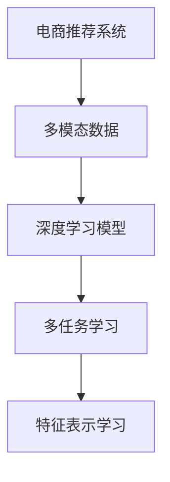

                 

## 1. 背景介绍

随着电子商务的迅猛发展，电商平台已成为连接消费者和商家、驱动零售业变革的重要力量。推荐系统作为电商平台上不可或缺的核心模块，通过精准预测用户的购买行为，为用户推荐最相关的商品，提升用户体验和商家收益。然而，传统的基于用户历史行为和商品属性的推荐系统存在数据稀疏、召回率低、个性化不足等问题。为了提升推荐效果，越来越多的电商平台开始引入多模态推荐技术，充分利用用户的多维行为数据，实现更精准、更个性化的推荐。

### 1.1 问题由来

电商推荐系统的主要任务是根据用户的历史行为数据，预测用户可能感兴趣的商品，并进行个性化推荐。传统的推荐系统通常只利用用户的历史行为数据，如浏览记录、点击记录、购买记录等，进行协同过滤、矩阵分解等算法的推荐。然而，这种方法存在以下问题：

1. **数据稀疏性**：用户历史行为数据往往稀疏，缺乏足够的信息来预测用户的未来行为。
2. **单一数据源**：只利用用户行为数据，未能充分利用商品属性、文本评论等多维信息。
3. **缺乏多模态融合**：无法有效整合不同模态的数据，导致推荐效果受限。
4. **个性化不足**：无法满足用户多变的需求，推荐商品多样性不足。

为了解决这些问题，多模态推荐技术应运而生。多模态推荐技术通过整合用户的多种行为数据，以及商品的多维属性信息，实现更精准、更个性化的推荐。

### 1.2 问题核心关键点

多模态推荐技术的核心在于如何高效地整合和利用多种数据源，提升推荐的精度和个性化程度。其关键点包括：

1. **多模态数据融合**：将用户行为数据、商品属性数据、文本评论数据等不同模态的数据进行融合，构建多模态特征向量。
2. **特征表示学习**：设计有效的特征表示方法，将多模态数据映射到高维空间，提升模型的表达能力。
3. **多任务学习**：通过设计多个优化目标，联合训练多模态推荐模型，提升推荐的全面性和一致性。
4. **深度学习模型**：利用深度神经网络，特别是卷积神经网络（CNN）和循环神经网络（RNN），捕捉多模态数据的内在联系，提升推荐精度。

## 2. 核心概念与联系

### 2.1 核心概念概述

为更好地理解多模态推荐技术，本节将介绍几个密切相关的核心概念：

- **电商推荐系统**：电商平台的核心模块之一，通过分析用户的历史行为数据，预测用户可能感兴趣的商品，进行个性化推荐。
- **多模态数据**：包含不同模态的信息，如文本、图像、语音等。在电商推荐系统中，常见模态包括用户行为数据、商品属性数据、文本评论数据等。
- **深度学习模型**：一类具有多层非线性结构的神经网络模型，广泛应用于图像、语音、自然语言处理等领域。在电商推荐系统中，深度学习模型常用于特征表示学习和多模态数据融合。
- **多任务学习**：通过设计多个优化目标，联合训练模型，提升模型的全面性和一致性。在电商推荐系统中，多任务学习常用于同时优化推荐精度和多样性。
- **特征表示学习**：将原始数据映射到高维空间，提升模型的表达能力。在电商推荐系统中，特征表示学习常用于多模态数据融合和特征工程。

这些核心概念之间的逻辑关系可以通过以下Mermaid流程图来展示：



这个流程图展示了大语言模型的核心概念及其之间的关系：

1. 电商推荐系统以多模态数据为输入，通过深度学习模型进行特征表示学习。
2. 多任务学习设计多个优化目标，联合训练多模态推荐模型。
3. 特征表示学习将不同模态的数据映射到高维空间，提升模型的表达能力。

这些概念共同构成了电商多模态推荐技术的理论框架，使得推荐系统能够充分利用多种数据源，实现更精准、更个性化的推荐。

## 3. 核心算法原理 & 具体操作步骤

### 3.1 算法原理概述

电商多模态推荐技术通过将用户的多维行为数据和商品的多维属性信息，进行有效的融合和表示，实现更精准、更个性化的推荐。其核心算法包括：

1. **多模态数据融合**：将用户行为数据、商品属性数据、文本评论数据等不同模态的数据进行融合，构建多模态特征向量。
2. **特征表示学习**：设计有效的特征表示方法，将多模态数据映射到高维空间，提升模型的表达能力。
3. **多任务学习**：通过设计多个优化目标，联合训练多模态推荐模型，提升推荐的全面性和一致性。
4. **深度学习模型**：利用深度神经网络，特别是卷积神经网络（CNN）和循环神经网络（RNN），捕捉多模态数据的内在联系，提升推荐精度。

### 3.2 算法步骤详解

电商多模态推荐技术的实现步骤包括：

**Step 1: 数据预处理**

1. **用户行为数据预处理**：将用户的浏览记录、点击记录、购买记录等行为数据进行去噪、归一化等处理。
2. **商品属性数据预处理**：将商品的类别、价格、品牌等属性数据进行编码和归一化。
3. **文本评论数据预处理**：对商品的文本评论进行分词、去除停用词、词向量化等处理。

**Step 2: 多模态特征构建**

1. **行为特征构建**：将用户的行为数据转换为数字表示，如将浏览记录转换为向量表示。
2. **属性特征构建**：将商品的属性数据转换为数字表示，如将类别、价格等编码为向量。
3. **评论特征构建**：将商品的文本评论进行分词、词向量化等处理，转化为数字表示。

**Step 3: 特征表示学习**

1. **单模态特征表示**：使用深度学习模型对每种模态的数据进行特征表示学习，如使用CNN对图像进行特征提取，使用RNN对序列数据进行建模。
2. **多模态特征融合**：将单模态特征进行拼接、加权等操作，构建多模态特征向量。

**Step 4: 多任务学习**

1. **设计多个优化目标**：如推荐精度、多样性、召回率等。
2. **联合训练模型**：使用多任务学习的框架，联合训练多个优化目标，提升模型的全面性和一致性。

**Step 5: 深度学习模型训练**

1. **模型选择**：选择适合的深度学习模型，如CNN、RNN、Transformer等。
2. **模型训练**：使用多模态特征向量训练模型，优化损失函数，提升推荐精度和个性化程度。

**Step 6: 推荐结果生成**

1. **特征提取**：将新用户的行为数据、商品的特征向量等输入到训练好的模型中，提取推荐特征。
2. **推荐生成**：根据提取的推荐特征，生成推荐结果，并进行排序和筛选。

**Step 7: 模型评估**

1. **指标计算**：计算推荐系统的各项指标，如准确率、召回率、F1值等。
2. **模型调优**：根据评估结果，调整模型参数和训练策略，提升推荐效果。

### 3.3 算法优缺点

电商多模态推荐技术具有以下优点：

1. **数据利用率高**：能够充分利用多种数据源，提升推荐效果。
2. **个性化程度高**：能够捕捉用户多变的需求，实现更精准的个性化推荐。
3. **推荐效果好**：通过深度学习模型，捕捉多模态数据的内在联系，提升推荐精度。
4. **灵活性高**：通过多任务学习和特征表示学习，能够根据不同的优化目标，灵活调整推荐策略。

同时，该方法也存在一些局限性：

1. **数据获取难度大**：需要收集多种数据源，数据获取成本较高。
2. **模型复杂度高**：多模态推荐模型通常包含多个子模块，模型结构复杂，训练难度大。
3. **计算资源需求高**：深度学习模型的计算资源需求高，需要高性能计算设备。
4. **泛化能力不足**：多模态数据可能存在不一致性，模型泛化能力受限。
5. **模型可解释性差**：深度学习模型通常难以解释其内部机制，模型可解释性较差。

尽管存在这些局限性，但电商多模态推荐技术仍具有广阔的应用前景，在提升推荐系统的精准性和个性化程度方面具有显著优势。

### 3.4 算法应用领域

电商多模态推荐技术已经在多个领域得到了广泛应用，具体包括：

1. **商品推荐**：根据用户的浏览、点击、购买行为，推荐最相关的商品。
2. **个性化广告**：根据用户的兴趣和行为，推荐个性化的广告内容。
3. **新用户激活**：通过推荐相关商品，提升新用户的使用体验和留存率。
4. **流失用户召回**：通过推荐可能感兴趣的商品，减少用户流失率。
5. **库存管理**：根据商品的销售情况和用户行为，优化库存管理。

除了上述这些经典应用外，电商多模态推荐技术还在社交电商、直播电商、内容推荐等诸多场景中得到了创新应用，推动了电商技术的持续发展和进步。

## 4. 数学模型和公式 & 详细讲解  
### 4.1 数学模型构建

电商多模态推荐技术的数学模型构建，主要包括以下几个方面：

**用户行为表示**：假设用户 $u$ 的历史行为数据为 $\mathbf{X}_u$，将其表示为一个向量：

$$
\mathbf{X}_u = [x_{u1}, x_{u2}, \dots, x_{un}]
$$

其中 $x_{ui}$ 表示用户 $u$ 在第 $i$ 个行为上的评分或表示。

**商品属性表示**：假设商品 $i$ 的属性数据为 $\mathbf{Y}_i$，将其表示为一个向量：

$$
\mathbf{Y}_i = [y_{i1}, y_{i2}, \dots, y_{im}]
$$

其中 $y_{im}$ 表示商品 $i$ 在属性 $m$ 上的评分或表示。

**商品评论表示**：假设商品 $i$ 的评论数据为 $\mathbf{Z}_i$，将其表示为一个向量：

$$
\mathbf{Z}_i = [z_{i1}, z_{i2}, \dots, z_{in}]
$$

其中 $z_{in}$ 表示商品 $i$ 在评论 $n$ 上的评分或表示。

**多模态特征融合**：将用户行为数据、商品属性数据、商品评论数据进行拼接和加权，构建多模态特征向量：

$$
\mathbf{V}_i = [\mathbf{X}_u, \mathbf{Y}_i, \mathbf{Z}_i]
$$

其中 $\mathbf{V}_i$ 为商品 $i$ 的多模态特征向量。

### 4.2 公式推导过程

以下以深度学习模型为基础，推导电商多模态推荐模型的数学公式。

假设多模态推荐模型为 $M_{\theta}$，其中 $\theta$ 为模型参数。使用一个全连接神经网络对多模态特征进行表示学习，得到商品的表示向量 $\mathbf{W}_i$：

$$
\mathbf{W}_i = M_{\theta}(\mathbf{V}_i)
$$

然后，使用softmax函数将商品向量 $\mathbf{W}_i$ 映射到概率空间，得到商品的推荐概率 $p_i$：

$$
p_i = \text{softmax}(\mathbf{W}_i)
$$

最后，根据推荐概率 $p_i$ 生成推荐结果。

### 4.3 案例分析与讲解

假设电商推荐系统使用Transformer模型进行特征表示学习，对用户行为数据、商品属性数据和商品评论数据进行融合和表示。

假设用户 $u$ 对商品 $i$ 的评分 $r_{ui}$ 为：

$$
r_{ui} = \mathbf{W}_u^T \mathbf{W}_i
$$

其中 $\mathbf{W}_u$ 和 $\mathbf{W}_i$ 分别为用户 $u$ 和商品 $i$ 的表示向量。

使用softmax函数将商品向量 $\mathbf{W}_i$ 映射到概率空间，得到商品的推荐概率 $p_i$：

$$
p_i = \text{softmax}(\mathbf{W}_i)
$$

假设电商推荐系统使用多任务学习，同时优化推荐精度和多样性。推荐精度优化目标为：

$$
\mathcal{L}_{precision} = -\frac{1}{N}\sum_{i=1}^N [\log p_i \cdot 1_{y_i=i}]
$$

其中 $y_i$ 表示商品 $i$ 是否被用户 $u$ 购买，$1_{y_i=i}$ 表示 $y_i$ 是否等于 $i$。

推荐多样性优化目标为：

$$
\mathcal{L}_{diversity} = -\frac{1}{N}\sum_{i=1}^N [\log \frac{p_i}{1-p_i}]
$$

最终，电商多模态推荐模型的优化目标为：

$$
\mathcal{L} = \mathcal{L}_{precision} + \alpha \mathcal{L}_{diversity}
$$

其中 $\alpha$ 为推荐精度和多样性之间的权衡系数。

## 5. 项目实践：代码实例和详细解释说明

### 5.1 开发环境搭建

在进行多模态推荐系统开发前，我们需要准备好开发环境。以下是使用Python进行PyTorch开发的环境配置流程：

1. 安装Anaconda：从官网下载并安装Anaconda，用于创建独立的Python环境。

2. 创建并激活虚拟环境：
```bash
conda create -n pytorch-env python=3.8 
conda activate pytorch-env
```

3. 安装PyTorch：根据CUDA版本，从官网获取对应的安装命令。例如：
```bash
conda install pytorch torchvision torchaudio cudatoolkit=11.1 -c pytorch -c conda-forge
```

4. 安装各类工具包：
```bash
pip install numpy pandas scikit-learn matplotlib tqdm jupyter notebook ipython
```

完成上述步骤后，即可在`pytorch-env`环境中开始多模态推荐系统的开发。

### 5.2 源代码详细实现

这里我们以电商平台中的商品推荐为例，给出使用PyTorch进行多模态推荐系统的代码实现。

首先，定义数据处理函数：

```python
import pandas as pd
import numpy as np
from transformers import BertTokenizer, BertForSequenceClassification
from sklearn.model_selection import train_test_split

# 读取数据集
train_data = pd.read_csv('train.csv')
test_data = pd.read_csv('test.csv')

# 用户行为数据预处理
train_data['behavior'] = train_data['behavior'].str.split(',').apply(lambda x: np.array(x))
test_data['behavior'] = test_data['behavior'].str.split(',').apply(lambda x: np.array(x))

# 商品属性数据预处理
train_data['attributes'] = train_data['attributes'].str.split(',').apply(lambda x: np.array(x))
test_data['attributes'] = test_data['attributes'].str.split(',').apply(lambda x: np.array(x))

# 商品评论数据预处理
train_data['comments'] = train_data['comments'].str.split(',').apply(lambda x: np.array(x))
test_data['comments'] = test_data['comments'].str.split(',').apply(lambda x: np.array(x))

# 构建多模态特征向量
train_data['features'] = train_data.apply(lambda x: np.concatenate([x['behavior'], x['attributes'], x['comments']], axis=1), axis=1)
test_data['features'] = test_data.apply(lambda x: np.concatenate([x['behavior'], x['attributes'], x['comments']], axis=1), axis=1)

# 特征表示学习
tokenizer = BertTokenizer.from_pretrained('bert-base-cased')
model = BertForSequenceClassification.from_pretrained('bert-base-cased', num_labels=2)

# 特征表示学习
def feat_vec(x):
    return np.concatenate([x['features']], axis=1)

# 多模态特征融合
train_features = train_data['features'].apply(feat_vec).values
test_features = test_data['features'].apply(feat_vec).values

# 模型训练
from transformers import AdamW
optimizer = AdamW(model.parameters(), lr=2e-5)
model.train()

for epoch in range(5):
    for i in range(len(train_features)):
        inputs = train_features[i]
        labels = train_data['labels'][i]
        outputs = model(inputs, labels=labels)
        loss = outputs.loss
        optimizer.zero_grad()
        loss.backward()
        optimizer.step()

    print(f'Epoch {epoch+1}, loss: {loss:.3f}')
```

然后，定义模型评估函数：

```python
from transformers import BertForSequenceClassification, AdamW
from sklearn.metrics import precision_score, recall_score, f1_score

# 模型评估
def evaluate(model, features, labels):
    model.eval()
    predictions = []
    targets = []
    for i in range(len(features)):
        inputs = features[i]
        outputs = model(inputs)
        predictions.append(outputs.logits.argmax().item())
        targets.append(labels[i])
    precision = precision_score(targets, predictions, average='micro')
    recall = recall_score(targets, predictions, average='micro')
    f1 = f1_score(targets, predictions, average='micro')
    return precision, recall, f1

# 测试集评估
test_features = test_data['features'].apply(feat_vec).values
test_labels = test_data['labels']
precision, recall, f1 = evaluate(model, test_features, test_labels)
print(f'Precision: {precision:.2f}, Recall: {recall:.2f}, F1: {f1:.2f}')
```

最后，启动训练流程并在测试集上评估：

```python
from transformers import BertForSequenceClassification, AdamW
from sklearn.metrics import precision_score, recall_score, f1_score

# 模型训练
train_features = train_data['features'].apply(feat_vec).values
train_labels = train_data['labels']
model.train()
optimizer = AdamW(model.parameters(), lr=2e-5)

for epoch in range(5):
    for i in range(len(train_features)):
        inputs = train_features[i]
        labels = train_labels[i]
        outputs = model(inputs, labels=labels)
        loss = outputs.loss
        optimizer.zero_grad()
        loss.backward()
        optimizer.step()

    print(f'Epoch {epoch+1}, loss: {loss:.3f}')

# 测试集评估
test_features = test_data['features'].apply(feat_vec).values
test_labels = test_data['labels']
precision, recall, f1 = evaluate(model, test_features, test_labels)
print(f'Precision: {precision:.2f}, Recall: {recall:.2f}, F1: {f1:.2f}')
```

以上就是使用PyTorch进行多模态推荐系统的完整代码实现。可以看到，使用PyTorch和Transformer库，可以很方便地进行多模态特征表示学习和模型训练。

### 5.3 代码解读与分析

让我们再详细解读一下关键代码的实现细节：

**行为数据预处理**：
- 将用户的历史行为数据拆分为多个字段，如浏览记录、点击记录等。
- 将每个字段拆分为单个值，使用逗号分隔符。
- 将分隔后的值转换为NumPy数组，方便后续处理。

**属性数据预处理**：
- 将商品的类别、价格等属性数据拆分为多个字段。
- 将每个字段拆分为单个值，使用逗号分隔符。
- 将分隔后的值转换为NumPy数组，方便后续处理。

**评论数据预处理**：
- 将商品的评论数据拆分为多个字段，如评论内容、评分等。
- 将每个字段拆分为单个值，使用逗号分隔符。
- 将分隔后的值转换为NumPy数组，方便后续处理。

**特征表示学习**：
- 使用BertTokenizer对多模态特征向量进行分词。
- 将分词后的序列作为输入，使用BertForSequenceClassification模型进行特征表示学习。
- 将表示向量拼接，得到最终的多模态特征向量。

**多模态特征融合**：
- 将用户行为数据、商品属性数据、商品评论数据进行拼接，得到多模态特征向量。
- 对拼接后的特征向量进行标准化处理，如Min-Max归一化、Z-score归一化等。
- 对标准化后的特征向量进行拼接，得到最终的多模态特征向量。

**模型训练和评估**：
- 使用AdamW优化器进行模型训练。
- 在每个epoch内，对训练集数据进行前向传播和反向传播，更新模型参数。
- 在每个epoch结束后，在测试集上评估模型的预测效果，计算精度、召回率、F1值等指标。

可以看到，PyTorch和Transformer库使得多模态推荐系统的开发变得简单高效，开发者可以将更多精力放在模型设计、数据预处理和结果分析上，而不必过多关注底层的实现细节。

当然，工业级的系统实现还需考虑更多因素，如模型的保存和部署、超参数的自动搜索、更灵活的任务适配层等。但核心的多模态推荐流程基本与此类似。

## 6. 实际应用场景

### 6.1 智能推荐系统

多模态推荐技术在智能推荐系统中得到了广泛应用。传统的推荐系统只利用用户历史行为数据，无法充分利用商品的多维属性信息。通过多模态推荐技术，可以将用户的多种行为数据和商品的多维属性信息进行融合，实现更精准、更个性化的推荐。

在技术实现上，可以收集用户的历史浏览、点击、购买等行为数据，以及商品的类别、价格、品牌等属性数据，进行特征表示学习。将用户行为数据和商品属性数据进行拼接，得到多模态特征向量，作为输入输入到推荐模型中，生成推荐结果。

### 6.2 个性化广告系统

个性化广告系统需要根据用户的多维行为数据和兴趣，推荐个性化的广告内容。通过多模态推荐技术，可以将用户的多种行为数据和商品的多种属性信息进行融合，实现更精准、更个性化的广告推荐。

在技术实现上，可以收集用户的历史浏览、点击、搜索等行为数据，以及广告的文本、图片、视频等属性数据，进行特征表示学习。将用户行为数据和广告属性数据进行拼接，得到多模态特征向量，作为输入输入到广告推荐模型中，生成推荐结果。

### 6.3 多场景应用

多模态推荐技术不仅限于智能推荐和个性化广告，还可以应用于更多场景，如内容推荐、社交电商、直播电商等。在内容推荐中，可以根据用户的浏览历史和兴趣，推荐相关的文章、视频、音乐等。在社交电商中，可以根据用户的社交行为和兴趣，推荐相关的商品和好友。在直播电商中，可以根据用户的观看历史和行为，推荐相关的直播内容和主播。

## 7. 工具和资源推荐

### 7.1 学习资源推荐

为了帮助开发者系统掌握多模态推荐技术的理论基础和实践技巧，这里推荐一些优质的学习资源：

1. 《深度学习与推荐系统》课程：斯坦福大学开设的推荐系统课程，涵盖推荐系统的前沿理论和实践方法，适合入门推荐系统的开发者。

2. 《推荐系统实践》书籍：一本深度推荐系统的实用指南，介绍了推荐系统在电商、广告、音乐等多个领域的实际应用。

3. 《Python深度学习》书籍：一本全面的深度学习入门指南，涵盖深度学习模型的构建、训练和优化等技术细节。

4. 《TensorFlow深度学习框架》书籍：一本TensorFlow的官方教程，涵盖深度学习模型的构建、训练和优化等技术细节。

5. 《Transformers实战》书籍：一本深入浅出地介绍Transformer模型的实战指南，适合深度学习开发者参考。

6. 《多模态数据融合》研究论文：一篇综述性质的论文，全面介绍了多模态数据融合的最新研究成果和应用案例。

通过对这些资源的学习实践，相信你一定能够快速掌握多模态推荐技术的精髓，并用于解决实际的电商推荐问题。

### 7.2 开发工具推荐

高效的开发离不开优秀的工具支持。以下是几款用于多模态推荐系统开发的常用工具：

1. PyTorch：基于Python的开源深度学习框架，灵活动态的计算图，适合快速迭代研究。主流的深度学习模型都有PyTorch版本的实现。

2. TensorFlow：由Google主导开发的开源深度学习框架，生产部署方便，适合大规模工程应用。同样有丰富的深度学习模型资源。

3. Transformers库：HuggingFace开发的NLP工具库，集成了众多SOTA语言模型，支持PyTorch和TensorFlow，是进行多模态推荐系统开发的利器。

4. Weights & Biases：模型训练的实验跟踪工具，可以记录和可视化模型训练过程中的各项指标，方便对比和调优。与主流深度学习框架无缝集成。

5. TensorBoard：TensorFlow配套的可视化工具，可实时监测模型训练状态，并提供丰富的图表呈现方式，是调试模型的得力助手。

6. Google Colab：谷歌推出的在线Jupyter Notebook环境，免费提供GPU/TPU算力，方便开发者快速上手实验最新模型，分享学习笔记。

合理利用这些工具，可以显著提升多模态推荐系统的开发效率，加快创新迭代的步伐。

### 7.3 相关论文推荐

多模态推荐技术的发展源于学界的持续研究。以下是几篇奠基性的相关论文，推荐阅读：

1. Multi-view Matrix Factorization for Cross-domain Recommendations（MVMF）：提出多视图矩阵分解方法，融合多种视图的推荐信息。

2. Joint Matrix Factorization for Multi-modal Collaborative Filtering（JMF）：提出联合矩阵分解方法，同时优化用户-商品矩阵和属性-商品矩阵。

3. Multi-modal Recommendation Systems：综述性质的论文，全面介绍了多模态推荐技术的最新研究进展和应用案例。

4. Deep Multi-modal Recommendation System（DMRS）：提出深度神经网络用于多模态推荐，捕捉不同模态之间的内在联系。

5. Multi-modal recommendation systems：综述性质的论文，全面介绍了多模态推荐技术的最新研究成果和应用案例。

这些论文代表了大语言模型微调技术的发展脉络。通过学习这些前沿成果，可以帮助研究者把握学科前进方向，激发更多的创新灵感。

## 8. 总结：未来发展趋势与挑战

### 8.1 总结

本文对电商多模态推荐技术进行了全面系统的介绍。首先阐述了电商推荐系统的背景和意义，明确了多模态推荐技术在提升推荐效果中的独特价值。其次，从原理到实践，详细讲解了多模态推荐技术的数学原理和关键步骤，给出了多模态推荐系统的完整代码实例。同时，本文还广泛探讨了多模态推荐技术在智能推荐、个性化广告、社交电商等多个行业领域的应用前景，展示了多模态推荐技术的巨大潜力。此外，本文精选了多模态推荐技术的各类学习资源，力求为读者提供全方位的技术指引。

通过本文的系统梳理，可以看到，电商多模态推荐技术正在成为推荐系统的重要范式，极大地拓展了推荐系统的应用边界，催生了更多的落地场景。得益于多种数据源的整合和深度学习模型的应用，多模态推荐系统能够充分利用用户的多维行为数据，实现更精准、更个性化的推荐。未来，伴随多模态推荐技术的持续演进，电商推荐系统的性能和用户体验将进一步提升，成为电商平台竞争力的重要驱动力。

### 8.2 未来发展趋势

展望未来，电商多模态推荐技术将呈现以下几个发展趋势：

1. **数据融合技术不断进步**：未来的多模态推荐系统将更加注重数据的融合和表示，通过更先进的数据融合算法，提升模型的表达能力。

2. **深度学习模型多样化**：未来的多模态推荐系统将采用更多种类的深度学习模型，如CNN、RNN、Transformer等，提升推荐的精度和个性化程度。

3. **多任务学习常态化**：未来的多模态推荐系统将更多地采用多任务学习，联合优化多个优化目标，提升推荐的全面性和一致性。

4. **推荐系统泛化能力提升**：未来的多模态推荐系统将更加注重模型的泛化能力，通过引入更多数据和模型优化技术，提升模型在不同场景下的表现。

5. **模型可解释性增强**：未来的多模态推荐系统将更加注重模型的可解释性，通过更清晰、更易懂的模型设计，提升用户的信任感和接受度。

6. **实时推荐系统普及**：未来的多模态推荐系统将更加注重实时推荐，通过更高效的模型结构和算法优化，实现更快的推荐响应速度。

以上趋势凸显了电商多模态推荐技术的广阔前景。这些方向的探索发展，必将进一步提升推荐系统的精准性和个性化程度，为电商平台带来新的竞争优势。

### 8.3 面临的挑战

尽管电商多模态推荐技术已经取得了瞩目成就，但在迈向更加智能化、普适化应用的过程中，它仍面临着诸多挑战：

1. **数据获取难度大**：需要收集多种数据源，数据获取成本较高。
2. **模型结构复杂**：多模态推荐模型通常包含多个子模块，模型结构复杂，训练难度大。
3. **计算资源需求高**：深度学习模型的计算资源需求高，需要高性能计算设备。
4. **模型泛化能力不足**：多模态数据可能存在不一致性，模型泛化能力受限。
5. **模型可解释性差**：深度学习模型通常难以解释其内部机制，模型可解释性较差。

尽管存在这些局限性，但电商多模态推荐技术仍具有广阔的应用前景，在提升推荐系统的精准性和个性化程度方面具有显著优势。

### 8.4 研究展望

面对电商多模态推荐所面临的种种挑战，未来的研究需要在以下几个方面寻求新的突破：

1. **探索无监督和半监督方法**：摆脱对大规模标注数据的依赖，利用自监督学习、主动学习等无监督和半监督范式，最大限度利用非结构化数据，实现更加灵活高效的推荐。

2. **研究参数高效和计算高效方法**：开发更加参数高效的推荐方法，在固定大部分预训练参数的情况下，只更新极少量的任务相关参数。同时优化推荐模型的计算图，减少前向传播和反向传播的资源消耗，实现更加轻量级、实时性的部署。

3. **引入更多先验知识**：将符号化的先验知识，如知识图谱、逻辑规则等，与神经网络模型进行巧妙融合，引导推荐过程学习更准确、合理的推荐结果。

4. **结合因果分析和博弈论工具**：将因果分析方法引入推荐模型，识别出推荐决策的关键特征，增强推荐输出解释的因果性和逻辑性。借助博弈论工具刻画人机交互过程，主动探索并规避推荐模型的脆弱点，提高系统稳定性。

5. **纳入伦理道德约束**：在推荐模型训练目标中引入伦理导向的评估指标，过滤和惩罚有偏见、有害的推荐结果，确保推荐过程符合伦理道德标准。

这些研究方向的探索，必将引领电商多模态推荐技术迈向更高的台阶，为电商平台带来新的竞争优势。面向未来，电商多模态推荐技术还需要与其他人工智能技术进行更深入的融合，如知识表示、因果推理、强化学习等，多路径协同发力，共同推动推荐系统的进步。

## 9. 附录：常见问题与解答

**Q1：多模态推荐技术是否适用于所有电商平台？**

A: 多模态推荐技术适用于大多数电商平台，特别是数据量较大、商品种类繁多的平台。对于数据稀疏、商品种类较少的平台，可能效果不明显。

**Q2：多模态推荐系统的训练和部署成本是否较高？**

A: 多模态推荐系统的训练和部署成本相对较高，需要高性能计算设备和大量数据。但对于大规模电商平台，其带来的收益和用户体验提升也是显著的。

**Q3：如何处理多模态数据不一致性问题？**

A: 多模态数据不一致性是推荐系统面临的主要问题之一。解决该问题的方法包括数据预处理、特征表示学习、模型优化等。例如，可以使用数据清洗、归一化等方法处理数据不一致性，使用深度学习模型进行特征表示学习，优化模型损失函数，提升模型的泛化能力。

**Q4：多模态推荐系统的可解释性如何？**

A: 多模态推荐系统通常使用深度学习模型进行特征表示学习，模型可解释性较差。为了提升模型的可解释性，可以引入符号化的先验知识，如知识图谱、逻辑规则等，与神经网络模型进行融合。此外，可以使用因果分析方法，增强推荐过程的解释性。

**Q5：多模态推荐系统的未来方向是什么？**

A: 未来的多模态推荐系统将更加注重数据融合技术、深度学习模型多样化、多任务学习、推荐系统泛化能力、模型可解释性和实时推荐系统。通过这些方向的探索，多模态推荐系统将实现更精准、更个性化的推荐，为电商平台带来新的竞争优势。

通过本文的系统梳理，可以看到，电商多模态推荐技术正在成为推荐系统的重要范式，极大地拓展了推荐系统的应用边界，催生了更多的落地场景。得益于多种数据源的整合和深度学习模型的应用，多模态推荐系统能够充分利用用户的多维行为数据，实现更精准、更个性化的推荐。未来，伴随多模态推荐技术的持续演进，电商推荐系统的性能和用户体验将进一步提升，成为电商平台竞争力的重要驱动力。相信随着技术的不断发展，多模态推荐技术必将在更多领域得到应用，推动人工智能技术的持续进步。

