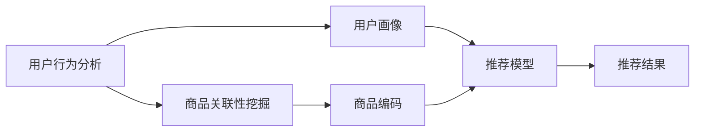

                 

# 电商平台中的多模态推荐技术

> 关键词：多模态推荐, 用户行为分析, 商品关联性挖掘, 推荐系统, 数据融合, 深度学习, 深度神经网络

## 1. 背景介绍

随着电子商务的发展，推荐系统已成为各大电商平台的核心竞争力之一。传统推荐系统基于用户行为和商品属性等单一模态数据，难以满足用户的多样化需求，推荐效果欠佳。多模态推荐系统通过综合利用用户行为、商品属性、社交网络、实时数据等多种信息，提升推荐精度和用户满意度。本文将介绍多模态推荐技术的基本原理、核心算法、应用实践及未来展望，为电商平台推荐系统提供参考。

## 2. 核心概念与联系

### 2.1 核心概念概述

- **多模态推荐(Multimodal Recommendation)**：利用多种模态数据（如文本、图像、音频、视频等）提升推荐系统效果的技术。
- **用户行为分析**：通过分析用户的点击、浏览、购买等行为数据，理解用户偏好和兴趣。
- **商品关联性挖掘**：识别商品间的相似性、互补性和关联性，增强推荐相关性。
- **推荐系统**：通过算法实现商品推荐，提升用户体验和平台收益。
- **数据融合(Data Fusion)**：将不同模态的数据整合在一起，形成统一、准确的知识表示。
- **深度学习(Deep Learning)**：通过多层神经网络进行特征提取和模式识别。
- **深度神经网络(Deep Neural Networks, DNNs)**：在推荐系统中，DNNs用于构建复杂的非线性映射，挖掘数据间的关系。

这些核心概念之间存在密切联系。多模态推荐技术通过整合多种数据源，利用深度学习技术，构建出高性能的推荐系统，提升用户体验和平台收益。

### 2.2 核心概念原理和架构的 Mermaid 流程图



这个流程图展示了多模态推荐系统的基本流程：
- 用户行为分析：通过分析用户行为数据，构建用户画像。
- 商品关联性挖掘：利用多种模态数据，挖掘商品间的关联关系，构建商品编码。
- 推荐模型：将用户画像和商品编码输入推荐模型，预测推荐结果。
- 推荐结果：根据预测结果生成推荐内容。

## 3. 核心算法原理 & 具体操作步骤

### 3.1 算法原理概述

多模态推荐算法旨在综合利用用户行为、商品属性、社交网络、实时数据等多种信息，提升推荐精度。其主要算法包括基于内容的推荐、协同过滤推荐、基于混合模型的推荐和深度学习推荐等。

### 3.2 算法步骤详解

以下以基于混合模型的推荐算法为例，详细讲解其具体操作步骤：

**Step 1: 数据预处理**

- 将不同模态数据进行统一表示。例如，将文本数据转换为向量表示，将图像数据提取特征向量，将用户行为数据构建用户画像。

**Step 2: 特征提取**

- 利用深度学习模型对不同模态数据进行特征提取。例如，使用卷积神经网络(CNN)提取图像特征，使用长短时记忆网络(LSTM)提取文本特征，使用用户画像数据作为特征输入。

**Step 3: 模型融合**

- 将不同模态的特征向量进行融合。例如，使用加权平均、拼接、注意力机制等方式将特征向量整合。

**Step 4: 推荐模型训练**

- 构建推荐模型并训练。例如，使用深度神经网络进行非线性拟合，训练推荐模型。

**Step 5: 推荐结果生成**

- 将用户画像和商品编码输入训练好的推荐模型，生成推荐结果。

### 3.3 算法优缺点

**优点：**
- 融合多种数据源，提升推荐效果。
- 深度学习模型具有强大的非线性拟合能力，可以挖掘复杂关系。
- 能够适应用户个性化需求，提升推荐精准度。

**缺点：**
- 数据源种类繁多，数据预处理复杂。
- 模型训练和推理计算量大，需要高性能计算资源。
- 特征提取和模型融合复杂，需要精细调参。

### 3.4 算法应用领域

多模态推荐技术广泛应用于以下领域：

- 电商平台：根据用户行为、商品属性、社交网络等数据，进行个性化推荐。
- 视频平台：利用用户观影行为、电影/电视剧评分、标签等信息，进行内容推荐。
- 音乐平台：根据用户听歌行为、音乐属性、社交网络等数据，进行个性化推荐。
- 智能家居：结合用户行为、设备属性、环境数据，进行场景推荐。
- 在线旅游：根据用户搜索行为、目的地评价、推荐系统历史数据，进行个性化推荐。

## 4. 数学模型和公式 & 详细讲解 & 举例说明

### 4.1 数学模型构建

多模态推荐系统的数学模型可以表示为：

$$
\begin{aligned}
\max_{\theta} \quad & \sum_{i=1}^{N} \log p_i(x_i) \\
\text{s.t.} \quad & p_i(x_i) = \prod_{k=1}^{K} p_k(x_i)
\end{aligned}
$$

其中，$N$ 表示用户数，$K$ 表示模态数，$\theta$ 为模型参数，$p_i(x_i)$ 表示用户 $i$ 对商品 $x_i$ 的兴趣概率。

### 4.2 公式推导过程

以基于混合模型的推荐算法为例，其公式推导如下：

$$
p_i(x_j) = \alpha \cdot p_{i,\text{user}}(x_j) + (1-\alpha) \cdot p_{i,\text{item}}(x_j)
$$

其中，$\alpha$ 为权重系数，$p_{i,\text{user}}(x_j)$ 和 $p_{i,\text{item}}(x_j)$ 分别表示用户 $i$ 对商品 $x_j$ 的兴趣概率，可以通过深度学习模型进行计算。

### 4.3 案例分析与讲解

假设某电商平台有1000名用户和10000个商品，用户 $i$ 对商品 $x_j$ 的兴趣概率可以表示为：

$$
p_i(x_j) = \alpha \cdot p_{i,\text{user}}(x_j) + (1-\alpha) \cdot p_{i,\text{item}}(x_j)
$$

其中，$p_{i,\text{user}}(x_j)$ 和 $p_{i,\text{item}}(x_j)$ 分别表示用户 $i$ 对商品 $x_j$ 的兴趣概率，可以通过深度学习模型进行计算。

## 5. 项目实践：代码实例和详细解释说明

### 5.1 开发环境搭建

在进行多模态推荐系统开发前，需要准备以下开发环境：

1. Python 3.8 及以上版本
2. TensorFlow 2.5 及以上版本
3. PyTorch 1.9 及以上版本
4. Keras 2.5 及以上版本
5. scikit-learn 0.24 及以上版本
6. pandas 1.1 及以上版本
7. numpy 1.20 及以上版本

在安装以上依赖后，可以开始多模态推荐系统的开发。

### 5.2 源代码详细实现

以下是基于混合模型的多模态推荐系统的 Python 代码实现：

```python
import tensorflow as tf
from tensorflow.keras import layers
import numpy as np

# 定义用户行为特征提取器
class UserFeatureExtractor(tf.keras.layers.Layer):
    def __init__(self, input_dim):
        super(UserFeatureExtractor, self).__init__()
        self.dense = layers.Dense(64, activation='relu')
        self.out = layers.Dense(1, activation='sigmoid')

    def call(self, inputs):
        x = self.dense(inputs)
        x = self.out(x)
        return x

# 定义商品属性特征提取器
class ItemFeatureExtractor(tf.keras.layers.Layer):
    def __init__(self, input_dim):
        super(ItemFeatureExtractor, self).__init__()
        self.dense = layers.Dense(64, activation='relu')
        self.out = layers.Dense(1, activation='sigmoid')

    def call(self, inputs):
        x = self.dense(inputs)
        x = self.out(x)
        return x

# 定义混合特征融合器
class FeatureFusion(tf.keras.layers.Layer):
    def __init__(self, alpha):
        super(FeatureFusion, self).__init__()
        self.alpha = tf.Variable(alpha, trainable=False)

    def call(self, inputs):
        user_feature, item_feature = inputs
        return self.alpha * user_feature + (1 - self.alpha) * item_feature

# 定义推荐模型
class RecommendationModel(tf.keras.Model):
    def __init__(self, user_feature_extractor, item_feature_extractor, feature_fusion):
        super(RecommendationModel, self).__init__()
        self.user_feature_extractor = user_feature_extractor
        self.item_feature_extractor = item_feature_extractor
        self.feature_fusion = feature_fusion
        self.regression = layers.Dense(1, activation='sigmoid')

    def call(self, inputs):
        user_feature = self.user_feature_extractor(inputs[0])
        item_feature = self.item_feature_extractor(inputs[1])
        fused_feature = self.feature_fusion([user_feature, item_feature])
        prediction = self.regression(fused_feature)
        return prediction

# 定义数据集
user_features = np.random.rand(1000, 16)
item_features = np.random.rand(10000, 16)
user_behavior = np.random.randint(0, 2, size=(1000, 1))
train_data = [(user_features, user_behavior)]

# 定义模型
model = RecommendationModel(
    UserFeatureExtractor(16),
    ItemFeatureExtractor(16),
    FeatureFusion(0.5)
)

# 编译模型
model.compile(optimizer='adam', loss='binary_crossentropy', metrics=['accuracy'])

# 训练模型
model.fit(train_data, epochs=10)

# 生成推荐结果
user_input = np.random.rand(1, 16)
item_input = np.random.rand(1, 16)
prediction = model.predict([user_input, item_input])
```

### 5.3 代码解读与分析

以上代码实现了基于混合模型的多模态推荐系统。具体步骤如下：

1. 定义用户行为特征提取器和商品属性特征提取器，分别用于提取用户行为和商品属性的特征。
2. 定义混合特征融合器，用于将用户行为特征和商品属性特征进行融合。
3. 定义推荐模型，将用户行为特征、商品属性特征和混合特征进行融合，得到推荐结果。
4. 编译模型，定义损失函数和优化器。
5. 训练模型，生成推荐结果。

## 6. 实际应用场景

### 6.1 电商平台推荐

电商平台推荐系统可以基于用户行为数据和商品属性数据进行推荐。例如，某用户经常购买运动鞋，平台可以推荐其他运动相关商品，如运动装备、运动饮料等。

### 6.2 社交网络推荐

社交网络推荐系统可以利用用户的社交网络关系和行为数据进行推荐。例如，某用户关注了某品牌，平台可以推荐该品牌的其他产品，或者该品牌同类的其他品牌。

### 6.3 视频平台推荐

视频平台推荐系统可以利用用户的观影行为和视频属性数据进行推荐。例如，某用户喜欢观看科幻电影，平台可以推荐其他科幻电影，或者该用户可能感兴趣的其他类型电影。

### 6.4 未来应用展望

未来，多模态推荐系统将在更多场景中得到应用，为电商、社交、视频等平台带来新的发展机遇。结合最新的人工智能技术，如强化学习、因果推断等，推荐系统将更加智能和个性化，提升用户体验和平台收益。

## 7. 工具和资源推荐

### 7.1 学习资源推荐

- TensorFlow官方文档：提供详细的TensorFlow教程和API文档。
- PyTorch官方文档：提供详细的PyTorch教程和API文档。
- Keras官方文档：提供详细的Keras教程和API文档。
- Coursera深度学习课程：由斯坦福大学教授Andrew Ng开设的深度学习课程，涵盖深度学习基础知识和实践技巧。
- Udacity深度学习专业：提供从基础到高级的深度学习课程，涵盖深度学习、计算机视觉、自然语言处理等方向。

### 7.2 开发工具推荐

- TensorFlow：开源深度学习框架，支持GPU加速，适用于大型深度学习模型。
- PyTorch：开源深度学习框架，灵活性和易用性高，适用于科研和工程开发。
- Keras：高层次深度学习API，易于上手，适用于快速原型开发和实验。
- Jupyter Notebook：交互式开发环境，支持代码编写和结果展示。
- Git：版本控制系统，支持多人协作开发和代码管理。

### 7.3 相关论文推荐

- "A Survey on Deep Learning-based Recommendation Systems"：综述了深度学习在推荐系统中的应用。
- "Neural Collaborative Filtering"：介绍了神经网络在协同过滤推荐系统中的应用。
- "Deep Fusion of Image and Text for Recommendation Systems"：介绍了多模态数据融合在推荐系统中的应用。
- "Contextual Bandits for Recommendation Systems"：介绍了强化学习在推荐系统中的应用。

## 8. 总结：未来发展趋势与挑战

### 8.1 研究成果总结

多模态推荐系统通过综合利用多种数据源，提升推荐精度和用户体验。深度学习技术在推荐系统中得到了广泛应用，显著提升了推荐效果。

### 8.2 未来发展趋势

未来，多模态推荐系统将更加智能和个性化。结合最新的人工智能技术，如强化学习、因果推断等，推荐系统将能够更好地理解用户需求，提供更加精准和个性化的推荐。

### 8.3 面临的挑战

多模态推荐系统面临的数据复杂性和计算资源消耗等挑战。如何在保证推荐效果的同时，优化计算资源和提高模型效率，将是未来的重要研究方向。

### 8.4 研究展望

未来，多模态推荐系统将与更多智能技术融合，如自然语言处理、计算机视觉、语音识别等。通过多技术协同，构建更加强大和智能的推荐系统，为用户提供更好的购物体验。

## 9. 附录：常见问题与解答

**Q1：多模态推荐系统需要哪些数据源？**

A: 多模态推荐系统需要多种数据源，包括但不限于：
- 用户行为数据：点击、浏览、购买、评分等。
- 商品属性数据：类别、品牌、价格、描述等。
- 社交网络数据：关注、好友、评论等。
- 实时数据：实时点击流、推荐效果反馈等。

**Q2：多模态推荐系统如何使用深度学习技术？**

A: 深度学习技术在多模态推荐系统中的应用主要包括以下几个方面：
- 特征提取：利用深度神经网络对不同模态数据进行特征提取。
- 模型融合：将不同模态的特征向量进行融合，形成统一的表示。
- 推荐模型训练：构建推荐模型，并利用深度学习算法进行训练。
- 推荐结果生成：根据训练好的推荐模型，生成推荐结果。

**Q3：多模态推荐系统如何优化计算资源？**

A: 优化计算资源是多模态推荐系统的重要研究方向。具体方法包括：
- 数据压缩：对数据进行压缩，减少存储空间和传输带宽。
- 模型压缩：对模型进行压缩，减小计算复杂度和内存消耗。
- 分布式计算：利用分布式计算框架，加速模型训练和推理。
- 硬件加速：利用GPU、TPU等硬件设备，提高计算速度和效率。

**Q4：多模态推荐系统如何提高推荐效果？**

A: 提高推荐效果是多模态推荐系统的重要目标。具体方法包括：
- 数据融合：利用多种数据源，综合提升推荐精度。
- 深度学习：利用深度神经网络，提取复杂特征和模式。
- 推荐算法：选择适合的数据模型和算法，提升推荐效果。
- 用户反馈：利用用户反馈数据，优化推荐算法和模型。

通过不断优化计算资源和推荐算法，多模态推荐系统将在未来发挥更大的作用，提升用户体验和平台收益。

