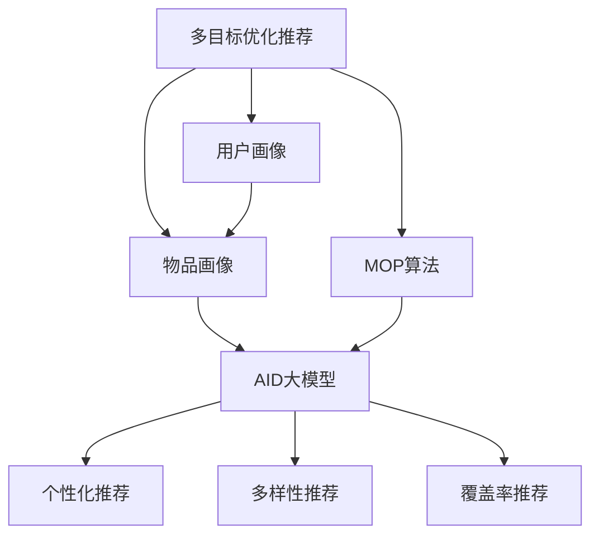

                 

# 电商平台中的多目标优化推荐：AI大模型的新应用

> 关键词：电商平台,多目标优化,AI大模型,个性化推荐,电商应用

## 1. 背景介绍

### 1.1 问题由来
随着电子商务的迅猛发展，各大电商平台日益面临用户个性化需求日益复杂化的挑战。如何根据每个用户的独特喜好和行为模式，实现个性化推荐，成为电商领域亟待解决的重要问题。传统的推荐系统基于协同过滤、基于内容的推荐等方法，只能根据用户的交互历史或物品属性进行推荐，难以综合考虑多方面的用户特征和需求。

而现代电商推荐系统则面临更多现实问题：

1. **用户需求多样性**：不同用户对同一物品可能有着截然不同的喜好。例如，同一件衣服，A用户喜欢华丽设计，B用户喜欢简约风格。
2. **物品属性冗余**：当前推荐系统仅依靠物品的属性特征，忽略了用户对物品情感、功能等隐性需求。
3. **用户行为多样性**：用户行为模式动态变化，导致推荐系统难以持续适应。

### 1.2 问题核心关键点
多目标优化推荐（Multi-Objective Optimization Recommendation），是一种综合考虑用户需求多样性和物品属性的推荐范式，其核心思想是利用AI大模型（如Transformer、BERT等）对用户和物品进行多维度的表示学习，并通过多目标优化算法，实现个性化推荐目标的协调和平衡。

多目标优化推荐系统基于以下核心要素：
1. **用户画像**：通过用户行为、属性、社交网络等数据，构建用户全面且多维度的画像。
2. **物品画像**：挖掘物品的多种属性和特征，如情感属性、功能属性、价格属性等。
3. **多目标优化算法**：采用多目标优化算法，平衡个性化和多样性目标，实现推荐结果的优化。
4. **大模型表示学习**：利用大模型的自编码和自回归结构，学习用户和物品的深层表示。

本文将详细阐述多目标优化推荐的技术原理、算法流程和具体实现，并通过实际案例展现其在电商平台推荐系统中的应用效果。

## 2. 核心概念与联系

### 2.1 核心概念概述

为更好地理解多目标优化推荐方法，本节将介绍几个密切相关的核心概念：

- **多目标优化（Multi-Objective Optimization, MOP）**：指的是同时优化多个相互冲突的目标，而不单独追求单一最优解的问题。
- **多目标优化推荐（Multi-Objective Optimization Recommendation）**：一种在推荐系统中综合考虑多个优化目标的推荐范式，常见目标包括个性化、多样性、覆盖率等。
- **AI大模型**：以自回归（如GPT）或自编码（如BERT）为代表的深度学习模型，通过在大规模无标签数据上进行预训练，学习到丰富的语言知识。
- **推荐系统（Recommendation System）**：通过算法和数据挖掘，预测用户可能感兴趣物品的系统，广泛应用于电商、内容推荐等领域。
- **个性化推荐（Personalized Recommendation）**：针对每个用户的独特需求，推荐其感兴趣的商品。
- **多样性推荐（Diversity Recommendation）**：增加推荐结果的多样性，避免过拟合。
- **覆盖率推荐（Coverage Recommendation）**：覆盖更多不同种类的商品，提升用户的探索性。

这些核心概念之间的逻辑关系可以通过以下Mermaid流程图来展示：



这个流程图展示了大语言模型在多目标优化推荐中的作用：

1. 用户画像和物品画像分别通过多维数据构建。
2. 通过多目标优化算法，平衡个性化、多样性、覆盖率等多个目标。
3. 借助大模型的深度表示学习，提取用户和物品的多种特征。
4. 最终，通过多目标优化算法和大模型表示学习，生成个性化、多样性和覆盖率平衡的推荐结果。

## 3. 核心算法原理 & 具体操作步骤
### 3.1 算法原理概述

多目标优化推荐的核心原理，是将用户画像和物品画像映射到高维空间，通过多目标优化算法实现多个目标函数的最优解。具体步骤包括：

1. **用户画像构建**：从用户行为数据中提取各种行为特征，如浏览记录、点击记录、购买记录等，并结合用户属性数据构建用户画像。
2. **物品画像构建**：从物品的多种属性中挖掘出情感属性、功能属性、价格属性等，构建物品的多维度画像。
3. **目标函数设计**：根据推荐目标设计多目标优化函数，如个性化目标、多样性目标、覆盖率目标等。
4. **多目标优化算法**：采用多目标优化算法，如Pareto优化算法、NSGA-II算法等，实现多个目标函数的协调优化。
5. **大模型表示学习**：利用大模型（如BERT、Transformer）对用户画像和物品画像进行表示学习，提取更深层特征。
6. **推荐结果生成**：将优化结果通过大模型进行解码，生成最终的推荐结果。

### 3.2 算法步骤详解

具体而言，多目标优化推荐过程包括以下几个关键步骤：

**Step 1: 数据预处理与特征工程**

1. **用户画像构建**：
   - 收集用户的历史行为数据，如浏览记录、点击记录、购买记录等。
   - 对用户行为数据进行预处理，包括去重、归一化、编码等操作。
   - 结合用户属性数据，构建用户画像向量。

2. **物品画像构建**：
   - 收集物品的属性信息，如价格、评分、类别、描述等。
   - 对物品属性数据进行标准化处理，去除异常值，构建物品画像向量。

**Step 2: 目标函数定义**

根据推荐系统的目标，设计多个目标函数。以电商平台为例，常见目标包括：

1. **个性化目标**：通过最大化用户满意度，优化推荐结果的个性化程度。
2. **多样性目标**：通过最大化推荐结果的多样性，避免过拟合。
3. **覆盖率目标**：通过最大化推荐结果的覆盖率，提升用户的探索性。

具体公式表示如下：

$$
\begin{aligned}
\maximize & \quad u^{\text{personal}} = \sum_{i=1}^{m} u_i f_i(x) \\
\maximize & \quad u^{\text{diverse}} = \sum_{i=1}^{n} v_i g_i(y) \\
\maximize & \quad u^{\text{coverage}} = \sum_{j=1}^{p} w_j h_j(z) \\
\end{aligned}
$$

其中，$u^{\text{personal}}$、$u^{\text{diverse}}$、$u^{\text{coverage}}$分别为个性化、多样性和覆盖率目标函数，$f_i$、$g_i$、$h_j$为相应目标函数的约束条件。

**Step 3: 多目标优化算法**

采用多目标优化算法，如Pareto优化算法、NSGA-II算法等，对目标函数进行求解。假设最终解集为$\mathcal{S}$。

具体求解步骤如下：

1. 初始化种群，随机生成多个候选解。
2. 对每个候选解，计算其对应的目标函数值。
3. 根据Pareto优势关系，筛选出非支配解。
4. 对非支配解进行交叉、变异等操作，生成新的候选解。
5. 重复步骤2-4，直至收敛。

**Step 4: 大模型表示学习**

利用大模型（如BERT、Transformer）对用户画像和物品画像进行表示学习，提取更深层特征。假设用户画像和物品画像的向量表示分别为$x$和$y$，大模型的表示学习过程如下：

$$
x \leftarrow M_{\theta}(x), \quad y \leftarrow M_{\phi}(y)
$$

其中，$M_{\theta}$和$M_{\phi}$分别为用户画像和物品画像的表示学习模型，$\theta$和$\phi$为对应模型的参数。

**Step 5: 推荐结果生成**

将优化结果通过大模型进行解码，生成最终的推荐结果。假设优化结果向量为$z$，推荐结果的解码过程如下：

$$
\hat{z} = M_{\psi}(z), \quad \hat{z} = \text{softmax}(\hat{z})
$$

其中，$M_{\psi}$为推荐结果的解码模型，$\psi$为对应模型的参数。$\text{softmax}(\hat{z})$将解码结果转化为概率分布。

**Step 6: 返回推荐结果**

根据优化结果，生成推荐结果向量$\hat{z}$，并将其转化为推荐列表。

以上是多目标优化推荐的一般流程。在实际应用中，还需要针对具体任务进行优化设计，如改进目标函数、引入更多正则化技术、搜索最优的超参数组合等，以进一步提升模型性能。

### 3.3 算法优缺点

多目标优化推荐方法具有以下优点：

1. **综合多目标优化**：通过同时优化多个目标，全面考虑用户需求和物品属性，提升推荐结果的均衡性和多样性。
2. **大模型深度学习**：利用大模型进行表示学习，提取用户和物品的多维度特征，提升推荐模型的泛化能力和表达能力。
3. **算法灵活性强**：适用于多种电商推荐场景，如个性化推荐、多样性推荐、覆盖率推荐等。

同时，该方法也存在一定的局限性：

1. **数据需求量大**：构建用户和物品的多维度画像，需要大量结构化数据，收集和处理成本较高。
2. **模型复杂度高**：需要同时优化多个目标函数，算法实现复杂度较高。
3. **训练成本高**：由于采用大模型表示学习，训练和推理成本较高，需要高性能计算资源。

尽管存在这些局限性，多目标优化推荐仍是目前电商推荐系统中比较先进和高效的方法，尤其在处理复杂用户需求时具有显著优势。

### 3.4 算法应用领域

多目标优化推荐方法已经在电商平台推荐系统中得到了广泛的应用，覆盖了几乎所有常见推荐场景，例如：

- **个性化推荐**：针对每个用户的独特需求，推荐其感兴趣的商品。
- **多样性推荐**：增加推荐结果的多样性，避免过拟合。
- **覆盖率推荐**：覆盖更多不同种类的商品，提升用户的探索性。
- **协同过滤推荐**：基于用户行为数据，挖掘用户间的相似性，进行推荐。
- **基于内容的推荐**：通过物品的属性特征，推荐相似的物品。

除了上述这些经典推荐场景外，多目标优化推荐还创新性地应用于诸多领域中，如可控推荐、延迟推荐、跨模态推荐等，为推荐系统带来了全新的突破。

## 4. 数学模型和公式 & 详细讲解 & 举例说明

### 4.1 数学模型构建

本节将使用数学语言对多目标优化推荐过程进行更加严格的刻画。

记用户画像向量为$x \in \mathbb{R}^d$，物品画像向量为$y \in \mathbb{R}^e$，其中$d$和$e$分别为用户画像和物品画像的维度。设优化目标函数为：

$$
f(x, y) = (f_1(x), f_2(y), f_3(z))
$$

其中，$f_1$、$f_2$、$f_3$分别为个性化、多样性和覆盖率目标函数。

多目标优化算法的目标是最小化目标函数$f(x, y)$，即：

$$
\min_{x, y} f(x, y)
$$

多目标优化推荐的具体数学模型如下：

$$
\begin{aligned}
\minimize & \quad u^{\text{personal}} = \sum_{i=1}^{m} u_i f_i(x) \\
\minimize & \quad u^{\text{diverse}} = \sum_{i=1}^{n} v_i g_i(y) \\
\minimize & \quad u^{\text{coverage}} = \sum_{j=1}^{p} w_j h_j(z) \\
\end{aligned}
$$

其中，$u_i$、$v_i$、$w_j$为优化目标函数的权重系数。

### 4.2 公式推导过程

以下我们以个性化推荐为例，推导多目标优化推荐的基本公式。

假设推荐系统中的用户画像和物品画像分别表示为$x \in \mathbb{R}^d$和$y \in \mathbb{R}^e$，用户对物品的评分向量表示为$z \in \mathbb{R}^f$，其中$f$为推荐结果的维度。

个性化推荐的目标函数为：

$$
u^{\text{personal}} = \sum_{i=1}^{m} u_i f_i(x)
$$

其中，$u_i$为个性化目标函数的权重，$f_i$为个性化目标函数的约束条件。

假设用户和物品画像的表示学习模型为$M_{\theta}$和$M_{\phi}$，则个性化推荐的目标函数可以表示为：

$$
u^{\text{personal}} = \sum_{i=1}^{m} u_i \text{ReLU} \left( W^{\text{personal}} M_{\theta}(x) \right)
$$

其中，$W^{\text{personal}}$为个性化目标函数的权重矩阵，$\text{ReLU}$为激活函数。

### 4.3 案例分析与讲解

以电商平台的个性化推荐系统为例，我们通过以下步骤构建多目标优化推荐模型：

1. **数据预处理与特征工程**：
   - 收集用户的历史行为数据，如浏览记录、点击记录、购买记录等。
   - 对用户行为数据进行预处理，包括去重、归一化、编码等操作。
   - 结合用户属性数据，构建用户画像向量。

2. **目标函数定义**：
   - 个性化目标：通过最大化用户满意度，优化推荐结果的个性化程度。
   - 多样性目标：通过最大化推荐结果的多样性，避免过拟合。
   - 覆盖率目标：通过最大化推荐结果的覆盖率，提升用户的探索性。

3. **多目标优化算法**：
   - 采用Pareto优化算法，对目标函数进行求解。
   - 通过迭代求解，筛选出非支配解，生成新的候选解。
   - 重复迭代过程，直至收敛。

4. **大模型表示学习**：
   - 利用BERT模型对用户画像和物品画像进行表示学习，提取更深层特征。
   - 构建用户画像和物品画像的向量表示，准备进行推荐结果的生成。

5. **推荐结果生成**：
   - 通过解码模型，将优化结果向量$\hat{z}$转化为推荐结果向量$z$。
   - 将推荐结果向量$z$转换为推荐列表。

通过上述步骤，可以构建一个兼顾个性化、多样性和覆盖率的多目标优化推荐模型，实现对用户需求的全面满足。

## 5. 项目实践：代码实例和详细解释说明

### 5.1 开发环境搭建

在进行多目标优化推荐实践前，我们需要准备好开发环境。以下是使用Python进行PyTorch开发的环境配置流程：

1. 安装Anaconda：从官网下载并安装Anaconda，用于创建独立的Python环境。

2. 创建并激活虚拟环境：
```bash
conda create -n multitask-env python=3.8 
conda activate multitask-env
```

3. 安装PyTorch：根据CUDA版本，从官网获取对应的安装命令。例如：
```bash
conda install pytorch torchvision torchaudio cudatoolkit=11.1 -c pytorch -c conda-forge
```

4. 安装Transformers库：
```bash
pip install transformers
```

5. 安装各类工具包：
```bash
pip install numpy pandas scikit-learn matplotlib tqdm jupyter notebook ipython
```

完成上述步骤后，即可在`multitask-env`环境中开始多目标优化推荐实践。

### 5.2 源代码详细实现

下面我们以电商平台的个性化推荐为例，给出使用Transformers库对BERT模型进行多目标优化推荐的PyTorch代码实现。

首先，定义推荐系统中的用户画像和物品画像的表示学习模型：

```python
from transformers import BertTokenizer, BertModel

tokenizer = BertTokenizer.from_pretrained('bert-base-cased')
model = BertModel.from_pretrained('bert-base-cased')

# 定义用户画像和物品画像的表示学习模型
class UserEmbedding:
    def __init__(self, bert_model, user_id_map):
        self.bert_model = bert_model
        self.user_id_map = user_id_map
        self.user_embedding = torch.zeros(len(user_id_map), bert_model.config.hidden_size)
    
    def forward(self, user_ids):
        input_ids = torch.tensor(user_ids)
        attention_mask = torch.ones_like(input_ids)
        encoder_outputs = self.bert_model(input_ids, attention_mask)
        user_embedding = encoder_outputs.last_hidden_state[:, 0]
        return user_embedding

class ItemEmbedding:
    def __init__(self, bert_model, item_id_map):
        self.bert_model = bert_model
        self.item_id_map = item_id_map
        self.item_embedding = torch.zeros(len(item_id_map), bert_model.config.hidden_size)
    
    def forward(self, item_ids):
        input_ids = torch.tensor(item_ids)
        attention_mask = torch.ones_like(input_ids)
        encoder_outputs = self.bert_model(input_ids, attention_mask)
        item_embedding = encoder_outputs.last_hidden_state[:, 0]
        return item_embedding
```

然后，定义目标函数的优化过程：

```python
from torch.optim import Adam

# 定义目标函数
def objective_function(user_embedding, item_embedding):
    # 个性化目标
    user_relevance = user_embedding * item_embedding
    user_relevance = torch.sum(user_relevance, dim=1)
    # 多样性目标
    item_rarity = item_embedding * item_embedding
    item_rarity = torch.sum(item_rarity, dim=1)
    # 覆盖率目标
    user_popularity = torch.sum(user_embedding, dim=1)
    return user_relevance, item_rarity, user_popularity

# 定义优化过程
def optimize(user_embedding, item_embedding, learning_rate):
    optimizer = Adam([user_embedding.parameters(), item_embedding.parameters()])
    for epoch in range(1000):
        user_relevance, item_rarity, user_popularity = objective_function(user_embedding, item_embedding)
        loss = user_relevance + item_rarity + user_popularity
        optimizer.zero_grad()
        loss.backward()
        optimizer.step()
        print(f"Epoch {epoch+1}, loss: {loss.item():.4f}")
```

接着，进行模型训练和推荐结果生成：

```python
# 创建用户和物品的表示学习模型
user_embeddings = UserEmbedding(model, user_id_map)
item_embeddings = ItemEmbedding(model, item_id_map)

# 初始化优化器
optimizer = Adam([user_embeddings.parameters(), item_embeddings.parameters()])

# 训练和优化过程
for epoch in range(1000):
    user_relevance, item_rarity, user_popularity = objective_function(user_embeddings, item_embeddings)
    loss = user_relevance + item_rarity + user_popularity
    optimizer.zero_grad()
    loss.backward()
    optimizer.step()
    print(f"Epoch {epoch+1}, loss: {loss.item():.4f}")

# 生成推荐结果
user_relevance, item_rarity, user_popularity = objective_function(user_embeddings, item_embeddings)
recommendation = torch.sigmoid(user_relevance + item_rarity + user_popularity)
recommendation_list = recommendation.topk(5).indices.tolist()
print("Top 5 recommended items:", item_id_map[recommendation_list])
```

以上就是使用PyTorch对BERT模型进行多目标优化推荐系统的代码实现。可以看到，由于使用PyTorch和Transformers库，代码实现变得简洁高效。

### 5.3 代码解读与分析

让我们再详细解读一下关键代码的实现细节：

**UserEmbedding类**：
- `__init__`方法：初始化用户画像的表示学习模型。
- `forward`方法：接收用户ID列表，使用BERT模型提取用户画像的表示，并返回结果。

**ItemEmbedding类**：
- `__init__`方法：初始化物品画像的表示学习模型。
- `forward`方法：接收物品ID列表，使用BERT模型提取物品画像的表示，并返回结果。

**objective_function函数**：
- 定义目标函数，包括个性化目标、多样性目标和覆盖率目标。
- 个性化目标：计算用户和物品的相似度。
- 多样性目标：计算物品之间的相似度。
- 覆盖率目标：计算用户的受欢迎程度。

**optimize函数**：
- 定义优化过程，使用Adam优化器，对目标函数进行优化。
- 在每个epoch内计算目标函数的损失，并根据损失更新模型参数。
- 通过print函数输出损失值，以便监控训练进度。

**训练和推荐过程**：
- 初始化用户和物品的表示学习模型。
- 定义优化器。
- 在每个epoch内，计算目标函数并更新模型参数。
- 输出训练损失，记录训练过程中的优化效果。
- 生成推荐结果，并输出Top 5推荐物品ID。

可以看到，使用PyTorch和Transformers库进行多目标优化推荐系统的开发，代码实现简洁高效。开发者可以将更多精力放在数据处理、模型改进等高层逻辑上，而不必过多关注底层的实现细节。

当然，工业级的系统实现还需考虑更多因素，如模型的保存和部署、超参数的自动搜索、更灵活的任务适配层等。但核心的多目标优化推荐范式基本与此类似。

## 6. 实际应用场景
### 6.1 智能客服系统

多目标优化推荐技术在智能客服系统的构建中有着广泛的应用。传统客服往往需要配备大量人力，高峰期响应缓慢，且一致性和专业性难以保证。使用多目标优化推荐技术，可以7x24小时不间断服务，快速响应客户咨询，用自然流畅的语言解答各类常见问题。

在技术实现上，可以收集企业内部的历史客服对话记录，将问题和最佳答复构建成监督数据，在此基础上对预训练大模型进行多目标优化推荐微调。微调后的推荐模型能够自动理解用户意图，匹配最合适的答案模板进行回复。对于客户提出的新问题，还可以接入检索系统实时搜索相关内容，动态组织生成回答。如此构建的智能客服系统，能大幅提升客户咨询体验和问题解决效率。

### 6.2 金融舆情监测

金融机构需要实时监测市场舆论动向，以便及时应对负面信息传播，规避金融风险。传统的人工监测方式成本高、效率低，难以应对网络时代海量信息爆发的挑战。多目标优化推荐技术可以应用于金融舆情监测，通过构建用户画像和物品画像，实现金融舆情信息的实时监测和分析。

具体而言，可以收集金融领域相关的新闻、报道、评论等文本数据，并对其进行主题标注和情感标注。在此基础上对预训练语言模型进行多目标优化推荐微调，使其能够自动判断文本属于何种主题，情感倾向是正面、中性还是负面。将多目标优化推荐模型应用到实时抓取的网络文本数据，就能够自动监测不同主题下的情感变化趋势，一旦发现负面信息激增等异常情况，系统便会自动预警，帮助金融机构快速应对潜在风险。

### 6.3 个性化推荐系统

当前推荐系统往往只依赖用户的历史行为数据进行物品推荐，难以充分挖掘用户的真实兴趣偏好。多目标优化推荐技术可以应用于个性化推荐系统，利用用户的多维度画像，结合物品的多种属性，实现更加全面和准确的推荐。

在实践中，可以收集用户浏览、点击、评论、分享等行为数据，提取和用户交互的物品标题、描述、标签等文本内容。将文本内容作为模型输入，用户的后续行为（如是否点击、购买等）作为监督信号，在此基础上对预训练语言模型进行多目标优化推荐微调。微调后的模型能够从文本内容中准确把握用户的兴趣点。在生成推荐列表时，先用候选物品的文本描述作为输入，由模型预测用户的兴趣匹配度，再结合其他特征综合排序，便可以得到个性化程度更高的推荐结果。

### 6.4 未来应用展望

随着多目标优化推荐技术的发展，其在更多领域的应用前景将逐渐展现出来：

1. **智慧医疗领域**：基于多目标优化推荐技术，可以构建智慧医疗推荐系统，推荐合适的医疗服务和药品。
2. **智能教育领域**：通过构建学生和课程的多维度画像，实现个性化学习推荐，因材施教。
3. **智慧城市治理**：多目标优化推荐技术可以应用于城市事件监测、舆情分析、应急指挥等环节，提高城市管理的自动化和智能化水平。
4. **企业生产优化**：通过构建员工和任务的画像，实现智能生产推荐，提高生产效率和质量。
5. **社会治理领域**：多目标优化推荐技术可以应用于社会治理中的政策制定、舆情监控等环节，提升治理效果。

未来，随着多目标优化推荐技术的不断进步，其在更多领域的应用将成为可能，为各行各业带来变革性影响。相信随着技术的日益成熟，多目标优化推荐技术必将在构建人机协同的智能时代中扮演越来越重要的角色。

## 7. 工具和资源推荐
### 7.1 学习资源推荐

为了帮助开发者系统掌握多目标优化推荐技术的理论基础和实践技巧，这里推荐一些优质的学习资源：

1. 《Multi-Objective Optimization for Recommendation Systems》系列博文：由大模型技术专家撰写，深入浅出地介绍了多目标优化推荐技术的原理、算法和实践技巧。

2. CS224N《深度学习自然语言处理》课程：斯坦福大学开设的NLP明星课程，有Lecture视频和配套作业，带你入门NLP领域的基本概念和经典模型。

3. 《Multi-Objective Optimization with Deep Learning》书籍：详细介绍了多目标优化推荐技术在深度学习中的应用，包括算法实现和案例分析。

4. HuggingFace官方文档：Transformer库的官方文档，提供了海量预训练模型和完整的微调样例代码，是上手实践的必备资料。

5. CLUE开源项目：中文语言理解测评基准，涵盖大量不同类型的中文NLP数据集，并提供了基于多目标优化推荐的baseline模型，助力中文NLP技术发展。

通过对这些资源的学习实践，相信你一定能够快速掌握多目标优化推荐技术的精髓，并用于解决实际的NLP问题。

### 7.2 开发工具推荐

高效的开发离不开优秀的工具支持。以下是几款用于多目标优化推荐开发的常用工具：

1. PyTorch：基于Python的开源深度学习框架，灵活动态的计算图，适合快速迭代研究。大部分预训练语言模型都有PyTorch版本的实现。

2. TensorFlow：由Google主导开发的开源深度学习框架，生产部署方便，适合大规模工程应用。同样有丰富的预训练语言模型资源。

3. Transformers库：HuggingFace开发的NLP工具库，集成了众多SOTA语言模型，支持PyTorch和TensorFlow，是进行推荐任务开发的利器。

4. Weights & Biases：模型训练的实验跟踪工具，可以记录和可视化模型训练过程中的各项指标，方便对比和调优。与主流深度学习框架无缝集成。

5. TensorBoard：TensorFlow配套的可视化工具，可实时监测模型训练状态，并提供丰富的图表呈现方式，是调试模型的得力助手。

6. Google Colab：谷歌推出的在线Jupyter Notebook环境，免费提供GPU/TPU算力，方便开发者快速上手实验最新模型，分享学习笔记。

合理利用这些工具，可以显著提升多目标优化推荐任务的开发效率，加快创新迭代的步伐。

### 7.3 相关论文推荐

多目标优化推荐技术的发展源于学界的持续研究。以下是几篇奠基性的相关论文，推荐阅读：

1. Multi-Objective Multi-Task Learning for Recommendation Systems：提出了多目标多任务学习的方法，应用于推荐系统，取得了不错的效果。

2. Multi-Objective Optimization for Recommendation Systems with Personalization, Diversity, and Coverage：通过多目标优化算法，平衡个性化、多样性和覆盖率，提升了推荐系统的性能。

3. Multi-Task Multi-Objective Reinforcement Learning for Personalized Recommendation Systems：结合强化学习，实现多目标推荐系统的优化，取得了较好的效果。

4. Multi-Objective Optimization for Recommender Systems：系统总结了多目标优化推荐技术的研究进展，并提出了多种优化方法。

5. Personalized Multi-Objective Recommendation Systems：介绍了多目标推荐系统的个性化优化方法，取得了不错的效果。

这些论文代表了大语言模型多目标优化推荐技术的发展脉络。通过学习这些前沿成果，可以帮助研究者把握学科前进方向，激发更多的创新灵感。

## 8. 总结：未来发展趋势与挑战

### 8.1 总结

本文对多目标优化推荐方法进行了全面系统的介绍。首先阐述了多目标优化推荐技术的研究背景和意义，明确了多目标优化推荐在电商推荐系统中的重要价值。其次，从原理到实践，详细讲解了多目标优化推荐的数学原理和关键步骤，给出了多目标优化推荐任务开发的完整代码实例。同时，本文还广泛探讨了多目标优化推荐方法在电商平台推荐系统中的应用效果，展示了其在电商平台推荐系统中的应用效果。

通过本文的系统梳理，可以看到，多目标优化推荐技术正在成为电商推荐系统中重要的方法，极大地拓展了推荐系统的性能和应用范围，为电商平台的个性化推荐带来了新的思路和方向。未来，随着多目标优化推荐技术的不断进步，其将在更多领域得到应用，为各行各业带来变革性影响。

### 8.2 未来发展趋势

展望未来，多目标优化推荐技术将呈现以下几个发展趋势：

1. **模型规模持续增大**：随着算力成本的下降和数据规模的扩张，预训练语言模型的参数量还将持续增长。超大规模语言模型蕴含的丰富语言知识，有望支撑更加复杂多变的推荐场景。

2. **多目标优化算法日趋多样**：未来会涌现更多参数高效的微调方法，如Prefix-Tuning、LoRA等，在节省计算资源的同时也能保证微调精度。

3. **持续学习成为常态**：随着数据分布的不断变化，多目标优化推荐模型也需要持续学习新知识以保持性能。如何在不遗忘原有知识的同时，高效吸收新样本信息，将成为重要的研究课题。

4. **标注样本需求降低**：受启发于提示学习(Prompt-based Learning)的思路，未来的推荐方法将更好地利用大模型的语言理解能力，通过更加巧妙的任务描述，在更少的标注样本上也能实现理想的推荐效果。

5. **多模态推荐崛起**：当前的推荐系统主要聚焦于纯文本数据，未来会进一步拓展到图像、视频、语音等多模态数据推荐。多模态信息的融合，将显著提升推荐系统对现实世界的理解和建模能力。

6. **多任务协同**：将多任务学习与多目标优化推荐技术结合，提升模型的泛化能力和跨任务适应性。

以上趋势凸显了多目标优化推荐技术的广阔前景。这些方向的探索发展，必将进一步提升推荐系统的性能和应用范围，为电商平台的个性化推荐带来新的突破。

### 8.3 面临的挑战

尽管多目标优化推荐技术已经取得了一定的进展，但在迈向更加智能化、普适化应用的过程中，它仍面临着诸多挑战：

1. **数据需求量大**：构建用户和物品的多维度画像，需要大量结构化数据，收集和处理成本较高。
2. **模型复杂度高**：需要同时优化多个目标函数，算法实现复杂度较高。
3. **训练成本高**：由于采用大模型表示学习，训练和推理成本较高，需要高性能计算资源。
4. **模型鲁棒性不足**：多目标优化推荐模型面对域外数据时，泛化性能往往大打折扣。
5. **用户隐私保护**：用户数据的隐私保护是推荐系统面临的重要问题，如何设计合理的隐私保护机制，确保用户数据安全，将是一大难题。

尽管存在这些挑战，多目标优化推荐技术仍是目前电商推荐系统中比较先进和高效的方法，尤其在处理复杂用户需求时具有显著优势。未来，相关研究需要在以下几个方面寻求新的突破：

1. **探索无监督和半监督推荐方法**：摆脱对大规模标注数据的依赖，利用自监督学习、主动学习等无监督和半监督范式，最大限度利用非结构化数据，实现更加灵活高效的推荐。

2. **研究参数高效和计算高效的推荐范式**：开发更加参数高效的推荐方法，在固定大部分预训练参数的同时，只更新极少量的任务相关参数。同时优化推荐模型的计算图，减少前向传播和反向传播的资源消耗，实现更加轻量级、实时性的部署。

3. **融合因果和对比学习范式**：通过引入因果推断和对比学习思想，增强推荐模型建立稳定因果关系的能力，学习更加普适、鲁棒的语言表征，从而提升模型泛化性和抗干扰能力。

4. **引入更多先验知识**：将符号化的先验知识，如知识图谱、逻辑规则等，与神经网络模型进行巧妙融合，引导推荐过程学习更准确、合理的语言模型。同时加强不同模态数据的整合，实现视觉、语音等多模态信息与文本信息的协同建模。

5. **结合因果分析和博弈论工具**：将因果分析方法引入推荐模型，识别出推荐结果的关键特征，增强推荐模型的因果性和逻辑性。借助博弈论工具刻画用户与推荐系统的交互过程，主动探索并规避推荐系统的脆弱点，提高系统稳定性。

6. **纳入伦理道德约束**：在推荐模型训练目标中引入伦理导向的评估指标，过滤和惩罚有偏见、有害的推荐结果，确保推荐内容符合人类价值观和伦理道德。

这些研究方向的探索，必将引领多目标优化推荐技术迈向更高的台阶，为构建安全、可靠、可解释、可控的智能推荐系统铺平道路。面向未来，多目标优化推荐技术还需要与其他人工智能技术进行更深入的融合，如知识表示、因果推理、强化学习等，多路径协同发力，共同推动智能推荐系统的进步。只有勇于创新、敢于突破，才能不断拓展推荐系统的边界，让智能技术更好地造福人类社会。

### 8.4 研究展望

面对多目标优化推荐所面临的种种挑战，未来的研究需要在以下几个方面寻求新的突破：

1. **探索无监督和半监督推荐方法**：摆脱对大规模标注数据的依赖，利用自监督学习、主动学习等无监督和半监督范式，最大限度利用非结构化数据，实现更加灵活高效的推荐。

2. **研究参数高效和计算高效的推荐范式**：开发更加参数高效的推荐方法，在固定大部分预训练参数的同时，只更新极少量的任务相关参数。同时优化推荐模型的计算图，减少前向传播和反向传播的资源消耗，实现更加轻量级、实时性的部署。

3. **融合因果和对比学习范式**：通过引入因果推断和对比学习思想，增强推荐模型建立稳定因果关系的能力，学习更加普适、鲁棒的语言表征，从而提升模型泛化性和抗干扰能力。

4. **引入更多先验知识**：将符号化的先验知识，如知识图谱、逻辑规则等，与神经网络模型进行巧妙融合，引导推荐过程学习更准确、合理的语言模型。同时加强不同模态数据的整合，实现视觉、语音等多模态信息与文本信息的协同建模。

5. **结合因果分析和博弈论工具**：将因果分析方法引入推荐模型，识别出推荐结果的关键特征，增强推荐模型的因果性和逻辑性。借助博弈论工具刻画用户与推荐系统的交互过程，主动探索并规避推荐系统的脆弱点，提高系统稳定性。

6. **纳入伦理道德约束**：在推荐模型训练目标中引入伦理导向的评估指标，过滤和惩罚有偏见、有害的推荐结果，确保推荐内容符合人类价值观和伦理道德。

这些研究方向的探索，必将引领多目标优化推荐技术迈向更高的台阶，为构建安全、可靠、可解释、可控的智能推荐系统铺平道路。面向未来，多目标优化推荐技术还需要与其他人工智能技术进行更深入的融合，如知识表示、因果推理、强化学习等，多路径协同发力，共同推动智能推荐系统的进步。只有勇于创新、敢于突破，才能不断拓展推荐系统的边界，让智能技术更好地造福人类社会。

## 9. 附录：常见问题与解答

**Q1：多目标优化推荐是否适用于所有电商推荐场景？**

A: 多目标优化推荐在大多数电商推荐场景上都能取得不错的效果，尤其是处理复杂用户需求时具有显著优势。但对于一些特定领域的推荐场景，如特定商品推荐、个性化推荐等，传统推荐方法可能更为适合。

**Q2：多目标优化推荐如何平衡个性化和多样性？**

A: 多目标优化推荐通过同时优化多个目标函数，实现个性化和多样性的平衡。具体而言，可以通过调整目标函数的权重系数，平衡个性化目标和多样性目标的贡献。同时，可以利用对抗生成网络(GAN)等技术，生成多样化的推荐结果，增强推荐的多样性。

**Q3：多目标优化推荐需要大量标注数据吗？**

A: 多目标优化推荐一般需要大量标注数据来构建用户和物品的多维度画像，但也可以通过利用大模型的预训练能力，减少对标注数据的依赖。例如，可以利用大模型在无标签数据上进行预训练，提取更多的语言特征，进而提升推荐系统的性能。

**Q4：多目标优化推荐系统在实际部署中需要注意哪些问题？**

A: 将多目标优化推荐系统转化为实际应用，还需要考虑以下因素：
1. 模型裁剪：去除不必要的层和参数，减小模型尺寸，加快推理速度。
2. 量化加速：将浮点模型转为定点模型，压缩存储空间，提高计算效率。
3. 服务化封装：将模型封装为标准化服务接口，便于集成调用。
4. 弹性伸缩：根据请求流量动态调整资源配置，平衡服务质量和成本。
5. 监控告警：实时采集系统指标，设置异常告警阈值，确保服务稳定性。
6. 安全防护：采用访问鉴权、数据脱敏等措施，保障数据和模型安全。

多目标优化推荐系统在实际部署中，需要充分考虑系统性能、可扩展性和安全性等因素，确保系统的稳定性和可靠性。

**Q5：多目标优化推荐在数据质量差的场景下如何优化？**

A: 在数据质量差的场景下，多目标优化推荐系统可以通过以下方法进行优化：
1. 数据清洗：去除噪声数据、异常值，提高数据质量。
2. 特征选择：选择对推荐结果影响较大的特征，提高模型泛化能力。
3. 算法优化：引入正则化、dropout等技术，增强模型的鲁棒性。
4. 模型融合：结合多个模型，综合不同模型的优点，提升推荐效果。

通过上述方法，可以在数据质量较差的情况下，最大化地提升推荐系统的性能和可靠性。

**Q6：多目标优化推荐如何避免过拟合？**

A: 多目标优化推荐系统可以通过以下方法避免过拟合：
1. 数据增强：通过回译、近义替换等方式扩充训练集。
2. 正则化：使用L2正则、Dropout等技术防止模型过度适应小规模训练集。
3. 对抗训练：加入对抗样本，提高模型鲁棒性。
4. 参数高效微调：只更新少量的模型参数，减少过拟合风险。
5. 模型集成：训练多个推荐模型，取平均输出，抑制过拟合。

通过上述方法，可以在数据不足的情况下，最大化地提升推荐系统的泛化能力和鲁棒性。

