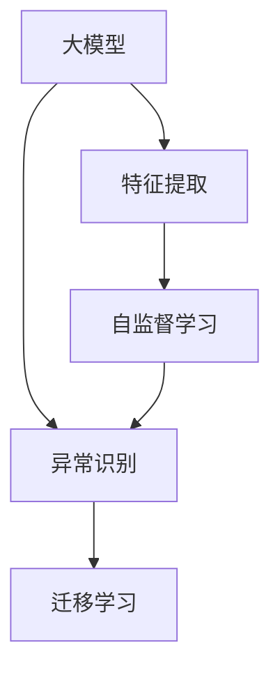

                 

## 1. 背景介绍

### 1.1 问题由来

在电商平台的运营过程中，异常检测是至关重要的环节之一。异常行为不仅影响用户体验，还可能带来经济损失。常见的异常检测场景包括但不限于：

- **欺诈检测**：识别并阻止不法分子通过虚假交易、虚假支付等方式进行诈骗。
- **价格异常**：检测商品价格异常波动，及时调整定价策略。
- **物流异常**：追踪物流信息，检测配送延误、货物丢失等问题。
- **用户行为异常**：识别用户的异常购买行为，如恶意刷单、恶意退货等。

传统的异常检测方法依赖于特征工程和规则引擎，存在计算成本高、扩展性差、难以适应复杂业务场景等问题。随着大模型的发展和应用，基于大模型的异常检测方法开始崭露头角。大模型能够从海量数据中学习到复杂的模式和规律，具备强大的泛化能力和适应性，可以更好地应对电商平台的业务挑战。

### 1.2 问题核心关键点

大模型在电商平台的异常检测中，主要是通过两种方式发挥作用：

1. **特征提取**：大模型可以自动提取高维数据中的关键特征，无需人工提取特征。
2. **异常识别**：大模型能够从海量数据中学习到多种类型的异常模式，识别出异常行为。

基于大模型的异常检测方法的核心在于如何有效利用模型学到的知识，进行高效的特征提取和异常识别。本文将从这两个角度出发，系统介绍大模型在电商平台中的异常检测应用。

## 2. 核心概念与联系

### 2.1 核心概念概述

为更好地理解大模型在电商平台异常检测中的应用，本节将介绍几个密切相关的核心概念：

- **大模型(Large Model)**：以Transformer为基础的大规模预训练模型，如BERT、GPT等，能够从海量数据中学习到复杂的语言和结构知识，具有强大的泛化能力和适应性。
- **特征提取(Feature Extraction)**：从原始数据中提取出高维特征，用于后续的模型训练和异常检测。
- **异常识别(Anomaly Detection)**：通过模型学习到的异常模式，识别出数据中的异常值或异常事件。
- **迁移学习(Transfer Learning)**：在大模型上微调，以适应电商平台的特定任务。
- **自监督学习(Self-Supervised Learning)**：利用模型自身的预测能力和数据本身的信息，无需人工标注即可进行训练。

这些核心概念之间的逻辑关系可以通过以下Mermaid流程图来展示：



这个流程图展示了大模型的核心概念及其之间的关系：

1. 大模型通过自监督学习获得通用特征提取能力。
2. 迁移学习将通用特征提取能力转化为针对特定任务的异常识别能力。
3. 特征提取过程能够从原始数据中提取出高维特征，用于后续的模型训练和异常检测。
4. 自监督学习利用模型自身的预测能力和数据本身的信息，无需人工标注即可进行训练。

## 3. 核心算法原理 & 具体操作步骤

### 3.1 算法原理概述

基于大模型的电商平台异常检测，本质上是一个有监督的迁移学习过程。其核心思想是：利用预训练大模型在通用数据上学习到的特征提取能力，通过在特定任务数据上进行微调，使得模型具备针对特定任务的异常识别能力。

形式化地，假设大模型为 $M_{\theta}$，其中 $\theta$ 为预训练得到的模型参数。给定电商平台特定任务的标注数据集 $D=\{(x_i, y_i)\}_{i=1}^N$，异常检测的目标是找到新的模型参数 $\hat{\theta}$，使得：

$$
\hat{\theta}=\mathop{\arg\min}_{\theta} \mathcal{L}(M_{\theta},D)
$$

其中 $\mathcal{L}$ 为针对任务 $T$ 设计的损失函数，用于衡量模型预测输出与真实标签之间的差异。常见的损失函数包括交叉熵损失、均方误差损失等。

通过梯度下降等优化算法，微调过程不断更新模型参数 $\theta$，最小化损失函数 $\mathcal{L}$，使得模型输出逼近真实标签。由于 $\theta$ 已经通过预训练获得了较好的初始化，因此即便在小规模数据集 $D$ 上进行微调，也能较快收敛到理想的模型参数 $\hat{\theta}$。

### 3.2 算法步骤详解

基于大模型的电商平台异常检测一般包括以下几个关键步骤：

**Step 1: 准备预训练模型和数据集**
- 选择合适的预训练语言模型 $M_{\theta}$ 作为初始化参数，如 BERT、GPT等。
- 准备电商平台特定任务的标注数据集 $D$，划分为训练集、验证集和测试集。一般要求标注数据与预训练数据的分布不要差异过大。

**Step 2: 添加任务适配层**
- 根据任务类型，在预训练模型顶层设计合适的输出层和损失函数。
- 对于分类任务，通常在顶层添加线性分类器和交叉熵损失函数。
- 对于生成任务，通常使用语言模型的解码器输出概率分布，并以负对数似然为损失函数。

**Step 3: 设置微调超参数**
- 选择合适的优化算法及其参数，如 AdamW、SGD 等，设置学习率、批大小、迭代轮数等。
- 设置正则化技术及强度，包括权重衰减、Dropout、Early Stopping等。
- 确定冻结预训练参数的策略，如仅微调顶层，或全部参数都参与微调。

**Step 4: 执行梯度训练**
- 将训练集数据分批次输入模型，前向传播计算损失函数。
- 反向传播计算参数梯度，根据设定的优化算法和学习率更新模型参数。
- 周期性在验证集上评估模型性能，根据性能指标决定是否触发 Early Stopping。
- 重复上述步骤直到满足预设的迭代轮数或 Early Stopping 条件。

**Step 5: 测试和部署**
- 在测试集上评估微调后模型 $M_{\hat{\theta}}$ 的性能，对比微调前后的精度提升。
- 使用微调后的模型对新样本进行推理预测，集成到实际的应用系统中。
- 持续收集新的数据，定期重新微调模型，以适应数据分布的变化。

以上是基于大模型微调范式进行电商平台异常检测的一般流程。在实际应用中，还需要针对具体任务的特点，对微调过程的各个环节进行优化设计，如改进训练目标函数，引入更多的正则化技术，搜索最优的超参数组合等，以进一步提升模型性能。

### 3.3 算法优缺点

基于大模型的电商平台异常检测方法具有以下优点：

1. **高效性**：大模型能够自动提取高维特征，无需人工特征工程，提高了异常检测的效率。
2. **泛化能力强**：大模型在大规模数据上进行预训练，具备强大的泛化能力，能够在多种异常检测场景下取得优异效果。
3. **灵活性高**：大模型可以通过微调快速适应不同电商平台的任务需求，提高了异常检测系统的灵活性。
4. **可解释性强**：大模型的特征提取过程具有可解释性，能够提供异常检测过程的详细解释，帮助业务人员理解和调整策略。

同时，该方法也存在一定的局限性：

1. **数据依赖性强**：异常检测模型的效果高度依赖于标注数据的数量和质量，标注数据获取成本高，且标注过程容易出错。
2. **模型复杂度大**：大模型的参数量通常较大，训练和推理过程复杂，需要高性能的计算资源。
3. **解释性差**：大模型本身是一种黑盒模型，难以解释其内部的推理过程和决策机制。
4. **隐私风险**：电商平台涉及大量用户隐私数据，异常检测模型可能涉及敏感信息的处理，需要严格遵守数据隐私保护法规。

尽管存在这些局限性，但就目前而言，基于大模型的异常检测方法仍是大规模电商平台的优秀选择。未来相关研究的重点在于如何进一步降低数据依赖，提高模型的可解释性和隐私安全性，同时兼顾高效性和泛化能力。

### 3.4 算法应用领域

基于大模型的电商平台异常检测方法，已经在多个实际应用场景中得到了验证，例如：

- **欺诈检测**：通过分析用户的交易行为和支付记录，识别出欺诈交易。
- **价格异常检测**：检测商品价格波动，及时调整价格策略，防止价格异常影响电商平台的运营。
- **物流异常检测**：通过分析物流信息，检测配送延误、货物丢失等问题，提高物流效率。
- **用户行为异常检测**：识别用户的异常购买行为，如恶意刷单、恶意退货等，保护平台利益。

除了上述这些经典场景外，大模型异常检测方法还适用于更多电商平台的实际应用，如价格波动预测、库存管理、用户留存率分析等，为电商平台提供了更智能、更高效的服务。

## 4. 数学模型和公式 & 详细讲解  
### 4.1 数学模型构建

本节将使用数学语言对基于大模型的电商平台异常检测过程进行更加严格的刻画。

记大模型为 $M_{\theta}$，其中 $\theta$ 为预训练得到的模型参数。假设电商平台特定任务的标注数据集为 $D=\{(x_i,y_i)\}_{i=1}^N, x_i \in \mathbb{R}^d, y_i \in \{0,1\}$，其中 $x_i$ 为电商平台的业务数据，$y_i$ 为异常标签。

定义模型 $M_{\theta}$ 在输入 $x$ 上的损失函数为 $\ell(M_{\theta}(x),y)$，则在数据集 $D$ 上的经验风险为：

$$
\mathcal{L}(\theta) = \frac{1}{N}\sum_{i=1}^N \ell(M_{\theta}(x_i),y_i)
$$

微调的优化目标是最小化经验风险，即找到最优参数：

$$
\theta^* = \mathop{\arg\min}_{\theta} \mathcal{L}(\theta)
$$

在实践中，我们通常使用基于梯度的优化算法（如SGD、Adam等）来近似求解上述最优化问题。设 $\eta$ 为学习率，$\lambda$ 为正则化系数，则参数的更新公式为：

$$
\theta \leftarrow \theta - \eta \nabla_{\theta}\mathcal{L}(\theta) - \eta\lambda\theta
$$

其中 $\nabla_{\theta}\mathcal{L}(\theta)$ 为损失函数对参数 $\theta$ 的梯度，可通过反向传播算法高效计算。

### 4.2 公式推导过程

以下我们以欺诈检测任务为例，推导交叉熵损失函数及其梯度的计算公式。

假设模型 $M_{\theta}$ 在输入 $x$ 上的输出为 $\hat{y}=M_{\theta}(x) \in [0,1]$，表示样本为欺诈的概率。真实标签 $y \in \{0,1\}$。则二分类交叉熵损失函数定义为：

$$
\ell(M_{\theta}(x),y) = -[y\log \hat{y} + (1-y)\log (1-\hat{y})]
$$

将其代入经验风险公式，得：

$$
\mathcal{L}(\theta) = -\frac{1}{N}\sum_{i=1}^N [y_i\log M_{\theta}(x_i)+(1-y_i)\log(1-M_{\theta}(x_i))]
$$

根据链式法则，损失函数对参数 $\theta_k$ 的梯度为：

$$
\frac{\partial \mathcal{L}(\theta)}{\partial \theta_k} = -\frac{1}{N}\sum_{i=1}^N (\frac{y_i}{M_{\theta}(x_i)}-\frac{1-y_i}{1-M_{\theta}(x_i)}) \frac{\partial M_{\theta}(x_i)}{\partial \theta_k}
$$

其中 $\frac{\partial M_{\theta}(x_i)}{\partial \theta_k}$ 可进一步递归展开，利用自动微分技术完成计算。

在得到损失函数的梯度后，即可带入参数更新公式，完成模型的迭代优化。重复上述过程直至收敛，最终得到适应电商平台特定任务的最优模型参数 $\theta^*$。

## 5. 项目实践：代码实例和详细解释说明
### 5.1 开发环境搭建

在进行微调实践前，我们需要准备好开发环境。以下是使用Python进行PyTorch开发的环境配置流程：

1. 安装Anaconda：从官网下载并安装Anaconda，用于创建独立的Python环境。

2. 创建并激活虚拟环境：
```bash
conda create -n pytorch-env python=3.8 
conda activate pytorch-env
```

3. 安装PyTorch：根据CUDA版本，从官网获取对应的安装命令。例如：
```bash
conda install pytorch torchvision torchaudio cudatoolkit=11.1 -c pytorch -c conda-forge
```

4. 安装Transformers库：
```bash
pip install transformers
```

5. 安装各类工具包：
```bash
pip install numpy pandas scikit-learn matplotlib tqdm jupyter notebook ipython
```

完成上述步骤后，即可在`pytorch-env`环境中开始微调实践。

### 5.2 源代码详细实现

这里我们以基于BERT模型的欺诈检测任务为例，给出使用Transformers库对BERT模型进行微调的PyTorch代码实现。

首先，定义欺诈检测任务的数据处理函数：

```python
from transformers import BertTokenizer
from torch.utils.data import Dataset
import torch

class FraudDetectionDataset(Dataset):
    def __init__(self, texts, labels, tokenizer, max_len=128):
        self.texts = texts
        self.labels = labels
        self.tokenizer = tokenizer
        self.max_len = max_len
        
    def __len__(self):
        return len(self.texts)
    
    def __getitem__(self, item):
        text = self.texts[item]
        label = self.labels[item]
        
        encoding = self.tokenizer(text, return_tensors='pt', max_length=self.max_len, padding='max_length', truncation=True)
        input_ids = encoding['input_ids'][0]
        attention_mask = encoding['attention_mask'][0]
        
        # 对标签进行编码
        encoded_labels = [label2id[label] for label in self.labels] 
        encoded_labels.extend([label2id['normal']] * (self.max_len - len(encoded_labels)))
        labels = torch.tensor(encoded_labels, dtype=torch.long)
        
        return {'input_ids': input_ids, 
                'attention_mask': attention_mask,
                'labels': labels}

# 标签与id的映射
label2id = {'normal': 0, 'fraud': 1}
id2label = {v: k for k, v in label2id.items()}

# 创建dataset
tokenizer = BertTokenizer.from_pretrained('bert-base-cased')

train_dataset = FraudDetectionDataset(train_texts, train_labels, tokenizer)
dev_dataset = FraudDetectionDataset(dev_texts, dev_labels, tokenizer)
test_dataset = FraudDetectionDataset(test_texts, test_labels, tokenizer)
```

然后，定义模型和优化器：

```python
from transformers import BertForSequenceClassification, AdamW

model = BertForSequenceClassification.from_pretrained('bert-base-cased', num_labels=len(label2id))

optimizer = AdamW(model.parameters(), lr=2e-5)
```

接着，定义训练和评估函数：

```python
from torch.utils.data import DataLoader
from tqdm import tqdm
from sklearn.metrics import classification_report

device = torch.device('cuda') if torch.cuda.is_available() else torch.device('cpu')
model.to(device)

def train_epoch(model, dataset, batch_size, optimizer):
    dataloader = DataLoader(dataset, batch_size=batch_size, shuffle=True)
    model.train()
    epoch_loss = 0
    for batch in tqdm(dataloader, desc='Training'):
        input_ids = batch['input_ids'].to(device)
        attention_mask = batch['attention_mask'].to(device)
        labels = batch['labels'].to(device)
        model.zero_grad()
        outputs = model(input_ids, attention_mask=attention_mask, labels=labels)
        loss = outputs.loss
        epoch_loss += loss.item()
        loss.backward()
        optimizer.step()
    return epoch_loss / len(dataloader)

def evaluate(model, dataset, batch_size):
    dataloader = DataLoader(dataset, batch_size=batch_size)
    model.eval()
    preds, labels = [], []
    with torch.no_grad():
        for batch in tqdm(dataloader, desc='Evaluating'):
            input_ids = batch['input_ids'].to(device)
            attention_mask = batch['attention_mask'].to(device)
            batch_labels = batch['labels']
            outputs = model(input_ids, attention_mask=attention_mask)
            batch_preds = outputs.logits.argmax(dim=2).to('cpu').tolist()
            batch_labels = batch_labels.to('cpu').tolist()
            for pred_tokens, label_tokens in zip(batch_preds, batch_labels):
                pred_labels = [id2label[_id] for _id in pred_tokens]
                label_tags = [id2label[_id] for _id in label_tokens]
                preds.append(pred_labels[:len(label_tags)])
                labels.append(label_tags)
                
    print(classification_report(labels, preds))
```

最后，启动训练流程并在测试集上评估：

```python
epochs = 5
batch_size = 16

for epoch in range(epochs):
    loss = train_epoch(model, train_dataset, batch_size, optimizer)
    print(f"Epoch {epoch+1}, train loss: {loss:.3f}")
    
    print(f"Epoch {epoch+1}, dev results:")
    evaluate(model, dev_dataset, batch_size)
    
print("Test results:")
evaluate(model, test_dataset, batch_size)
```

以上就是使用PyTorch对BERT进行欺诈检测任务微调的完整代码实现。可以看到，得益于Transformers库的强大封装，我们可以用相对简洁的代码完成BERT模型的加载和微调。

### 5.3 代码解读与分析

让我们再详细解读一下关键代码的实现细节：

**FraudDetectionDataset类**：
- `__init__`方法：初始化文本、标签、分词器等关键组件。
- `__len__`方法：返回数据集的样本数量。
- `__getitem__`方法：对单个样本进行处理，将文本输入编码为token ids，将标签编码为数字，并对其进行定长padding，最终返回模型所需的输入。

**label2id和id2label字典**：
- 定义了标签与数字id之间的映射关系，用于将预测结果解码回真实的标签。

**训练和评估函数**：
- 使用PyTorch的DataLoader对数据集进行批次化加载，供模型训练和推理使用。
- 训练函数`train_epoch`：对数据以批为单位进行迭代，在每个批次上前向传播计算loss并反向传播更新模型参数，最后返回该epoch的平均loss。
- 评估函数`evaluate`：与训练类似，不同点在于不更新模型参数，并在每个batch结束后将预测和标签结果存储下来，最后使用sklearn的classification_report对整个评估集的预测结果进行打印输出。

**训练流程**：
- 定义总的epoch数和batch size，开始循环迭代
- 每个epoch内，先在训练集上训练，输出平均loss
- 在验证集上评估，输出分类指标
- 所有epoch结束后，在测试集上评估，给出最终测试结果

可以看到，PyTorch配合Transformers库使得BERT微调的代码实现变得简洁高效。开发者可以将更多精力放在数据处理、模型改进等高层逻辑上，而不必过多关注底层的实现细节。

当然，工业级的系统实现还需考虑更多因素，如模型的保存和部署、超参数的自动搜索、更灵活的任务适配层等。但核心的微调范式基本与此类似。

## 6. 实际应用场景

### 6.1 智能客服系统

基于大模型的智能客服系统能够实现自动处理用户咨询，识别用户意图并提供解决方案。在异常检测方面，可以监测到用户的恶意操作，如恶意刷单、恶意退货等，及时进行干预。

在技术实现上，可以收集用户的互动历史和行为数据，构建监督数据集。在此基础上对预训练的对话模型进行微调，使其能够识别出用户的异常行为。一旦检测到异常，系统可以自动记录并报警，提高客服系统的自动化水平。

### 6.2 物流异常监测

物流异常监测是大模型在电商平台中应用的重要场景之一。通过分析物流信息，检测配送延误、货物丢失等问题，提高物流效率。

在技术实现上，可以收集物流数据，标记异常事件，构建监督数据集。对预训练的语言模型进行微调，使其能够识别出异常物流信息。一旦检测到异常，系统可以自动触发报警，及时处理问题，保障物流服务质量。

### 6.3 用户行为分析

用户行为分析是大模型在电商平台中的另一个重要应用场景。通过分析用户的购买行为、浏览记录等数据，检测出异常行为，如恶意刷单、恶意退货等，保障电商平台利益。

在技术实现上，可以收集用户行为数据，构建监督数据集。对预训练的语言模型进行微调，使其能够识别出异常行为。一旦检测到异常，系统可以自动干预，减少用户行为对电商平台的不良影响。

### 6.4 未来应用展望

随着大模型和微调方法的不断发展，基于大模型的异常检测技术将迎来更多的应用场景。

在智慧医疗领域，通过分析患者数据，检测出异常行为，如虚假就医、欺诈医疗等，保障医疗资源的合理使用。

在智能教育领域，通过分析学生数据，检测出异常行为，如作弊、抄袭等，保障教育公平。

在智慧城市治理中，通过分析城市数据，检测出异常事件，如交通拥堵、环境污染等，提高城市治理效率。

此外，在企业生产、社会治理、文娱传媒等众多领域，基于大模型异常检测技术也将不断涌现，为社会管理提供新的支持。

## 7. 工具和资源推荐

### 7.1 学习资源推荐

为了帮助开发者系统掌握大模型在电商平台异常检测的理论基础和实践技巧，这里推荐一些优质的学习资源：

1. 《Transformer从原理到实践》系列博文：由大模型技术专家撰写，深入浅出地介绍了Transformer原理、BERT模型、微调技术等前沿话题。

2. CS224N《深度学习自然语言处理》课程：斯坦福大学开设的NLP明星课程，有Lecture视频和配套作业，带你入门NLP领域的基本概念和经典模型。

3. 《Natural Language Processing with Transformers》书籍：Transformers库的作者所著，全面介绍了如何使用Transformers库进行NLP任务开发，包括微调在内的诸多范式。

4. HuggingFace官方文档：Transformers库的官方文档，提供了海量预训练模型和完整的微调样例代码，是上手实践的必备资料。

5. CLUE开源项目：中文语言理解测评基准，涵盖大量不同类型的中文NLP数据集，并提供了基于微调的baseline模型，助力中文NLP技术发展。

通过对这些资源的学习实践，相信你一定能够快速掌握大模型在电商平台异常检测的精髓，并用于解决实际的NLP问题。

### 7.2 开发工具推荐

高效的开发离不开优秀的工具支持。以下是几款用于大模型异常检测开发的常用工具：

1. PyTorch：基于Python的开源深度学习框架，灵活动态的计算图，适合快速迭代研究。大部分预训练语言模型都有PyTorch版本的实现。

2. TensorFlow：由Google主导开发的开源深度学习框架，生产部署方便，适合大规模工程应用。同样有丰富的预训练语言模型资源。

3. Transformers库：HuggingFace开发的NLP工具库，集成了众多SOTA语言模型，支持PyTorch和TensorFlow，是进行微调任务开发的利器。

4. Weights & Biases：模型训练的实验跟踪工具，可以记录和可视化模型训练过程中的各项指标，方便对比和调优。与主流深度学习框架无缝集成。

5. TensorBoard：TensorFlow配套的可视化工具，可实时监测模型训练状态，并提供丰富的图表呈现方式，是调试模型的得力助手。

6. Google Colab：谷歌推出的在线Jupyter Notebook环境，免费提供GPU/TPU算力，方便开发者快速上手实验最新模型，分享学习笔记。

合理利用这些工具，可以显著提升大模型异常检测任务的开发效率，加快创新迭代的步伐。

### 7.3 相关论文推荐

大模型在电商平台异常检测领域的发展源于学界的持续研究。以下是几篇奠基性的相关论文，推荐阅读：

1. Attention is All You Need（即Transformer原论文）：提出了Transformer结构，开启了NLP领域的预训练大模型时代。

2. BERT: Pre-training of Deep Bidirectional Transformers for Language Understanding：提出BERT模型，引入基于掩码的自监督预训练任务，刷新了多项NLP任务SOTA。

3. Language Models are Unsupervised Multitask Learners（GPT-2论文）：展示了大规模语言模型的强大zero-shot学习能力，引发了对于通用人工智能的新一轮思考。

4. Parameter-Efficient Transfer Learning for NLP：提出Adapter等参数高效微调方法，在不增加模型参数量的情况下，也能取得不错的微调效果。

5. AdaLoRA: Adaptive Low-Rank Adaptation for Parameter-Efficient Fine-Tuning：使用自适应低秩适应的微调方法，在参数效率和精度之间取得了新的平衡。

6. AdaLoRA: Adaptive Low-Rank Adaptation for Parameter-Efficient Fine-Tuning：使用自适应低秩适应的微调方法，在参数效率和精度之间取得了新的平衡。

这些论文代表了大模型在电商平台异常检测领域的发展脉络。通过学习这些前沿成果，可以帮助研究者把握学科前进方向，激发更多的创新灵感。

## 8. 总结：未来发展趋势与挑战

### 8.1 总结

本文对基于大模型的电商平台异常检测方法进行了全面系统的介绍。首先阐述了大模型在电商平台的异常检测中的作用和重要性，明确了微调在拓展预训练模型应用、提升下游任务性能方面的独特价值。其次，从原理到实践，详细讲解了基于大模型的异常检测的数学原理和关键步骤，给出了微调任务开发的完整代码实例。同时，本文还广泛探讨了微调方法在智能客服、物流异常检测、用户行为分析等多个电商平台的实际应用场景，展示了微调范式的巨大潜力。此外，本文精选了微调技术的各类学习资源，力求为读者提供全方位的技术指引。

通过本文的系统梳理，可以看到，基于大模型的电商平台异常检测技术正在成为电商平台的主要手段，极大地提升了异常检测的效率和效果。受益于大规模语料的预训练和微调技术的不断进步，异常检测系统能够更好地适应电商平台的业务需求，保障电商平台运营的安全和稳定。未来，伴随大模型和微调方法的持续演进，异常检测技术还将进一步提升，为电商平台的智能化管理提供更有力的支持。

### 8.2 未来发展趋势

展望未来，电商平台异常检测技术将呈现以下几个发展趋势：

1. **模型规模持续增大**：随着算力成本的下降和数据规模的扩张，预训练语言模型的参数量还将持续增长。超大规模语言模型蕴含的丰富语言知识，有望支撑更加复杂多变的异常检测场景。

2. **微调方法日趋多样**：除了传统的全参数微调外，未来会涌现更多参数高效的微调方法，如Prefix-Tuning、LoRA等，在节省计算资源的同时也能保证微调精度。

3. **持续学习成为常态**：随着数据分布的不断变化，异常检测模型也需要持续学习新知识以保持性能。如何在不遗忘原有知识的同时，高效吸收新样本信息，将成为重要的研究课题。

4. **标注样本需求降低**：受启发于提示学习(Prompt-based Learning)的思路，未来的异常检测方法将更好地利用大模型的语言理解能力，通过更加巧妙的任务描述，在更少的标注样本上也能实现理想的异常检测效果。

5. **少样本学习(Low-Shot Learning)**：在大模型上通过微调实现少样本学习，即在只有少量标注样本的情况下，仍能高效识别异常行为，减少异常检测成本。

6. **零样本学习(Zero-Shot Learning)**：在大模型上通过微调实现零样本学习，即在完全无标注的情况下，也能准确识别异常行为，提升异常检测的鲁棒性。

以上趋势凸显了大模型在电商平台异常检测领域的广阔前景。这些方向的探索发展，必将进一步提升异常检测系统的性能和应用范围，为电商平台提供更智能、更高效的服务。

### 8.3 面临的挑战

尽管基于大模型的异常检测技术已经取得了显著进展，但在迈向更加智能化、普适化应用的过程中，仍面临诸多挑战：

1. **数据依赖性强**：异常检测模型的效果高度依赖于标注数据的数量和质量，标注数据获取成本高，且标注过程容易出错。如何进一步降低微调对标注样本的依赖，将是一大难题。

2. **模型鲁棒性不足**：当前异常检测模型面对域外数据时，泛化性能往往大打折扣。对于测试样本的微小扰动，异常检测模型的预测也容易发生波动。如何提高异常检测模型的鲁棒性，避免灾难性遗忘，还需要更多理论和实践的积累。

3. **推理效率有待提高**：大规模语言模型虽然精度高，但在实际部署时往往面临推理速度慢、内存占用大等效率问题。如何在保证性能的同时，简化模型结构，提升推理速度，优化资源占用，将是重要的优化方向。

4. **解释性差**：异常检测模型本身是一种黑盒模型，难以解释其内部的推理过程和决策机制。对于高风险应用，算法的可解释性和可审计性尤为重要。如何赋予异常检测模型更强的可解释性，将是亟待攻克的难题。

5. **隐私风险**：电商平台涉及大量用户隐私数据，异常检测模型可能涉及敏感信息的处理，需要严格遵守数据隐私保护法规。

尽管存在这些局限性，但就目前而言，基于大模型的异常检测方法仍是大规模电商平台的优秀选择。未来相关研究的重点在于如何进一步降低数据依赖，提高模型的可解释性和隐私安全性，同时兼顾高效性和泛化能力。

### 8.4 研究展望

面对基于大模型的异常检测所面临的挑战，未来的研究需要在以下几个方面寻求新的突破：

1. **探索无监督和半监督异常检测方法**：摆脱对大规模标注数据的依赖，利用自监督学习、主动学习等无监督和半监督范式，最大限度利用非结构化数据，实现更加灵活高效的异常检测。

2. **研究参数高效和计算高效的异常检测范式**：开发更加参数高效的异常检测方法，在固定大部分预训练参数的同时，只更新极少量的异常检测参数。同时优化异常检测模型的计算图，减少前向传播和反向传播的资源消耗，实现更加轻量级、实时性的部署。

3. **引入更多先验知识**：将符号化的先验知识，如知识图谱、逻辑规则等，与神经网络模型进行巧妙融合，引导异常检测过程学习更准确、合理的异常模式。

4. **结合因果分析和博弈论工具**：将因果分析方法引入异常检测模型，识别出异常行为的关键特征，增强异常检测过程的因果关系，学习更加普适、鲁棒的模式。

5. **纳入伦理道德约束**：在异常检测目标中引入伦理导向的评估指标，过滤和惩罚有偏见、有害的异常行为，确保输出符合人类价值观和伦理道德。

这些研究方向的探索，必将引领基于大模型的异常检测技术迈向更高的台阶，为构建安全、可靠、可解释、可控的异常检测系统铺平道路。面向未来，大模型异常检测技术还需要与其他人工智能技术进行更深入的融合，如知识表示、因果推理、强化学习等，多路径协同发力，共同推动异常检测系统的进步。只有勇于创新、敢于突破，才能不断拓展异常检测系统的边界，让智能技术更好地服务电商平台。

## 9. 附录：常见问题与解答

**Q1：大模型在电商平台异常检测中有什么优势？**

A: 大模型在电商平台异常检测中的主要优势包括：

1. **泛化能力强**：大模型通过大规模数据预训练，能够学习到丰富的语言知识，具备较强的泛化能力，能够在多种异常检测场景下取得优异效果。

2. **高效性**：大模型能够自动提取高维特征，无需人工提取特征，提高了异常检测的效率。

3. **灵活性高**：大模型可以通过微调快速适应不同电商平台的任务需求，提高了异常检测系统的灵活性。

4. **可解释性强**：大模型的特征提取过程具有可解释性，能够提供异常检测过程的详细解释，帮助业务人员理解和调整策略。

5. **少样本学习能力**：大模型可以通过微调实现少样本学习，即在只有少量标注样本的情况下，仍能高效识别异常行为，减少异常检测成本。

综上所述，大模型在电商平台异常检测中的应用具有强大的泛化能力、高效性、灵活性、可解释性和少样本学习能力，能够为电商平台提供更智能、更高效的服务。

**Q2：如何选择合适的超参数进行异常检测微调？**

A: 超参数的选择是异常检测微调过程中非常重要的一环，直接影响模型的性能和训练效率。以下是一些选择超参数的常用方法：

1. **网格搜索**：通过遍历所有可能的超参数组合，选择性能最佳的超参数。网格搜索虽然计算成本较高，但能够保证找到最优的超参数组合。

2. **随机搜索**：通过随机选择超参数，减少计算成本。随机搜索能够找到与网格搜索类似甚至更好的超参数组合。

3. **贝叶斯优化**：通过优化算法选择超参数，能够快速找到性能最佳的超参数组合。贝叶斯优化在超参数空间较小的情况下效果更佳。

4. **交叉验证**：通过交叉验证评估超参数的性能，选择性能最佳的超参数。交叉验证能够更好地评估模型的泛化能力。

5. **学习率调度**：通过学习率调度和学习率衰减等技术，调节超参数对模型的影响，找到最优的超参数组合。

需要根据具体任务和数据集特点，灵活选择超参数选择方法，并进行多次实验，以找到最优的超参数组合。

**Q3：大模型异常检测模型的训练和推理效率如何优化？**

A: 大模型异常检测模型的训练和推理效率可以通过以下方法进行优化：

1. **模型裁剪**：去除不必要的层和参数，减小模型尺寸，加快推理速度。

2. **量化加速**：将浮点模型转为定点模型，压缩存储空间，提高计算效率。

3. **梯度累积**：通过梯度累积技术，减少每次微调所需的梯度更新次数，加快训练速度。

4. **混合精度训练**：通过混合精度训练，减少计算资源消耗，加快训练速度。

5. **分布式训练**：通过分布式训练，并行化计算资源，提高训练速度。

6. **模型并行**：通过模型并行技术，将模型分解为多个子模型，并行计算，提高推理速度。

7. **模型压缩**：通过模型压缩技术，减小模型大小，提高推理速度。

综上所述，大模型异常检测模型的训练和推理效率可以通过模型裁剪、量化加速、梯度累积、混合精度训练、分布式训练、模型并行和模型压缩等方法进行优化，提高模型的实际应用效果。

**Q4：异常检测模型的解释性差如何应对？**

A: 异常检测模型的解释性差是当前技术中的一个主要挑战。为应对这一问题，可以采取以下措施：

1. **可解释模型**：使用可解释的异常检测模型，如基于规则的异常检测模型，能够提供详细的异常检测逻辑，增强模型的解释性。

2. **特征可视化**：通过可视化技术展示模型的特征提取过程，帮助业务人员理解模型的决策机制，增强模型的可解释性。

3. **规则提取**：通过规则提取技术，将模型学到的知识转化为规则，增强模型的可解释性。

4. **知识融合**：将符号化的先验知识，如知识图谱、逻辑规则等，与神经网络模型进行融合，增强模型的解释性。

5. **交互式模型**：开发交互式异常检测模型，通过用户交互，帮助业务人员理解模型的决策过程，增强模型的可解释性。

综上所述，可以通过使用可解释模型、特征可视化、规则提取、知识融合和交互式模型等方法，应对异常检测模型的解释性差问题，增强模型的可解释性和可控性。

**Q5：异常检测模型如何避免过拟合？**

A: 异常检测模型在训练过程中容易过拟合，特别是当标注数据量不足时。为避免过拟合，可以采取以下措施：

1. **数据增强**：通过数据增强技术，如回译、近义替换等方式扩充训练集，提高模型的泛化能力。

2. **正则化技术**：使用L2正则、Dropout、Early Stopping等技术，防止模型过度适应小规模训练集，避免过拟合。

3. **对抗训练**：通过对抗样本，增强模型的鲁棒性，减少过拟合风险。

4. **模型裁剪**：通过模型裁剪技术，减小模型尺寸，提高模型的泛化能力。

5. **迁移学习**：通过迁移学习，在大规模数据上预训练模型，再在小规模数据上进行微调，提高模型的泛化能力。

综上所述，可以通过数据增强、正则化技术、对抗训练、模型裁剪和迁移学习等方法，避免异常检测模型的过拟合问题，提高模型的泛化能力和鲁棒性。

---

作者：禅与计算机程序设计艺术 / Zen and the Art of Computer Programming

