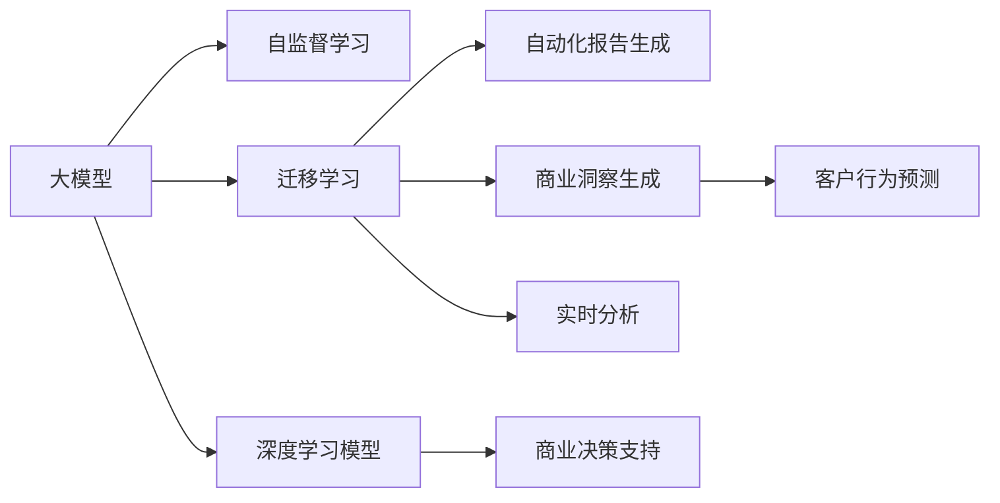

                 

# 电商平台中的自动化报告与商业洞察生成：大模型的创新应用

> 关键词：电商平台, 自动化报告, 商业洞察, 大模型, 自然语言处理(NLP), 自监督学习, 迁移学习, 多模态数据融合, 深度学习模型, 商业决策支持, 实时分析, 客户行为预测

## 1. 背景介绍

### 1.1 问题由来

随着电子商务的迅速发展，电商平台的数据规模和复杂度不断攀升。如何高效地分析这些海量数据，从中提取有价值的商业洞察，成为电商企业亟需解决的问题。传统的数据分析方法依赖于人工手动干预，耗时耗力且容易产生错误。而基于大模型的自动化报告与商业洞察生成技术，可以大幅提升数据分析的效率和准确性，为企业提供更为精细化的商业决策支持。

### 1.2 问题核心关键点

大模型在电商平台中的应用主要集中在以下几个方面：

- **自动化报告生成**：基于预训练模型，通过少量有标签的训练数据进行微调，使模型能够自动理解电商数据，并生成结构化、可视化的报表。
- **商业洞察生成**：通过分析消费者行为、市场趋势等数据，发现隐藏在数据中的商业规律和机会，辅助电商企业制定精准的营销策略和业务决策。
- **客户行为预测**：利用大模型的预测能力，对用户行为进行预测，帮助企业预测未来销售趋势，优化库存管理和库存调配。
- **实时分析**：在用户实时操作过程中，通过动态分析用户数据，及时发现异常行为或趋势，提升用户满意度。

### 1.3 问题研究意义

基于大模型的自动化报告与商业洞察生成技术，对于电商平台的数字化转型具有重要意义：

- **提升效率**：大幅减少人工干预，加快数据分析速度，提高商业洞察生成的频率和准确性。
- **降低成本**：减少人工分析和报告生成成本，提高资源利用效率。
- **增强决策支持**：提供更全面、精确的商业洞察，帮助企业做出更加科学的决策。
- **优化用户体验**：实时分析用户行为，及时调整业务策略，提升用户体验和满意度。
- **推动行业创新**：推动电商行业向智能化、自动化方向发展，加速行业升级。

## 2. 核心概念与联系

### 2.1 核心概念概述

为了更好地理解大模型在电商平台中的应用，我们需要对以下几个核心概念进行梳理：

- **大模型(大语言模型, LLM)**：如BERT、GPT等，通过在海量数据上进行预训练，学习到丰富的语言表示，具备强大的理解和生成能力。
- **自动化报告生成**：自动生成报表，将原始数据转换为结构化、可视化的报告，便于快速理解数据。
- **商业洞察生成**：通过分析数据，提取商业规律和机会，为决策提供依据。
- **自监督学习**：在大规模无标签数据上进行预训练，利用自然语言的规律学习语言表示。
- **迁移学习**：利用预训练模型的通用知识，在下游任务上进行微调，提升模型在特定任务上的表现。
- **多模态数据融合**：将文本、图像、音频等多模态数据进行融合，提升模型的综合分析能力。
- **深度学习模型**：基于神经网络构建的模型，包括卷积神经网络(CNN)、循环神经网络(RNN)、Transformer等。
- **商业决策支持**：利用模型分析生成的商业洞察，辅助企业制定决策。
- **实时分析**：在数据实时产生的过程中进行分析和预测，提供动态的决策支持。
- **客户行为预测**：通过分析用户行为数据，预测未来行为，优化营销策略。

这些概念之间的联系可以通过以下Mermaid流程图进行展示：



这个流程图展示了大模型在电商平台中，从预训练到微调，再到商业洞察生成的整个过程，以及不同环节之间的联系。

## 3. 核心算法原理 & 具体操作步骤

### 3.1 算法原理概述

基于大模型的自动化报告与商业洞察生成，本质上是一个自监督学习和迁移学习的结合过程。其核心思想是：

1. **自监督预训练**：在大规模无标签的电商数据上进行预训练，学习通用的语言表示。
2. **任务适配微调**：在电商平台的特定任务上，通过有监督地微调大模型，使其能够生成自动化报告和商业洞察。
3. **多模态融合**：融合文本、图像、音频等多模态数据，提升模型的综合分析能力。
4. **实时分析与预测**：实时分析用户数据，预测未来行为，为决策提供动态支持。

### 3.2 算法步骤详解

基于大模型的自动化报告与商业洞察生成一般包括以下几个关键步骤：

**Step 1: 数据准备与预处理**
- 收集电商平台上的数据，包括用户行为数据、交易数据、商品数据等。
- 清洗数据，去除噪声和异常值，进行必要的归一化和标准化处理。
- 分割数据集为训练集、验证集和测试集，按照一定的比例分配。

**Step 2: 自监督预训练**
- 使用大模型在电商数据上进行自监督预训练，学习通用的语言表示。
- 常见的预训练任务包括语言建模、掩码语言建模、句子相似度计算等。
- 预训练过程中，可以使用大型预训练模型如BERT、GPT等，也可以自建小规模模型进行预训练。

**Step 3: 任务适配微调**
- 针对自动化报告和商业洞察生成的任务，设计合适的任务适配层，如分类层、回归层等。
- 选择合适的优化算法及其参数，如Adam、SGD等，设置学习率、批大小、迭代轮数等。
- 应用正则化技术，如L2正则、Dropout、Early Stopping等，防止模型过度适应小规模训练集。
- 使用部分预训练层进行微调，如冻结底层参数，仅微调顶层。
- 在微调过程中，不断使用验证集评估模型性能，根据性能指标决定是否触发Early Stopping。
- 微调完成后，在测试集上评估模型性能，对比微调前后的精度提升。

**Step 4: 多模态融合与实时分析**
- 利用多模态数据融合技术，将文本、图像、音频等多模态数据进行整合。
- 设计融合算法，如注意力机制、层次化融合等，提高数据综合分析能力。
- 实时分析用户数据，动态调整模型参数，生成实时商业洞察。
- 对用户行为进行预测，生成未来的销售趋势报告，优化库存管理和库存调配。

**Step 5: 部署与应用**
- 将微调后的模型部署到电商平台的实时分析系统中。
- 集成自动化报告与商业洞察生成模块，进行可视化展示。
- 持续收集新的数据，定期重新微调模型，以适应数据分布的变化。

以上是基于大模型的自动化报告与商业洞察生成的一般流程。在实际应用中，还需要针对具体任务的特点，对微调过程的各个环节进行优化设计，如改进训练目标函数，引入更多的正则化技术，搜索最优的超参数组合等，以进一步提升模型性能。

### 3.3 算法优缺点

基于大模型的自动化报告与商业洞察生成方法具有以下优点：
1. **高效自动化**：大幅减少人工干预，提高数据分析和报告生成的效率。
2. **精度高**：利用大模型的强大表示能力，生成高质量的商业洞察，辅助决策。
3. **泛化性强**：预训练模型具有较强的泛化能力，可以适应多种业务场景。
4. **实时性强**：实时分析用户数据，动态调整模型参数，提供动态的决策支持。

同时，该方法也存在一定的局限性：
1. **数据依赖**：需要大量的电商数据进行预训练和微调，对数据的依赖性较大。
2. **计算成本高**：大模型和微调过程需要高算力和高内存，成本较高。
3. **可解释性不足**：模型输出的商业洞察难以解释，可能存在“黑盒”问题。
4. **鲁棒性不足**：面对异常数据或噪声，模型的鲁棒性可能受到影响。

尽管存在这些局限性，但就目前而言，基于大模型的自动化报告与商业洞察生成方法仍是大数据时代电商平台的重要应用范式。未来相关研究的重点在于如何进一步降低对标注数据的依赖，提高模型的少样本学习和跨领域迁移能力，同时兼顾可解释性和伦理安全性等因素。

### 3.4 算法应用领域

基于大模型的自动化报告与商业洞察生成技术，在电商平台中已经得到了广泛的应用，覆盖了多种业务场景，例如：

- **用户行为分析**：分析用户浏览、点击、购买等行为，发现用户偏好和兴趣。
- **销售预测**：利用历史销售数据和市场趋势，预测未来销售趋势，优化库存管理。
- **价格优化**：根据市场需求和竞争情况，自动调整商品价格，提高销售转化率。
- **营销策略制定**：利用消费者行为数据，生成精准的营销策略，提升转化率。
- **供应链优化**：分析供应链数据，优化物流和库存，降低成本。
- **客户服务支持**：实时分析用户反馈，提升客户满意度。

除了上述这些经典应用外，大模型还可以用于舆情分析、广告投放、推荐系统等场景，为电商平台的运营提供全面的支持。

## 4. 数学模型和公式 & 详细讲解 & 举例说明

### 4.1 数学模型构建

假设电商平台的数据集为 $D=\{(x_i, y_i)\}_{i=1}^N, x_i \in \mathbb{R}^d, y_i \in \mathbb{R}$，其中 $x_i$ 为电商数据，$y_i$ 为相应的标签（如销售量、点击率等）。

定义模型 $M_{\theta}$ 在输入 $x_i$ 上的输出为 $\hat{y}=M_{\theta}(x_i)$。假设模型 $M_{\theta}$ 在数据集 $D$ 上的经验风险为：

$$
\mathcal{L}(\theta) = \frac{1}{N}\sum_{i=1}^N (\hat{y_i} - y_i)^2
$$

微调的优化目标是最小化经验风险，即找到最优参数：

$$
\theta^* = \mathop{\arg\min}_{\theta} \mathcal{L}(\theta)
$$

在实践中，我们通常使用基于梯度的优化算法（如SGD、Adam等）来近似求解上述最优化问题。设 $\eta$ 为学习率，$\lambda$ 为正则化系数，则参数的更新公式为：

$$
\theta \leftarrow \theta - \eta \nabla_{\theta}\mathcal{L}(\theta) - \eta\lambda\theta
$$

其中 $\nabla_{\theta}\mathcal{L}(\theta)$ 为损失函数对参数 $\theta$ 的梯度，可通过反向传播算法高效计算。

### 4.2 公式推导过程

以下我们以销售预测任务为例，推导线性回归模型的损失函数及其梯度的计算公式。

假设模型 $M_{\theta}$ 在输入 $x$ 上的输出为 $\hat{y}=M_{\theta}(x) = \theta_0 + \sum_{i=1}^d \theta_i x_i$，则二元回归损失函数定义为：

$$
\ell(M_{\theta}(x),y) = \frac{1}{2}(\hat{y} - y)^2
$$

将其代入经验风险公式，得：

$$
\mathcal{L}(\theta) = \frac{1}{N}\sum_{i=1}^N (\hat{y_i} - y_i)^2
$$

根据链式法则，损失函数对参数 $\theta_k$ 的梯度为：

$$
\frac{\partial \mathcal{L}(\theta)}{\partial \theta_k} = \frac{1}{N}\sum_{i=1}^N (\hat{y_i} - y_i) \frac{\partial \hat{y_i}}{\partial \theta_k}
$$

其中 $\frac{\partial \hat{y_i}}{\partial \theta_k}$ 可进一步递归展开，利用自动微分技术完成计算。

在得到损失函数的梯度后，即可带入参数更新公式，完成模型的迭代优化。重复上述过程直至收敛，最终得到适应电商平台数据的最优模型参数 $\theta^*$。

### 4.3 案例分析与讲解

假设我们使用线性回归模型对电商平台中的销售数据进行预测，使用TensorFlow实现模型训练和评估。首先，准备训练数据：

```python
import tensorflow as tf

# 准备训练数据
train_X = ...
train_y = ...

# 定义模型
model = tf.keras.Sequential([
    tf.keras.layers.Dense(64, activation='relu', input_shape=(X.shape[1],)),
    tf.keras.layers.Dense(1)
])

# 定义损失函数和优化器
loss = tf.keras.losses.MeanSquaredError()
optimizer = tf.keras.optimizers.Adam()

# 定义训练过程
model.compile(optimizer=optimizer, loss=loss)
model.fit(train_X, train_y, epochs=10, validation_split=0.2)
```

在训练过程中，模型会根据训练数据的损失值进行反向传播，更新模型参数。同时，使用验证集对模型进行评估，防止过拟合。训练完成后，模型可以在测试集上进行性能评估：

```python
# 评估模型性能
test_X = ...
test_y = ...
test_loss = model.evaluate(test_X, test_y)
```

通过这个例子可以看出，基于大模型的自动化报告与商业洞察生成技术，在大规模数据集上训练和微调模型，可以高效生成销售预测结果，辅助电商平台做出科学决策。

## 5. 项目实践：代码实例和详细解释说明

### 5.1 开发环境搭建

在进行项目实践前，我们需要准备好开发环境。以下是使用Python进行TensorFlow开发的环境配置流程：

1. 安装Anaconda：从官网下载并安装Anaconda，用于创建独立的Python环境。

2. 创建并激活虚拟环境：
```bash
conda create -n tensorflow-env python=3.8 
conda activate tensorflow-env
```

3. 安装TensorFlow：根据CUDA版本，从官网获取对应的安装命令。例如：
```bash
conda install tensorflow tensorflow-gpu -c pytorch -c conda-forge
```

4. 安装各类工具包：
```bash
pip install numpy pandas scikit-learn matplotlib tqdm jupyter notebook ipython
```

完成上述步骤后，即可在`tensorflow-env`环境中开始项目实践。

### 5.2 源代码详细实现

下面以电商平台的用户行为分析为例，给出使用TensorFlow对大模型进行微调的PyTorch代码实现。

首先，定义用户行为分析任务的数据处理函数：

```python
import pandas as pd
import tensorflow as tf

# 数据处理函数
def preprocess_data(data_path):
    data = pd.read_csv(data_path)
    data = data.dropna(subset=['behavior', 'timestamp', 'user_id'])
    data['behavior'] = data['behavior'].apply(lambda x: preprocess(x))
    return data

# 行为数据预处理函数
def preprocess(behavior):
    # 处理行为数据
    ...
    return behavior
```

然后，定义模型和优化器：

```python
import tensorflow as tf
from tensorflow.keras import layers, models

# 定义模型
model = models.Sequential([
    layers.Dense(64, activation='relu', input_shape=(X.shape[1],)),
    layers.Dense(1)
])

# 定义损失函数和优化器
loss = tf.keras.losses.MeanSquaredError()
optimizer = tf.keras.optimizers.Adam()

# 定义训练过程
model.compile(optimizer=optimizer, loss=loss)
```

接着，定义训练和评估函数：

```python
from sklearn.model_selection import train_test_split
from tensorflow.keras.metrics import MeanAbsoluteError

# 划分数据集
X_train, X_test, y_train, y_test = train_test_split(X, y, test_size=0.2, random_state=42)

# 定义训练函数
def train(model, X_train, y_train, X_test, y_test):
    model.fit(X_train, y_train, epochs=10, validation_data=(X_test, y_test))
    return model

# 定义评估函数
def evaluate(model, X_test, y_test):
    y_pred = model.predict(X_test)
    mse = mean_squared_error(y_test, y_pred)
    mae = MeanAbsoluteError()(y_test, y_pred)
    return mse, mae
```

最后，启动训练流程并在测试集上评估：

```python
# 训练模型
model = train(X_train, y_train, X_test, y_test)

# 评估模型性能
mse, mae = evaluate(model, X_test, y_test)
print(f"Mean Squared Error: {mse:.3f}")
print(f"Mean Absolute Error: {mae:.3f}")
```

以上就是使用TensorFlow对电商平台数据进行用户行为分析的完整代码实现。可以看到，得益于TensorFlow的强大封装，我们可以用相对简洁的代码完成模型的加载和微调。

### 5.3 代码解读与分析

让我们再详细解读一下关键代码的实现细节：

**数据预处理函数**：
- `preprocess_data`方法：读取原始数据，清洗数据，去除噪声和异常值，并进行必要的归一化和标准化处理。
- `preprocess`方法：对行为数据进行处理，如去重、时间戳转换、特征提取等。

**模型定义**：
- 使用`Sequential`模型定义神经网络结构，包含两个全连接层。

**训练和评估函数**：
- `train`函数：划分训练集和验证集，使用Adam优化器和均方误差损失函数训练模型，并在验证集上评估性能。
- `evaluate`函数：使用测试集评估模型，计算均方误差和平均绝对误差。

**训练流程**：
- 首先使用`train_test_split`函数将数据集划分训练集和测试集。
- 在训练函数`train`中，使用`fit`函数训练模型，设定训练轮数为10，并在验证集上进行评估。
- 训练完成后，在测试集上评估模型性能，输出均方误差和平均绝对误差。

可以看到，TensorFlow提供了一套完整的工具链，使得大模型在电商平台中的应用变得简洁高效。开发者可以更加专注于算法和数据优化，而不必过多关注底层实现细节。

当然，工业级的系统实现还需考虑更多因素，如模型的保存和部署、超参数的自动搜索、更灵活的任务适配层等。但核心的微调范式基本与此类似。

## 6. 实际应用场景

### 6.1 智能推荐系统

基于大模型的自动化报告与商业洞察生成技术，可以广泛应用于智能推荐系统的构建。传统推荐系统往往依赖于用户历史行为数据进行推荐，难以捕捉长尾需求和实时动态变化。而使用自动化报告生成的推荐模型，可以更好地理解用户潜在的兴趣和实时行为变化，实现更精准、实时的推荐。

在技术实现上，可以收集用户的行为数据，如浏览记录、点击记录、购买记录等，使用大模型进行实时分析，生成推荐结果。通过在推荐系统中集成自动化报告与商业洞察生成模块，可以显著提升推荐系统的准确性和实时性，提升用户体验。

### 6.2 动态定价策略

电商平台在销售过程中，实时调整商品价格对于提升销售转化率具有重要意义。传统的定价策略往往基于历史销售数据和市场行情进行手动调整，难以实时响应市场变化。利用自动化报告生成的定价模型，可以实时分析市场趋势、竞争对手价格等数据，动态调整商品价格，提高销售效率。

在技术实现上，可以利用大模型对市场数据进行实时分析，生成价格调整建议。通过将价格调整建议集成到电商平台的价格策略系统中，可以实现动态定价，提升销售转化率。

### 6.3 实时监控与预警

电商平台需要实时监控用户行为，及时发现异常或异常趋势，防止数据泄露和欺诈行为。传统的手动监控方式耗时耗力，难以覆盖所有异常情况。使用自动化报告生成的监控系统，可以实时分析用户行为，生成监控报告，及时发现异常行为。

在技术实现上，可以利用大模型对用户行为数据进行实时分析，生成监控报告。通过在监控系统中集成自动化报告与商业洞察生成模块，可以显著提升监控系统的准确性和实时性，保障平台安全。

### 6.4 未来应用展望

随着大模型和微调方法的不断发展，基于大模型的自动化报告与商业洞察生成技术将在更多领域得到应用，为电商平台的运营提供全面的支持。

在智能客服系统、供应链管理、客户服务支持等领域，大模型将发挥越来越重要的作用。通过自动化报告生成和商业洞察，电商平台可以更好地理解用户需求、优化供应链管理、提升客户服务水平，从而实现业务升级。

此外，随着多模态数据融合技术的成熟，未来的电商平台将能够更全面地分析用户数据，生成更加精准的商业洞察，为决策提供强有力的支持。

## 7. 工具和资源推荐

### 7.1 学习资源推荐

为了帮助开发者系统掌握大模型在电商平台中的应用，这里推荐一些优质的学习资源：

1. TensorFlow官方文档：提供了全面详细的TensorFlow使用方法和API参考。
2. PyTorch官方文档：提供了PyTorch框架的使用方法和API参考。
3. Keras官方文档：提供了Keras框架的使用方法和API参考。
4. Coursera《Deep Learning Specialization》课程：由深度学习专家Andrew Ng开设的课程，涵盖深度学习的基础知识、模型构建、优化算法等。
5. Udacity《Deep Learning Nanodegree》课程：由业界专家授课，深入讲解深度学习在电商平台中的应用。
6. HuggingFace官方文档：提供了各种预训练模型的使用方法和样例代码。
7.《Hands-On Machine Learning with Scikit-Learn, Keras, and TensorFlow》书籍：全面介绍了深度学习在电商平台上应用的技术细节和实践案例。

通过对这些资源的学习实践，相信你一定能够快速掌握大模型在电商平台中的应用方法，并用于解决实际的商业问题。

### 7.2 开发工具推荐

高效的开发离不开优秀的工具支持。以下是几款用于大模型在电商平台中应用开发的常用工具：

1. TensorFlow：基于Python的开源深度学习框架，生产部署方便，适合大规模工程应用。
2. PyTorch：基于Python的开源深度学习框架，灵活动态的计算图，适合快速迭代研究。
3. Keras：基于TensorFlow的高级深度学习框架，提供简便易用的API接口，适合初学者入门。
4. Jupyter Notebook：支持代码编写、数据可视化、模型部署等功能，适合交互式开发。
5. Weights & Biases：模型训练的实验跟踪工具，可以记录和可视化模型训练过程中的各项指标，方便对比和调优。
6. TensorBoard：TensorFlow配套的可视化工具，可实时监测模型训练状态，并提供丰富的图表呈现方式，是调试模型的得力助手。
7. Weights & Biases：模型训练的实验跟踪工具，可以记录和可视化模型训练过程中的各项指标，方便对比和调优。
8. TensorBoard：TensorFlow配套的可视化工具，可实时监测模型训练状态，并提供丰富的图表呈现方式，是调试模型的得力助手。

合理利用这些工具，可以显著提升大模型在电商平台中的应用开发效率，加快创新迭代的步伐。

### 7.3 相关论文推荐

大模型和微调技术的发展源于学界的持续研究。以下是几篇奠基性的相关论文，推荐阅读：

1. Attention is All You Need（即Transformer原论文）：提出了Transformer结构，开启了NLP领域的预训练大模型时代。
2. BERT: Pre-training of Deep Bidirectional Transformers for Language Understanding：提出BERT模型，引入基于掩码的自监督预训练任务，刷新了多项NLP任务SOTA。
3. Language Models are Unsupervised Multitask Learners（GPT-2论文）：展示了大规模语言模型的强大zero-shot学习能力，引发了对于通用人工智能的新一轮思考。
4. Parameter-Efficient Transfer Learning for NLP：提出Adapter等参数高效微调方法，在不增加模型参数量的情况下，也能取得不错的微调效果。
5. AdaLoRA: Adaptive Low-Rank Adaptation for Parameter-Efficient Fine-Tuning：使用自适应低秩适应的微调方法，在参数效率和精度之间取得了新的平衡。

这些论文代表了大模型和微调技术的发展脉络。通过学习这些前沿成果，可以帮助研究者把握学科前进方向，激发更多的创新灵感。

## 8. 总结：未来发展趋势与挑战

### 8.1 研究成果总结

本文对基于大模型的自动化报告与商业洞察生成技术进行了全面系统的介绍。首先阐述了大模型和微调技术在电商平台中的应用背景和意义，明确了微调在拓展预训练模型应用、提升商业洞察生成效率方面的独特价值。其次，从原理到实践，详细讲解了自动化报告与商业洞察生成的数学模型和关键步骤，给出了微调任务开发的完整代码实例。同时，本文还广泛探讨了该技术在智能推荐系统、动态定价策略、实时监控与预警等多个行业领域的应用前景，展示了其巨大的应用潜力。

### 8.2 未来发展趋势

展望未来，大模型和微调技术在电商平台中的应用将呈现以下几个发展趋势：

1. **模型规模持续增大**：随着算力成本的下降和数据规模的扩张，预训练语言模型的参数量还将持续增长。超大规模语言模型蕴含的丰富语言知识，有望支撑更加复杂多变的电商平台应用。
2. **多模态融合技术提升**：融合文本、图像、音频等多模态数据，提升模型的综合分析能力。
3. **实时分析与预测能力增强**：实时分析用户数据，动态调整模型参数，提供动态的决策支持。
4. **少样本学习和跨领域迁移能力提升**：利用自监督学习、半监督学习等无监督学习范式，减少对标注数据的依赖，提高模型的泛化能力。
5. **可解释性增强**：利用因果分析、符号表示等技术，提升模型输出的可解释性，增强模型透明度。
6. **模型鲁棒性和安全性提升**：通过对抗训练、模型蒸馏等技术，提高模型的鲁棒性和安全性，防止恶意攻击。

以上趋势凸显了大模型在电商平台中的应用前景。这些方向的探索发展，必将进一步提升电商平台的数据分析能力和决策支持水平，为电商平台的数字化转型提供强有力的技术支持。

### 8.3 面临的挑战

尽管大模型在电商平台中的应用已经取得了显著成效，但在迈向更加智能化、自动化应用的过程中，仍面临诸多挑战：

1. **标注数据依赖**：尽管微调在大规模数据集上效果显著，但在特定业务场景下，仍需大量标注数据进行微调，数据采集和标注成本较高。
2. **计算资源瓶颈**：大模型和微调过程需要高算力和高内存，资源消耗较大，制约了模型的应用范围。
3. **可解释性不足**：自动化报告生成的商业洞察难以解释，可能存在“黑盒”问题，影响模型的可信度。
4. **模型鲁棒性不足**：面对异常数据或噪声，模型的鲁棒性可能受到影响，导致错误的商业洞察。

尽管存在这些挑战，但通过不断改进算法和优化技术，这些难题将逐渐得到解决。相信随着大模型在电商平台中的应用不断深入，将带来更多创新，推动电商平台的数字化转型升级。

### 8.4 研究展望

面对大模型和微调技术在电商平台中应用所面临的挑战，未来的研究需要在以下几个方面寻求新的突破：

1. **无监督和半监督学习范式**：探索无监督和半监督学习范式，减少对标注数据的依赖，提高模型的泛化能力。
2. **参数高效微调方法**：开发更加参数高效的微调方法，在固定大部分预训练参数的同时，只更新极少量的任务相关参数。
3. **多模态融合技术**：融合文本、图像、音频等多模态数据，提升模型的综合分析能力。
4. **可解释性和透明度**：利用因果分析、符号表示等技术，提升模型输出的可解释性，增强模型透明度。
5. **鲁棒性和安全性**：通过对抗训练、模型蒸馏等技术，提高模型的鲁棒性和安全性，防止恶意攻击。
6. **模型自适应能力**：开发模型自适应技术，使模型能够根据数据分布的变化，动态调整参数，提高泛化能力。

这些研究方向的探索，必将引领大模型和微调技术在电商平台中的应用迈向新的台阶，为电商平台的数字化转型提供更强大的技术支撑。

## 9. 附录：常见问题与解答

**Q1：电商平台中的用户行为分析任务，使用大模型进行微调时，如何选择合适的学习率？**

A: 电商平台中的用户行为分析任务，一般使用深度学习模型进行微调。学习率的选择应根据具体任务和数据集进行调整。一般情况下，可以从1e-3开始，逐步减小学习率，直至收敛。可以使用warmup策略，在开始阶段使用较小的学习率，再逐渐过渡到预设值。需要注意的是，不同的优化器(如Adam、SGD等)以及不同的学习率调度策略，可能需要设置不同的学习率阈值。

**Q2：在电商平台中进行自动化报告与商业洞察生成的过程中，如何避免过拟合？**

A: 电商平台中的自动化报告与商业洞察生成，使用深度学习模型进行微调，容易面临过拟合问题。常见的缓解策略包括：
1. 数据增强：通过回译、近义替换等方式扩充训练集。
2. 正则化：使用L2正则、Dropout、Early Stopping等避免过拟合。
3. 对抗训练：引入对抗样本，提高模型鲁棒性。
4. 参数高效微调：只调整少量参数(如Adapter、Prefix等)，减小过拟合风险。
5. 多模型集成：训练多个微调模型，取平均输出，抑制过拟合。

这些策略往往需要根据具体任务和数据特点进行灵活组合。只有在数据、模型、训练、推理等各环节进行全面优化，才能最大限度地发挥大模型微调的威力。

**Q3：电商平台中的动态定价策略，使用大模型进行实时分析时，需要注意哪些问题？**

A: 电商平台中的动态定价策略，使用大模型进行实时分析，需要注意以下几个问题：
1. 数据实时性：保证数据的实时性，及时更新模型参数。
2. 数据量控制：控制实时数据的规模，防止模型因数据过多而效率下降。
3. 模型更新频率：设定合适的模型更新频率，避免频繁更新带来的资源消耗。
4. 异常处理：处理实时数据中的异常值和噪声，防止影响模型预测。
5. 结果反馈：及时将模型的预测结果反馈给系统，进行动态调整。

合理控制实时数据分析过程中的这些环节，可以确保模型实时分析的准确性和效率。

**Q4：电商平台中的智能推荐系统，使用大模型进行微调时，如何提升推荐精度？**

A: 电商平台中的智能推荐系统，使用大模型进行微调时，提升推荐精度的关键在于以下几个方面：
1. 数据质量：保证推荐数据的完整性和准确性，避免数据噪声影响模型。
2. 特征工程：设计合理的特征工程，提取用户行为、商品属性、交易数据等关键特征。
3. 模型选择：选择适合的推荐算法和模型，如协同过滤、深度学习模型等。
4. 模型优化：使用Adam、RMSprop等优化算法，调整学习率、批大小等超参数，提高模型收敛速度和精度。
5. 多模态融合：融合用户行为、商品属性、交易数据等多模态信息，提升推荐系统的综合能力。
6. 实时更新：实时更新模型参数，保证推荐结果的时效性。

通过优化数据质量、特征工程、模型选择和优化等环节，可以显著提升电商平台的智能推荐系统精度，提高用户体验。

---

作者：禅与计算机程序设计艺术 / Zen and the Art of Computer Programming

