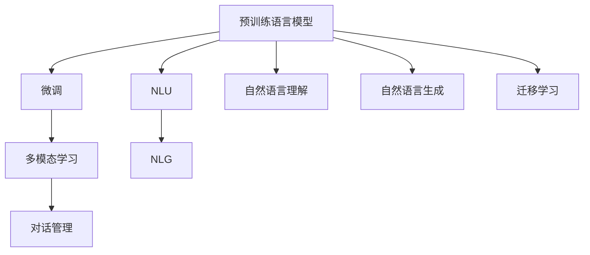

                 

# 电商平台中的自然语言处理：AI大模型的角色

> 关键词：自然语言处理, 电商平台, 人工智能, 大模型, 对话系统, 情感分析, 搜索推荐, 文本分类

## 1. 背景介绍

随着互联网的迅猛发展和电子商务的崛起，线上购物成为越来越多人的首选。电商平台也由此成为了一个汇聚大量用户与商品，数据量庞大的虚拟市场。在这个虚拟市场中，自然语言处理(Natural Language Processing, NLP)技术成为了用户与平台沟通的重要桥梁，影响着用户体验、商家曝光以及购物决策。

在电商平台中，NLP主要应用于以下几个方面：

- **对话系统**：解答用户疑问，提供购物指导。
- **情感分析**：分析用户评价和反馈，优化商品和服务。
- **搜索推荐**：理解用户查询意图，推荐相关商品。
- **文本分类**：对商品描述进行分类，提升搜索结果准确性。

这些应用场景都需要高质量的自然语言处理能力，而近年来，基于大模型的NLP技术成为了热门研究话题，其强大的语言理解和生成能力，可以大幅提升平台的用户体验和运营效率。

## 2. 核心概念与联系

### 2.1 核心概念概述

在大模型语境下，自然语言处理(NLP)涉及多个关键技术组件，包括：

- **预训练语言模型(Pre-trained Language Models, PLMs)**：如BERT、GPT等，在大规模无标签数据上进行预训练，学习到丰富的语言知识。
- **微调(Fine-tuning)**：在特定任务上，使用少量标注数据对预训练模型进行有监督优化，提升模型在该任务上的性能。
- **迁移学习(Transfer Learning)**：将预训练模型的知识迁移到下游任务，提高新任务的学习效率。
- **多模态学习(Multimodal Learning)**：结合文本、图像、语音等多模态数据进行联合建模，增强NLP系统的感知能力。
- **对话管理(Dialogue Management)**：管理对话流程，确保系统能够连贯地与用户交互。
- **自然语言理解(Natural Language Understanding, NLU)**：理解自然语言输入的含义和结构，如分词、命名实体识别等。
- **自然语言生成(Natural Language Generation, NLG)**：生成自然语言输出，如自动生成商品描述、广告文案等。

这些概念之间的逻辑关系可以通过以下Mermaid流程图来展示：



这个流程图展示了预训练语言模型如何通过微调和迁移学习，与多模态学习和对话管理技术结合，完成自然语言理解与生成，从而在电商平台中提供多种应用服务。

## 3. 核心算法原理 & 具体操作步骤

### 3.1 算法原理概述

基于大模型的NLP技术，通常包括以下几个核心步骤：

1. **预训练模型选择**：选择适合的预训练语言模型，如BERT、GPT-2等，作为初始化参数。
2. **任务适配层设计**：根据任务需求，设计适当的输出层和损失函数，如分类任务使用交叉熵，生成任务使用负对数似然损失。
3. **微调训练**：在标注数据上使用梯度下降等优化算法进行微调，更新模型参数以适应特定任务。
4. **评估与部署**：在验证集和测试集上评估微调效果，并将模型部署到实际应用中。

### 3.2 算法步骤详解

以对话系统为例，其核心流程如下：

1. **数据准备**：收集平台用户对话记录，标注对话意图和上下文。
2. **模型加载与适配**：加载预训练的对话模型，并根据任务需求调整输出层。
3. **微调训练**：在标注数据上，使用AdamW等优化器，以学习率0.001进行微调训练。
4. **对话交互**：将用户输入通过预处理，输入模型进行推理，输出回复文本。
5. **结果评估**：在测试集上评估模型效果，如BLEU、ROUGE等指标。

### 3.3 算法优缺点

大模型在NLP中的应用，具有以下优点：

- **通用性**：预训练模型可以迁移到多种NLP任务中，提升任务性能。
- **灵活性**：微调过程灵活，可以根据不同任务需求快速调整。
- **高效性**：相较于从头训练，微调模型训练时间较短，资源消耗较低。

但同时，也存在一些缺点：

- **数据需求**：部分大模型微调需要大量的标注数据，获取成本较高。
- **模型复杂性**：大模型参数量巨大，推理复杂度较高，需要高效计算资源支持。
- **过拟合风险**：微调过程容易过拟合，导致泛化能力下降。

### 3.4 算法应用领域

大模型在电商平台中的应用主要包括以下几个方面：

1. **搜索推荐系统**：利用文本分类和情感分析技术，提升搜索结果和推荐精度。
2. **智能客服**：通过微调的对话系统，解答用户问题，提升客户满意度。
3. **广告投放**：基于用户情感分析和文本生成技术，定制个性化广告。
4. **内容推荐**：分析用户行为，生成个性化商品描述和文案。
5. **情感监测**：监测用户评价和反馈，优化产品和服务。

## 4. 数学模型和公式 & 详细讲解 & 举例说明

### 4.1 数学模型构建

以文本分类任务为例，我们可以使用BERT等大模型进行微调。假设输入文本为 $x$，对应的真实标签为 $y \in \{0,1\}$。模型的输出为 $y' = \text{softmax}(W\cdot x + b)$，其中 $W$ 为模型参数，$b$ 为偏置项。

### 4.2 公式推导过程

对于二分类任务，模型损失函数可以定义为交叉熵损失：

$$
L = -\frac{1}{N} \sum_{i=1}^N y_i \log y'_i + (1-y_i) \log (1-y'_i)
$$

其中 $N$ 为样本数，$y_i$ 为真实标签，$y'_i$ 为模型预测值。

### 4.3 案例分析与讲解

我们以电商平台中的商品评论情感分析为例。首先，准备一组标注好的评论及其情感标签，如“正面”、“负面”。然后，选择预训练模型BERT，将其作为初始化参数。

具体微调流程如下：

1. **数据预处理**：将评论文本进行分词，转化为模型可接受的格式。
2. **模型加载**：从HuggingFace加载BERT模型，设置输出层为线性分类器。
3. **微调训练**：在标注数据上，使用AdamW优化器，设置学习率为0.001，进行微调训练。
4. **结果评估**：在测试集上评估模型性能，如精度、召回率、F1分数等。

## 5. 项目实践：代码实例和详细解释说明

### 5.1 开发环境搭建

假设我们使用PyTorch和HuggingFace进行情感分析模型的微调。需要安装以下依赖：

```bash
pip install torch transformers
```

### 5.2 源代码详细实现

以下是基于HuggingFace的情感分析模型微调代码：

```python
from transformers import BertForSequenceClassification, AdamW
from transformers import BertTokenizer
import torch
import torch.nn as nn

device = torch.device('cuda' if torch.cuda.is_available() else 'cpu')

# 加载预训练模型和分词器
model = BertForSequenceClassification.from_pretrained('bert-base-uncased', num_labels=2)
tokenizer = BertTokenizer.from_pretrained('bert-base-uncased')

# 加载数据
train_data = ...
train_labels = ...
test_data = ...
test_labels = ...

# 数据预处理
def tokenize_data(texts):
    return tokenizer(texts, padding='max_length', truncation=True)

train_encodings = tokenize_data(train_data)
test_encodings = tokenize_data(test_data)

# 构建模型和优化器
model.to(device)
optimizer = AdamW(model.parameters(), lr=2e-5)

# 微调训练
model.train()
for epoch in range(epochs):
    for batch in train_dataloader:
        inputs = {key: val.to(device) for key, val in batch.items()}
        labels = inputs.pop('labels').to(device)
        outputs = model(**inputs)
        loss = outputs.loss
        loss.backward()
        optimizer.step()

# 结果评估
model.eval()
for batch in test_dataloader:
    inputs = {key: val.to(device) for key, val in batch.items()}
    outputs = model(**inputs)
    logits = outputs.logits
    predicted_labels = torch.argmax(logits, dim=1)
    accuracy = (predicted_labels == test_labels).float().mean().item()
    print(f'Test Accuracy: {accuracy:.4f}')
```

### 5.3 代码解读与分析

代码中关键步骤包括：

- **模型加载**：加载BERT预训练模型和分词器。
- **数据预处理**：使用`tokenizer`将文本数据分词，并转化为模型可接受的格式。
- **模型适配**：构建线性分类器作为模型输出层。
- **训练与评估**：在训练集上进行梯度下降优化，在测试集上评估模型性能。

## 6. 实际应用场景

### 6.1 智能客服系统

智能客服系统通过微调的对话模型，能够自动解答用户问题，提升客户体验。具体应用如下：

1. **问题理解**：系统自动解析用户输入的自然语言，识别出查询意图。
2. **内容生成**：根据查询意图，生成合适的回复内容。
3. **对话交互**：系统与用户进行多轮对话，逐步解决用户问题。
4. **效果评估**：系统记录用户反馈，不断优化对话模型。

### 6.2 搜索推荐系统

搜索推荐系统通过文本分类和情感分析，提升搜索结果和推荐精度。具体应用如下：

1. **意图理解**：分析用户查询意图，筛选相关商品。
2. **商品匹配**：对商品描述进行文本分类，判断与查询意图是否匹配。
3. **推荐生成**：根据商品分类结果，生成个性化推荐列表。
4. **效果评估**：通过A/B测试等手段，评估推荐效果，不断优化模型。

### 6.3 广告投放

广告投放系统通过情感分析技术，定制个性化广告。具体应用如下：

1. **情感分析**：分析用户评论和反馈，理解用户情感倾向。
2. **广告生成**：根据用户情感，生成不同的广告文案和设计。
3. **效果评估**：监测广告点击率和转化率，优化广告投放策略。

### 6.4 未来应用展望

未来，基于大模型的NLP技术将迎来更多创新和应用：

1. **零样本学习**：无需标注数据，通过自然语言描述直接生成输出。
2. **多模态融合**：结合文本、图像、语音等多模态数据，增强NLP系统的感知能力。
3. **自监督学习**：使用大量未标注数据进行训练，提高模型的泛化能力。
4. **联邦学习**：在多设备间分布式训练，保护用户隐私同时提升模型性能。
5. **对话生成**：生成更连贯、更自然的对话，提升用户交互体验。
6. **情感智能**：深入理解用户情感，提供个性化服务。

## 7. 工具和资源推荐

### 7.1 学习资源推荐

- **《自然语言处理综述》**：深入介绍NLP领域的基本概念和技术，适合初学者入门。
- **《深度学习》by Ian Goodfellow**：经典的深度学习教材，涵盖NLP、计算机视觉等多领域知识。
- **《Transformers: State-of-the-Art Natural Language Processing》**：HuggingFace官方文档，介绍大模型的最新研究进展。
- **《NLP中的多模态学习》**：讲解如何结合多种数据类型，提高NLP系统的表现。

### 7.2 开发工具推荐

- **PyTorch**：深度学习框架，支持动态计算图，适合快速迭代研究。
- **TensorFlow**：Google开源的深度学习框架，支持大规模工程应用。
- **HuggingFace Transformers**：NLP工具库，提供多种预训练模型和微调框架。
- **TensorBoard**：可视化工具，实时监控模型训练状态。
- **Weights & Biases**：实验跟踪工具，记录和分析模型训练和测试结果。

### 7.3 相关论文推荐

- **Attention is All You Need**：Transformer模型论文，开启了预训练语言模型的时代。
- **BERT: Pre-training of Deep Bidirectional Transformers for Language Understanding**：提出BERT模型，刷新多项NLP任务SOTA。
- **Language Models are Unsupervised Multitask Learners**：展示了大模型在zero-shot学习中的强大能力。
- **AdaLoRA: Adaptive Low-Rank Adaptation for Parameter-Efficient Fine-Tuning**：提出自适应低秩适应的微调方法，在固定大部分预训练参数的同时，只更新极少量的任务相关参数。

## 8. 总结：未来发展趋势与挑战

### 8.1 研究成果总结

本文详细介绍了基于大模型的NLP技术在电商平台中的应用，包括对话系统、情感分析、搜索推荐等。通过微调、迁移学习和多模态学习等技术，这些应用提升了用户体验和平台运营效率。

### 8.2 未来发展趋势

未来，NLP技术将进一步向智能化、普适化方向发展：

1. **零样本学习**：利用大模型在少量描述下生成输出，提升模型的泛化能力。
2. **多模态融合**：结合多种数据类型，增强NLP系统的感知能力。
3. **自监督学习**：利用未标注数据进行训练，提高模型的泛化能力。
4. **联邦学习**：分布式训练提升模型性能，保护用户隐私。
5. **对话生成**：生成更连贯、更自然的对话，提升用户交互体验。
6. **情感智能**：深入理解用户情感，提供个性化服务。

### 8.3 面临的挑战

虽然大模型在NLP应用中取得了显著成效，但也面临着一些挑战：

1. **数据需求**：部分大模型微调需要大量的标注数据，获取成本较高。
2. **模型复杂性**：大模型参数量巨大，推理复杂度较高，需要高效计算资源支持。
3. **过拟合风险**：微调过程容易过拟合，导致泛化能力下降。

### 8.4 研究展望

未来研究需要在以下几个方面进行突破：

1. **模型压缩**：通过剪枝、量化等技术，降低模型参数量，提升推理速度。
2. **数据增强**：使用数据增强技术，扩充训练集，提升模型泛化能力。
3. **对抗训练**：引入对抗样本，提高模型的鲁棒性。
4. **可解释性**：开发可解释性模型，增强模型的透明度。
5. **隐私保护**：结合联邦学习等技术，保护用户隐私。

## 9. 附录：常见问题与解答

### 附录：常见问题与解答

**Q1：大模型在电商平台中的应用主要有哪些？**

A: 大模型在电商平台中的应用主要包括以下几个方面：

- **搜索推荐系统**：利用文本分类和情感分析技术，提升搜索结果和推荐精度。
- **智能客服**：通过微调的对话系统，解答用户问题，提升客户体验。
- **广告投放**：基于用户情感分析和文本生成技术，定制个性化广告。
- **内容推荐**：分析用户行为，生成个性化商品描述和文案。
- **情感监测**：监测用户评价和反馈，优化产品和服务。

**Q2：大模型微调时需要哪些步骤？**

A: 大模型微调的基本步骤如下：

1. **数据准备**：收集标注数据，准备训练和验证集。
2. **模型加载与适配**：选择预训练模型，并根据任务需求调整输出层。
3. **微调训练**：使用梯度下降等优化算法，更新模型参数。
4. **结果评估**：在验证集和测试集上评估模型性能。
5. **效果优化**：根据评估结果，调整超参数，进行二次微调。

**Q3：如何降低大模型微调对标注数据的依赖？**

A: 降低大模型微调对标注数据的依赖，可以尝试以下方法：

- **数据增强**：通过回译、近义替换等方式扩充训练集。
- **自监督学习**：利用无标签数据进行预训练，提高模型泛化能力。
- **少样本学习**：利用少量标注数据进行微调，提升模型表现。
- **模型压缩**：通过剪枝、量化等技术，减小模型规模。

**Q4：如何提升大模型的可解释性？**

A: 提升大模型的可解释性，可以尝试以下方法：

- **注意力机制**：引入注意力机制，分析模型对输入的关注点。
- **可解释性模块**：开发可解释性模块，解释模型输出。
- **可视化工具**：使用可视化工具，展示模型推理过程。
- **对抗样本分析**：分析模型对对抗样本的鲁棒性，揭示模型内部机制。

---

作者：禅与计算机程序设计艺术 / Zen and the Art of Computer Programming

