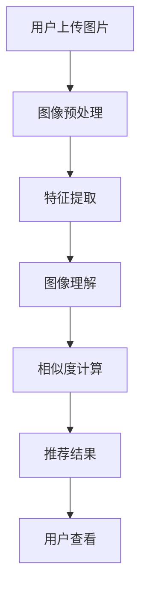

                 

# 电商平台中的视觉搜索：AI大模型的图像理解

## 1. 背景介绍

随着互联网和电商平台的迅速发展，消费者对购物体验的要求越来越高，更加注重直观和便捷的搜索方式。传统的基于关键词的搜索方式，虽然在一定程度上满足了需求，但存在一定的局限性。消费者在搜索时往往需要花费大量时间输入复杂的关键词，而结果通常无法满足实际需求，导致购物体验不佳。

为了解决这一问题，电商平台逐渐引入了视觉搜索技术，通过用户上传的图片或视频，自动匹配并推荐相似的物品，极大地提升了用户体验。视觉搜索的核心在于对图像的深度理解，而这一任务通过应用AI大模型（如基于Transformer的图像理解模型）得以高效完成。本文将深入探讨视觉搜索中的AI大模型图像理解技术，阐述其原理和应用。

## 2. 核心概念与联系

### 2.1 核心概念概述

- **视觉搜索（Visual Search）**：指用户通过上传图片或视频，利用AI技术自动匹配和推荐类似物品的搜索方式。
- **AI大模型（AI Large Model）**：指具有大规模参数和高度并行计算能力的深度学习模型，如BERT、GPT、ViT等。
- **图像理解（Image Understanding）**：指利用AI模型对图像进行语义分析和特征提取的过程，包括图像分类、物体检测、语义分割等。
- **特征提取（Feature Extraction）**：指从图像中提取出有用的特征，用于图像理解或检索。
- **相似度计算（Similarity Calculation）**：指计算两个图像之间的相似度，用于推荐相似物品。
- **多模态学习（Multi-modal Learning）**：指结合图像、文本等多种模态的信息进行学习，提升视觉搜索的精度和效果。

### 2.2 核心概念原理和架构的 Mermaid 流程图



**解释**：
- **A**：用户通过电商平台上传图片或视频。
- **B**：对上传的图像进行预处理，如归一化、裁剪、调整大小等。
- **C**：利用AI大模型进行特征提取，将图像转化为模型可以理解的特征向量。
- **D**：通过图像理解模型，对提取的特征进行语义分析，如物体检测、分类等。
- **E**：计算查询图像与库中图像之间的相似度，选择相似度最高的物品进行推荐。
- **F**：生成推荐结果，展示给用户查看。
- **G**：用户根据推荐结果进行进一步选择，完成购物。

## 3. 核心算法原理 & 具体操作步骤

### 3.1 算法原理概述

视觉搜索中的图像理解，核心在于利用大模型对图像进行特征提取和语义分析，从而实现图像的相似度计算和推荐。以下详细阐述基于Transformer的图像理解模型的核心原理。

### 3.2 算法步骤详解

#### 步骤1：图像预处理

首先，对用户上传的图像进行预处理，以适应模型输入的要求。常见的预处理操作包括：

- 归一化：将图像像素值缩放到[0, 1]或[-1, 1]的范围内，以便模型处理。
- 裁剪：将图像裁剪为模型输入尺寸，通常是224x224或320x320等。
- 调整大小：根据需要调整图像大小，确保输入尺寸一致。

#### 步骤2：特征提取

接下来，利用大模型对预处理后的图像进行特征提取。以ViT（Vision Transformer）为例，其特征提取过程如下：

1. **分块**：将图像分块，每个块大小为32x32。
2. **嵌入**：将每个块转化为嵌入向量。
3. **自注意力机制**：通过多头自注意力机制，计算每个块与其他块之间的注意力权重。
4. **编码**：将注意力权重和嵌入向量作为输入，通过多层的全连接和激活函数，最终输出图像的特征向量。

#### 步骤3：图像理解

图像理解通常包括图像分类、物体检测、语义分割等任务。以分类为例，模型输出的特征向量通过softmax函数转化为类别概率分布，最终输出图像所属的类别。

#### 步骤4：相似度计算

在得到查询图像和库中图像的特征向量后，计算它们之间的相似度。常用的相似度计算方法包括余弦相似度、欧式距离、KL散度等。以余弦相似度为例，计算公式为：

$$
\cos\theta = \frac{\mathbf{v}_q \cdot \mathbf{v}_i}{\|\mathbf{v}_q\| \cdot \|\mathbf{v}_i\|}
$$

其中，$\mathbf{v}_q$和$\mathbf{v}_i$分别为查询图像和库中图像的特征向量。

#### 步骤5：推荐结果

根据相似度计算结果，选择相似度最高的物品进行推荐。通常推荐系统会根据相似度排序，选择前几个物品进行展示。用户可以根据推荐结果进行进一步选择，完成购物。

### 3.3 算法优缺点

#### 优点

1. **高效性**：大模型能够快速处理和理解大量图像数据，使得视觉搜索在短时间内完成推荐。
2. **准确性**：大模型具有强大的特征提取和语义理解能力，能够准确地匹配和推荐相似物品。
3. **灵活性**：多模态学习结合了图像和文本等多种信息，能够提升推荐精度和多样性。
4. **可扩展性**：大模型支持并行计算，能够快速扩展到更大的数据集和更复杂的任务。

#### 缺点

1. **计算资源需求高**：大模型通常需要大规模的GPU或TPU计算资源，对硬件要求较高。
2. **训练时间长**：大模型的训练时间较长，需要大量数据和计算资源。
3. **模型复杂性高**：大模型的结构复杂，参数量大，增加了调试和优化的难度。
4. **泛化能力有限**：大模型在某些特定领域或小数据集上，可能无法达到理想效果。

### 3.4 算法应用领域

视觉搜索技术已经在多个电商平台上得到了广泛应用，如淘宝、京东、亚马逊等。在实际应用中，大模型的图像理解能力被用于以下几个方面：

- **相似物品推荐**：通过上传用户图片，自动推荐相似的物品。
- **图像搜索**：用户输入关键词，自动查找和展示相关的图像。
- **个性化定制**：结合用户的购物历史和偏好，推荐个性化商品。
- **商品展示优化**：优化商品的图片展示效果，提升用户体验。
- **质量控制**：检测商品图片是否符合标准，提高商品质量。

## 4. 数学模型和公式 & 详细讲解 & 举例说明

### 4.1 数学模型构建

假设查询图像的特征向量为$\mathbf{v}_q$，库中图像的特征向量为$\mathbf{v}_i$。利用余弦相似度计算两者之间的相似度，得到相似度值$cos\theta$。

### 4.2 公式推导过程

$$
\cos\theta = \frac{\mathbf{v}_q \cdot \mathbf{v}_i}{\|\mathbf{v}_q\| \cdot \|\mathbf{v}_i\|}
$$

其中，$\cdot$表示向量点乘，$\|\cdot\|$表示向量范数。

### 4.3 案例分析与讲解

以淘宝为例，用户上传一双鞋的图片，系统会自动提取图像特征，与库中鞋的图片进行相似度计算，选择相似度最高的几个商品进行推荐。同时，系统会根据用户的购物历史和偏好，结合文字描述、价格等因素，生成更加精准的推荐结果。

## 5. 项目实践：代码实例和详细解释说明

### 5.1 开发环境搭建

以下是使用Python和PyTorch搭建视觉搜索系统的环境配置步骤：

1. 安装Anaconda：
```
conda create -n vision-search python=3.8
conda activate vision-search
```

2. 安装PyTorch和相关库：
```
pip install torch torchvision transformers
```

3. 准备数据集：收集并标注图像数据，存储为TensorFlowRecord格式。

4. 训练模型：使用ImageNet数据集训练ViT模型。

### 5.2 源代码详细实现

```python
import torch
from torchvision import transforms
from transformers import VisionEncoderModel, ViTFeatureExtractor

# 定义图像预处理
transforms = transforms.Compose([
    transforms.Resize(224),
    transforms.CenterCrop(224),
    transforms.ToTensor(),
    transforms.Normalize(mean=[0.485, 0.456, 0.406], std=[0.229, 0.224, 0.225])
])

# 加载预训练的ViT模型
model = VisionEncoderModel.from_pretrained('google/vit-base-patch32-224-in21k')

# 加载特征提取器
feature_extractor = ViTFeatureExtractor.from_pretrained('google/vit-base-patch32-224-in21k')

# 加载训练数据
train_dataset = ...

# 定义优化器和损失函数
optimizer = torch.optim.Adam(model.parameters(), lr=1e-4)
loss_fn = torch.nn.CrossEntropyLoss()

# 训练模型
for epoch in range(10):
    model.train()
    for images, labels in train_loader:
        images = images.to(device)
        labels = labels.to(device)
        outputs = model(images)
        loss = loss_fn(outputs, labels)
        optimizer.zero_grad()
        loss.backward()
        optimizer.step()
    print('Epoch {}: Loss {}'.format(epoch+1, loss.item()))

# 保存模型
torch.save(model.state_dict(), 'model.pth')
```

### 5.3 代码解读与分析

- **transforms.Compose**：将多个预处理操作组合成一个，简化预处理流程。
- **VisionEncoderModel**：加载预训练的ViT模型，用于特征提取和分类。
- **ViTFeatureExtractor**：加载特征提取器，用于将图像转化为模型可处理的嵌入向量。
- **torch.nn.CrossEntropyLoss**：定义交叉熵损失函数，用于训练分类任务。
- **optimizer.zero_grad()**：重置梯度，避免梯度累积。
- **optimizer.step()**：更新模型参数。

## 6. 实际应用场景

### 6.1 智能家居

在智能家居领域，视觉搜索技术可以用于家电的智能化控制。例如，用户通过上传房间图片，系统自动推荐适合该房间的家具和家电，同时自动调节灯光、温度等环境参数，提升居住体验。

### 6.2 个性化推荐

在个性化推荐系统上，视觉搜索技术可以结合用户的购物历史和偏好，自动推荐相似的商品。例如，用户上传一条裙子的图片，系统自动推荐其他风格或颜色的裙子，提升购物体验和转化率。

### 6.3 医疗影像分析

在医疗影像分析中，视觉搜索技术可以用于检测和诊断疾病。例如，医生上传病人的影像数据，系统自动匹配相似的病例，辅助医生进行诊断和治疗决策。

## 7. 工具和资源推荐

### 7.1 学习资源推荐

1. **《深度学习：理论与实践》**：该书系统介绍了深度学习的基础理论和应用实践，包括视觉搜索技术。
2. **Coursera《深度学习》课程**：斯坦福大学开设的深度学习课程，涵盖了深度学习的理论基础和实践技术。
3. **GitHub上的ViT模型代码**：包含完整的ViT模型训练和部署代码，适合初学者学习。

### 7.2 开发工具推荐

1. **PyTorch**：基于Python的开源深度学习框架，提供了丰富的深度学习模型和工具。
2. **TensorFlow**：由Google主导的深度学习框架，支持分布式计算和模型部署。
3. **Jupyter Notebook**：交互式的编程环境，支持多种编程语言和数据处理库。

### 7.3 相关论文推荐

1. **ViT: An Image Transformer for Visual Recognition**：提出ViT模型，通过自注意力机制实现图像理解。
2. **CLIP: Contrastive Learning for Unsupervised Visual Classification and Detection**：提出CLIP模型，利用自监督学习方法进行图像分类和检测。
3. **RetinaNet: Single-stage Object Detection with RetinaNet**：提出RetinaNet模型，通过focal loss解决目标检测中的类别不平衡问题。

## 8. 总结：未来发展趋势与挑战

### 8.1 研究成果总结

视觉搜索中的大模型图像理解技术已经取得了显著进展，在电商、智能家居、医疗等领域得到了广泛应用。未来，随着模型的不断优化和硬件的进步，视觉搜索的准确性和速度将进一步提升，为用户带来更好的体验。

### 8.2 未来发展趋势

1. **模型规模增大**：未来的视觉搜索模型将进一步增大参数量和计算资源需求，提升模型的表现力。
2. **多模态融合**：结合图像和文本等多种信息，提升视觉搜索的精度和效果。
3. **自监督学习**：利用无标签数据进行自监督学习，减少对标注数据的依赖。
4. **实时处理**：优化模型结构，提升计算效率，实现实时图像理解。
5. **跨领域应用**：将视觉搜索技术应用到更多领域，如自动驾驶、工业检测等。

### 8.3 面临的挑战

1. **计算资源需求高**：大模型需要大规模计算资源，增加了系统的硬件成本。
2. **训练时间长**：大模型训练时间较长，增加了系统的时间成本。
3. **模型复杂性高**：大模型的结构复杂，增加了调试和优化的难度。
4. **泛化能力有限**：大模型在某些特定领域或小数据集上，可能无法达到理想效果。

### 8.4 研究展望

未来的视觉搜索研究需要从以下几个方向进行突破：

1. **模型压缩与优化**：采用模型压缩和优化技术，降低计算资源需求。
2. **自监督学习与数据增强**：利用无标签数据进行自监督学习，提高模型泛化能力。
3. **多模态学习**：结合图像和文本等多种信息，提升视觉搜索的精度和效果。
4. **实时处理与边缘计算**：优化模型结构，提升计算效率，实现实时图像理解。
5. **跨领域应用**：将视觉搜索技术应用到更多领域，如自动驾驶、工业检测等。

## 9. 附录：常见问题与解答

**Q1: 大模型图像理解技术的计算资源需求高，如何解决？**

A: 可以通过模型压缩和优化技术，如剪枝、量化、蒸馏等方法，降低计算资源需求。同时，可以采用边缘计算和分布式计算，将计算任务分布到多个设备上进行处理。

**Q2: 如何提高大模型的泛化能力？**

A: 可以通过自监督学习和数据增强方法，利用无标签数据进行预训练，提高模型的泛化能力。同时，可以在不同的数据集和任务上进行模型微调，提升模型的适应性。

**Q3: 如何实现实时图像理解？**

A: 可以通过优化模型结构和计算图，提升模型的计算效率。同时，可以采用硬件加速和分布式计算技术，实现实时图像理解。

**Q4: 如何将视觉搜索技术应用到更多领域？**

A: 可以结合不同领域的特性和需求，对视觉搜索模型进行针对性优化和扩展。例如，在医疗领域，可以结合医学知识库和专家规则，提升医疗影像的分析和诊断效果。

---

作者：禅与计算机程序设计艺术 / Zen and the Art of Computer Programming

