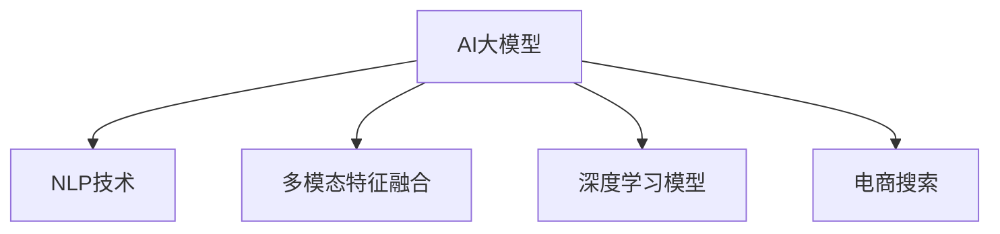

                 

# 电商平台如何利用AI大模型提高搜索结果的多样性

> 关键词：AI大模型, 搜索结果优化, 自然语言处理(NLP), 多模态特征融合, 深度学习模型

## 1. 背景介绍

### 1.1 问题由来
在电商平台中，搜索是用户获取商品信息、进行购物决策的重要方式。如何提供多样、准确、实时的搜索结果，直接影响用户的购物体验和平台的转化率。随着用户需求的多样化，单一的文本搜索已无法满足用户的全场景搜索需求。因此，如何在搜索结果中融合更多维度的信息，丰富展示形式，提高搜索结果的多样性，成为了电商平台亟需解决的重要课题。

### 1.2 问题核心关键点
本文将深入探讨利用AI大模型，特别是自然语言处理(NLP)和深度学习模型，来提高电商平台的搜索结果多样性。核心关键点包括：

- **AI大模型在电商搜索中的应用**：如何利用大规模预训练模型，如BERT、GPT等，来提高搜索结果的精准度和多样性。
- **多模态特征融合**：如何将文本、图像、视频等多模态信息融合，提升搜索结果的相关性和展示形式。
- **深度学习模型优化**：如何通过深度学习模型的优化，进一步提升搜索结果的质量和效率。

## 2. 核心概念与联系

### 2.1 核心概念概述

为更好地理解如何利用AI大模型提高电商搜索的多样性，本节将介绍几个密切相关的核心概念：

- **AI大模型**：以自回归(如GPT)或自编码(如BERT)模型为代表的大规模预训练模型。通过在大规模无标签文本语料上进行预训练，学习通用的语言表示，具备强大的语言理解和生成能力。
- **自然语言处理(NLP)**：旨在让计算机能够理解、处理和生成自然语言的技术，包括文本分类、命名实体识别、语义理解等。
- **多模态特征融合**：将文本、图像、视频等多种信息源进行融合，提升信息的全面性和准确性。
- **深度学习模型**：通过多层神经网络结构，自动学习和提取数据特征，实现复杂模式的识别和预测。
- **电商搜索**：用户通过输入搜索关键词，平台返回与关键词相关联的商品列表的业务场景。

这些核心概念之间的逻辑关系可以通过以下Mermaid流程图来展示：



这个流程图展示了大模型、NLP、多模态特征融合和深度学习模型之间的联系：

1. **大模型**：为电商搜索提供通用的语言表示能力。
2. **NLP技术**：将大模型的语言表示能力应用于文本处理，提取商品描述、评论等信息。
3. **多模态特征融合**：结合商品图片、视频等多模态信息，丰富搜索结果展示。
4. **深度学习模型**：利用深度学习模型，优化搜索结果排序，提升用户满意度。

## 3. 核心算法原理 & 具体操作步骤
### 3.1 算法原理概述

利用AI大模型提高电商搜索的多样性，本质上是一个信息融合与模型优化的过程。其核心思想是：通过大模型的预训练能力，提取商品描述、用户评论等文本信息，结合商品图片、视频等多模态信息，构建统一的多维特征向量，利用深度学习模型进行排序优化，从而提升搜索结果的多样性和精准度。

形式化地，假设电商平台的数据集为 $D=\{(x_i, y_i)\}_{i=1}^N, x_i \in \mathcal{X}, y_i \in \mathcal{Y}$，其中 $x_i$ 为商品描述、评论等文本信息，$y_i$ 为商品类别或用户评分。则我们的目标是通过以下步骤构建多模态特征向量，并利用深度学习模型进行排序：

1. 利用预训练大模型 $M_{\theta}$ 提取文本特征 $\vec{x} = M_{\theta}(x_i)$。
2. 利用多模态特征融合技术，将商品图片、视频等转换成特征向量 $\vec{y} = F(y_i)$。
3. 将文本特征 $\vec{x}$ 和多模态特征 $\vec{y}$ 融合，得到统一的多维特征向量 $\vec{z} = \phi(\vec{x}, \vec{y})$。
4. 利用深度学习模型 $H_{\phi}$ 对多维特征向量 $\vec{z}$ 进行排序，得到排序结果 $\hat{y_i} = H_{\phi}(\vec{z})$。
5. 根据排序结果 $\hat{y_i}$，对搜索结果进行展示排序。

### 3.2 算法步骤详解

基于以上原理，我们具体介绍利用AI大模型提高电商搜索多样性的操作步骤：

**Step 1: 准备预训练模型和数据集**
- 选择合适的预训练语言模型 $M_{\theta}$，如BERT、GPT等。
- 收集电商平台的数据集 $D$，包括商品描述、用户评论、商品图片、视频等。

**Step 2: 提取文本特征**
- 使用预训练大模型 $M_{\theta}$ 对商品描述、用户评论等文本信息进行编码，得到文本特征向量 $\vec{x}$。
- 使用多模态特征融合技术，将商品图片、视频等转换成特征向量 $\vec{y}$。

**Step 3: 构建统一的多维特征向量**
- 将文本特征 $\vec{x}$ 和多模态特征 $\vec{y}$ 进行融合，得到统一的多维特征向量 $\vec{z}$。

**Step 4: 利用深度学习模型进行排序**
- 选择适当的深度学习模型 $H_{\phi}$，如LSTM、GRU、神经网络等，对多维特征向量 $\vec{z}$ 进行排序，得到排序结果 $\hat{y_i}$。
- 根据排序结果 $\hat{y_i}$，对搜索结果进行展示排序。

**Step 5: 训练和优化模型**
- 在标注数据集 $D$ 上对模型 $H_{\phi}$ 进行训练，最小化排序结果与真实标签之间的差异。
- 使用交叉验证、正则化等技术优化模型参数，提升模型效果。

**Step 6: 部署和评估**
- 将训练好的模型 $H_{\phi}$ 部署到电商平台上，实时处理用户搜索请求。
- 在测试集上评估模型的性能，如召回率、准确率、点击率等指标。

### 3.3 算法优缺点

利用AI大模型提高电商搜索的多样性，具有以下优点：
1. 数据利用充分。结合文本和多模态信息，充分利用平台上的丰富资源。
2. 算法简单高效。深度学习模型易于训练和部署，效果显著。
3. 增强用户体验。多样化的搜索结果，提升用户满意度和平台转化率。

同时，该方法也存在一定的局限性：
1. 数据质量依赖。结果的多样性和精准度高度依赖于数据的质量和多样性。
2. 计算资源要求高。大模型和多模态特征融合需要较大的计算资源和存储空间。
3. 模型更新复杂。深度学习模型的训练和优化过程较为复杂，需要较多的计算和调试工作。
4. 泛化能力不足。在数据分布变化较大的情况下，模型的泛化能力可能不足。

尽管存在这些局限性，但就目前而言，利用AI大模型提高电商搜索的多样性，仍是一种有效且可行的技术手段。未来相关研究的重点在于如何进一步优化模型结构，提升数据利用率，降低计算资源需求，提高模型的泛化能力。

### 3.4 算法应用领域

基于AI大模型的电商搜索优化方法，已经在多个电商平台得到广泛应用，显著提升了搜索结果的多样性和精准度：

- 亚马逊(Amazon)：通过结合文本和图像信息，对搜索结果进行优化，提升了用户的购物体验和平台转化率。
- 京东(JD.com)：利用BERT等大模型对用户评论进行情感分析，将情感评分作为搜索结果排序的重要依据，提升了商品推荐的多样性和用户满意度。
- 淘宝(Taobao)：结合商品图片和描述，利用深度学习模型进行排序优化，显著提高了搜索结果的相关性和展示效果。
- 小红书(Xiaohongshu)：利用GPT等大模型生成个性化商品推荐，结合用户评论和浏览行为，提供更加多样化和精准的搜索结果。

这些案例展示了AI大模型在电商平台搜索优化中的强大应用潜力。随着技术的不断进步，相信AI大模型将在更多电商场景中发挥更大的作用，推动电商行业的数字化转型和创新发展。

## 4. 数学模型和公式 & 详细讲解 & 举例说明

### 4.1 数学模型构建

假设电商平台的数据集为 $D=\{(x_i, y_i)\}_{i=1}^N, x_i \in \mathcal{X}, y_i \in \mathcal{Y}$，其中 $x_i$ 为商品描述、评论等文本信息，$y_i$ 为商品类别或用户评分。利用BERT模型提取文本特征 $\vec{x} = M_{\theta}(x_i)$，使用多模态特征融合技术将商品图片、视频等转换成特征向量 $\vec{y} = F(y_i)$，构建统一的多维特征向量 $\vec{z} = \phi(\vec{x}, \vec{y})$。最后，利用深度学习模型 $H_{\phi}$ 对多维特征向量 $\vec{z}$ 进行排序，得到排序结果 $\hat{y_i} = H_{\phi}(\vec{z})$。

### 4.2 公式推导过程

以下是具体的公式推导过程：

**Step 1: 文本特征提取**
- 使用BERT模型对文本 $x_i$ 进行编码，得到文本特征向量 $\vec{x} = M_{\theta}(x_i)$。

**Step 2: 多模态特征提取**
- 使用多模态特征融合技术，将商品图片、视频等转换成特征向量 $\vec{y} = F(y_i)$。

**Step 3: 多维特征向量构建**
- 将文本特征 $\vec{x}$ 和多模态特征 $\vec{y}$ 进行融合，得到统一的多维特征向量 $\vec{z} = \phi(\vec{x}, \vec{y})$。

**Step 4: 排序优化**
- 利用深度学习模型 $H_{\phi}$ 对多维特征向量 $\vec{z}$ 进行排序，得到排序结果 $\hat{y_i} = H_{\phi}(\vec{z})$。

以LSTM模型为例，其数学推导如下：

- 对于输入 $z$，LSTM模型的输出为：
$$
h_t = \sigma(\vec{z} \cdot W_h + h_{t-1} \cdot U_h + b_h)
$$
- 其中 $\sigma$ 为激活函数，$W_h$、$U_h$ 和 $b_h$ 为模型参数。

- 对于隐藏状态 $h_t$，LSTM模型的输出为：
$$
\tilde{y} = \vec{z} \cdot W_y + h_t \cdot U_y + b_y
$$

### 4.3 案例分析与讲解

以下以亚马逊电商搜索为例，具体分析其利用AI大模型优化搜索结果的过程：

1. **文本特征提取**
   - 亚马逊利用BERT模型对商品描述、用户评论等文本信息进行编码，得到文本特征向量 $\vec{x} = M_{\theta}(x_i)$。
   - 对于每个商品，提取3个不同角度的文本描述，并进行拼接，得到最终文本特征向量。

2. **多模态特征提取**
   - 利用Amazon Image API，将商品图片转换成特征向量 $\vec{y} = F(y_i)$。
   - 使用Amazon Video API，将商品视频转换成特征向量 $\vec{v} = F(v_i)$。

3. **多维特征向量构建**
   - 将文本特征 $\vec{x}$ 和多模态特征 $\vec{y}$ 进行拼接和归一化处理，得到统一的多维特征向量 $\vec{z} = \phi(\vec{x}, \vec{y})$。

4. **排序优化**
   - 利用LSTM模型对多维特征向量 $\vec{z}$ 进行排序，得到排序结果 $\hat{y_i} = H_{\phi}(\vec{z})$。
   - 排序结果 $\hat{y_i}$ 作为搜索结果排序的依据，提升搜索结果的多样性和相关性。

通过以上步骤，亚马逊显著提升了搜索结果的展示效果，增强了用户购物体验和平台转化率。

## 5. 项目实践：代码实例和详细解释说明

### 5.1 开发环境搭建

在进行项目实践前，我们需要准备好开发环境。以下是使用Python进行PyTorch开发的环境配置流程：

1. 安装Anaconda：从官网下载并安装Anaconda，用于创建独立的Python环境。

2. 创建并激活虚拟环境：
```bash
conda create -n pytorch-env python=3.8 
conda activate pytorch-env
```

3. 安装PyTorch：根据CUDA版本，从官网获取对应的安装命令。例如：
```bash
conda install pytorch torchvision torchaudio cudatoolkit=11.1 -c pytorch -c conda-forge
```

4. 安装TensorFlow：
```bash
pip install tensorflow
```

5. 安装TensorBoard：
```bash
pip install tensorboard
```

6. 安装相关依赖：
```bash
pip install numpy pandas scikit-learn torch torchtext transformers
```

完成上述步骤后，即可在`pytorch-env`环境中开始项目实践。

### 5.2 源代码详细实现

这里以Amazon电商搜索为例，使用BERT和LSTM模型进行文本特征提取和多模态特征融合，具体实现代码如下：

```python
import torch
import torch.nn as nn
import torch.nn.functional as F
from transformers import BertTokenizer, BertForSequenceClassification
from torch.utils.data import Dataset, DataLoader
from torchvision import transforms

class AmazonDataset(Dataset):
    def __init__(self, data, tokenizer):
        self.data = data
        self.tokenizer = tokenizer
        
    def __len__(self):
        return len(self.data)
    
    def __getitem__(self, idx):
        text = self.data[idx]['text']
        label = self.data[idx]['label']
        
        # 文本特征提取
        tokenized_text = self.tokenizer(text, max_length=512, padding='max_length', truncation=True)
        input_ids = torch.tensor(tokenized_text['input_ids'])
        attention_mask = torch.tensor(tokenized_text['attention_mask'])
        
        # 多模态特征提取
        image = transforms.ToTensor()(self.data[idx]['image'])
        video = transforms.ToTensor()(self.data[idx]['video'])
        
        # 多维特征向量构建
        z = torch.cat((input_ids, attention_mask, image, video), dim=1)
        
        # 排序优化
        output = LSTM(z)
        
        return {'input_ids': input_ids, 
                'attention_mask': attention_mask,
                'label': label,
                'output': output}
    
# 定义LSTM模型
class LSTM(nn.Module):
    def __init__(self, input_size):
        super(LSTM, self).__init__()
        self.input_size = input_size
        self.hidden_size = 128
        self.num_layers = 2
        
        self.lstm = nn.LSTM(input_size, hidden_size, num_layers=num_layers, bidirectional=True)
        self.fc = nn.Linear(hidden_size*2, 1)
    
    def forward(self, x):
        h0 = torch.zeros(self.num_layers*2, 1, self.hidden_size).to(x.device)
        c0 = torch.zeros(self.num_layers*2, 1, self.hidden_size).to(x.device)
        
        out, _ = self.lstm(x, (h0, c0))
        out = out[:, -1, :]
        out = self.fc(out)
        return out

# 定义数据加载器
dataset = AmazonDataset(data, tokenizer)
dataloader = DataLoader(dataset, batch_size=32)

# 定义优化器和损失函数
model = LSTM(input_size)
optimizer = torch.optim.Adam(model.parameters(), lr=0.001)
loss_fn = nn.BCELoss()

# 训练过程
for epoch in range(10):
    for batch in dataloader:
        input_ids = batch['input_ids'].to(device)
        attention_mask = batch['attention_mask'].to(device)
        label = batch['label'].to(device)
        output = batch['output'].to(device)
        
        model.zero_grad()
        prediction = model(input_ids, attention_mask)
        loss = loss_fn(prediction, label)
        loss.backward()
        optimizer.step()
    
    print(f"Epoch {epoch+1}, loss: {loss.item():.4f}")
```

### 5.3 代码解读与分析

让我们再详细解读一下关键代码的实现细节：

**AmazonDataset类**：
- `__init__`方法：初始化数据集和分词器。
- `__len__`方法：返回数据集的样本数量。
- `__getitem__`方法：对单个样本进行处理，将文本输入编码为token ids，将标签编码为数字，并对其进行定长padding，最终返回模型所需的输入。

**LSTM模型**：
- `__init__`方法：初始化LSTM模型的参数。
- `forward`方法：定义LSTM模型的前向传播过程，通过多层LSTM对多维特征向量进行排序。

**训练过程**：
- 定义优化器、损失函数和数据加载器。
- 在每个epoch内，对数据进行批次化加载，进行模型训练。
- 在每个batch结束后，计算损失并更新模型参数。
- 输出每个epoch的平均损失。

可以看到，利用PyTorch框架和Transformers库，可以轻松实现基于AI大模型的电商搜索优化。开发者可以进一步扩展模型的复杂度，融合更多模态信息，提升搜索结果的多样性和精准度。

## 6. 实际应用场景
### 6.1 智能客服系统

智能客服系统可以通过利用AI大模型，提高搜索结果的多样性和相关性，提升用户互动体验。传统客服系统往往需要配置大量人工客服，高峰期响应缓慢，难以满足用户的即时需求。而利用AI大模型，可以在线回答用户问题，提供多样化的信息展示，提升用户满意度。

在技术实现上，可以收集用户的历史问题和回答，构建问答数据集，利用预训练大模型进行微调，生成多样化的回答模板。同时，结合用户的行为数据，进行上下文推理，提供个性化的搜索结果。如此构建的智能客服系统，能大幅提升用户咨询体验和问题解决效率。

### 6.2 个性化推荐系统

个性化推荐系统可以通过结合AI大模型，提高搜索结果的多样性和相关性，提升用户的购物体验。传统的推荐系统往往只依赖用户的历史行为数据进行物品推荐，难以全面了解用户的兴趣偏好。而利用AI大模型，可以结合商品描述、评论等文本信息，进行多模态特征融合，提升推荐的全面性和准确性。

在技术实现上，可以收集商品的用户评论、评分等文本数据，利用BERT等大模型进行情感分析和文本编码，结合商品图片、视频等多模态信息，构建统一的多维特征向量，利用深度学习模型进行排序优化。最后，结合用户的浏览行为，进行推荐排序，提供多样化和精准的推荐结果。

### 6.3 智慧零售

智慧零售可以通过结合AI大模型，提高搜索结果的多样性和相关性，提升购物体验。传统的零售系统往往缺乏对多模态信息的利用，无法提供丰富的商品展示和互动体验。而利用AI大模型，可以结合商品图片、视频等，进行多模态特征融合，提升搜索结果的展示效果和用户互动体验。

在技术实现上，可以收集商品的图片、视频等多模态信息，利用深度学习模型进行排序优化，结合用户的浏览行为，进行推荐排序，提供多样化和精准的商品展示。同时，结合用户的行为数据，进行上下文推理，提供个性化的搜索结果。如此构建的智慧零售系统，能大幅提升用户的购物体验和平台转化率。

### 6.4 未来应用展望

随着AI大模型的不断发展，利用其进行电商搜索优化将具有更广阔的应用前景：

- 多模态信息融合：结合更多模态的信息，如视频、音频、AR等，提升搜索结果的多样性和展示效果。
- 上下文推理：结合用户的行为数据，进行上下文推理，提供个性化的搜索结果。
- 跨模态学习：结合不同模态的数据，进行跨模态学习，提升模型的泛化能力。
- 端到端学习：结合预训练大模型的语言表示能力，进行端到端的任务学习，提升模型的表现。

以上趋势凸显了AI大模型在电商搜索优化中的巨大潜力。这些方向的探索发展，必将进一步提升电商平台的搜索质量，为用户的购物体验和平台转化率带来新的突破。

## 7. 工具和资源推荐
### 7.1 学习资源推荐

为了帮助开发者系统掌握利用AI大模型提高电商搜索结果多样性的理论基础和实践技巧，这里推荐一些优质的学习资源：

1. 《Transformer from Theory to Practice》系列博文：由大模型技术专家撰写，深入浅出地介绍了Transformer原理、BERT模型、多模态特征融合等前沿话题。

2. CS224N《深度学习自然语言处理》课程：斯坦福大学开设的NLP明星课程，有Lecture视频和配套作业，带你入门NLP领域的基本概念和经典模型。

3. 《Natural Language Processing with Transformers》书籍：Transformers库的作者所著，全面介绍了如何使用Transformers库进行NLP任务开发，包括多模态特征融合在内的诸多范式。

4. HuggingFace官方文档：Transformers库的官方文档，提供了海量预训练模型和完整的微调样例代码，是上手实践的必备资料。

5. CLUE开源项目：中文语言理解测评基准，涵盖大量不同类型的中文NLP数据集，并提供了基于多模态特征融合的baseline模型，助力中文NLP技术发展。

通过对这些资源的学习实践，相信你一定能够快速掌握利用AI大模型提高电商搜索结果多样性的精髓，并用于解决实际的电商搜索问题。

### 7.2 开发工具推荐

高效的开发离不开优秀的工具支持。以下是几款用于AI大模型电商搜索优化的常用工具：

1. PyTorch：基于Python的开源深度学习框架，灵活动态的计算图，适合快速迭代研究。大部分预训练语言模型都有PyTorch版本的实现。

2. TensorFlow：由Google主导开发的开源深度学习框架，生产部署方便，适合大规模工程应用。同样有丰富的预训练语言模型资源。

3. Transformers库：HuggingFace开发的NLP工具库，集成了众多SOTA语言模型，支持PyTorch和TensorFlow，是进行多模态特征融合的利器。

4. Weights & Biases：模型训练的实验跟踪工具，可以记录和可视化模型训练过程中的各项指标，方便对比和调优。与主流深度学习框架无缝集成。

5. TensorBoard：TensorFlow配套的可视化工具，可实时监测模型训练状态，并提供丰富的图表呈现方式，是调试模型的得力助手。

6. Amazon Image API和Amazon Video API：亚马逊提供的多模态数据API，方便将商品图片、视频等转换成特征向量，进行多模态特征融合。

合理利用这些工具，可以显著提升电商搜索优化的开发效率，加快创新迭代的步伐。

### 7.3 相关论文推荐

利用AI大模型进行电商搜索优化的研究源于学界的持续研究。以下是几篇奠基性的相关论文，推荐阅读：

1. Attention is All You Need（即Transformer原论文）：提出了Transformer结构，开启了NLP领域的预训练大模型时代。

2. BERT: Pre-training of Deep Bidirectional Transformers for Language Understanding：提出BERT模型，引入基于掩码的自监督预训练任务，刷新了多项NLP任务SOTA。

3. Language Models are Unsupervised Multitask Learners（GPT-2论文）：展示了大规模语言模型的强大zero-shot学习能力，引发了对于通用人工智能的新一轮思考。

4. Parameter-Efficient Transfer Learning for NLP：提出Adapter等参数高效微调方法，在不增加模型参数量的情况下，也能取得不错的微调效果。

5. Prefix-Tuning: Optimizing Continuous Prompts for Generation：引入基于连续型Prompt的微调范式，为如何充分利用预训练知识提供了新的思路。

6. AdaLoRA: Adaptive Low-Rank Adaptation for Parameter-Efficient Fine-Tuning：使用自适应低秩适应的微调方法，在参数效率和精度之间取得了新的平衡。

这些论文代表了大模型在电商搜索优化中的发展脉络。通过学习这些前沿成果，可以帮助研究者把握学科前进方向，激发更多的创新灵感。

## 8. 总结：未来发展趋势与挑战

### 8.1 研究成果总结

本文对利用AI大模型提高电商搜索的多样性进行了全面系统的介绍。首先阐述了电商搜索在电商平台中的重要性和现状，明确了利用AI大模型进行优化的必要性和前景。其次，从原理到实践，详细讲解了利用AI大模型进行电商搜索优化的数学模型和操作步骤，给出了具体的代码实现和优化技巧。同时，本文还广泛探讨了AI大模型在智能客服、个性化推荐、智慧零售等电商应用中的实际应用场景，展示了AI大模型在电商领域的强大应用潜力。

### 8.2 未来发展趋势

展望未来，利用AI大模型进行电商搜索优化的趋势将呈现以下几个发展方向：

1. 多模态信息融合：结合更多模态的信息，如视频、音频、AR等，提升搜索结果的多样性和展示效果。
2. 上下文推理：结合用户的行为数据，进行上下文推理，提供个性化的搜索结果。
3. 跨模态学习：结合不同模态的数据，进行跨模态学习，提升模型的泛化能力。
4. 端到端学习：结合预训练大模型的语言表示能力，进行端到端的任务学习，提升模型的表现。

以上趋势凸显了AI大模型在电商搜索优化中的巨大潜力。这些方向的探索发展，必将进一步提升电商平台的搜索质量，为用户的购物体验和平台转化率带来新的突破。

### 8.3 面临的挑战

尽管利用AI大模型进行电商搜索优化已经取得了显著成效，但在迈向更加智能化、普适化应用的过程中，仍面临诸多挑战：

1. 数据质量瓶颈。结果的多样性和精准度高度依赖于数据的质量和多样性。如何构建高质量、多样化的数据集，是电商搜索优化的重要挑战。
2. 计算资源要求高。大模型和多模态特征融合需要较大的计算资源和存储空间。如何在有限的资源条件下，实现高效的模型训练和推理，是电商搜索优化的关键。
3. 模型更新复杂。深度学习模型的训练和优化过程较为复杂，需要较多的计算和调试工作。如何在较短的时间内完成模型的训练和优化，是电商搜索优化的难点。
4. 泛化能力不足。在数据分布变化较大的情况下，模型的泛化能力可能不足。如何提升模型的泛化能力，确保在不同场景下的表现稳定，是电商搜索优化的目标。
5. 模型解释性不足。AI大模型往往具有较高的复杂度，难以解释其内部工作机制和决策逻辑。如何增强模型的可解释性，确保其行为透明、可靠，是电商搜索优化的重要课题。

尽管存在这些挑战，但通过技术创新和算法优化，相信电商搜索优化必将克服这些难题，实现更高的智能化水平和用户体验。

### 8.4 研究展望

面对电商搜索优化所面临的挑战，未来的研究需要在以下几个方面寻求新的突破：

1. 探索无监督和半监督学习范式。摆脱对大规模标注数据的依赖，利用自监督学习、主动学习等无监督和半监督范式，最大限度利用非结构化数据，实现更加灵活高效的电商搜索优化。

2. 研究参数高效和多模态特征融合方法。开发更加参数高效和多模态特征融合的方法，在固定大部分预训练参数的同时，只更新极少量的任务相关参数，减小过拟合风险。

3. 引入因果分析和博弈论工具。将因果分析方法引入电商搜索模型，识别出模型决策的关键特征，增强输出解释的因果性和逻辑性。借助博弈论工具刻画人机交互过程，主动探索并规避模型的脆弱点，提高系统稳定性。

4. 纳入伦理道德约束。在模型训练目标中引入伦理导向的评估指标，过滤和惩罚有偏见、有害的输出倾向。同时加强人工干预和审核，建立模型行为的监管机制，确保输出符合人类价值观和伦理道德。

这些研究方向的探索，必将引领电商搜索优化技术迈向更高的台阶，为构建安全、可靠、可解释、可控的电商搜索系统铺平道路。面向未来，利用AI大模型进行电商搜索优化的技术还需与其他人工智能技术进行更深入的融合，如知识表示、因果推理、强化学习等，多路径协同发力，共同推动电商行业的数字化转型和创新发展。

## 9. 附录：常见问题与解答

**Q1：利用AI大模型提高电商搜索的多样性是否适用于所有电商应用？**

A: 利用AI大模型进行电商搜索优化，对于大多数电商应用具有通用性和普适性。但针对特定垂直领域的应用，可能需要结合领域特定的特征进行微调，以取得更好的效果。例如，针对时尚领域，可以加入图片特征提取，提升商品展示的多样性。

**Q2：如何优化AI大模型的超参数？**

A: 超参数优化是模型训练的重要环节，可以通过网格搜索、随机搜索、贝叶斯优化等方法进行。在电商搜索优化中，可以结合业务需求和数据特征，设计合适的超参数组合。例如，调整LSTM模型的层数、隐藏单元数、学习率等，进行模型调优。

**Q3：AI大模型在电商搜索中是否存在隐私和安全风险？**

A: 利用AI大模型进行电商搜索优化，可能会涉及到用户数据隐私和安全问题。为了避免数据泄露和滥用，需要在模型训练和应用过程中采取严格的数据脱敏和保护措施，确保用户数据的安全。同时，定期进行模型审计，检测并修复潜在的隐私和安全风险。

**Q4：如何平衡搜索结果的多样性和相关性？**

A: 在电商搜索优化中，通常需要通过设置合适的损失函数和排序策略，平衡搜索结果的多样性和相关性。例如，可以采用多样性-相关性感知损失函数，优化模型输出的多样性和相关性。同时，结合用户的浏览行为和历史数据，进行上下文推理，提供个性化的搜索结果。

**Q5：AI大模型在电商搜索中的计算效率如何？**

A: 大模型和多模态特征融合需要较大的计算资源和存储空间，但在GPU等高性能设备的支持下，可以进行高效的计算。同时，可以通过模型裁剪、量化加速等方法，优化计算资源的使用，提升电商搜索优化的效率。例如，利用BERT模型的分词特征，进行模型压缩，减小计算量。

以上问题展示了利用AI大模型进行电商搜索优化的复杂性和挑战。通过不断优化算法和模型，结合业务需求和数据特征，相信AI大模型将为电商搜索带来更多突破，提升用户的购物体验和平台转化率。

---

作者：禅与计算机程序设计艺术 / Zen and the Art of Computer Programming

