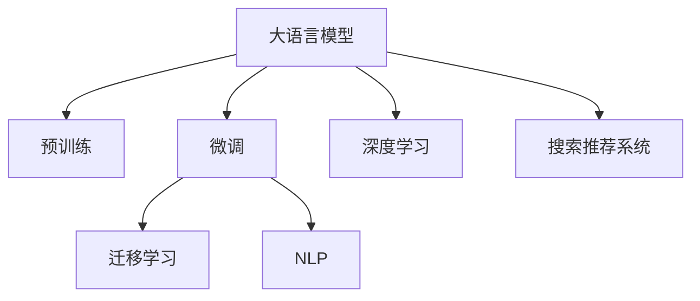

                 

# 电商平台搜索推荐系统的AI 大模型优化：应对大规模数据的挑战

## 1. 背景介绍

### 1.1 问题由来

随着电子商务的蓬勃发展，电商平台面临着数据规模急剧膨胀的挑战。用户搜索行为、商品评价、交易记录等海量数据，需要高效且准确的算法进行分析和推荐。传统的基于规则和特征工程的推荐系统已难以适应现代大规模数据环境。

人工智能（AI）技术，特别是基于深度学习的大语言模型和大规模预训练模型，正在为电商平台的搜索推荐系统带来革新。利用这些模型，电商平台可以基于用户历史行为和上下文信息，生成更加精准和个性化的推荐结果，提升用户体验和平台转化率。

然而，电商平台数据具有高度的多样性和实时性，需要模型具备高性能、高可靠性和可扩展性，以应对海量数据的实时处理需求。传统的基于梯度下降的微调算法，在大规模数据下常常表现出训练时间长、资源消耗大等缺点，难以满足电商平台的实时需求。

## 2. 核心概念与联系

### 2.1 核心概念概述

为更好地理解AI大模型在电商平台搜索推荐系统中的应用，本节将介绍几个关键概念及其联系：

- 大语言模型（Large Language Model, LLM）：如BERT、GPT-3等，通过大规模无标签文本数据进行自监督预训练，学习丰富的语言知识。
- 预训练（Pre-training）：在大规模无标签数据上，通过自监督任务训练通用语言模型，以学习通用的语言表示。
- 微调（Fine-tuning）：在大规模预训练模型的基础上，利用小规模有标签数据进行任务特定的优化，适应电商平台的特定推荐任务。
- 深度学习（Deep Learning）：利用多层神经网络对数据进行复杂建模，提取高层次的特征表示，是现代AI算法的基础。
- 迁移学习（Transfer Learning）：通过在大规模数据上预训练的模型，在特定任务上微调，利用已有知识，减少新任务的学习成本。
- 自然语言处理（NLP）：利用AI技术处理和分析人类语言数据，是搜索推荐系统的重要基础。

这些核心概念之间通过以下Mermaid流程图展示联系：



这个流程图展示了各概念之间的逻辑关系：大语言模型通过预训练学习通用的语言知识，然后通过迁移学习在特定任务上微调，进而利用NLP技术构建搜索推荐系统，最终通过深度学习进行特征抽取和模型优化。

## 3. 核心算法原理 & 具体操作步骤
### 3.1 算法原理概述

AI大模型在电商平台搜索推荐系统中的应用，主要通过以下几个步骤实现：

1. **数据预处理**：收集和清洗电商平台上的用户行为数据、商品信息等，进行标准化处理，形成可用于模型训练的样本。
2. **预训练模型选择**：选择适合电商领域的大语言模型或预训练模型，如BERT、GPT系列等，作为搜索推荐系统的基础。
3. **任务适配层设计**：根据推荐任务的具体需求，设计适合的任务适配层，将预训练模型输出的特征映射到推荐目标。
4. **微调模型训练**：在电商平台的标注数据集上，使用微调算法对预训练模型进行任务特定的优化，提升模型在推荐任务上的性能。
5. **推荐结果生成**：利用微调后的模型，对用户输入的查询进行特征提取和推理，生成推荐结果。

### 3.2 算法步骤详解

#### 3.2.1 数据预处理

电商平台的数据通常以结构化和非结构化形式存在，如用户行为数据（点击、浏览、购买记录）、商品信息（商品名称、描述、价格）等。数据预处理包括：

- 数据清洗：去除噪声、缺失值和异常值，确保数据质量。
- 特征工程：提取和构造适合模型训练的特征，如用户兴趣特征、商品属性特征等。
- 数据分割：将数据划分为训练集、验证集和测试集，用于模型训练、调参和评估。

#### 3.2.2 预训练模型选择

电商平台的推荐任务通常涉及用户行为预测和商品匹配，需要模型具备良好的序列建模和关联建模能力。选择合适的预训练模型至关重要：

- BERT系列模型：基于自监督掩码语言建模任务预训练，擅长处理自然语言序列，适用于推荐结果生成和用户行为预测。
- GPT系列模型：基于自回归语言模型预训练，擅长生成自然语言文本，适用于推荐结果生成。
- Transformer系列模型：基于自注意力机制预训练，擅长处理序列数据，适用于推荐结果生成和用户行为预测。

#### 3.2.3 任务适配层设计

根据推荐任务的具体需求，设计适配层：

- 对于推荐结果生成任务，如基于文本的推荐，通常需要设计解码器层和损失函数，如交叉熵损失。
- 对于用户行为预测任务，如点击率预测，通常需要设计分类器层和损失函数，如二分类交叉熵损失。

#### 3.2.4 微调模型训练

使用微调算法对预训练模型进行任务特定的优化：

- 学习率设置：由于预训练模型参数量较大，微调时需要较小的学习率，一般从1e-5开始。
- 正则化技术：使用L2正则、Dropout等技术，防止过拟合。
- 模型结构调整：保留预训练模型中的部分层，如Transformer的底层，只微调顶层，减少需优化的参数量。
- 数据增强：通过对训练样本改写、回译等方式丰富训练集多样性。
- 对抗训练：加入对抗样本，提高模型鲁棒性。

#### 3.2.5 推荐结果生成

利用微调后的模型，对用户输入的查询进行特征提取和推理，生成推荐结果：

- 对于推荐结果生成任务，模型输入为查询文本，输出为候选商品列表。
- 对于用户行为预测任务，模型输入为用户历史行为数据，输出为用户未来行为概率。

### 3.3 算法优缺点

AI大模型在电商平台搜索推荐系统中的应用，具有以下优点：

1. **高性能**：利用深度学习模型，可以高效处理大规模数据，生成高精度的推荐结果。
2. **高扩展性**：通过分布式训练和推理，可以扩展到大规模集群，支持海量数据实时处理。
3. **高鲁棒性**：预训练模型经过大规模数据训练，具备良好的泛化能力，适应电商平台的复杂数据环境。

同时，也存在以下缺点：

1. **数据依赖性强**：需要大量标注数据进行微调，电商平台的标注数据可能不足。
2. **模型复杂度高**：大规模预训练模型参数量较大，训练和推理复杂度较高。
3. **可解释性差**：模型决策过程不透明，难以解释和调试。
4. **资源消耗大**：训练和推理所需计算资源较大，可能超出电商平台的技术能力。

### 3.4 算法应用领域

AI大模型在电商平台搜索推荐系统中的应用，广泛应用于以下几个领域：

- 个性化推荐：根据用户历史行为和兴趣，生成个性化推荐列表。
- 实时搜索：对用户输入的查询进行实时检索，快速返回推荐结果。
- 多模态推荐：结合商品图片、视频等多模态数据，生成更加多样化的推荐结果。
- 情感分析：分析用户评价、评论等文本数据，挖掘用户情感倾向。
- 异常检测：检测异常行为，如欺诈交易、恶意点击等，提高平台安全性。

## 4. 数学模型和公式 & 详细讲解 & 举例说明

### 4.1 数学模型构建

在电商平台搜索推荐系统中，通常使用基于深度学习的模型进行特征提取和推荐结果生成。这里以基于Transformer的推荐模型为例，介绍其数学模型构建。

假设推荐模型为 $M_{\theta}$，其中 $\theta$ 为模型参数，输入为 $x_i$，输出为 $y_i$。推荐任务的目标函数为交叉熵损失：

$$
\mathcal{L}(\theta) = -\frac{1}{N}\sum_{i=1}^N \ell(y_i, M_{\theta}(x_i))
$$

其中 $\ell(y_i, M_{\theta}(x_i))$ 为交叉熵损失函数，$y_i$ 为真实标签，$M_{\theta}(x_i)$ 为模型输出。

### 4.2 公式推导过程

以下是交叉熵损失函数的推导过程：

设推荐模型 $M_{\theta}$ 的输出为 $y_i$，真实标签为 $y_i$，则交叉熵损失函数为：

$$
\ell(y_i, M_{\theta}(x_i)) = -y_i \log M_{\theta}(x_i) - (1-y_i) \log (1-M_{\theta}(x_i))
$$

将上述损失函数代入目标函数：

$$
\mathcal{L}(\theta) = -\frac{1}{N}\sum_{i=1}^N \ell(y_i, M_{\theta}(x_i))
$$

### 4.3 案例分析与讲解

以电商平台商品推荐为例，分析AI大模型在推荐系统中的应用：

假设模型输入为商品标题和描述，输出为推荐商品的点击率。模型通过微调，学习商品标题和描述对点击率的影响。训练集为历史点击记录，模型通过反向传播算法，更新参数 $\theta$，最小化损失函数 $\mathcal{L}(\theta)$。

## 5. 项目实践：代码实例和详细解释说明

### 5.1 开发环境搭建

#### 5.1.1 软件安装

为了进行深度学习模型的训练和推理，需要安装以下软件和库：

1. Python：安装Python 3.8及以上版本。
2. PyTorch：使用pip安装 PyTorch，支持GPU加速。
3. Transformers：使用pip安装 Transformers 库，支持多种预训练模型。
4. torchvision：使用pip安装 torchvision，用于数据处理和可视化。
5. tqdm：使用pip安装 tqdm，用于进度条显示。
6. Jupyter Notebook：安装Jupyter Notebook，用于交互式编程和代码共享。

#### 5.1.2 数据准备

电商平台的推荐数据通常存储在数据库或数据集中，需要转换为模型训练所需的数据格式：

1. 用户行为数据：如点击、浏览、购买记录，转换为用户行为序列。
2. 商品信息：如商品名称、描述、图片等，转换为商品特征向量。
3. 标注数据：如历史点击记录，转换为推荐目标标签。

#### 5.1.3 环境配置

配置好开发环境后，可以开始进行模型训练和推理：

1. 使用Jupyter Notebook创建新的Notebook，输入代码。
2. 导入所需的库和模块。
3. 定义数据加载函数和数据处理函数。
4. 定义推荐模型和微调参数。
5. 训练模型并输出结果。

### 5.2 源代码详细实现

以下是一个基于Transformer模型的电商推荐系统的示例代码：

```python
import torch
from torch import nn
from transformers import BertForSequenceClassification, BertTokenizer
from torch.utils.data import DataLoader

# 定义推荐模型
class RecommendationModel(nn.Module):
    def __init__(self, num_labels):
        super(RecommendationModel, self).__init__()
        self.bert = BertForSequenceClassification.from_pretrained('bert-base-cased', num_labels=num_labels)
        self.dense = nn.Linear(768, 1)

    def forward(self, input_ids, attention_mask):
        output = self.bert(input_ids, attention_mask=attention_mask)
        logits = self.dense(output)
        return logits

# 定义数据处理函数
def prepare_dataset(data_path, tokenizer, max_len=128):
    with open(data_path, 'r') as f:
        data = f.readlines()
        X, y = [], []
        for line in data:
            id, label, text = line.split('\t')
            X.append(tokenizer.encode(text, add_special_tokens=True))
            y.append(float(label))
        X = [torch.tensor(x) for x in X]
        y = torch.tensor(y)
        X = X[:max_len]
        y = y[:max_len]
        return X, y

# 加载数据
X_train, y_train = prepare_dataset('train.txt', tokenizer)
X_valid, y_valid = prepare_dataset('valid.txt', tokenizer)
X_test, y_test = prepare_dataset('test.txt', tokenizer)

# 定义模型和优化器
model = RecommendationModel(num_labels=1)
optimizer = torch.optim.Adam(model.parameters(), lr=1e-5)

# 训练模型
device = torch.device('cuda' if torch.cuda.is_available() else 'cpu')
model.to(device)
for epoch in range(10):
    model.train()
    for batch in DataLoader(X_train, batch_size=16):
        input_ids = batch.to(device)
        attention_mask = input_ids.new_ones(input_ids.shape)
        optimizer.zero_grad()
        logits = model(input_ids, attention_mask=attention_mask)
        loss = nn.BCELoss()(logits.squeeze(), y_train)
        loss.backward()
        optimizer.step()

    model.eval()
    for batch in DataLoader(X_valid, batch_size=16):
        input_ids = batch.to(device)
        attention_mask = input_ids.new_ones(input_ids.shape)
        with torch.no_grad():
            logits = model(input_ids, attention_mask=attention_mask)
            loss = nn.BCELoss()(logits.squeeze(), y_valid)
            print('Epoch {}: Loss {}'.format(epoch+1, loss.item()))

# 测试模型
model.eval()
for batch in DataLoader(X_test, batch_size=16):
    input_ids = batch.to(device)
    attention_mask = input_ids.new_ones(input_ids.shape)
    with torch.no_grad():
        logits = model(input_ids, attention_mask=attention_mask)
        print('Test Loss {}'.format(nn.BCELoss()(logits.squeeze(), y_test).item()))
```

### 5.3 代码解读与分析

#### 5.3.1 数据准备

数据准备是模型训练的基础。本示例使用 `prepare_dataset` 函数，将数据从文本文件中读取并转换为模型所需的张量形式。其中， `tokenizer.encode` 函数用于将文本转换为数字编码， `torch.tensor` 函数将编码结果转换为张量形式。

#### 5.3.2 模型定义

推荐模型 `RecommendationModel` 基于 Transformer 模型进行定义。首先，从预训练模型中加载 `BertForSequenceClassification`，指定标签数量。然后，添加一个线性层用于输出预测结果。

#### 5.3.3 训练和评估

训练过程包括前向传播、计算损失、反向传播和参数更新。评估过程仅进行前向传播，计算损失，但不更新参数。使用 `nn.BCELoss` 计算二分类交叉熵损失，用于训练和评估。

## 6. 实际应用场景

### 6.1 个性化推荐

个性化推荐是电商平台的核心功能之一。利用AI大模型，电商平台可以实时分析用户行为，生成个性化推荐结果：

1. **用户行为分析**：收集用户浏览、点击、购买等行为数据，利用AI模型进行分析和特征提取。
2. **推荐结果生成**：利用微调后的推荐模型，对用户行为进行推理，生成个性化推荐列表。
3. **实时推荐**：将推荐结果实时推送到用户客户端，提高用户满意度和平台转化率。

### 6.2 实时搜索

实时搜索是电商平台搜索推荐系统的重要功能。利用AI大模型，电商平台可以实现快速、准确的实时搜索：

1. **用户查询处理**：用户输入查询后，AI模型快速分析查询内容，提取关键特征。
2. **推荐结果生成**：利用微调后的推荐模型，对查询进行推理，生成推荐结果列表。
3. **搜索结果展示**：将推荐结果展示给用户，提供多种排序方式，提升用户体验。

### 6.3 异常检测

异常检测是电商平台安全保障的重要手段。利用AI大模型，电商平台可以实时监测异常行为：

1. **行为特征提取**：收集用户行为数据，利用AI模型进行特征提取和建模。
2. **异常检测**：利用微调后的异常检测模型，对行为数据进行分类，检测异常行为。
3. **预警和处理**：根据检测结果，生成预警信息，并采取相应的处理措施。

### 6.4 未来应用展望

随着AI大模型的不断发展和优化，电商平台搜索推荐系统的未来应用将更加广泛：

1. **多模态推荐**：结合商品图片、视频等多模态数据，生成更加多样化的推荐结果。
2. **实时推荐引擎**：构建实时推荐引擎，提升推荐效果和用户体验。
3. **情感分析**：分析用户评价、评论等文本数据，挖掘用户情感倾向，优化推荐策略。
4. **跨平台推荐**：构建跨平台的推荐系统，实现不同平台的无缝对接和推荐数据共享。
5. **个性化广告**：利用AI大模型进行个性化广告投放，提升广告效果和用户转化率。

## 7. 工具和资源推荐

### 7.1 学习资源推荐

为了帮助开发者系统掌握AI大模型在电商平台搜索推荐系统中的应用，这里推荐一些优质的学习资源：

1. 《深度学习》（Ian Goodfellow著）：深度学习领域的经典教材，详细介绍了深度学习的基本概念和算法。
2. 《NLP with PyTorch》（Mohit Suri著）：介绍如何使用PyTorch进行NLP任务开发，包括推荐系统在内的诸多范式。
3. 《Transformers》（Jacob Devlin等著）：介绍Transformer模型的原理和应用，涵盖推荐系统的相关内容。
4. HuggingFace官方文档：提供丰富的预训练模型和微调样例代码，是上手实践的必备资料。
5. Kaggle竞赛平台：提供丰富的推荐系统竞赛数据集，助力开发者进行模型训练和优化。

### 7.2 开发工具推荐

高效的开发离不开优秀的工具支持。以下是几款用于AI大模型在电商平台搜索推荐系统开发的常用工具：

1. PyTorch：基于Python的开源深度学习框架，灵活动态的计算图，适合快速迭代研究。
2. TensorFlow：由Google主导开发的开源深度学习框架，生产部署方便，适合大规模工程应用。
3. TensorBoard：TensorFlow配套的可视化工具，可实时监测模型训练状态，并提供丰富的图表呈现方式。
4. Weights & Biases：模型训练的实验跟踪工具，可以记录和可视化模型训练过程中的各项指标，方便对比和调优。
5. Jupyter Notebook：交互式编程和代码共享工具，支持多种编程语言和库。

### 7.3 相关论文推荐

AI大模型在电商平台搜索推荐系统中的应用，得益于众多研究者的深入探索。以下是几篇奠基性的相关论文，推荐阅读：

1. Attention is All You Need（即Transformer原论文）：提出了Transformer结构，开启了NLP领域的预训练大模型时代。
2. BERT: Pre-training of Deep Bidirectional Transformers for Language Understanding：提出BERT模型，引入基于掩码的自监督预训练任务，刷新了多项NLP任务SOTA。
3. Deep Recommendation Systems: A Survey（Deep推荐系统综述）：综述了深度学习在推荐系统中的应用，包括AI大模型的应用。
4. Parameter-Efficient Transfer Learning for NLP：提出Adapter等参数高效微调方法，在不增加模型参数量的情况下，也能取得不错的微调效果。
5. Domain-Adaptive Transfer Learning via Multi-task Label Smoothing（基于多任务标签平滑的领域自适应迁移学习）：提出标签平滑方法，提高模型在领域转移中的泛化能力。

## 8. 总结：未来发展趋势与挑战

### 8.1 总结

本文对AI大模型在电商平台搜索推荐系统中的应用进行了全面系统的介绍。首先阐述了AI大模型和微调技术在电商平台推荐系统中的重要性和应用效果，明确了推荐系统在大规模数据环境下面临的挑战和解决方案。其次，从原理到实践，详细讲解了AI大模型的核心算法原理和具体操作步骤，给出了电商推荐系统的完整代码实例。同时，本文还广泛探讨了AI大模型在电商推荐系统中的应用场景，展示了其在个性化推荐、实时搜索、异常检测等领域的潜力。

通过本文的系统梳理，可以看到，AI大模型在电商平台搜索推荐系统中，通过深度学习和微调技术，可以生成高精度的推荐结果，提升用户体验和平台转化率。然而，大模型在处理大规模数据时也面临计算资源消耗大、模型复杂度高等挑战。未来需要从数据、模型、工程、业务等多个维度进行全面优化，才能真正实现高性能、高可靠性的电商平台搜索推荐系统。

### 8.2 未来发展趋势

展望未来，AI大模型在电商平台搜索推荐系统中的应用将呈现以下几个发展趋势：

1. **高性能优化**：进一步优化计算图和模型结构，减少资源消耗，提升推荐效果。
2. **可扩展性提升**：利用分布式训练和推理，支持大规模集群，实现高效的数据处理和实时推荐。
3. **多模态融合**：结合商品图片、视频等多模态数据，生成更加多样化和个性化的推荐结果。
4. **跨平台应用**：构建跨平台的推荐系统，实现不同平台的无缝对接和推荐数据共享。
5. **实时推荐引擎**：构建实时推荐引擎，提升推荐效果和用户体验。

### 8.3 面临的挑战

尽管AI大模型在电商平台搜索推荐系统中取得了显著效果，但在迈向更加智能化、普适化应用的过程中，仍面临诸多挑战：

1. **计算资源瓶颈**：大规模数据和复杂模型导致计算资源消耗大，需要不断优化计算效率。
2. **模型复杂度高**：模型参数量和计算复杂度大，需要不断优化模型结构，提高计算效率。
3. **数据隐私问题**：电商平台的推荐系统需要处理大量用户隐私数据，需要严格的隐私保护措施。
4. **公平性和透明性**：推荐系统的公平性和透明性问题，需要从数据和模型层面进行严格控制。

### 8.4 研究展望

面对AI大模型在电商平台搜索推荐系统中的挑战，未来的研究需要在以下几个方面寻求新的突破：

1. **模型压缩和优化**：开发更加高效的模型压缩和优化算法，减小计算资源消耗，提升推荐效果。
2. **多模态融合**：结合商品图片、视频等多模态数据，生成更加多样化和个性化的推荐结果。
3. **数据隐私保护**：利用差分隐私等技术，保护用户隐私，增强推荐系统的公平性和透明性。
4. **跨平台推荐**：构建跨平台的推荐系统，实现不同平台的无缝对接和推荐数据共享。
5. **实时推荐引擎**：构建实时推荐引擎，提升推荐效果和用户体验。

## 9. 附录：常见问题与解答

**Q1: AI大模型在电商平台搜索推荐系统中面临哪些资源瓶颈？**

A: AI大模型在电商平台搜索推荐系统中面临以下资源瓶颈：

1. **计算资源消耗大**：大规模数据和复杂模型导致计算资源消耗大，需要不断优化计算效率。
2. **模型复杂度高**：模型参数量和计算复杂度大，需要不断优化模型结构，提高计算效率。
3. **数据隐私问题**：电商平台的推荐系统需要处理大量用户隐私数据，需要严格的隐私保护措施。

**Q2: 如何优化AI大模型在电商平台搜索推荐系统中的计算效率？**

A: 优化AI大模型在电商平台搜索推荐系统中的计算效率，可以采取以下措施：

1. **模型压缩和优化**：开发更加高效的模型压缩和优化算法，减小计算资源消耗。
2. **分布式训练和推理**：利用分布式计算资源，提升模型的训练和推理速度。
3. **数据增量和回传**：采用增量学习方式，只更新部分参数，减少计算资源消耗。
4. **多任务学习**：利用多任务学习，提升模型的泛化能力和计算效率。

**Q3: 电商平台推荐系统的公平性和透明性问题如何解决？**

A: 电商平台推荐系统的公平性和透明性问题，可以通过以下措施解决：

1. **数据平衡**：确保数据样本平衡，避免某些用户或商品被不公平对待。
2. **模型解释性**：提升模型的可解释性，帮助用户理解推荐结果的生成过程。
3. **用户反馈机制**：建立用户反馈机制，及时发现和纠正不公平现象。

**Q4: 如何应对电商平台搜索推荐系统中的数据分布变化？**

A: 应对电商平台搜索推荐系统中的数据分布变化，可以采取以下措施：

1. **增量学习**：采用增量学习方式，及时更新模型参数，适应新的数据分布。
2. **在线学习**：利用在线学习算法，实时更新模型，适应动态数据环境。
3. **模型迁移**：利用迁移学习技术，将预训练模型迁移到新的数据分布中。

**Q5: AI大模型在电商平台搜索推荐系统中如何保护用户隐私？**

A: AI大模型在电商平台搜索推荐系统中，可以通过以下措施保护用户隐私：

1. **数据匿名化**：对用户数据进行匿名化处理，避免隐私泄露。
2. **差分隐私**：利用差分隐私技术，保护用户隐私，防止数据泄露。
3. **访问控制**：对数据访问进行严格控制，确保只有授权人员才能访问用户数据。

---

作者：禅与计算机程序设计艺术 / Zen and the Art of Computer Programming

