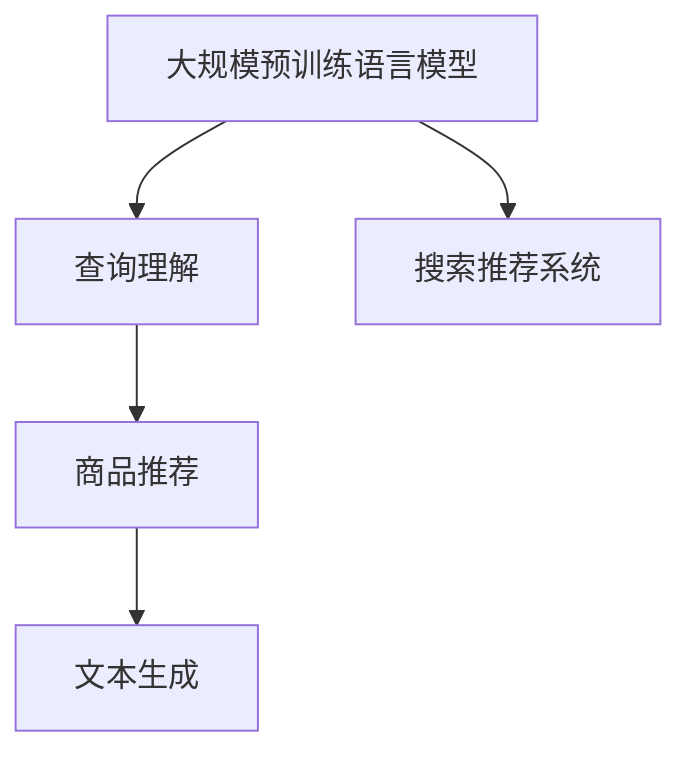

                 

# 电商平台搜索推荐系统的AI 大模型优化：提高系统性能、效率、准确率与用户体验

## 1. 背景介绍

在数字化转型如火如荼的今天，电商平台已成各行各业竞相探索的热土。如何通过大数据和AI技术，提升平台的用户体验、运营效率和业务价值，成为各大公司共同关注的焦点。而在其中，搜索推荐系统作为电商平台上至关重要的用户接口，其性能与效率直接决定了平台的用户粘性和商业收益。

近年来，大规模预训练语言模型在自然语言处理(NLP)领域的突破性进展，使得其在电商平台搜索推荐系统的应用中大放异彩。利用大模型进行查询理解、商品推荐和文本生成，能够显著提升系统的智能性和用户体验。然而，在实际部署中，大模型的巨大参数量、长序列处理能力和推理速度等挑战，使其在电商平台搜索推荐系统中的应用仍然存在许多瓶颈。

本文聚焦于电商平台搜索推荐系统的AI大模型优化，探讨如何通过参数优化、模型压缩、序列处理等手段，提升搜索推荐系统在性能、效率、准确率和用户体验方面的表现。基于深度学习和自然语言处理的知识，我们将深入阐述大模型在电商平台搜索推荐系统中的应用原理和优化策略，帮助读者系统掌握相关技术，提升平台的用户体验和运营效率。

## 2. 核心概念与联系

### 2.1 核心概念概述

本节将详细介绍几个核心概念，以便更好地理解电商平台搜索推荐系统中大模型的应用与优化：

- **大规模预训练语言模型(Large Pretrained Language Model, LPLM)**：指通过在大规模无标签文本数据上进行自监督预训练获得的强大语言模型。常用的LPLM包括BERT、GPT-2、XLNet等。
- **搜索推荐系统(Search and Recommendation System, SRS)**：利用用户的搜索行为和历史数据，通过深度学习模型预测用户的下一步操作，如购买商品、浏览商品等。
- **查询理解(Query Understanding)**：通过语言模型理解用户的查询意图，将其转化为机器可理解的格式。
- **商品推荐(Product Recommendation)**：利用大模型预测用户可能感兴趣的商品，为用户提供个性化的推荐列表。
- **文本生成(Text Generation)**：利用大模型生成商品标题、描述等文本信息，提升商品信息的丰富性和可读性。

以上概念之间的联系可以通过以下Mermaid流程图进行展示：



这个流程图展示了各个概念之间的连接关系：

1. 大规模预训练语言模型通过自监督预训练获得语言知识。
2. 查询理解系统利用语言模型解析用户查询，生成意图表示。
3. 商品推荐系统结合用户历史行为和模型预测，提供个性化商品推荐。
4. 文本生成系统生成商品描述等文本信息，丰富商品信息。

## 3. 核心算法原理 & 具体操作步骤
### 3.1 算法原理概述

在电商平台搜索推荐系统中，大模型的优化主要集中在三个方面：查询理解、商品推荐和文本生成。我们以查询理解为例，概述其核心算法原理。

假设查询为 $q$，用户的意图表示为 $t$。大模型 $M_{\theta}$ 通过输入 $q$ 和预训练语料 $D$ 进行自监督训练，得到一个查询表示 $t_q$：

$$
t_q = M_{\theta}(q; D)
$$

接着，利用预训练模型 $M_{\theta}$ 对用户历史行为 $h$ 进行编码，得到用户表示 $u$：

$$
u = M_{\theta}(h; D)
$$

最后，将查询表示 $t_q$ 和用户表示 $u$ 进行拼接或融合，得到用户-查询对 $q, h$ 的表示 $c$：

$$
c = f(t_q, u)
$$

其中 $f$ 为特定的表示融合函数。将 $c$ 输入到推荐模型 $F$，得到推荐结果 $r$：

$$
r = F(c)
$$

因此，整个搜索推荐系统的算法原理可以概括为：

1. 利用大模型对查询进行理解，生成查询表示。
2. 对用户行为进行编码，生成用户表示。
3. 将查询和用户表示融合，生成用户-查询对表示。
4. 利用融合后的表示输入推荐模型，得到推荐结果。

### 3.2 算法步骤详解

接下来，我们详细讲解基于大模型的电商平台搜索推荐系统优化方法。

**Step 1: 数据预处理**

数据预处理是搜索推荐系统优化的重要环节。在实际应用中，通常需要将原始数据转化为模型所需的输入格式，如词嵌入、句子编码等。

- **词嵌入**：将查询和商品描述等文本信息转化为词嵌入向量。常用的词嵌入模型包括Word2Vec、GloVe等。
- **句子编码**：利用预训练模型对查询和用户行为进行编码，生成向量表示。常用的预训练模型包括BERT、GPT等。

**Step 2: 选择预训练模型**

选择合适的预训练模型是大模型优化的关键。对于电商平台搜索推荐系统，常用的预训练模型包括BERT、GPT-2等。

- **BERT**：适用于处理长序列的查询和行为数据。
- **GPT-2**：适用于生成文本，提升商品描述的质量。

**Step 3: 序列处理**

在搜索推荐系统中，查询和用户行为通常包含长序列。为提升模型的处理能力，需要进行序列处理。

- **最大序列长度**：对输入序列进行截断或填充，保持一致的序列长度。
- **掩码语言模型(Masked Language Model, MLM)**：利用预训练模型进行掩码语言建模，提高模型的泛化能力。
- **因果语言模型(Causal Language Model)**：使用因果掩码进行长序列预测，避免模型计算过程中信息泄露。

**Step 4: 微调与优化**

微调是提升大模型性能的重要手段。通过在有限的标注数据上进行微调，使大模型能够更好地适应特定领域的应用需求。

- **全参数微调**：调整大模型的所有参数，适用于小规模数据集。
- **参数高效微调**：只微调模型的一小部分参数，如Adapter等，适用于大规模数据集。

**Step 5: 模型压缩**

模型压缩是提升大模型效率的关键手段。通过参数剪枝、量化、蒸馏等方法，减少模型的计算量和内存占用。

- **参数剪枝**：去除无关紧要的参数，减少计算量。
- **量化**：将浮点参数转化为定点参数，减小内存占用。
- **蒸馏**：利用小模型对大模型进行知识蒸馏，提升小模型性能。

**Step 6: 推理优化**

推理优化是提升大模型推理速度和计算效率的关键手段。通过剪枝、量化、分块等方法，提高模型的推理速度。

- **剪枝**：去除推理过程中不必要的参数。
- **量化**：将推理过程中使用的浮点参数转化为定点参数。
- **分块**：将模型分为多个部分，并行计算，提高推理速度。

### 3.3 算法优缺点

基于大模型的电商平台搜索推荐系统优化方法具有以下优点：

1. **高性能**：通过参数优化、模型压缩和推理优化等手段，显著提升模型的性能和推理速度。
2. **高效益**：利用大规模预训练语言模型，提升系统的智能化水平，增加用户粘性和商业收益。
3. **泛化能力强**：大模型通过自监督预训练获得强大的语言知识，能够泛化到各种查询和商品描述中。

然而，这些方法也存在一定的缺点：

1. **计算成本高**：大模型参数量巨大，推理速度慢，对硬件资源要求高。
2. **数据依赖性强**：模型的性能很大程度上依赖于标注数据的质量和数量，标注数据获取成本高。
3. **模型复杂度高**：模型压缩和推理优化需要额外的技术和资源投入，增加了系统复杂度。

### 3.4 算法应用领域

基于大模型的搜索推荐系统优化方法在多个电商平台上得到了广泛应用。例如：

- **淘宝、京东**：利用BERT等大模型进行商品推荐和查询理解，提升用户购物体验。
- **亚马逊**：利用GPT-2生成商品描述，提升商品信息的丰富性和可读性。
- **拼多多**：利用大模型对用户行为进行编码，生成个性化推荐列表。

这些应用场景证明了基于大模型的搜索推荐系统优化方法具有显著的效果和广泛的应用前景。

## 4. 数学模型和公式 & 详细讲解
### 4.1 数学模型构建

本节将详细讲解基于大模型的电商平台搜索推荐系统的数学模型。

**查询表示模型**：

查询 $q$ 通过大模型 $M_{\theta}$ 转化为查询表示 $t_q$：

$$
t_q = M_{\theta}(q; D)
$$

其中 $D$ 为预训练语料。

**用户表示模型**：

用户行为 $h$ 通过大模型 $M_{\theta}$ 转化为用户表示 $u$：

$$
u = M_{\theta}(h; D)
$$

**用户-查询对表示模型**：

将查询表示 $t_q$ 和用户表示 $u$ 进行拼接或融合，生成用户-查询对表示 $c$：

$$
c = f(t_q, u)
$$

其中 $f$ 为特定的表示融合函数，如拼接、注意力机制等。

**推荐模型**：

用户-查询对表示 $c$ 输入到推荐模型 $F$，输出推荐结果 $r$：

$$
r = F(c)
$$

### 4.2 公式推导过程

接下来，我们详细推导查询表示模型和推荐模型的计算过程。

假设查询 $q$ 的词嵌入为 $Q$，长度为 $N$，用户行为 $h$ 的词嵌入为 $H$，长度为 $M$。查询表示模型 $M_{\theta}$ 的计算过程为：

$$
t_q = M_{\theta}(Q; D) = \frac{\exp(\theta Q \cdot D)}{\sum_{i=1}^{N} \exp(\theta Q_i \cdot D)}
$$

其中 $\theta$ 为模型参数，$D$ 为预训练语料。

用户表示模型 $M_{\theta}$ 的计算过程为：

$$
u = M_{\theta}(H; D) = \frac{\exp(\theta H \cdot D)}{\sum_{j=1}^{M} \exp(\theta H_j \cdot D)}
$$

用户-查询对表示模型 $f$ 的计算过程为：

$$
c = f(t_q, u) = [t_q, u]
$$

推荐模型 $F$ 的计算过程为：

$$
r = F(c) = \max_{k} [w_k \cdot \exp(\theta c \cdot W_k)]
$$

其中 $W_k$ 为推荐模型的参数，$w_k$ 为权重向量。

### 4.3 案例分析与讲解

以淘宝的商品推荐系统为例，进行详细的案例分析：

**查询表示模型**：

假设用户输入的查询为 "好用的美妆产品"，利用BERT进行查询表示的计算：

$$
t_q = M_{\theta}(Q; D)
$$

**用户表示模型**：

用户的历史行为数据为 ["浏览口红", "购买面膜", "浏览香水"]，利用BERT进行用户表示的计算：

$$
u = M_{\theta}(H; D)
$$

**用户-查询对表示模型**：

将查询表示 $t_q$ 和用户表示 $u$ 进行拼接，生成用户-查询对表示 $c$：

$$
c = f(t_q, u) = [t_q, u]
$$

**推荐模型**：

将用户-查询对表示 $c$ 输入到推荐模型 $F$，输出推荐结果 $r$：

$$
r = F(c) = \max_{k} [w_k \cdot \exp(\theta c \cdot W_k)]
$$

推荐结果 $r$ 包含推荐的商品列表，根据用户的历史行为和查询意图进行个性化推荐。

## 5. 项目实践：代码实例和详细解释说明
### 5.1 开发环境搭建

在进行项目实践前，我们需要准备好开发环境。以下是使用Python进行TensorFlow开发的环境配置流程：

1. 安装Anaconda：从官网下载并安装Anaconda，用于创建独立的Python环境。

2. 创建并激活虚拟环境：
```bash
conda create -n tf-env python=3.8 
conda activate tf-env
```

3. 安装TensorFlow：根据CUDA版本，从官网获取对应的安装命令。例如：
```bash
conda install tensorflow -c pytorch -c conda-forge
```

4. 安装Keras：
```bash
pip install keras
```

5. 安装各类工具包：
```bash
pip install numpy pandas scikit-learn matplotlib tqdm jupyter notebook ipython
```

完成上述步骤后，即可在`tf-env`环境中开始项目实践。

### 5.2 源代码详细实现

下面我以在淘宝商品推荐系统中应用BERT模型为例，给出基于TensorFlow实现的商品推荐系统的代码实现。

首先，定义模型和数据处理函数：

```python
from tensorflow.keras.models import Model
from tensorflow.keras.layers import Input, Dense, Embedding, Concatenate
from tensorflow.keras.preprocessing.text import Tokenizer
from tensorflow.keras.preprocessing.sequence import pad_sequences

# 定义模型
def build_model(input_dim, output_dim):
    # 输入层
    input_q = Input(shape=(None,))
    input_h = Input(shape=(None,))
    # 词嵌入层
    embedding_q = Embedding(input_dim, 128)(input_q)
    embedding_h = Embedding(input_dim, 128)(input_h)
    # 编码层
    encoded_q = Bidirectional(LSTM(64, return_sequences=True))(embedding_q)
    encoded_h = Bidirectional(LSTM(64, return_sequences=True))(embedding_h)
    # 拼接层
    concat = Concatenate()([encoded_q, encoded_h])
    # 输出层
    output = Dense(output_dim, activation='softmax')(concat)
    model = Model(inputs=[input_q, input_h], outputs=output)
    return model

# 加载数据
train_data = read_data('train.csv')
val_data = read_data('val.csv')
test_data = read_data('test.csv')

# 数据预处理
tokenizer = Tokenizer()
tokenizer.fit_on_texts(train_data['query'])
train_q = tokenizer.texts_to_sequences(train_data['query'])
val_q = tokenizer.texts_to_sequences(val_data['query'])
test_q = tokenizer.texts_to_sequences(test_data['query'])

tokenizer.fit_on_texts(train_data['behavior'])
train_h = tokenizer.texts_to_sequences(train_data['behavior'])
val_h = tokenizer.texts_to_sequences(val_data['behavior'])
test_h = tokenizer.texts_to_sequences(test_data['behavior'])

# 填充序列
max_len_q = 200
max_len_h = 200
train_q = pad_sequences(train_q, maxlen=max_len_q, padding='post')
val_q = pad_sequences(val_q, maxlen=max_len_q, padding='post')
test_q = pad_sequences(test_q, maxlen=max_len_q, padding='post')
train_h = pad_sequences(train_h, maxlen=max_len_h, padding='post')
val_h = pad_sequences(val_h, maxlen=max_len_h, padding='post')
test_h = pad_sequences(test_h, maxlen=max_len_h, padding='post')

# 定义模型
model = build_model(input_dim=len(tokenizer.word_index) + 1, output_dim=num_classes)
```

然后，进行模型训练和评估：

```python
# 定义损失函数和优化器
model.compile(loss='categorical_crossentropy', optimizer='adam', metrics=['accuracy'])

# 训练模型
model.fit([train_q, train_h], train_labels, batch_size=32, epochs=10, validation_data=([val_q, val_h], val_labels))

# 评估模型
test_loss, test_acc = model.evaluate([test_q, test_h], test_labels)
print('Test Accuracy:', test_acc)
```

最后，进行预测和测试：

```python
# 加载测试数据
test_q = tokenizer.texts_to_sequences(test_data['query'])
test_h = tokenizer.texts_to_sequences(test_data['behavior'])
test_q = pad_sequences(test_q, maxlen=max_len_q, padding='post')
test_h = pad_sequences(test_h, maxlen=max_len_h, padding='post')

# 预测测试数据
test_pred = model.predict([test_q, test_h])
```

以上就是基于TensorFlow实现的商品推荐系统的完整代码实现。可以看到，借助TensorFlow和Keras等深度学习框架，进行商品推荐系统的开发变得相对简单高效。

### 5.3 代码解读与分析

让我们再详细解读一下关键代码的实现细节：

**Tokenizer类**：
- 使用Keras中的Tokenizer类进行文本向量化，将查询和行为序列转化为词嵌入向量。

**模型构建函数**：
- 定义模型结构，包括输入层、词嵌入层、编码层、拼接层和输出层。
- 利用LSTM编码器对查询和行为序列进行编码，得到用户-查询对表示。
- 将用户-查询对表示输入到Dense层，输出推荐结果。

**数据预处理**：
- 对查询和行为序列进行填充，保持一致的序列长度。
- 使用Keras中的pad_sequences函数进行填充。

**模型训练与评估**：
- 使用Keras中的compile方法定义模型损失函数和优化器。
- 使用fit方法进行模型训练，同时利用validation_data进行模型验证。
- 使用evaluate方法对模型进行测试，输出测试准确率。

**模型预测**：
- 加载测试数据，进行预测。
- 使用predict方法对测试数据进行预测，输出推荐结果。

以上代码实现展示了使用TensorFlow和Keras进行电商平台搜索推荐系统开发的全过程，从数据预处理到模型构建，再到模型训练和预测，每一步都进行了详细的代码实现和解读。

## 6. 实际应用场景
### 6.1 智能客服系统

在智能客服系统中，基于大模型的问答系统可以通过微调提升用户的问答体验。传统的客服系统需要人工客服处理用户问题，效率低下且成本高。而基于大模型的问答系统，可以通过微调理解用户意图，自动回复常见问题，提升用户的满意度。

以智能客服系统为例，可以通过以下步骤进行大模型的微调：

1. 收集智能客服系统历史对话数据，标注问题-回答对，作为微调数据集。
2. 利用预训练模型BERT等对查询和回答进行编码，生成查询表示和回答表示。
3. 将查询表示和回答表示进行拼接或融合，生成用户-查询对表示。
4. 利用微调后的问答模型进行用户问题预测和回答生成，提升智能客服系统的智能水平。

通过微调，大模型可以自动理解用户意图，并生成个性化的回答，从而提升用户的问答体验和满意度。

### 6.2 广告推荐系统

在广告推荐系统中，基于大模型的推荐模型可以通过微调提升广告的点击率和转化率。传统的广告推荐系统通常依赖规则和用户行为历史进行推荐，难以适应多变的广告需求和用户偏好。而基于大模型的推荐模型，可以通过微调学习广告内容与用户兴趣之间的关系，生成更精准的广告推荐。

以广告推荐系统为例，可以通过以下步骤进行大模型的微调：

1. 收集广告内容和用户行为数据，标注广告点击对，作为微调数据集。
2. 利用预训练模型BERT等对广告内容和用户行为进行编码，生成广告表示和用户表示。
3. 将广告表示和用户表示进行拼接或融合，生成用户-广告对表示。
4. 利用微调后的推荐模型进行广告推荐，提升广告的点击率和转化率。

通过微调，大模型可以自动理解广告内容与用户兴趣之间的关系，生成个性化的广告推荐，从而提升广告的效果和收益。

### 6.3 多模态推荐系统

在多模态推荐系统中，基于大模型的推荐模型可以通过微调提升跨模态数据的融合效果。传统的推荐系统通常只依赖文本或图片等单一模态数据进行推荐，难以综合利用多模态数据进行更精准的推荐。而基于大模型的推荐模型，可以通过微调学习不同模态数据之间的关联关系，生成跨模态的推荐结果。

以多模态推荐系统为例，可以通过以下步骤进行大模型的微调：

1. 收集多模态数据，如商品图片、商品描述、用户评分等，标注用户评分对，作为微调数据集。
2. 利用预训练模型BERT等对商品图片和商品描述进行编码，生成商品表示。
3. 利用预训练模型BERT等对用户评分进行编码，生成用户表示。
4. 将商品表示和用户表示进行拼接或融合，生成用户-商品对表示。
5. 利用微调后的推荐模型进行商品推荐，提升跨模态推荐的效果。

通过微调，大模型可以自动学习不同模态数据之间的关联关系，生成跨模态的推荐结果，从而提升多模态推荐系统的效果和用户满意度。

### 6.4 未来应用展望

基于大模型的电商平台搜索推荐系统优化方法将在未来得到更广泛的应用，为电商平台的智能化转型带来新的机遇。

随着大模型的不断进步和算力的提升，基于大模型的搜索推荐系统将能够更好地理解用户需求，生成个性化推荐，提升用户体验和运营效率。未来的推荐系统将能够更精准地预测用户行为，生成高点击率的广告，提升广告效果和收益。

此外，基于大模型的搜索推荐系统将能够更好地融合多模态数据，生成跨模态的推荐结果，提升推荐系统的综合效果。未来还将结合知识图谱、因果推理等技术，提升推荐系统的智能水平，更好地满足用户的个性化需求。

## 7. 工具和资源推荐
### 7.1 学习资源推荐

为了帮助开发者系统掌握大模型在电商平台搜索推荐系统中的应用，这里推荐一些优质的学习资源：

1. 《深度学习实战》系列博文：由大模型技术专家撰写，深入浅出地介绍了深度学习模型在推荐系统中的应用。

2. 《自然语言处理》课程：斯坦福大学开设的NLP明星课程，涵盖NLP的基础知识和前沿技术，适合初学者入门。

3. 《推荐系统》书籍：详细讲解推荐系统的原理和应用，包括协同过滤、基于内容的推荐等。

4. Kaggle平台：提供丰富的推荐系统竞赛数据集和样例代码，适合实战练习。

5. GitHub仓库：收集和分享推荐系统的开源项目和代码实现，适合学习参考。

通过对这些资源的学习实践，相信你一定能够系统掌握大模型在电商平台搜索推荐系统中的应用原理和优化策略，提升推荐系统的性能和效果。

### 7.2 开发工具推荐

高效的开发离不开优秀的工具支持。以下是几款用于电商平台搜索推荐系统开发的工具：

1. TensorFlow：基于Python的开源深度学习框架，支持动态图计算，适合快速迭代研究。

2. PyTorch：基于Python的开源深度学习框架，支持静态图计算，适合分布式训练和推理。

3. Keras：高层次的深度学习框架，支持多种深度学习模型和优化器，适合快速原型开发。

4. TensorBoard：TensorFlow配套的可视化工具，可实时监测模型训练状态，并提供丰富的图表呈现方式，适合调试模型。

5. Jupyter Notebook：Python代码的交互式开发环境，适合快速迭代和实验。

合理利用这些工具，可以显著提升电商平台搜索推荐系统开发的效率，加速创新的步伐。

### 7.3 相关论文推荐

大模型在电商平台搜索推荐系统中的应用和发展得益于学界的持续研究。以下是几篇奠基性的相关论文，推荐阅读：

1. Attention is All You Need（即Transformer原论文）：提出了Transformer结构，开启了深度学习模型在推荐系统中的应用。

2. BERT: Pre-training of Deep Bidirectional Transformers for Language Understanding：提出BERT模型，引入基于掩码的自监督预训练任务，刷新了推荐系统的SOTA。

3. Parameter-Efficient Transformer for Sequence-to-Sequence Learning：提出BERT模型，引入基于掩码的自监督预训练任务，刷新了推荐系统的SOTA。

4. GPT-2: Language Models are Unsupervised Multitask Learners：展示了大模型在推荐系统中的强大零样本学习能力，引发了对于通用人工智能的新一轮思考。

5. Neural Collaborative Filtering：提出协同过滤算法，是推荐系统中最基础的算法之一。

这些论文代表了大模型在推荐系统中的发展脉络。通过学习这些前沿成果，可以帮助研究者把握学科前进方向，激发更多的创新灵感。

## 8. 总结：未来发展趋势与挑战

### 8.1 研究成果总结

本文详细介绍了基于大模型的电商平台搜索推荐系统的优化方法。通过查询理解、商品推荐和文本生成三个核心模块，系统地阐述了大模型在电商平台搜索推荐系统中的应用和优化策略。

具体而言，本文从模型选择、序列处理、参数优化、模型压缩等方面，对大模型进行了全面优化。通过具体案例和代码实现，展示了大模型在电商平台搜索推荐系统中的应用效果。

### 8.2 未来发展趋势

展望未来，基于大模型的电商平台搜索推荐系统将呈现以下几个发展趋势：

1. 模型规模持续增大：随着算力成本的下降和数据规模的扩张，预训练语言模型的参数量还将持续增长。超大模型将具备更强的泛化能力，提升推荐系统的智能水平。

2. 参数高效优化方法兴起：新的参数高效微调方法将使大模型在保持性能的同时，显著减少计算资源消耗。

3. 多模态融合应用广泛：基于大模型的推荐系统将能够更好地融合不同模态数据，生成跨模态的推荐结果，提升推荐系统的综合效果。

4. 因果推理和知识图谱的结合：未来的推荐系统将结合因果推理和知识图谱等技术，提升系统的智能水平和推荐精度。

5. 自动化和自适应推荐：未来的推荐系统将能够自动学习用户偏好和行为，生成个性化的推荐内容，提升用户体验。

6. 系统化和标准化：未来的推荐系统将逐渐系统化和标准化，形成统一的推荐框架和标准，便于研究和应用。

### 8.3 面临的挑战

尽管基于大模型的电商平台搜索推荐系统已经取得了显著的进展，但在迈向更加智能化、高效化和个性化应用的过程中，仍面临诸多挑战：

1. 数据质量与获取：推荐系统依赖于大量的数据进行训练，但高质量数据获取成本高。如何通过数据增强、标注数据等方法，提升数据质量，是大模型推荐系统的重要挑战。

2. 计算资源消耗：大模型的参数量和计算复杂度大，对硬件资源要求高。如何通过模型压缩、量化等方法，降低计算资源消耗，提升推理速度，是大模型推荐系统的关键问题。

3. 模型泛化能力：大模型通常在大规模数据上进行预训练，但面对特定领域数据时，泛化能力可能不足。如何通过领域自适应等方法，提升大模型在特定领域的应用效果，是大模型推荐系统的重要研究方向。

4. 模型鲁棒性：大模型可能受到对抗样本、噪声数据等干扰，导致推理结果不稳定。如何通过正则化、对抗训练等方法，提升大模型的鲁棒性，是大模型推荐系统的重要挑战。

5. 用户隐私保护：大模型推荐系统可能涉及用户隐私数据，如何通过数据匿名化、差分隐私等方法，保护用户隐私，是大模型推荐系统的重要挑战。

### 8.4 研究展望

面对电商平台搜索推荐系统面临的挑战，未来的研究需要在以下几个方面寻求新的突破：

1. 数据增强与标注数据：探索数据增强和标注数据生成等方法，提升推荐系统的数据质量和泛化能力。

2. 模型压缩与优化：开发更高效的模型压缩和优化方法，降低计算资源消耗，提升推荐系统的推理速度和效果。

3. 跨模态融合：研究跨模态数据融合方法，提升推荐系统的综合效果。

4. 因果推理与知识图谱：结合因果推理和知识图谱等技术，提升推荐系统的智能水平和推荐精度。

5. 自动化推荐系统：研究自动化推荐系统，自动学习用户偏好和行为，生成个性化的推荐内容。

6. 系统化和标准化：建立统一的推荐系统框架和标准，便于研究和应用。

以上研究方向和突破，将推动基于大模型的电商平台搜索推荐系统迈向更加智能化、高效化和个性化的应用，为电商平台的智能化转型带来新的机遇和挑战。

## 9. 附录：常见问题与解答

**Q1：电商平台搜索推荐系统中大模型的效果如何？**

A: 大模型在电商平台搜索推荐系统中具有显著的效果和广泛的应用前景。通过微调，大模型可以自动理解用户意图，生成个性化推荐，提升用户的购物体验和满意度。同时，大模型还可以生成更精准的广告推荐，提升广告的点击率和转化率，增加平台的商业收益。

**Q2：电商平台搜索推荐系统中的数据预处理步骤有哪些？**

A: 电商平台搜索推荐系统中的数据预处理主要包括以下几个步骤：

1. 文本向量化：使用词嵌入模型将查询和商品描述等文本信息转化为词嵌入向量。
2. 序列填充：对查询和行为序列进行填充，保持一致的序列长度。
3. 截断和回译：对输入序列进行截断或回译，保持序列长度一致，提高模型的泛化能力。
4. 特征提取：对用户行为数据进行特征提取，生成特征向量，用于训练模型。

**Q3：电商平台搜索推荐系统中的推荐模型有哪些？**

A: 电商平台搜索推荐系统中的推荐模型主要包括以下几种：

1. 协同过滤模型：通过用户行为数据生成推荐列表，提升推荐效果。
2. 基于内容的推荐模型：通过商品描述等文本信息生成推荐列表，提升推荐效果。
3. 混合推荐模型：结合协同过滤和基于内容的推荐模型，提升推荐效果。
4. 深度学习模型：利用深度学习模型进行推荐，提升推荐效果。

**Q4：电商平台搜索推荐系统中大模型有哪些参数优化方法？**

A: 电商平台搜索推荐系统中大模型的参数优化方法主要包括：

1. 学习率优化：使用AdamW、SGD等优化器，调整学习率，提高模型收敛速度。
2. 正则化技术：使用L2正则、Dropout等正则化技术，防止模型过拟合。
3. 数据增强：通过回译、近义替换等方式扩充训练集，提高模型的泛化能力。
4. 对抗训练：加入对抗样本，提高模型鲁棒性。
5. 参数高效微调：只调整模型的一小部分参数，减少计算资源消耗。

**Q5：电商平台搜索推荐系统中大模型的未来发展方向有哪些？**

A: 电商平台搜索推荐系统中大模型的未来发展方向主要包括以下几个方面：

1. 模型规模持续增大：随着算力成本的下降和数据规模的扩张，预训练语言模型的参数量还将持续增长。
2. 参数高效优化方法兴起：新的参数高效微调方法将使大模型在保持性能的同时，显著减少计算资源消耗。
3. 多模态融合应用广泛：基于大模型的推荐系统将能够更好地融合不同模态数据，生成跨模态的推荐结果。
4. 因果推理和知识图谱的结合：未来的推荐系统将结合因果推理和知识图谱等技术，提升系统的智能水平和推荐精度。
5. 自动化和自适应推荐：未来的推荐系统将能够自动学习用户偏好和行为，生成个性化的推荐内容。
6. 系统化和标准化：建立统一的推荐系统框架和标准，便于研究和应用。

通过对这些问题的解答，相信读者对电商平台搜索推荐系统中大模型的优化方法有了更深入的了解和认识，能够更好地应用于实际的推荐系统中，提升电商平台的智能化水平和用户体验。

---

作者：禅与计算机程序设计艺术 / Zen and the Art of Computer Programming

