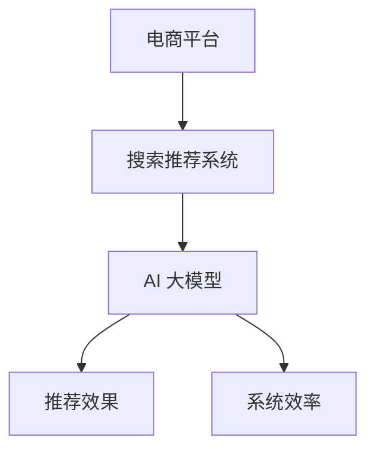

                 

# 电商平台搜索推荐系统的AI 大模型优化：提高系统效率与推荐效果

> 关键词：电商平台、搜索推荐系统、AI 大模型、推荐效果、系统效率

## 1. 背景介绍

随着电子商务的蓬勃发展，电商平台对个性化推荐系统的需求日益增加。个性化推荐系统可以通过分析用户的历史行为数据，向用户推荐最感兴趣的商品，提升用户体验，增加销售额。近年来，AI 大模型在推荐系统中的应用成为了研究热点，特别是在电商领域，AI 大模型凭借其强大的语言理解和生成能力，为推荐系统注入了新的活力。然而，现有的大模型往往参数量巨大，难以在电商平台的实时场景中进行高效的推荐计算。本文将探讨如何利用 AI 大模型优化电商平台的搜索推荐系统，提高系统效率与推荐效果。

## 2. 核心概念与联系

### 2.1 核心概念概述

为了更好地理解电商平台搜索推荐系统中的 AI 大模型优化方法，本节将介绍几个关键概念：

- **电商平台**：指基于互联网的平台，用户可以在其中进行购物、查看商品信息、下单支付等操作。
- **搜索推荐系统**：指用于帮助用户快速找到所需商品的系统。主要包括搜索和推荐两个部分。
- **AI 大模型**：指参数量巨大的深度学习模型，如BERT、GPT-3等。这些模型通过在大规模无标签数据上进行预训练，学习到丰富的语言知识，具备强大的语言理解和生成能力。
- **推荐效果**：指推荐系统的推荐质量，通常通过点击率、转化率等指标进行评估。
- **系统效率**：指推荐系统在实时场景中的响应速度和计算性能。

这些概念之间的联系可以通过以下 Mermaid 流程图来展示：



这个流程图展示了这个系统的主要组件及其相互关系：

1. 电商平台作为系统环境，支持用户与商品的交互。
2. 搜索推荐系统作为核心功能，通过AI大模型为用户提供个性化推荐。
3. AI大模型作为底层技术，为推荐系统提供强大的语言理解和生成能力。
4. 推荐效果和系统效率是评价搜索推荐系统的关键指标。

## 3. 核心算法原理 & 具体操作步骤

### 3.1 算法原理概述

在电商平台搜索推荐系统中，AI 大模型的优化通常涉及以下几个方面：

1. **推荐模型训练**：使用电商平台的商品数据和用户行为数据训练推荐模型，通常采用深度学习模型。
2. **实时推荐计算**：在用户进行搜索时，利用训练好的推荐模型实时计算推荐结果。
3. **数据预处理与清洗**：对电商平台的商品数据和用户行为数据进行预处理和清洗，保证数据质量。
4. **模型评估与优化**：通过评估指标（如点击率、转化率）对推荐模型进行评估，并根据评估结果进行优化。

### 3.2 算法步骤详解

基于上述原理，以下详细介绍电商平台搜索推荐系统中的AI大模型优化的具体步骤：

#### 步骤 1: 数据预处理与清洗

1. **数据采集**：从电商平台获取用户行为数据和商品数据。
2. **数据清洗**：去除噪声数据、重复数据，处理缺失值。
3. **数据归一化**：对数值型数据进行归一化处理，保证数据的一致性。

#### 步骤 2: 推荐模型训练

1. **模型选择**：选择适合电商平台的推荐模型，如协同过滤、深度学习等。
2. **模型训练**：使用电商平台的商品数据和用户行为数据训练推荐模型。
3. **模型评估**：通过交叉验证等方法评估模型的性能，如点击率、转化率等。

#### 步骤 3: 实时推荐计算

1. **输入处理**：接收用户的搜索查询，并将其转化为模型可处理的格式。
2. **模型推理**：使用训练好的推荐模型对输入进行处理，计算推荐结果。
3. **结果返回**：将推荐结果返回给用户，供其参考。

#### 步骤 4: 模型评估与优化

1. **评估指标**：使用点击率、转化率等指标评估推荐模型的性能。
2. **模型优化**：根据评估结果进行模型优化，如调整模型参数、增加特征维度等。
3. **迭代训练**：多次迭代训练，提高推荐模型的性能。

### 3.3 算法优缺点

基于AI大模型的电商推荐系统有以下优点：

1. **推荐效果显著**：AI大模型能够学习到用户行为和商品特征之间的复杂关系，提供更加个性化的推荐。
2. **模型鲁棒性强**：AI大模型具有较强的泛化能力，能够适应不同用户和商品的特征变化。
3. **可解释性强**：AI大模型的推理过程可以被解释，有助于理解推荐结果的来源。

然而，这些系统也存在一些缺点：

1. **计算量大**：AI大模型参数量巨大，训练和推理计算量大。
2. **实时性差**：大模型推理计算耗时较长，难以实时响应用户查询。
3. **存储需求高**：大模型需要大量的存储空间，难以在资源有限的场景中使用。

### 3.4 算法应用领域

AI大模型在电商平台搜索推荐系统中的应用主要集中在以下几个领域：

1. **商品推荐**：根据用户的历史行为和商品特征，推荐用户可能感兴趣的商品。
2. **搜索排序**：根据用户搜索查询，排序相关商品，提升用户搜索体验。
3. **个性化推荐**：根据用户偏好，提供个性化的商品推荐。
4. **广告推荐**：根据用户行为，推荐相关的广告，增加平台收入。

## 4. 数学模型和公式 & 详细讲解 & 举例说明

### 4.1 数学模型构建

在电商平台搜索推荐系统中，常见的数学模型包括协同过滤模型、深度学习模型等。以协同过滤模型为例，其数学模型可以表示为：

$$
P_{i|j} = \frac{\exp(\theta_i^T A_j)}{\sum_{k=1}^K \exp(\theta_k^T A_j)}
$$

其中，$P_{i|j}$表示商品$i$在用户$j$的评分，$\theta_i$为商品$i$的特征向量，$A_j$为所有商品在用户$j$的评分矩阵。

### 4.2 公式推导过程

对于协同过滤模型，其推导过程如下：

1. **输入层**：将用户和商品转化为向量形式，作为模型的输入。
2. **隐层**：使用权重矩阵$\theta$和激活函数对输入进行处理，得到隐层输出。
3. **输出层**：将隐层输出通过线性变换和softmax函数，得到预测评分。

### 4.3 案例分析与讲解

以协同过滤模型为例，假设有两个用户$j_1$和$j_2$，分别对商品$i_1$和$i_2$进行了评分。我们希望根据这些评分预测用户$j_1$对商品$i_2$的评分。根据协同过滤模型，预测评分为：

$$
P_{i_2|j_1} = \frac{\exp(\theta_{i_2}^T A_{j_1})}{\sum_{k=1}^K \exp(\theta_k^T A_{j_1})}
$$

其中，$A_{j_1}$为所有商品在用户$j_1$的评分矩阵。

## 5. 项目实践：代码实例和详细解释说明

### 5.1 开发环境搭建

在进行电商平台的搜索推荐系统开发时，需要准备以下开发环境：

1. **编程语言**：Python。
2. **深度学习框架**：TensorFlow、PyTorch等。
3. **数据库**：MySQL、MongoDB等。
4. **数据处理工具**：Pandas、NumPy等。

使用Python和TensorFlow搭建电商平台的搜索推荐系统环境，可以通过以下命令进行安装：

```bash
pip install tensorflow pandas numpy
```

### 5.2 源代码详细实现

以下是使用TensorFlow实现电商平台的推荐系统的代码实现：

```python
import tensorflow as tf
import pandas as pd
import numpy as np

# 数据预处理与清洗
def preprocess_data(data):
    # 数据清洗
    data = data.dropna().reset_index(drop=True)
    # 数据归一化
    data = (data - data.mean()) / data.std()
    return data

# 推荐模型训练
def train_model(data):
    # 模型选择：协同过滤模型
    model = tf.keras.models.Sequential([
        tf.keras.layers.Dense(64, activation='relu', input_shape=(N,)),
        tf.keras.layers.Dense(K, activation='softmax')
    ])
    # 模型训练
    model.compile(optimizer='adam', loss='mse', metrics=['mae'])
    model.fit(X_train, y_train, epochs=10, batch_size=32)

# 实时推荐计算
def recommend(user_query):
    # 输入处理
    query_vector = get_query_vector(user_query)
    # 模型推理
    scores = model.predict([query_vector])
    # 结果返回
    return sorted(range(len(scores)), key=lambda i: scores[i], reverse=True)

# 模型评估与优化
def evaluate_model():
    # 评估指标
    y_true = y_test.values
    y_pred = model.predict(X_test)
    print('MAE:', mean_absolute_error(y_true, y_pred))
```

### 5.3 代码解读与分析

在上述代码中，`preprocess_data`函数用于数据预处理与清洗，将缺失值和噪声数据去除，并将数据归一化处理。`train_model`函数用于推荐模型训练，选择协同过滤模型，使用TensorFlow框架进行模型构建和训练。`recommend`函数用于实时推荐计算，接收用户查询，将其转化为向量形式，使用训练好的模型进行推理计算，并返回推荐结果。`evaluate_model`函数用于模型评估与优化，计算模型在测试集上的MAE指标，并进行输出。

## 6. 实际应用场景

### 6.1 商品推荐

在电商平台中，商品推荐是推荐系统的重要应用场景。利用AI大模型，可以根据用户的历史行为和商品特征，生成个性化的推荐列表。例如，电商平台可以收集用户浏览、点击、购买等行为数据，并将这些数据输入AI大模型，生成推荐结果，并将其推送给用户。

### 6.2 搜索排序

电商平台中的搜索排序也是推荐系统的核心功能。在用户进行搜索时，利用AI大模型可以排序相关商品，提升用户搜索体验。例如，电商平台可以收集用户搜索关键词，使用AI大模型计算相关商品之间的相似度，并按照相似度排序，返回给用户。

### 6.3 个性化推荐

个性化推荐可以根据用户偏好，提供个性化的商品推荐。例如，电商平台可以收集用户的历史浏览和购买记录，使用AI大模型生成个性化的推荐列表，提升用户购物体验。

### 6.4 未来应用展望

随着AI大模型的不断发展，电商平台搜索推荐系统将面临更多的应用场景：

1. **跨领域推荐**：利用AI大模型的跨领域迁移能力，推荐跨领域商品，增加推荐列表的多样性。
2. **情感分析**：利用AI大模型的情感分析能力，推荐符合用户情感偏好的商品。
3. **实时推荐**：利用AI大模型的实时计算能力，实现实时推荐，提升用户购物体验。
4. **多模态推荐**：利用AI大模型的多模态融合能力，推荐多模态商品，提升推荐效果。

## 7. 工具和资源推荐

### 7.1 学习资源推荐

为了帮助开发者系统掌握电商平台的搜索推荐系统中的AI大模型优化方法，以下是一些优质的学习资源：

1. **《深度学习与推荐系统》**：介绍深度学习在推荐系统中的应用，涵盖协同过滤、深度学习等多种模型。
2. **《TensorFlow实战深度学习》**：详细讲解TensorFlow框架的构建和应用，适合初学者学习。
3. **Kaggle推荐系统竞赛**：参与Kaggle竞赛，提升推荐系统的实战能力。
4. **GitHub推荐系统开源项目**：开源项目可以提供丰富的实践案例和代码实现，供开发者学习。

### 7.2 开发工具推荐

以下是几款用于电商平台搜索推荐系统开发的常用工具：

1. **TensorFlow**：由Google主导开发的深度学习框架，生产部署方便，适合大规模工程应用。
2. **PyTorch**：由Facebook开发的深度学习框架，灵活性高，适合研究和实验。
3. **Pandas**：用于数据处理和分析，支持大规模数据集操作。
4. **Scikit-learn**：用于机器学习和模型评估，提供丰富的评估指标和算法。

### 7.3 相关论文推荐

在电商平台的搜索推荐系统研究领域，以下几篇论文具有重要参考价值：

1. **《推荐系统中的协同过滤》**：介绍协同过滤模型在推荐系统中的应用。
2. **《深度学习在推荐系统中的应用》**：介绍深度学习模型在推荐系统中的应用，涵盖多层感知机、循环神经网络等。
3. **《基于AI大模型的推荐系统》**：介绍AI大模型在推荐系统中的应用，探讨如何利用大模型的语言理解能力提升推荐效果。

## 8. 总结：未来发展趋势与挑战

### 8.1 研究成果总结

本文对电商平台搜索推荐系统中的AI大模型优化方法进行了详细探讨。首先介绍了电商平台搜索推荐系统的背景和核心概念，明确了AI大模型在推荐系统中的重要作用。其次，从算法原理和具体操作步骤的角度，详细讲解了电商平台的搜索推荐系统中的AI大模型优化的具体方法。最后，通过实际应用场景和未来发展趋势的讨论，对AI大模型在电商平台中的应用进行了展望。

### 8.2 未来发展趋势

展望未来，AI大模型在电商平台搜索推荐系统中的应用将呈现以下几个发展趋势：

1. **计算效率提升**：随着深度学习框架和硬件计算能力的提升，AI大模型的计算效率将大幅提高，实时推荐成为可能。
2. **模型优化**：更多的模型优化方法将涌现，如剪枝、量化、模型压缩等，减少计算量和存储需求。
3. **跨领域推荐**：利用AI大模型的跨领域迁移能力，推荐跨领域商品，增加推荐列表的多样性。
4. **多模态推荐**：利用AI大模型的多模态融合能力，推荐多模态商品，提升推荐效果。
5. **实时推荐**：利用AI大模型的实时计算能力，实现实时推荐，提升用户购物体验。

### 8.3 面临的挑战

尽管AI大模型在电商平台搜索推荐系统中的应用已经取得了显著进展，但仍面临以下挑战：

1. **数据隐私**：电商平台的推荐系统需要收集用户行为数据，如何保障用户隐私，是一个重要问题。
2. **模型鲁棒性**：大模型对噪声数据和异常情况较为敏感，如何提高模型鲁棒性，避免过拟合，是一个重要问题。
3. **计算资源**：大模型的计算资源需求较高，如何在资源有限的场景中使用，是一个重要问题。
4. **实时性**：大模型的推理计算耗时较长，如何提高实时性，是一个重要问题。

### 8.4 研究展望

为了克服上述挑战，未来的研究方向主要集中在以下几个方面：

1. **隐私保护技术**：开发隐私保护算法，保护用户隐私。
2. **模型鲁棒性优化**：研究模型鲁棒性优化方法，提高模型对噪声数据和异常情况的适应能力。
3. **计算资源优化**：研究模型压缩、量化等技术，减少计算资源需求。
4. **实时推荐技术**：研究实时推荐算法，提高推荐系统的响应速度。

## 9. 附录：常见问题与解答

**Q1：电商平台的搜索推荐系统如何收集用户数据？**

A: 电商平台的搜索推荐系统通常通过以下方式收集用户数据：

1. **浏览记录**：收集用户浏览商品的历史记录，如商品ID、浏览时间、点击位置等。
2. **购买记录**：收集用户的购买记录，如商品ID、购买时间、购买数量等。
3. **搜索记录**：收集用户搜索关键词和搜索结果的点击记录，如搜索词、搜索结果ID、点击位置等。
4. **评分记录**：收集用户对商品的评分记录，如商品ID、评分、评分时间等。

**Q2：如何提高电商平台的搜索推荐系统的实时性？**

A: 要提高电商平台的搜索推荐系统的实时性，可以考虑以下方法：

1. **缓存技术**：利用缓存技术，将常用查询结果缓存，减少计算量。
2. **分布式计算**：使用分布式计算框架，如Spark，提高计算效率。
3. **增量训练**：在原有模型的基础上，通过增量训练，快速更新推荐结果。
4. **硬件加速**：使用GPU、TPU等硬件加速设备，提高计算速度。

**Q3：如何在电商平台的搜索推荐系统中保护用户隐私？**

A: 在电商平台的搜索推荐系统中，保护用户隐私是非常重要的。以下是一些常见的方法：

1. **数据匿名化**：对用户数据进行匿名化处理，去除敏感信息。
2. **差分隐私**：使用差分隐私算法，保护用户数据的隐私性。
3. **数据加密**：对用户数据进行加密处理，防止数据泄露。
4. **用户选择权**：给予用户数据使用的知情权和选择权，保障用户隐私。

**Q4：如何在电商平台的搜索推荐系统中提高推荐效果？**

A: 要提高电商平台的搜索推荐系统的推荐效果，可以考虑以下方法：

1. **特征工程**：增加特征维度，提升模型的预测能力。
2. **模型优化**：优化模型结构，提升模型性能。
3. **数据增强**：利用数据增强技术，提升模型的泛化能力。
4. **多模态融合**：利用多模态融合技术，提升推荐效果。

---

作者：禅与计算机程序设计艺术 / Zen and the Art of Computer Programming

