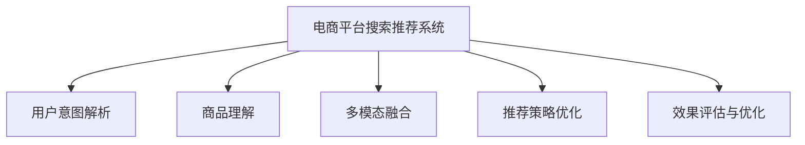

                 

# 电商平台搜索推荐系统的AI 大模型应用：提高系统效率与转化率

> 关键词：电商平台, 搜索推荐系统, 大模型应用, 效率提升, 转化率优化

## 1. 背景介绍

### 1.1 问题由来

在当下互联网经济时代，电商平台正迅速崛起，成为消费者获取商品信息、进行购物决策的主要渠道。然而，电商平台需要应对海量用户，满足多样化的搜索和推荐需求，以实现高效的销售转化。传统的推荐系统往往依赖于人工构建的特征工程，难以充分利用用户行为和商品信息中的潜在价值。

与此同时，人工智能(AI)技术的发展为电商平台带来了新的可能。大规模预训练语言模型如GPT、BERT等，在自然语言处理(NLP)领域取得了巨大成功，具备了强大的语义理解和生成能力。利用这些大模型，电商平台可以更高效地解析用户需求，推荐符合用户偏好的商品，显著提升用户体验和销售转化率。

### 1.2 问题核心关键点

大模型在电商平台搜索推荐系统中的应用，主要集中在以下关键点：

- **用户意图解析**：通过大模型解析用户输入的查询，理解用户的真实需求，从而进行更精准的推荐。
- **商品理解**：将商品描述、属性等文本信息输入大模型，获得更丰富的商品语义表示，提升推荐的相关性。
- **多模态融合**：结合图片、视频等多模态数据，通过大模型进行多源信息融合，获得更全面的商品表示。
- **推荐策略优化**：利用大模型学习用户和商品的复杂交互模式，构建更高效的推荐模型。
- **效果评估与优化**：通过大模型对推荐结果进行评估，指导推荐策略的优化，实现系统效果最大化。

本文将系统介绍大模型在电商平台搜索推荐系统中的核心应用，包括用户意图解析、商品理解、多模态融合和推荐策略优化等方面的原理与实践。

## 2. 核心概念与联系

### 2.1 核心概念概述

为更好地理解大模型在电商平台搜索推荐系统中的应用，本节将介绍几个关键概念：

- **电商平台搜索推荐系统(E-commerce Search & Recommendation System, ESRS)**：指利用AI技术对电商平台的用户行为数据和商品信息进行分析和建模，从而提升用户搜索体验和推荐效果，促进用户购买决策的系统。

- **大模型(Large Model)**：指通过大规模数据进行自监督学习或预训练得到的大规模神经网络模型。例如GPT、BERT、Transformer等。这些模型在自然语言处理(NLP)领域取得了显著进展，具备强大的语义理解和生成能力。

- **预训练(Pre-training)**：指在大规模无标签文本数据上进行自监督学习，学习通用语言表示的过程。通过预训练，模型可以更好地处理新任务，提高泛化能力。

- **微调(Fine-tuning)**：指在预训练模型的基础上，使用下游任务的标注数据进行有监督学习，优化模型在特定任务上的表现。微调可以大幅提升模型在特定领域的应用效果。

- **多模态学习(Multimodal Learning)**：指结合文本、图像、音频等多源数据进行联合学习，提高模型的信息综合能力。

- **推荐系统(Recommendation System)**：指利用AI技术对用户历史行为和商品属性进行分析，预测用户未来行为，并推荐可能感兴趣的商品的系统。

- **效果评估与优化(Effect Evaluation & Optimization)**：指通过定义指标、构建评估框架，对推荐系统进行效果评估，并根据评估结果不断优化推荐策略的过程。

这些概念之间的逻辑关系可以通过以下Mermaid流程图来展示：



这个流程图展示了大模型在电商平台搜索推荐系统中的应用流程：

1. 系统利用大模型解析用户查询，理解用户意图。
2. 结合商品描述等多模态信息，对商品进行语义理解。
3. 融合多源数据，生成商品表示。
4. 构建推荐策略，优化推荐效果。
5. 对推荐结果进行评估，指导系统优化。

## 3. 核心算法原理 & 具体操作步骤
### 3.1 算法原理概述

大模型在电商平台搜索推荐系统中的应用，主要基于以下算法原理：

- **用户意图解析**：通过大模型对用户查询进行自然语言处理，理解用户的真实需求和偏好。
- **商品理解**：将商品描述、属性等文本信息输入大模型，获得商品的语义表示。
- **多模态融合**：结合用户行为数据、商品信息等多源数据，通过大模型进行联合学习，提高推荐的相关性。
- **推荐策略优化**：利用大模型学习用户和商品的复杂交互模式，构建推荐模型。
- **效果评估与优化**：通过大模型对推荐结果进行评估，指导推荐策略的优化。

### 3.2 算法步骤详解

大模型在电商平台搜索推荐系统中的应用，一般分为以下几个关键步骤：

**Step 1: 数据准备**
- 收集用户行为数据、商品信息、商品评价等多源数据，进行数据清洗和预处理。
- 对用户查询、商品描述等文本信息进行分词、编码等预处理操作。
- 构建标注数据集，用于大模型的微调。

**Step 2: 大模型选择与微调**
- 选择适合的任务的大模型，如BERT、GPT等。
- 在大模型上进行微调，学习用户意图和商品语义表示。
- 利用标注数据集进行微调，优化模型在特定任务上的表现。

**Step 3: 多模态融合**
- 将用户行为数据、商品信息等多源数据进行特征提取。
- 将提取的特征输入大模型，进行联合学习。
- 使用融合后的特征构建推荐模型。

**Step 4: 推荐策略优化**
- 利用大模型学习用户和商品的复杂交互模式。
- 构建推荐策略，如协同过滤、基于内容的推荐、混合推荐等。
- 根据大模型的预测结果，进行推荐排序和输出。

**Step 5: 效果评估与优化**
- 定义推荐系统效果评估指标，如召回率、准确率、F1-score等。
- 使用评估指标对推荐结果进行评估，分析推荐效果。
- 根据评估结果，不断优化推荐策略，提升系统效果。

### 3.3 算法优缺点

大模型在电商平台搜索推荐系统中的应用，具有以下优点：

- **高效性**：大模型具备强大的语义理解和生成能力，能够高效解析用户查询和商品信息，提升推荐效率。
- **泛化能力**：预训练大模型具备较强的泛化能力，能够适应多种商品和用户需求。
- **灵活性**：结合多源数据进行联合学习，提高推荐的全面性和多样性。
- **可解释性**：大模型可以通过解释中间层的激活信息，提供推荐结果的可解释性。

同时，大模型在应用中也存在一些局限性：

- **数据依赖**：大模型的效果高度依赖于标注数据的质量和数量，标注数据的获取和处理成本较高。
- **计算资源需求高**：大规模预训练模型对计算资源的需求较高，可能对部分电商平台的资源部署带来挑战。
- **模型复杂度高**：大模型的复杂度较高，模型部署和推理速度可能受到影响。
- **公平性问题**：大模型可能存在固有的偏见，需要进行公平性处理，避免对某些群体的不公平推荐。

### 3.4 算法应用领域

大模型在电商平台搜索推荐系统中的应用，已经覆盖了商品理解、用户意图解析、多模态融合等多个领域，具体如下：

- **商品理解**：通过大模型解析商品描述、属性等信息，获得商品的语义表示，提高推荐的相关性。
- **用户意图解析**：利用大模型理解用户查询的语义，解析用户需求和偏好，提高推荐的相关性。
- **多模态融合**：结合商品图片、视频等多模态信息，通过大模型进行融合，提升推荐效果。
- **个性化推荐**：根据用户历史行为数据和商品信息，利用大模型构建个性化推荐模型，提升用户满意度。
- **实时推荐**：利用大模型对用户即时输入的查询进行解析和推荐，实现实时推荐功能。

这些应用领域的探索，使得大模型在电商平台搜索推荐系统中发挥了重要作用，显著提升了系统的推荐效果和用户体验。

## 4. 数学模型和公式 & 详细讲解  
### 4.1 数学模型构建

大模型在电商平台搜索推荐系统中的应用，涉及多个数学模型。以下以商品理解和推荐策略优化为例，进行详细讲解。

**商品理解**
- **数学模型**：使用BERT模型对商品描述进行预训练，学习商品的语义表示。
- **公式推导**：
  $$
  \text{embeddings} = \text{BERT}_{\theta}(\text{text})
  $$
  其中，$\text{BERT}_{\theta}$表示BERT模型，$\text{text}$表示商品描述的文本信息，$\text{embeddings}$表示商品的多维嵌入向量。

**推荐策略优化**
- **数学模型**：构建基于内容的推荐模型，将用户查询和商品描述的嵌入向量进行相似度计算。
- **公式推导**：
  $$
  \text{similarity} = \text{cosine}(\text{query\_embeddings}, \text{item\_embeddings})
  $$
  其中，$\text{query\_embeddings}$表示用户查询的嵌入向量，$\text{item\_embeddings}$表示商品描述的嵌入向量，$\text{similarity}$表示用户查询和商品描述的相似度。

### 4.2 公式推导过程

**商品理解**
- **推导过程**：使用BERT模型对商品描述进行预训练，学习商品的语义表示。
- **举例说明**：
  假设商品描述为"iPhone 12 Pro Max，128GB，黑色"，将其输入BERT模型进行预训练，得到商品的嵌入向量表示。

**推荐策略优化**
- **推导过程**：构建基于内容的推荐模型，将用户查询和商品描述的嵌入向量进行相似度计算。
- **举例说明**：
  假设用户查询为"新iPhone哪款最好"，将其输入BERT模型进行预训练，得到查询的嵌入向量。同时，将"iPhone 12 Pro Max"的商品描述输入BERT模型进行预训练，得到商品的嵌入向量。将两者进行余弦相似度计算，得到相似度得分。

### 4.3 案例分析与讲解

**案例分析**
- **示例1: 商品理解**
  假设电商平台销售多种电子产品，需要将商品描述进行语义理解，以生成商品标签。
  - **数据准备**：收集商品描述数据，进行预处理和编码。
  - **模型选择**：选择BERT模型进行预训练。
  - **训练过程**：在预训练的BERT模型上，利用商品描述数据进行微调，学习商品的语义表示。
  - **结果展示**：使用微调后的BERT模型，对新商品描述进行预训练，生成商品标签。

**案例分析**
- **示例2: 推荐策略优化**
  假设电商平台需要对用户查询进行实时推荐。
  - **数据准备**：收集用户历史行为数据和商品信息数据，进行预处理和编码。
  - **模型选择**：选择基于内容的推荐模型，如Cosine相似度模型。
  - **训练过程**：在预训练的BERT模型上，利用用户行为数据和商品信息进行训练，优化推荐模型。
  - **结果展示**：使用优化后的推荐模型，对用户即时输入的查询进行实时推荐，提升用户体验。

## 5. 项目实践：代码实例和详细解释说明
### 5.1 开发环境搭建

在进行大模型在电商平台搜索推荐系统中的应用实践前，我们需要准备好开发环境。以下是使用Python进行PyTorch开发的环境配置流程：

1. 安装Anaconda：从官网下载并安装Anaconda，用于创建独立的Python环境。

2. 创建并激活虚拟环境：
```bash
conda create -n ecommerce-env python=3.8 
conda activate ecommerce-env
```

3. 安装PyTorch：根据CUDA版本，从官网获取对应的安装命令。例如：
```bash
conda install pytorch torchvision torchaudio cudatoolkit=11.1 -c pytorch -c conda-forge
```

4. 安装相关库：
```bash
pip install transformers sklearn pandas jupyter notebook ipython
```

完成上述步骤后，即可在`ecommerce-env`环境中开始实践。

### 5.2 源代码详细实现

下面以商品理解为示例，给出使用Transformers库对BERT模型进行商品语义表示的PyTorch代码实现。

```python
from transformers import BertTokenizer, BertModel
from torch.utils.data import Dataset
import torch

class ProductDataset(Dataset):
    def __init__(self, texts, tokenizer, max_len=128):
        self.texts = texts
        self.tokenizer = tokenizer
        self.max_len = max_len
        
    def __len__(self):
        return len(self.texts)
    
    def __getitem__(self, item):
        text = self.texts[item]
        
        encoding = self.tokenizer(text, return_tensors='pt', max_length=self.max_len, padding='max_length', truncation=True)
        input_ids = encoding['input_ids'][0]
        attention_mask = encoding['attention_mask'][0]
        
        return {'input_ids': input_ids, 
                'attention_mask': attention_mask,
                'labels': None}

tokenizer = BertTokenizer.from_pretrained('bert-base-cased')

train_dataset = ProductDataset(train_texts, tokenizer)
dev_dataset = ProductDataset(dev_texts, tokenizer)
test_dataset = ProductDataset(test_texts, tokenizer)

model = BertModel.from_pretrained('bert-base-cased')
```

然后，定义训练和评估函数：

```python
from torch.utils.data import DataLoader
from tqdm import tqdm
from sklearn.metrics import cosine_similarity

device = torch.device('cuda') if torch.cuda.is_available() else torch.device('cpu')
model.to(device)

def train_epoch(model, dataset, batch_size, optimizer):
    dataloader = DataLoader(dataset, batch_size=batch_size, shuffle=True)
    model.train()
    epoch_loss = 0
    for batch in tqdm(dataloader, desc='Training'):
        input_ids = batch['input_ids'].to(device)
        attention_mask = batch['attention_mask'].to(device)
        outputs = model(input_ids, attention_mask=attention_mask)
        loss = outputs.loss
        epoch_loss += loss.item()
        loss.backward()
        optimizer.step()
    return epoch_loss / len(dataloader)

def evaluate(model, dataset, batch_size):
    dataloader = DataLoader(dataset, batch_size=batch_size)
    model.eval()
    similarity_scores = []
    with torch.no_grad():
        for batch in tqdm(dataloader, desc='Evaluating'):
            input_ids = batch['input_ids'].to(device)
            attention_mask = batch['attention_mask'].to(device)
            outputs = model(input_ids, attention_mask=attention_mask)
            batch_similarity = outputs.pooler_output[:, 0].detach().cpu().tolist()
            similarity_scores.append(batch_similarity)
                
    return cosine_similarity(similarity_scores, similarity_scores[0])

```

最后，启动训练流程并在测试集上评估：

```python
epochs = 5
batch_size = 16

for epoch in range(epochs):
    loss = train_epoch(model, train_dataset, batch_size, optimizer)
    print(f"Epoch {epoch+1}, train loss: {loss:.3f}")
    
    print(f"Epoch {epoch+1}, dev similarity: {evaluate(model, dev_dataset, batch_size):.3f}")
    
print("Test similarity:")
print(evaluate(model, test_dataset, batch_size))
```

以上就是使用PyTorch对BERT进行商品语义表示的完整代码实现。可以看到，利用Transformers库，我们能够方便地将BERT模型应用于电商平台搜索推荐系统中的商品理解任务。

### 5.3 代码解读与分析

让我们再详细解读一下关键代码的实现细节：

**ProductDataset类**：
- `__init__`方法：初始化商品描述数据、分词器等关键组件。
- `__len__`方法：返回数据集的样本数量。
- `__getitem__`方法：对单个样本进行处理，将商品描述输入编码器，得到嵌入向量。

**模型训练和评估函数**：
- 使用PyTorch的DataLoader对数据集进行批次化加载，供模型训练和推理使用。
- 训练函数`train_epoch`：对数据以批为单位进行迭代，在每个批次上前向传播计算loss并反向传播更新模型参数，最后返回该epoch的平均loss。
- 评估函数`evaluate`：与训练类似，不同点在于不更新模型参数，并在每个batch结束后将相似度结果存储下来，最后使用scikit-learn的cosine_similarity对整个评估集的相似度进行打印输出。

**训练流程**：
- 定义总的epoch数和batch size，开始循环迭代
- 每个epoch内，先在训练集上训练，输出平均loss
- 在验证集上评估，输出相似度分数
- 所有epoch结束后，在测试集上评估，给出相似度分数

可以看到，PyTorch配合Transformers库使得BERT商品语义表示的代码实现变得简洁高效。开发者可以将更多精力放在数据处理、模型改进等高层逻辑上，而不必过多关注底层的实现细节。

当然，工业级的系统实现还需考虑更多因素，如模型的保存和部署、超参数的自动搜索、更灵活的任务适配层等。但核心的微调范式基本与此类似。

## 6. 实际应用场景
### 6.1 智能客服系统

基于大模型在电商平台搜索推荐系统中的应用，可以应用于智能客服系统的构建。传统客服往往需要配备大量人力，高峰期响应缓慢，且一致性和专业性难以保证。而使用微调后的搜索推荐系统，可以7x24小时不间断服务，快速响应客户咨询，用自然流畅的语言解答各类常见问题。

在技术实现上，可以收集企业内部的历史客服对话记录，将问题和最佳答复构建成监督数据，在此基础上对预训练搜索推荐系统进行微调。微调后的搜索推荐系统能够自动理解用户意图，匹配最合适的答复模板进行回复。对于客户提出的新问题，还可以接入检索系统实时搜索相关内容，动态组织生成回答。如此构建的智能客服系统，能大幅提升客户咨询体验和问题解决效率。

### 6.2 个性化推荐系统

基于大模型在电商平台搜索推荐系统中的应用，可以构建更加智能和高效的个性化推荐系统。传统的推荐系统往往只依赖用户的历史行为数据进行物品推荐，难以深入理解用户的真实兴趣偏好。

利用大模型，可以在商品理解、用户意图解析、多模态融合等多个环节进行优化。具体而言，可以收集用户浏览、点击、评论、分享等行为数据，提取和商品交互的物品标题、描述、标签等文本内容。将文本内容作为模型输入，用户的后续行为（如是否点击、购买等）作为监督信号，在此基础上微调预训练语言模型。微调后的模型能够从文本内容中准确把握用户的兴趣点。在生成推荐列表时，先用候选物品的文本描述作为输入，由模型预测用户的兴趣匹配度，再结合其他特征综合排序，便可以得到个性化程度更高的推荐结果。

### 6.3 未来应用展望

随着大模型和微调方法的不断发展，基于搜索推荐系统的大模型应用将在更多领域得到应用，为电商、金融、教育、医疗等多个行业带来变革性影响。

在智慧医疗领域，基于大模型和搜索推荐系统的医疗问答、病历分析、药物研发等应用将提升医疗服务的智能化水平，辅助医生诊疗，加速新药开发进程。

在智能教育领域，微调技术可应用于作业批改、学情分析、知识推荐等方面，因材施教，促进教育公平，提高教学质量。

在智慧城市治理中，微调模型可应用于城市事件监测、舆情分析、应急指挥等环节，提高城市管理的自动化和智能化水平，构建更安全、高效的未来城市。

此外，在企业生产、社会治理、文娱传媒等众多领域，基于大模型和搜索推荐系统的人工智能应用也将不断涌现，为传统行业数字化转型升级提供新的技术路径。相信随着技术的日益成熟，基于搜索推荐系统的大模型应用必将在更广阔的应用领域大放异彩，深刻影响人类的生产生活方式。

## 7. 工具和资源推荐
### 7.1 学习资源推荐

为了帮助开发者系统掌握大模型在电商平台搜索推荐系统中的应用，这里推荐一些优质的学习资源：

1. 《Transformers from The Inside》系列博文：由大模型技术专家撰写，深入浅出地介绍了Transformer原理、BERT模型、微调技术等前沿话题。

2. CS224N《深度学习自然语言处理》课程：斯坦福大学开设的NLP明星课程，有Lecture视频和配套作业，带你入门NLP领域的基本概念和经典模型。

3. 《Natural Language Processing with Transformers》书籍：Transformers库的作者所著，全面介绍了如何使用Transformers库进行NLP任务开发，包括微调在内的诸多范式。

4. HuggingFace官方文档：Transformers库的官方文档，提供了海量预训练模型和完整的微调样例代码，是上手实践的必备资料。

5. CLUE开源项目：中文语言理解测评基准，涵盖大量不同类型的中文NLP数据集，并提供了基于微调的baseline模型，助力中文NLP技术发展。

通过对这些资源的学习实践，相信你一定能够快速掌握大模型在电商平台搜索推荐系统中的应用精髓，并用于解决实际的NLP问题。
###  7.2 开发工具推荐

高效的开发离不开优秀的工具支持。以下是几款用于大模型在电商平台搜索推荐系统中的应用开发的常用工具：

1. PyTorch：基于Python的开源深度学习框架，灵活动态的计算图，适合快速迭代研究。大部分预训练语言模型都有PyTorch版本的实现。

2. TensorFlow：由Google主导开发的开源深度学习框架，生产部署方便，适合大规模工程应用。同样有丰富的预训练语言模型资源。

3. Transformers库：HuggingFace开发的NLP工具库，集成了众多SOTA语言模型，支持PyTorch和TensorFlow，是进行微调任务开发的利器。

4. Weights & Biases：模型训练的实验跟踪工具，可以记录和可视化模型训练过程中的各项指标，方便对比和调优。与主流深度学习框架无缝集成。

5. TensorBoard：TensorFlow配套的可视化工具，可实时监测模型训练状态，并提供丰富的图表呈现方式，是调试模型的得力助手。

6. Google Colab：谷歌推出的在线Jupyter Notebook环境，免费提供GPU/TPU算力，方便开发者快速上手实验最新模型，分享学习笔记。

合理利用这些工具，可以显著提升大模型在电商平台搜索推荐系统中的应用开发效率，加快创新迭代的步伐。

### 7.3 相关论文推荐

大模型和微调技术的发展源于学界的持续研究。以下是几篇奠基性的相关论文，推荐阅读：

1. Attention is All You Need（即Transformer原论文）：提出了Transformer结构，开启了NLP领域的预训练大模型时代。

2. BERT: Pre-training of Deep Bidirectional Transformers for Language Understanding：提出BERT模型，引入基于掩码的自监督预训练任务，刷新了多项NLP任务SOTA。

3. Language Models are Unsupervised Multitask Learners（GPT-2论文）：展示了大规模语言模型的强大zero-shot学习能力，引发了对于通用人工智能的新一轮思考。

4. Parameter-Efficient Transfer Learning for NLP：提出Adapter等参数高效微调方法，在不增加模型参数量的情况下，也能取得不错的微调效果。

5. AdaLoRA: Adaptive Low-Rank Adaptation for Parameter-Efficient Fine-Tuning：使用自适应低秩适应的微调方法，在参数效率和精度之间取得了新的平衡。

这些论文代表了大模型和微调技术的发展脉络。通过学习这些前沿成果，可以帮助研究者把握学科前进方向，激发更多的创新灵感。

## 8. 总结：未来发展趋势与挑战
### 8.1 总结

本文对大模型在电商平台搜索推荐系统中的应用进行了全面系统的介绍。首先阐述了大模型和微调技术的研究背景和意义，明确了大模型在电商平台搜索推荐系统中的应用场景和核心关键点。其次，从原理到实践，详细讲解了大模型在用户意图解析、商品理解、多模态融合和推荐策略优化等方面的应用原理和具体操作步骤。同时，本文还探讨了大模型在电商平台搜索推荐系统中的应用前景和未来趋势，并给出了一些学习资源和开发工具的推荐。

通过本文的系统梳理，可以看到，大模型在电商平台搜索推荐系统中的应用，正逐步成为实现高效智能推荐的关键技术。利用大模型的强大语义理解能力和多源数据融合能力，电商平台搜索推荐系统能够更好地解析用户需求，推荐符合用户偏好的商品，显著提升用户体验和销售转化率。

### 8.2 未来发展趋势

展望未来，大模型在电商平台搜索推荐系统中的应用将呈现以下几个发展趋势：

1. **模型规模持续增大**：随着算力成本的下降和数据规模的扩张，预训练语言模型的参数量还将持续增长。超大规模语言模型蕴含的丰富语言知识，有望支撑更加复杂多变的搜索推荐任务。

2. **微调方法日趋多样**：除了传统的全参数微调外，未来会涌现更多参数高效的微调方法，如Prompt-based Learning、AdaLoRA等，在节省计算资源的同时也能保证微调精度。

3. **多模态学习崛起**：结合文本、图像、音频等多模态数据进行联合学习，提高推荐的全面性和多样性。

4. **推荐策略优化**：利用大模型学习用户和商品的复杂交互模式，构建更高效的推荐模型。

5. **效果评估与优化**：通过大模型对推荐结果进行评估，指导推荐策略的优化，实现系统效果最大化。

这些趋势凸显了大模型在电商平台搜索推荐系统中的应用潜力。这些方向的探索发展，必将进一步提升搜索推荐系统的推荐效果和用户体验，为电商平台带来新的商业机遇。

### 8.3 面临的挑战

尽管大模型在电商平台搜索推荐系统中的应用已经取得了瞩目成就，但在迈向更加智能化、普适化应用的过程中，它仍面临着诸多挑战：

1. **数据依赖**：大模型的效果高度依赖于标注数据的质量和数量，标注数据的获取和处理成本较高。

2. **计算资源需求高**：大规模预训练模型对计算资源的需求较高，可能对部分电商平台的资源部署带来挑战。

3. **模型复杂度高**：大模型的复杂度较高，模型部署和推理速度可能受到影响。

4. **公平性问题**：大模型可能存在固有的偏见，需要进行公平性处理，避免对某些群体的不公平推荐。

5. **实时性要求高**：电商平台对推荐系统的实时性要求较高，如何在保证推荐效果的同时提升系统的响应速度，也是一大挑战。

6. **可解释性不足**：大模型作为黑盒系统，难以解释其内部工作机制和决策逻辑，对于医疗、金融等高风险应用，模型的可解释性和可审计性尤为重要。

正视这些挑战，积极应对并寻求突破，将是大模型在电商平台搜索推荐系统中的应用走向成熟的必由之路。相信随着学界和产业界的共同努力，这些挑战终将一一被克服，大模型在电商平台搜索推荐系统中的应用必将在构建人机协同的智能电商中扮演越来越重要的角色。

### 8.4 研究展望

面向未来，大模型在电商平台搜索推荐系统中的应用需要在以下几个方面寻求新的突破：

1. **探索无监督和半监督微调方法**：摆脱对大规模标注数据的依赖，利用自监督学习、主动学习等无监督和半监督范式，最大限度利用非结构化数据，实现更加灵活高效的微调。

2. **研究参数高效和计算高效的微调范式**：开发更加参数高效的微调方法，如Prompt-based Learning、AdaLoRA等，在固定大部分预训练参数的同时，只更新极少量的任务相关参数。同时优化微调模型的计算图，减少前向传播和反向传播的资源消耗，实现更加轻量级、实时性的部署。

3. **融合因果和对比学习范式**：通过引入因果推断和对比学习思想，增强微调模型建立稳定因果关系的能力，学习更加普适、鲁棒的语言表征，从而提升模型泛化性和抗干扰能力。

4. **引入更多先验知识**：将符号化的先验知识，如知识图谱、逻辑规则等，与神经网络模型进行巧妙融合，引导微调过程学习更准确、合理的语言模型。同时加强不同模态数据的整合，实现视觉、语音等多模态信息与文本信息的协同建模。

5. **结合因果分析和博弈论工具**：将因果分析方法引入微调模型，识别出模型决策的关键特征，增强输出解释的因果性和逻辑性。借助博弈论工具刻画人机交互过程，主动探索并规避模型的脆弱点，提高系统稳定性。

6. **纳入伦理道德约束**：在模型训练目标中引入伦理导向的评估指标，过滤和惩罚有偏见、有害的输出倾向。同时加强人工干预和审核，建立模型行为的监管机制，确保输出符合人类价值观和伦理道德。

这些研究方向的探索，必将引领大模型在电商平台搜索推荐系统中的应用迈向更高的台阶，为构建安全、可靠、可解释、可控的智能系统铺平道路。面向未来，大模型在电商平台搜索推荐系统中的应用还需要与其他人工智能技术进行更深入的融合，如知识表示、因果推理、强化学习等，多路径协同发力，共同推动自然语言理解和智能交互系统的进步。只有勇于创新、敢于突破，才能不断拓展语言模型的边界，让智能技术更好地造福人类社会。

## 9. 附录：常见问题与解答

**Q1：大模型在电商平台搜索推荐系统中的应用是否适用于所有商品类型？**

A: 大模型在电商平台搜索推荐系统中的应用，对商品类型的适应性较强，尤其是对文本信息丰富的商品。但对于图像、视频等非文本商品，大模型的应用效果可能不如传统推荐系统。此时需要结合商品特征进行联合建模，才能取得更好的效果。

**Q2：大模型在推荐过程中，如何保证实时性？**

A: 大模型在推荐过程中，可以通过优化模型结构、使用更高效的计算资源、进行缓存等措施，提升系统的响应速度。同时，采用多层次的模型结构，可以实现更快速的推理过程，满足电商平台的实时性要求。

**Q3：大模型在推荐过程中，如何平衡推荐效果和模型复杂度？**

A: 大模型在推荐过程中，可以通过参数高效微调、多模态融合等方法，降低模型的复杂度，同时保证推荐效果。同时，结合因果分析和博弈论工具，优化推荐策略，提升系统的鲁棒性和可解释性。

**Q4：大模型在推荐过程中，如何处理数据偏差问题？**

A: 大模型在推荐过程中，可以通过数据增强、对抗训练等方法，缓解数据偏差问题。同时，引入伦理导向的评估指标，过滤和惩罚有偏见、有害的输出倾向，确保推荐结果的公平性和公正性。

**Q5：大模型在推荐过程中，如何进行效果评估和优化？**

A: 大模型在推荐过程中，可以通过定义推荐系统效果评估指标，如召回率、准确率、F1-score等，对推荐结果进行评估。同时，根据评估结果，不断优化推荐策略，提升系统效果。

通过本文的系统梳理，可以看到，大模型在电商平台搜索推荐系统中的应用，正逐步成为实现高效智能推荐的关键技术。利用大模型的强大语义理解能力和多源数据融合能力，电商平台搜索推荐系统能够更好地解析用户需求，推荐符合用户偏好的商品，显著提升用户体验和销售转化率。

---

作者：禅与计算机程序设计艺术 / Zen and the Art of Computer Programming

