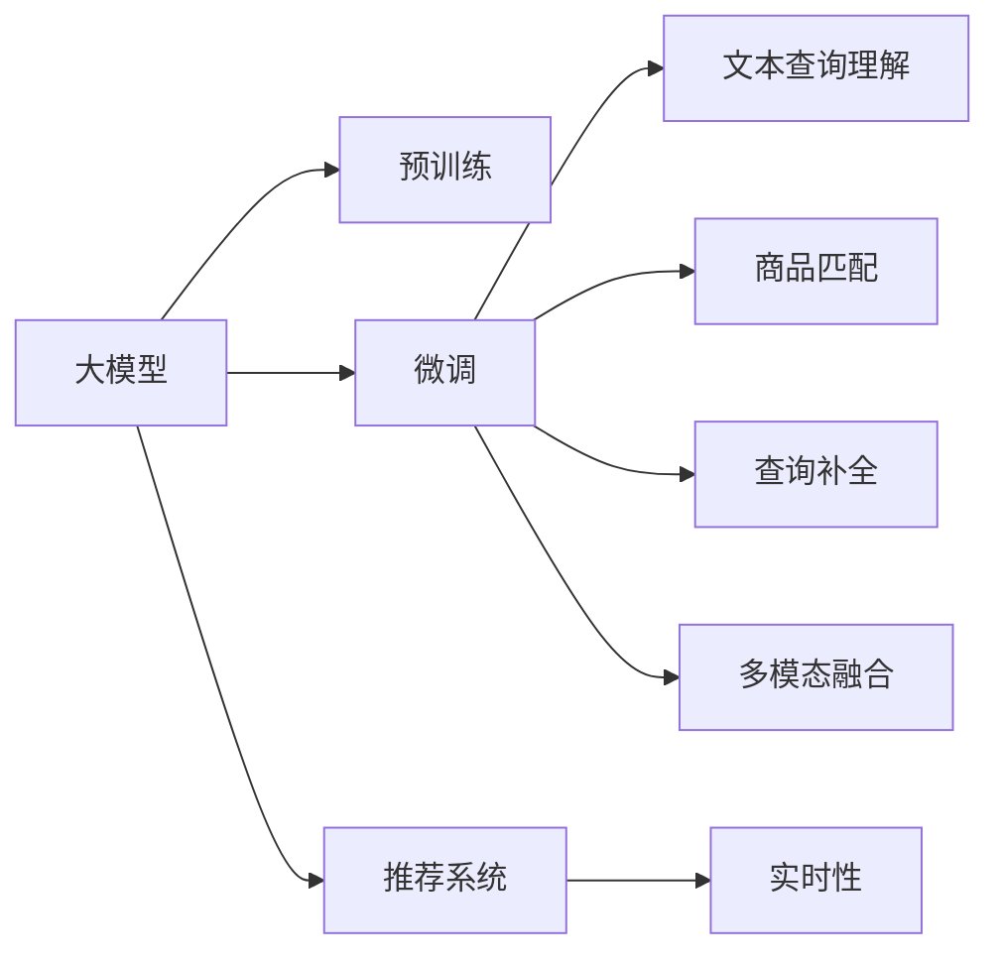

                 

# 电商平台搜索推荐系统的AI 大模型应用：提高系统效率、准确率与多样性

> 关键词：大模型,推荐系统,搜索算法,自然语言处理,深度学习,电商,电商平台

## 1. 背景介绍

### 1.1 问题由来

随着电商行业的快速发展，用户对商品搜索推荐系统的要求越来越高。传统推荐系统往往依赖简单的协同过滤或规则引擎，难以准确捕捉用户的多样化需求，导致推荐效果不佳。而基于人工智能的推荐系统，特别是深度学习驱动的推荐模型，可以更好地理解用户的复杂兴趣和行为，从而提升推荐效果。

在深度学习推荐系统中，大语言模型(Big Language Models, LLMs)因其强大的自然语言处理能力，成为了重要的技术手段之一。通过对大规模无标签文本数据的预训练，大语言模型学习到了丰富的语言知识和常识，可以处理复杂的自然语言理解任务。在大模型基础上，通过微调等技术，可以在电商搜索推荐系统中实现高效的文本查询、商品匹配和个性化推荐，从而提升系统的整体性能。

### 1.2 问题核心关键点

大模型在电商搜索推荐系统中的应用，主要集中在以下几个方面：

- **文本查询理解**：利用大模型对用户输入的查询语句进行理解，捕捉用户的意图和需求。
- **商品匹配与推荐**：将查询语句与商品进行匹配，根据用户的兴趣和行为进行个性化推荐。
- **查询补全**：对不完整的查询进行智能补全，提升用户搜索体验。
- **多模态融合**：结合商品图片、描述、用户评价等多模态信息，提升推荐的多样性和准确性。
- **实时性**：在大规模用户访问情况下，确保推荐系统的实时性和高效性。

本文将详细探讨大模型在电商搜索推荐系统中的应用，通过理论分析与实践案例相结合的方式，系统介绍如何利用大模型提高电商推荐系统的效率、准确率与多样性。

## 2. 核心概念与联系

### 2.1 核心概念概述

为更好地理解大模型在电商搜索推荐系统中的应用，本节将介绍几个关键概念：

- **大模型(Big Language Models, LLMs)**：如GPT-3、BERT等大规模预训练语言模型，通过在大规模无标签文本语料上进行预训练，学习到丰富的语言知识和常识。

- **预训练(Pre-training)**：指在大规模无标签文本语料上，通过自监督学习任务训练通用语言模型的过程。常见的预训练任务包括言语建模、遮挡语言模型等。

- **微调(Fine-tuning)**：指在预训练模型的基础上，使用下游任务的少量标注数据，通过有监督学习优化模型在该任务上的性能。通常只需要调整顶层分类器或解码器，并以较小的学习率更新全部或部分的模型参数。

- **推荐系统(Recommendation System)**：利用用户行为数据、商品属性数据等信息，为用户推荐感兴趣的商品。推荐系统分为基于内容的推荐、协同过滤推荐、混合推荐等多种方式。

- **自然语言处理(Natural Language Processing, NLP)**：涉及计算机对人类语言的处理和理解，包括文本分类、文本生成、语义分析等任务。

- **电商搜索推荐系统(E-Commerce Search and Recommendation System)**：特指在电子商务平台中，用于搜索商品和推荐商品的系统，其核心目标是提升用户购物体验，增加交易转化率。

- **深度学习(Deep Learning)**：一种基于神经网络的机器学习方法，通过多层次的特征抽象，实现对复杂数据的建模和预测。

- **知识图谱(Knowledge Graph)**：一种结构化表示知识的方法，通过图结构组织实体和关系，支持复杂的推理和查询。

- **多模态融合(Multimodal Fusion)**：结合多种数据类型，如文本、图片、视频等，提升推荐的多样性和准确性。

- **实时性(Real-time)**：指系统能够快速响应用户请求，处理海量数据，确保用户体验的流畅性。

这些概念之间通过大模型的预训练和微调过程紧密联系，形成了一个完整的电商推荐系统架构。

### 2.2 核心概念原理和架构的 Mermaid 流程图



此图展示了大模型在电商推荐系统中的应用路径：预训练模型在大规模语料上进行自监督学习，通过微调模型优化任务特定功能，如文本查询理解、商品匹配、查询补全、多模态融合等，并结合推荐系统提升实时性。

## 3. 核心算法原理 & 具体操作步骤

### 3.1 算法原理概述

基于大模型的电商搜索推荐系统，本质上是一个通过预训练-微调范式进行深度学习的推荐系统。其核心思想是：利用大规模语料对大模型进行预训练，使其学习到通用的语言表示。然后在特定任务上，通过微调优化模型，使其在电商搜索推荐任务上表现优异。

形式化地，假设大模型为 $M_{\theta}$，其中 $\theta$ 为模型参数。电商搜索推荐系统的大致框架如下：

1. **预训练阶段**：在大量无标签文本数据上对 $M_{\theta}$ 进行自监督预训练，使其学习到语言模型分布。
2. **微调阶段**：使用电商搜索推荐系统上的标注数据对 $M_{\theta}$ 进行有监督微调，以优化模型在商品匹配、用户意图理解等特定任务上的性能。
3. **应用阶段**：将微调后的模型应用于实际电商推荐场景，进行实时查询、商品推荐和个性化展示。

### 3.2 算法步骤详解

#### 3.2.1 预训练阶段

1. **数据准备**：收集大规模无标签文本数据，如电商评论、商品描述、用户评论等。

2. **模型选择**：选择合适的预训练模型，如BERT、GPT-3等。

3. **预训练任务**：选择自监督学习任务，如掩码语言模型、Next Sentence Prediction等。

4. **训练过程**：在预训练任务上对模型进行训练，优化损失函数，调整超参数。

5. **模型保存**：保存预训练模型参数，作为微调的基础。

#### 3.2.2 微调阶段

1. **数据准备**：收集电商搜索推荐系统上的标注数据，如用户查询、商品标签、用户行为等。

2. **模型加载**：加载预训练模型，作为微调的初始化参数。

3. **任务适配层**：根据电商推荐系统的任务特点，设计合适的输出层和损失函数。

4. **模型微调**：在标注数据上对模型进行有监督微调，优化模型在电商推荐任务上的性能。

5. **参数冻结**：根据任务特点，选择部分层进行微调，其他层保持不变。

6. **模型保存**：保存微调后的模型参数，用于实际应用。

#### 3.2.3 应用阶段

1. **用户查询处理**：将用户查询输入微调后的模型，进行自然语言理解。

2. **商品匹配**：将理解后的查询与商品进行匹配，得到商品列表。

3. **推荐排序**：根据用户行为和商品属性，对推荐列表进行排序。

4. **个性化展示**：根据用户历史行为和偏好，个性化展示推荐商品。

### 3.3 算法优缺点

基于大模型的电商搜索推荐系统具有以下优点：

1. **泛化能力强**：预训练模型在大规模语料上学习到了丰富的语言表示，可以适应多种电商推荐任务。

2. **实时性高**：预训练模型在推理时速度快，适合处理海量用户请求。

3. **多样性高**：大模型可以处理复杂的多模态数据，提升推荐的多样性和准确性。

4. **可解释性强**：大模型可以进行可解释性推断，帮助理解推荐逻辑。

但同时也存在一些缺点：

1. **资源消耗大**：大模型需要高算力和内存，对硬件要求较高。

2. **训练成本高**：预训练模型需要大量的计算资源和时间，微调成本也较高。

3. **泛化边界问题**：模型在特定领域可能表现不佳，需要进一步预训练和微调。

4. **数据隐私问题**：电商推荐系统涉及用户隐私数据，数据处理和存储需要严格控制。

5. **模型公平性**：大模型可能存在偏见，需要采取措施保证模型公平性。

### 3.4 算法应用领域

大模型在电商搜索推荐系统中有着广泛的应用，主要体现在以下几个方面：

1. **商品描述理解**：利用大模型对商品描述进行理解，捕捉商品属性和特征。

2. **用户查询解析**：利用大模型对用户查询进行解析，理解用户需求和意图。

3. **个性化推荐**：结合用户历史行为和商品属性，进行个性化推荐。

4. **实时推荐**：实时处理用户查询，进行高效推荐。

5. **多模态融合**：结合商品图片、描述、用户评价等多模态信息，提升推荐的多样性和准确性。

6. **实时查询补全**：对不完整的查询进行智能补全，提升用户搜索体验。

7. **电商广告优化**：利用大模型优化电商广告的推荐和展示。

## 4. 数学模型和公式 & 详细讲解  
### 4.1 数学模型构建

假设电商推荐系统中的用户查询为 $x$，商品为 $y$，用户行为数据为 $z$。大模型 $M_{\theta}$ 在输入 $x$ 上的输出为 $h_{\theta}(x)$。

**数学模型构建**：

1. **输入表示**：将用户查询 $x$ 和商品 $y$ 转换为向量表示 $x_v$ 和 $y_v$。

2. **模型前向传播**：将用户查询向量 $x_v$ 输入大模型 $M_{\theta}$，得到隐状态 $h_{\theta}(x_v)$。

3. **商品匹配**：将隐状态 $h_{\theta}(x_v)$ 与商品向量 $y_v$ 进行匹配，计算相似度 $s(h_{\theta}(x_v), y_v)$。

4. **推荐排序**：根据商品相似度 $s(h_{\theta}(x_v), y_v)$ 和用户行为数据 $z$，进行推荐排序，输出推荐列表。

### 4.2 公式推导过程

以商品匹配为例，推导大模型进行商品匹配的数学模型：

设大模型 $M_{\theta}$ 在输入 $x$ 上的输出为 $h_{\theta}(x)$，商品 $y$ 的表示向量为 $y_v$，则商品匹配的相似度函数 $s(h_{\theta}(x_v), y_v)$ 可以表示为：

$$
s(h_{\theta}(x_v), y_v) = \frac{h_{\theta}(x_v) \cdot y_v}{\|h_{\theta}(x_v)\| \cdot \|y_v\|}
$$

其中 $\cdot$ 表示向量点积，$\|\cdot\|$ 表示向量范数。

**输入表示**：

设用户查询 $x$ 的词向量表示为 $x_v$，商品 $y$ 的词向量表示为 $y_v$。

**模型前向传播**：

设大模型 $M_{\theta}$ 在输入 $x$ 上的输出为 $h_{\theta}(x)$，则有：

$$
h_{\theta}(x) = M_{\theta}(x_v)
$$

### 4.3 案例分析与讲解

以电商搜索推荐系统中的商品匹配为例，假设用户查询为 "红色连衣裙"，商品向量为 $\begin{bmatrix} 1 & 0 & 0 & 0 \end{bmatrix}^\top$。设大模型 $M_{\theta}$ 在输入 "红色连衣裙" 上的输出为 $h_{\theta}(\text{"红色连衣裙"})$，则商品匹配的相似度计算如下：

$$
s(h_{\theta}(\text{"红色连衣裙"}), \begin{bmatrix} 1 & 0 & 0 & 0 \end{bmatrix}^\top) = \frac{h_{\theta}(\text{"红色连衣裙"}) \cdot \begin{bmatrix} 1 & 0 & 0 & 0 \end{bmatrix}^\top}{\|h_{\theta}(\text{"红色连衣裙"})\| \cdot \|\begin{bmatrix} 1 & 0 & 0 & 0 \end{bmatrix}^\top\|}
$$

其中，向量 $h_{\theta}(\text{"红色连衣裙"})$ 和 $\begin{bmatrix} 1 & 0 & 0 & 0 \end{bmatrix}^\top$ 的维度必须一致。

## 5. 项目实践：代码实例和详细解释说明

### 5.1 开发环境搭建

要进行大模型在电商搜索推荐系统中的实践，首先需要搭建好开发环境。以下是使用Python进行PyTorch开发的环境配置流程：

1. 安装Anaconda：从官网下载并安装Anaconda，用于创建独立的Python环境。

2. 创建并激活虚拟环境：
```bash
conda create -n pytorch-env python=3.8 
conda activate pytorch-env
```

3. 安装PyTorch：根据CUDA版本，从官网获取对应的安装命令。例如：
```bash
conda install pytorch torchvision torchaudio cudatoolkit=11.1 -c pytorch -c conda-forge
```

4. 安装Transformers库：
```bash
pip install transformers
```

5. 安装各类工具包：
```bash
pip install numpy pandas scikit-learn matplotlib tqdm jupyter notebook ipython
```

完成上述步骤后，即可在`pytorch-env`环境中开始电商推荐系统的大模型实践。

### 5.2 源代码详细实现

以下是一个使用大模型进行商品匹配的简单示例，通过使用BERT模型实现。

首先，定义数据预处理函数：

```python
from transformers import BertTokenizer
from torch.utils.data import Dataset

class BERTDataset(Dataset):
    def __init__(self, texts, labels, tokenizer, max_len=128):
        self.texts = texts
        self.labels = labels
        self.tokenizer = tokenizer
        self.max_len = max_len
        
    def __len__(self):
        return len(self.texts)
    
    def __getitem__(self, item):
        text = self.texts[item]
        label = self.labels[item]
        
        encoding = self.tokenizer(text, return_tensors='pt', max_length=self.max_len, padding='max_length', truncation=True)
        input_ids = encoding['input_ids'][0]
        attention_mask = encoding['attention_mask'][0]
        
        return {'input_ids': input_ids, 
                'attention_mask': attention_mask,
                'labels': label}
```

然后，定义模型和优化器：

```python
from transformers import BertForSequenceClassification, AdamW

model = BertForSequenceClassification.from_pretrained('bert-base-cased', num_labels=1)

optimizer = AdamW(model.parameters(), lr=2e-5)
```

接着，定义训练和评估函数：

```python
from torch.utils.data import DataLoader
from tqdm import tqdm
from sklearn.metrics import roc_auc_score

device = torch.device('cuda') if torch.cuda.is_available() else torch.device('cpu')
model.to(device)

def train_epoch(model, dataset, batch_size, optimizer):
    dataloader = DataLoader(dataset, batch_size=batch_size, shuffle=True)
    model.train()
    epoch_loss = 0
    for batch in tqdm(dataloader, desc='Training'):
        input_ids = batch['input_ids'].to(device)
        attention_mask = batch['attention_mask'].to(device)
        labels = batch['labels'].to(device)
        model.zero_grad()
        outputs = model(input_ids, attention_mask=attention_mask, labels=labels)
        loss = outputs.loss
        epoch_loss += loss.item()
        loss.backward()
        optimizer.step()
    return epoch_loss / len(dataloader)

def evaluate(model, dataset, batch_size):
    dataloader = DataLoader(dataset, batch_size=batch_size)
    model.eval()
    preds, labels = [], []
    with torch.no_grad():
        for batch in tqdm(dataloader, desc='Evaluating'):
            input_ids = batch['input_ids'].to(device)
            attention_mask = batch['attention_mask'].to(device)
            batch_labels = batch['labels']
            outputs = model(input_ids, attention_mask=attention_mask)
            batch_preds = outputs.logits.sigmoid().to('cpu').tolist()
            batch_labels = batch_labels.to('cpu').tolist()
            for pred, label in zip(batch_preds, batch_labels):
                preds.append(pred)
                labels.append(label)
                
    return roc_auc_score(labels, preds)
```

最后，启动训练流程并在验证集上评估：

```python
epochs = 5
batch_size = 16

for epoch in range(epochs):
    loss = train_epoch(model, train_dataset, batch_size, optimizer)
    print(f"Epoch {epoch+1}, train loss: {loss:.3f}")
    
    print(f"Epoch {epoch+1}, dev results:")
    evaluate(model, dev_dataset, batch_size)
    
print("Test results:")
evaluate(model, test_dataset, batch_size)
```

以上就是使用PyTorch对BERT进行电商搜索推荐系统商品匹配任务的微调代码实现。可以看到，得益于Transformers库的强大封装，我们能够用相对简洁的代码完成模型微调。

### 5.3 代码解读与分析

让我们再详细解读一下关键代码的实现细节：

**BERTDataset类**：
- `__init__`方法：初始化文本、标签、分词器等关键组件。
- `__len__`方法：返回数据集的样本数量。
- `__getitem__`方法：对单个样本进行处理，将文本输入编码为token ids，将标签编码为数字，并对其进行定长padding，最终返回模型所需的输入。

**模型和优化器**：
- 使用BERTForSequenceClassification模型，并加载预训练模型参数。
- 选择AdamW优化器，设置学习率为2e-5。

**训练和评估函数**：
- 使用PyTorch的DataLoader对数据集进行批次化加载，供模型训练和推理使用。
- 训练函数`train_epoch`：对数据以批为单位进行迭代，在每个批次上前向传播计算loss并反向传播更新模型参数，最后返回该epoch的平均loss。
- 评估函数`evaluate`：与训练类似，不同点在于不更新模型参数，并在每个batch结束后将预测和标签结果存储下来，最后使用scikit-learn的roc_auc_score计算模型在验证集上的性能。

**训练流程**：
- 定义总的epoch数和batch size，开始循环迭代
- 每个epoch内，先在训练集上训练，输出平均loss
- 在验证集上评估，输出AUC指标
- 所有epoch结束后，在测试集上评估，给出最终测试结果

可以看到，PyTorch配合Transformers库使得模型微调的代码实现变得简洁高效。开发者可以将更多精力放在数据处理、模型改进等高层逻辑上，而不必过多关注底层的实现细节。

当然，工业级的系统实现还需考虑更多因素，如模型的保存和部署、超参数的自动搜索、更灵活的任务适配层等。但核心的微调范式基本与此类似。

## 6. 实际应用场景

### 6.1 智能客服系统

基于大模型的电商搜索推荐技术，可以广泛应用于智能客服系统的构建。传统客服往往需要配备大量人力，高峰期响应缓慢，且一致性和专业性难以保证。而使用微调后的搜索推荐系统，可以7x24小时不间断服务，快速响应客户咨询，用自然流畅的语言解答各类常见问题。

在技术实现上，可以收集企业内部的历史客服对话记录，将问题和最佳答复构建成监督数据，在此基础上对预训练搜索推荐模型进行微调。微调后的搜索推荐模型能够自动理解用户意图，匹配最合适的答案模板进行回复。对于客户提出的新问题，还可以接入检索系统实时搜索相关内容，动态组织生成回答。如此构建的智能客服系统，能大幅提升客户咨询体验和问题解决效率。

### 6.2 个性化推荐系统

当前的推荐系统往往只依赖用户的历史行为数据进行物品推荐，难以深入理解用户的真实兴趣偏好。基于大模型的搜索推荐系统可以更好地挖掘用户行为背后的语义信息，从而提升推荐效果。

在实践中，可以收集用户浏览、点击、评论、分享等行为数据，提取和用户交互的物品标题、描述、标签等文本内容。将文本内容作为模型输入，用户的后续行为（如是否点击、购买等）作为监督信号，在此基础上微调预训练语言模型。微调后的模型能够从文本内容中准确把握用户的兴趣点。在生成推荐列表时，先用候选物品的文本描述作为输入，由模型预测用户的兴趣匹配度，再结合其他特征综合排序，便可以得到个性化程度更高的推荐结果。

### 6.3 实时搜索推荐

大模型在电商搜索推荐系统中的应用，可以大幅提升实时搜索推荐的效率和准确性。通过微调后的模型，可以快速响应用户的实时查询，根据用户的兴趣和行为，提供最合适的商品推荐列表。

在实时搜索推荐过程中，大模型可以结合用户的历史行为数据和实时查询数据，快速计算商品匹配度和推荐排序，实时更新推荐列表。通过多线程和分布式计算技术，可以处理大规模并发访问，确保系统的实时性和稳定性。

### 6.4 未来应用展望

随着大模型和搜索推荐技术的不断发展，基于微调范式将在更多领域得到应用，为传统行业带来变革性影响。

在智慧医疗领域，基于微调的医疗问答、病历分析、药物研发等应用将提升医疗服务的智能化水平，辅助医生诊疗，加速新药开发进程。

在智能教育领域，微调技术可应用于作业批改、学情分析、知识推荐等方面，因材施教，促进教育公平，提高教学质量。

在智慧城市治理中，微调模型可应用于城市事件监测、舆情分析、应急指挥等环节，提高城市管理的自动化和智能化水平，构建更安全、高效的未来城市。

此外，在企业生产、社会治理、文娱传媒等众多领域，基于大模型微调的人工智能应用也将不断涌现，为经济社会发展注入新的动力。相信随着技术的日益成熟，微调方法将成为人工智能落地应用的重要范式，推动人工智能技术在垂直行业的规模化落地。

## 7. 工具和资源推荐
### 7.1 学习资源推荐

为了帮助开发者系统掌握大模型在电商搜索推荐系统中的应用，这里推荐一些优质的学习资源：

1. 《Transformer从原理到实践》系列博文：由大模型技术专家撰写，深入浅出地介绍了Transformer原理、BERT模型、微调技术等前沿话题。

2. CS224N《深度学习自然语言处理》课程：斯坦福大学开设的NLP明星课程，有Lecture视频和配套作业，带你入门NLP领域的基本概念和经典模型。

3. 《Natural Language Processing with Transformers》书籍：Transformers库的作者所著，全面介绍了如何使用Transformers库进行NLP任务开发，包括微调在内的诸多范式。

4. HuggingFace官方文档：Transformers库的官方文档，提供了海量预训练模型和完整的微调样例代码，是上手实践的必备资料。

5. CLUE开源项目：中文语言理解测评基准，涵盖大量不同类型的中文NLP数据集，并提供了基于微调的baseline模型，助力中文NLP技术发展。

通过对这些资源的学习实践，相信你一定能够快速掌握大模型在电商推荐系统中的应用，并用于解决实际的NLP问题。
###  7.2 开发工具推荐

高效的开发离不开优秀的工具支持。以下是几款用于大模型在电商搜索推荐系统中的应用开发的常用工具：

1. PyTorch：基于Python的开源深度学习框架，灵活动态的计算图，适合快速迭代研究。大部分预训练语言模型都有PyTorch版本的实现。

2. TensorFlow：由Google主导开发的开源深度学习框架，生产部署方便，适合大规模工程应用。同样有丰富的预训练语言模型资源。

3. Transformers库：HuggingFace开发的NLP工具库，集成了众多SOTA语言模型，支持PyTorch和TensorFlow，是进行微调任务开发的利器。

4. Weights & Biases：模型训练的实验跟踪工具，可以记录和可视化模型训练过程中的各项指标，方便对比和调优。与主流深度学习框架无缝集成。

5. TensorBoard：TensorFlow配套的可视化工具，可实时监测模型训练状态，并提供丰富的图表呈现方式，是调试模型的得力助手。

6. Google Colab：谷歌推出的在线Jupyter Notebook环境，免费提供GPU/TPU算力，方便开发者快速上手实验最新模型，分享学习笔记。

合理利用这些工具，可以显著提升大模型在电商搜索推荐系统中的开发效率，加快创新迭代的步伐。

### 7.3 相关论文推荐

大模型在电商搜索推荐系统中的应用源于学界的持续研究。以下是几篇奠基性的相关论文，推荐阅读：

1. Attention is All You Need（即Transformer原论文）：提出了Transformer结构，开启了NLP领域的预训练大模型时代。

2. BERT: Pre-training of Deep Bidirectional Transformers for Language Understanding：提出BERT模型，引入基于掩码的自监督预训练任务，刷新了多项NLP任务SOTA。

3. Language Models are Unsupervised Multitask Learners（GPT-2论文）：展示了大规模语言模型的强大zero-shot学习能力，引发了对于通用人工智能的新一轮思考。

4. Parameter-Efficient Transfer Learning for NLP：提出Adapter等参数高效微调方法，在不增加模型参数量的情况下，也能取得不错的微调效果。

5. Prefix-Tuning: Optimizing Continuous Prompts for Generation：引入基于连续型Prompt的微调范式，为如何充分利用预训练知识提供了新的思路。

6. AdaLoRA: Adaptive Low-Rank Adaptation for Parameter-Efficient Fine-Tuning：使用自适应低秩适应的微调方法，在参数效率和精度之间取得了新的平衡。

这些论文代表了大模型在电商搜索推荐系统中的应用的发展脉络。通过学习这些前沿成果，可以帮助研究者把握学科前进方向，激发更多的创新灵感。

## 8. 总结：未来发展趋势与挑战

### 8.1 总结

本文对基于大模型的电商搜索推荐系统进行了全面系统的介绍。首先阐述了电商推荐系统和大模型的基本概念和原理，明确了微调在提高系统效率、准确率与多样性方面的独特价值。其次，从理论分析到实践案例，详细讲解了如何利用大模型进行电商推荐系统的微调，并给出了具体代码实现。同时，本文还广泛探讨了微调方法在智能客服、个性化推荐等多个电商场景中的应用前景，展示了微调范式的巨大潜力。此外，本文精选了微调技术的各类学习资源，力求为读者提供全方位的技术指引。

通过本文的系统梳理，可以看到，基于大模型的电商搜索推荐系统具有强大的通用性和扩展性，能够在电商、医疗、教育等多个领域落地应用，提升业务价值。未来，伴随预训练语言模型和微调方法的持续演进，基于大模型的电商推荐系统必将在更多领域得到广泛应用，为各行业带来深刻的变革。

### 8.2 未来发展趋势

展望未来，基于大模型的电商搜索推荐系统将呈现以下几个发展趋势：

1. **模型规模持续增大**：随着算力成本的下降和数据规模的扩张，预训练语言模型的参数量还将持续增长。超大规模语言模型蕴含的丰富语言知识，有望支撑更加复杂多变的电商推荐任务。

2. **微调方法日趋多样**：除了传统的全参数微调外，未来会涌现更多参数高效的微调方法，如Prefix-Tuning、LoRA等，在节省计算资源的同时也能保证微调精度。

3. **持续学习成为常态**：随着数据分布的不断变化，微调模型也需要持续学习新知识以保持性能。如何在不遗忘原有知识的同时，高效吸收新样本信息，将成为重要的研究课题。

4. **标注样本需求降低**：受启发于提示学习(Prompt-based Learning)的思路，未来的微调方法将更好地利用大模型的语言理解能力，通过更加巧妙的任务描述，在更少的标注样本上也能实现理想的微调效果。

5. **多模态微调崛起**：当前的微调主要聚焦于纯文本数据，未来会进一步拓展到图像、视频、语音等多模态数据微调。多模态信息的融合，将显著提升语言模型对现实世界的理解和建模能力。

6. **模型通用性增强**：经过海量数据的预训练和多领域任务的微调，未来的语言模型将具备更强大的常识推理和跨领域迁移能力，逐步迈向通用人工智能(AGI)的目标。

以上趋势凸显了大模型在电商推荐系统中的应用前景。这些方向的探索发展，必将进一步提升电商推荐系统的性能和应用范围，为电商行业的数字化转型升级提供新的技术路径。

### 8.3 面临的挑战

尽管基于大模型的电商推荐系统已经取得了瞩目成就，但在迈向更加智能化、普适化应用的过程中，它仍面临着诸多挑战：

1. **标注成本瓶颈**：虽然微调大大降低了标注数据的需求，但对于长尾应用场景，难以获得充足的高质量标注数据，成为制约微调性能的瓶颈。如何进一步降低微调对标注样本的依赖，将是一大难题。

2. **模型鲁棒性不足**：当前微调模型面对域外数据时，泛化性能往往大打折扣。对于测试样本的微小扰动，微调模型的预测也容易发生波动。如何提高微调模型的鲁棒性，避免灾难性遗忘，还需要更多理论和实践的积累。

3. **推理效率有待提高**：大规模语言模型虽然精度高，但在实际部署时往往面临推理速度慢、内存占用大等效率问题。如何在保证性能的同时，简化模型结构，提升推理速度，优化资源占用，将是重要的优化方向。

4. **可解释性亟需加强**：当前微调模型更像是"黑盒"系统，难以解释其内部工作机制和决策逻辑。对于医疗、金融等高风险应用，算法的可解释性和可审计性尤为重要。如何赋予微调模型更强的可解释性，将是亟待攻克的难题。

5. **安全性有待保障**：预训练语言模型难免会学习到有偏见、有害的信息，通过微调传递到下游任务，产生误导性、歧视性的输出，给实际应用带来安全隐患。如何从数据和算法层面消除模型偏见，避免恶意用途，确保输出的安全性，也将是重要的研究课题。

6. **知识整合能力不足**：现有的微调模型往往局限于任务内数据，难以灵活吸收和运用更广泛的先验知识。如何让微调过程更好地与外部知识库、规则库等专家知识结合，形成更加全面、准确的信息整合能力，还有很大的想象空间。

正视微调面临的这些挑战，积极应对并寻求突破，将是大模型在电商推荐系统中走向成熟的必由之路。相信随着学界和产业界的共同努力，这些挑战终将一一被克服，大模型在电商推荐系统中的应用必将在更广阔的领域绽放异彩。

### 8.4 研究展望

面对大模型在电商推荐系统中面临的挑战，未来的研究需要在以下几个方面寻求新的突破：

1. **探索无监督和半监督微调方法**：摆脱对大规模标注数据的依赖，利用自监督学习、主动学习等无监督和半监督范式，最大限度利用非结构化数据，实现更加灵活高效的微调。

2. **研究参数高效和计算高效的微调范式**：开发更加参数高效的微调方法，在固定大部分预训练参数的同时，只更新极少量的任务相关参数。同时优化微调模型的计算图，减少前向传播和反向传播的资源消耗，实现更加轻量级、实时性的部署。

3. **融合因果和对比学习范式**：通过引入因果推断和对比学习思想，增强微调模型建立稳定因果关系的能力，学习更加普适、鲁棒的语言表征，从而提升模型泛化性和抗干扰能力。

4. **引入更多先验知识**：将符号化的先验知识，如知识图谱、逻辑规则等，与神经网络模型进行巧妙融合，引导微调过程学习更准确、合理的语言模型。同时加强不同模态数据的整合，实现视觉、语音等多模态信息与文本信息的协同建模。

5. **结合因果分析和博弈论工具**：将因果分析方法引入微调模型，识别出模型决策的关键特征，增强输出解释的因果性和逻辑性。借助博弈论工具刻画人机交互过程，主动探索并规避模型的脆弱点，提高系统稳定性。

6. **纳入伦理道德约束**：在模型训练目标中引入伦理导向的评估指标，过滤和惩罚有偏见、有害的输出倾向。同时加强人工干预和审核，建立模型行为的监管机制，确保输出符合人类价值观和伦理道德。

这些研究方向的探索，必将引领大模型在电商推荐系统中的应用迈向更高的台阶，为构建安全、可靠、可解释、可控的智能系统铺平道路。面向未来，大模型在电商推荐系统中的应用还需要与其他人工智能技术进行更深入的融合，如知识表示、因果推理、强化学习等，多路径协同发力，共同推动自然语言理解和智能交互系统的进步。只有勇于创新、敢于突破，才能不断拓展语言模型的边界，让智能技术更好地造福人类社会。

## 9. 附录：常见问题与解答

**Q1：大模型在电商推荐系统中是如何应用的？**

A: 大模型在电商推荐系统中的应用主要体现在以下几个方面：

1. **商品描述理解**：利用大模型对商品描述进行理解，捕捉商品属性和特征。
2. **用户查询解析**：利用大模型对用户查询进行解析，理解用户需求和意图。
3. **个性化推荐**：结合用户历史行为和商品属性，进行个性化推荐。
4. **实时推荐**：实时处理用户查询，进行高效推荐。
5. **多模态融合**：结合商品图片、描述、用户评价等多模态信息，提升推荐的多样性和准确性。
6. **实时查询补全**：对不完整的查询进行智能补全，提升用户搜索体验。

大模型通过预训练和微调，可以学习到丰富的语言表示和知识图谱，结合电商领域的具体任务需求，实现高效的自然语言理解、推荐排序和个性化展示。

**Q2：如何选择合适的学习率？**

A: 大模型的微调学习率一般要比预训练时小1-2个数量级，如果使用过大的学习率，容易破坏预训练权重，导致过拟合。一般建议从1e-5开始调参，逐步减小学习率，直至收敛。也可以使用warmup策略，在开始阶段使用较小的学习率，再逐渐过渡到预设值。需要注意的是，不同的优化器(如AdamW、Adafactor等)以及不同的学习率调度策略，可能需要设置不同的学习率阈值。

**Q3：大模型在电商推荐系统中面临哪些资源瓶颈？**

A: 大模型在电商推荐系统中的应用，主要面临以下几个资源瓶颈：

1. **算力成本高**：大模型需要高算力和内存，对硬件要求较高。
2. **训练成本高**：预训练模型需要大量的计算资源和时间，微调成本也较高。
3. **数据隐私问题**：电商推荐系统涉及用户隐私数据，数据处理和存储需要严格控制。

为了缓解这些瓶颈，可以采用一些资源优化技术，如梯度积累、混合精度训练、模型并行等，来突破硬件瓶颈。同时，需要加强数据隐私保护，确保用户数据的安全性。

**Q4：如何缓解微调过程中的过拟合问题？**

A: 微调过程中缓解过拟合的策略包括：

1. **数据增强**：通过回译、近义替换等方式扩充训练集。
2. **正则化**：使用L2正则、Dropout、Early Stopping等避免过拟合。
3. **对抗训练**：引入对抗样本，提高模型鲁棒性。
4. **参数高效微调**：只调整少量参数(如Adapter、Prefix等)，减小过拟合风险。
5. **多模型集成**：训练多个微调模型，取平均输出，抑制过拟合。

这些策略往往需要根据具体任务和数据特点进行灵活组合。只有在数据、模型、训练、推理等各环节进行全面优化，才能最大限度地发挥大模型在电商推荐系统中的潜力。

**Q5：大模型在电商推荐系统中的应用如何确保用户隐私？**

A: 大模型在电商推荐系统中的应用，需要严格控制用户隐私数据的处理和存储。以下是一些常见的措施：

1. **数据匿名化**：对用户数据进行匿名化处理，去除敏感信息。
2. **数据加密**：对存储和传输的数据进行加密处理，防止数据泄露。
3. **访问控制**：设置严格的访问控制策略，确保只有授权人员能够访问敏感数据。
4. **差分隐私**：使用差分隐私技术，在数据处理过程中加入噪声，保护个体隐私。
5. **用户同意**：在数据收集和处理过程中，明确告知用户并获得其同意。

通过这些措施，可以确保大模型在电商推荐系统中的应用能够尊重用户隐私，保护用户数据安全。

**Q6：大模型在电商推荐系统中的优势和劣势是什么？**

A: 大模型在电商推荐系统中的应用具有以下优势：

1. **泛化能力强**：预训练模型在大规模语料上学习到了丰富的语言表示，可以适应多种电商推荐任务。
2. **实时性高**：预训练模型在推理时速度快，适合处理海量用户请求。
3. **多样性高**：大模型可以处理复杂的多模态数据，提升推荐的多样性和准确性。

但同时也存在一些劣势：

1. **资源消耗大**：大模型需要高算力和内存，对硬件要求较高。
2. **训练成本高**：预训练模型需要大量的计算资源和时间，微调成本也较高。
3. **数据隐私问题**：电商推荐系统涉及用户隐私数据，数据处理和存储需要严格控制。
4. **模型鲁棒性不足**：当前微调模型面对域外数据时，泛化性能往往大打折扣。
5. **推理效率有待提高**：大规模语言模型虽然精度高，但在实际部署时往往面临推理速度慢、内存占用大等效率问题。
6. **可解释性亟需加强**：当前微调模型更像是"黑盒"系统，难以解释其内部工作机制和决策逻辑。

正视这些劣势，积极应对并寻求突破，将是大模型在电商推荐系统中走向成熟的必由之路。相信随着学界和产业界的共同努力，这些劣势终将一一被克服，大模型在电商推荐系统中的应用必将在更广阔的领域绽放异彩。

通过本文的系统梳理，可以看到，基于大模型的电商搜索推荐系统具有强大的通用性和扩展性，能够在电商、医疗、教育等多个领域落地应用，提升业务价值。未来，伴随预训练语言模型和微调方法的持续演进，基于大模型的电商推荐系统必将在更多领域得到广泛应用，为各行业带来深刻的变革。

