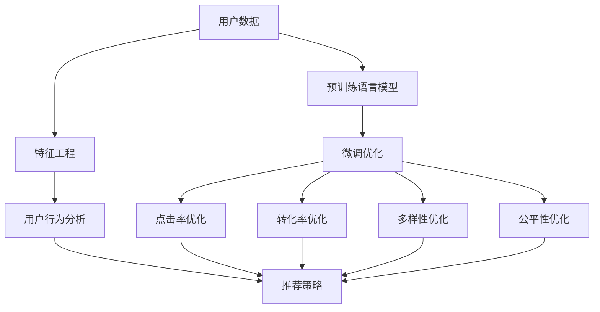

                 

# 电商推荐中的多目标优化：大模型的权衡方案

## 1. 背景介绍

电商推荐系统通过分析用户的购物行为和历史数据，为用户提供个性化的商品推荐，以提升用户体验和转化率。然而，随着用户需求的多样化和个性化，推荐系统的目标也在不断扩展。传统推荐系统往往只考虑单一的指标，如点击率(CTR)、转化率(CVR)等，而现代推荐系统需要同时考虑多个目标，如多样性、个性化、公平性等。

多目标优化(Multi-Objective Optimization, MOP)是针对多目标函数进行优化的一类方法。在电商推荐中，多目标优化可以综合考虑多个推荐指标，最大化总体用户满意度。大语言模型大模型在自然语言处理领域表现卓越，其丰富的预训练知识和大规模参数可以提供强大的多目标优化能力。然而，大模型在电商推荐中应用仍处于初期阶段，多目标优化和权衡方案的设计亟待深入研究。

本文将详细介绍大语言模型在电商推荐中的多目标优化方法，剖析其中的权衡问题，并提出相应的权衡方案。通过系统的理论和实践分析，希望能为电商推荐系统的多目标优化提供新的思路和方法。

## 2. 核心概念与联系

### 2.1 核心概念概述

在电商推荐系统中，多目标优化需要同时考虑多个指标，如点击率、转化率、覆盖率、多样性等。常用的多目标优化方法包括Pareto优化、权重优化、序优化等。

大语言模型通过预训练获得丰富的语言知识，可以用于推荐系统的多目标优化。常用的预训练模型包括BERT、GPT等。通过微调这些预训练模型，可以使其具备多目标优化的能力，提升推荐系统的综合性能。

### 2.2 核心概念原理和架构的 Mermaid 流程图(Mermaid 流程节点中不要有括号、逗号等特殊字符)



该流程图展示了电商推荐中多目标优化的整体架构：
1. 从用户数据开始，将用户行为数据输入预训练语言模型进行特征提取。
2. 在微调优化阶段，通过多种目标函数的设计，对模型参数进行优化。
3. 在点击率、转化率、多样性、公平性等不同目标函数上，通过模型参数的更新，提升各指标的综合表现。
4. 将多目标优化后的模型参数应用于推荐策略中，生成最终的推荐结果。

## 3. 核心算法原理 & 具体操作步骤
### 3.1 算法原理概述

大语言模型在电商推荐中的应用，主要通过多目标优化算法实现。多目标优化算法的基本思想是：将多个目标函数同时加入优化目标，通过设计合适的权重和求解方法，找到综合最优的推荐策略。常用的多目标优化算法包括Pareto优化、权重优化、序优化等。

多目标优化的主要流程如下：
1. 构建多目标函数。
2. 选择合适的权重向量，平衡各目标函数的影响。
3. 求解多目标优化问题，得到Pareto最优解集。
4. 从Pareto最优解集中选择最符合业务需求的推荐策略。

### 3.2 算法步骤详解

以Pareto优化为例，具体步骤如下：
1. 构建多目标函数 $F(x) = (f_1(x), f_2(x), ..., f_n(x))$，其中 $f_i(x)$ 为第 $i$ 个目标函数。
2. 定义权重向量 $\omega = (\omega_1, \omega_2, ..., \omega_n)$，其中 $\omega_i > 0$ 且 $\sum_{i=1}^n \omega_i = 1$。
3. 将多目标函数转化为单目标优化问题，计算 $g(x) = \omega^T F(x)$，即：
   $$
   g(x) = \omega^T F(x) = \sum_{i=1}^n \omega_i f_i(x)
   $$
4. 求解单目标优化问题 $\min_{x} g(x)$，得到最优解 $x^*$。
5. 在多目标解集 $\mathcal{P}$ 中，选择满足 $F(x) \preceq F(x^*)$ 的解，即Pareto最优解集 $\mathcal{P}^*$。

### 3.3 算法优缺点

#### 优点：
1. 综合考虑多个指标，提升推荐系统的整体表现。
2. 通过多目标优化，可以应对不同用户的个性化需求，提高用户满意度。
3. 在大规模数据和复杂结构下，大语言模型具有较强的泛化能力，能更好地适应电商推荐场景。

#### 缺点：
1. 多目标优化问题复杂度高，求解难度大。
2. 权重的选取和调整需要大量经验，对业务理解要求高。
3. 在大模型中，部分参数的微调可能会导致其他目标的性能下降。
4. 在实际应用中，推荐结果的解释性和可控性有待进一步提升。

### 3.4 算法应用领域

大语言模型在电商推荐中的应用，可以应用于多种推荐场景：
1. 个性化推荐：根据用户的历史行为和兴趣，个性化生成商品推荐列表。
2. 新用户推荐：对新注册用户推荐热门商品，促进新用户转化。
3. 商品召回：对用户未购买但感兴趣的物品进行推荐，增加购买机会。
4. 活动推荐：在特定促销活动中，推荐高价值商品，提升活动效果。
5. 动态定价：根据不同用户的购买能力和历史价格行为，动态调整商品价格，提高交易量。

## 4. 数学模型和公式 & 详细讲解 & 举例说明

### 4.1 数学模型构建

在电商推荐中，常见的多目标优化目标函数包括点击率(CTR)、转化率(CVR)、覆盖率(Coverage)、多样性(Diversity)、公平性(Fairness)等。以下以点击率和转化率为例，展示多目标优化模型的构建过程。

假设用户的行为数据 $x$ 为商品ID、用户ID、时间戳等特征的组合，推荐系统输出的点击率和转化率分别为 $y_1$ 和 $y_2$。点击率和转化率的优化目标函数分别为：
- 点击率优化目标函数：$f_1(x) = \frac{y_1}{y_1 + (1 - y_1)}$
- 转化率优化目标函数：$f_2(x) = \frac{y_2}{y_2 + (1 - y_2)}$

其中 $y_1$ 和 $y_2$ 分别为点击和转化的二进制变量，即 $y_1 = 1$ 表示点击，$y_2 = 1$ 表示转化。

### 4.2 公式推导过程

为了平衡点击率和转化率，我们可以设计一个权重向量 $\omega = (\omega_1, \omega_2)$，其中 $\omega_1 + \omega_2 = 1$。将多目标优化问题转化为单目标优化问题，定义新的目标函数：
$$
g(x) = \omega_1 f_1(x) + \omega_2 f_2(x)
$$

假设模型参数为 $\theta$，将模型输出表示为 $g(x)$，则多目标优化问题转化为单目标优化问题：
$$
\min_{\theta} g(x) = \min_{\theta} \omega_1 f_1(x) + \omega_2 f_2(x)
$$

求解上述优化问题，得到最优的参数 $\theta^*$。将 $\theta^*$ 代入模型，得到多目标优化后的推荐结果 $y_1^*$ 和 $y_2^*$。

### 4.3 案例分析与讲解

假设某电商平台对某用户推荐商品，点击率和转化率的Pareto最优解集分别为 $(x_1, y_1^*)$ 和 $(x_2, y_2^*)$。假设点击率和转化率的权重分别为 $0.6$ 和 $0.4$，则对应的Pareto最优解为：
$$
y_1^* = 0.6 y_1^*(x_1) + 0.4 y_1^*(x_2)
$$
$$
y_2^* = 0.6 y_2^*(x_1) + 0.4 y_2^*(x_2)
$$

通过多目标优化，我们得到的推荐结果 $y_1^*$ 和 $y_2^*$ 不仅最大化点击率和转化率，还兼顾了覆盖率和多样性等其他目标，使得推荐结果更加符合用户需求。

## 5. 项目实践：代码实例和详细解释说明

### 5.1 开发环境搭建

在本节中，我们将使用PyTorch框架搭建电商推荐系统，并通过微调预训练语言模型进行多目标优化。

首先，我们需要安装PyTorch、TensorFlow等深度学习框架，并下载预训练语言模型（如BERT、GPT等）。

```bash
pip install torch tensorflow transformers
```

### 5.2 源代码详细实现

接下来，我们将基于预训练语言模型，实现一个简单的电商推荐系统。以BERT模型为例，代码实现如下：

```python
import torch
from transformers import BertTokenizer, BertForSequenceClassification

# 加载预训练语言模型和tokenizer
tokenizer = BertTokenizer.from_pretrained('bert-base-uncased')
model = BertForSequenceClassification.from_pretrained('bert-base-uncased', num_labels=2)

# 加载用户行为数据
def load_user_behavior():
    # 假设从数据库或文件加载用户行为数据
    pass

# 数据预处理
def preprocess_data(user_behavior):
    # 对用户行为数据进行分词和编码
    pass

# 计算点击率和转化率
def calculate_metrics(user_behavior, tokenizer, model):
    # 将用户行为数据转换为模型输入
    inputs = tokenizer(user_behavior, padding=True, truncation=True, max_length=128, return_tensors='pt')
    
    # 计算点击率和转化率
    with torch.no_grad():
        outputs = model(**inputs)
        logits = outputs.logits
        probs = torch.softmax(logits, dim=1)
        y1 = probs[:, 0].item()  # 点击率
        y2 = probs[:, 1].item()  # 转化率
    
    return y1, y2

# 多目标优化
def multi_objective_optimization(user_behavior, weights):
    y1, y2 = calculate_metrics(user_behavior, tokenizer, model)
    g = weights[0] * y1 + weights[1] * y2
    return g

# 训练优化器
optimizer = torch.optim.Adam(model.parameters(), lr=0.001)

# 训练过程
for epoch in range(100):
    user_behavior = load_user_behavior()
    loss = multi_objective_optimization(user_behavior, torch.tensor([0.6, 0.4]))
    optimizer.zero_grad()
    loss.backward()
    optimizer.step()
```

### 5.3 代码解读与分析

1. **预训练语言模型加载**：使用Transformer库加载预训练的BERT模型和对应的tokenizer。

2. **用户行为数据加载**：通过定义`load_user_behavior`函数，加载用户的历史行为数据。

3. **数据预处理**：将用户行为数据转换为模型可接受的输入格式，并进行分词、编码等预处理操作。

4. **点击率和转化率计算**：通过模型输入和输出，计算点击率和转化率。

5. **多目标优化**：将点击率和转化率根据权重进行加权，得到多目标优化函数 $g$。

6. **训练优化器**：定义优化器，并根据多目标优化函数进行梯度更新。

### 5.4 运行结果展示

在上述代码基础上，可以不断迭代优化，获取多目标优化后的推荐结果。运行结果将包括点击率和转化率的综合表现，以及对应的优化函数 $g$ 值。

## 6. 实际应用场景

### 6.1 个性化推荐

在个性化推荐中，点击率和转化率是最常见的多目标优化指标。通过优化模型参数，可以提升推荐系统的个性化水平，满足不同用户的需求。

### 6.2 新用户推荐

新用户推荐中，点击率和转化率是关键的指标。通过多目标优化，可以提升新用户的购买意愿和转化率，促进新用户留存和转化。

### 6.3 商品召回

商品召回中，点击率和转化率是衡量推荐效果的关键指标。通过优化模型，可以提升商品召回的效果，增加用户购买机会。

### 6.4 活动推荐

在特定促销活动中，多目标优化可以综合考虑点击率和转化率，提升活动效果。通过优化推荐策略，可以最大化活动收益。

### 6.5 动态定价

动态定价中，点击率和转化率是影响定价策略的关键指标。通过多目标优化，可以动态调整商品价格，提高交易量和收益。

## 7. 工具和资源推荐

### 7.1 学习资源推荐

1. 《深度学习：理论与实践》：讲解深度学习的基本理论和实践技巧，包括多目标优化的算法。

2. 《推荐系统实践》：介绍推荐系统的多目标优化方法和实际应用案例。

3. 《深度学习框架指南》：详细讲解PyTorch、TensorFlow等深度学习框架的使用方法。

4. 《自然语言处理入门》：介绍自然语言处理的原理和应用，包括语言模型的构建和优化。

5. 《Transformers 3.0》：Transformer库的官方文档，包含预训练模型的实现和微调方法。

### 7.2 开发工具推荐

1. PyTorch：深度学习框架，支持动态计算图和GPU加速。

2. TensorFlow：深度学习框架，支持分布式计算和模型优化。

3. Transformers：自然语言处理工具库，包含预训练模型和微调方法。

4. Weights & Biases：模型训练的实验跟踪工具，支持数据可视化、超参数调试等功能。

5. TensorBoard：TensorFlow配套的可视化工具，支持模型训练监控和调试。

### 7.3 相关论文推荐

1. "Multi-Task Learning Using Prediction Task Alignment"：介绍多任务学习的预测任务对齐方法。

2. "Multi-Objective Optimization in Recommendation Systems"：介绍多目标优化在推荐系统中的应用。

3. "Neural Architecture Search with Multi-Objective Evolutionary Algorithms"：介绍多目标优化在神经网络架构搜索中的应用。

4. "Optimizing Recommendation Systems for User Satisfaction"：介绍多目标优化在提升用户满意度中的应用。

5. "Recommendation Systems in E-commerce"：介绍电商推荐系统的多种推荐策略和多目标优化方法。

## 8. 总结：未来发展趋势与挑战

### 8.1 研究成果总结

多目标优化是电商推荐系统中的重要研究方向。通过综合考虑点击率、转化率、覆盖率、多样性等指标，可以有效提升推荐系统的综合性能，满足不同用户的需求。

### 8.2 未来发展趋势

1. 多目标优化算法的进一步研究：未来将进一步研究更高效、更稳健的多目标优化算法，提升推荐系统的性能。

2. 大语言模型的深度应用：未来将探索更多的大语言模型应用场景，如情感分析、用户画像等，提升推荐系统的个性化水平。

3. 用户行为数据的多样化利用：未来将探索更多用户行为数据的多样化利用方法，提升推荐系统的覆盖率和多样性。

4. 推荐系统的可解释性：未来将研究推荐系统的可解释性问题，提升模型的透明度和可信度。

5. 推荐系统的公平性：未来将研究推荐系统的公平性问题，减少算法偏见，提升用户满意度。

### 8.3 面临的挑战

1. 多目标优化问题复杂度高，求解难度大。

2. 权重的选择和调整需要大量经验，对业务理解要求高。

3. 在大模型中，部分参数的微调可能会导致其他目标的性能下降。

4. 推荐结果的解释性和可控性有待进一步提升。

### 8.4 研究展望

未来，随着深度学习和大语言模型的不断发展，电商推荐系统将面临更多新的挑战和机遇。研究者需要不断探索新的方法和技术，推动电商推荐系统的不断进步。

## 9. 附录：常见问题与解答

**Q1: 多目标优化中的权重如何选择？**

A: 权重的选择需要根据具体业务场景和数据特点进行调整。通常通过实验和分析确定各目标的重要性，进行调整。

**Q2: 多目标优化在大模型中的参数权衡问题如何解决？**

A: 参数权衡问题可以通过优化器的学习率和正则化技术解决。学习率过大会破坏预训练权重，导致过拟合，因此需要调整。正则化技术可以防止过拟合，如L2正则、Dropout等。

**Q3: 推荐系统的可解释性如何解决？**

A: 推荐系统的可解释性可以通过模型可视化、特征重要性分析等方法解决。这些方法可以提供模型的决策依据，增加用户的信任度和满意度。

**Q4: 推荐系统的公平性如何解决？**

A: 推荐系统的公平性可以通过数据预处理、算法设计等方法解决。例如，通过去除偏见样本、调整算法权重等方式，减少算法的偏见和歧视。

**Q5: 推荐系统的动态定价问题如何解决？**

A: 推荐系统的动态定价问题可以通过多目标优化和市场分析解决。通过多目标优化，动态调整商品价格，最大化交易量和收益。

作者：禅与计算机程序设计艺术 / Zen and the Art of Computer Programming

