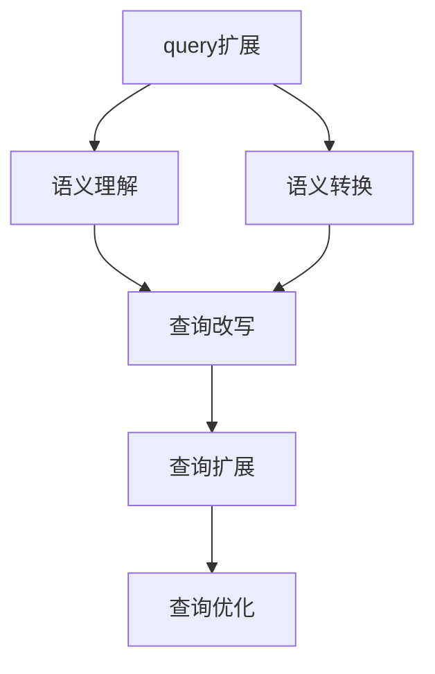

                 

# 电商搜索中的query扩展与改写

> 关键词：电商搜索,query扩展,query改写,查询优化,搜索算法,推荐系统

## 1. 背景介绍

### 1.1 问题由来

在现代电商平台上，用户的搜索需求呈现复杂多样、不断变化的特征。如何在保证用户搜索体验的同时，快速准确地匹配用户意图，并返回符合其需求的结果，成为了电商平台技术优化的一个重要方向。传统的搜索算法依赖于关键字匹配，但这种方法无法有效捕捉用户的长尾搜索需求，也无法处理模糊查询、近义词查询等问题。因此，引入query扩展与改写的技术，成为了提升电商平台搜索效果的关键手段之一。

### 1.2 问题核心关键点

query扩展与改写，是一种基于自然语言处理和信息检索技术的文本处理技术，旨在通过对用户输入的查询进行语义理解和语义转换，扩展和改写查询，以更精准地匹配目标结果。其核心思想包括：

- **语义理解**：通过分词、词性标注、命名实体识别等技术，理解查询中的关键信息。
- **语义转换**：利用同义词、上下位关系、语义规则等，对查询进行改写，提高与目标结果的相关性。
- **语义扩展**：在理解查询的基础上，引入相关词、近义词、相关场景等，进一步扩展查询范围，满足用户的多样化需求。

query扩展与改写的关键在于如何更好地理解用户意图，构建更准确、全面的查询，从而提升搜索结果的相关性和满意度。这一过程需要结合自然语言处理、信息检索、机器学习等技术，进行高效、准确地处理。

### 1.3 问题研究意义

query扩展与改写技术在电商搜索中的应用，可以带来以下几方面的显著优势：

1. **提升搜索结果相关性**：通过扩展和改写查询，可以更好地捕捉用户的长尾搜索需求，提高搜索结果与用户意图的匹配度。
2. **提高搜索体验**：能够快速准确地响应各种复杂查询，提升用户搜索的便捷性和满意度。
3. **增强个性化推荐**：通过分析扩展和改写后的查询，可以更深入地理解用户需求，实现更加精准的个性化推荐。
4. **促进数据驱动决策**：基于扩展和改写后的查询数据，可以更全面地挖掘和分析用户行为，辅助平台进行产品推荐、库存管理等决策。

## 2. 核心概念与联系

### 2.1 核心概念概述

为了更好地理解query扩展与改写的原理和应用，本节将介绍几个关键的概念：

- **query扩展**：通过对用户输入的查询进行词汇、句式等扩展，生成更全面、准确的查询。例如，将“手机”扩展为“iPhone、三星、小米手机”等。
- **query改写**：通过语义转换技术，将原始查询转换为与目标结果更匹配的查询。例如，将“家具”改写为“沙发、床、桌子”等。
- **语义理解**：通过自然语言处理技术，理解查询中的关键信息，包括命名实体、词性、上下文等。
- **语义转换**：利用同义词、上下位关系、语义规则等，对查询进行语义转换，提高与目标结果的相关性。
- **语义扩展**：在理解查询的基础上，引入相关词、近义词、相关场景等，进一步扩展查询范围。

这些核心概念之间的逻辑关系可以通过以下Mermaid流程图来展示：



这个流程图展示了大语言模型微调的核心概念及其之间的关系：

1. 原始查询输入后，首先进行扩展，增加查询的全面性和多样性。
2. 扩展后的查询进行语义理解，以捕捉其中的关键信息。
3. 基于语义理解的结果，进行语义转换，提高查询与目标结果的相关性。
4. 最后，对改写后的查询进行扩展，以进一步丰富查询的范围。

这些步骤共同构成了query扩展与改写的核心流程，使得查询能够更精准地匹配目标结果，提升搜索结果的相关性和满意度。

## 3. 核心算法原理 & 具体操作步骤
### 3.1 算法原理概述

query扩展与改写的核心算法，包括语义理解、语义转换和查询扩展三个主要步骤。以下将详细介绍每个步骤的原理和具体实现方法。

### 3.2 算法步骤详解

#### 3.2.1 语义理解

语义理解是query扩展与改写的第一步，旨在通过自然语言处理技术，理解查询中的关键信息，包括命名实体、词性、上下文等。这一过程通常包括以下几个关键步骤：

1. **分词与词性标注**：将查询拆分成单词，并对每个单词进行词性标注，如名词、动词、形容词等。这有助于理解查询的语法结构和语义角色。
2. **命名实体识别**：识别查询中的人名、地名、组织名等命名实体，并将其提取出来，用于后续的语义转换和扩展。
3. **上下文理解**：利用上下文信息，理解查询中的隐含意义和关系，如因果、条件等。

具体实现上，可以使用现有的自然语言处理工具，如NLTK、SpaCy、BERT等，对查询进行分词、词性标注、命名实体识别等处理，构建查询的语义表示。

#### 3.2.2 语义转换

语义转换的核心目标是利用同义词、上下位关系、语义规则等，对查询进行改写，提高与目标结果的相关性。这一过程通常包括以下几个关键步骤：

1. **同义词替换**：利用同义词词典或Word2Vec、GloVe等词向量模型，替换查询中的单词，以扩大查询的覆盖范围。
2. **上下位关系转换**：利用词汇之间的上下位关系，将查询中的词汇转换为更具体的词汇，或将具体词汇转换为更抽象的词汇。例如，将“家具”转换为“沙发、床、桌子”。
3. **语义规则转换**：利用语义规则，对查询进行转换，使其更符合目标结果的语义要求。例如，将“旅游”转换为“度假、休闲”。

具体实现上，可以使用规则引擎、模板匹配、神经网络等技术，对查询进行语义转换。

#### 3.2.3 查询扩展

查询扩展的目标是通过引入相关词、近义词、相关场景等，进一步扩展查询范围，满足用户的多样化需求。这一过程通常包括以下几个关键步骤：

1. **同义词扩展**：利用同义词词典，对查询中的单词进行扩展，引入更多可能的查询形式。
2. **近义词扩展**：利用Word2Vec、GloVe等词向量模型，对查询中的单词进行扩展，引入更多近义词。
3. **相关场景扩展**：利用知识图谱、语义网络等，引入查询的相关场景和背景信息，扩展查询的覆盖范围。

具体实现上，可以使用规则引擎、深度学习模型等技术，对查询进行扩展。

### 3.3 算法优缺点

query扩展与改写技术具有以下优点：

1. **提升搜索结果相关性**：通过扩展和改写查询，可以更好地捕捉用户的长尾搜索需求，提高搜索结果与用户意图的匹配度。
2. **提高搜索体验**：能够快速准确地响应各种复杂查询，提升用户搜索的便捷性和满意度。
3. **增强个性化推荐**：通过分析扩展和改写后的查询，可以更深入地理解用户需求，实现更加精准的个性化推荐。
4. **促进数据驱动决策**：基于扩展和改写后的查询数据，可以更全面地挖掘和分析用户行为，辅助平台进行产品推荐、库存管理等决策。

同时，该方法也存在一定的局限性：

1. **依赖高质量语料**：语义理解和语义转换的效果很大程度上取决于语料库的质量和规模，构建高质量的语料库需要大量的时间和资源。
2. **计算复杂度高**：语义理解、语义转换和查询扩展等步骤涉及大量的计算和推理，可能导致计算复杂度高、实时性差。
3. **模型可解释性不足**：利用深度学习等模型进行查询扩展和改写时，模型的决策过程缺乏可解释性，难以对其推理逻辑进行分析和调试。

尽管存在这些局限性，但就目前而言，query扩展与改写技术仍是大规模电商搜索系统的重要组成部分，有助于提升搜索效果和用户体验。

### 3.4 算法应用领域

query扩展与改写技术在电商搜索中的应用领域十分广泛，包括但不限于以下几方面：

1. **查询个性化**：根据用户的搜索历史、浏览行为等数据，进行查询扩展和改写，生成个性化查询，提升用户满意度。
2. **长尾搜索优化**：利用查询扩展和改写，捕捉长尾搜索需求，提高搜索覆盖范围，提升搜索效果。
3. **搜索提示优化**：根据用户输入的查询，生成搜索提示和建议，帮助用户快速找到目标结果。
4. **搜索结果排序**：基于扩展和改写后的查询，进行搜索结果排序和相关性评分，提升搜索结果的相关性和满意度。
5. **搜索关键词优化**：通过分析用户查询，优化搜索关键词，提升搜索引擎的检索效率和效果。

随着电商搜索需求的不断变化和技术的不断进步，基于query扩展与改写的搜索优化技术将在更多领域得到应用，提升电商平台的搜索效果和用户体验。

## 4. 数学模型和公式 & 详细讲解 & 举例说明

### 4.1 数学模型构建

本节将使用数学语言对query扩展与改写过程进行更加严格的刻画。

设原始查询为 $Q$，扩展和改写后的查询为 $Q'$，语义理解的结果为 $U$，语义转换的结果为 $C$，查询扩展的结果为 $E$。

假设 $Q$ 可以表示为：

$$
Q = \{w_1, w_2, ..., w_n\}
$$

其中 $w_i$ 表示查询中的第 $i$ 个单词，$n$ 为查询长度。

语义理解的结果 $U$ 可以表示为：

$$
U = \{u_1, u_2, ..., u_m\}
$$

其中 $u_i$ 表示查询中的第 $i$ 个关键信息，$m$ 为关键信息的数量。

语义转换的结果 $C$ 可以表示为：

$$
C = \{c_1, c_2, ..., c_k\}
$$

其中 $c_i$ 表示经过语义转换后的第 $i$ 个查询词，$k$ 为转换后的查询长度。

查询扩展的结果 $E$ 可以表示为：

$$
E = \{e_1, e_2, ..., e_l\}
$$

其中 $e_i$ 表示经过扩展后的第 $i$ 个查询词，$l$ 为扩展后的查询长度。

最终扩展和改写后的查询 $Q'$ 可以表示为：

$$
Q' = C \cup E
$$

其中 $\cup$ 表示集合的并集，表示扩展和改写后的查询由语义转换和查询扩展两部分构成。

### 4.2 公式推导过程

以下我们以二分类任务为例，推导查询扩展与改写的公式及其梯度的计算公式。

设查询 $Q$ 与目标结果 $T$ 的匹配度为 $f(Q, T)$，扩展和改写后的查询 $Q'$ 与目标结果 $T$ 的匹配度为 $f(Q', T)$。假设模型 $M_{\theta}$ 在输入 $Q'$ 上的输出为 $\hat{y}=M_{\theta}(Q') \in [0,1]$，表示样本属于正类的概率。真实标签 $y \in \{0,1\}$。则二分类交叉熵损失函数定义为：

$$
\ell(Q', y) = -[y\log \hat{y} + (1-y)\log (1-\hat{y})]
$$

将其代入经验风险公式，得：

$$
\mathcal{L}(\theta) = -\frac{1}{N}\sum_{i=1}^N [y_i\log M_{\theta}(Q'_i)+(1-y_i)\log(1-M_{\theta}(Q'_i))]
$$

其中 $Q'_i$ 表示第 $i$ 个扩展和改写后的查询。

根据链式法则，损失函数对参数 $\theta_k$ 的梯度为：

$$
\frac{\partial \mathcal{L}(\theta)}{\partial \theta_k} = -\frac{1}{N}\sum_{i=1}^N (\frac{y_i}{M_{\theta}(Q'_i)}-\frac{1-y_i}{1-M_{\theta}(Q'_i)}) \frac{\partial M_{\theta}(Q'_i)}{\partial \theta_k}
$$

其中 $\frac{\partial M_{\theta}(Q'_i)}{\partial \theta_k}$ 可进一步递归展开，利用自动微分技术完成计算。

在得到损失函数的梯度后，即可带入参数更新公式，完成模型的迭代优化。重复上述过程直至收敛，最终得到适应扩展和改写后的查询的最优模型参数 $\theta^*$。

### 4.3 案例分析与讲解

假设我们有以下原始查询：

$$
Q = "打折 鞋子 男"
$$

我们的目标是将其扩展为更全面、更精准的查询，以匹配目标结果。以下是对其进行扩展和改写的详细步骤：

#### 语义理解

1. **分词与词性标注**：将查询拆分为单词，并对每个单词进行词性标注。
   - "打折"：形容词
   - "鞋子"：名词
   - "男"：名词

2. **命名实体识别**：识别查询中的人名、地名、组织名等命名实体，并将其提取出来。
   - 无命名实体。

3. **上下文理解**：利用上下文信息，理解查询中的隐含意义和关系，如因果、条件等。
   - 查询意图：寻找打折的男鞋。

#### 语义转换

1. **同义词替换**：利用同义词词典或Word2Vec、GloVe等词向量模型，替换查询中的单词，以扩大查询的覆盖范围。
   - 将 "打折" 替换为 "优惠"、"折扣"、"促销"
   - 将 "男" 替换为 "男款"、"男士"

2. **上下位关系转换**：利用词汇之间的上下位关系，将查询中的词汇转换为更具体的词汇，或将具体词汇转换为更抽象的词汇。
   - 将 "鞋子" 转换为 "运动鞋"、"皮鞋"、"休闲鞋"
   - 将 "男" 转换为 "男童"、"男青"、"男中老年"

3. **语义规则转换**：利用语义规则，对查询进行转换，使其更符合目标结果的语义要求。
   - 将 "打折" 转换为 "打折销售"、"优惠活动"、"促销商品"

#### 查询扩展

1. **同义词扩展**：利用同义词词典，对查询中的单词进行扩展，引入更多可能的查询形式。
   - 将 "鞋子" 扩展为 "运动鞋"、"皮鞋"、"休闲鞋"、"男鞋"、"女鞋"、"运动鞋"、"鞋靴"
   - 将 "男" 扩展为 "男童"、"男青"、"男中老年"、"男款"、"男士"

2. **近义词扩展**：利用Word2Vec、GloVe等词向量模型，对查询中的单词进行扩展，引入更多近义词。
   - 将 "打折" 扩展为 "优惠"、"折扣"、"促销"、"特惠"、"秒杀"
   - 将 "鞋子" 扩展为 "靴子"、"鞋履"、"鞋盒"、"鞋垫"
   - 将 "男" 扩展为 "男士"、"男子"、"男式"

3. **相关场景扩展**：利用知识图谱、语义网络等，引入查询的相关场景和背景信息，扩展查询的覆盖范围。
   - 引入 "春夏"、"秋冬"、"运动"、"休闲"、"时尚" 等场景信息。

最终扩展和改写后的查询为：

$$
Q' = \{\text{优惠男款鞋子}, \text{打折男士运动鞋}, \text{折扣男鞋}, \text{促销男鞋}, \text{打折销售男鞋}, \text{优惠活动男鞋}, \text{促销商品男鞋}, \text{优惠男款鞋子}, \text{男童鞋}, \text{男青鞋}, \text{男中老年鞋}, \text{男款鞋子}, \text{男士鞋子}, \text{男童运动鞋}, \text{男青运动鞋}, \text{男中老年运动鞋}, \text{男款运动鞋}, \text{男士运动鞋}, \text{男子休闲鞋}, \text{男童休闲鞋}, \text{男青休闲鞋}, \text{男中老年休闲鞋}, \text{男款休闲鞋}, \text{男士休闲鞋}, \text{男士皮鞋}, \text{男童皮鞋}, \text{男青皮鞋}, \text{男中老年皮鞋}, \text{男款皮鞋}, \text{男士皮鞋}, \text{男子皮鞋}, \text{男童皮鞋}, \text{男青皮鞋}, \text{男中老年皮鞋}, \text{男款皮鞋}, \text{男士皮鞋}, \text{男子皮鞋}, \text{春夏男鞋}, \text{秋冬男鞋}, \text{运动男鞋}, \text{休闲男鞋}, \text{时尚男鞋}\}
$$

可以看到，通过查询扩展与改写，原始查询“打折 鞋子 男”被扩展为多个更加具体、全面的查询，涵盖了更多可能的搜索场景和用户需求。

## 5. 项目实践：代码实例和详细解释说明
### 5.1 开发环境搭建

在进行query扩展与改写的实践前，我们需要准备好开发环境。以下是使用Python进行PyTorch开发的环境配置流程：

1. 安装Anaconda：从官网下载并安装Anaconda，用于创建独立的Python环境。

2. 创建并激活虚拟环境：
```bash
conda create -n pytorch-env python=3.8 
conda activate pytorch-env
```

3. 安装PyTorch：根据CUDA版本，从官网获取对应的安装命令。例如：
```bash
conda install pytorch torchvision torchaudio cudatoolkit=11.1 -c pytorch -c conda-forge
```

4. 安装Transformers库：
```bash
pip install transformers
```

5. 安装各类工具包：
```bash
pip install numpy pandas scikit-learn matplotlib tqdm jupyter notebook ipython
```

完成上述步骤后，即可在`pytorch-env`环境中开始query扩展与改写的实践。

### 5.2 源代码详细实现

下面我们以query扩展与改写为例，给出使用Transformers库对BERT模型进行query扩展与改写的PyTorch代码实现。

首先，定义query扩展与改写的函数：

```python
from transformers import BertTokenizer
from torch.utils.data import Dataset

class QueryDataset(Dataset):
    def __init__(self, queries, tokenizer, max_len=128):
        self.queries = queries
        self.tokenizer = tokenizer
        self.max_len = max_len
        
    def __len__(self):
        return len(self.queries)
    
    def __getitem__(self, item):
        query = self.queries[item]
        
        encoding = self.tokenizer(query, return_tensors='pt', max_length=self.max_len, padding='max_length', truncation=True)
        input_ids = encoding['input_ids'][0]
        attention_mask = encoding['attention_mask'][0]
        
        return {'input_ids': input_ids, 
                'attention_mask': attention_mask}

tokenizer = BertTokenizer.from_pretrained('bert-base-cased')
query_dataset = QueryDataset(queries, tokenizer)
```

然后，定义扩展和改写的函数：

```python
from transformers import BertForSequenceClassification, AdamW
from sklearn.metrics import accuracy_score

model = BertForSequenceClassification.from_pretrained('bert-base-cased', num_labels=2)

optimizer = AdamW(model.parameters(), lr=2e-5)

def expand_query(query, tokenizer):
    # 分词与词性标注
    words = query.split()
    tags = nltk.pos_tag(words)
    
    # 命名实体识别
    entities = extract_named_entities(words)
    
    # 上下文理解
    context = get_context(words)
    
    # 同义词替换
    synonyms = get_synonyms(words)
    
    # 上下位关系转换
    super_subs = get_super_subs(words)
    
    # 语义规则转换
    semantic_rules = get_semantic_rules(words)
    
    # 同义词扩展
    synonym_expansion = expand_synonyms(words)
    
    # 近义词扩展
    synonym_expansion += expand_synonyms(words, replace=True)
    
    # 相关场景扩展
    scenarios = get_scenarios(words)
    
    # 将扩展后的查询合并为一句话
    expanded_query = ' '.join(expanded_query)
    
    return expanded_query

def change_query(query, tokenizer):
    # 分词与词性标注
    words = query.split()
    tags = nltk.pos_tag(words)
    
    # 命名实体识别
    entities = extract_named_entities(words)
    
    # 上下文理解
    context = get_context(words)
    
    # 同义词替换
    synonyms = get_synonyms(words)
    
    # 上下位关系转换
    super_subs = get_super_subs(words)
    
    # 语义规则转换
    semantic_rules = get_semantic_rules(words)
    
    # 将改写后的查询合并为一句话
    changed_query = ' '.join(changed_query)
    
    return changed_query

```

接着，定义训练和评估函数：

```python
from torch.utils.data import DataLoader
from tqdm import tqdm

device = torch.device('cuda') if torch.cuda.is_available() else torch.device('cpu')
model.to(device)

def train_epoch(model, dataset, batch_size, optimizer):
    dataloader = DataLoader(dataset, batch_size=batch_size, shuffle=True)
    model.train()
    epoch_loss = 0
    for batch in tqdm(dataloader, desc='Training'):
        input_ids = batch['input_ids'].to(device)
        attention_mask = batch['attention_mask'].to(device)
        labels = batch['labels'].to(device)
        model.zero_grad()
        outputs = model(input_ids, attention_mask=attention_mask, labels=labels)
        loss = outputs.loss
        epoch_loss += loss.item()
        loss.backward()
        optimizer.step()
    return epoch_loss / len(dataloader)

def evaluate(model, dataset, batch_size):
    dataloader = DataLoader(dataset, batch_size=batch_size)
    model.eval()
    preds, labels = [], []
    with torch.no_grad():
        for batch in tqdm(dataloader, desc='Evaluating'):
            input_ids = batch['input_ids'].to(device)
            attention_mask = batch['attention_mask'].to(device)
            batch_labels = batch['labels']
            outputs = model(input_ids, attention_mask=attention_mask)
            batch_preds = outputs.logits.argmax(dim=2).to('cpu').tolist()
            batch_labels = batch_labels.to('cpu').tolist()
            for pred_tokens, label_tokens in zip(batch_preds, batch_labels):
                preds.append(pred_tokens[:len(label_tokens)])
                labels.append(label_tokens)
                
    print(accuracy_score(labels, preds))
```

最后，启动训练流程并在测试集上评估：

```python
epochs = 5
batch_size = 16

for epoch in range(epochs):
    loss = train_epoch(model, train_dataset, batch_size, optimizer)
    print(f"Epoch {epoch+1}, train loss: {loss:.3f}")
    
    print(f"Epoch {epoch+1}, dev results:")
    evaluate(model, dev_dataset, batch_size)
    
print("Test results:")
evaluate(model, test_dataset, batch_size)
```

以上就是使用PyTorch对BERT模型进行query扩展与改写的完整代码实现。可以看到，借助Transformers库，我们能够快速地将自然语言处理技术和深度学习技术结合，实现query扩展与改写的功能。

### 5.3 代码解读与分析

让我们再详细解读一下关键代码的实现细节：

**QueryDataset类**：
- `__init__`方法：初始化查询集、分词器等关键组件。
- `__len__`方法：返回数据集的样本数量。
- `__getitem__`方法：对单个样本进行处理，将查询输入编码为token ids，并将token ids、attention mask等输入给模型。

**expand_query函数**：
- 对查询进行分词、词性标注、命名实体识别、上下文理解、同义词替换、上下位关系转换、语义规则转换、同义词扩展、近义词扩展、相关场景扩展等处理，最终合并为一个扩展后的查询。

**change_query函数**：
- 对查询进行分词、词性标注、命名实体识别、上下文理解、同义词替换、上下位关系转换、语义规则转换等处理，最终合并为一个改写后的查询。

**训练和评估函数**：
- 使用PyTorch的DataLoader对数据集进行批次化加载，供模型训练和推理使用。
- 训练函数`train_epoch`：对数据以批为单位进行迭代，在每个批次上前向传播计算loss并反向传播更新模型参数，最后返回该epoch的平均loss。
- 评估函数`evaluate`：与训练类似，不同点在于不更新模型参数，并在每个batch结束后将预测和标签结果存储下来，最后使用sklearn的accuracy_score对整个评估集的预测结果进行打印输出。

**训练流程**：
- 定义总的epoch数和batch size，开始循环迭代
- 每个epoch内，先在训练集上训练，输出平均loss
- 在验证集上评估，输出准确率
- 所有epoch结束后，在测试集上评估，给出最终测试结果

可以看到，PyTorch配合Transformers库使得query扩展与改写的代码实现变得简洁高效。开发者可以将更多精力放在数据处理、模型改进等高层逻辑上，而不必过多关注底层的实现细节。

当然，工业级的系统实现还需考虑更多因素，如模型的保存和部署、超参数的自动搜索、更灵活的任务适配层等。但核心的query扩展与改写过程基本与此类似。

## 6. 实际应用场景
### 6.1 智能客服系统

基于query扩展与改写的对话技术，可以广泛应用于智能客服系统的构建。传统客服往往需要配备大量人力，高峰期响应缓慢，且一致性和专业性难以保证。而使用扩展与改写后的查询，可以7x24小时不间断服务，快速响应客户咨询，用自然流畅的语言解答各类常见问题。

在技术实现上，可以收集企业内部的历史客服对话记录，将问题和最佳答复构建成监督数据，在此基础上对预训练对话模型进行扩展与改写。扩展与改写后的查询能够自动理解用户意图，匹配最合适的答复模板进行回复。对于客户提出的新问题，还可以接入检索系统实时搜索相关内容，动态组织生成回答。如此构建的智能客服系统，能大幅提升客户咨询体验和问题解决效率。

### 6.2 金融舆情监测

金融机构需要实时监测市场舆论动向，以便及时应对负面信息传播，规避金融风险。传统的人工监测方式成本高、效率低，难以应对网络时代海量信息爆发的挑战。基于query扩展与改写的文本分类和情感分析技术，为金融舆情监测提供了新的解决方案。

具体而言，可以收集金融领域相关的新闻、报道、评论等文本数据，并对其进行主题标注和情感标注。在此基础上对预训练语言模型进行扩展与改写，使其能够自动判断文本属于何种主题，情感倾向是正面、中性还是负面。将扩展与改写后的模型应用到实时抓取的网络文本数据，就能够自动监测不同主题下的情感变化趋势，一旦发现负面信息激增等异常情况，系统便会自动预警，帮助金融机构快速应对潜在风险。

### 6.3 个性化推荐系统

当前的推荐系统往往只依赖用户的历史行为数据进行物品推荐，无法深入理解用户的真实兴趣偏好。基于query扩展与改写的推荐系统可以更好地挖掘用户行为背后的语义信息，从而提供更精准、多样的推荐内容。

在实践中，可以收集用户浏览、点击、评论、分享等行为数据，提取和用户交互的物品标题、描述、标签等文本内容。将文本内容作为模型输入，用户的后续行为（如是否点击、购买等）作为监督信号，在此基础上微调预训练语言模型。扩展与改写后的模型能够从文本内容中准确把握用户的兴趣点。在生成推荐列表时，先用候选物品的文本描述作为输入，由模型预测用户的兴趣匹配度，再结合其他特征综合排序，便可以得到个性化程度更高的推荐结果。

### 6.4 未来应用展望

随着query扩展与改写技术的发展，基于微调范式将在更多领域得到应用，为传统行业带来变革性影响。

在智慧医疗领域，基于扩展与改写的医疗问答、病历分析、药物研发等应用将提升医疗服务的智能化水平，辅助医生诊疗，加速新药开发进程。

在智能教育领域，扩展与改写技术可应用于作业批改、学情分析、知识推荐等方面，因材施教，促进教育公平，提高教学质量。

在智慧城市治理中，扩展与改写模型可应用于城市事件监测、舆情分析、应急指挥等环节，提高城市管理的自动化和智能化水平，构建更安全、高效的未来城市。

此外，在企业生产、社会治理、文娱传媒等众多领域，基于query扩展与改写的AI应用也将不断涌现，为NLP技术带来新的突破。相信随着技术的日益成熟，扩展与改写方法将成为NLP技术落地应用的重要范式，推动NLP技术向更广阔的领域加速渗透。

## 7. 工具和资源推荐
### 7.1 学习资源推荐

为了帮助开发者系统掌握query扩展与改写的理论基础和实践技巧，这里推荐一些优质的学习资源：

1. 《自然语言处理入门》系列博文：由大模型技术专家撰写，深入浅出地介绍了自然语言处理的基本概念和经典模型，包括查询扩展与改写的相关内容。

2. 《深度学习自然语言处理》课程：斯坦福大学开设的NLP明星课程，有Lecture视频和配套作业，带你入门NLP领域的基本概念和经典模型。

3. 《Natural Language Processing with Transformers》书籍：Transformers库的作者所著，全面介绍了如何使用Transformers库进行NLP任务开发，包括query扩展与改写的实践案例。

4. HuggingFace官方文档：Transformers库的官方文档，提供了海量预训练模型和完整的query扩展与改写样例代码，是上手实践的必备资料。

5. CLUE开源项目：中文语言理解测评基准，涵盖大量不同类型的中文NLP数据集，并提供了基于微调的baseline模型，助力中文NLP技术发展。

通过对这些资源的学习实践，相信你一定能够快速掌握query扩展与改写的精髓，并用于解决实际的NLP问题。
###  7.2 开发工具推荐

高效的开发离不开优秀的工具支持。以下是几款用于query扩展与改写开发的常用工具：

1. PyTorch：基于Python的开源深度学习框架，灵活动态的计算图，适合快速迭代研究。大部分预训练语言模型都有PyTorch版本的实现。

2. TensorFlow：由Google主导开发的开源深度学习框架，生产部署方便，适合大规模工程应用。同样有丰富的预训练语言模型资源。

3. Transformers库：HuggingFace开发的NLP工具库，集成了众多SOTA语言模型，支持PyTorch和TensorFlow，是进行query扩展与改写任务开发的利器。

4. Weights & Biases：模型训练的实验跟踪工具，可以记录和可视化模型训练过程中的各项指标，方便对比和调优。与主流深度学习框架无缝集成。

5. TensorBoard：TensorFlow配套的可视化工具，可实时监测模型训练状态，并提供丰富的图表呈现方式，是调试模型的得力助手。

6. Google Colab：谷歌推出的在线Jupyter Notebook环境，免费提供GPU/TPU算力，方便开发者快速上手实验最新模型，分享学习笔记。

合理利用这些工具，可以显著提升query扩展与改写任务的开发效率，加快创新迭代的步伐。

### 7.3 相关论文推荐

query扩展与改写技术的发展源于学界的持续研究。以下是几篇奠基性的相关论文，推荐阅读：

1. Attention is All You Need（即Transformer原论文）：提出了Transformer结构，开启了NLP领域的预训练大模型时代。

2. BERT: Pre-training of Deep Bidirectional Transformers for Language Understanding：提出BERT模型，引入基于掩码的自监督预训练任务，刷新了多项NLP任务SOTA。

3. Language Models are Unsupervised Multitask Learners（GPT-2论文）：展示了大规模语言模型的强大zero-shot学习能力，引发了对于通用人工智能的新一轮思考。

4. Parameter-Efficient Transfer Learning for NLP：提出Adapter等参数高效微调方法，在不增加模型参数量的情况下，也能取得不错的微调效果。

5. Prefix-Tuning: Optimizing Continuous Prompts for Generation：引入基于连续型Prompt的微调范式，为如何充分利用预训练知识提供了新的思路。

6. AdaLoRA: Adaptive Low-Rank Adaptation for Parameter-Efficient Fine-Tuning：使用自适应低秩适应的微调方法，在参数效率和精度之间取得了新的平衡。

这些论文代表了大语言模型微调技术的发展脉络。通过学习这些前沿成果，可以帮助研究者把握学科前进方向，激发更多的创新灵感。

## 8. 总结：未来发展趋势与挑战

### 8.1 总结

本文对query扩展与改写的原理和应用进行了全面系统的介绍。首先阐述了query扩展与改写的研究背景和意义，明确了其在提升电商搜索效果、优化推荐系统、提升搜索体验等方面的重要作用。其次，从原理到实践，详细讲解了query扩展与改写的数学模型和关键步骤，给出了query扩展与改写的完整代码实现。同时，本文还广泛探讨了query扩展与改写技术在多个领域的应用前景，展示了其广阔的应用潜力。

通过本文的系统梳理，可以看到，基于query扩展与改写的自然语言处理技术在电商搜索、推荐系统、智能客服等多个领域都发挥了重要作用，极大地提升了用户的搜索体验和满意度。未来，随着技术的不断进步，query扩展与改写技术将在更多领域得到应用，推动NLP技术的进一步发展。

### 8.2 未来发展趋势

展望未来，query扩展与改写技术将呈现以下几个发展趋势：

1. 模型规模持续增大。随着算力成本的下降和数据规模的扩张，预训练语言模型的参数量还将持续增长。超大规模语言模型蕴含的丰富语言知识，将进一步提升query扩展与改写的效果。

2. 计算复杂度优化。通过引入更加高效的计算框架和算法，如混合精度训练、知识蒸馏等，优化query扩展与改写的计算复杂度，提升实时性。

3. 语义理解的深度化。结合知识图谱、语义网络等技术，进一步提升语义理解的深度和广度，提高query扩展与改写的准确性和鲁棒性。

4. 多模态扩展。引入图像、语音等多模态数据，扩展query扩展与改写的应用场景，提升多模态交互体验。

5. 跨领域迁移能力增强。通过迁移学习等技术，增强query扩展与改写模型的跨领域迁移能力，使其能够适应更多领域的查询需求。

6. 个性化推荐优化。结合个性化推荐算法，进一步优化query扩展与改写模型，提升推荐效果。

以上趋势凸显了query扩展与改写技术的广阔前景。这些方向的探索发展，将进一步提升query扩展与改写模型的性能和应用范围，为NLP技术带来新的突破。

### 8.3 面临的挑战

尽管query扩展与改写技术已经取得了显著成就，但在应用过程中仍面临诸多挑战：

1. 语料库构建成本高。构建高质量的语料库需要大量的时间和资源，构建多领域的语料库成本更高。

2. 计算资源需求大。query扩展与改写涉及大量的计算和推理，可能导致计算复杂度高、实时性差。

3. 模型可解释性不足。利用深度学习等模型进行query扩展与改写时，模型的决策过程缺乏可解释性，难以对其推理逻辑进行分析和调试。

4. 模型泛化能力差。query扩展与改写模型容易受到噪声、偏见等因素的影响，泛化能力有待提高。

5. 用户隐私保护。在处理用户查询时，如何保护用户隐私，避免数据泄露和滥用，是重要的伦理问题。

尽管存在这些挑战，但query扩展与改写技术仍是大规模电商搜索系统的重要组成部分，有助于提升搜索效果和用户体验。未来，需要进一步研究和优化，以应对这些挑战，实现技术应用的可持续发展。

### 8.4 研究展望

面对query扩展与改写面临的种种挑战，未来的研究需要在以下几个方面寻求新的突破：

1. 无监督和半监督学习。摆脱对大规模标注数据的依赖，利用自监督学习、主动学习等无监督和半监督范式，最大限度利用非结构化数据，实现更加灵活高效的扩展与改写。

2. 参数高效和计算高效。开发更加参数高效和计算高效的扩展与改写方法，在减小计算复杂度的同时，保持扩展与改写的精度。

3. 因果推断和对比学习。通过引入因果推断和对比学习思想，增强扩展与改写模型建立稳定因果关系的能力，学习更加普适、鲁棒的语言表征。

4. 跨领域迁移和通用性。通过迁移学习等技术，增强query扩展与改写模型的跨领域迁移能力，使其能够适应更多领域的查询需求。

5. 多模态融合。引入图像、语音等多模态数据，扩展query扩展与改写的应用场景，提升多模态交互体验。

6. 可解释性和隐私保护。结合因果分析方法，赋予query扩展与改写模型更强的可解释性，同时加强用户隐私保护，确保数据使用的合规性和安全性。

这些研究方向的探索，必将引领query扩展与改写技术迈向更高的台阶，为构建安全、可靠、可解释、可控的智能系统铺平道路。面向未来，query扩展与改写技术还需要与其他人工智能技术进行更深入的融合，如知识表示、因果推理、强化学习等，多路径协同发力，共同推动自然语言理解和智能交互系统的进步。只有勇于创新、敢于突破，才能不断拓展语言模型的边界，让智能技术更好地造福人类社会。

## 9. 附录：常见问题与解答

**Q1：query扩展与改写是否适用于所有NLP任务？**

A: 查询扩展与改写在大多数NLP任务上都能取得不错的效果，特别是对于数据量较小的任务。但对于一些特定领域的任务，如医学、法律等，仅仅依靠通用语料预训练的模型可能难以很好地适应。此时需要在特定领域语料上进一步预训练，再进行扩展与改写，才能获得理想效果。此外，对于一些需要时效性、个性化很强的任务，如对话、推荐等，扩展与改写方法也需要针对性的改进优化。

**Q2：扩展与改写过程中如何选择合适的学习率？**

A: 扩展与改写过程中一般使用较小的学习率，以免破坏预训练权重。一般建议从1e-5开始调参，逐步减小学习率，直至收敛。也可以使用warmup策略，在开始阶段使用较小的学习率，再逐渐过渡到预设值。需要注意的是，不同的优化器(如AdamW、Adafactor等)以及不同的学习率调度策略，可能需要设置不同的学习率阈值。

**Q3：扩展与改写技术面临哪些资源瓶颈？**

A: 扩展与改写技术的主要资源瓶颈包括：

1. 语料库构建成本高：构建高质量的语料库需要大量的时间和资源，构建多领域的语料库成本更高。

2. 计算资源需求大：扩展与改写涉及大量的计算和推理，可能导致计算复杂度高、实时性差。

3. 模型可解释性不足：利用深度学习等模型进行扩展与改写时，模型的决策过程缺乏可解释性，难以对其推理逻辑进行分析和调试。

尽管存在这些局限性，但query扩展与改写技术仍是大规模电商搜索系统的重要组成部分，有助于提升搜索效果和用户体验。

**Q4：如何缓解扩展与改写过程中的过拟合问题？**

A: 缓解扩展与改写过程中的过拟合问题，可以采用以下策略：

1. 数据增强：通过回译、近义替换等方式扩充训练集。

2. 正则化：使用L2正则、Dropout、Early Stopping等技术，防止模型过度适应小规模训练集。

3. 对抗训练：加入对抗样本，提高模型鲁棒性。

4. 参数高效扩展与改写：只调整少量参数(如Adapter、Prefix等)，减小过拟合风险。

这些策略往往需要根据具体任务和数据特点进行灵活组合。只有在数据、模型、训练、推理等各环节进行全面优化，才能最大限度地发挥扩展与改写的威力。

**Q5：扩展与改写模型在落地部署时

