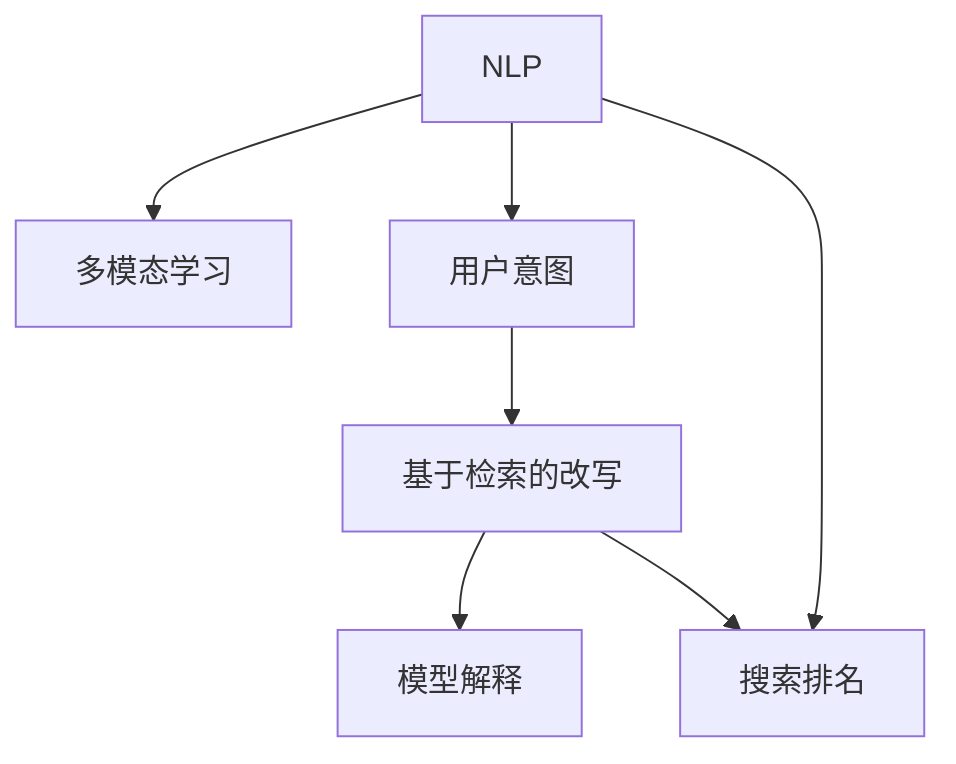

                 

# 电商搜索中的query理解与改写技术

> 关键词：自然语言处理(NLP),搜索排名,多模态学习,用户意图,模型解释,基于检索的改写

## 1. 背景介绍

### 1.1 问题由来
在当今数字化经济中，电商平台成为消费者获取信息和购买商品的主要渠道。在电商搜索中，用户通过输入查询词(即query)来寻找相关商品，搜索系统则根据用户query返回相关商品列表。然而，用户query往往带有歧义，难以精准匹配到目标商品。

一方面，用户query表达的多样性和模糊性增加了搜索系统的复杂度。例如，用户可能用不同的词汇描述同一商品，或者使用非标准表达方式(如缩写、俚语、拼写错误等)进行搜索。另一方面，搜索系统往往以商品特征为检索依据，难以捕捉用户query背后的真实意图。因此，电商搜索中的query理解与改写技术，成为提升用户体验和搜索效果的重要研究方向。

### 1.2 问题核心关键点
本节将围绕query理解与改写的核心问题，分析其研究意义和应用背景。

**1.2.1 研究意义**
电商搜索中的query理解与改写技术，旨在通过智能化的方式，理解用户query的真实意图，生成更具针对性的改写词(即query重写)，提升搜索效果和用户体验。其核心目标包括：
- 提高搜索相关性和用户满意度，减少用户搜索时间。
- 提升商品曝光率和点击率，增加销售额和用户粘性。
- 优化搜索系统的性能和响应速度，降低系统资源消耗。

**1.2.2 应用背景**
随着电商平台的发展，用户query数量和类型不断增加，对搜索系统的准确性和效率提出了更高要求。搜索相关性和排序算法是电商搜索的核心技术，但受限于预定义的检索模式，难以应对复杂的query理解需求。基于NLP的query理解与改写技术，为电商搜索注入了新的活力，引领了智能搜索的变革。

## 2. 核心概念与联系

### 2.1 核心概念概述

本节将介绍电商搜索中query理解与改写技术所涉及的关键概念，以及它们之间的联系。

- **自然语言处理(NLP)**：研究计算机如何理解、处理和生成人类语言的技术。电商搜索中的query理解与改写，依赖于NLP技术对文本语义的深度理解。

- **搜索排名**：电商搜索系统的核心功能，旨在根据用户query返回最相关的商品列表。query理解与改写技术的引入，可以优化搜索排名算法，提升搜索结果的相关性和用户体验。

- **多模态学习**：结合文本、图像、音频等多类信息进行学习和推理的技术。电商搜索中，商品图片和评论文本等多模态信息的应用，可以辅助query理解与改写，提升系统的综合能力。

- **用户意图**：用户查询背后真正的需求和目的。query理解与改写技术的最终目标，是理解用户意图，生成更具针对性的改写词。

- **模型解释**：解释模型输出结果，使系统具备可解释性。电商搜索系统通过解释模型行为，可以提升用户信任和满意度，降低用户困惑和误导。

- **基于检索的改写**：通过检索相关商品信息，理解用户query，生成更精准的改写词。与基于生成的改写方法相比，基于检索的改写方法更依赖于检索系统的准确性和全面性。

这些概念之间的联系，可以通过以下Mermaid流程图来展示：



这个流程图展示了query理解与改写的核心过程，以及各个概念之间的相互影响。电商搜索中的query理解与改写技术，通过NLP、多模态学习、用户意图理解等手段，生成更具针对性的改写词，最终应用于搜索排序，提升搜索效果和用户体验。

## 3. 核心算法原理 & 具体操作步骤
### 3.1 算法原理概述

电商搜索中的query理解与改写技术，本质上是自然语言处理(NLP)和多模态学习领域的混合应用。其核心思想是：通过理解用户query背后的真实意图，生成更加精准、相关的改写词，从而优化搜索系统的排序算法，提升搜索结果的相关性和用户体验。

形式化地，假设用户query为 $q$，商品特征向量为 $v$，查询相关性为 $r(q,v)$，改写词为 $q'$，改写后的相关性为 $r(q',v)$。query理解与改写的目标是最大化 $r(q',v)$，即：

$$
\max_{q'} r(q',v)
$$

其中 $r(q',v)$ 为改写后的相关性函数，可以根据具体业务需求定义。常见的相关性函数包括TF-IDF、余弦相似度、BM25等。

### 3.2 算法步骤详解

电商搜索中的query理解与改写技术，一般包括以下几个关键步骤：

**Step 1: 数据预处理**
- 收集电商平台的搜索记录和商品信息，清洗数据，构建训练集。
- 对查询词和商品描述进行分词、去停用词等文本预处理。

**Step 2: 特征抽取与编码**
- 将查询词和商品特征进行向量表示，构建特征向量。
- 使用基于NLP的向量编码方法(如BERT、ELMo等)对查询词和商品描述进行编码，得到高维语义向量。

**Step 3: 查询意图理解**
- 使用意图分类模型(如BiLSTM-CRF、BERT等)对查询词进行意图分类，理解用户query背后的真实意图。
- 意图分类模型的输出可以表示为向量形式，用于后续的改写词生成。

**Step 4: 改写词生成**
- 根据查询意图和商品特征，生成相应的改写词。
- 常用的生成方法包括基于检索的改写、基于生成的改写等。
  - **基于检索的改写**：从检索系统中获取与原查询词相似的商品查询词，进行拼接和筛选，生成改写词。
  - **基于生成的改写**：使用生成模型(如RNN、Transformer等)，直接生成改写词。

**Step 5: 改写效果评估**
- 对生成的改写词进行效果评估，选择最合适的改写词。
- 评估指标包括改写前后相关性提升、用户满意度等。

**Step 6: 改写词应用**
- 将生成的改写词应用于搜索排序，优化搜索结果。
- 在实际应用中，可以结合用户行为数据，不断迭代和优化改写模型。

### 3.3 算法优缺点

电商搜索中的query理解与改写技术，具有以下优点：
1. 提高搜索相关性和用户满意度，减少用户搜索时间。
2. 提升商品曝光率和点击率，增加销售额和用户粘性。
3. 优化搜索系统的性能和响应速度，降低系统资源消耗。

同时，该方法也存在一定的局限性：
1. 依赖于高质量的标注数据，构建特征和意图分类模型需要大量标注工作。
2. 生成改写词需要检索系统的支持，而检索系统的准确性和全面性会影响改写效果。
3. 需要合理选择生成方法，不同方法之间的效果和性能可能存在差异。
4. 难以全面覆盖所有查询词的改写需求，存在一定的覆盖盲区。

尽管存在这些局限性，但就目前而言，query理解与改写技术已成为电商搜索领域的重要研究方向，其应用前景广阔。

### 3.4 算法应用领域

基于query理解与改写的电商搜索技术，已经在多个电商平台上得到广泛应用，例如：

- 商品搜索：通过查询词生成改写词，优化搜索结果，提升用户满意度。
- 价格搜索：理解用户对商品价格的需求，生成更精准的改写词，匹配用户期望价格区间。
- 特性搜索：根据用户对商品特性的查询，生成更全面的改写词，提高搜索结果的准确性。
- 分类搜索：将用户查询词映射到具体商品分类，生成改写词，便于系统快速匹配。
- 推荐系统：将用户查询词作为输入，生成改写词，辅助推荐系统推荐商品。

除了上述这些核心应用外，query理解与改写技术还被创新性地应用于个性化推荐、实时搜索优化、搜索意图分析等方向，为电商搜索系统带来了新的突破。

## 4. 数学模型和公式 & 详细讲解 & 举例说明
### 4.1 数学模型构建

本节将使用数学语言对电商搜索中query理解与改写过程进行严格刻画。

假设用户query为 $q$，商品特征向量为 $v$，查询相关性为 $r(q,v)$，改写词为 $q'$，改写后的相关性为 $r(q',v)$。query理解与改写的目标函数可以表示为：

$$
\max_{q'} r(q',v) = \max_{q'} \left[ \frac{1}{N} \sum_{i=1}^N \left[ r(q_i',v_i) \right] \right]
$$

其中 $q_i'$ 为第 $i$ 个查询词的改写词，$v_i$ 为对应商品特征向量，$r(\cdot,\cdot)$ 为查询相关性函数。

### 4.2 公式推导过程

以余弦相似度作为查询相关性函数，进行详细推导。

假设查询词和商品特征向量都表示为词向量形式 $q \in \mathbb{R}^d$ 和 $v \in \mathbb{R}^d$。余弦相似度定义为：

$$
r(q,v) = \cos(\theta) = \frac{q \cdot v}{\|q\|\|v\|}
$$

改写后的余弦相似度为：

$$
r(q',v) = \cos(\theta') = \frac{q' \cdot v}{\|q'\|\|v\|}
$$

将上述公式代入目标函数，得到：

$$
\max_{q'} \frac{1}{N} \sum_{i=1}^N \left[ \frac{q_i' \cdot v_i}{\|q_i'\|\|v_i\|} \right]
$$

为了简化计算，对公式进行如下优化：

$$
\max_{q'} \frac{1}{N} \sum_{i=1}^N \left[ \frac{q_i' \cdot v_i}{\|v_i\|} \right]
$$

此时，目标函数变为改写词 $q_i'$ 与商品特征向量 $v_i$ 的内积。在实际应用中，可以使用DNN、RNN等模型，对查询词 $q_i$ 进行编码，得到高维向量表示 $h_i$，然后将 $h_i$ 映射为改写词 $q_i'$。

### 4.3 案例分析与讲解

以下以一个简单的电商搜索系统为例，展示query理解与改写过程的实际应用。

假设某电商平台中的商品查询记录如下：
- 查询词："红色皮衣"
- 商品特征向量：[红色, 皮衣, 大码]
- 查询相关性：0.8

查询词通过意图分类模型得到意图标签："服装"
改写词生成模型通过检索系统，找到与原查询词相似的改写词："红色夹克"
改写后的查询相关性为0.9

生成改写词的过程如下：
- 首先，对查询词 "红色皮衣" 进行分词和去停用词，得到 "红色 皮衣"
- 然后，使用BERT模型对查询词进行编码，得到向量表示 $h$。
- 接着，使用RNN模型对查询词的意图进行分类，得到标签 "服装"
- 最后，使用检索系统，找到与查询词 "红色皮衣" 相似的改写词 "红色夹克"
- 改写后的查询词为 "红色夹克"，通过重新编码和计算，得到改写后的相关性为0.9

通过上述过程，可以看到，query理解与改写技术可以显著提升电商搜索的相关性和用户满意度。

## 5. 项目实践：代码实例和详细解释说明
### 5.1 开发环境搭建

在进行query理解与改写实践前，我们需要准备好开发环境。以下是使用Python进行TensorFlow开发的环境配置流程：

1. 安装Anaconda：从官网下载并安装Anaconda，用于创建独立的Python环境。

2. 创建并激活虚拟环境：
```bash
conda create -n tf-env python=3.8 
conda activate tf-env
```

3. 安装TensorFlow：根据CUDA版本，从官网获取对应的安装命令。例如：
```bash
conda install tensorflow tensorflow-gpu=2.7
```

4. 安装各类工具包：
```bash
pip install numpy pandas scikit-learn matplotlib tqdm jupyter notebook ipython
```

完成上述步骤后，即可在`tf-env`环境中开始query理解与改写的实践。

### 5.2 源代码详细实现

下面我们以商品搜索任务为例，给出使用TensorFlow进行query理解与改写的代码实现。

首先，定义商品搜索的数据处理函数：

```python
import tensorflow as tf
import numpy as np
from tensorflow.keras.layers import Input, Embedding, Dense, LSTM, BidirectionalLSTM
from tensorflow.keras.models import Model
from tensorflow.keras.optimizers import Adam

class SearchDataProcessor:
    def __init__(self, tokenizer, max_len=128):
        self.tokenizer = tokenizer
        self.max_len = max_len
        
    def process_query(self, query):
        query_tokens = self.tokenizer.tokenize(query)
        query_seq = self.tokenizer.pad_tokens(query_tokens, max_len=self.max_len)
        return query_seq
    
    def process_item(self, item):
        query, features = item
        query_seq = self.process_query(query)
        return np.array([query_seq, features])
```

然后，定义模型和优化器：

```python
class SearchModel(tf.keras.Model):
    def __init__(self, vocab_size, embed_size, hidden_size, output_size):
        super(SearchModel, self).__init__()
        self.embedding = Embedding(vocab_size, embed_size)
        self.lstm = BidirectionalLSTM(hidden_size)
        self.dense = Dense(output_size)
    
    def call(self, inputs):
        query, features = inputs
        embeddings = self.embedding(query)
        lstm_outputs = self.lstm(embeddings)
        dense_outputs = self.dense(lstm_outputs)
        return dense_outputs

model = SearchModel(vocab_size=len(tokenizer.vocab), embed_size=128, hidden_size=128, output_size=1)
optimizer = Adam(learning_rate=0.001)
```

接着，定义训练和评估函数：

```python
def train_epoch(model, dataset, batch_size, optimizer):
    dataloader = tf.data.Dataset.from_generator(lambda: dataset, (tf.int32, tf.int32))
    dataloader = dataloader.batch(batch_size)
    model.train()
    epoch_loss = 0
    for batch in dataloader:
        query, features = batch
        with tf.GradientTape() as tape:
            logits = model([query, features])
            loss = tf.losses.mean_squared_error(features, logits)
        epoch_loss += loss.numpy().mean()
        gradients = tape.gradient(loss, model.trainable_variables)
        optimizer.apply_gradients(zip(gradients, model.trainable_variables))
    return epoch_loss / len(dataset)

def evaluate(model, dataset, batch_size):
    dataloader = tf.data.Dataset.from_generator(lambda: dataset, (tf.int32, tf.int32))
    dataloader = dataloader.batch(batch_size)
    model.eval()
    preds, labels = [], []
    with tf.GradientTape() as tape:
        for batch in dataloader:
            query, features = batch
            logits = model([query, features])
            preds.append(tf.squeeze(logits).numpy())
            labels.append(features)
    return np.mean(np.abs(preds - labels))
```

最后，启动训练流程并在测试集上评估：

```python
epochs = 10
batch_size = 16

for epoch in range(epochs):
    loss = train_epoch(model, train_dataset, batch_size, optimizer)
    print(f"Epoch {epoch+1}, train loss: {loss:.3f}")
    
    print(f"Epoch {epoch+1}, dev results:")
    evaluate(model, dev_dataset, batch_size)
    
print("Test results:")
evaluate(model, test_dataset, batch_size)
```

以上就是使用TensorFlow对query理解与改写任务进行实现的完整代码。可以看到，通过TensorFlow的Keras API，我们可以用相对简洁的代码实现query理解与改写任务。

### 5.3 代码解读与分析

让我们再详细解读一下关键代码的实现细节：

**SearchDataProcessor类**：
- `__init__`方法：初始化分词器等关键组件。
- `process_query`方法：对查询词进行分词和编码。
- `process_item`方法：对单个样本进行处理，将查询词和商品特征进行编码。

**SearchModel类**：
- `__init__`方法：定义模型结构，包括嵌入层、LSTM层、全连接层等。
- `call`方法：前向传播计算模型的输出。

**训练和评估函数**：
- 使用TensorFlow的DataLoader对数据集进行批次化加载，供模型训练和推理使用。
- 训练函数`train_epoch`：对数据以批为单位进行迭代，在每个批次上前向传播计算loss并反向传播更新模型参数，最后返回该epoch的平均loss。
- 评估函数`evaluate`：与训练类似，不同点在于不更新模型参数，并在每个batch结束后将预测和标签结果存储下来，最后使用绝对误差均值作为评估指标。

**训练流程**：
- 定义总的epoch数和batch size，开始循环迭代
- 每个epoch内，先在训练集上训练，输出平均loss
- 在验证集上评估，输出改写效果
- 所有epoch结束后，在测试集上评估，给出最终测试结果

可以看到，TensorFlow配合Keras API使得query理解与改写的代码实现变得简洁高效。开发者可以将更多精力放在数据处理、模型改进等高层逻辑上，而不必过多关注底层的实现细节。

当然，工业级的系统实现还需考虑更多因素，如模型的保存和部署、超参数的自动搜索、更灵活的任务适配层等。但核心的query理解与改写范式基本与此类似。

## 6. 实际应用场景
### 6.1 智能客服系统

基于query理解与改写的对话技术，可以广泛应用于智能客服系统的构建。传统客服往往需要配备大量人力，高峰期响应缓慢，且一致性和专业性难以保证。而使用改写后的对话模型，可以7x24小时不间断服务，快速响应客户咨询，用自然流畅的语言解答各类常见问题。

在技术实现上，可以收集企业内部的历史客服对话记录，将问题和最佳答复构建成监督数据，在此基础上对预训练对话模型进行微调。微调后的对话模型能够自动理解用户意图，匹配最合适的答案模板进行回复。对于客户提出的新问题，还可以接入检索系统实时搜索相关内容，动态组织生成回答。如此构建的智能客服系统，能大幅提升客户咨询体验和问题解决效率。

### 6.2 金融舆情监测

金融机构需要实时监测市场舆论动向，以便及时应对负面信息传播，规避金融风险。传统的人工监测方式成本高、效率低，难以应对网络时代海量信息爆发的挑战。基于query理解与改写的文本分类和情感分析技术，为金融舆情监测提供了新的解决方案。

具体而言，可以收集金融领域相关的新闻、报道、评论等文本数据，并对其进行主题标注和情感标注。在此基础上对预训练语言模型进行微调，使其能够自动判断文本属于何种主题，情感倾向是正面、中性还是负面。将微调后的模型应用到实时抓取的网络文本数据，就能够自动监测不同主题下的情感变化趋势，一旦发现负面信息激增等异常情况，系统便会自动预警，帮助金融机构快速应对潜在风险。

### 6.3 个性化推荐系统

当前的推荐系统往往只依赖用户的历史行为数据进行物品推荐，无法深入理解用户的真实兴趣偏好。基于query理解与改写的个性化推荐系统可以更好地挖掘用户行为背后的语义信息，从而提供更精准、多样的推荐内容。

在实践中，可以收集用户浏览、点击、评论、分享等行为数据，提取和用户交互的物品标题、描述、标签等文本内容。将文本内容作为模型输入，用户的后续行为（如是否点击、购买等）作为监督信号，在此基础上微调预训练语言模型。微调后的模型能够从文本内容中准确把握用户的兴趣点。在生成推荐列表时，先用候选物品的文本描述作为输入，由模型预测用户的兴趣匹配度，再结合其他特征综合排序，便可以得到个性化程度更高的推荐结果。

### 6.4 未来应用展望

随着query理解与改写技术的发展，其在更多领域得到应用，为传统行业带来变革性影响。

在智慧医疗领域，基于query理解与改写的医疗问答、病历分析、药物研发等应用将提升医疗服务的智能化水平，辅助医生诊疗，加速新药开发进程。

在智能教育领域，改写技术可应用于作业批改、学情分析、知识推荐等方面，因材施教，促进教育公平，提高教学质量。

在智慧城市治理中，改写模型可应用于城市事件监测、舆情分析、应急指挥等环节，提高城市管理的自动化和智能化水平，构建更安全、高效的未来城市。

此外，在企业生产、社会治理、文娱传媒等众多领域，基于query理解与改写的智能应用也将不断涌现，为经济社会发展注入新的动力。相信随着技术的日益成熟，query理解与改写技术将成为智能搜索的重要范式，推动人工智能技术在各行业的广泛应用。

## 7. 工具和资源推荐
### 7.1 学习资源推荐

为了帮助开发者系统掌握query理解与改写技术的理论基础和实践技巧，这里推荐一些优质的学习资源：

1. 《自然语言处理综论》书籍：由国内外顶级NLP专家共同撰写，全面介绍了自然语言处理的基本概念和前沿技术，是NLP领域的经典教材。

2. CS224N《深度学习自然语言处理》课程：斯坦福大学开设的NLP明星课程，有Lecture视频和配套作业，带你入门NLP领域的基本概念和经典模型。

3. 《深度学习中的NLP应用》书籍：全面介绍了自然语言处理在深度学习中的应用，包括搜索、对话、推荐等方向。

4. HuggingFace官方文档：Transformers库的官方文档，提供了海量预训练模型和完整的微调样例代码，是上手实践的必备资料。

5. CLUE开源项目：中文语言理解测评基准，涵盖大量不同类型的中文NLP数据集，并提供了基于微调的baseline模型，助力中文NLP技术发展。

通过对这些资源的学习实践，相信你一定能够快速掌握query理解与改写的精髓，并用于解决实际的NLP问题。
###  7.2 开发工具推荐

高效的开发离不开优秀的工具支持。以下是几款用于query理解与改写开发的常用工具：

1. TensorFlow：基于Python的开源深度学习框架，灵活动态的计算图，适合快速迭代研究。主流的NLP任务都有TensorFlow版本的实现。

2. PyTorch：基于Python的开源深度学习框架，动态计算图，适合灵活的模型训练和推理。TensorFlow和PyTorch的NLP任务库都有查询理解与改写的应用案例。

3. Transformers库：HuggingFace开发的NLP工具库，集成了众多SOTA语言模型，支持TensorFlow和PyTorch，是进行query理解与改写任务开发的利器。

4. Weights & Biases：模型训练的实验跟踪工具，可以记录和可视化模型训练过程中的各项指标，方便对比和调优。与主流深度学习框架无缝集成。

5. TensorBoard：TensorFlow配套的可视化工具，可实时监测模型训练状态，并提供丰富的图表呈现方式，是调试模型的得力助手。

6. Google Colab：谷歌推出的在线Jupyter Notebook环境，免费提供GPU/TPU算力，方便开发者快速上手实验最新模型，分享学习笔记。

合理利用这些工具，可以显著提升query理解与改写的开发效率，加快创新迭代的步伐。

### 7.3 相关论文推荐

query理解与改写技术的发展源于学界的持续研究。以下是几篇奠基性的相关论文，推荐阅读：

1. Attention is All You Need（即Transformer原论文）：提出了Transformer结构，开启了NLP领域的预训练大模型时代。

2. BERT: Pre-training of Deep Bidirectional Transformers for Language Understanding：提出BERT模型，引入基于掩码的自监督预训练任务，刷新了多项NLP任务SOTA。

3. Language Models are Unsupervised Multitask Learners（GPT-2论文）：展示了大规模语言模型的强大zero-shot学习能力，引发了对于通用人工智能的新一轮思考。

4. Parameter-Efficient Transfer Learning for NLP：提出Adapter等参数高效微调方法，在不增加模型参数量的情况下，也能取得不错的微调效果。

5. Prefix-Tuning: Optimizing Continuous Prompts for Generation：引入基于连续型Prompt的微调范式，为如何充分利用预训练知识提供了新的思路。

6. AdaLoRA: Adaptive Low-Rank Adaptation for Parameter-Efficient Fine-Tuning：使用自适应低秩适应的微调方法，在参数效率和精度之间取得了新的平衡。

这些论文代表了大语言模型微调技术的发展脉络。通过学习这些前沿成果，可以帮助研究者把握学科前进方向，激发更多的创新灵感。

## 8. 总结：未来发展趋势与挑战

### 8.1 总结

本文对电商搜索中的query理解与改写技术进行了全面系统的介绍。首先阐述了query理解与改写的核心问题，分析了其研究意义和应用背景。其次，从原理到实践，详细讲解了query理解与改写的数学模型和关键步骤，给出了完整的代码实现。同时，本文还广泛探讨了query理解与改写技术在智能客服、金融舆情、个性化推荐等多个行业领域的应用前景，展示了其广泛的应用价值。

通过本文的系统梳理，可以看到，query理解与改写技术在电商搜索领域已经成为不可或缺的一部分，显著提升了搜索效果和用户体验。在智能客服、金融舆情、个性化推荐等多个方向的应用，进一步验证了该技术的实用性和普适性。未来，随着大语言模型和NLP技术的持续发展，query理解与改写技术将有望进一步扩展应用范围，为更多行业带来变革性影响。

### 8.2 未来发展趋势

展望未来，query理解与改写技术将呈现以下几个发展趋势：

1. 模型规模持续增大。随着算力成本的下降和数据规模的扩张，预训练语言模型的参数量还将持续增长。超大规模语言模型蕴含的丰富语言知识，有望支撑更加复杂多变的搜索查询需求。

2. 多模态融合加速。query理解与改写技术将更多地结合图像、视频、音频等多模态信息，提升模型的语义理解能力，从而提升搜索效果和用户体验。

3. 实时处理能力提升。随着硬件设备的进步，query理解与改写模型的推理速度将进一步提升，使得实时搜索和个性化推荐变得更加高效。

4. 数据隐私保护加强。随着隐私保护意识的提升，query理解与改写技术将引入隐私保护机制，如差分隐私、联邦学习等，保护用户数据隐私。

5. 模型可解释性增强。基于大语言模型的query理解与改写技术，将引入更多的可解释性机制，如因果推断、决策树等，使模型行为更加透明，用户信任度更高。

6. 融合多任务学习。query理解与改写技术将结合多任务学习，通过联合优化多个任务，提升模型的泛化能力和鲁棒性。

以上趋势凸显了query理解与改写技术的广阔前景。这些方向的探索发展，必将进一步提升query理解与改写模型的性能和应用范围，为构建智能搜索系统提供新的动力。

### 8.3 面临的挑战

尽管query理解与改写技术已经取得了显著成就，但在迈向更加智能化、普适化应用的过程中，它仍面临着诸多挑战：

1. 依赖高质量标注数据。构建特征和意图分类模型需要大量高质量标注数据，标注成本较高。如何通过半监督学习、主动学习等方法降低标注需求，是一个亟待解决的问题。

2. 检索系统依赖性强。生成改写词需要检索系统的支持，检索系统的准确性和全面性会影响改写效果。如何改进检索系统，提升其召回率和准确率，是另一个关键挑战。

3. 模型泛化能力不足。模型在特定场景下的泛化能力较差，难以应对复杂的query理解需求。如何设计更健壮、鲁棒的模型，是未来研究的重要方向。

4. 推理速度慢。大模型推理速度较慢，难以满足实时搜索的需求。如何优化模型结构，提高推理效率，是提升用户体验的关键。

5. 数据隐私问题。大规模语言模型的训练和使用涉及大量用户数据，如何保护用户隐私，是一个亟需解决的重要问题。

6. 模型公平性不足。模型可能存在偏见和歧视，如对某些特定群体的搜索请求响应迟钝。如何确保模型公平性，避免社会不公，是一个亟需解决的问题。

7. 多模态融合挑战。多模态信息的融合处理复杂，不同模态数据之间的协同效应如何最大化，是一个重要的研究方向。

这些挑战凸显了query理解与改写技术的复杂性和多面性，需要进一步的研究和探索。

### 8.4 研究展望

面对query理解与改写技术所面临的挑战，未来的研究需要在以下几个方面寻求新的突破：

1. 引入无监督学习和半监督学习技术，降低对标注数据的依赖，提升模型的泛化能力。

2. 改进检索系统的召回和排序算法，提升检索系统的准确性和全面性。

3. 设计更加健壮、鲁棒的模型结构，提高模型的泛化能力和鲁棒性。

4. 优化模型推理速度，提高实时搜索和个性化推荐的效果。

5. 引入隐私保护机制，保护用户数据隐私。

6. 研究公平性约束的模型设计，确保模型公平性，避免社会不公。

7. 探索多模态融合的深度学习模型，最大化不同模态数据之间的协同效应。

这些研究方向的探索，必将引领query理解与改写技术迈向更高的台阶，为构建智能搜索系统提供新的动力。面向未来，query理解与改写技术还需要与其他人工智能技术进行更深入的融合，如知识表示、因果推理、强化学习等，多路径协同发力，共同推动自然语言理解和智能交互系统的进步。只有勇于创新、敢于突破，才能不断拓展语言模型的边界，让智能技术更好地造福人类社会。

## 9. 附录：常见问题与解答

**Q1：query理解与改写是否适用于所有搜索任务？**

A: 基于query理解与改写的搜索技术，在大多数搜索任务上都能取得不错的效果，特别是对于数据量较小的任务。但对于一些特定领域的任务，如医学、法律等，仅仅依靠通用语料预训练的模型可能难以很好地适应。此时需要在特定领域语料上进一步预训练，再进行微调，才能获得理想效果。此外，对于一些需要时效性、个性化很强的任务，如对话、推荐等，改写方法也需要针对性的改进优化。

**Q2：改写过程中如何选择合适的查询词？**

A: 改写过程中的查询词选择，对改写效果和用户满意度有着重要影响。一般来说，查询词的选择应遵循以下原则：
- 相关性高：与原始查询词相关度高，能够更好地覆盖用户意图。
- 覆盖面广：包含多个相关关键词，覆盖更多的查询需求。
- 可读性强：查询词易于理解，避免使用过多的专业术语或缩写。
- 多样性丰富：避免使用单一的查询词，增加查询词的多样性。

在实际应用中，可以通过对历史查询记录进行统计分析，找到常用的查询词，再结合用户行为数据和上下文信息，进行综合选择。

**Q3：改写词生成方法有哪些？**

A: 改写词生成方法主要包括基于检索和基于生成两种方式。
- 基于检索的改写：通过检索系统，找到与原始查询词相似的查询词，进行拼接和筛选，生成改写词。
- 基于生成的改写：使用生成模型(如RNN、Transformer等)，直接生成改写词。
- 两种方法各有优缺点，基于检索的改写依赖于检索系统，但生成效果相对稳定；基于生成的改写效果更灵活，但需要训练生成模型。

在实际应用中，可以根据具体任务需求，选择合适的改写词生成方法。

**Q4：如何优化query理解与改写模型的推理速度？**

A: 推理速度是query理解与改写模型的一个关键性能指标，影响实时搜索和个性化推荐的效果。以下是一些优化策略：
- 模型剪枝：去除不必要的层和参数，减小模型尺寸，加快推理速度。
- 模型量化：将浮点模型转为定点模型，压缩存储空间，提高计算效率。
- 模型压缩：使用剪枝、量化、知识蒸馏等技术，进一步优化模型结构。
- 分布式推理：使用分布式计算框架，如TensorFlow、PyTorch等，实现并行推理，提高推理速度。

这些优化策略可以根据具体场景进行选择和组合，以提升query理解与改写模型的推理速度。

**Q5：改写后的查询效果如何评估？**

A: 改写后的查询效果评估，可以从以下几个方面进行：
- 改写相关性：改写前后查询相关性提升度，衡量改写效果的好坏。
- 用户满意度：通过用户反馈或问卷调查，评估用户对改写效果的满意度。
- 点击率：改写后搜索结果的点击率，衡量用户对改写结果的认可程度。
- 转化率：改写后搜索结果的转化率，衡量用户对改写结果的购买行为。

在实际应用中，可以通过AB测试等方法，评估不同改写策略的效果，选择最优策略。

**Q6：如何保护query理解与改写中的数据隐私？**

A: 在query理解与改写过程中，如何保护用户数据隐私，是一个重要的研究方向。以下是一些保护措施：
- 差分隐私：通过加入噪声，保护个体隐私，使得单个样本的隐私泄露风险降低。
- 联邦学习：在本地设备上训练模型，只共享模型参数，保护数据隐私。
- 数据匿名化：对用户数据进行匿名化处理，避免直接关联到用户身份。
- 加密传输：对用户数据进行加密传输，防止数据在传输过程中被窃取或篡改。

这些保护措施可以根据具体需求进行选择和组合，以确保query理解与改写过程中的数据隐私。

通过这些优化措施和保护手段，可以显著提升query理解与改写模型的性能和安全性，更好地应用于实际搜索场景。

---

作者：禅与计算机程序设计艺术 / Zen and the Art of Computer Programming

