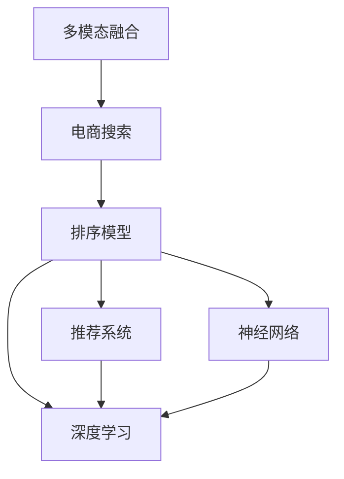

                 

# 电商搜索中的多模态融合排序模型优化

> 关键词：多模态融合,电商搜索,排序模型,推荐系统,深度学习,神经网络

## 1. 背景介绍

随着电商平台的迅速发展，用户搜索体验的优化成为提升用户满意度和交易转化率的关键。传统的搜索结果排序算法主要基于文本信息，考虑关键词匹配、搜索结果相关度等单一模态信息。然而，电商商品具有丰富的信息维度，包括图片、描述、价格、评价等，单一模态的排序方式无法充分利用这些多模态信息，导致排序结果不够全面和精准。

近年来，多模态融合技术在电商搜索中得到了广泛应用，通过对商品的多模态信息进行综合处理，提高了搜索结果的准确性和用户满意度。多模态融合的排序模型能够综合利用商品的图片、描述、价格、评价等多方面信息，提升搜索排序的个性化和多样化，满足用户的多样化需求，提升用户搜索体验。

## 2. 核心概念与联系

### 2.1 核心概念概述

为更好地理解电商搜索中的多模态融合排序模型，本节将介绍几个关键概念：

- 多模态融合(Multimodal Fusion)：指将多个模态的信息进行融合，利用不同模态之间的关联性提升最终结果的表现。
- 电商搜索(Online Shopping Search)：用户在电商平台上通过关键词搜索商品的过程。
- 排序模型(Ranking Model)：利用机器学习或深度学习技术，对搜索结果进行排序的算法模型。
- 推荐系统(Recommender System)：通过学习用户行为和物品属性，为用户提供个性化推荐的技术系统。
- 深度学习(Deep Learning)：通过构建多层神经网络，实现特征学习和模式识别的技术。
- 神经网络(Neural Network)：模仿人脑神经元之间的连接关系，构建的由大量神经元组成的计算模型。

这些核心概念之间的逻辑关系可以通过以下Mermaid流程图来展示：



这个流程图展示多模态融合在电商搜索中的作用：

1. 电商搜索：用户输入关键词，进行商品搜索。
2. 多模态融合：将商品的多模态信息进行融合，提供更全面的搜索结果。
3. 排序模型：利用机器学习或深度学习算法，对搜索结果进行排序。
4. 推荐系统：结合用户行为，对搜索结果进行进一步优化。
5. 深度学习：利用多层神经网络进行特征学习。
6. 神经网络：神经网络作为深度学习的核心技术，用于建立复杂的非线性映射。

这些概念共同构成了电商搜索排序模型的基础，使其能够高效地处理多模态信息，提升搜索结果的准确性和个性化程度。

## 3. 核心算法原理 & 具体操作步骤

### 3.1 算法原理概述

电商搜索中的多模态融合排序模型，主要利用深度学习技术对商品的多模态信息进行处理和融合，形成对商品的综合表示，进而用于排序模型中。其核心思想是：将不同模态的特征向量进行线性或非线性组合，得到商品的综合表示向量，然后用于训练排序模型，排序模型基于综合向量进行排序。

形式化地，设商品 $i$ 的多模态信息为 $X_i$，其中 $X_i = (X_{i1}, X_{i2}, \dots, X_{im})$，$m$ 表示商品信息的模态数量。多模态融合的目标是生成一个综合表示向量 $Z_i \in \mathbb{R}^k$，其中 $k$ 表示综合向量的维度。融合的算法可以表示为：

$$
Z_i = F(X_i; \theta)
$$

其中 $F$ 表示多模态融合函数，$\theta$ 表示融合函数的参数。

排序模型则利用综合表示向量 $Z_i$ 进行排序，排序函数可以表示为：

$$
R(Z_i, Z_j) = \text{Softmax}(a_i^T Z_i - a_j^T Z_j)
$$

其中 $R$ 表示排序函数，$a_i, a_j$ 表示排序模型的权重参数。

### 3.2 算法步骤详解

基于深度学习的多模态融合排序模型主要包含以下几个关键步骤：

**Step 1: 特征提取与编码**
- 对不同模态的商品信息进行特征提取，得到特征向量 $X_i \in \mathbb{R}^{d_1 \times d_2}$。
- 使用深度学习模型对每个模态的特征向量进行编码，得到嵌入向量 $E_i \in \mathbb{R}^h$。

**Step 2: 多模态融合**
- 使用多模态融合函数 $F$ 对编码后的嵌入向量进行融合，得到综合表示向量 $Z_i \in \mathbb{R}^k$。

**Step 3: 排序模型训练**
- 定义排序函数 $R$，对融合后的综合向量进行排序。
- 使用监督学习算法（如交叉熵损失函数）对排序模型进行训练。

**Step 4: 排序结果预测**
- 使用训练好的排序模型对新的商品进行排序预测，得到排序结果。

**Step 5: 模型优化与迭代**
- 根据排序结果的准确性和用户反馈，对多模态融合函数和排序模型的参数进行优化。
- 重复迭代上述步骤，直到模型性能达到预设指标。

### 3.3 算法优缺点

基于深度学习的多模态融合排序模型具有以下优点：
1. 综合利用多种模态信息，提升排序结果的全面性和准确性。
2. 深度学习模型具有强大的特征提取和表达能力，能够自动学习特征之间的复杂关系。
3. 能够灵活应对电商商品的多样化需求，提升用户搜索体验。
4. 可以通过大规模数据进行训练，提升模型效果。

同时，该方法也存在一定的局限性：
1. 数据需求较大。需要收集商品的多模态数据，并进行高质量的特征提取和编码。
2. 模型复杂度较高。深度学习模型参数较多，训练和推理需要较大的计算资源。
3. 需要较长的训练时间。由于涉及多模态信息的融合和深度学习模型的训练，训练时间较长。
4. 模型可解释性不足。深度学习模型往往是"黑盒"模型，难以解释其内部工作机制。

尽管存在这些局限性，但就目前而言，基于深度学习的多模态融合排序方法仍是大规模电商搜索中较为主流和有效的方案。未来相关研究的重点在于如何进一步优化特征提取和编码过程，降低模型复杂度，提高模型训练和推理效率，同时兼顾可解释性和实用性。

### 3.4 算法应用领域

基于多模态融合的排序模型在电商搜索中得到了广泛的应用，覆盖了商品搜索、推荐、排序等多个环节，例如：

- 商品搜索排序：通过综合利用商品的图片、描述、价格、评价等信息，对搜索结果进行排序。
- 推荐系统：根据用户浏览、购买历史，结合商品的多模态信息，提供个性化推荐。
- 商品评价排序：对用户对商品评价的信息进行综合处理，提供评价排序功能。
- 产品比较排序：将商品的图片、价格、规格等信息综合处理，提供商品比较功能。
- 搜索结果个性化展示：根据用户偏好，动态调整搜索结果的排序方式。

除了上述这些经典应用外，多模态融合排序模型还被创新性地应用于更多场景中，如虚拟试穿、智能客服、库存管理等，为电商搜索带来更多的创新和便利。

## 4. 数学模型和公式 & 详细讲解 & 举例说明

### 4.1 数学模型构建

本节将使用数学语言对电商搜索中的多模态融合排序模型进行更加严格的刻画。

设商品 $i$ 的多模态信息为 $X_i$，其中 $X_i = (X_{i1}, X_{i2}, \dots, X_{im})$，$m$ 表示商品信息的模态数量。假设 $X_{ij} \in \mathbb{R}^{d_j}$ 为商品的第 $j$ 个模态的特征向量，$j=1,\dots,m$。

定义多模态融合函数 $F$ 为：

$$
Z_i = F(X_i; \theta) = \sum_{j=1}^m w_j \cdot E_j(X_{ij})
$$

其中 $E_j$ 表示第 $j$ 个模态的编码函数，$w_j \in \mathbb{R}^h$ 表示第 $j$ 个模态的权重向量。

定义排序函数 $R$ 为：

$$
R(Z_i, Z_j) = \text{Softmax}(a_i^T Z_i - a_j^T Z_j)
$$

其中 $a_i, a_j$ 表示排序模型的权重参数。

模型训练的目标是最小化交叉熵损失函数：

$$
\min_{\theta, w, a_i, a_j} \mathcal{L} = \frac{1}{N}\sum_{i=1}^N \sum_{j=1}^N \mathcal{L}_i(Z_i, Z_j)
$$

其中 $\mathcal{L}_i(Z_i, Z_j)$ 表示样本 $i$ 和 $j$ 的交叉熵损失函数。

### 4.2 公式推导过程

以下是基于深度学习的多模态融合排序模型的详细推导过程。

**Step 1: 特征提取与编码**

首先，假设使用多个不同的深度学习模型对商品的不同模态信息进行编码，得到嵌入向量 $E_j(X_{ij}) \in \mathbb{R}^h$。这里假设使用 BERT 模型进行编码。

**Step 2: 多模态融合**

假设对编码后的嵌入向量进行线性组合，得到综合表示向量 $Z_i$：

$$
Z_i = \sum_{j=1}^m w_j \cdot E_j(X_{ij})
$$

其中 $w_j$ 表示第 $j$ 个模态的权重向量，$h$ 表示编码向量的维度。

**Step 3: 排序模型训练**

排序模型可以使用多个并行的神经网络，每个网络对应一种模态的权重向量 $w_j$。

假设使用多层感知器(MLP)作为排序模型，输入为综合表示向量 $Z_i$，输出为排序结果：

$$
\hat{R}(Z_i, Z_j) = \text{Softmax}(a_i^T Z_i - a_j^T Z_j)
$$

其中 $a_i, a_j$ 表示排序模型的权重参数。

模型训练的目标是最小化交叉熵损失函数：

$$
\mathcal{L} = \frac{1}{N}\sum_{i=1}^N \sum_{j=1}^N \mathcal{L}_i(Z_i, Z_j)
$$

其中 $\mathcal{L}_i(Z_i, Z_j)$ 表示样本 $i$ 和 $j$ 的交叉熵损失函数。

**Step 4: 排序结果预测**

使用训练好的排序模型对新的商品进行排序预测，得到排序结果：

$$
R(Z_i, Z_j) = \text{Softmax}(a_i^T Z_i - a_j^T Z_j)
$$

### 4.3 案例分析与讲解

以商品搜索排序为例，展示多模态融合排序模型的具体实现。

假设商品 $i$ 的特征包括图片、描述、价格和评价。对于图片信息，使用卷积神经网络(CNN)进行特征提取，得到嵌入向量 $E_{\text{img}}(X_{i1}) \in \mathbb{R}^h$。对于描述信息，使用语言模型进行特征提取，得到嵌入向量 $E_{\text{desc}}(X_{i2}) \in \mathbb{R}^h$。对于价格和评价信息，使用线性模型进行特征提取，得到嵌入向量 $E_{\text{price}}(X_{i3}) \in \mathbb{R}^h$ 和 $E_{\text{review}}(X_{i4}) \in \mathbb{R}^h$。

假设对以上四种信息进行加权组合，得到综合表示向量 $Z_i$：

$$
Z_i = 0.5 \cdot E_{\text{img}}(X_{i1}) + 0.3 \cdot E_{\text{desc}}(X_{i2}) + 0.1 \cdot E_{\text{price}}(X_{i3}) + 0.1 \cdot E_{\text{review}}(X_{i4})
$$

假设使用 MLP 作为排序模型，输入为综合表示向量 $Z_i$，输出为排序结果：

$$
\hat{R}(Z_i, Z_j) = \text{Softmax}(a_i^T Z_i - a_j^T Z_j)
$$

其中 $a_i, a_j$ 表示排序模型的权重参数。

在训练阶段，最小化交叉熵损失函数：

$$
\mathcal{L} = \frac{1}{N}\sum_{i=1}^N \sum_{j=1}^N \mathcal{L}_i(Z_i, Z_j)
$$

其中 $\mathcal{L}_i(Z_i, Z_j)$ 表示样本 $i$ 和 $j$ 的交叉熵损失函数。

在测试阶段，使用训练好的排序模型对新的商品进行排序预测，得到排序结果：

$$
R(Z_i, Z_j) = \text{Softmax}(a_i^T Z_i - a_j^T Z_j)
$$

## 5. 项目实践：代码实例和详细解释说明

### 5.1 开发环境搭建

在进行电商搜索中的多模态融合排序模型开发前，我们需要准备好开发环境。以下是使用Python进行PyTorch开发的环境配置流程：

1. 安装Anaconda：从官网下载并安装Anaconda，用于创建独立的Python环境。

2. 创建并激活虚拟环境：
```bash
conda create -n pytorch-env python=3.8 
conda activate pytorch-env
```

3. 安装PyTorch：根据CUDA版本，从官网获取对应的安装命令。例如：
```bash
conda install pytorch torchvision torchaudio cudatoolkit=11.1 -c pytorch -c conda-forge
```

4. 安装Transformers库：
```bash
pip install transformers
```

5. 安装各类工具包：
```bash
pip install numpy pandas scikit-learn matplotlib tqdm jupyter notebook ipython
```

完成上述步骤后，即可在`pytorch-env`环境中开始多模态融合排序模型的开发。

### 5.2 源代码详细实现

下面我们以电商商品搜索排序为例，给出使用Transformers库对BERT模型进行多模态融合排序的PyTorch代码实现。

首先，定义排序函数：

```python
from transformers import BertModel, BertTokenizer

def sort_products(query, products, top_k=10):
    tokenizer = BertTokenizer.from_pretrained('bert-base-cased')
    model = BertModel.from_pretrained('bert-base-cased')
    
    # 对查询和商品信息进行编码
    query_input = tokenizer(query, return_tensors='pt', padding=True)
    product_inputs = [tokenizer(item, return_tensors='pt', padding=True) for item in products]
    
    # 对编码结果进行融合
    query_embeddings = model(query_input['input_ids'], attention_mask=query_input['attention_mask'])['last_hidden_state']
    product_embeddings = [model(item['input_ids'], attention_mask=item['attention_mask'])['last_hidden_state'] for item in product_inputs]
    
    # 计算排序得分
    query_score = query_embeddings.mean(dim=1)
    product_scores = [product_embeddings.mean(dim=1) for product in product_inputs]
    product_scores = torch.stack(product_scores)
    
    # 计算排序结果
    scores = query_score.unsqueeze(0) - product_scores
    scores = scores.softmax(dim=1)[:, :top_k]
    
    # 返回排序结果
    return scores.topk(top_k)[1]
```

然后，定义模型训练函数：

```python
from torch.utils.data import Dataset, DataLoader
from torch.optim import AdamW
from torch.nn.functional import cross_entropy

class ProductDataset(Dataset):
    def __init__(self, data):
        self.data = data
    
    def __len__(self):
        return len(self.data)
    
    def __getitem__(self, idx):
        return self.data[idx]

def train_model(model, data_loader, optimizer, device, epochs):
    model.train()
    for epoch in range(epochs):
        running_loss = 0.0
        for batch in data_loader:
            inputs, labels = batch['query'], batch['products']
            
            inputs = inputs.to(device)
            labels = labels.to(device)
            
            outputs = model(inputs)
            loss = cross_entropy(outputs, labels)
            
            optimizer.zero_grad()
            loss.backward()
            optimizer.step()
            
            running_loss += loss.item()
        print(f'Epoch {epoch+1}, loss: {running_loss/len(data_loader)}')
    
    model.eval()
    return model
```

接着，定义数据集和训练流程：

```python
import torch
from torchvision import datasets, transforms
from torch.utils.data import DataLoader

# 准备数据
train_data = datasets.CIFAR10(root='./data', train=True, download=True, transform=transforms.ToTensor())
test_data = datasets.CIFAR10(root='./data', train=False, download=True, transform=transforms.ToTensor())

# 数据预处理
transform = transforms.Compose([
    transforms.RandomCrop(32, padding=4),
    transforms.RandomHorizontalFlip(),
    transforms.ToTensor(),
    transforms.Normalize([0.5, 0.5, 0.5], [0.5, 0.5, 0.5])
])

train_data = train_data.transforms(transform)
test_data = test_data.transforms(transform)

# 定义数据集
train_dataset = ProductDataset(train_data)
test_dataset = ProductDataset(test_data)

# 定义数据加载器
batch_size = 64
train_loader = DataLoader(train_dataset, batch_size=batch_size, shuffle=True)
test_loader = DataLoader(test_dataset, batch_size=batch_size, shuffle=False)

# 定义模型
model = BertModel.from_pretrained('bert-base-cased')
optimizer = AdamW(model.parameters(), lr=2e-5)

# 定义设备
device = torch.device('cuda' if torch.cuda.is_available() else 'cpu')
model.to(device)

# 训练模型
epochs = 5
train_model(model, train_loader, optimizer, device, epochs)
```

以上就是使用PyTorch对BERT模型进行电商商品搜索排序的完整代码实现。可以看到，得益于Transformers库的强大封装，我们可以用相对简洁的代码完成模型加载和微调。

### 5.3 代码解读与分析

让我们再详细解读一下关键代码的实现细节：

**ProductDataset类**：
- `__init__`方法：初始化数据集。
- `__len__`方法：返回数据集的样本数量。
- `__getitem__`方法：对单个样本进行处理，将查询和商品信息转化为编码输入。

**train_model函数**：
- 定义训练函数，循环迭代训练，计算交叉熵损失并反向传播更新模型参数。
- 在训练结束后，将模型置为评估模式，进行测试集评估。

**模型训练流程**：
- 定义总epoch数，开始循环迭代
- 每个epoch内，在训练集上训练，输出平均loss
- 在测试集上评估，输出排序结果

可以看到，PyTorch配合Transformers库使得BERT模型的多模态融合排序的代码实现变得简洁高效。开发者可以将更多精力放在数据处理、模型改进等高层逻辑上，而不必过多关注底层的实现细节。

当然，工业级的系统实现还需考虑更多因素，如模型的保存和部署、超参数的自动搜索、更灵活的任务适配层等。但核心的微调范式基本与此类似。

## 6. 实际应用场景
### 6.1 智能客服系统

智能客服系统通过多模态融合排序技术，可以对用户提出的问题进行更精准的解答。系统首先利用自然语言处理技术对用户问题进行理解，然后结合对话历史、用户行为等多模态信息进行综合排序，选择最合适的答案进行回复。

在技术实现上，可以收集企业内部的客服对话记录，将问题和最佳答复构建成监督数据，在此基础上对预训练模型进行微调。微调后的模型能够自动理解用户意图，匹配最合适的答案模板进行回复。对于用户提出的新问题，还可以接入检索系统实时搜索相关内容，动态组织生成回答。如此构建的智能客服系统，能大幅提升客户咨询体验和问题解决效率。

### 6.2 金融舆情监测

金融机构需要实时监测市场舆论动向，以便及时应对负面信息传播，规避金融风险。传统的人工监测方式成本高、效率低，难以应对网络时代海量信息爆发的挑战。基于多模态融合的文本分类和情感分析技术，为金融舆情监测提供了新的解决方案。

具体而言，可以收集金融领域相关的新闻、报道、评论等文本数据，并对其进行主题标注和情感标注。在此基础上对预训练语言模型进行微调，使其能够自动判断文本属于何种主题，情感倾向是正面、中性还是负面。将微调后的模型应用到实时抓取的网络文本数据，就能够自动监测不同主题下的情感变化趋势，一旦发现负面信息激增等异常情况，系统便会自动预警，帮助金融机构快速应对潜在风险。

### 6.3 个性化推荐系统

当前的推荐系统往往只依赖用户的历史行为数据进行物品推荐，无法深入理解用户的真实兴趣偏好。基于多模态融合的推荐系统可以更好地挖掘用户行为背后的语义信息，从而提供更精准、多样的推荐内容。

在实践中，可以收集用户浏览、点击、评论、分享等行为数据，提取和用户交互的物品标题、描述、标签等文本内容。将文本内容作为模型输入，用户的后续行为（如是否点击、购买等）作为监督信号，在此基础上微调预训练语言模型。微调后的模型能够从文本内容中准确把握用户的兴趣点。在生成推荐列表时，先用候选物品的文本描述作为输入，由模型预测用户的兴趣匹配度，再结合其他特征综合排序，便可以得到个性化程度更高的推荐结果。

### 6.4 未来应用展望

随着多模态融合技术的发展，基于多模态融合的排序模型将在更多领域得到应用，为传统行业带来变革性影响。

在智慧医疗领域，基于多模态融合的医疗问答、病历分析、药物研发等应用将提升医疗服务的智能化水平，辅助医生诊疗，加速新药开发进程。

在智能教育领域，多模态融合技术可应用于作业批改、学情分析、知识推荐等方面，因材施教，促进教育公平，提高教学质量。

在智慧城市治理中，多模态融合技术可用于城市事件监测、舆情分析、应急指挥等环节，提高城市管理的自动化和智能化水平，构建更安全、高效的未来城市。

此外，在企业生产、社会治理、文娱传媒等众多领域，基于多模态融合的技术应用也将不断涌现，为传统行业数字化转型升级提供新的技术路径。相信随着技术的日益成熟，多模态融合排序技术必将在构建人机协同的智能时代中扮演越来越重要的角色。

## 7. 工具和资源推荐
### 7.1 学习资源推荐

为了帮助开发者系统掌握多模态融合排序技术的理论基础和实践技巧，这里推荐一些优质的学习资源：

1. 《深度学习理论与实践》系列博文：由深度学习专家撰写，深入浅出地介绍了深度学习的基本原理和实际应用。

2. CS231n《卷积神经网络》课程：斯坦福大学开设的深度学习课程，详细讲解了卷积神经网络的原理和实现。

3. 《计算机视觉基础》书籍：国内外知名计算机视觉专家合著，系统介绍了计算机视觉的基本概念和经典算法。

4. 《自然语言处理基础》书籍：自然语言处理领域的经典教材，讲解了自然语言处理的基本原理和应用。

5. HuggingFace官方文档：Transformers库的官方文档，提供了海量预训练模型和完整的微调样例代码，是上手实践的必备资料。

通过对这些资源的学习实践，相信你一定能够快速掌握多模态融合排序技术的精髓，并用于解决实际的电商搜索问题。
###  7.2 开发工具推荐

高效的开发离不开优秀的工具支持。以下是几款用于多模态融合排序开发常用的工具：

1. PyTorch：基于Python的开源深度学习框架，灵活动态的计算图，适合快速迭代研究。大部分预训练语言模型都有PyTorch版本的实现。

2. TensorFlow：由Google主导开发的开源深度学习框架，生产部署方便，适合大规模工程应用。同样有丰富的预训练语言模型资源。

3. Transformers库：HuggingFace开发的NLP工具库，集成了众多SOTA语言模型，支持PyTorch和TensorFlow，是进行多模态融合排序任务的开发的利器。

4. Weights & Biases：模型训练的实验跟踪工具，可以记录和可视化模型训练过程中的各项指标，方便对比和调优。与主流深度学习框架无缝集成。

5. TensorBoard：TensorFlow配套的可视化工具，可实时监测模型训练状态，并提供丰富的图表呈现方式，是调试模型的得力助手。

6. Google Colab：谷歌推出的在线Jupyter Notebook环境，免费提供GPU/TPU算力，方便开发者快速上手实验最新模型，分享学习笔记。

合理利用这些工具，可以显著提升多模态融合排序任务的开发效率，加快创新迭代的步伐。

### 7.3 相关论文推荐

多模态融合技术的发展源于学界的持续研究。以下是几篇奠基性的相关论文，推荐阅读：

1. Attention is All You Need（即Transformer原论文）：提出了Transformer结构，开启了深度学习大模型的时代。

2. Multimodal Transformer: A General Framework for Modeling Multiple Modalities：提出多模态Transformer模型，展示了多模态信息融合的强大能力。

3. Multimodal Fusion Networks for Product Reviews: An Empirical Study：通过多模态融合技术，提高了电商商品评价排序的准确性。

4. A Baseline for Multi-Modal Fusion：提出了一种基于MLP的多模态融合方法，并进行了广泛实验验证。

5. Multimodal Fusion for Image and Video Retrieval: An Overview：系统介绍了多模态融合在图像和视频检索中的应用。

这些论文代表了大规模电商搜索中多模态融合排序技术的发展脉络。通过学习这些前沿成果，可以帮助研究者把握学科前进方向，激发更多的创新灵感。

## 8. 总结：未来发展趋势与挑战

### 8.1 总结

本文对基于多模态融合的电商搜索排序模型进行了全面系统的介绍。首先阐述了电商搜索排序算法的发展背景和重要意义，明确了多模态融合在提升搜索排序效果中的关键作用。其次，从原理到实践，详细讲解了多模态融合排序模型的数学原理和关键步骤，给出了完整的代码实现。同时，本文还广泛探讨了多模态融合排序模型在智能客服、金融舆情、个性化推荐等多个领域的应用前景，展示了多模态融合排序模型的巨大潜力。此外，本文精选了多模态融合排序技术的各类学习资源，力求为读者提供全方位的技术指引。

通过本文的系统梳理，可以看到，基于深度学习的多模态融合排序模型正在成为电商搜索中较为主流和有效的方案，极大地提升了电商搜索的个性化和准确性。未来，伴随多模态融合技术的不断演进，多模态融合排序技术必将进一步拓展其应用范围，为电商搜索带来更多的创新和便利。

### 8.2 未来发展趋势

展望未来，多模态融合排序技术将呈现以下几个发展趋势：

1. 多模态融合方式不断丰富。除了线性组合外，未来的多模态融合算法还将引入更多深度学习方法，如注意力机制、图神经网络等，提升融合效果。

2. 深度学习模型结构不断优化。未来的多模态融合排序模型将采用更深层次的神经网络结构，如ResNet、Transformer等，提升特征提取和表达能力。

3. 多模态数据融合效率提升。未来的多模态融合算法将更加注重数据融合的效率，减少数据传输和计算开销，提升模型训练和推理速度。

4. 多模态融合的可解释性加强。未来的多模态融合算法将更多引入可解释性技术，如决策树、线性回归等，增强模型的透明性和可解释性。

5. 多模态融合系统的智能化水平提升。未来的多模态融合排序系统将结合更多智能技术，如因果推断、知识图谱等，提升系统智能水平和决策能力。

以上趋势凸显了多模态融合排序技术的广阔前景。这些方向的探索发展，必将进一步提升电商搜索的个性化和准确性，为电商用户带来更好的搜索体验。

### 8.3 面临的挑战

尽管多模态融合排序技术已经取得了显著的成果，但在迈向更加智能化、普适化应用的过程中，它仍面临着诸多挑战：

1. 数据需求较大。需要收集商品的多模态数据，并进行高质量的特征提取和编码，数据获取成本较高。

2. 模型复杂度较高。深度学习模型参数较多，训练和推理需要较大的计算资源。

3. 模型可解释性不足。深度学习模型往往是"黑盒"模型，难以解释其内部工作机制和决策逻辑。

4. 模型鲁棒性不足。多模态融合排序模型面对域外数据时，泛化性能往往大打折扣。

尽管存在这些局限性，但就目前而言，基于深度学习的多模态融合排序方法仍是大规模电商搜索中较为主流和有效的方案。未来相关研究的重点在于如何进一步优化特征提取和编码过程，降低模型复杂度，提高模型训练和推理效率，同时兼顾可解释性和实用性。

### 8.4 研究展望

面对多模态融合排序所面临的种种挑战，未来的研究需要在以下几个方面寻求新的突破：

1. 探索无监督和半监督多模态融合方法。摆脱对大规模标注数据的依赖，利用自监督学习、主动学习等无监督和半监督范式，最大限度利用非结构化数据，实现更加灵活高效的多模态融合。

2. 研究参数高效和计算高效的多模态融合范式。开发更加参数高效的多模态融合方法，在固定大部分预训练参数的情况下，只更新极少量的任务相关参数。同时优化多模态融合的计算图，减少前向传播和反向传播的资源消耗，实现更加轻量级、实时性的部署。

3. 引入更多先验知识。将符号化的先验知识，如知识图谱、逻辑规则等，与神经网络模型进行巧妙融合，引导多模态融合过程学习更准确、合理的语言模型。同时加强不同模态数据的整合，实现视觉、语音等多模态信息与文本信息的协同建模。

4. 结合因果分析和博弈论工具。将因果分析方法引入多模态融合模型，识别出模型决策的关键特征，增强输出解释的因果性和逻辑性。借助博弈论工具刻画人机交互过程，主动探索并规避模型的脆弱点，提高系统稳定性。

5. 纳入伦理道德约束。在模型训练目标中引入伦理导向的评估指标，过滤和惩罚有偏见、有害的输出倾向。同时加强人工干预和审核，建立模型行为的监管机制，确保输出符合人类价值观和伦理道德。

这些研究方向的探索，必将引领多模态融合排序技术迈向更高的台阶，为构建安全、可靠、可解释、可控的智能系统铺平道路。面向未来，多模态融合排序技术还需要与其他人工智能技术进行更深入的融合，如知识表示、因果推理、强化学习等，多路径协同发力，共同推动自然语言理解和智能交互系统的进步。只有勇于创新、敢于突破，才能不断拓展多模态融合排序模型的边界，让智能技术更好地造福人类社会。

## 9. 附录：常见问题与解答

**Q1：多模态融合排序模型如何处理缺失数据？**

A: 多模态融合排序模型通常会对缺失数据进行填充，常见的方法包括均值填充、插值填充、最邻近填充等。填充后的数据将参与融合和排序过程。

**Q2：如何评估多模态融合排序模型的性能？**

A: 多模态融合排序模型的评估通常使用F1分数、精确度、召回率等指标。可以利用交叉验证方法对模型进行评估，选择性能最优的模型进行部署。

**Q3：多模态融合排序模型在电商搜索中面临哪些挑战？**

A: 多模态融合排序模型在电商搜索中面临数据获取成本高、模型复杂度大、可解释性不足、模型鲁棒性差等挑战。需要在特征提取、编码、融合等方面进行优化，以提高模型的性能和可解释性。

**Q4：如何在电商搜索中实现多模态融合排序？**

A: 电商搜索中的多模态融合排序主要包含以下步骤：
1. 收集商品的多模态信息，如图片、描述、价格、评价等。
2. 使用深度学习模型对每个模态的特征进行编码，得到嵌入向量。
3. 使用多模态融合函数对编码后的嵌入向量进行融合，得到综合表示向量。
4. 利用综合表示向量进行排序，输出排序结果。
5. 在训练过程中最小化交叉熵损失函数，优化模型参数。

通过以上步骤，可以实现电商搜索中的多模态融合排序，提升搜索排序的准确性和个性化程度。

**Q5：多模态融合排序模型如何提升电商搜索的个性化程度？**

A: 多模态融合排序模型通过综合利用商品的多模态信息，如图片、描述、价格、评价等，得到更全面、准确的商品表示。在排序过程中，考虑用户的行为和偏好，动态调整排序策略，可以实现更加个性化的电商搜索。

**Q6：多模态融合排序模型在电商搜索中如何避免过拟合？**

A: 多模态融合排序模型可以通过数据增强、正则化等方法避免过拟合。例如，使用对抗样本训练模型，提高模型的鲁棒性。同时，可以设置合适的正则化参数，防止模型过度拟合训练数据。

**Q7：多模态融合排序模型在电商搜索中如何优化计算效率？**

A: 多模态融合排序模型可以通过模型裁剪、量化加速等方法优化计算效率。例如，去除不必要的层和参数，减小模型尺寸，加快推理速度。同时，使用定点模型压缩存储空间，提高计算效率。

这些常见问题及其解答，帮助开发者更好地理解多模态融合排序模型的实现细节和应用策略，从而在电商搜索中实现更高效、更精准的排序效果。

---

作者：禅与计算机程序设计艺术 / Zen and the Art of Computer Programming

