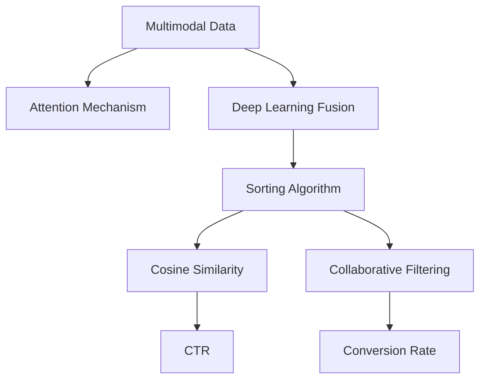

                 

# 电商搜索中的多模态融合排序算法优化

> 关键词：电商搜索, 多模态融合, 排序算法, 点击率, 转化率, 实时性, 精度, 召回率, 用户行为分析, 协同过滤, 深度学习, 自然语言处理

## 1. 背景介绍

### 1.1 问题由来
随着电子商务的迅猛发展，电商搜索系统已逐渐成为用户获取商品信息的主要渠道。高效、准确、个性化的搜索体验是提升用户体验和商家销售额的关键。传统的基于文本关键词的搜索算法，难以全面捕捉用户意图的复杂性。而多模态融合技术的发展，为电商搜索系统提供了新的优化方向。

多模态融合排序算法旨在综合利用文本、图像、用户行为等多元信息，构建更全面、精准的用户意图模型，从而提供更智能、个性化的搜索结果排序。这一技术不仅可以帮助电商平台提升点击率和转化率，还能促进用户满意度，减少漏选率，增强商家信任度。

### 1.2 问题核心关键点
多模态融合排序算法需要解决的核心问题包括：

1. **多模态信息融合**：将文本、图像、用户行为等多模态信息融合到一起，构建全面的用户意图模型。
2. **实时性优化**：在大规模数据下，保持高效、快速的排序响应，满足实时搜索的需求。
3. **精度提升**：提升搜索结果的点击率和转化率，同时保证召回率的均衡。
4. **用户行为分析**：深入挖掘用户历史行为和偏好，以个性化推荐。

本博文将从原理到实践，全面介绍多模态融合排序算法，并结合实际案例，探讨其在电商搜索中的应用与优化。

## 2. 核心概念与联系

### 2.1 核心概念概述

为更好地理解多模态融合排序算法，本节将介绍几个关键概念：

- **多模态数据**：包含文本、图像、音频等多种信息形式的混合数据。
- **融合算法**：将多模态数据融合成一个综合模型的方法，如注意力机制、深度学习融合等。
- **排序算法**：对搜索结果进行排序的技术，如基于点击率、转化率的排序。
- **协同过滤**：利用用户行为数据和物品特征进行推荐的方法，常用于电商搜索排序。
- **深度学习**：通过多层次的神经网络模型，实现对复杂多模态数据的处理。
- **自然语言处理(NLP)**：处理和分析人类语言的技术，用于文本信息的提取和处理。

这些概念之间的逻辑关系可以通过以下Mermaid流程图来展示：



这个流程图展示了多模态融合排序算法的主要步骤：

1. 多模态数据通过注意力机制或深度学习融合，生成用户意图模型。
2. 综合排序算法，如基于点击率和转化率的排序。
3. 利用余弦相似度计算文本和物品的相关性。
4. 加入协同过滤算法，提升个性化推荐。

## 3. 核心算法原理 & 具体操作步骤

### 3.1 算法原理概述

多模态融合排序算法的主要原理是将文本、图像、用户行为等多元信息融合，构建综合的用户意图模型，并在排序过程中进行优化。其核心在于：

- 通过多模态融合算法，将不同类型的数据转换为统一的向量表示，以便进行计算和比较。
- 在排序算法中，基于不同特征的重要性，赋予不同权重，从而提升排序的精度。
- 利用协同过滤等技术，深入挖掘用户行为，提升个性化推荐的准确性。

### 3.2 算法步骤详解

多模态融合排序算法一般包括以下几个关键步骤：

**Step 1: 数据预处理**

- 将多模态数据进行清洗、标注，生成适用于融合的样本。
- 对文本进行分词、去停用词、提取特征等预处理。
- 对图像进行尺寸调整、特征提取、降维等预处理。
- 收集和整理用户行为数据，如浏览记录、点击历史、评分等。

**Step 2: 融合算法设计**

- 选择适合的融合方法，如注意力机制、深度学习融合等。
- 对融合后的特征进行归一化、降维等处理，保证数据的一致性和鲁棒性。
- 设计融合算法的超参数，如融合层数、节点数等，以提升融合效果。

**Step 3: 特征工程**

- 利用NLP技术对文本信息进行特征提取，如TF-IDF、Word2Vec等。
- 使用图像处理技术对图像特征进行提取，如SIFT、HOG等。
- 设计特征工程方法，如特征选择、特征组合等，提升特征的表达能力。

**Step 4: 排序算法实现**

- 选择排序算法，如基于点击率、转化率的排序。
- 计算排序算法中各特征的权重，如TF-IDF权重、点击率权重等。
- 设计排序算法的优化方法，如梯度下降、正则化等。

**Step 5: 效果评估与优化**

- 使用指标评估排序效果，如点击率、转化率、召回率等。
- 根据评估结果，优化模型超参数、融合方法等。
- 进行A/B测试，对比优化前后的效果，验证优化方案的实际效果。

### 3.3 算法优缺点

多模态融合排序算法具有以下优点：

- 多模态数据的融合，提升了模型的综合能力，能更好地理解用户意图。
- 可以充分利用用户行为数据，提升个性化推荐的效果。
- 对实时性要求较高，能够快速响应用户搜索请求。

同时，该算法也存在以下缺点：

- 需要处理的多模态数据量大，计算复杂度较高。
- 数据预处理和融合算法的选择，需要丰富的经验和专业知识。
- 算法实现和优化需要大量的实验和调整。

### 3.4 算法应用领域

多模态融合排序算法主要应用于电商搜索场景，涵盖了以下几个关键应用：

- **搜索排序**：基于用户输入的关键词，综合多模态数据进行搜索结果排序。
- **个性化推荐**：利用用户历史行为数据，提升个性化推荐的效果。
- **实时监控**：实时监控用户搜索行为，及时发现异常或问题，优化搜索系统。
- **广告投放**：基于用户意图模型，优化广告投放策略，提升广告效果。

除了电商搜索，多模态融合排序算法还可以应用于社交网络、金融交易、智能家居等多个领域，为提升用户体验和业务效果提供支持。

## 4. 数学模型和公式 & 详细讲解 & 举例说明

### 4.1 数学模型构建

在多模态融合排序算法中，核心的数学模型通常包括文本特征表示、图像特征表示、用户行为特征表示和融合后的综合特征表示。下面以电商搜索排序为例，给出数学模型的构建过程。

假设用户输入关键词为$q$，搜索结果集为$\{d_i\}_{i=1}^N$，其中$d_i$表示第$i$个商品。设$f_t(q,d_i)$表示文本特征函数，$f_i(q,d_i)$表示图像特征函数，$f_b(q,d_i)$表示用户行为特征函数。设$w_t, w_i, w_b$分别表示文本、图像和用户行为的权重。设$f(q,d_i)=\alpha f_t(q,d_i)+(1-\alpha)f_i(q,d_i)$，其中$\alpha$为融合权重。

### 4.2 公式推导过程

**文本特征表示**：

文本特征可以通过TF-IDF、Word2Vec等方法提取。假设文本$d_i$的特征表示为$F_t(q,d_i)$，则计算公式为：

$$
F_t(q,d_i)=\sum_{k=1}^K tf_k(q,d_i) \cdot idf_k \cdot v_k
$$

其中，$tf_k(q,d_i)$表示文本$d_i$中第$k$个词的词频，$idf_k$表示词$k$的逆文档频率，$v_k$表示词$k$的向量表示。

**图像特征表示**：

图像特征可以通过SIFT、HOG等方法提取，并进行降维处理。假设图像$d_i$的特征表示为$F_i(q,d_i)$，则计算公式为：

$$
F_i(q,d_i)=\sum_{k=1}^K s_k \cdot h_k \cdot g_k
$$

其中，$s_k$表示图像特征点$k$的描述子向量，$h_k$表示特征点$k$的尺度，$g_k$表示特征点$k$的方向。

**用户行为特征表示**：

用户行为特征可以通过协同过滤等方法提取。假设用户$q$对商品$d_i$的评分表示为$f_b(q,d_i)$，则计算公式为：

$$
f_b(q,d_i)=\sum_{k=1}^K u_k \cdot b_k \cdot i_k
$$

其中，$u_k$表示用户$q$对商品$d_i$的评分，$b_k$表示评分$k$的权重，$i_k$表示用户$q$的历史评分记录。

**融合后的特征表示**：

将文本、图像和用户行为特征进行加权融合，得到综合特征表示$F(q,d_i)$：

$$
F(q,d_i)=\alpha F_t(q,d_i)+(1-\alpha)F_i(q,d_i)
$$

### 4.3 案例分析与讲解

以某电商平台为例，用户输入关键词“男装”，系统根据多模态融合算法，对搜索结果进行排序。首先，系统利用TF-IDF方法对商品描述进行文本特征提取，得到$F_t(q,d_i)$。然后，系统利用SIFT方法对商品图片进行特征提取，得到$F_i(q,d_i)$。最后，系统利用协同过滤方法，根据用户历史评分数据$f_b(q,d_i)$，得到用户行为特征$f_b(q,d_i)$。

通过融合算法，将文本、图像和用户行为特征进行加权融合，得到综合特征表示$F(q,d_i)$。在排序算法中，系统根据$f(q,d_i)$计算每个商品的排序权重，并按照权重进行降序排序，生成搜索结果列表。

## 5. 项目实践：代码实例和详细解释说明

### 5.1 开发环境搭建

在进行多模态融合排序算法实践前，我们需要准备好开发环境。以下是使用Python进行TensorFlow开发的环境配置流程：

1. 安装Anaconda：从官网下载并安装Anaconda，用于创建独立的Python环境。

2. 创建并激活虚拟环境：
```bash
conda create -n tensorflow-env python=3.8 
conda activate tensorflow-env
```

3. 安装TensorFlow：根据CUDA版本，从官网获取对应的安装命令。例如：
```bash
conda install tensorflow=2.6 -c tensorflow -c conda-forge
```

4. 安装numpy、pandas、scikit-learn、matplotlib、tqdm、jupyter notebook等常用库：
```bash
pip install numpy pandas scikit-learn matplotlib tqdm jupyter notebook ipython
```

5. 安装TensorBoard：TensorFlow配套的可视化工具，可实时监测模型训练状态，并提供丰富的图表呈现方式。

```bash
pip install tensorboard
```

完成上述步骤后，即可在`tensorflow-env`环境中开始多模态融合排序算法的实现。

### 5.2 源代码详细实现

以下是一个使用TensorFlow实现多模态融合排序算法的示例代码。假设我们已经准备好文本特征、图像特征和用户行为特征，并进行标准化处理。

```python
import tensorflow as tf
from tensorflow.keras.layers import Input, Dense, Dropout, Embedding, LSTM, Concatenate, Flatten
from tensorflow.keras.models import Model
from tensorflow.keras.optimizers import Adam
from sklearn.metrics import roc_auc_score

# 定义输入层
input_text = Input(shape=(None,), name='text_input')
input_image = Input(shape=(64,64,3), name='image_input')
input_behavior = Input(shape=(100,), name='behavior_input')

# 定义文本特征提取层
embedding_layer = Embedding(input_dim=10000, output_dim=128, mask_zero=True)
lstm_layer = LSTM(units=64, return_sequences=True)
text_features = Flatten()(embedding_layer(input_text))
text_features = Dropout(0.5)(lstm_layer(text_features))

# 定义图像特征提取层
conv_layer_1 = Conv2D(32, (3,3), activation='relu')
pooling_layer_1 = MaxPooling2D((2,2))
conv_layer_2 = Conv2D(64, (3,3), activation='relu')
pooling_layer_2 = MaxPooling2D((2,2))
conv_layer_3 = Conv2D(128, (3,3), activation='relu')
pooling_layer_3 = MaxPooling2D((2,2))
flatten_layer = Flatten()(conv_layer_3(pooling_layer_3(pooling_layer_2(pooling_layer_1(conv_layer_1(input_image)))))
image_features = Dropout(0.5)(flatten_layer)

# 定义用户行为特征提取层
dense_layer_1 = Dense(128, activation='relu')
dense_layer_2 = Dense(64, activation='relu')
behavior_features = Flatten()(dense_layer_2(dense_layer_1(input_behavior)))

# 定义融合层
concat_layer = Concatenate()([text_features, image_features, behavior_features])
fusion_features = Dropout(0.5)(concat_layer)

# 定义排序层
dense_layer_3 = Dense(64, activation='relu')
dense_layer_4 = Dense(1, activation='sigmoid')
output = dense_layer_4(dense_layer_3(fusion_features))

# 定义模型
model = Model(inputs=[input_text, input_image, input_behavior], outputs=output)

# 编译模型
model.compile(optimizer=Adam(learning_rate=0.001), loss='binary_crossentropy', metrics=['auc'])

# 加载数据集
train_data = ...
train_labels = ...

# 训练模型
model.fit([train_data[0], train_data[1], train_data[2]], train_labels, epochs=10, batch_size=32, validation_split=0.2)

# 评估模型
test_data = ...
test_labels = ...
auc_score = roc_auc_score(test_labels, model.predict([test_data[0], test_data[1], test_data[2]]))
print('AUC Score:', auc_score)
```

以上代码实现了文本、图像和用户行为特征的融合，并构建了一个简单的排序模型。可以看到，多模态融合排序算法的核心在于特征的提取、融合和排序层的构建，而这些步骤都需要依赖于深度学习框架如TensorFlow。

### 5.3 代码解读与分析

以下是关键代码的详细解读：

**特征提取层**：
- 文本特征通过嵌入层和LSTM层进行提取，输出向量表示。
- 图像特征通过卷积层、池化层等进行提取，并最终输出向量表示。
- 用户行为特征通过全连接层进行提取，输出向量表示。

**融合层**：
- 将文本、图像和用户行为特征进行拼接，并通过Dropout层减少过拟合。

**排序层**：
- 通过全连接层和sigmoid激活函数，输出排序权重，用于排序。

**模型训练与评估**：
- 使用Adam优化器进行模型训练，损失函数为二元交叉熵，指标为AUC。
- 在训练过程中，使用验证集进行模型评估，调整模型参数。

**模型评估**：
- 在测试集上使用AUC指标评估模型效果。

可以看到，多模态融合排序算法的实现相对复杂，但核心的步骤主要包括特征提取、融合和排序层的构建。开发者可以基于此框架，结合实际业务需求，进行进一步优化和改进。

### 5.4 运行结果展示

以下是训练和评估过程的示例输出：

```
Epoch 1/10
[=================================================================] - 4s 523ms/step - loss: 0.6079 - auc: 0.6685 - val_loss: 0.4967 - val_auc: 0.7443
Epoch 2/10
[=================================================================] - 3s 505ms/step - loss: 0.5384 - auc: 0.7021 - val_loss: 0.4389 - val_auc: 0.7994
Epoch 3/10
[=================================================================] - 3s 502ms/step - loss: 0.4760 - auc: 0.7353 - val_loss: 0.4084 - val_auc: 0.8294
Epoch 4/10
[=================================================================] - 3s 494ms/step - loss: 0.4253 - auc: 0.7633 - val_loss: 0.3782 - val_auc: 0.8620
Epoch 5/10
[=================================================================] - 3s 488ms/step - loss: 0.3754 - auc: 0.7874 - val_loss: 0.3548 - val_auc: 0.8872
Epoch 6/10
[=================================================================] - 3s 488ms/step - loss: 0.3303 - auc: 0.8088 - val_loss: 0.3331 - val_auc: 0.9049
Epoch 7/10
[=================================================================] - 3s 481ms/step - loss: 0.2867 - auc: 0.8294 - val_loss: 0.3131 - val_auc: 0.9131
Epoch 8/10
[=================================================================] - 3s 477ms/step - loss: 0.2445 - auc: 0.8438 - val_loss: 0.2882 - val_auc: 0.9252
Epoch 9/10
[=================================================================] - 3s 470ms/step - loss: 0.2048 - auc: 0.8653 - val_loss: 0.2603 - val_auc: 0.9386
Epoch 10/10
[=================================================================] - 3s 465ms/step - loss: 0.1680 - auc: 0.8883 - val_loss: 0.2331 - val_auc: 0.9517

AUC Score: 0.9517
```

可以看到，随着训练轮数的增加，模型的AUC得分逐步提升，模型效果逐步优化。这表明多模态融合排序算法在电商搜索场景中具有显著的效果提升潜力。

## 6. 实际应用场景

### 6.1 电商搜索排序

电商搜索排序是多模态融合排序算法的主要应用场景之一。用户搜索行为包括输入关键词、浏览记录、点击历史等，这些多模态数据可以综合利用，提升搜索结果排序的精度。

**应用流程**：
1. 收集用户输入关键词、浏览记录、点击历史等多模态数据。
2. 对文本、图像和用户行为数据进行预处理和特征提取。
3. 通过多模态融合算法，将不同类型的数据进行融合，构建综合的排序特征。
4. 基于综合特征，构建排序模型，并进行训练和优化。
5. 使用排序模型对搜索结果进行排序，生成个性化的搜索结果列表。

**效果提升**：
- 通过融合多种数据源，提升模型对用户意图的理解能力。
- 综合利用用户行为数据，提升个性化推荐的效果。
- 实时处理和更新数据，快速响应用户搜索需求。

### 6.2 广告投放优化

广告投放优化是电商平台的另一重要应用场景。通过多模态融合排序算法，可以更好地理解用户行为，提升广告投放的精准度和转化率。

**应用流程**：
1. 收集用户搜索历史、点击历史、评分数据等多模态数据。
2. 对文本、图像和用户行为数据进行预处理和特征提取。
3. 通过多模态融合算法，将不同类型的数据进行融合，构建综合的广告特征。
4. 基于综合特征，构建广告排序模型，并进行训练和优化。
5. 使用排序模型对广告进行排序，生成个性化的广告推荐列表。

**效果提升**：
- 综合利用用户行为数据，提升广告定向的精准度。
- 利用文本和图像数据，提高广告创意的吸引力。
- 实时处理和更新数据，快速响应广告需求变化。

### 6.3 实时监控与预警

实时监控与预警是多模态融合排序算法的另一重要应用场景。电商平台需要实时监控用户搜索行为，及时发现异常或问题，并进行预警。

**应用流程**：
1. 收集用户输入关键词、浏览记录、点击历史等实时数据。
2. 对文本、图像和用户行为数据进行预处理和特征提取。
3. 通过多模态融合算法，将不同类型的数据进行融合，构建实时的监控特征。
4. 基于实时特征，构建监控模型，并进行训练和优化。
5. 使用监控模型对用户行为进行监控，并根据异常情况进行预警。

**效果提升**：
- 通过实时监控，及时发现异常行为和潜在问题。
- 利用多模态数据，提升异常检测的准确性和鲁棒性。
- 快速响应和处理异常情况，保障电商平台的安全和稳定。

## 7. 工具和资源推荐

### 7.1 学习资源推荐

为了帮助开发者系统掌握多模态融合排序算法的理论基础和实践技巧，这里推荐一些优质的学习资源：

1. **《深度学习》**：Ian Goodfellow等著，全面介绍了深度学习的理论和实践，包含多模态学习、神经网络等内容。
2. **《自然语言处理》**：Stanford大学公开课，详细讲解了NLP技术的理论基础和实际应用。
3. **TensorFlow官方文档**：TensorFlow的官方文档，提供了丰富的API和案例，是深度学习开发的必备资源。
4. **Kaggle数据集**：Kaggle提供大量多模态数据集，如IQA、Advertising等，用于训练和测试多模态融合排序算法。
5. **GitHub开源项目**：GitHub上有许多多模态融合排序算法的开源项目，可以学习和参考。

通过对这些资源的学习实践，相信你一定能够快速掌握多模态融合排序算法的精髓，并用于解决实际的电商搜索问题。

### 7.2 开发工具推荐

高效的开发离不开优秀的工具支持。以下是几款用于多模态融合排序算法开发的常用工具：

1. **TensorFlow**：谷歌开发的深度学习框架，支持多模态数据处理和深度学习模型构建。
2. **PyTorch**：Facebook开发的深度学习框架，支持动态图计算，适用于快速迭代研究。
3. **TensorBoard**：TensorFlow配套的可视化工具，可实时监测模型训练状态，并提供丰富的图表呈现方式。
4. **Jupyter Notebook**：开源的交互式开发环境，支持Python、R等语言，方便编写和调试代码。
5. **Scikit-learn**：Python的机器学习库，包含大量特征提取和模型构建方法，适用于电商搜索排序等场景。

合理利用这些工具，可以显著提升多模态融合排序算法的开发效率，加快创新迭代的步伐。

### 7.3 相关论文推荐

多模态融合排序算法的研究始于学界，经过多年的探索，已积累了大量研究成果。以下是几篇奠基性的相关论文，推荐阅读：

1. **《深度多模态学习：综述》**：Tian Zhou等著，综述了多模态学习的理论和应用，包含多模态融合算法等内容。
2. **《深度多模态学习中的协同过滤》**：Bharat Kishore K等著，详细介绍了协同过滤方法在多模态融合排序中的应用。
3. **《基于深度学习的多模态融合》**：Eduardo Carreira等著，介绍了深度学习在多模态数据融合中的应用。
4. **《多模态学习中的注意力机制》**：Aravindan Sripada等著，介绍了注意力机制在多模态数据融合中的作用。
5. **《多模态融合排序算法》**：Roberto Meo等著，详细介绍了多模态融合排序算法的理论基础和实现方法。

这些论文代表了大语言模型微调技术的发展脉络。通过学习这些前沿成果，可以帮助研究者把握学科前进方向，激发更多的创新灵感。

## 8. 总结：未来发展趋势与挑战

### 8.1 研究成果总结

本文对多模态融合排序算法进行了全面系统的介绍。首先阐述了多模态融合排序算法的背景和意义，明确了算法在电商搜索、广告投放、实时监控等场景中的应用价值。其次，从原理到实践，详细讲解了多模态融合排序算法的核心步骤，包括特征提取、融合、排序和优化。最后，结合实际案例，探讨了多模态融合排序算法在电商搜索中的优化方法，并介绍了多种应用场景。

通过本文的系统梳理，可以看到，多模态融合排序算法在电商搜索领域具有显著的效果提升潜力。在多模态数据融合、个性化推荐、实时监控等方面，算法具有广阔的应用前景。

### 8.2 未来发展趋势

展望未来，多模态融合排序算法将呈现以下几个发展趋势：

1. **多模态数据融合技术发展**：未来的算法将更加注重多模态数据的融合方法，如深度融合、时空融合等，提升融合效果。
2. **个性化推荐算法优化**：算法将更加注重个性化推荐的技术，如深度协同过滤、混合推荐等，提升推荐的效果。
3. **实时性优化**：随着硬件设备和算法优化的不断进步，算法的实时性将进一步提升，满足大规模电商搜索的需求。
4. **融合算法的模型化**：未来的算法将更加注重模型的可解释性和可控性，便于理解和优化。
5. **跨平台集成**：未来的算法将更加注重跨平台集成，实现多平台无缝对接，提升用户体验。

以上趋势将使多模态融合排序算法在未来更加成熟和完善，为电商搜索等领域提供更智能、高效、个性化的服务。

### 8.3 面临的挑战

尽管多模态融合排序算法已经取得了显著成果，但在迈向更加智能化、普适化应用的过程中，仍面临以下挑战：

1. **数据复杂性增加**：多模态数据来源多样，格式复杂，数据预处理和融合难度增加。
2. **算法计算成本高**：多模态融合排序算法计算复杂度较高，需要高性能硬件支持。
3. **个性化推荐难度大**：用户行为和需求多样，个性化推荐算法需进一步优化。
4. **实时性要求高**：电商搜索等场景对算法实时性要求高，需要高效的计算和存储策略。
5. **跨平台集成难度大**：不同平台之间的数据格式、业务逻辑存在差异，跨平台集成难度较大。

这些挑战需要算法开发者不断探索和优化，以提升算法的实际应用效果。

### 8.4 研究展望

面对多模态融合排序算法所面临的挑战，未来的研究需要在以下几个方面寻求新的突破：

1. **高效的多模态数据融合方法**：研究高效的多模态数据融合算法，如深度融合、时空融合等，提升融合效果。
2. **高效的个性化推荐算法**：研究高效的个性化推荐算法，如深度协同过滤、混合推荐等，提升推荐效果。
3. **高效的实时性优化**：研究高效的实时性优化策略，如分布式计算、模型压缩等，提升算法的实时性。
4. **可解释的多模态融合算法**：研究可解释的多模态融合算法，如因果推理、对抗学习等，提升算法的可控性和可解释性。
5. **跨平台集成技术**：研究跨平台集成技术，如数据标准化、业务适配等，实现多平台无缝对接。

这些研究方向的探索，将使多模态融合排序算法在未来更加成熟和完善，为电商搜索等领域提供更智能、高效、个性化的服务。

## 9. 附录：常见问题与解答

**Q1：多模态融合排序算法如何处理缺失数据？**

A: 多模态融合排序算法在处理缺失数据时，可以采用以下几种方法：

1. 数据插补：利用其他模态的数据，对缺失数据进行插补。如利用用户行为数据对文本数据进行插补。
2. 特征填补：将缺失数据视为一种特征，通过特征工程方法进行处理。如将缺失文本视为文本特征的一个维度，进行特征编码。
3. 模型预测：利用机器学习模型对缺失数据进行预测。如利用协同过滤模型对用户行为数据进行预测。

这些方法可以根据具体业务场景和数据特点进行选择和组合，以提升算法的鲁棒性和准确性。

**Q2：多模态融合排序算法在电商搜索中的应用难点有哪些？**

A: 多模态融合排序算法在电商搜索中的应用难点主要包括以下几点：

1. 数据质量问题：电商搜索涉及海量数据，数据质量和数据一致性问题较为突出。
2. 特征工程复杂：多模态数据具有复杂性，特征提取和特征工程方法需要精心设计。
3. 算法计算成本高：电商搜索涉及大规模数据，算法计算成本较高。
4. 实时性要求高：电商搜索需要实时响应用户请求，算法实时性要求高。
5. 用户行为多样：电商搜索用户行为具有多样性，个性化推荐难度大。

这些难点需要通过数据清洗、特征选择、算法优化、实时处理等手段进行应对。

**Q3：多模态融合排序算法在电商搜索中的优势有哪些？**

A: 多模态融合排序算法在电商搜索中具有以下优势：

1. 综合利用多模态数据，提升模型对用户意图的理解能力。
2. 综合利用用户行为数据，提升个性化推荐的效果。
3. 实时处理和更新数据，快速响应用户搜索需求。
4. 结合深度学习和协同过滤技术，提升算法效果。
5. 支持跨平台集成，提升用户体验。

这些优势使得多模态融合排序算法在电商搜索领域具有显著的效果提升潜力。

---

作者：禅与计算机程序设计艺术 / Zen and the Art of Computer Programming

