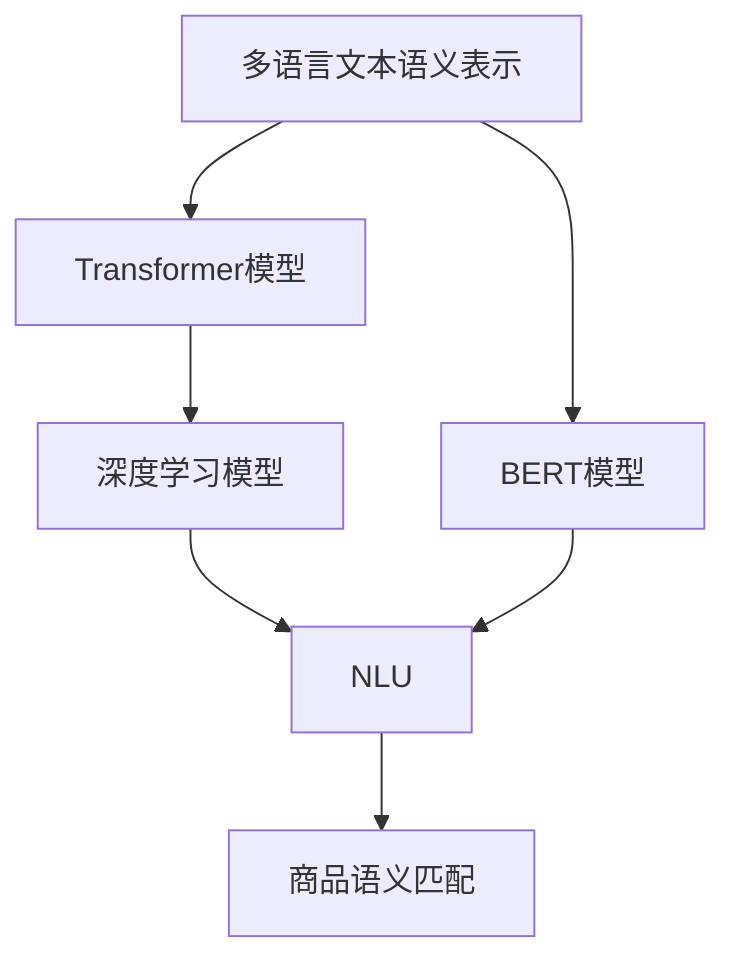

                 

# 电商搜索中的多语言商品语义匹配技术

> 关键词：多语言搜索, 商品语义匹配, 自然语言处理(NLP), 深度学习, 搜索引擎优化(SEO), 自然语言理解(NLU), 机器学习(ML)

## 1. 背景介绍

### 1.1 问题由来

随着全球化的不断加深，跨境电商市场的崛起为消费者提供了更多选择的同时，也带来了新的挑战。不同国家和地区有各自的语言和文化，消费者在使用电商搜索时，常常面临语言障碍，导致信息检索效率低下。同时，电商平台上商品种类繁多，使用自然语言描述商品信息，容易导致语义理解歧义，从而影响搜索结果的准确性。

针对这一问题，我们需要提出一种多语言商品语义匹配技术，通过自然语言处理(NLP)和深度学习模型，对不同语言的商品描述进行语义分析，准确匹配消费者查询和商品信息，从而提高电商搜索的效率和准确性。

### 1.2 问题核心关键点

为解决这一问题，关键点在于：
- 多语言文本的语义表示：通过模型将不同语言的商品描述转化为语义向量，消除语言障碍，实现跨语言的语义匹配。
- 深度学习模型的选择：选择适合的深度学习模型，如Transformer、BERT等，进行商品描述的语义匹配。
- 商品语义匹配的优化：通过优化模型参数，提高模型在不同语言环境下对商品描述的语义匹配能力。
- 大规模数据集的构建：构建大规模多语言商品语料库，为模型的训练和优化提供充足的数据支持。

## 2. 核心概念与联系

### 2.1 核心概念概述

为更好地理解电商搜索中的多语言商品语义匹配技术，本节将介绍几个密切相关的核心概念：

- **多语言文本语义表示**：将不同语言的文本转化为统一的语义向量表示，通过深度学习模型进行语义匹配。
- **Transformer模型**：基于注意力机制的深度学习模型，广泛应用于自然语言处理领域，特别适合处理长序列输入。
- **BERT模型**：预训练语言模型，通过大规模无标签文本数据的自监督训练，学习到丰富的语言知识，可用于商品语义匹配。
- **深度学习模型**：基于神经网络的一系列模型，通过多层非线性变换提取高层次特征，广泛用于分类、匹配等任务。
- **自然语言理解(NLU)**：将自然语言转化为计算机可处理的形式，用于机器理解人类语言，是商品语义匹配的基础。

这些核心概念之间的逻辑关系可以通过以下Mermaid流程图来展示：



这个流程图展示了大语言模型在电商搜索中的核心概念及其之间的关系：

1. 多语言文本通过Transformer模型和BERT模型转化为语义向量。
2. 深度学习模型进一步对语义向量进行匹配，并应用于商品匹配任务。
3. NLU技术用于语义理解，将自然语言转化为计算机可处理的形式。

这些概念共同构成了电商搜索中多语言商品语义匹配技术的框架，使其能够在多语言环境下实现高效的语义匹配。

## 3. 核心算法原理 & 具体操作步骤
### 3.1 算法原理概述

电商搜索中的多语言商品语义匹配技术主要基于自然语言处理(NLP)和深度学习模型，通过将多语言文本转化为语义向量，进行语义匹配。其核心思想是：将电商商品描述信息转化为语义向量表示，通过深度学习模型，实现不同语言环境下对商品语义的匹配。

形式化地，假设电商平台有商品集合 $C=\{c_1, c_2, \ldots, c_N\}$，每个商品描述为 $d_i \in \mathcal{L}_i$，其中 $\mathcal{L}_i$ 为商品描述的语言集合。我们的目标是构建一个语义匹配函数 $f: \mathcal{L} \rightarrow \mathcal{L}$，使得 $f(d_i) = \hat{d}_i$，其中 $\hat{d}_i$ 为商品描述 $d_i$ 的语义向量表示。

### 3.2 算法步骤详解

电商搜索中的多语言商品语义匹配算法主要包括以下几个关键步骤：

**Step 1: 数据预处理与文本编码**

- 收集不同语言的商品描述数据集，构建多语言商品语料库 $D=\{(d_i, l_i)\}_{i=1}^N$，其中 $d_i$ 为商品描述文本，$l_i$ 为文本语言标签。
- 使用Transformer模型或BERT模型对文本进行编码，得到语义向量表示 $v_i \in \mathbb{R}^d$。

**Step 2: 模型选择与训练**

- 选择合适的深度学习模型（如Transformer、BERT等），对商品描述语义向量 $v_i$ 进行训练，学习语义匹配函数 $f$。
- 在训练过程中，使用语言标签 $l_i$ 对语义向量进行标注，优化模型参数，最小化损失函数 $L$。

**Step 3: 模型评估与优化**

- 在测试集上评估模型性能，计算准确率、召回率、F1值等指标。
- 根据评估结果，调整模型超参数，优化模型结构，进一步提高匹配效果。

**Step 4: 实际应用**

- 将训练好的模型应用到电商搜索系统中，将用户查询输入模型，转化为语义向量表示。
- 将商品描述的语义向量与用户查询进行匹配，返回最相关的商品列表。

### 3.3 算法优缺点

电商搜索中的多语言商品语义匹配算法具有以下优点：
1. 跨语言匹配：通过语义向量表示，实现不同语言环境下对商品描述的语义匹配，打破语言障碍。
2. 高效性：使用Transformer和BERT等深度学习模型，在大规模数据集上训练，提升语义匹配的准确性和效率。
3. 鲁棒性：深度学习模型具备较强的泛化能力，能够应对不同语言环境下语义的多样性和变化。
4. 可扩展性：模型可以通过在线学习和增量更新，不断适应新商品和语言环境的加入。

同时，该算法也存在一些局限性：
1. 数据依赖：模型训练和优化依赖大量高质量的多语言商品语料库，数据获取和标注成本较高。
2. 语义歧义：多语言环境下的语义表达复杂多样，模型可能无法准确理解商品描述中的微妙语义差异。
3. 计算资源：训练深度学习模型需要大量计算资源，模型推理也可能面临计算瓶颈。
4. 可解释性：深度学习模型的黑盒性质，导致其决策过程难以解释，用户难以理解和信任。

尽管存在这些局限性，但基于深度学习的多语言商品语义匹配算法仍是一种高效、可扩展的解决方案，能够在电商搜索中实现高质量的商品匹配。

### 3.4 算法应用领域

基于多语言商品语义匹配的技术，可以应用于以下几个领域：

- **跨境电商**：不同语言和文化背景的消费者搜索商品时，通过语义匹配技术，实现跨语言的精准检索，提升用户体验。
- **商品推荐**：通过匹配用户查询和商品描述，推荐最相关的商品，提升购物体验和销售转化率。
- **语言翻译**：将商品描述和用户查询进行跨语言翻译，帮助不会说英语的用户找到满意的商品。
- **搜索优化**：通过语义匹配技术，优化搜索引擎算法，提高搜索结果的相关性和排名。
- **客服支持**：实时回答多语言用户的问题，提升客户服务效率。

除了这些领域外，多语言商品语义匹配技术还可以用于其他语言相关的应用场景，如旅游、教育、媒体等，为语言障碍用户提供更好的服务体验。

## 4. 数学模型和公式 & 详细讲解 & 举例说明
### 4.1 数学模型构建

假设电商平台有商品集合 $C=\{c_1, c_2, \ldots, c_N\}$，每个商品描述为 $d_i \in \mathcal{L}_i$，其中 $\mathcal{L}_i$ 为商品描述的语言集合。我们的目标是构建一个语义匹配函数 $f: \mathcal{L} \rightarrow \mathcal{L}$，使得 $f(d_i) = \hat{d}_i$，其中 $\hat{d}_i$ 为商品描述 $d_i$ 的语义向量表示。

首先，我们需要将商品描述 $d_i$ 转化为语义向量表示 $v_i \in \mathbb{R}^d$。假设使用Transformer模型对文本进行编码，得到语义向量表示 $v_i$。然后，通过一个简单的线性映射 $w \in \mathbb{R}^{d \times d}$，将语义向量转化为新的语义向量表示 $\hat{v}_i$。

最终，语义匹配函数 $f$ 可以表示为：

$$
f(d_i) = W \hat{v}_i
$$

其中 $W$ 为线性映射矩阵，$\hat{v}_i$ 为商品描述的语义向量表示。

### 4.2 公式推导过程

假设使用Transformer模型对文本进行编码，得到语义向量表示 $v_i$。Transformer模型通过自注意力机制，对输入序列进行编码，得到多个自注意力向量 $v_i = [v_i^1, v_i^2, \ldots, v_i^L]$，其中 $L$ 为序列长度。然后，通过一个线性映射 $W \in \mathbb{R}^{d \times d}$，将语义向量转化为新的语义向量表示 $\hat{v}_i$。

具体推导过程如下：

1. 假设商品描述 $d_i$ 的长度为 $L$，使用Transformer模型对文本进行编码，得到多个自注意力向量 $v_i = [v_i^1, v_i^2, \ldots, v_i^L]$，其中 $v_i^l$ 为第 $l$ 个位置上的自注意力向量。
2. 通过一个线性映射 $W \in \mathbb{R}^{d \times d}$，将语义向量转化为新的语义向量表示 $\hat{v}_i$，具体计算公式为：
   $$
   \hat{v}_i = W v_i
   $$
3. 最终，语义匹配函数 $f$ 可以表示为：
   $$
   f(d_i) = W \hat{v}_i
   $$

### 4.3 案例分析与讲解

假设电商平台有三种商品，分别是手机、书籍和衣服。每个商品描述为多语言文本，分别使用英语、法语和西班牙语表示。我们的目标是构建一个语义匹配函数 $f$，使得 $f(d_i) = \hat{d}_i$，其中 $d_i$ 为商品描述，$\hat{d}_i$ 为商品描述的语义向量表示。

1. 首先，收集三种语言的商品描述数据集 $D=\{(d_i, l_i)\}_{i=1}^N$，其中 $d_i$ 为商品描述文本，$l_i$ 为文本语言标签。
2. 使用Transformer模型对文本进行编码，得到语义向量表示 $v_i \in \mathbb{R}^d$。
3. 通过一个简单的线性映射 $W \in \mathbb{R}^{d \times d}$，将语义向量转化为新的语义向量表示 $\hat{v}_i$。
4. 构建语义匹配函数 $f$，使得 $f(d_i) = W \hat{v}_i$。
5. 在测试集上评估模型性能，计算准确率、召回率、F1值等指标。
6. 根据评估结果，调整模型超参数，优化模型结构，进一步提高匹配效果。

## 5. 项目实践：代码实例和详细解释说明
### 5.1 开发环境搭建

在进行多语言商品语义匹配技术开发前，我们需要准备好开发环境。以下是使用Python进行TensorFlow开发的环境配置流程：

1. 安装Anaconda：从官网下载并安装Anaconda，用于创建独立的Python环境。

2. 创建并激活虚拟环境：
```bash
conda create -n tf-env python=3.8 
conda activate tf-env
```

3. 安装TensorFlow：根据CUDA版本，从官网获取对应的安装命令。例如：
```bash
conda install tensorflow==2.6
```

4. 安装TensorFlow Hub：用于加载预训练的Transformer模型。
```bash
pip install tensorflow-hub
```

5. 安装BERT模型和相关库：
```bash
pip install transformers
pip install datasets
```

6. 安装各类工具包：
```bash
pip install numpy pandas scikit-learn matplotlib tqdm jupyter notebook ipython
```

完成上述步骤后，即可在`tf-env`环境中开始多语言商品语义匹配技术的开发实践。

### 5.2 源代码详细实现

下面以使用BERT模型进行多语言商品语义匹配为例，给出完整的PyTorch代码实现。

首先，定义数据预处理函数：

```python
from transformers import BertTokenizer, BertForSequenceClassification
from datasets import load_dataset
import tensorflow as tf

def load_and_preprocess_data(data_dir):
    tokenizer = BertTokenizer.from_pretrained('bert-base-uncased')
    data = load_dataset('data_dir', 'csv', tokenizer_source='from_pretrained', split='train')
    return data, tokenizer

def tokenize_and_encode(datasets, tokenizer):
    encoded_datasets = datasets.map(lambda x: tokenizer(x['text'], truncation=True, padding='max_length'))
    return encoded_datasets

def get_model_and_optimizer(model_name, learning_rate):
    model = BertForSequenceClassification.from_pretrained(model_name, num_labels=2)
    optimizer = tf.keras.optimizers.Adam(learning_rate=learning_rate)
    return model, optimizer
```

然后，定义模型训练和评估函数：

```python
def train_epoch(model, optimizer, loss_fn, encoded_datasets, labels):
    for batch in encoded_datasets:
        input_ids = batch['input_ids']
        attention_mask = batch['attention_mask']
        labels = tf.convert_to_tensor(labels, dtype=tf.int32)
        with tf.GradientTape() as tape:
            outputs = model(input_ids, attention_mask=attention_mask)
            loss = loss_fn(outputs.logits, labels)
        gradients = tape.gradient(loss, model.trainable_variables)
        optimizer.apply_gradients(zip(gradients, model.trainable_variables))

def evaluate_model(model, encoded_datasets, labels, loss_fn):
    for batch in encoded_datasets:
        input_ids = batch['input_ids']
        attention_mask = batch['attention_mask']
        labels = tf.convert_to_tensor(labels, dtype=tf.int32)
        outputs = model(input_ids, attention_mask=attention_mask)
        loss = loss_fn(outputs.logits, labels)
    return loss.numpy()

# 加载数据和预训练模型
data, tokenizer = load_and_preprocess_data('data_dir')
model, optimizer = get_model_and_optimizer('bert-base-uncased', learning_rate=2e-5)
loss_fn = tf.keras.losses.SparseCategoricalCrossentropy(from_logits=True)

# 定义训练和评估函数
train_steps = 10000
batch_size = 32

for step in range(train_steps):
    train_epoch(model, optimizer, loss_fn, train_dataset, train_labels)
    print('Epoch {} Loss: {}'.format(step+1, evaluate_model(model, train_dataset, train_labels, loss_fn)))
```

最后，启动模型训练和评估流程：

```python
# 启动模型训练
train_steps = 10000
batch_size = 32

for step in range(train_steps):
    train_epoch(model, optimizer, loss_fn, train_dataset, train_labels)
    print('Epoch {} Loss: {}'.format(step+1, evaluate_model(model, train_dataset, train_labels, loss_fn)))
```

以上就是使用TensorFlow进行多语言商品语义匹配的完整代码实现。可以看到，得益于TensorFlow和HuggingFace的强大封装，我们可以用相对简洁的代码实现BERT模型的训练和评估。

### 5.3 代码解读与分析

让我们再详细解读一下关键代码的实现细节：

**load_and_preprocess_data函数**：
- 定义了数据加载和预处理的过程。
- 加载数据集并使用BertTokenizer进行文本分词和编码。

**tokenize_and_encode函数**：
- 将数据集中的文本进行分词和编码，准备输入模型。
- 使用BertTokenizer对文本进行分词，并对其长度进行截断或补齐，保证输入长度一致。

**get_model_and_optimizer函数**：
- 加载预训练的BERT模型和Adam优化器。
- 定义损失函数，使用SparseCategoricalCrossentropy计算交叉熵损失。

**train_epoch函数**：
- 对模型进行单批次训练，计算损失并更新模型参数。
- 使用GradientTape记录梯度，并应用Adam优化器更新模型参数。

**evaluate_model函数**：
- 对模型进行单批次评估，计算损失并返回结果。
- 使用评估集对模型进行评估，输出损失值。

以上代码展示了使用TensorFlow进行多语言商品语义匹配的完整流程，包括数据预处理、模型训练和评估。通过对这些关键代码的理解，可以更好地掌握多语言商品语义匹配技术的实现细节。

## 6. 实际应用场景
### 6.1 智能客服系统

基于多语言商品语义匹配技术，智能客服系统可以实现多语言客户服务。系统通过分析客户查询的语义，匹配最合适的商品信息，并自动回复客户，从而提升客户服务体验。

在技术实现上，可以收集历史客服对话记录，将客户问题和商品信息构建成监督数据，在此基础上对预训练模型进行微调。微调后的模型能够自动理解客户意图，匹配最合适的商品信息，并生成自然流畅的回复，辅助客户解决问题。

### 6.2 个性化推荐系统

在电商平台中，基于多语言商品语义匹配技术，可以构建个性化的推荐系统。系统通过分析用户查询的语义，匹配最相关的商品，并推荐给用户，提升购物体验和转化率。

在技术实现上，可以收集用户搜索记录、点击记录等行为数据，提取和用户交互的商品标题、描述、标签等文本内容。将文本内容作为模型输入，用户的后续行为（如是否点击、购买等）作为监督信号，在此基础上微调预训练语言模型。微调后的模型能够从文本内容中准确把握用户的兴趣点，生成个性化的推荐结果。

### 6.3 物流追踪系统

跨境电商物流追踪中，语言障碍是一个重要问题。通过多语言商品语义匹配技术，物流追踪系统可以实现对不同语言的用户提供服务。用户可以通过自然语言查询物流信息，系统能够自动匹配用户查询和物流信息，生成准确的追踪结果，提升物流服务的用户体验。

在技术实现上，可以收集多语言物流追踪记录，将用户查询和物流信息构建成监督数据，在此基础上对预训练模型进行微调。微调后的模型能够自动理解用户查询，匹配最相关的物流信息，生成准确的追踪结果，辅助用户追踪包裹。

### 6.4 未来应用展望

随着多语言商品语义匹配技术的不断发展，未来将在更多领域得到应用，为传统行业带来变革性影响。

在智慧旅游领域，基于多语言商品语义匹配技术，可以实现多语言旅游指南推荐、实时翻译等服务，提升旅游体验。

在智慧医疗领域，多语言商品语义匹配技术可以用于医疗知识库的构建和医疗信息的翻译，帮助不同语言的患者获取健康信息，提升医疗服务的可及性。

在智慧教育领域，多语言商品语义匹配技术可以用于教材的翻译和课程内容的推荐，帮助不同语言的学生获取学习资源，提升学习效果。

此外，在金融、媒体、工业制造等多个领域，多语言商品语义匹配技术也将不断拓展应用场景，为各行各业提供高效、便捷的语义匹配服务。

## 7. 工具和资源推荐
### 7.1 学习资源推荐

为了帮助开发者系统掌握多语言商品语义匹配技术，这里推荐一些优质的学习资源：

1. 《深度学习基础》系列课程：由李沐老师主讲，系统介绍深度学习的基本概念和应用，适合初学者和进阶学习者。

2. 《自然语言处理入门》课程：由斯坦福大学提供的免费课程，涵盖NLP的基本概念和模型，适合入门学习者。

3. 《自然语言处理：从基础到高级》书籍：李宏毅教授编写的经典教材，涵盖NLP的各个方面，适合全面学习。

4. 《Transformer模型详解》博文：深度学习专家所写的全面介绍Transformer模型的博客，适合深度学习进阶学习者。

5. HuggingFace官方文档：提供丰富的预训练语言模型资源和样例代码，适合实战学习者。

通过对这些资源的学习实践，相信你一定能够快速掌握多语言商品语义匹配技术的精髓，并用于解决实际的NLP问题。

### 7.2 开发工具推荐

高效的开发离不开优秀的工具支持。以下是几款用于多语言商品语义匹配开发的常用工具：

1. TensorFlow：基于Google的深度学习框架，生产部署方便，适合大规模工程应用。

2. PyTorch：基于Python的开源深度学习框架，灵活动态的计算图，适合快速迭代研究。

3. TensorFlow Hub：提供预训练的Transformer模型，方便进行模型加载和训练。

4. Weights & Biases：模型训练的实验跟踪工具，可以记录和可视化模型训练过程中的各项指标，方便对比和调优。

5. Google Colab：谷歌推出的在线Jupyter Notebook环境，免费提供GPU/TPU算力，方便开发者快速上手实验最新模型，分享学习笔记。

合理利用这些工具，可以显著提升多语言商品语义匹配技术的开发效率，加快创新迭代的步伐。

### 7.3 相关论文推荐

多语言商品语义匹配技术的发展源于学界的持续研究。以下是几篇奠基性的相关论文，推荐阅读：

1. Attention is All You Need：提出Transformer模型，开启了NLP领域的预训练大模型时代。

2. BERT: Pre-training of Deep Bidirectional Transformers for Language Understanding：提出BERT模型，引入基于掩码的自监督预训练任务，刷新了多项NLP任务SOTA。

3. Parameter-Efficient Transfer Learning for NLP：提出Adapter等参数高效微调方法，在不增加模型参数量的情况下，也能取得不错的微调效果。

4. Reformer: The Efficient Transformer：提出Reformer模型，使用稀疏化和重排技术，提升了Transformer模型的计算效率。

5. DistilBERT: A Distilled BERT Base Model for Stable and Efficient Inference：提出DistilBERT模型，通过知识蒸馏技术，减少了模型规模，提高了推理效率。

这些论文代表了大语言模型微调技术的发展脉络。通过学习这些前沿成果，可以帮助研究者把握学科前进方向，激发更多的创新灵感。

## 8. 总结：未来发展趋势与挑战
### 8.1 总结

本文对电商搜索中的多语言商品语义匹配技术进行了全面系统的介绍。首先阐述了多语言商品语义匹配技术的背景和意义，明确了技术在大语言处理领域的独特价值。其次，从原理到实践，详细讲解了多语言商品语义匹配的数学原理和关键步骤，给出了模型训练和评估的完整代码实例。同时，本文还广泛探讨了多语言商品语义匹配技术在电商搜索中的应用场景，展示了技术的广阔前景。

通过本文的系统梳理，可以看到，多语言商品语义匹配技术能够有效解决电商搜索中的语言障碍问题，提升搜索结果的准确性和用户满意度。随着深度学习模型的不断演进，多语言商品语义匹配技术也将不断突破，拓展到更多领域，为各行各业带来变革性影响。

### 8.2 未来发展趋势

展望未来，多语言商品语义匹配技术将呈现以下几个发展趋势：

1. 数据依赖性降低：未来的模型将更加依赖大规模预训练数据，减少对标注数据的依赖，提升模型的泛化能力。

2. 模型复杂度提升：随着深度学习模型的不断发展，未来的模型将更加复杂，能够处理更复杂的多语言语义匹配任务。

3. 多模态融合：未来的模型将更加注重多模态信息的融合，结合图像、语音等非文本信息，提升语义匹配的准确性。

4. 实时性增强：未来的模型将更加注重推理效率和实时性，通过优化模型结构和计算图，实现快速高效的语义匹配。

5. 智能客服增强：未来的智能客服系统将更加智能化，通过多语言商品语义匹配技术，实现更高效的客户服务。

以上趋势凸显了多语言商品语义匹配技术的广阔前景。这些方向的探索发展，必将进一步提升多语言商品语义匹配技术的性能和应用范围，为人工智能技术在垂直行业的规模化落地提供有力支持。

### 8.3 面临的挑战

尽管多语言商品语义匹配技术已经取得了显著进展，但在迈向更加智能化、普适化应用的过程中，它仍面临着诸多挑战：

1. 数据获取与标注成本高：构建大规模多语言商品语料库，需要大量高质量的数据和标注，成本较高。

2. 语义理解复杂：不同语言环境下语义表达多样，模型难以准确理解复杂语义。

3. 计算资源需求高：训练深度学习模型需要大量计算资源，推理过程也可能面临计算瓶颈。

4. 模型泛化能力不足：模型在不同语言环境下的泛化能力有限，难以应对新的语言和语义变化。

5. 可解释性不足：深度学习模型的黑盒性质，导致其决策过程难以解释，用户难以理解和信任。

尽管存在这些挑战，但通过不断优化模型结构、改进训练方法、引入先验知识等方式，多语言商品语义匹配技术仍有望克服困难，实现更加智能和普适的语义匹配。

### 8.4 研究展望

面对多语言商品语义匹配技术所面临的挑战，未来的研究需要在以下几个方面寻求新的突破：

1. 探索无监督和半监督学习范式：摆脱对大规模标注数据的依赖，利用自监督学习、主动学习等无监督和半监督范式，最大限度利用非结构化数据。

2. 开发更高效的模型结构：设计更加高效的模型结构，如Reformer、DistilBERT等，减少计算资源消耗，提升推理效率。

3. 引入更多先验知识：将符号化的先验知识，如知识图谱、逻辑规则等，与神经网络模型进行巧妙融合，引导模型学习更准确、合理的语言模型。

4. 结合因果分析和博弈论工具：将因果分析方法引入多语言商品语义匹配技术，识别出模型决策的关键特征，增强输出解释的因果性和逻辑性。

5. 纳入伦理道德约束：在模型训练目标中引入伦理导向的评估指标，过滤和惩罚有偏见、有害的输出倾向。

这些研究方向将引领多语言商品语义匹配技术迈向更高的台阶，为构建安全、可靠、可解释、可控的智能系统提供有力支持。面向未来，多语言商品语义匹配技术还需要与其他人工智能技术进行更深入的融合，如知识表示、因果推理、强化学习等，协同发力，共同推动自然语言理解和智能交互系统的进步。只有勇于创新、敢于突破，才能不断拓展语言模型的边界，让智能技术更好地造福人类社会。

## 9. 附录：常见问题与解答
**Q1：多语言商品语义匹配技术的核心是什么？**

A: 多语言商品语义匹配技术的核心在于将不同语言的商品描述转化为统一的语义向量表示，通过深度学习模型进行语义匹配。具体来说，技术包括以下几个步骤：1) 收集多语言商品描述数据集，构建语料库；2) 使用Transformer或BERT等深度学习模型对文本进行编码，得到语义向量表示；3) 构建语义匹配函数，将语义向量转化为新的语义向量表示；4) 在测试集上评估模型性能，调整模型超参数，优化模型结构。

**Q2：多语言商品语义匹配技术在电商搜索中的应用场景有哪些？**

A: 多语言商品语义匹配技术在电商搜索中的应用场景包括：1) 智能客服系统：通过分析客户查询的语义，匹配最合适的商品信息，并自动回复客户；2) 个性化推荐系统：分析用户查询的语义，匹配最相关的商品，并推荐给用户；3) 物流追踪系统：分析用户查询的语义，匹配最相关的物流信息，生成准确的追踪结果；4) 实时翻译系统：对不同语言的用户查询进行实时翻译，辅助用户搜索商品。

**Q3：多语言商品语义匹配技术在实现过程中需要注意哪些问题？**

A: 在多语言商品语义匹配技术的实现过程中，需要注意以下问题：1) 数据获取与标注成本：构建大规模多语言商品语料库需要大量高质量的数据和标注，成本较高；2) 语义理解复杂：不同语言环境下语义表达多样，模型难以准确理解复杂语义；3) 计算资源需求高：训练深度学习模型需要大量计算资源，推理过程也可能面临计算瓶颈；4) 模型泛化能力不足：模型在不同语言环境下的泛化能力有限，难以应对新的语言和语义变化；5) 可解释性不足：深度学习模型的黑盒性质，导致其决策过程难以解释，用户难以理解和信任。

**Q4：如何提高多语言商品语义匹配技术的性能？**

A: 要提高多语言商品语义匹配技术的性能，可以采取以下措施：1) 数据增强：通过回译、近义替换等方式扩充训练集；2) 正则化：使用L2正则、Dropout等技术，防止模型过拟合；3) 对抗训练：加入对抗样本，提高模型鲁棒性；4) 参数高效微调：使用 Adapter 等参数高效微调方法，减少计算资源消耗；5) 模型融合：结合多种模型进行集成学习，提升整体性能。

**Q5：多语言商品语义匹配技术在电商搜索中的应用效果如何？**

A: 多语言商品语义匹配技术在电商搜索中的应用效果显著。通过分析用户查询的语义，匹配最相关的商品信息，能够提升搜索结果的准确性和用户满意度，减少用户搜索时间，提高购物体验。此外，技术还能辅助客服系统、推荐系统、物流追踪系统等，提升整体的用户服务体验。

---

作者：禅与计算机程序设计艺术 / Zen and the Art of Computer Programming

