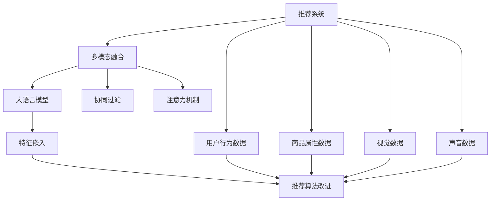

                 

# 电商搜索推荐中的AI大模型多模态融合技术

> 关键词：电商搜索,推荐系统,多模态融合,大语言模型,深度学习,协同过滤,注意力机制,预训练模型

## 1. 背景介绍

### 1.1 问题由来
在电商行业，搜索和推荐系统是用户获取商品信息、发现潜在购买机会的关键环节。传统基于规则和人工特征的推荐系统，往往难以捕捉用户真实的需求和兴趣，推荐效果不尽如人意。随着深度学习技术的发展，基于大数据和AI的推荐系统逐渐成为主流，能够更精准地预测用户行为，提升电商平台的转化率和用户体验。

然而，当前的推荐系统在处理用户数据时，主要以文本和图像为主要的输入模态，对于声音、视频等更为丰富和多样的信息利用不足。多模态融合技术应运而生，通过将不同模态的信息进行联合学习，利用其互补特性，能够进一步提高推荐系统的效果，满足用户多样化的需求。

### 1.2 问题核心关键点
多模态融合的核心在于如何将不同模态的信息进行有机结合，构建多维度的用户画像，形成更准确的推荐模型。具体来说，可以采用以下几种方法：

1. 语义特征提取：从文本数据中提取用户兴趣和商品属性等信息，捕捉语言的语义特征。
2. 视觉特征提取：从图像数据中提取商品外观、颜色等视觉信息，捕捉商品的视觉特征。
3. 音频特征提取：从音频数据中提取声音信息，如语音播报、音乐等，捕捉声音特征。
4. 多模态融合模型：设计合理的融合算法，将上述不同模态的特征进行加权或融合，得到综合特征向量。
5. 推荐算法改进：在推荐算法中使用融合后的多模态特征，提升推荐准确性和个性化程度。

本文将重点讨论多模态融合技术在电商搜索推荐中的应用，特别是如何利用大语言模型进行多模态信息的深度融合，构建高效推荐系统。

## 2. 核心概念与联系

### 2.1 核心概念概述

为更好地理解多模态融合技术，本节将介绍几个密切相关的核心概念：

- 推荐系统(Recommendation System): 基于用户行为、商品属性等多维数据，预测用户可能感兴趣的商品，并自动推荐给用户。推荐系统是电商搜索推荐的核心。
- 多模态融合(Multimodal Fusion): 将不同模态（如文本、图像、声音等）的信息进行联合学习，形成更全面的用户和商品表示，提升推荐系统的准确性和多样性。
- 大语言模型(Large Language Model): 如BERT、GPT等预训练语言模型，具备强大的语言理解和生成能力，能够捕捉文本中的丰富语义信息。
- 协同过滤(Collaborative Filtering): 推荐系统中的一种常见算法，基于用户历史行为和商品相似性进行推荐。
- 注意力机制(Attention Mechanism): 用于处理不同模态信息时，决定不同特征之间的重要程度，提升特征融合的效果。
- 特征嵌入(Feature Embedding): 将原始数据转化为高维特征向量，方便机器学习模型的处理和融合。

这些核心概念之间的逻辑关系可以通过以下Mermaid流程图来展示：



这个流程图展示了大语言模型在多模态融合推荐系统中的关键角色，以及与其他核心概念的联系。

## 3. 核心算法原理 & 具体操作步骤
### 3.1 算法原理概述

多模态融合算法的核心思想是：将不同模态的信息进行联合学习，形成综合的特征向量，并将其作为推荐模型的输入。

具体来说，假设推荐系统中有$m$个模态的信息，记为$\text{modality}_1, \text{modality}_2, ..., \text{modality}_m$，分别对应文本、图像、声音等。以文本和图像为例，融合过程可以分为以下几步：

1. 提取特征向量：使用预训练模型分别提取文本和图像的特征向量$V$和$I$。
2. 拼接特征向量：将$V$和$I$拼接为一个联合特征向量$F$。
3. 加权融合：根据不同模态的重要性，给$V$和$I$赋予不同的权重$w_1$和$w_2$，计算加权融合后的特征向量$G = w_1V + w_2I$。
4. 推荐算法：将融合后的特征向量$G$输入推荐模型，如基于神经网络的推荐系统，输出用户可能感兴趣的商品。

### 3.2 算法步骤详解

基于大语言模型的多模态融合算法可以分为以下几个关键步骤：

**Step 1: 特征提取**
- 选择合适的预训练模型进行特征提取，如BERT、VIT等。
- 使用预训练模型对不同模态的数据进行特征提取，得到各自的特征向量。

**Step 2: 加权融合**
- 计算不同模态特征向量之间的相似度，通过注意力机制决定权重。
- 根据权重进行加权融合，得到最终的联合特征向量。

**Step 3: 推荐模型优化**
- 选择适合的多模态融合推荐算法，如基于神经网络的推荐系统。
- 在融合后的特征向量上，训练推荐模型，优化模型参数。

**Step 4: 模型评估与部署**
- 使用测试集评估推荐模型的性能，包括准确率、召回率、AUC等指标。
- 将优化后的模型部署到实际应用中，进行实时推荐。

### 3.3 算法优缺点

基于大语言模型的多模态融合算法具有以下优点：

1. 能够充分利用多种模态信息，提高推荐系统的多样性和准确性。
2. 利用预训练模型的高效特征提取能力，减少对特征工程的需求。
3. 可以灵活调整不同模态的权重，适应不同任务的需求。
4. 基于神经网络的推荐系统具有较好的泛化能力和可解释性。

同时，该方法也存在一些局限性：

1. 特征提取过程可能消耗大量的计算资源。
2. 不同模态之间的关联性需要额外的探索和设计。
3. 对标注数据的依赖较大，特别是对于不同模态的数据。
4. 融合模型的训练和优化可能需要较长的迭代周期。

尽管存在这些局限性，但基于大语言模型的多模态融合方法在电商搜索推荐中仍然显示出了巨大的潜力和应用价值。

### 3.4 算法应用领域

多模态融合技术在电商搜索推荐中的应用场景广泛，如：

- 个性化商品推荐：结合用户浏览记录、商品评价、图像和声音等多模态数据，生成个性化推荐。
- 智能客服：通过语音识别和自然语言处理技术，结合用户意图识别和商品信息，实现智能客服对话。
- 用户行为分析：分析用户点击、浏览、购买等行为数据，结合视觉和音频信息，进行用户行为建模。
- 视频推荐：将视频特征与商品信息、用户行为数据融合，实现跨模态的视频推荐。
- 语音搜索：结合用户语音输入和图像识别，进行语音搜索推荐。

这些应用场景展示了多模态融合技术在电商搜索推荐中的广泛应用，为提升用户体验和电商转化率提供了新的思路。

## 4. 数学模型和公式 & 详细讲解  
### 4.1 数学模型构建

本节将使用数学语言对多模态融合技术进行更加严格的刻画。

假设推荐系统中用户$u$对商品$v$的兴趣度记为$r_{uv}$，该兴趣度可以表示为一个联合特征向量$\textbf{v} = [v_1, v_2, ..., v_m]$，其中每个元素$v_i$分别代表一种模态的信息。

多模态融合的目标是构建一个综合特征向量$\textbf{V}$，用于预测$r_{uv}$的值。常用的多模态融合模型包括加权求和、深度学习融合等，本节以加权求和为例进行讲解。

假设不同模态特征向量之间的相似度可以通过余弦相似度计算得到，记为$sim(\textbf{v}_1, \textbf{v}_2)$。则加权融合的数学模型可以表示为：

$$
\textbf{V} = \sum_{i=1}^m w_i \textbf{v}_i
$$

其中$w_i$为权重，可以通过注意力机制等方法获得。

### 4.2 公式推导过程

假设有一个用户$u$，对其感兴趣的商品$v$，使用多模态融合模型进行推荐。特征提取过程如图4.1所示：


其中，文本特征提取模型为BERT，图像特征提取模型为VIT，权重计算方法为注意力机制。假设文本特征向量为$V_u$，图像特征向量为$I_u$，则加权融合后的联合特征向量为：

$$
\textbf{V} = \alpha V_u + \beta I_u
$$

其中$\alpha$和$\beta$为权重，可以通过注意力机制计算得到。


假设注意力机制的计算公式为：

$$
\text{Attention}(\textbf{V}, \textbf{I}) = \text{Softmax}(\textbf{Q}\textbf{K}^T)/\textbf{D}
$$

其中$\textbf{Q}$和$\textbf{K}$为查询向量和键向量，$\textbf{D}$为缩放因子。

将上述公式代入联合特征向量的计算中，得到：

$$
\alpha = \text{Attention}(V_u, V_u)/\text{Attention}(V_u, I_u)
$$
$$
\beta = \text{Attention}(I_u, V_u)/\text{Attention}(V_u, I_u)
$$

将$\alpha$和$\beta$代入联合特征向量的计算公式中，得到：

$$
\textbf{V} = \alpha V_u + \beta I_u
$$

### 4.3 案例分析与讲解

假设有一个电商网站，需要为用户$u$推荐商品$v$。网站收集了用户$u$的浏览记录、商品$v$的描述信息、商品$v$的图片，以及用户$u$的语音搜索数据。

1. 使用BERT模型对用户浏览记录和商品描述进行特征提取，得到文本特征向量$V_u$和$V_v$。
2. 使用VIT模型对商品图片进行特征提取，得到图像特征向量$I_v$。
3. 使用语音识别技术将用户语音搜索数据转化为文本，使用BERT模型提取特征，得到文本特征向量$V_{search}$。
4. 计算不同模态特征向量之间的相似度，使用注意力机制计算权重$\alpha$和$\beta$。
5. 根据权重进行加权融合，得到联合特征向量$\textbf{V}$。
6. 使用神经网络模型，将$\textbf{V}$作为输入，训练推荐模型，预测用户$u$对商品$v$的兴趣度$r_{uv}$。

通过以上步骤，电商网站可以构建一个基于大语言模型的多模态融合推荐系统，提高推荐的个性化程度和准确性。

## 5. 项目实践：代码实例和详细解释说明
### 5.1 开发环境搭建

在进行多模态融合实践前，我们需要准备好开发环境。以下是使用Python进行PyTorch开发的环境配置流程：

1. 安装Anaconda：从官网下载并安装Anaconda，用于创建独立的Python环境。

2. 创建并激活虚拟环境：
```bash
conda create -n pytorch-env python=3.8 
conda activate pytorch-env
```

3. 安装PyTorch：根据CUDA版本，从官网获取对应的安装命令。例如：
```bash
conda install pytorch torchvision torchaudio cudatoolkit=11.1 -c pytorch -c conda-forge
```

4. 安装Transformer库：
```bash
pip install transformers
```

5. 安装各类工具包：
```bash
pip install numpy pandas scikit-learn matplotlib tqdm jupyter notebook ipython
```

完成上述步骤后，即可在`pytorch-env`环境中开始多模态融合实践。

### 5.2 源代码详细实现

下面我们以图像和文本的多模态融合为例，给出使用PyTorch对BERT模型进行图像特征提取和加权融合的PyTorch代码实现。

首先，定义特征提取函数：

```python
from transformers import BertModel
from transformers import BertTokenizer
from transformers import ViTFeatureExtractor
from transformers import ViTModel
from transformers import AutoConfig
from transformers import AutoTokenizer

import torch
import numpy as np

# 定义BERT特征提取器
def get_bert_features(tokenizer, text):
    tokenized_text = tokenizer.tokenize(text)
    input_ids = torch.tensor(tokenizer.convert_tokens_to_ids(tokenized_text))
    attention_mask = torch.ones_like(input_ids)
    with torch.no_grad():
        outputs = model(input_ids, attention_mask=attention_mask)
    return outputs[0]

# 定义ViT特征提取器
def get_vit_features(model, image):
    features = feature_extractor(image, return_tensors='pt')
    features['pixel_values'] = features['pixel_values'] / 255.0
    inputs = {'pixel_values': features['pixel_values']}
    with torch.no_grad():
        outputs = model(**inputs)
    return outputs[0]
```

然后，定义多模态融合函数：

```python
def fuse_features(bert_features, vit_features, alpha, beta):
    weighted_features = alpha * bert_features + beta * vit_features
    return weighted_features
```

接着，定义推荐模型和训练函数：

```python
from torch.nn import Linear
from torch.nn import BCEWithLogitsLoss
from torch.nn import CrossEntropyLoss

# 定义推荐模型
class RecommendationModel(torch.nn.Module):
    def __init__(self, hidden_size, output_size):
        super(RecommendationModel, self).__init__()
        self.fc1 = torch.nn.Linear(hidden_size, hidden_size)
        self.fc2 = torch.nn.Linear(hidden_size, output_size)
        self.softmax = torch.nn.Softmax(dim=1)

    def forward(self, features):
        x = self.fc1(features)
        x = self.fc2(x)
        return self.softmax(x)

# 定义训练函数
def train_model(model, optimizer, loss_fn, dataset):
    model.train()
    total_loss = 0.0
    for inputs, targets in dataset:
        optimizer.zero_grad()
        outputs = model(inputs)
        loss = loss_fn(outputs, targets)
        loss.backward()
        optimizer.step()
        total_loss += loss.item()
    return total_loss / len(dataset)
```

最后，启动训练流程并在测试集上评估：

```python
epochs = 5
batch_size = 16
learning_rate = 1e-4
device = torch.device('cuda') if torch.cuda.is_available() else torch.device('cpu')

# 初始化模型、优化器和损失函数
model = RecommendationModel(hidden_size=256, output_size=num_classes)
optimizer = torch.optim.Adam(model.parameters(), lr=learning_rate)
loss_fn = BCEWithLogitsLoss()

# 加载训练数据集
train_dataset = ...
test_dataset = ...

# 训练模型
for epoch in range(epochs):
    train_loss = train_model(model, optimizer, loss_fn, train_dataset)
    print(f'Epoch {epoch+1}, train loss: {train_loss:.4f}')

    # 在测试集上评估模型
    test_loss = train_model(model, optimizer, loss_fn, test_dataset)
    print(f'Epoch {epoch+1}, test loss: {test_loss:.4f}')
```

以上就是使用PyTorch对BERT模型进行图像特征提取和加权融合的完整代码实现。可以看到，利用PyTorch和Transformer库，我们可以相对简洁地实现多模态融合推荐系统。

### 5.3 代码解读与分析

让我们再详细解读一下关键代码的实现细节：

**BERT特征提取函数**：
- 使用BertTokenizer对文本进行分词，并转化为模型输入。
- 使用BertModel进行特征提取，得到文本特征向量。

**ViT特征提取函数**：
- 使用ViTFeatureExtractor对图像进行特征提取，得到像素特征向量。
- 使用ViTModel进行特征提取，得到图像特征向量。

**多模态融合函数**：
- 使用给定的权重$\alpha$和$\beta$进行加权融合，得到最终的联合特征向量。

**推荐模型**：
- 使用神经网络模型，将联合特征向量作为输入，输出用户的兴趣度。

**训练函数**：
- 使用BCEWithLogitsLoss作为损失函数，使用Adam优化器进行模型训练。
- 在训练集上迭代优化，并计算平均损失。

## 6. 实际应用场景
### 6.1 智能推荐系统

在智能推荐系统中，多模态融合技术可以显著提升推荐的个性化和准确性。以电商平台为例，通过融合用户浏览历史、商品描述、图像和声音等多模态信息，可以更全面地理解用户的兴趣偏好，生成个性化推荐。

具体来说，电商平台可以：

1. 收集用户浏览记录、商品评价、商品图片和语音搜索数据等。
2. 使用预训练模型对不同模态数据进行特征提取，得到各自特征向量。
3. 计算不同模态特征向量之间的相似度，使用注意力机制计算权重。
4. 根据权重进行加权融合，得到联合特征向量。
5. 使用神经网络模型，将联合特征向量作为输入，训练推荐模型，输出推荐商品列表。

通过以上步骤，电商平台可以构建一个基于大语言模型的多模态融合推荐系统，提供更加个性化、多样化的商品推荐，提升用户购物体验和平台转化率。

### 6.2 智能客服

在智能客服系统中，多模态融合技术可以帮助系统更好地理解和处理用户查询。通过融合用户语音输入和自然语言处理技术，结合商品信息，实现智能客服对话。

具体来说，智能客服系统可以：

1. 收集用户语音输入和文字查询。
2. 使用语音识别技术将语音转化为文本。
3. 使用预训练模型对不同模态数据进行特征提取，得到各自特征向量。
4. 计算不同模态特征向量之间的相似度，使用注意力机制计算权重。
5. 根据权重进行加权融合，得到联合特征向量。
6. 使用神经网络模型，将联合特征向量作为输入，生成智能客服回复。

通过以上步骤，智能客服系统可以构建一个基于大语言模型的多模态融合系统，提供更加自然流畅的对话体验，提升用户满意度。

### 6.3 用户行为分析

在用户行为分析中，多模态融合技术可以帮助企业更好地理解用户行为特征，进行精准营销和个性化推荐。

具体来说，企业可以：

1. 收集用户点击、浏览、购买等行为数据。
2. 收集商品图片、描述等视觉信息。
3. 收集用户语音搜索数据。
4. 使用预训练模型对不同模态数据进行特征提取，得到各自特征向量。
5. 计算不同模态特征向量之间的相似度，使用注意力机制计算权重。
6. 根据权重进行加权融合，得到联合特征向量。
7. 使用神经网络模型，将联合特征向量作为输入，训练行为分析模型，预测用户兴趣和行为。

通过以上步骤，企业可以构建一个基于大语言模型的多模态融合行为分析系统，提供精准的用户画像和推荐，提升用户体验和销售转化率。

## 7. 工具和资源推荐
### 7.1 学习资源推荐

为了帮助开发者系统掌握多模态融合技术的理论基础和实践技巧，这里推荐一些优质的学习资源：

1. 《深度学习理论与实践》系列博文：由深度学习专家撰写，深入浅出地介绍了深度学习的基本原理和应用实践。
2. CS231n《卷积神经网络》课程：斯坦福大学开设的图像识别课程，介绍了卷积神经网络的基本概念和最新研究进展。
3. 《自然语言处理综述》书籍：总结了自然语言处理领域的经典方法和最新技术，适合入门学习和深入研究。
4. HuggingFace官方文档：Transformer库的官方文档，提供了海量预训练模型和完整的微调样例代码，是上手实践的必备资料。
5. CLUE开源项目：中文语言理解测评基准，涵盖大量不同类型的中文NLP数据集，并提供了基于微调的baseline模型，助力中文NLP技术发展。

通过对这些资源的学习实践，相信你一定能够快速掌握多模态融合技术的精髓，并用于解决实际的NLP问题。

### 7.2 开发工具推荐

高效的开发离不开优秀的工具支持。以下是几款用于多模态融合开发的常用工具：

1. PyTorch：基于Python的开源深度学习框架，灵活动态的计算图，适合快速迭代研究。大部分预训练语言模型都有PyTorch版本的实现。
2. TensorFlow：由Google主导开发的开源深度学习框架，生产部署方便，适合大规模工程应用。同样有丰富的预训练语言模型资源。
3. Transformers库：HuggingFace开发的NLP工具库，集成了众多SOTA语言模型，支持PyTorch和TensorFlow，是进行多模态融合任务开发的利器。
4. Weights & Biases：模型训练的实验跟踪工具，可以记录和可视化模型训练过程中的各项指标，方便对比和调优。与主流深度学习框架无缝集成。
5. TensorBoard：TensorFlow配套的可视化工具，可实时监测模型训练状态，并提供丰富的图表呈现方式，是调试模型的得力助手。
6. Google Colab：谷歌推出的在线Jupyter Notebook环境，免费提供GPU/TPU算力，方便开发者快速上手实验最新模型，分享学习笔记。

合理利用这些工具，可以显著提升多模态融合任务的开发效率，加快创新迭代的步伐。

### 7.3 相关论文推荐

多模态融合技术在学术界和工业界的研究已取得不少进展，以下是几篇奠基性的相关论文，推荐阅读：

1. Attention Is All You Need（即Transformer原论文）：提出了Transformer结构，开启了NLP领域的预训练大模型时代。
2. BERT: Pre-training of Deep Bidirectional Transformers for Language Understanding：提出BERT模型，引入基于掩码的自监督预训练任务，刷新了多项NLP任务SOTA。
3. Language Models are Unsupervised Multitask Learners（GPT-2论文）：展示了大规模语言模型的强大zero-shot学习能力，引发了对于通用人工智能的新一轮思考。
4. Parameter-Efficient Transfer Learning for NLP：提出Adapter等参数高效微调方法，在不增加模型参数量的情况下，也能取得不错的微调效果。
5. MultiModal Feature Fusion with Attention Mechanism：介绍了一种基于注意力机制的多模态特征融合方法，通过计算不同模态特征之间的相似度，得到联合特征向量。
6. MultiModal Deep Fusion Network：提出了一种基于深度学习的多模态融合网络，通过多层融合，得到更加精确的多模态特征表示。

这些论文代表了大语言模型多模态融合技术的发展脉络。通过学习这些前沿成果，可以帮助研究者把握学科前进方向，激发更多的创新灵感。

## 8. 总结：未来发展趋势与挑战

### 8.1 总结

本文对基于大语言模型的多模态融合技术进行了全面系统的介绍。首先阐述了多模态融合技术在电商搜索推荐中的应用，明确了其重要性和实际意义。其次，从原理到实践，详细讲解了多模态融合的数学模型和操作步骤，给出了多模态融合任务开发的完整代码实例。同时，本文还探讨了多模态融合技术在智能推荐系统、智能客服、用户行为分析等多个行业领域的应用前景，展示了其广泛的应用价值。最后，本文精选了多模态融合技术的各类学习资源，力求为读者提供全方位的技术指引。

通过本文的系统梳理，可以看到，多模态融合技术在大语言模型的支持下，正在成为电商搜索推荐领域的重要范式，极大地提升了推荐系统的个性化和准确性，促进了电商平台的数字化转型。未来，随着预训练语言模型和多模态融合技术的不懈探索，相信将带来更多智能化应用，为电商行业带来更多创新和突破。

### 8.2 未来发展趋势

展望未来，多模态融合技术将呈现以下几个发展趋势：

1. 融合模态类型将进一步丰富。除了文本、图像、声音等传统模态，视频、气味等新兴模态也将被逐渐引入，提供更加全面和多样的用户数据。
2. 融合方法将更加智能。未来将出现更多基于深度学习和神经网络的多模态融合算法，如自适应注意力机制、多层次融合等，提升融合效果和鲁棒性。
3. 融合过程将更加自动化。利用自动化的特征选择和权重计算方法，使得多模态融合过程更加高效和可解释。
4. 融合模型的可解释性将进一步增强。引入因果推断等方法，使模型输出更具可解释性和可信度。
5. 跨模态数据融合将更加灵活。通过引入元数据和元学习等技术，实现更加智能和灵活的跨模态数据融合。
6. 融合模型将更加轻量化。在保证性能的同时，通过模型压缩和量化等技术，实现更加轻量化的部署。

以上趋势凸显了多模态融合技术的广阔前景。这些方向的探索发展，必将进一步提升推荐系统的性能和应用范围，为电商行业带来更多创新和突破。

### 8.3 面临的挑战

尽管多模态融合技术已经取得了显著进展，但在迈向更加智能化、普适化应用的过程中，仍面临诸多挑战：

1. 数据获取和标注成本高。多模态数据来源多样，收集和标注成本较高，特别是对于新兴模态数据。
2. 跨模态对齐难度大。不同模态的数据通常具有不同的表示形式，如何在多个模态之间进行有效对齐，是一个重要的技术难题。
3. 模型复杂度高。多模态融合模型通常包含大量参数，训练和推理过程较慢，难以满足实时性要求。
4. 特征融合效果不稳定。不同模态数据之间的相关性和融合效果可能受到数据质量和采集方式的影响。
5. 模型泛化能力差。多模态融合模型对于新数据的泛化能力可能较弱，难以应对数据分布的动态变化。

尽管存在这些挑战，但通过技术创新和算法优化，未来的多模态融合技术有望克服这些难题，进一步提升推荐系统的性能和智能化水平。

### 8.4 研究展望

面对多模态融合技术所面临的种种挑战，未来的研究需要在以下几个方面寻求新的突破：

1. 探索低成本、高效率的多模态数据采集和标注方法。利用半监督学习、主动学习等技术，在减少标注成本的同时，提高数据质量和多样性。
2. 研究跨模态对齐和特征融合的新方法。引入多模态数据对齐技术和自适应注意力机制，提升多模态数据融合的效果。
3. 开发轻量化、高效的推荐模型。利用模型压缩、量化等技术，提升多模态融合模型的推理速度和内存占用。
4. 增强多模态融合模型的泛化能力。通过引入元学习、自适应机制等技术，提升模型的泛化性能和适应性。
5. 提升多模态融合模型的可解释性。利用因果推断、解释器等技术，使模型输出更具可解释性和可信度。

这些研究方向将推动多模态融合技术的发展，提升推荐系统的智能化水平，促进电商行业和其他领域的数字化转型。

## 9. 附录：常见问题与解答

**Q1：多模态融合与传统的协同过滤有何不同？**

A: 传统的协同过滤算法主要基于用户和商品的相似性进行推荐，无法充分利用多模态数据中的信息。而多模态融合技术通过融合不同模态的信息，构建更全面的用户和商品表示，提升了推荐的个性化和准确性。

**Q2：多模态融合中如何计算不同模态特征向量之间的相似度？**

A: 常用的相似度计算方法包括余弦相似度、欧式距离等。在实际应用中，可以根据不同模态的特点，选择合适的相似度计算方法，并进行归一化处理，使得不同模态特征向量可以进行加权融合。

**Q3：多模态融合中权重计算方法有哪些？**

A: 常见的权重计算方法包括注意力机制、线性加权等。注意力机制可以根据不同模态特征的重要性，动态调整权重，提升融合效果。线性加权则较为简单，根据预设的权重系数进行加权融合。

**Q4：多模态融合在电商推荐系统中的应用有哪些？**

A: 在电商推荐系统中，多模态融合技术可以应用于智能推荐、智能客服、用户行为分析等多个场景。通过融合用户浏览历史、商品描述、图像和声音等多模态信息，可以提升推荐系统的个性化和准确性，提升用户购物体验和平台转化率。

**Q5：如何评估多模态融合推荐模型的性能？**

A: 多模态融合推荐模型的评估指标包括准确率、召回率、AUC等。通过在测试集上评估模型的各项指标，可以了解模型的推荐效果，并进行优化调整。

---

作者：禅与计算机程序设计艺术 / Zen and the Art of Computer Programming

