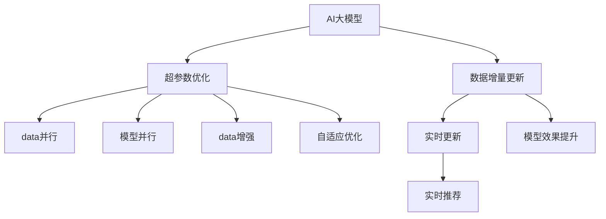

                 

# 电商搜索推荐中的AI大模型数据增量更新机制设计与实现

## 1. 背景介绍

### 1.1 问题由来
随着电子商务的飞速发展，电商企业需要对海量商品数据进行高效管理与推荐，以满足用户多样化和个性化的需求。传统的推荐系统主要依赖于人工设计和规则，难以应对数据复杂性和动态性，而基于AI的推荐系统逐渐成为电商推荐的主流方向。

然而，AI推荐系统面临着数据量大、模型复杂、更新频率高、计算资源需求大等一系列挑战。如何构建高效的推荐系统，持续更新AI大模型的参数，提升推荐效果，成为电商搜索推荐的核心问题。

### 1.2 问题核心关键点
电商搜索推荐系统需要实时地更新AI大模型的参数，以反映用户最新的搜索和购买行为，而传统的全量模型更新方式不仅计算成本高昂，且更新间隔长、时效性差。为了解决这些问题，本文提出了基于数据增量更新的AI大模型机制，旨在通过微小的数据增量训练，快速更新模型参数，提高电商推荐系统的实时性和精准性。

## 2. 核心概念与联系

### 2.1 核心概念概述

为更好地理解基于数据增量更新的AI大模型机制，本节将介绍几个密切相关的核心概念：

- AI大模型：以深度学习为基础，通过大规模数据预训练得到的通用语言模型或图像模型，具备强大的表征能力和通用学习能力。
- 数据增量更新：在已有模型参数基础上，利用新数据对模型进行微调，实现快速更新，以适应新数据分布。
- 超参数优化：通过调整学习率、批次大小等超参数，控制模型更新的稳定性和效果。
- 数据并行与模型并行：分布式训练中常见的并行化技术，分别通过多台机器的数据并行和模型并行，提高训练效率。
- 数据增强：通过数据变换、生成对抗性样本等方法，丰富训练数据集，提升模型的泛化能力。
- 自适应优化算法：如Adaptive Moment Estimation (AdamW)、Adafactor等，动态调整学习率，提高模型更新的适应性和收敛速度。

这些核心概念之间的逻辑关系可以通过以下Mermaid流程图来展示：



这个流程图展示了大模型和数据增量更新的核心概念及其之间的关系：

1. AI大模型通过预训练获得基础能力。
2. 数据增量更新对预训练模型进行微调，实现快速更新。
3. 超参数优化控制模型更新的参数设置。
4. 数据并行与模型并行提升分布式训练效率。
5. 数据增强丰富训练数据，提升泛化能力。
6. 自适应优化算法动态调整学习率，提高收敛性。
7. 实时更新模型，提升推荐系统实时性和精准性。
8. 模型效果提升，通过实时推荐实现商业价值。

## 3. 核心算法原理 & 具体操作步骤
### 3.1 算法原理概述

基于数据增量更新的AI大模型机制，本质上是一种微调过程。其核心思想是：在已有大模型的基础上，利用新数据的输入，通过微小的增量训练，更新模型参数，以适应新数据分布。

形式化地，假设预训练模型为 $M_{\theta}$，其中 $\theta$ 为预训练得到的模型参数。假设新采集的数据集为 $D_{\text{new}}=\{(x_i, y_i)\}_{i=1}^N$，其中 $x_i$ 为输入特征，$y_i$ 为标签。则数据增量更新的目标是最小化新数据上的损失函数：

$$
\theta_{\text{new}} = \mathop{\arg\min}_{\theta} \mathcal{L}(M_{\theta}, D_{\text{new}})
$$

其中 $\mathcal{L}$ 为针对新数据集设计的损失函数，如交叉熵损失。通过梯度下降等优化算法，模型参数 $\theta$ 在微小的数据增量 $D_{\text{new}}$ 上进行更新，最小化损失函数 $\mathcal{L}$，使得模型输出逼近新数据分布。

### 3.2 算法步骤详解

基于数据增量更新的AI大模型机制一般包括以下几个关键步骤：

**Step 1: 准备数据集与模型**
- 收集电商平台的新数据集 $D_{\text{new}}$，可以包括用户行为数据、商品评价数据等。
- 选择合适的预训练模型 $M_{\theta}$，如BERT、GPT等。

**Step 2: 选择增量训练策略**
- 决定是否冻结部分预训练参数，减少更新量。如冻结Transformer的底几层，只微调顶层。
- 设置微调的学习率、批次大小等超参数。

**Step 3: 实现增量训练**
- 将新数据集 $D_{\text{new}}$ 分批次输入模型，前向传播计算损失函数。
- 反向传播计算参数梯度，根据设定的优化算法更新模型参数。
- 更新后的模型参数 $\theta_{\text{new}}$ 可以作为增量更新后的模型，实时应用于推荐系统中。

**Step 4: 评估与反馈**
- 在实时推荐过程中，根据新数据的反馈，评估推荐效果。
- 实时监控模型性能，根据评估结果调整增量训练的策略，优化模型。

### 3.3 算法优缺点

基于数据增量更新的AI大模型机制具有以下优点：
1. 实时更新：可以快速响应新数据的到来，适应电商搜索推荐系统的动态性。
2. 计算资源节省：仅更新模型微小部分，减少计算资源消耗。
3. 泛化能力强：通过微调训练，提高模型对新数据的泛化能力。
4. 高效部署：将更新后的模型实时部署到推荐系统中，快速迭代优化。

同时，该机制也存在以下局限性：
1. 需要存储大量历史数据：为了有效增量更新，需要保留大量历史数据，以训练出准确的模型。
2. 数据漂移问题：新数据与历史数据分布差异较大时，模型效果可能下降。
3. 实时性要求高：增量更新需要实时进行，对数据处理和计算能力有较高要求。
4. 数据隐私问题：增量更新过程中，如何保护用户隐私，是电商搜索推荐系统中需要考虑的重要问题。

尽管存在这些局限性，但就目前而言，基于数据增量更新的AI大模型机制仍然是电商搜索推荐系统中重要的优化方向，特别是在数据量大、模型复杂、更新频率高的场景中。

### 3.4 算法应用领域

基于数据增量更新的AI大模型机制在电商搜索推荐中具有广泛的应用前景：

- 实时推荐：通过增量更新模型，实时响应用户查询，提供个性化的商品推荐。
- 用户行为分析：增量训练模型，分析用户行为模式，优化推荐策略。
- 商品评价预测：利用用户评价数据，预测商品质量和趋势，优化库存管理。
- 广告投放：增量更新模型，优化广告投放策略，提升广告效果。
- 个性化服务：根据用户反馈，动态调整推荐模型参数，提升服务质量。

除了这些直接应用外，数据增量更新的机制还能为电商搜索推荐系统提供持续的改进空间，帮助企业不断优化推荐算法，提升用户体验和商业价值。

## 4. 数学模型和公式 & 详细讲解 & 举例说明
### 4.1 数学模型构建

本节将使用数学语言对基于数据增量更新的AI大模型机制进行更加严格的刻画。

记预训练语言模型为 $M_{\theta}:\mathcal{X} \rightarrow \mathcal{Y}$，其中 $\mathcal{X}$ 为输入特征空间，$\mathcal{Y}$ 为输出空间，$\theta \in \mathbb{R}^d$ 为模型参数。假设新数据集为 $D_{\text{new}}=\{(x_i, y_i)\}_{i=1}^N$，其中 $x_i \in \mathcal{X}$ 为输入，$y_i \in \mathcal{Y}$ 为标签。

定义模型 $M_{\theta}$ 在新数据集 $D_{\text{new}}$ 上的损失函数为 $\ell(M_{\theta}(x),y)$，则在数据集 $D_{\text{new}}$ 上的经验风险为：

$$
\mathcal{L}(\theta) = \frac{1}{N} \sum_{i=1}^N \ell(M_{\theta}(x_i),y_i)
$$

通过梯度下降等优化算法，最小化损失函数 $\mathcal{L}$，更新模型参数 $\theta$，使得模型输出逼近新数据分布。具体步骤为：

1. 初始化预训练模型参数 $\theta$。
2. 将新数据集 $D_{\text{new}}$ 分批次输入模型，计算损失函数。
3. 反向传播计算参数梯度，更新模型参数。
4. 更新后的参数 $\theta_{\text{new}}$ 即为增量更新后的模型。

### 4.2 公式推导过程

以下我们以二分类任务为例，推导交叉熵损失函数及其梯度的计算公式。

假设模型 $M_{\theta}$ 在新数据集 $D_{\text{new}}$ 上的输出为 $\hat{y}=M_{\theta}(x) \in [0,1]$，表示样本属于正类的概率。真实标签 $y \in \{0,1\}$。则二分类交叉熵损失函数定义为：

$$
\ell(M_{\theta}(x),y) = -[y\log \hat{y} + (1-y)\log (1-\hat{y})]
$$

将其代入经验风险公式，得：

$$
\mathcal{L}(\theta) = -\frac{1}{N}\sum_{i=1}^N [y_i\log M_{\theta}(x_i)+(1-y_i)\log(1-M_{\theta}(x_i))]
$$

根据链式法则，损失函数对参数 $\theta_k$ 的梯度为：

$$
\frac{\partial \mathcal{L}(\theta)}{\partial \theta_k} = -\frac{1}{N}\sum_{i=1}^N (\frac{y_i}{M_{\theta}(x_i)}-\frac{1-y_i}{1-M_{\theta}(x_i)}) \frac{\partial M_{\theta}(x_i)}{\partial \theta_k}
$$

其中 $\frac{\partial M_{\theta}(x_i)}{\partial \theta_k}$ 可进一步递归展开，利用自动微分技术完成计算。

在得到损失函数的梯度后，即可带入参数更新公式，完成模型的迭代优化。重复上述过程直至收敛，最终得到适应新数据分布的最优模型参数 $\theta_{\text{new}}$。

### 4.3 案例分析与讲解

以电商推荐系统为例，解释数据增量更新的机制。

假设电商推荐系统基于用户行为数据进行推荐，用户行为数据包括点击次数、浏览时间、购买记录等。可以将其表示为 $x=(c_1,t_1,b_1,...,c_n,t_n,b_n)$，其中 $c_i$ 为第 $i$ 次点击，$t_i$ 为浏览时间，$b_i$ 为购买记录。

首先，收集电商平台上的新数据集 $D_{\text{new}}=\{(x_i, y_i)\}_{i=1}^N$，其中 $x_i$ 为用户的最新行为数据，$y_i$ 为对应行为的推荐结果。然后，将新数据集输入到预训练模型中，计算损失函数。

具体步骤如下：

1. 初始化预训练模型参数 $\theta$。
2. 将新数据集 $D_{\text{new}}$ 分批次输入模型，前向传播计算损失函数。
3. 反向传播计算参数梯度，根据设定的优化算法更新模型参数。
4. 更新后的参数 $\theta_{\text{new}}$ 作为增量更新后的模型，实时应用于推荐系统中。

增量更新后的模型可以更好地捕捉新数据的特征，提高推荐系统的实时性和精准性。同时，由于只更新模型微小部分，计算资源消耗较低，能够有效应对电商平台的动态需求。

## 5. 项目实践：代码实例和详细解释说明
### 5.1 开发环境搭建

在进行数据增量更新实践前，我们需要准备好开发环境。以下是使用Python进行PyTorch开发的环境配置流程：

1. 安装Anaconda：从官网下载并安装Anaconda，用于创建独立的Python环境。

2. 创建并激活虚拟环境：
```bash
conda create -n pytorch-env python=3.8 
conda activate pytorch-env
```

3. 安装PyTorch：根据CUDA版本，从官网获取对应的安装命令。例如：
```bash
conda install pytorch torchvision torchaudio cudatoolkit=11.1 -c pytorch -c conda-forge
```

4. 安装Transformer库：
```bash
pip install transformers
```

5. 安装各类工具包：
```bash
pip install numpy pandas scikit-learn matplotlib tqdm jupyter notebook ipython
```

完成上述步骤后，即可在`pytorch-env`环境中开始开发实践。

### 5.2 源代码详细实现

这里我们以电商推荐系统为例，给出使用PyTorch对BERT模型进行数据增量更新的代码实现。

首先，定义电商推荐系统的数据处理函数：

```python
from transformers import BertTokenizer
from torch.utils.data import Dataset
import torch

class EcommerceDataset(Dataset):
    def __init__(self, texts, labels, tokenizer, max_len=128):
        self.texts = texts
        self.labels = labels
        self.tokenizer = tokenizer
        self.max_len = max_len
        
    def __len__(self):
        return len(self.texts)
    
    def __getitem__(self, item):
        text = self.texts[item]
        label = self.labels[item]
        
        encoding = self.tokenizer(text, return_tensors='pt', max_length=self.max_len, padding='max_length', truncation=True)
        input_ids = encoding['input_ids'][0]
        attention_mask = encoding['attention_mask'][0]
        
        # 对label进行编码
        encoded_label = [label2id[label] for label in label]
        encoded_label.extend([label2id['negative']] * (self.max_len - len(encoded_label)))
        labels = torch.tensor(encoded_label, dtype=torch.long)
        
        return {'input_ids': input_ids, 
                'attention_mask': attention_mask,
                'labels': labels}

# 标签与id的映射
label2id = {'positive': 0, 'negative': 1}
id2label = {v: k for k, v in label2id.items()}

# 创建dataset
tokenizer = BertTokenizer.from_pretrained('bert-base-cased')

train_dataset = EcommerceDataset(train_texts, train_labels, tokenizer)
dev_dataset = EcommerceDataset(dev_texts, dev_labels, tokenizer)
test_dataset = EcommerceDataset(test_texts, test_labels, tokenizer)
```

然后，定义模型和优化器：

```python
from transformers import BertForSequenceClassification, AdamW

model = BertForSequenceClassification.from_pretrained('bert-base-cased', num_labels=len(label2id))

optimizer = AdamW(model.parameters(), lr=2e-5)
```

接着，定义训练和评估函数：

```python
from torch.utils.data import DataLoader
from tqdm import tqdm
from sklearn.metrics import classification_report

device = torch.device('cuda') if torch.cuda.is_available() else torch.device('cpu')
model.to(device)

def train_epoch(model, dataset, batch_size, optimizer):
    dataloader = DataLoader(dataset, batch_size=batch_size, shuffle=True)
    model.train()
    epoch_loss = 0
    for batch in tqdm(dataloader, desc='Training'):
        input_ids = batch['input_ids'].to(device)
        attention_mask = batch['attention_mask'].to(device)
        labels = batch['labels'].to(device)
        model.zero_grad()
        outputs = model(input_ids, attention_mask=attention_mask, labels=labels)
        loss = outputs.loss
        epoch_loss += loss.item()
        loss.backward()
        optimizer.step()
    return epoch_loss / len(dataloader)

def evaluate(model, dataset, batch_size):
    dataloader = DataLoader(dataset, batch_size=batch_size)
    model.eval()
    preds, labels = [], []
    with torch.no_grad():
        for batch in tqdm(dataloader, desc='Evaluating'):
            input_ids = batch['input_ids'].to(device)
            attention_mask = batch['attention_mask'].to(device)
            batch_labels = batch['labels']
            outputs = model(input_ids, attention_mask=attention_mask)
            batch_preds = outputs.logits.argmax(dim=2).to('cpu').tolist()
            batch_labels = batch_labels.to('cpu').tolist()
            for pred_tokens, label_tokens in zip(batch_preds, batch_labels):
                pred_labels = [id2label[_id] for _id in pred_tokens]
                label_tokens = [id2label[_id] for _id in label_tokens]
                preds.append(pred_labels[:len(label_tokens)])
                labels.append(label_tokens)
                
    print(classification_report(labels, preds))
```

最后，启动训练流程并在测试集上评估：

```python
epochs = 5
batch_size = 16

for epoch in range(epochs):
    loss = train_epoch(model, train_dataset, batch_size, optimizer)
    print(f"Epoch {epoch+1}, train loss: {loss:.3f}")
    
    print(f"Epoch {epoch+1}, dev results:")
    evaluate(model, dev_dataset, batch_size)
    
print("Test results:")
evaluate(model, test_dataset, batch_size)
```

以上就是使用PyTorch对BERT进行电商推荐系统数据增量更新的完整代码实现。可以看到，得益于Transformer库的强大封装，我们可以用相对简洁的代码完成BERT模型的加载和增量更新。

### 5.3 代码解读与分析

让我们再详细解读一下关键代码的实现细节：

**EcommerceDataset类**：
- `__init__`方法：初始化文本、标签、分词器等关键组件。
- `__len__`方法：返回数据集的样本数量。
- `__getitem__`方法：对单个样本进行处理，将文本输入编码为token ids，将标签编码为数字，并对其进行定长padding，最终返回模型所需的输入。

**label2id和id2label字典**：
- 定义了标签与数字id之间的映射关系，用于将label-输出结果解码回真实标签。

**训练和评估函数**：
- 使用PyTorch的DataLoader对数据集进行批次化加载，供模型训练和推理使用。
- 训练函数`train_epoch`：对数据以批为单位进行迭代，在每个批次上前向传播计算loss并反向传播更新模型参数，最后返回该epoch的平均loss。
- 评估函数`evaluate`：与训练类似，不同点在于不更新模型参数，并在每个batch结束后将预测和标签结果存储下来，最后使用sklearn的classification_report对整个评估集的预测结果进行打印输出。

**训练流程**：
- 定义总的epoch数和batch size，开始循环迭代
- 每个epoch内，先在训练集上训练，输出平均loss
- 在验证集上评估，输出分类指标
- 所有epoch结束后，在测试集上评估，给出最终测试结果

可以看到，PyTorch配合Transformer库使得BERT增量更新的代码实现变得简洁高效。开发者可以将更多精力放在数据处理、模型改进等高层逻辑上，而不必过多关注底层的实现细节。

当然，工业级的系统实现还需考虑更多因素，如模型的保存和部署、超参数的自动搜索、更灵活的任务适配层等。但核心的增量更新范式基本与此类似。

## 6. 实际应用场景
### 6.1 实时推荐

电商推荐系统需要实时地响应用户查询，提供个性化的商品推荐。基于数据增量更新的AI大模型机制，可以通过增量更新模型，实时响应用户查询，提供精准的商品推荐。

在技术实现上，可以收集用户的实时查询数据，将查询结果和推荐结果作为监督数据，在此基础上对预训练模型进行增量微调。增量微调后的模型能够自动理解用户查询的意图，匹配最合适的商品，并在下次查询时提供更好的推荐结果。

### 6.2 商品评价预测

电商平台需要实时预测新商品的评价，以优化库存管理和广告投放策略。基于数据增量更新的AI大模型机制，可以通过增量更新模型，预测新商品的用户评价，提升预测的准确性。

在实现中，可以收集用户对新商品的评价数据，将评价结果作为标签，将商品信息作为输入特征，增量更新模型。增量更新后的模型能够更准确地预测新商品的评价，帮助电商企业优化库存和广告策略。

### 6.3 广告投放优化

电商平台的广告投放需要实时调整策略，以提高广告效果。基于数据增量更新的AI大模型机制，可以通过增量更新模型，优化广告投放策略，提升广告效果。

在实践中，可以收集用户的广告点击和展示数据，将点击和展示情况作为标签，将广告特征作为输入特征，增量更新模型。增量更新后的模型能够更精准地预测用户对广告的响应，优化广告投放策略。

### 6.4 用户行为分析

电商企业需要实时分析用户行为，优化推荐策略。基于数据增量更新的AI大模型机制，可以通过增量更新模型，分析用户行为模式，优化推荐策略。

在技术实现上，可以收集用户的行为数据，将行为数据作为监督数据，增量更新模型。增量更新后的模型能够更好地捕捉用户行为模式，优化推荐策略，提升用户体验。

### 6.5 个性化服务

电商平台需要根据用户反馈，动态调整推荐模型参数，提升服务质量。基于数据增量更新的AI大模型机制，可以通过增量更新模型，动态调整模型参数，提升个性化服务质量。

在实现中，可以收集用户对推荐结果的反馈，将反馈作为标签，将用户历史行为数据作为输入特征，增量更新模型。增量更新后的模型能够更好地捕捉用户偏好，提升个性化服务质量。

## 7. 工具和资源推荐
### 7.1 学习资源推荐

为了帮助开发者系统掌握数据增量更新的AI大模型机制的理论基础和实践技巧，这里推荐一些优质的学习资源：

1. 《深度学习框架与工具》系列博文：由大模型技术专家撰写，详细介绍了TensorFlow、PyTorch等深度学习框架和工具的配置和使用。

2. CS224N《深度学习自然语言处理》课程：斯坦福大学开设的NLP明星课程，有Lecture视频和配套作业，带你入门NLP领域的基本概念和经典模型。

3. 《Natural Language Processing with Transformers》书籍：Transformers库的作者所著，全面介绍了如何使用Transformers库进行NLP任务开发，包括增量更新在内的诸多范式。

4. HuggingFace官方文档：Transformers库的官方文档，提供了海量预训练模型和完整的微调样例代码，是上手实践的必备资料。

5. 《推荐系统设计与实现》书籍：介绍了推荐系统的基本原理和经典算法，包括基于深度学习的推荐系统实现。

通过对这些资源的学习实践，相信你一定能够快速掌握数据增量更新的AI大模型机制，并用于解决实际的电商推荐问题。
###  7.2 开发工具推荐

高效的开发离不开优秀的工具支持。以下是几款用于电商推荐系统增量更新的常用工具：

1. PyTorch：基于Python的开源深度学习框架，灵活动态的计算图，适合快速迭代研究。大部分预训练语言模型都有PyTorch版本的实现。

2. TensorFlow：由Google主导开发的开源深度学习框架，生产部署方便，适合大规模工程应用。同样有丰富的预训练语言模型资源。

3. Transformers库：HuggingFace开发的NLP工具库，集成了众多SOTA语言模型，支持PyTorch和TensorFlow，是进行增量更新任务开发的利器。

4. Weights & Biases：模型训练的实验跟踪工具，可以记录和可视化模型训练过程中的各项指标，方便对比和调优。与主流深度学习框架无缝集成。

5. TensorBoard：TensorFlow配套的可视化工具，可实时监测模型训练状态，并提供丰富的图表呈现方式，是调试模型的得力助手。

6. Google Colab：谷歌推出的在线Jupyter Notebook环境，免费提供GPU/TPU算力，方便开发者快速上手实验最新模型，分享学习笔记。

合理利用这些工具，可以显著提升电商推荐系统的增量更新任务的开发效率，加快创新迭代的步伐。

### 7.3 相关论文推荐

数据增量更新的AI大模型机制在电商推荐系统中的应用源于学界的持续研究。以下是几篇奠基性的相关论文，推荐阅读：

1. Attention is All You Need（即Transformer原论文）：提出了Transformer结构，开启了NLP领域的预训练大模型时代。

2. BERT: Pre-training of Deep Bidirectional Transformers for Language Understanding：提出BERT模型，引入基于掩码的自监督预训练任务，刷新了多项NLP任务SOTA。

3. Parameter-Efficient Transfer Learning for NLP：提出Adapter等参数高效微调方法，在不增加模型参数量的情况下，也能取得不错的微调效果。

4. Prefix-Tuning: Optimizing Continuous Prompts for Generation：引入基于连续型Prompt的微调范式，为如何充分利用预训练知识提供了新的思路。

5. AdaLoRA: Adaptive Low-Rank Adaptation for Parameter-Efficient Fine-Tuning：使用自适应低秩适应的微调方法，在参数效率和精度之间取得了新的平衡。

6. Decoupled Weight Pruning for Neural Network Compression：提出基于权重解耦的剪枝方法，降低模型参数量和计算资源消耗。

这些论文代表了大模型增量更新的发展脉络。通过学习这些前沿成果，可以帮助研究者把握学科前进方向，激发更多的创新灵感。

## 8. 总结：未来发展趋势与挑战

### 8.1 总结

本文对基于数据增量更新的AI大模型机制进行了全面系统的介绍。首先阐述了数据增量更新在电商搜索推荐系统中的研究背景和意义，明确了增量更新在电商推荐系统实时性和精准性方面的独特价值。其次，从原理到实践，详细讲解了数据增量更新的数学原理和关键步骤，给出了电商推荐系统增量更新的完整代码实例。同时，本文还广泛探讨了增量更新机制在电商推荐系统中的应用前景，展示了增量更新范式的巨大潜力。

通过本文的系统梳理，可以看到，基于数据增量更新的AI大模型机制正在成为电商搜索推荐系统的重要优化方向，极大地拓展了预训练语言模型的应用边界，催生了更多的落地场景。得益于大数据、大模型和高并行计算资源的支持，电商推荐系统的增量更新将进一步提高实时性和精准性，为电商企业提供更加优质的个性化服务。

### 8.2 未来发展趋势

展望未来，数据增量更新的AI大模型机制将呈现以下几个发展趋势：

1. 实时更新成为常态。随着数据量的不断增加，增量更新成为电商推荐系统的常规操作。通过频繁的增量更新，推荐系统能够实时反映用户行为变化，提升推荐效果。

2. 计算资源优化。大规模增量更新需要大量的计算资源，如何优化资源利用率，提升训练效率，将成为未来的重要课题。

3. 模型结构优化。如何设计更高效、更轻量化的模型结构，降低增量更新的计算资源消耗，提高实时性，是电商推荐系统需要解决的问题。

4. 多任务学习。电商推荐系统需要同时处理多个任务，如何设计多任务学习框架，实现多任务增量更新，提升推荐系统的泛化能力和综合效果，也将是重要的研究方向。

5. 用户隐私保护。在电商推荐系统中，如何保护用户隐私，同时利用用户行为数据进行增量更新，是亟需解决的问题。

6. 个性化服务优化。如何根据用户反馈动态调整推荐策略，实现个性化服务的优化，提升用户体验，是未来的研究方向。

以上趋势凸显了数据增量更新在电商推荐系统中的广阔前景。这些方向的探索发展，必将进一步提升电商推荐系统的实时性和精准性，为电商企业带来更高的商业价值。

### 8.3 面临的挑战

尽管数据增量更新的AI大模型机制已经取得了瞩目成就，但在迈向更加智能化、普适化应用的过程中，它仍面临着诸多挑战：

1. 数据质量要求高。电商推荐系统需要高质量、多样化的数据进行增量更新，数据质量差会导致模型性能下降。如何保证数据质量，是电商推荐系统需要解决的问题。

2. 计算资源需求大。大规模增量更新需要大量的计算资源，GPU/TPU等高性能设备是必不可少的。如何优化计算资源利用率，降低成本，是电商推荐系统需要解决的问题。

3. 实时性要求高。电商推荐系统需要实时响应用户查询，如何提高增量更新的实时性，是电商推荐系统需要解决的问题。

4. 数据隐私问题。电商推荐系统需要实时收集用户数据，如何保护用户隐私，同时利用数据进行增量更新，是电商推荐系统需要解决的问题。

5. 模型泛化能力不足。电商推荐系统需要处理海量数据，模型泛化能力不足会导致模型在新数据上的表现不佳。如何提高模型泛化能力，是电商推荐系统需要解决的问题。

尽管存在这些局限性，但就目前而言，数据增量更新的AI大模型机制仍然是电商搜索推荐系统中重要的优化方向，特别是在数据量大、模型复杂、更新频率高的场景中。

### 8.4 研究展望

面对数据增量更新所面临的种种挑战，未来的研究需要在以下几个方面寻求新的突破：

1. 探索无监督和半监督增量更新方法。摆脱对大量标注数据的依赖，利用自监督学习、主动学习等无监督和半监督范式，最大限度利用非结构化数据，实现更加灵活高效的增量更新。

2. 研究参数高效和计算高效的增量更新范式。开发更加参数高效的增量更新方法，在固定大部分预训练参数的情况下，只更新极少量的任务相关参数。同时优化增量更新的计算图，减少前向传播和反向传播的资源消耗，实现更加轻量级、实时性的部署。

3. 融合因果和对比学习范式。通过引入因果推断和对比学习思想，增强增量更新模型建立稳定因果关系的能力，学习更加普适、鲁棒的语言表征，从而提升模型泛化性和抗干扰能力。

4. 引入更多先验知识。将符号化的先验知识，如知识图谱、逻辑规则等，与神经网络模型进行巧妙融合，引导增量更新过程学习更准确、合理的语言模型。同时加强不同模态数据的整合，实现视觉、语音等多模态信息与文本信息的协同建模。

5. 结合因果分析和博弈论工具。将因果分析方法引入增量更新模型，识别出模型决策的关键特征，增强输出解释的因果性和逻辑性。借助博弈论工具刻画人机交互过程，主动探索并规避模型的脆弱点，提高系统稳定性。

6. 纳入伦理道德约束。在增量更新目标中引入伦理导向的评估指标，过滤和惩罚有偏见、有害的输出倾向。同时加强人工干预和审核，建立增量更新模型的监管机制，确保输出符合人类价值观和伦理道德。

这些研究方向的探索，必将引领数据增量更新在电商搜索推荐系统中的应用走向新的高度，为电商企业带来更高的商业价值和用户体验。面向未来，增量更新机制需要与其他人工智能技术进行更深入的融合，如知识表示、因果推理、强化学习等，多路径协同发力，共同推动自然语言理解和智能交互系统的进步。只有勇于创新、敢于突破，才能不断拓展语言模型的边界，让智能技术更好地造福人类社会。

## 9. 附录：常见问题与解答

**Q1：数据增量更新与全量更新有什么区别？**

A: 数据增量更新与全量更新在训练数据规模和更新频率上有所不同。全量更新是指使用全部训练数据重新训练模型，而数据增量更新是指在已有模型参数基础上，利用新数据的输入，进行微小的增量训练，更新模型参数，以适应新数据分布。数据增量更新可以实时响应新数据的到来，提高电商推荐系统的动态性，而全量更新则需要在特定时间点进行大规模更新，更新周期较长。

**Q2：如何选择增量更新的超参数？**

A: 增量更新的超参数包括学习率、批次大小等。学习率应该比全量更新时小，通常在全量更新学习率的1/10到1/100之间。批次大小应根据数据量和计算资源进行合理设置，通常设置为64或128。此外，还应考虑自适应优化算法的使用，如AdamW、Adafactor等，动态调整学习率，提高增量更新的适应性和收敛速度。

**Q3：增量更新过程中如何保护用户隐私？**

A: 增量更新过程中，需要收集用户的实时数据进行训练。为保护用户隐私，可以采用差分隐私技术，将用户数据进行匿名化处理，限制对用户数据的直接访问。此外，应明确告知用户数据的使用目的，并获得用户的同意。同时，应采取严格的数据保护措施，防止数据泄露。

**Q4：增量更新后模型效果不佳是什么原因？**

A: 增量更新后模型效果不佳可能是由多种原因引起的，包括数据质量差、学习率设置不当、模型结构不适应新数据等。解决方法包括：
1. 提高数据质量：收集高质量、多样化的数据进行增量更新。
2. 调整学习率：根据新数据的复杂度，合理设置学习率。
3. 优化模型结构：设计更高效、更轻量化的模型结构，降低增量更新的计算资源消耗。
4. 多任务学习：设计多任务学习框架，实现多任务增量更新，提升推荐系统的泛化能力和综合效果。

通过以上方法，可以有效提高增量更新后的模型效果，提升电商推荐系统的实时性和精准性。

**Q5：如何提高增量更新的实时性？**

A: 提高增量更新的实时性，可以从以下几个方面入手：
1. 使用GPU/TPU等高性能设备进行增量训练。
2. 优化增量更新的计算图，减少前向传播和反向传播的资源消耗。
3. 采用多任务学习框架，同时处理多个任务，提升推荐系统的综合效果。
4. 使用数据并行与模型并行技术，提升分布式训练效率。
5. 利用缓存技术，减少重复计算。

通过以上方法，可以有效提高增量更新的实时性，提升电商推荐系统的响应速度和用户体验。

