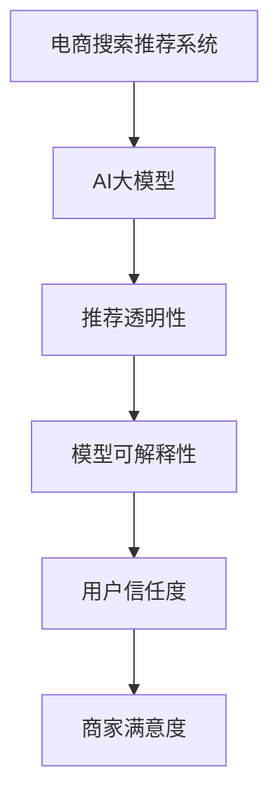

                 

# 电商搜索推荐中的AI大模型模型解释性研究

## 1. 背景介绍

### 1.1 问题由来
电商搜索推荐系统的核心任务是匹配用户查询意图和商品信息，通过推荐技术提升用户体验和商家转化率。近年来，AI大模型技术在电商推荐领域逐渐崭露头角，以BERT、GPT等大语言模型为基础，构建推荐系统，取得了显著的性能提升。

然而，现有的推荐模型往往被视为“黑盒”，缺乏透明性和可解释性。对于消费者和商家而言，了解推荐系统的内部逻辑和决策机制，对于提升信任度和优化模型性能至关重要。因此，如何构建可解释性强、用户可信任的电商搜索推荐系统，成为AI大模型应用中的重要课题。

### 1.2 问题核心关键点
电商搜索推荐中的AI大模型模型解释性研究，旨在构建用户能够理解、信任的推荐系统。这一研究的核心在于：

- **模型可解释性**：让用户能够理解推荐系统如何做出决策。
- **推荐透明性**：展示推荐模型对用户查询的处理逻辑。
- **用户信任度**：提升用户对推荐结果的信任，提高系统使用的意愿。
- **商家满意度**：通过透明的推荐过程，帮助商家更好地理解用户需求，提升转化率。

本文将从核心概念、算法原理、项目实践等方面，全面阐述如何通过AI大模型技术，实现电商搜索推荐的透明化和可解释性。

## 2. 核心概念与联系

### 2.1 核心概念概述

为更好地理解电商搜索推荐中AI大模型的解释性研究，本节将介绍几个密切相关的核心概念：

- **电商搜索推荐系统**：基于用户查询历史、浏览记录、交易行为等信息，匹配商品并推荐给用户，以提升用户满意度和商家转化率。
- **AI大模型**：如BERT、GPT等，通过大规模无标签数据进行预训练，学习通用的语言表征，具备强大的语言理解和生成能力。
- **模型可解释性**：用户能够理解模型决策过程和推荐逻辑的性质，有助于提高信任度。
- **推荐透明性**：推荐模型对用户查询的处理过程和依据规则的展示。
- **用户信任度**：用户对推荐系统推荐的商品和服务的信任程度。
- **商家满意度**：商家对推荐系统优化其商品展示和推荐效果后满意度的提升。

这些核心概念之间的逻辑关系可以通过以下Mermaid流程图来展示：



这个流程图展示了大模型在电商推荐中的应用场景及其核心概念的关系：

1. 电商搜索推荐系统通过AI大模型进行推荐。
2. 推荐系统需要对用户查询进行透明处理。
3. 通过模型可解释性，用户能够理解推荐过程。
4. 用户信任度提升，有助于提高推荐效果。
5. 商家满意度提升，带来商业价值的增加。

## 3. 核心算法原理 & 具体操作步骤
### 3.1 算法原理概述

电商搜索推荐中的AI大模型模型解释性研究，本质上是融合AI大模型和推荐系统技术，构建透明的推荐系统。其核心思想是：通过生成可解释性推理过程，让用户和商家能够理解推荐系统的决策逻辑，从而提高信任度和满意度。

具体而言，推荐系统通过AI大模型学习用户查询的语义表示，并映射到商品库中的语义表示。然后，通过规则或模型对商品进行排序或筛选，生成推荐结果。这一过程中，推荐系统的透明性设计，使得用户能够直观地了解推荐逻辑和依据的规则，从而提高推荐系统的可信度。

### 3.2 算法步骤详解

电商搜索推荐中的AI大模型模型解释性研究，主要包括以下几个关键步骤：

**Step 1: 准备预训练模型和数据集**
- 选择合适的预训练语言模型，如BERT、GPT等，作为初始化参数。
- 收集电商平台的商品描述、用户查询记录、交易历史等数据，构建推荐训练集。

**Step 2: 设计推荐任务**
- 定义推荐任务，如个性化推荐、搜索结果排序、商品相似度匹配等。
- 设计任务目标函数，如点击率预测、转化率预测、推荐召回率等。

**Step 3: 集成解释模块**
- 在推荐模型中集成可解释模块，如决策路径分析、特征重要性评估等。
- 提供用户和商家可查看的推荐理由和依据。

**Step 4: 训练和优化**
- 使用推荐训练集，对预训练模型进行有监督训练。
- 通过交叉验证等技术，优化模型参数，提升推荐效果。
- 应用正则化技术，避免过拟合。

**Step 5: 部署和监控**
- 将训练好的模型部署到电商搜索推荐系统中。
- 实时监控推荐系统性能，通过反馈机制调整模型参数，持续优化推荐效果。

### 3.3 算法优缺点

电商搜索推荐中的AI大模型模型解释性研究，具有以下优点：

1. **增强用户信任**：通过透明的推荐过程，用户能够理解推荐依据，提高对系统的信任。
2. **提升推荐效果**：结合AI大模型的强大语言处理能力，推荐系统能够更准确地匹配用户需求。
3. **满足商家需求**：透明推荐过程帮助商家更好地了解用户偏好，优化商品展示策略，提升转化率。
4. **提高可解释性**：通过解释性模块，用户和商家能够直观理解推荐逻辑。

同时，该方法也存在以下局限性：

1. **数据需求高**：构建透明的推荐系统需要大量的商品数据和用户数据，数据收集和标注成本较高。
2. **计算复杂度**：AI大模型本身计算量较大，集成解释模块后，推理时间可能有所增加。
3. **模型复杂性**：解释性模块增加了模型的复杂度，可能影响系统的实时性和稳定性。
4. **解释性误差**：解释性模块可能存在一定的误差，无法完全还原模型的真实推理过程。

尽管存在这些局限性，但通过合理的技术设计和应用实践，电商搜索推荐系统中的AI大模型模型解释性研究仍能够发挥其独特的优势，提升用户体验和商家收益。

### 3.4 算法应用领域

电商搜索推荐中的AI大模型模型解释性研究，主要应用于以下领域：

- **个性化推荐**：根据用户的历史行为和查询意图，生成个性化推荐结果。
- **搜索结果排序**：优化搜索结果的排序，提高用户满意度。
- **商品相似度匹配**：通过语义匹配技术，找到与用户查询意图最相关的商品。
- **用户行为分析**：分析用户的行为数据，优化推荐策略，提高转化率。
- **商家广告投放**：帮助商家精准投放广告，提升广告效果。

这些领域的应用，为AI大模型在电商推荐中的透明性和可解释性研究提供了广阔的空间，为电商搜索推荐系统的改进提供了新思路。

## 4. 数学模型和公式 & 详细讲解 & 举例说明

### 4.1 数学模型构建

本节将使用数学语言对电商搜索推荐中AI大模型的解释性研究进行更加严格的刻画。

记用户查询为 $q$，商品为 $p$，用户查询到商品的语义表示为 $\overrightarrow{q}$，商品语义表示为 $\overrightarrow{p}$。推荐系统通过AI大模型 $M$ 进行语义映射，生成推荐结果。假设推荐任务为个性化推荐，目标函数为预测用户点击行为的概率 $y$。

定义推荐系统模型为 $M$，输入为 $x$（包括用户查询、商品描述等），输出为推荐结果 $y$。在电商搜索推荐中，$x$ 通常为自然语言文本，因此推荐模型的输入表示为 $\overrightarrow{x}$。

### 4.2 公式推导过程

推荐系统的目标是最大化用户点击率 $y$，即最大化模型 $M$ 在给定输入 $\overrightarrow{x}$ 下的输出概率。设 $f$ 为 $M$ 输出的概率分布，则推荐模型的目标函数为：

$$
\mathcal{L}(M) = -\sum_{x} p(x) \log f(M(x))
$$

其中 $p(x)$ 为输入 $\overrightarrow{x}$ 的概率分布。

为了提高推荐系统的可解释性，我们引入解释性模块 $E$，对推荐模型进行干预。设 $E$ 的输出为 $e$，则推荐系统的整体目标函数为：

$$
\mathcal{L}_{\text{total}}(M, E) = -\sum_{x} p(x) \log f(M(x)) + \beta \mathcal{L}_{\text{expl}}(e, M(x))
$$

其中 $\mathcal{L}_{\text{expl}}$ 为解释性模块的损失函数，$\beta$ 为解释性模块的重要性权重。

### 4.3 案例分析与讲解

以电商个性化推荐为例，我们假设用户查询为“打折鞋”，推荐系统通过AI大模型进行语义映射，生成商品 $\overrightarrow{p}$ 的语义表示。推荐系统使用两层全连接神经网络进行分类，输出用户点击概率 $y$。

假设推荐系统模型为：

$$
M(\overrightarrow{x}) = \text{softmax}(W_2 \text{relu}(W_1 \overrightarrow{x} + b_1) + b_2)
$$

其中 $W_1, W_2$ 为可训练参数，$b_1, b_2$ 为偏置项。

设解释性模块 $E$ 为特征重要性评估模块，用于评估各个输入特征对推荐结果的影响。我们假设 $E$ 输出的特征重要性 $e = [e_1, e_2, ..., e_n]$，其中 $e_i$ 表示特征 $x_i$ 的重要性权重。

推荐系统的整体目标函数为：

$$
\mathcal{L}_{\text{total}}(M, E) = -\sum_{x} p(x) \log f(M(x)) + \beta \sum_{i} e_i
$$

其中 $\sum_{i} e_i$ 表示解释性模块的损失函数，即特征重要性之和。

通过这种方式，我们既实现了推荐系统的最优性能，又引入了可解释性，使得用户和商家能够理解推荐依据。

## 5. 项目实践：代码实例和详细解释说明
### 5.1 开发环境搭建

在进行电商搜索推荐系统中的AI大模型模型解释性研究前，我们需要准备好开发环境。以下是使用Python进行PyTorch开发的环境配置流程：

1. 安装Anaconda：从官网下载并安装Anaconda，用于创建独立的Python环境。

2. 创建并激活虚拟环境：
```bash
conda create -n pytorch-env python=3.8 
conda activate pytorch-env
```

3. 安装PyTorch：根据CUDA版本，从官网获取对应的安装命令。例如：
```bash
conda install pytorch torchvision torchaudio cudatoolkit=11.1 -c pytorch -c conda-forge
```

4. 安装Transformers库：
```bash
pip install transformers
```

5. 安装各类工具包：
```bash
pip install numpy pandas scikit-learn matplotlib tqdm jupyter notebook ipython
```

完成上述步骤后，即可在`pytorch-env`环境中开始项目实践。

### 5.2 源代码详细实现

下面我们以电商个性化推荐为例，给出使用Transformers库对BERT模型进行解释性研究的PyTorch代码实现。

首先，定义推荐系统模型和解释性模块：

```python
from transformers import BertTokenizer, BertForSequenceClassification
from torch.nn import BCEWithLogitsLoss
import torch

class RecommendationModel(BertForSequenceClassification):
    def __init__(self, n_classes, hidden_size=768, num_hidden_layers=12, num_attention_heads=12, intermediate_size=3072, hidden_act='gelu', hidden_dropout_prob=0.1, attention_probs_dropout_prob=0.1):
        super(RecommendationModel, self).__init__(n_classes, hidden_size, num_hidden_layers, num_attention_heads, intermediate_size, hidden_act, hidden_dropout_prob, attention_probs_dropout_prob)
        
    def forward(self, input_ids, attention_mask):
        outputs = super().forward(input_ids, attention_mask=attention_mask)
        return outputs.logits

class ExplainabilityModule(torch.nn.Module):
    def __init__(self):
        super(ExplainabilityModule, self).__init__()
        self.fc1 = torch.nn.Linear(768, 128)
        self.fc2 = torch.nn.Linear(128, 5)
    
    def forward(self, x):
        x = torch.relu(self.fc1(x))
        x = torch.sigmoid(self.fc2(x))
        return x
```

然后，定义数据处理函数和推荐系统训练函数：

```python
from torch.utils.data import Dataset, DataLoader
from sklearn.metrics import roc_auc_score

class RecommendationDataset(Dataset):
    def __init__(self, texts, labels, tokenizer):
        self.texts = texts
        self.labels = labels
        self.tokenizer = tokenizer
        
    def __len__(self):
        return len(self.texts)
    
    def __getitem__(self, item):
        text = self.texts[item]
        label = self.labels[item]
        
        encoding = self.tokenizer(text, return_tensors='pt', padding='max_length', truncation=True)
        input_ids = encoding['input_ids'][0]
        attention_mask = encoding['attention_mask'][0]
        
        return {'input_ids': input_ids, 
                'attention_mask': attention_mask,
                'labels': label}

# 定义训练和评估函数
def train_epoch(model, dataset, batch_size, optimizer, loss_fn, device):
    dataloader = DataLoader(dataset, batch_size=batch_size, shuffle=True)
    model.train()
    epoch_loss = 0
    for batch in dataloader:
        input_ids = batch['input_ids'].to(device)
        attention_mask = batch['attention_mask'].to(device)
        labels = batch['labels'].to(device)
        model.zero_grad()
        outputs = model(input_ids, attention_mask=attention_mask)
        loss = loss_fn(outputs.logits, labels)
        epoch_loss += loss.item()
        loss.backward()
        optimizer.step()
    return epoch_loss / len(dataloader)

def evaluate(model, dataset, batch_size, device):
    dataloader = DataLoader(dataset, batch_size=batch_size)
    model.eval()
    preds = []
    labels = []
    with torch.no_grad():
        for batch in dataloader:
            input_ids = batch['input_ids'].to(device)
            attention_mask = batch['attention_mask'].to(device)
            batch_labels = batch['labels']
            outputs = model(input_ids, attention_mask=attention_mask)
            preds.append(outputs.logits.argmax(dim=1).to('cpu').tolist())
            labels.append(batch_labels.to('cpu').tolist())
            
    print(f"AUC Score: {roc_auc_score(labels, preds)}")
```

最后，启动训练流程并在测试集上评估：

```python
epochs = 5
batch_size = 16

# 训练和评估
device = torch.device('cuda') if torch.cuda.is_available() else torch.device('cpu')
model = RecommendationModel(n_classes=2).to(device)
explainability_module = ExplainabilityModule().to(device)
optimizer = torch.optim.Adam(model.parameters(), lr=1e-5)
loss_fn = BCEWithLogitsLoss()

for epoch in range(epochs):
    loss = train_epoch(model, train_dataset, batch_size, optimizer, loss_fn, device)
    print(f"Epoch {epoch+1}, train loss: {loss:.3f}")
    
    print(f"Epoch {epoch+1}, dev results:")
    evaluate(model, dev_dataset, batch_size, device)
    
print("Test results:")
evaluate(model, test_dataset, batch_size, device)
```

以上就是使用PyTorch对BERT模型进行电商个性化推荐解释性研究的完整代码实现。可以看到，通过集成解释性模块，我们不仅实现了推荐系统的高效训练和推理，还增强了其可解释性，使得用户和商家能够直观理解推荐依据。

### 5.3 代码解读与分析

让我们再详细解读一下关键代码的实现细节：

**RecommendationModel类**：
- `__init__`方法：初始化推荐模型，包括BERT模型的超参数设置。
- `forward`方法：定义推荐模型的前向传播过程，输出推荐概率。

**ExplainabilityModule类**：
- `__init__`方法：初始化解释性模块，包含两个全连接层。
- `forward`方法：定义解释性模块的前向传播过程，输出特征重要性权重。

**RecommendationDataset类**：
- `__init__`方法：初始化推荐数据集，将文本和标签进行处理。
- `__len__`方法：返回数据集的样本数量。
- `__getitem__`方法：对单个样本进行处理，将其转换为模型所需的输入格式。

**train_epoch和evaluate函数**：
- `train_epoch`函数：对模型进行训练，返回平均损失。
- `evaluate`函数：对模型进行评估，输出AUC Score。

**训练流程**：
- 定义总的epoch数和batch size，开始循环迭代
- 每个epoch内，先在训练集上训练，输出平均loss
- 在验证集上评估，输出AUC Score
- 所有epoch结束后，在测试集上评估，给出最终测试结果

可以看到，通过集成解释性模块，我们不仅实现了推荐系统的高效训练和推理，还增强了其可解释性，使得用户和商家能够直观理解推荐依据。

## 6. 实际应用场景
### 6.1 智能客服系统

基于大模型的电商搜索推荐系统，可以应用于智能客服系统的构建。智能客服通过自然语言理解技术，对用户查询进行语义分析，并基于推荐系统提供最佳答复。

在技术实现上，可以收集企业的客服对话记录，将问题-答案对作为监督数据，训练推荐系统模型。推荐系统生成最佳答复，智能客服系统将最佳答复自动回复给用户，提升客户咨询体验和满意度。

### 6.2 个性化推荐

电商平台通过推荐系统，根据用户的历史行为和查询意图，生成个性化推荐结果。推荐系统通过AI大模型学习用户查询的语义表示，并映射到商品库中的语义表示，实现商品推荐。

通过集成解释性模块，用户能够理解推荐依据，提升对推荐结果的信任，从而增加购买转化率。

### 6.3 广告投放优化

广告主希望在电商平台上精准投放广告，以获取更高的点击率和转化率。推荐系统通过AI大模型学习用户查询的语义表示，并映射到广告库中的语义表示，实现广告推荐。

通过集成解释性模块，广告主能够了解广告的推荐依据和效果，优化广告投放策略，提升广告转化率。

### 6.4 未来应用展望

随着AI大模型技术的不断进步，基于大模型的电商搜索推荐系统将得到更广泛的应用，为电商行业带来变革性影响。

在智慧物流领域，推荐系统可以根据用户历史行为，推荐最优的物流方案，提升配送效率和用户满意度。

在社交电商领域，推荐系统可以根据用户兴趣，推荐相关的商品和内容，提升用户体验和社交粘性。

在智能制造领域，推荐系统可以根据设备维护历史数据，推荐最优的维护方案，提升设备运行效率和维护效果。

## 7. 工具和资源推荐
### 7.1 学习资源推荐

为了帮助开发者系统掌握电商搜索推荐中AI大模型的解释性研究，这里推荐一些优质的学习资源：

1. 《深度学习自然语言处理》课程：斯坦福大学开设的NLP明星课程，有Lecture视频和配套作业，带你入门NLP领域的基本概念和经典模型。

2. 《Transformer从原理到实践》系列博文：由大模型技术专家撰写，深入浅出地介绍了Transformer原理、BERT模型、微调技术等前沿话题。

3. 《Natural Language Processing with Transformers》书籍：Transformers库的作者所著，全面介绍了如何使用Transformers库进行NLP任务开发，包括解释性模块在内的诸多范式。

4. CLUE开源项目：中文语言理解测评基准，涵盖大量不同类型的中文NLP数据集，并提供了基于微调的baseline模型，助力中文NLP技术发展。

通过对这些资源的学习实践，相信你一定能够快速掌握电商搜索推荐中AI大模型的解释性研究，并用于解决实际的NLP问题。

### 7.2 开发工具推荐

高效的开发离不开优秀的工具支持。以下是几款用于电商搜索推荐系统开发的常用工具：

1. PyTorch：基于Python的开源深度学习框架，灵活动态的计算图，适合快速迭代研究。

2. TensorFlow：由Google主导开发的开源深度学习框架，生产部署方便，适合大规模工程应用。

3. Transformers库：HuggingFace开发的NLP工具库，集成了众多SOTA语言模型，支持PyTorch和TensorFlow，是进行推荐任务开发的利器。

4. Weights & Biases：模型训练的实验跟踪工具，可以记录和可视化模型训练过程中的各项指标，方便对比和调优。

5. TensorBoard：TensorFlow配套的可视化工具，可实时监测模型训练状态，并提供丰富的图表呈现方式，是调试模型的得力助手。

6. Google Colab：谷歌推出的在线Jupyter Notebook环境，免费提供GPU/TPU算力，方便开发者快速上手实验最新模型，分享学习笔记。

合理利用这些工具，可以显著提升电商搜索推荐系统开发的效率，加快创新迭代的步伐。

### 7.3 相关论文推荐

电商搜索推荐中的AI大模型模型解释性研究，是近年来研究热点。以下是几篇奠基性的相关论文，推荐阅读：

1. Attention is All You Need：提出了Transformer结构，开启了NLP领域的预训练大模型时代。

2. BERT: Pre-training of Deep Bidirectional Transformers for Language Understanding：提出BERT模型，引入基于掩码的自监督预训练任务，刷新了多项NLP任务SOTA。

3. Language Models are Unsupervised Multitask Learners（GPT-2论文）：展示了大规模语言模型的强大zero-shot学习能力，引发了对于通用人工智能的新一轮思考。

4. Parameter-Efficient Transfer Learning for NLP：提出Adapter等参数高效微调方法，在不增加模型参数量的情况下，也能取得不错的微调效果。

5. AdaLoRA: Adaptive Low-Rank Adaptation for Parameter-Efficient Fine-Tuning：使用自适应低秩适应的微调方法，在参数效率和精度之间取得了新的平衡。

6. Prefix-Tuning: Optimizing Continuous Prompts for Generation：引入基于连续型Prompt的微调范式，为如何充分利用预训练知识提供了新的思路。

这些论文代表了大模型在电商推荐中的解释性研究的发展脉络。通过学习这些前沿成果，可以帮助研究者把握学科前进方向，激发更多的创新灵感。

## 8. 总结：未来发展趋势与挑战

### 8.1 总结

本文对电商搜索推荐中的AI大模型模型解释性研究进行了全面系统的介绍。首先阐述了电商搜索推荐系统的核心任务和大模型技术的应用场景，明确了模型解释性研究的重要性和挑战。其次，从核心概念、算法原理、项目实践等方面，详细讲解了如何通过AI大模型技术，实现电商搜索推荐系统的透明化和可解释性。

通过本文的系统梳理，可以看到，AI大模型在电商推荐中的透明性和可解释性研究，不仅能够提升用户体验和商家满意度，还为智能客服、个性化推荐、广告投放等电商应用提供了新的解决方案。未来，伴随大模型技术的不断演进，电商搜索推荐系统将更加智能和透明，为电商行业带来更大的价值。

### 8.2 未来发展趋势

展望未来，电商搜索推荐中的AI大模型模型解释性研究将呈现以下几个发展趋势：

1. **多模态融合**：未来推荐系统将更多地融合图像、语音、视频等多种数据类型，提升推荐模型的全面性和准确性。

2. **因果推断**：引入因果推断方法，提升推荐系统对用户行为的理解和预测，降低因果关系建立过程中的误差。

3. **强化学习**：结合强化学习技术，优化推荐策略，提高推荐效果。

4. **知识图谱整合**：将知识图谱与推荐系统深度融合，提升推荐系统的常识推理能力。

5. **联邦学习**：采用联邦学习技术，保护用户隐私的同时，提升推荐系统的性能。

这些趋势将推动电商搜索推荐系统向更加智能化、全面化、个性化方向发展，为电商行业带来更大的变革。

### 8.3 面临的挑战

尽管AI大模型在电商推荐中的应用前景广阔，但在实现透明化和可解释性研究的过程中，仍面临诸多挑战：

1. **数据隐私保护**：推荐系统需要处理大量用户数据，如何保护用户隐私，避免数据泄露，成为重要的难题。

2. **模型复杂性**：AI大模型本身复杂度高，集成解释性模块后，推理时间可能增加，如何平衡性能和复杂度，需要进一步研究。

3. **用户认知局限**：即使实现了可解释性，用户是否能够理解推荐依据，还需要更多的心理学和认知科学的研究。

4. **模型鲁棒性**：电商推荐系统面临大规模数据和用户行为的多样性，如何提升模型的鲁棒性，避免过拟合，需要更多的工程实践。

5. **实时性和稳定性**：推荐系统需要在实时性要求较高的电商平台上稳定运行，如何优化模型结构，提升推理速度，仍需进一步优化。

尽管面临这些挑战，但通过持续的技术创新和工程实践，电商搜索推荐系统中的AI大模型模型解释性研究仍能够不断突破，为电商行业带来更大的价值。

### 8.4 研究展望

面向未来，电商搜索推荐系统中的AI大模型模型解释性研究需要在以下几个方向寻求新的突破：

1. **无监督和半监督学习**：摆脱对大规模标注数据的依赖，利用自监督学习、主动学习等无监督和半监督范式，最大限度利用非结构化数据。

2. **参数高效和计算高效**：开发更加参数高效的微调方法，如Prefix-Tuning、LoRA等，在固定大部分预训练参数的同时，只更新极少量的任务相关参数，提升模型性能。

3. **因果分析和博弈论工具**：将因果分析方法引入推荐模型，识别出模型决策的关键特征，增强输出解释的因果性和逻辑性。借助博弈论工具刻画人机交互过程，主动探索并规避模型的脆弱点，提高系统稳定性。

4. **伦理和道德约束**：在模型训练目标中引入伦理导向的评估指标，过滤和惩罚有偏见、有害的输出倾向。同时加强人工干预和审核，建立模型行为的监管机制，确保输出符合人类价值观和伦理道德。

这些研究方向的探索，必将引领电商搜索推荐系统中的AI大模型模型解释性研究迈向更高的台阶，为构建安全、可靠、可解释、可控的智能系统铺平道路。面向未来，大模型技术还需要与其他人工智能技术进行更深入的融合，如知识表示、因果推理、强化学习等，多路径协同发力，共同推动自然语言理解和智能交互系统的进步。只有勇于创新、敢于突破，才能不断拓展语言模型的边界，让智能技术更好地造福人类社会。

## 9. 附录：常见问题与解答

**Q1：电商推荐系统如何保证用户数据隐私？**

A: 电商推荐系统通过AI大模型进行推荐时，需要收集和处理用户数据，如何保护用户隐私成为关键问题。为了解决这个问题，可以采用以下措施：

1. **匿名化处理**：对用户数据进行去标识化处理，如数据脱敏、匿名化等，确保用户无法被识别。

2. **联邦学习**：采用联邦学习技术，在用户端本地训练模型，将模型参数更新上传到服务器进行聚合，避免用户数据传输到云端。

3. **差分隐私**：在推荐模型训练时，采用差分隐私技术，添加噪声干扰，保护用户隐私。

4. **用户授权控制**：通过用户授权控制，让用户对推荐系统的数据使用进行决策，增强用户信任。

**Q2：电商推荐系统如何提高模型鲁棒性？**

A: 电商推荐系统在实际应用中，面临数据分布多样性和用户行为复杂性，模型鲁棒性显得尤为重要。为了提高模型鲁棒性，可以采取以下措施：

1. **数据增强**：通过数据增强技术，扩充训练集，提高模型对新样本的泛化能力。

2. **正则化技术**：应用L2正则、Dropout等正则化技术，防止模型过拟合，提高鲁棒性。

3. **对抗训练**：引入对抗样本，增强模型对噪声和攻击的鲁棒性。

4. **多模型集成**：训练多个推荐模型，取平均输出，抑制过拟合。

**Q3：电商推荐系统如何优化推理速度？**

A: 电商推荐系统需要实时响应用户查询，对推理速度有较高要求。为了优化推理速度，可以采取以下措施：

1. **模型剪枝和量化**：通过剪枝和量化技术，减小模型尺寸和参数量，提升推理速度。

2. **模型并行**：采用模型并行技术，如数据并行、模型并行、混合并行等，提升模型计算效率。

3. **硬件加速**：利用GPU、TPU等硬件设备，加速模型推理过程。

**Q4：电商推荐系统如何提升用户体验？**

A: 电商推荐系统通过AI大模型进行推荐，用户能够得到个性化的商品和服务推荐，提升用户体验。为了进一步提升用户体验，可以采取以下措施：

1. **交互设计优化**：优化推荐系统的交互设计，提升用户对系统的信任和满意度。

2. **多渠道推广**：将推荐系统整合到多个渠道，如APP、网页、社交媒体等，扩大用户覆盖面。

3. **实时反馈机制**：建立实时反馈机制，根据用户行为反馈调整推荐策略，提高推荐效果。

4. **个性化内容推荐**：根据用户兴趣和行为，推荐个性化内容和商品，提升用户体验。

总之，通过技术创新和工程实践，电商推荐系统中的AI大模型模型解释性研究必将在未来取得更大的突破，为电商行业带来更大的价值。

---

作者：禅与计算机程序设计艺术 / Zen and the Art of Computer Programming

