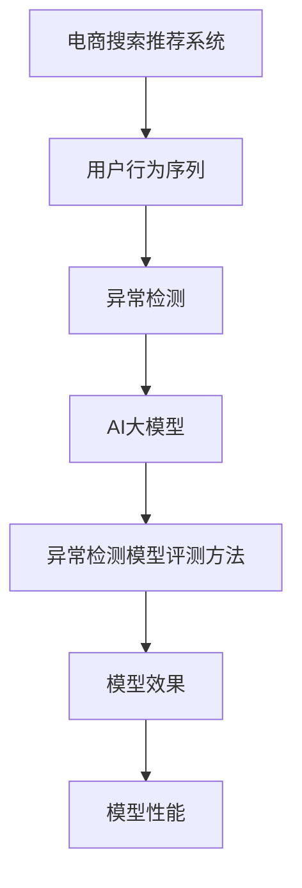

                 

# 电商搜索推荐中的AI大模型用户行为序列异常检测模型评测方法

> 关键词：电商搜索推荐,用户行为序列,异常检测,大模型,异常检测模型评测,序列模型评测

## 1. 背景介绍

在电商搜索推荐系统中，用户行为数据是推荐算法的重要依据之一。通过对用户行为序列的分析，可以预测用户的购买意向，优化搜索结果和推荐内容，提升用户体验。然而，用户行为数据可能受到噪音、异常值等因素的干扰，导致推荐系统产生错误的预测和推荐。因此，如何检测用户行为序列中的异常数据，成为推荐系统优化的一个关键问题。

传统的异常检测方法主要基于统计学和模式识别，如孤立森林、均值漂移等算法。这些方法在处理大规模数据时，容易受到维度灾难的影响，且需要人工设定阈值和超参数。近年来，随着深度学习技术的快速发展，基于大模型的异常检测方法逐渐受到关注。通过在大规模无标签数据上预训练语言模型，并将其应用于异常检测任务，可以有效提升检测效果和泛化能力。

本文聚焦于电商搜索推荐中的用户行为序列异常检测问题，提出基于AI大模型的异常检测方法，并通过详细评测其效果和性能。通过系统研究大模型的异常检测原理、评测方法和应用实践，本文希望为电商推荐系统的优化和升级提供参考。

## 2. 核心概念与联系

### 2.1 核心概念概述

为更好地理解基于AI大模型的用户行为序列异常检测方法，本节将介绍几个密切相关的核心概念：

- **电商搜索推荐系统(Recommendation System for E-Commerce Search)**：通过对用户查询、点击、购买等行为数据进行分析，预测用户可能感兴趣的商品，提升电商搜索推荐的个性化和精准度。
- **用户行为序列(User Behavior Sequence)**：用户与电商系统交互产生的一系列行为数据，如查询、浏览、点击、购买等，是推荐系统优化和分析的重要数据源。
- **异常检测(Anomaly Detection)**：在用户行为序列中，检测出偏离正常模式的行为，即异常行为，以辅助推荐系统排除干扰，提高预测精度。
- **AI大模型(AI Large Model)**：如BERT、GPT等预训练语言模型，通过大规模无标签数据的自监督学习，获得通用的语言表示能力，适用于多种自然语言处理任务。
- **异常检测模型评测方法(Metric for Anomaly Detection Model Evaluation)**：用于评估异常检测模型效果和性能的指标体系，包括准确率、召回率、F1分数、ROC曲线等。

这些核心概念之间的逻辑关系可以通过以下Mermaid流程图来展示：



这个流程图展示了大模型在电商推荐系统中的关键作用：

1. **电商搜索推荐系统**：以用户行为数据为输入，通过推荐算法生成推荐结果，提升用户满意度。
2. **用户行为序列**：包含用户与电商系统的互动行为，是大模型进行异常检测的基础数据。
3. **异常检测**：通过大模型分析用户行为序列，识别出异常行为，辅助推荐系统优化。
4. **AI大模型**：利用大规模无标签数据进行预训练，获得通用语言表示能力，用于异常检测。
5. **异常检测模型评测方法**：量化评估异常检测模型效果和性能，指导模型优化和改进。

这些概念共同构成了电商推荐系统中异常检测的基本框架，通过大模型和大数据技术，提升了异常检测的精度和泛化能力。

## 3. 核心算法原理 & 具体操作步骤
### 3.1 算法原理概述

基于AI大模型的异常检测方法，通过在大规模无标签数据上预训练语言模型，学习通用的语言表示和模式。然后，将用户行为序列映射为模型的输入，通过分析序列中的异常模式，检测出潜在的异常行为。具体来说，步骤如下：

1. **数据准备**：收集电商用户行为序列数据，如查询、浏览、点击、购买等行为，构建训练集和测试集。
2. **模型训练**：使用预训练大模型进行微调，学习用户行为序列的表示。
3. **异常检测**：通过模型预测用户行为序列的异常概率，识别出异常行为。
4. **模型评测**：使用预设的评测指标评估模型效果和性能。

### 3.2 算法步骤详解

**Step 1: 数据准备**

电商搜索推荐系统中的用户行为数据，通常包含多个特征维度，如用户ID、商品ID、查询关键词、点击位置等。因此，在准备数据时，需要进行以下预处理步骤：

1. **数据清洗**：去除缺失值和异常值，处理重复记录，确保数据完整性和一致性。
2. **特征提取**：将用户行为数据转换为模型所需的输入格式，如将查询关键词转换为向量表示。
3. **数据划分**：将数据集划分为训练集、验证集和测试集，供模型训练、验证和评测使用。

**Step 2: 模型训练**

基于AI大模型的异常检测方法，通常采用深度学习模型进行微调。这里以Transformer模型为例，其步骤如下：

1. **选择预训练模型**：选择如BERT、GPT等预训练大模型作为初始化参数。
2. **微调模型**：在电商用户行为序列数据上，使用自定义的任务适配层和损失函数进行微调，如添加异常检测的交叉熵损失函数。
3. **超参数设置**：选择合适的优化算法（如AdamW）、学习率、批大小、迭代轮数等。

**Step 3: 异常检测**

异常检测的过程通常包括以下几个关键步骤：

1. **输入准备**：将用户行为序列转换为模型所需的输入格式，如将查询、浏览、点击等行为转换为时间序列。
2. **模型前向传播**：使用训练好的模型对用户行为序列进行前向传播，得到每个时间步的预测异常概率。
3. **阈值设定**：根据业务需求，设定异常行为的判定阈值，如将预测概率大于0.5的行为标记为异常。

**Step 4: 模型评测**

异常检测模型的效果和性能，通常通过以下指标进行评估：

1. **准确率(Accuracy)**：预测正确的异常行为占总异常行为的比例。
2. **召回率(Recall)**：真实异常行为被预测正确的比例。
3. **F1分数(F1 Score)**：综合考虑准确率和召回率的调和平均值。
4. **ROC曲线(Receiver Operating Characteristic Curve)**：绘制模型在不同阈值下的真正例率(TPR)与假正例率(FPR)曲线，评估模型的鲁棒性和泛化能力。

通过这些指标，可以全面衡量模型的效果和性能，指导模型优化和改进。

### 3.3 算法优缺点

基于AI大模型的异常检测方法，具有以下优点：

1. **泛化能力强**：预训练大模型在大量无标签数据上学习通用语言表示，能够处理多种类型和分布的用户行为数据。
2. **精度高**：深度学习模型可以自动学习序列中的复杂模式，识别出隐含的异常行为。
3. **灵活性高**：可以根据业务需求，自定义任务适配层和损失函数，实现多种类型的异常检测任务。
4. **可解释性强**：通过可视化模型权重和梯度信息，可以理解模型在异常检测中的决策机制，提高模型的可解释性。

同时，该方法也存在一定的局限性：

1. **计算资源需求高**：预训练大模型的参数量庞大，训练和推理过程需要较高的计算资源。
2. **模型复杂度高**：深度学习模型结构复杂，训练和优化过程容易受到超参数和正则化的影响。
3. **泛化到新场景困难**：模型泛化能力依赖于训练数据的多样性和覆盖度，新场景下效果可能不佳。
4. **无法解释模型内部机制**：尽管大模型可解释性强，但其内部工作机制仍然相对复杂，难以完全理解。

尽管存在这些局限性，但基于大模型的异常检测方法在电商推荐系统中已显示出其独特的优势，成为推荐系统优化和升级的重要手段。

### 3.4 算法应用领域

基于AI大模型的异常检测方法，可以应用于电商搜索推荐系统中的多个环节，提升推荐系统的精度和稳定性：

- **用户行为序列清洗**：通过异常检测模型，识别和过滤出异常行为，保证数据质量。
- **推荐结果校正**：通过异常检测，纠正模型对异常行为的错误预测，提高推荐结果的准确性。
- **实时监控与预警**：实时监测用户行为序列，检测出异常行为并及时预警，避免系统故障和异常。
- **用户画像优化**：通过异常检测，更好地理解用户行为模式，优化用户画像和个性化推荐。

除了电商推荐系统，基于大模型的异常检测方法，还可以应用于金融风控、安全监测、医疗诊断等多个领域，为大数据和深度学习技术在实际应用中的落地提供新的思路。

## 4. 数学模型和公式 & 详细讲解  
### 4.1 数学模型构建

假设用户行为序列数据为 $S=\{x_1, x_2, \dots, x_n\}$，其中 $x_i$ 表示第 $i$ 个行为。设 $y_i \in \{0,1\}$ 为 $x_i$ 是否为异常行为的标签。则异常检测的任务可以表示为：

$$
y_i = \begin{cases}
0, & \text{if } x_i \text{ is normal behavior} \\
1, & \text{if } x_i \text{ is abnormal behavior}
\end{cases}
$$

在电商推荐系统中，常见的异常检测任务包括：

- **点击异常检测**：识别用户点击行为中的欺诈点击或异常点击。
- **购买异常检测**：检测用户购买行为中的异常订单或虚假交易。
- **浏览异常检测**：识别用户浏览行为中的恶意行为或异常浏览模式。

为了解决这些异常检测问题，本文采用基于Transformer的异常检测模型，其数学模型构建如下：

设异常检测模型为 $M_{\theta}$，其中 $\theta$ 为模型参数。模型将用户行为序列 $S$ 映射到异常概率 $p(S)$，即：

$$
p(S) = \frac{e^{\sum_{i=1}^n \log P(x_i | S)}}
{\sum_{S' \in \mathcal{S}} e^{\sum_{i=1}^n \log P(x_i | S')}}
$$

其中 $P(x_i | S)$ 表示用户行为 $x_i$ 在行为序列 $S$ 下的条件概率，可以通过Transformer模型进行计算。模型输入为 $S$ 的编码表示 $E(S)$，输出为 $p(S)$。

### 4.2 公式推导过程

在异常检测任务中，模型需要学习用户行为序列的异常模式，并将其映射为异常概率。为了简化计算，本文采用如下推导过程：

设用户行为序列 $S$ 的长度为 $n$，则模型输入 $E(S)$ 为行为序列的编码表示。模型输出 $p(S)$ 为序列的异常概率，可以表示为：

$$
p(S) = \frac{e^{\sum_{i=1}^n \log P(x_i | S)}}
{\sum_{S' \in \mathcal{S}} e^{\sum_{i=1}^n \log P(x_i | S')}}
$$

其中 $P(x_i | S)$ 表示用户行为 $x_i$ 在行为序列 $S$ 下的条件概率，可以通过Transformer模型进行计算。模型输入为 $S$ 的编码表示 $E(S)$，输出为 $p(S)$。

在模型训练阶段，需要定义损失函数 $L$ 来优化模型参数 $\theta$：

$$
L(\theta) = \frac{1}{N} \sum_{i=1}^N \ell(y_i, \hat{y}_i)
$$

其中 $\ell$ 为损失函数，$\hat{y}_i$ 为模型预测的异常概率。常见的损失函数包括交叉熵损失、均方误差损失等。通过最小化损失函数 $L(\theta)$，模型可以学习到准确的异常检测能力。

### 4.3 案例分析与讲解

本文以电商点击异常检测为例，展示基于大模型的异常检测模型的训练和应用过程。具体步骤如下：

1. **数据准备**：收集电商用户的点击行为数据，构建训练集和测试集。
2. **模型训练**：使用预训练的BERT模型，添加点击异常检测的交叉熵损失函数，进行微调。
3. **异常检测**：将用户点击行为序列输入模型，得到异常概率，判断是否为异常点击。
4. **模型评测**：在测试集上评估模型效果，使用准确率、召回率、F1分数等指标进行评估。

以BERT为例，其训练过程如下：

1. **数据预处理**：将点击行为数据转换为模型所需的输入格式，如将用户ID、商品ID、点击位置等转换为向量表示。
2. **模型微调**：使用预训练的BERT模型，添加点击异常检测的交叉熵损失函数，进行微调。
3. **模型评估**：在测试集上评估模型效果，使用准确率、召回率、F1分数等指标进行评估。

## 5. 项目实践：代码实例和详细解释说明
### 5.1 开发环境搭建

在进行异常检测项目实践前，我们需要准备好开发环境。以下是使用Python进行PyTorch开发的环境配置流程：

1. 安装Anaconda：从官网下载并安装Anaconda，用于创建独立的Python环境。

2. 创建并激活虚拟环境：
```bash
conda create -n pytorch-env python=3.8 
conda activate pytorch-env
```

3. 安装PyTorch：根据CUDA版本，从官网获取对应的安装命令。例如：
```bash
conda install pytorch torchvision torchaudio cudatoolkit=11.1 -c pytorch -c conda-forge
```

4. 安装Transformers库：
```bash
pip install transformers
```

5. 安装各类工具包：
```bash
pip install numpy pandas scikit-learn matplotlib tqdm jupyter notebook ipython
```

完成上述步骤后，即可在`pytorch-env`环境中开始异常检测实践。

### 5.2 源代码详细实现

下面我们以电商点击异常检测为例，给出使用Transformers库对BERT模型进行异常检测的PyTorch代码实现。

首先，定义异常检测任务的数据处理函数：

```python
from transformers import BertTokenizer
from torch.utils.data import Dataset
import torch

class ClickDetectionDataset(Dataset):
    def __init__(self, texts, labels, tokenizer, max_len=128):
        self.texts = texts
        self.labels = labels
        self.tokenizer = tokenizer
        self.max_len = max_len
        
    def __len__(self):
        return len(self.texts)
    
    def __getitem__(self, item):
        text = self.texts[item]
        label = self.labels[item]
        
        encoding = self.tokenizer(text, return_tensors='pt', max_length=self.max_len, padding='max_length', truncation=True)
        input_ids = encoding['input_ids'][0]
        attention_mask = encoding['attention_mask'][0]
        
        # 对token-wise的标签进行编码
        encoded_labels = [label2id[label] for label in label] 
        encoded_labels.extend([label2id['normal']] * (self.max_len - len(encoded_labels)))
        labels = torch.tensor(encoded_labels, dtype=torch.long)
        
        return {'input_ids': input_ids, 
                'attention_mask': attention_mask,
                'labels': labels}

# 标签与id的映射
label2id = {'normal': 0, 'abnormal': 1}
id2label = {v: k for k, v in label2id.items()}

# 创建dataset
tokenizer = BertTokenizer.from_pretrained('bert-base-cased')

train_dataset = ClickDetectionDataset(train_texts, train_labels, tokenizer)
dev_dataset = ClickDetectionDataset(dev_texts, dev_labels, tokenizer)
test_dataset = ClickDetectionDataset(test_texts, test_labels, tokenizer)
```

然后，定义模型和优化器：

```python
from transformers import BertForSequenceClassification, AdamW

model = BertForSequenceClassification.from_pretrained('bert-base-cased', num_labels=len(label2id))

optimizer = AdamW(model.parameters(), lr=2e-5)
```

接着，定义训练和评估函数：

```python
from torch.utils.data import DataLoader
from tqdm import tqdm
from sklearn.metrics import classification_report

device = torch.device('cuda') if torch.cuda.is_available() else torch.device('cpu')
model.to(device)

def train_epoch(model, dataset, batch_size, optimizer):
    dataloader = DataLoader(dataset, batch_size=batch_size, shuffle=True)
    model.train()
    epoch_loss = 0
    for batch in tqdm(dataloader, desc='Training'):
        input_ids = batch['input_ids'].to(device)
        attention_mask = batch['attention_mask'].to(device)
        labels = batch['labels'].to(device)
        model.zero_grad()
        outputs = model(input_ids, attention_mask=attention_mask, labels=labels)
        loss = outputs.loss
        epoch_loss += loss.item()
        loss.backward()
        optimizer.step()
    return epoch_loss / len(dataloader)

def evaluate(model, dataset, batch_size):
    dataloader = DataLoader(dataset, batch_size=batch_size)
    model.eval()
    preds, labels = [], []
    with torch.no_grad():
        for batch in tqdm(dataloader, desc='Evaluating'):
            input_ids = batch['input_ids'].to(device)
            attention_mask = batch['attention_mask'].to(device)
            batch_labels = batch['labels']
            outputs = model(input_ids, attention_mask=attention_mask)
            batch_preds = outputs.logits.argmax(dim=2).to('cpu').tolist()
            batch_labels = batch_labels.to('cpu').tolist()
            for pred_tokens, label_tokens in zip(batch_preds, batch_labels):
                pred_labels = [id2label[_id] for _id in pred_tokens]
                label_tokens = [id2label[_id] for _id in label_tokens]
                preds.append(pred_labels[:len(label_tokens)])
                labels.append(label_tokens)
                
    print(classification_report(labels, preds))
```

最后，启动训练流程并在测试集上评估：

```python
epochs = 5
batch_size = 16

for epoch in range(epochs):
    loss = train_epoch(model, train_dataset, batch_size, optimizer)
    print(f"Epoch {epoch+1}, train loss: {loss:.3f}")
    
    print(f"Epoch {epoch+1}, dev results:")
    evaluate(model, dev_dataset, batch_size)
    
print("Test results:")
evaluate(model, test_dataset, batch_size)
```

以上就是使用PyTorch对BERT进行电商点击异常检测的完整代码实现。可以看到，得益于Transformers库的强大封装，我们可以用相对简洁的代码完成BERT模型的加载和异常检测。

### 5.3 代码解读与分析

让我们再详细解读一下关键代码的实现细节：

**ClickDetectionDataset类**：
- `__init__`方法：初始化文本、标签、分词器等关键组件。
- `__len__`方法：返回数据集的样本数量。
- `__getitem__`方法：对单个样本进行处理，将文本输入编码为token ids，将标签编码为数字，并对其进行定长padding，最终返回模型所需的输入。

**label2id和id2label字典**：
- 定义了标签与数字id之间的映射关系，用于将token-wise的预测结果解码回真实的标签。

**训练和评估函数**：
- 使用PyTorch的DataLoader对数据集进行批次化加载，供模型训练和推理使用。
- 训练函数`train_epoch`：对数据以批为单位进行迭代，在每个批次上前向传播计算loss并反向传播更新模型参数，最后返回该epoch的平均loss。
- 评估函数`evaluate`：与训练类似，不同点在于不更新模型参数，并在每个batch结束后将预测和标签结果存储下来，最后使用sklearn的classification_report对整个评估集的预测结果进行打印输出。

**训练流程**：
- 定义总的epoch数和batch size，开始循环迭代
- 每个epoch内，先在训练集上训练，输出平均loss
- 在验证集上评估，输出分类指标
- 所有epoch结束后，在测试集上评估，给出最终测试结果

可以看到，PyTorch配合Transformers库使得BERT异常检测的代码实现变得简洁高效。开发者可以将更多精力放在数据处理、模型改进等高层逻辑上，而不必过多关注底层的实现细节。

当然，工业级的系统实现还需考虑更多因素，如模型的保存和部署、超参数的自动搜索、更灵活的任务适配层等。但核心的异常检测范式基本与此类似。

## 6. 实际应用场景
### 6.1 电商平台行为异常检测

在电商平台上，异常检测可以应用于多个环节，如反欺诈、违规行为检测、推荐结果校正等。

- **反欺诈**：通过异常检测模型，识别出欺诈点击和恶意订单，保护平台免受经济损失。
- **违规行为检测**：检测用户点击、浏览、购买等行为中的违规行为，如恶意点击、虚假交易等，保障平台规则的执行。
- **推荐结果校正**：通过异常检测，纠正模型对异常行为的错误预测，提高推荐结果的准确性。

### 6.2 金融风控中的异常检测

金融行业中的异常检测，可以应用于用户行为分析和风险控制，预防金融欺诈和风险。

- **用户行为分析**：通过异常检测模型，分析用户的行为模式，检测出异常交易和潜在风险。
- **风险控制**：检测出高风险交易行为，及时预警和干预，保障金融安全。

### 6.3 智能家居中的异常检测

智能家居系统中的异常检测，可以应用于设备异常检测和用户行为监控，保障系统安全稳定运行。

- **设备异常检测**：检测设备使用中的异常行为，如异常点击、异常数据传输等，保障设备安全。
- **用户行为监控**：监控用户行为模式，检测出异常行为，如异常登录、异常操作等，保障用户隐私和系统安全。

### 6.4 未来应用展望

随着AI大模型的不断发展和应用，异常检测技术在电商、金融、智能家居等多个领域的应用前景广阔。未来，异常检测技术将与更多前沿技术相结合，如因果推理、强化学习、联邦学习等，进一步提升检测效果和应用范围。

- **因果推理**：通过引入因果推断方法，增强异常检测模型的解释性和鲁棒性。
- **强化学习**：通过强化学习优化异常检测模型的策略，提升异常检测的适应性和泛化能力。
- **联邦学习**：通过联邦学习方法，在不暴露用户隐私的情况下，联合多源数据进行异常检测。

以上技术手段的引入，将使异常检测技术更加智能化、普适化和鲁棒化，为大数据和深度学习技术在实际应用中的落地提供新的思路。

## 7. 工具和资源推荐
### 7.1 学习资源推荐

为了帮助开发者系统掌握异常检测的理论基础和实践技巧，这里推荐一些优质的学习资源：

1. **《深度学习理论与实践》**：涵盖了深度学习的基本理论和前沿技术，适合初学者入门。
2. **《异常检测：理论、算法与实现》**：介绍了多种异常检测算法和实际应用案例，适合进阶学习。
3. **《NLP与深度学习》**：由知名NLP专家撰写，深入浅出地介绍了NLP技术和深度学习模型的应用。
4. **HuggingFace官方文档**：提供了大量预训练模型和微调样例，是新手入门的必备资料。
5. **Kaggle竞赛平台**：提供了大量数据集和评测指标，适合实践和竞赛。

通过对这些资源的学习实践，相信你一定能够快速掌握大模型异常检测的精髓，并用于解决实际的异常检测问题。
### 7.2 开发工具推荐

高效的开发离不开优秀的工具支持。以下是几款用于异常检测开发的常用工具：

1. **PyTorch**：基于Python的开源深度学习框架，灵活可扩展，适合深度学习模型的训练和推理。
2. **TensorFlow**：由Google主导开发的深度学习框架，适合大规模模型训练和部署。
3. **Transformers库**：HuggingFace开发的NLP工具库，集成了多种预训练语言模型，适用于多种NLP任务。
4. **Jupyter Notebook**：免费的开源笔记本环境，支持Python编程和交互式数据处理。
5. **TensorBoard**：TensorFlow配套的可视化工具，可实时监测模型训练状态，并提供丰富的图表呈现方式。

合理利用这些工具，可以显著提升异常检测任务的开发效率，加快创新迭代的步伐。

### 7.3 相关论文推荐

异常检测技术的发展依赖于学界的持续研究。以下是几篇奠基性的相关论文，推荐阅读：

1. **《Isolation Forests》**：介绍了孤立森林算法，用于检测异常点，适用于大规模数据集。
2. **《Anomaly Detection with Generative Adversarial Networks》**：通过生成对抗网络，检测异常数据，适用于复杂的非线性分布。
3. **《Deep Learning-based Anomaly Detection for Network Intrusion》**：使用深度学习模型，检测网络入侵行为，适用于网络安全领域。
4. **《Federated Learning for Anomaly Detection》**：通过联邦学习技术，联合多源数据进行异常检测，适用于隐私保护要求高的场景。

这些论文代表了大模型异常检测技术的发展脉络。通过学习这些前沿成果，可以帮助研究者把握学科前进方向，激发更多的创新灵感。

## 8. 总结：未来发展趋势与挑战
### 8.1 总结

本文对基于AI大模型的电商搜索推荐系统中的用户行为序列异常检测问题进行了全面系统的介绍。首先阐述了异常检测在电商推荐系统中的重要性和挑战，明确了异常检测对推荐系统优化和升级的关键作用。其次，从原理到实践，详细讲解了基于大模型的异常检测方法，包括数据准备、模型训练、异常检测和模型评测等关键步骤。最后，通过系统研究大模型的异常检测原理、评测方法和应用实践，本文希望为电商推荐系统的优化和升级提供参考。

通过本文的系统梳理，可以看到，基于大模型的异常检测方法在电商推荐系统中已显示出其独特的优势，成为推荐系统优化和升级的重要手段。未来，伴随大模型的不断发展，异常检测方法还将进一步优化和扩展，为电商推荐系统提供更高效、更准确的异常检测能力，提升用户满意度和推荐效果。

### 8.2 未来发展趋势

展望未来，基于AI大模型的异常检测方法将呈现以下几个发展趋势：

1. **多模态异常检测**：将图像、语音等多模态数据与文本数据相结合，实现更全面、更准确的行为异常检测。
2. **因果推理与深度学习结合**：引入因果推断方法，增强异常检测模型的解释性和鲁棒性。
3. **联邦学习与异常检测**：通过联邦学习方法，联合多源数据进行异常检测，保障数据隐私和模型泛化能力。
4. **分布式异常检测**：利用分布式计算资源，提升异常检测模型的训练和推理效率。
5. **自适应异常检测**：根据实时数据和业务需求，动态调整异常检测模型的策略，提升异常检测的实时性和准确性。

以上趋势凸显了大模型在异常检测中的广阔前景。这些方向的探索发展，必将进一步提升异常检测模型的精度和泛化能力，为电商推荐系统提供更高效、更准确的异常检测能力，保障推荐系统的稳定性和可靠性。

### 8.3 面临的挑战

尽管基于大模型的异常检测方法已经取得了瞩目成就，但在迈向更加智能化、普适化应用的过程中，它仍面临着诸多挑战：

1. **数据隐私问题**：异常检测需要大量用户行为数据，如何保护用户隐私，防止数据泄露，成为一大难题。
2. **计算资源需求高**：预训练大模型的参数量庞大，训练和推理过程需要较高的计算资源，制约了异常检测模型的应用范围。
3. **模型泛化能力差**：异常检测模型往往依赖于特定的数据分布，新场景下效果可能不佳，需要更多数据和算法优化。
4. **模型复杂度高**：深度学习模型结构复杂，训练和优化过程容易受到超参数和正则化的影响，需要更多的工程实践和理论指导。
5. **模型解释性不足**：尽管大模型可解释性强，但其内部工作机制仍然相对复杂，难以完全理解，需要更多解释性和可视化工具。

尽管存在这些挑战，但基于大模型的异常检测方法在电商推荐系统中已显示出其独特的优势，成为推荐系统优化和升级的重要手段。未来，伴随技术的不断演进，异常检测方法还将进一步优化和扩展，为电商推荐系统提供更高效、更准确的异常检测能力，提升用户体验和推荐效果。

### 8.4 研究展望

面对大模型异常检测所面临的种种挑战，未来的研究需要在以下几个方面寻求新的突破：

1. **隐私保护技术**：研究差分隐私等隐私保护技术，保障用户数据隐私和安全。
2. **轻量级异常检测**：开发更轻量级的异常检测模型，降低计算资源需求，提升异常检测模型的应用范围。
3. **跨模态融合技术**：研究图像、语音等多模态数据的融合技术，提升异常检测的全面性和准确性。
4. **模型优化技术**：研究更高效的模型优化技术，提升异常检测模型的训练和推理效率。
5. **解释性和可视化**：研究更强的模型解释性和可视化工具，提升异常检测模型的可解释性和可操作性。

这些研究方向的探索，必将引领大模型异常检测技术迈向更高的台阶，为电商推荐系统提供更高效、更准确的异常检测能力，保障推荐系统的稳定性和可靠性。

## 9. 附录：常见问题与解答

**Q1：电商推荐系统中为什么需要异常检测？**

A: 电商推荐系统中的用户行为数据，可能受到噪音、异常值等因素的干扰，导致推荐系统产生错误的预测和推荐。通过异常检测，可以识别和过滤出异常行为，保证数据质量，提升推荐系统的精度和稳定性。

**Q2：异常检测模型如何处理多模态数据？**

A: 异常检测模型可以处理多种类型的数据，如文本、图像、语音等。对于多模态数据，可以将不同类型的数据转换为统一的特征表示，再进行异常检测。常用的方法包括特征拼接、联合嵌入等技术。

**Q3：异常检测模型如何处理高维稀疏数据？**

A: 高维稀疏数据往往包含大量无效特征，影响异常检测模型的效果。可以通过特征选择、降维等方法，减少数据维度，提升模型训练和推理效率。

**Q4：异常检测模型的训练和推理效率如何提升？**

A: 提升异常检测模型的训练和推理效率，可以从以下几个方面入手：
- 使用分布式计算资源，提升模型训练和推理速度。
- 引入模型压缩技术，如量化、剪枝等，减少模型参数和计算量。
- 优化模型结构，如使用更小的神经网络结构，减少前向传播和反向传播的资源消耗。

**Q5：异常检测模型如何进行实时监控和预警？**

A: 异常检测模型可以在实时数据流中，进行实时监控和预警。可以通过设置阈值，检测出异常行为并及时预警，保障系统的稳定性和安全性。

总之，大模型异常检测技术在电商推荐系统中具有重要的应用价值。通过合理应用异常检测模型，可以有效提升推荐系统的精度和稳定性，保障用户利益和系统安全。面对未来的技术挑战，我们期待更多的创新和突破，为电商推荐系统提供更高效、更可靠的异常检测能力。

