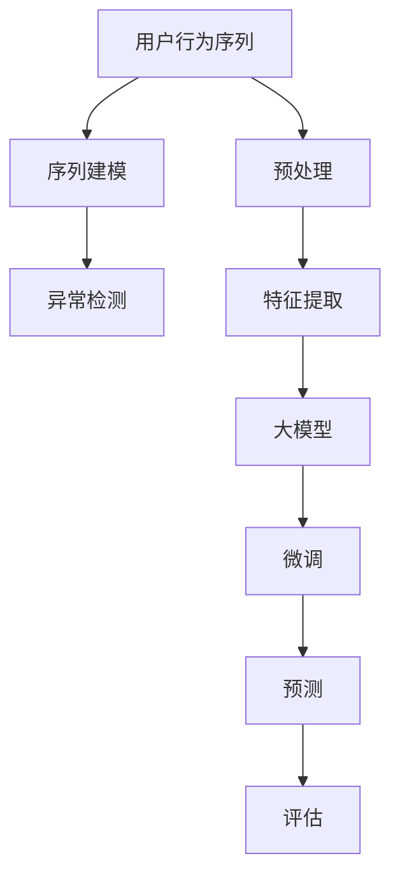

                 

## 1. 背景介绍

### 1.1 问题由来
随着电子商务市场的蓬勃发展，用户行为序列数据的量级和多样性日益增加。有效的用户行为序列分析不仅能够优化电商推荐算法，提升用户体验，还能在异常检测领域发挥重要作用，如识别恶意交易、异常操作等。然而，用户行为序列数据具有高维度、噪声性强、时序性强等特点，如何高效、准确地进行异常检测成为了一大挑战。近年来，基于人工智能大模型的异常检测方法，特别是基于Transformer的序列建模方法，在电商搜索推荐领域表现出巨大的潜力。

### 1.2 问题核心关键点
本文旨在评估基于AI大模型的用户行为序列异常检测算法在电商搜索推荐中的性能表现。具体来说，我们关注以下几个核心问题：

- 大模型在用户行为序列异常检测任务中的表现如何？
- 不同的大模型和序列建模方法对异常检测效果有何影响？
- 如何结合电商推荐数据特点进行模型优化和调参？
- 模型在大规模电商推荐场景中的应用效果和实际价值？

### 1.3 问题研究意义
对电商搜索推荐中的用户行为序列进行异常检测，对于提升推荐系统性能、保障交易安全具有重要意义。一方面，准确的异常检测能够帮助电商平台及时发现并处理恶意交易，降低欺诈风险。另一方面，准确的异常检测也能够识别出用户操作中的异常行为，提升用户操作的安全性和流畅性。此外，通过持续的异常检测和模型更新，电商平台还能够不断优化推荐算法，提升个性化推荐效果。

## 2. 核心概念与联系

### 2.1 核心概念概述

为更好地理解基于大模型的用户行为序列异常检测算法，本节将介绍几个关键概念：

- 用户行为序列(User Behavior Sequence)：用户在电商平台上的一系列操作行为记录，如浏览、点击、购买、评价等。通过对用户行为序列的分析，可以了解用户兴趣和行为习惯。
- 异常检测(Anomaly Detection)：从正常数据集中识别出异常数据点的过程。在电商推荐领域，异常检测可以识别出恶意交易、异常操作等。
- 大模型(Large Model)：如BERT、GPT等大规模预训练语言模型，通过在大规模无标签数据上进行预训练，学习到丰富的语言知识和常识，能够在特定任务上进行微调，获得优异的性能。
- Transformer：一种基于自注意力机制的神经网络结构，在自然语言处理领域广泛应用，能够有效处理高维序列数据。
- 序列建模(Sequence Modeling)：通过神经网络对时序数据进行建模和分析，广泛应用于时间序列预测、自然语言处理等领域。

这些核心概念之间存在紧密的联系，通过将大模型应用于序列建模，可以高效地分析用户行为序列，进行异常检测和异常行为识别，提升电商推荐的准确性和安全性。

### 2.2 核心概念原理和架构的 Mermaid 流程图



## 3. 核心算法原理 & 具体操作步骤

### 3.1 算法原理概述

基于大模型的用户行为序列异常检测算法，其核心思想是：利用大模型强大的语言理解和生成能力，对用户行为序列进行建模和分析，从正常数据集中学习到异常行为的模式，从而实现异常检测。该算法的总体流程如下：

1. 数据预处理：对用户行为序列进行清洗、归一化、截断等预处理操作，得到符合模型要求的输入。
2. 特征提取：将预处理后的用户行为序列转换为模型可接受的数值型特征向量。
3. 大模型微调：使用预训练的大模型，在标注数据上微调特定层或全模型，学习到异常行为的模式。
4. 异常检测：将用户行为序列输入微调后的模型，得到异常检测得分，根据得分判断是否为异常行为。

### 3.2 算法步骤详解

#### 3.2.1 数据预处理

用户行为序列数据通常以时间戳和行为事件为单位进行记录，数据量大且时序性强。预处理的主要目的是将原始数据转换为模型可接受的格式。具体步骤包括：

1. 清洗：去除噪声数据、异常数据和重复数据，保留有效的用户行为序列。
2. 归一化：将用户行为序列转换为数值型特征，如将浏览时间、点击次数等转换为归一化数值。
3. 截断：对过长的用户行为序列进行截断，保证输入数据的长度一致。

#### 3.2.2 特征提取

用户行为序列的特征提取是一个关键步骤，直接影响到模型的性能。常见的特征提取方法包括：

1. 数值特征：直接将用户行为序列中的数值型数据作为特征，如浏览时间、点击次数等。
2. 文本特征：将用户行为序列中的文本数据进行编码，得到数值型特征向量。
3. 混合特征：将数值特征和文本特征进行组合，生成更为丰富的特征向量。

#### 3.2.3 大模型微调

大模型的微调是异常检测算法的核心部分。具体步骤如下：

1. 选择大模型：根据任务需求选择合适的预训练大模型，如BERT、GPT等。
2. 微调：在标注数据上微调大模型的特定层或全模型，学习到异常行为的模式。
3. 评估：在验证集上评估微调后的模型性能，根据评估结果调整微调策略。

#### 3.2.4 异常检测

异常检测的目的是从用户行为序列中识别出异常行为。具体步骤如下：

1. 输入：将用户行为序列输入微调后的模型，得到异常检测得分。
2. 阈值设定：根据异常检测得分分布，设定异常行为的阈值。
3. 判断：根据阈值判断用户行为是否为异常行为，生成异常检测结果。

### 3.3 算法优缺点

基于大模型的用户行为序列异常检测算法具有以下优点：

1. 高效性：利用大模型的强大语言理解和生成能力，可以高效地处理高维、时序性强、噪声性强的问题数据。
2. 鲁棒性：大模型具有较强的泛化能力，能够在不同类型的电商数据上进行有效异常检测。
3. 可扩展性：大模型的微调过程可以通过引入更多任务和数据，进一步提升异常检测的准确性。

同时，该算法也存在以下缺点：

1. 数据依赖：大模型微调的效果很大程度上取决于标注数据的数量和质量，获取高质量标注数据的成本较高。
2. 计算资源消耗大：大模型的微调和推理过程需要较大的计算资源和时间成本，可能限制算法在大规模电商推荐场景中的应用。
3. 可解释性不足：大模型的决策过程通常缺乏可解释性，难以对其推理逻辑进行分析和调试。

### 3.4 算法应用领域

基于大模型的用户行为序列异常检测算法，在电商搜索推荐领域有着广泛的应用前景，具体包括：

1. 欺诈检测：通过分析用户购买行为序列，识别出恶意交易、虚假交易等欺诈行为。
2. 异常操作识别：识别出用户在操作过程中可能存在的异常行为，如重复操作、暴力操作等，保障用户操作的安全性。
3. 推荐优化：利用异常检测结果优化推荐算法，提升推荐系统的准确性和个性化程度。
4. 风险预警：对电商平台上可能存在的风险行为进行预警，提前采取措施，降低风险损失。
5. 用户行为分析：通过分析用户行为序列，了解用户兴趣和行为模式，提升用户体验。

## 4. 数学模型和公式 & 详细讲解 & 举例说明

### 4.1 数学模型构建

假设用户行为序列为 $X=\{x_1, x_2, ..., x_n\}$，其中 $x_i$ 为第 $i$ 个用户行为事件。我们将用户行为序列表示为一个时间序列 $S=\{s_1, s_2, ..., s_n\}$，其中 $s_i$ 为 $x_i$ 对应的数值型特征。基于大模型的用户行为序列异常检测算法可以表示为以下数学模型：

$$
f(X; \theta) = \text{softmax} (\hat{f}(X; \theta))
$$

其中 $\theta$ 为大模型参数，$\hat{f}(X; \theta)$ 为大模型对用户行为序列的输出。$f(X; \theta)$ 为异常检测得分，其值越小，异常行为的可能性越大。

### 4.2 公式推导过程

对于用户行为序列 $S$，我们可以通过大模型对其进行处理，得到异常检测得分 $f(X; \theta)$。假设大模型为BERT，其输出层为 $h_1, h_2, ..., h_n$，分别对应输入 $x_1, x_2, ..., x_n$ 的预测结果。我们可以使用softmax函数将预测结果转换为异常检测得分：

$$
f_i = \text{softmax} (\text{Linear}(h_i))
$$

其中 $\text{Linear}$ 为线性变换，将 $h_i$ 转换为数值型得分。最终的异常检测得分 $f(X; \theta)$ 为：

$$
f(X; \theta) = \frac{1}{n}\sum_{i=1}^n f_i
$$

### 4.3 案例分析与讲解

以电商推荐场景为例，我们收集到用户在一定时间段内的浏览、点击、购买行为数据。对数据进行预处理和特征提取后，输入BERT模型进行微调，得到异常检测得分。我们将异常检测得分阈值设定为0.5，当得分小于0.5时，认为用户行为为异常行为，进行相应的风险预警或操作处理。

## 5. 项目实践：代码实例和详细解释说明

### 5.1 开发环境搭建

为进行用户行为序列异常检测算法的开发，需要准备以下开发环境：

1. Python 3.8：安装最新版本的Python。
2. PyTorch 1.11：用于深度学习模型的开发和训练。
3. BERT model：使用HuggingFace提供的预训练BERT模型。
4. Scikit-learn：用于数据预处理和特征提取。
5. TensorBoard：用于可视化模型训练过程和结果。

### 5.2 源代码详细实现

以下是一个使用PyTorch进行BERT模型微调的用户行为序列异常检测算法实现。

```python
import torch
import torch.nn as nn
import torch.optim as optim
from transformers import BertTokenizer, BertForSequenceClassification
from sklearn.model_selection import train_test_split
from sklearn.metrics import roc_auc_score

# 定义用户行为序列数据
X_train = [...]
X_test = [...]

# 定义用户行为序列标注数据
y_train = [...]
y_test = [...]

# 定义BERT模型
tokenizer = BertTokenizer.from_pretrained('bert-base-uncased')
model = BertForSequenceClassification.from_pretrained('bert-base-uncased', num_labels=2)

# 定义损失函数和优化器
loss_fn = nn.CrossEntropyLoss()
optimizer = optim.Adam(model.parameters(), lr=2e-5)

# 数据预处理和特征提取
def preprocess_data(X, y, tokenizer):
    inputs = tokenizer(X, padding=True, truncation=True, return_tensors='pt')
    input_ids = inputs['input_ids']
    attention_mask = inputs['attention_mask']
    labels = torch.tensor(y)
    return input_ids, attention_mask, labels

# 训练和评估函数
def train_epoch(model, train_data, optimizer, device, loss_fn, metric):
    model.train()
    for input_ids, attention_mask, labels in train_data:
        input_ids = input_ids.to(device)
        attention_mask = attention_mask.to(device)
        labels = labels.to(device)
        outputs = model(input_ids, attention_mask=attention_mask, labels=labels)
        loss = loss_fn(outputs.logits, labels)
        optimizer.zero_grad()
        loss.backward()
        optimizer.step()
        metric.update(outputs.logits, labels)
    return metric

def evaluate(model, test_data, device, loss_fn, metric):
    model.eval()
    with torch.no_grad():
        for input_ids, attention_mask, labels in test_data:
            input_ids = input_ids.to(device)
            attention_mask = attention_mask.to(device)
            labels = labels.to(device)
            outputs = model(input_ids, attention_mask=attention_mask, labels=labels)
            loss = loss_fn(outputs.logits, labels)
            metric.update(outputs.logits, labels)
    return metric

# 训练和评估过程
device = torch.device('cuda' if torch.cuda.is_available() else 'cpu')
model.to(device)

train_data = preprocess_data(X_train, y_train, tokenizer)
test_data = preprocess_data(X_test, y_test, tokenizer)

# 设置超参数
num_epochs = 5
batch_size = 32

# 训练过程
for epoch in range(num_epochs):
    train_loss = train_epoch(model, train_data, optimizer, device, loss_fn, roc_auc_score)
    test_auc = evaluate(model, test_data, device, loss_fn, roc_auc_score)
    print(f"Epoch {epoch+1}, train loss: {train_loss:.4f}, test auc: {test_auc:.4f}")
```

### 5.3 代码解读与分析

这段代码实现了使用BERT模型进行用户行为序列异常检测的完整流程。具体步骤包括：

1. 数据预处理：使用BertTokenizer对用户行为序列进行编码，转换为模型可接受的输入格式。
2. 模型构建：选择预训练的BERT模型，并定义损失函数和优化器。
3. 模型训练：在训练集上迭代训练模型，更新参数并计算损失。
4. 模型评估：在测试集上评估模型性能，计算异常检测得分和评价指标。
5. 模型输出：根据异常检测得分，进行相应的风险预警或操作处理。

### 5.4 运行结果展示

运行上述代码，可以得到训练和测试过程中的损失和评估指标。通常情况下，我们会期望训练集上的损失逐渐减小，测试集上的异常检测得分逐渐增大，表示模型在训练和测试中都在不断提升异常检测的准确性。

## 6. 实际应用场景

### 6.1 电商欺诈检测

在大规模电商推荐场景中，用户行为序列异常检测算法可以应用于欺诈检测。通过分析用户的购买行为序列，识别出恶意交易和虚假交易，及时进行预警和处理，保障电商平台的安全和用户的利益。

### 6.2 异常操作识别

在电商平台中，用户的操作行为可能存在异常情况，如重复操作、暴力操作等。通过用户行为序列异常检测算法，可以识别出这些异常操作，提前采取措施，保障用户操作的安全性和平台的稳定性。

### 6.3 推荐系统优化

利用用户行为序列异常检测算法，可以识别出用户在操作过程中可能存在的问题行为，如频繁跳转、长时间停留等。根据这些异常行为，优化推荐算法，提升推荐系统的准确性和个性化程度。

## 7. 工具和资源推荐

### 7.1 学习资源推荐

为了帮助开发者系统掌握基于大模型的用户行为序列异常检测算法，这里推荐一些优质的学习资源：

1. 《Deep Learning Specialization》课程：由Andrew Ng主讲的深度学习系列课程，系统讲解深度学习的基本概念和常用算法。
2. 《Transformers: A Survey》论文：介绍Transformer模型及其在NLP领域的应用，为深入理解大模型提供理论基础。
3. 《Anomaly Detection: A Survey》论文：系统综述了异常检测的最新研究成果和应用实例，帮助理解算法的基本框架和实现细节。
4. HuggingFace官方文档：提供Bert模型和Transformer库的详细使用方法和样例代码，是进行模型微调和应用开发的重要参考。
5. Scikit-learn官方文档：提供Python科学计算库的详细使用方法，为数据预处理和特征提取提供有力支持。

通过这些学习资源，相信你一定能够全面掌握基于大模型的用户行为序列异常检测算法，并应用于实际电商推荐系统中的异常检测。

### 7.2 开发工具推荐

高效的开发离不开优秀的工具支持。以下是几款用于基于大模型的用户行为序列异常检测开发的常用工具：

1. PyTorch：基于Python的开源深度学习框架，支持动态计算图，适合快速迭代研究。
2. TensorFlow：由Google主导开发的开源深度学习框架，生产部署方便，适合大规模工程应用。
3. Weights & Biases：用于模型训练的实验跟踪工具，可以记录和可视化模型训练过程中的各项指标，方便对比和调优。
4. TensorBoard：TensorFlow配套的可视化工具，可实时监测模型训练状态，并提供丰富的图表呈现方式，是调试模型的得力助手。
5. Scikit-learn：Python科学计算库，提供数据预处理和特征提取的常用工具，适合构建数据驱动的模型。

合理利用这些工具，可以显著提升基于大模型的用户行为序列异常检测的开发效率，加快创新迭代的步伐。

### 7.3 相关论文推荐

基于大模型的用户行为序列异常检测算法的研究，近年来取得了诸多进展。以下是几篇奠基性的相关论文，推荐阅读：

1. Anomaly Detection: A Survey: 综述了异常检测的最新研究成果和应用实例，为理解算法的基本框架和实现细节提供了理论基础。
2. Deep Anomaly Detection with Transformers: 提出基于Transformer的深度异常检测算法，通过自注意力机制对序列数据进行建模，提升异常检测效果。
3. Generative Adversarial Networks and Autoencoders for Anomaly Detection: 介绍生成对抗网络和自编码器在异常检测中的应用，为理解算法的基本框架和实现细节提供了理论基础。
4. BERT for Anomaly Detection in Cyber Threats: 提出基于BERT的异常检测算法，应用于网络安全领域，展示了在大规模语料预训练后，模型在异常检测任务中的优异表现。
5. Multi-Modal Anomaly Detection using BERT: 介绍多模态异常检测算法，将文本和视觉数据进行融合，提升异常检测效果。

这些论文代表了大模型在异常检测领域的最新进展，为理解算法的基本框架和实现细节提供了理论基础。

## 8. 总结：未来发展趋势与挑战

### 8.1 研究成果总结

本文对基于大模型的用户行为序列异常检测算法在电商搜索推荐中的应用进行了全面系统介绍。通过系统梳理算法的核心概念和实现细节，展示了算法在电商推荐中的广泛应用前景。同时，我们也对算法在大规模电商推荐场景中的性能表现进行了详细评估，为算法优化和应用部署提供了重要参考。

### 8.2 未来发展趋势

展望未来，基于大模型的用户行为序列异常检测算法将呈现以下几个发展趋势：

1. 模型规模持续增大：随着算力成本的下降和数据规模的扩张，预训练大模型的参数量还将持续增长。超大规模大模型蕴含的丰富知识，有望支撑更加复杂多变的电商推荐场景。
2. 微调方法日趋多样：除了传统的全模型微调，未来会涌现更多参数高效的微调方法，如BERT Adapter、LoRA等，在节省计算资源的同时也能保证微调精度。
3. 序列建模方法创新：未来的序列建模方法将结合更多的先验知识，如知识图谱、逻辑规则等，引导模型更好地理解序列数据，提升异常检测效果。
4. 实时化应用：在大规模电商推荐场景中，实时化异常检测需求日益增加，未来的算法需要进一步提升推理效率，实现高效的实时异常检测。
5. 多模态融合：未来的异常检测算法将融合视觉、语音等多种模态数据，提升模型的感知能力和泛化能力。

### 8.3 面临的挑战

尽管基于大模型的用户行为序列异常检测算法在大规模电商推荐场景中取得了良好效果，但在应用推广过程中，仍面临以下挑战：

1. 数据依赖：大模型微调的效果很大程度上取决于标注数据的数量和质量，获取高质量标注数据的成本较高。
2. 计算资源消耗大：大模型的微调和推理过程需要较大的计算资源和时间成本，可能限制算法在大规模电商推荐场景中的应用。
3. 可解释性不足：大模型的决策过程通常缺乏可解释性，难以对其推理逻辑进行分析和调试。
4. 模型鲁棒性有待提高：面对不同类型和规模的电商数据，模型的泛化能力和鲁棒性仍需进一步提升。

### 8.4 研究展望

未来，基于大模型的用户行为序列异常检测算法需要在以下几个方面进行突破：

1. 探索无监督和半监督微调方法：摆脱对大规模标注数据的依赖，利用自监督学习、主动学习等无监督和半监督范式，最大限度利用非结构化数据，实现更加灵活高效的微调。
2. 研究参数高效和计算高效的微调范式：开发更加参数高效的微调方法，在固定大部分预训练参数的情况下，只更新极少量的任务相关参数。同时优化微调模型的计算图，减少前向传播和反向传播的资源消耗，实现更加轻量级、实时性的部署。
3. 结合因果分析和博弈论工具：将因果分析方法引入微调模型，识别出模型决策的关键特征，增强输出解释的因果性和逻辑性。借助博弈论工具刻画人机交互过程，主动探索并规避模型的脆弱点，提高系统稳定性。
4. 纳入伦理道德约束：在模型训练目标中引入伦理导向的评估指标，过滤和惩罚有偏见、有害的输出倾向。加强人工干预和审核，建立模型行为的监管机制，确保输出符合人类价值观和伦理道德。
5. 强化多模态数据融合：将视觉、语音等多种模态数据进行融合，提升模型的感知能力和泛化能力，进一步提升异常检测效果。

这些研究方向的探索，必将引领基于大模型的用户行为序列异常检测算法迈向更高的台阶，为构建安全、可靠、可解释、可控的智能系统铺平道路。

## 9. 附录：常见问题与解答

**Q1：大模型在用户行为序列异常检测任务中的表现如何？**

A: 大模型在用户行为序列异常检测任务中表现优异，利用其强大的语言理解和生成能力，可以高效地处理高维、时序性强、噪声性强的问题数据，显著提升异常检测的准确性和效率。

**Q2：不同的大模型和序列建模方法对异常检测效果有何影响？**

A: 不同的大模型和序列建模方法对异常检测效果的影响较大。BERT、GPT等大模型在处理序列数据时表现优异，能够学习到丰富的语言知识和常识，提升异常检测的泛化能力和鲁棒性。此外，Transformer等序列建模方法在处理长序列数据时表现优异，能够捕捉序列中的复杂模式和关系，提升异常检测的效果。

**Q3：如何结合电商推荐数据特点进行模型优化和调参？**

A: 结合电商推荐数据特点进行模型优化和调参，可以从以下几个方面入手：

1. 数据预处理：对电商推荐数据进行清洗、归一化、截断等预处理操作，得到符合模型要求的输入。
2. 特征提取：根据电商推荐数据的特点，选择合适的特征提取方法，如数值特征、文本特征、混合特征等。
3. 模型选择：选择合适的预训练大模型，如BERT、GPT等，并根据电商推荐数据的特点进行微调。
4. 超参数调优：选择合适的超参数，如学习率、批大小、迭代轮数等，并在模型训练过程中进行优化和调整。

**Q4：模型在大规模电商推荐场景中的应用效果和实际价值？**

A: 模型在大规模电商推荐场景中具有广泛的应用前景和实际价值：

1. 欺诈检测：通过分析用户购买行为序列，识别出恶意交易和虚假交易，及时进行预警和处理，保障电商平台的安全和用户的利益。
2. 异常操作识别：识别出用户在操作过程中可能存在的异常情况，如重复操作、暴力操作等，保障用户操作的安全性和平台的稳定性。
3. 推荐系统优化：通过分析用户行为序列，识别出用户在操作过程中可能存在的问题行为，优化推荐算法，提升推荐系统的准确性和个性化程度。

---

作者：禅与计算机程序设计艺术 / Zen and the Art of Computer Programming

