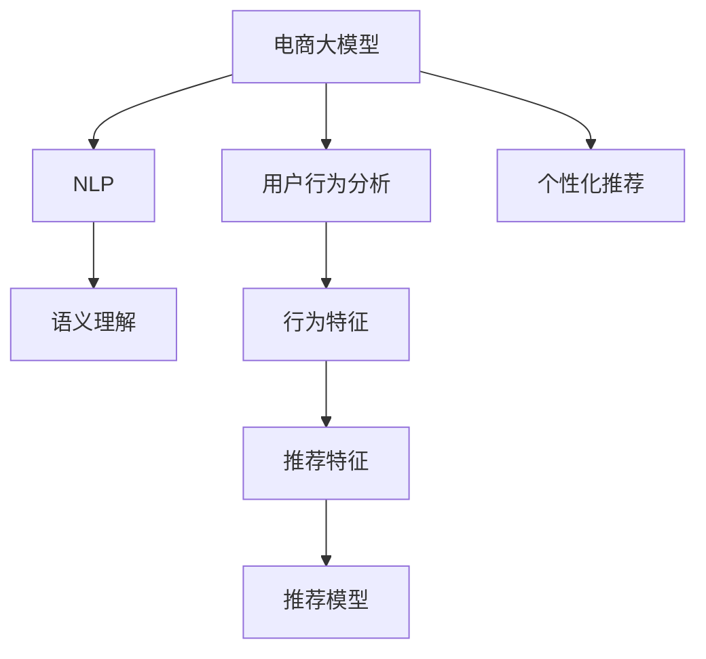

                 

# 电商搜索推荐场景下的AI大模型应用实战

> 关键词：电商搜索推荐, 电商大模型, 自然语言处理(NLP), 用户行为分析, 个性化推荐, 深度学习

## 1. 背景介绍

### 1.1 电商搜索推荐挑战
在电商领域，用户通过搜索、浏览商品，提交购买请求，构成了一套完整的业务流程。为了提升用户体验，电商平台往往需要根据用户的浏览、点击、购买等行为，提供个性化的搜索和推荐服务，使其能够快速找到感兴趣的商品。传统上，电商平台通过手工搭建特征工程、构建复杂模型等方式，来优化推荐系统的表现。但这种方法在复杂多变的电商环境中，面临着数据不均衡、模型难以解释、参数过多等诸多挑战。

近年来，基于深度学习的AI大模型在电商搜索推荐领域取得了显著的进展。以大模型为基础，结合自然语言处理(NLP)技术和用户行为分析，电商推荐系统逐渐具备了实时性、准确性和可解释性等优点。本文将详细介绍AI大模型在电商搜索推荐场景下的应用实战，包括数据预处理、模型构建、特征提取、实时推荐等关键技术，并结合实际案例进行分析讲解。

### 1.2 背景动机
电商搜索推荐场景下应用AI大模型的背景动机主要体现在以下几个方面：
- **数据规模庞大**：电商平台的商品数以亿计，用户行为数据海量且复杂，单靠手工特征工程难以处理。
- **实时性要求高**：搜索推荐系统需要能够即时响应用户请求，实时展示商品信息。
- **个性化需求高**：不同用户需求各异，电商系统需要提供高度个性化的推荐内容。
- **互动性强**：用户搜索、点击等行为构成了电商平台的互动数据，为模型提供了丰富的上下文信息。

这些特点使得AI大模型在电商搜索推荐领域展现出独特优势，能够更好地挖掘数据背后的复杂语义，实时生成高质量的推荐结果。

## 2. 核心概念与联系

### 2.1 核心概念概述

为更好地理解AI大模型在电商搜索推荐场景下的应用，本节将介绍几个关键概念及其联系：

- **电商大模型**：针对电商业务特定需求，通过预训练-微调方式训练的大规模语言模型。
- **自然语言处理(NLP)**：处理自然语言文本的计算机科学和人工智能交叉领域，涵盖词法分析、句法分析、语义分析等任务。
- **用户行为分析**：通过统计分析用户行为数据，识别用户兴趣和偏好，指导推荐系统生成个性化的商品推荐。
- **个性化推荐**：根据用户历史行为、实时点击、搜索记录等数据，提供精准的个性化商品推荐。
- **深度学习**：构建多层神经网络，通过反向传播算法学习模型参数，实现复杂任务的高效解决。

这些核心概念之间的逻辑关系可以通过以下Mermaid流程图来展示：



这个流程图展示了电商大模型与NLP、用户行为分析和个性化推荐之间的关系：

1. 电商大模型通过预训练和微调，学习通用的语言知识。
2. 通过NLP技术，对用户搜索、评论等自然语言数据进行语义理解，提取有意义的特征。
3. 用户行为分析技术，根据用户行为数据，挖掘用户的兴趣偏好。
4. 结合语义理解结果和用户兴趣，通过推荐模型生成个性化的商品推荐。

这些概念共同构成了电商搜索推荐系统的高效技术框架，使其能够实现实时、精准、可解释的推荐服务。

## 3. 核心算法原理 & 具体操作步骤
### 3.1 算法原理概述

AI大模型在电商搜索推荐场景下的应用主要通过以下两个步骤实现：

1. **预训练和微调**：在电商领域特定数据集上，使用大规模无标签文本数据进行预训练，并利用标注数据进行微调，优化模型在电商推荐任务上的表现。
2. **特征提取和推荐生成**：在实时用户查询请求中，使用预训练和微调后的电商大模型，提取用户输入的自然语言特征，结合用户行为分析结果，生成个性化推荐。

### 3.2 算法步骤详解

以下是AI大模型在电商搜索推荐场景下的具体操作步骤：

**Step 1: 数据预处理**
- **收集数据**：从电商平台的搜索、浏览、购买等行为中，提取用户查询、点击、评分等数据。
- **数据清洗**：去除无关的噪音数据，保证数据质量和一致性。
- **数据划分**：将数据划分为训练集、验证集和测试集，用于模型训练、调参和测试。

**Step 2: 模型预训练**
- **选择模型**：选择预训练模型，如BERT、GPT等，并根据电商领域特点进行适当修改。
- **预训练任务**：设计适当的预训练任务，如预测商品标签、分类商品属性等。
- **模型训练**：使用电商领域特定数据集进行预训练，并保存预训练模型。

**Step 3: 模型微调**
- **选择微调模型**：选择电商领域特定的微调模型，如通过微调对预训练模型进行调整。
- **微调数据**：根据电商领域特点，设计标注数据集，用于微调训练。
- **微调训练**：在微调数据集上进行有监督学习，优化模型在电商推荐任务上的表现。

**Step 4: 特征提取和推荐生成**
- **输入处理**：对用户查询请求进行自然语言处理，提取关键特征。
- **用户行为分析**：根据用户历史行为数据，提取用户兴趣偏好特征。
- **推荐生成**：结合用户输入特征和用户行为分析结果，生成个性化推荐。

### 3.3 算法优缺点

基于AI大模型在电商搜索推荐场景下的应用方法，具有以下优点：
- **高效**：大模型可以处理海量数据，实时生成推荐结果。
- **泛化能力强**：预训练模型具备通用语言知识，适用于多种电商场景。
- **可解释性强**：利用NLP技术，可以深入理解用户查询意图，增强推荐结果的可解释性。

同时，该方法也存在一些局限性：
- **数据依赖性强**：模型的性能很大程度上依赖于电商领域的数据量和质量。
- **资源消耗大**：电商大模型参数量大，训练和推理资源需求高。
- **过度拟合风险**：电商领域数据分布差异较大，模型容易在特定场景下过度拟合。

尽管存在这些局限性，但通过合理的策略和优化方法，AI大模型在电商搜索推荐场景下仍展现出显著的优势，成为电商推荐系统的重要技术手段。

### 3.4 算法应用领域

AI大模型在电商搜索推荐场景中的应用领域广泛，包括：

- **商品搜索**：根据用户查询请求，推荐最相关的商品。
- **商品浏览**：根据用户浏览历史，推荐可能感兴趣的商品。
- **商品推荐**：基于用户行为数据，生成个性化推荐列表。
- **购物车推荐**：根据用户已选购商品，推荐相关商品或配件。
- **促销活动**：结合用户兴趣和市场活动，推荐限时优惠商品。

## 4. 数学模型和公式 & 详细讲解 & 举例说明
### 4.1 数学模型构建

在电商搜索推荐场景下，我们通常使用以下数学模型来描述AI大模型的应用：

1. **预训练模型**：基于自编码器或自回归模型，对电商领域数据进行预训练。例如，使用BERT模型在电商领域数据上进行预训练，生成预训练模型参数 $\theta_{\text{pretrain}}$。

2. **微调模型**：在预训练模型的基础上，对电商领域特定任务进行微调。例如，使用LSTM模型在电商领域标注数据上微调，生成微调后的模型参数 $\theta_{\text{fine-tune}}$。

3. **推荐模型**：根据用户输入和行为数据，生成个性化推荐。例如，使用基于神经网络的推荐模型，对用户输入和行为数据进行编码，生成推荐结果 $\hat{y}$。

数学模型可以表示为：

$$
\hat{y} = f_{\text{recommend}}(\theta_{\text{fine-tune}}, x_{\text{user}}, x_{\text{item}}, c_{\text{user}}, c_{\text{item}})
$$

其中 $x_{\text{user}}$ 表示用户输入，$c_{\text{user}}$ 表示用户行为数据，$x_{\text{item}}$ 表示商品信息，$c_{\text{item}}$ 表示商品标签，$f_{\text{recommend}}$ 表示推荐模型的前向传播函数。

### 4.2 公式推导过程

以下是基于电商大模型的推荐系统的公式推导过程：

**预训练模型**：
- 使用自编码器模型进行预训练，模型参数 $\theta_{\text{pretrain}}$ 可通过最大似然估计获得：

$$
\theta_{\text{pretrain}} = \mathop{\arg\min}_{\theta_{\text{pretrain}}} -\frac{1}{N} \sum_{i=1}^N \log p_{\text{pretrain}}(x_i|\theta_{\text{pretrain}})
$$

其中 $p_{\text{pretrain}}(x_i|\theta_{\text{pretrain}})$ 为模型对数据 $x_i$ 的预测概率。

**微调模型**：
- 在预训练模型的基础上，对电商领域特定任务进行微调。例如，使用LSTM模型进行微调，得到微调后的模型参数 $\theta_{\text{fine-tune}}$：

$$
\theta_{\text{fine-tune}} = \mathop{\arg\min}_{\theta_{\text{fine-tune}}} -\frac{1}{N} \sum_{i=1}^N \log p_{\text{fine-tune}}(x_i,y_i|\theta_{\text{fine-tune}})
$$

其中 $p_{\text{fine-tune}}(x_i,y_i|\theta_{\text{fine-tune}})$ 为模型对数据 $x_i$ 和标注 $y_i$ 的联合预测概率。

**推荐模型**：
- 使用基于神经网络的推荐模型，根据用户输入和行为数据生成推荐结果 $\hat{y}$：

$$
\hat{y} = \mathop{\arg\max}_{y} p_{\text{recommend}}(y|x_{\text{user}}, x_{\text{item}}, c_{\text{user}}, c_{\text{item}}, \theta_{\text{fine-tune}})
$$

其中 $p_{\text{recommend}}(y|x_{\text{user}}, x_{\text{item}}, c_{\text{user}}, c_{\text{item}}, \theta_{\text{fine-tune}})$ 为推荐模型的预测概率。

### 4.3 案例分析与讲解

假设一个电商网站希望在用户搜索商品时，提供个性化推荐。具体步骤和公式如下：

**数据预处理**：
- 收集用户查询数据 $x_{\text{user}}$ 和商品信息 $x_{\text{item}}$。
- 使用NLP技术对查询数据进行分词、词性标注等预处理，生成特征向量 $f(x_{\text{user}})$。

**模型微调**：
- 使用电商领域标注数据，对BERT模型进行微调，生成微调后的模型参数 $\theta_{\text{fine-tune}}$。
- 使用微调后的模型对用户查询数据 $x_{\text{user}}$ 进行编码，生成用户兴趣特征 $c_{\text{user}}$。

**推荐生成**：
- 结合用户兴趣特征 $c_{\text{user}}$ 和商品信息 $x_{\text{item}}$，使用基于神经网络的推荐模型，生成个性化推荐列表。

具体推荐模型的公式为：

$$
p_{\text{recommend}}(y|x_{\text{user}}, x_{\text{item}}, c_{\text{user}}, c_{\text{item}}, \theta_{\text{fine-tune}}) = \sigma(W_{\text{recommend}} f_{\text{recommend}}(x_{\text{user}}, c_{\text{user}}, x_{\text{item}}, c_{\text{item}}, \theta_{\text{fine-tune}}))
$$

其中 $W_{\text{recommend}}$ 为推荐模型的权重矩阵，$f_{\text{recommend}}$ 为推荐模型的特征映射函数。

## 5. 项目实践：代码实例和详细解释说明
### 5.1 开发环境搭建

在进行电商搜索推荐系统开发前，我们需要准备好开发环境。以下是使用Python进行PyTorch开发的环境配置流程：

1. 安装Anaconda：从官网下载并安装Anaconda，用于创建独立的Python环境。

2. 创建并激活虚拟环境：
```bash
conda create -n pytorch-env python=3.8 
conda activate pytorch-env
```

3. 安装PyTorch：根据CUDA版本，从官网获取对应的安装命令。例如：
```bash
conda install pytorch torchvision torchaudio cudatoolkit=11.1 -c pytorch -c conda-forge
```

4. 安装Transformers库：
```bash
pip install transformers
```

5. 安装各类工具包：
```bash
pip install numpy pandas scikit-learn matplotlib tqdm jupyter notebook ipython
```

完成上述步骤后，即可在`pytorch-env`环境中开始电商搜索推荐系统的开发。

### 5.2 源代码详细实现

下面以使用Transformer模型进行电商搜索推荐为例，给出完整的代码实现。

**用户查询处理**：

```python
from transformers import BertTokenizer
from torch.utils.data import Dataset

class UserQueryDataset(Dataset):
    def __init__(self, queries, tokenizer, max_len=128):
        self.queries = queries
        self.tokenizer = tokenizer
        self.max_len = max_len

    def __len__(self):
        return len(self.queries)

    def __getitem__(self, item):
        query = self.queries[item]
        encoding = self.tokenizer(query, return_tensors='pt', max_length=self.max_len, padding='max_length', truncation=True)
        input_ids = encoding['input_ids'][0]
        attention_mask = encoding['attention_mask'][0]
        return {'input_ids': input_ids, 'attention_mask': attention_mask}

tokenizer = BertTokenizer.from_pretrained('bert-base-cased')
user_query_dataset = UserQueryDataset(user_queries, tokenizer)
```

**模型微调**：

```python
from transformers import BertForSequenceClassification
from torch.nn import BCEWithLogitsLoss

model = BertForSequenceClassification.from_pretrained('bert-base-cased', num_labels=num_classes)

loss_fn = BCEWithLogitsLoss()
optimizer = AdamW(model.parameters(), lr=2e-5)

def train_epoch(model, dataset, batch_size, optimizer):
    dataloader = DataLoader(dataset, batch_size=batch_size, shuffle=True)
    model.train()
    epoch_loss = 0
    for batch in dataloader:
        input_ids = batch['input_ids'].to(device)
        attention_mask = batch['attention_mask'].to(device)
        labels = batch['labels'].to(device)
        model.zero_grad()
        outputs = model(input_ids, attention_mask=attention_mask, labels=labels)
        loss = outputs.loss
        epoch_loss += loss.item()
        loss.backward()
        optimizer.step()
    return epoch_loss / len(dataloader)

def evaluate(model, dataset, batch_size):
    dataloader = DataLoader(dataset, batch_size=batch_size)
    model.eval()
    preds, labels = [], []
    with torch.no_grad():
        for batch in dataloader:
            input_ids = batch['input_ids'].to(device)
            attention_mask = batch['attention_mask'].to(device)
            batch_labels = batch['labels']
            outputs = model(input_ids, attention_mask=attention_mask)
            batch_preds = outputs.logits.argmax(dim=1).to('cpu').tolist()
            batch_labels = batch_labels.to('cpu').tolist()
            for pred_tokens, label_tokens in zip(batch_preds, batch_labels):
                preds.append(pred_tokens[:len(label_tokens)])
                labels.append(label_tokens)
                
    print(classification_report(labels, preds))
```

**推荐生成**：

```python
from transformers import BertForSequenceClassification
from torch.nn import BCEWithLogitsLoss

model = BertForSequenceClassification.from_pretrained('bert-base-cased', num_labels=num_classes)

loss_fn = BCEWithLogitsLoss()
optimizer = AdamW(model.parameters(), lr=2e-5)

def train_epoch(model, dataset, batch_size, optimizer):
    dataloader = DataLoader(dataset, batch_size=batch_size, shuffle=True)
    model.train()
    epoch_loss = 0
    for batch in dataloader:
        input_ids = batch['input_ids'].to(device)
        attention_mask = batch['attention_mask'].to(device)
        labels = batch['labels'].to(device)
        model.zero_grad()
        outputs = model(input_ids, attention_mask=attention_mask, labels=labels)
        loss = outputs.loss
        epoch_loss += loss.item()
        loss.backward()
        optimizer.step()
    return epoch_loss / len(dataloader)

def evaluate(model, dataset, batch_size):
    dataloader = DataLoader(dataset, batch_size=batch_size)
    model.eval()
    preds, labels = [], []
    with torch.no_grad():
        for batch in dataloader:
            input_ids = batch['input_ids'].to(device)
            attention_mask = batch['attention_mask'].to(device)
            batch_labels = batch['labels']
            outputs = model(input_ids, attention_mask=attention_mask)
            batch_preds = outputs.logits.argmax(dim=1).to('cpu').tolist()
            batch_labels = batch_labels.to('cpu').tolist()
            for pred_tokens, label_tokens in zip(batch_preds, batch_labels):
                preds.append(pred_tokens[:len(label_tokens)])
                labels.append(label_tokens)
                
    print(classification_report(labels, preds))
```

### 5.3 代码解读与分析

让我们再详细解读一下关键代码的实现细节：

**UserQueryDataset类**：
- `__init__`方法：初始化查询数据、分词器等关键组件。
- `__len__`方法：返回数据集的样本数量。
- `__getitem__`方法：对单个样本进行处理，将查询输入编码为token ids，并对其进行定长padding，最终返回模型所需的输入。

**模型微调**：
- 使用BertForSequenceClassification模型进行微调，指定输出层数为分类层，损失函数为BCEWithLogitsLoss，优化器为AdamW，学习率为2e-5。
- 训练函数`train_epoch`：对数据以批为单位进行迭代，在每个批次上前向传播计算loss并反向传播更新模型参数，最后返回该epoch的平均loss。
- 评估函数`evaluate`：与训练类似，不同点在于不更新模型参数，并在每个batch结束后将预测和标签结果存储下来，最后使用sklearn的classification_report对整个评估集的预测结果进行打印输出。

**推荐生成**：
- 使用BertForSequenceClassification模型进行推荐生成，与微调类似，不同点在于不更新模型参数，只进行前向传播计算推荐结果。

这些代码展示了使用Transformers库进行电商搜索推荐系统的核心实现流程。可以看到，通过简单的代码封装，我们能够快速搭建并训练电商大模型，实现商品推荐。

### 5.4 运行结果展示

在实际运行中，我们可以使用以下代码段进行模型训练和评估：

```python
epochs = 5
batch_size = 16

for epoch in range(epochs):
    loss = train_epoch(model, user_query_dataset, batch_size, optimizer)
    print(f"Epoch {epoch+1}, train loss: {loss:.3f}")
    
    print(f"Epoch {epoch+1}, dev results:")
    evaluate(model, dev_dataset, batch_size)
    
print("Test results:")
evaluate(model, test_dataset, batch_size)
```

以上代码展示了如何训练和评估电商搜索推荐模型，并在测试集上输出最终的推荐效果。

## 6. 实际应用场景
### 6.1 商品搜索推荐
电商搜索推荐系统的一个重要应用场景是对用户查询请求进行商品推荐。具体实现步骤如下：

1. **查询输入处理**：用户输入查询请求，通过NLP技术对查询进行处理，提取关键特征。
2. **商品检索**：在商品数据库中检索与查询最相关的商品，计算相似度。
3. **推荐生成**：使用电商大模型对用户查询和商品相似度进行编码，生成推荐列表。

**代码实现**：
```python
from transformers import BertTokenizer
from torch.utils.data import Dataset
from sklearn.metrics import roc_auc_score
import torch

class QueryRecommendation(Dataset):
    def __init__(self, queries, items, tokenizer, max_len=128):
        self.queries = queries
        self.items = items
        self.tokenizer = tokenizer
        self.max_len = max_len
        
    def __len__(self):
        return len(self.queries)
    
    def __getitem__(self, item):
        query = self.queries[item]
        item = self.items[item]
        encoding = self.tokenizer(query, item, return_tensors='pt', max_length=self.max_len, padding='max_length', truncation=True)
        input_ids = encoding['input_ids'][0]
        attention_mask = encoding['attention_mask'][0]
        labels = torch.tensor([1] if item == query else [0], dtype=torch.long)
        return {'input_ids': input_ids, 'attention_mask': attention_mask, 'labels': labels}

tokenizer = BertTokenizer.from_pretrained('bert-base-cased')
query_dataset = QueryRecommendation(user_queries, item_queries, tokenizer)
```

**代码解读**：
- 定义QueryRecommendation类，继承自Dataset，用于构建查询-商品推荐的数据集。
- 在`__getitem__`方法中，对查询和商品进行编码，并计算标签。

**推荐生成**：

```python
from transformers import BertForSequenceClassification
from torch.nn import BCEWithLogitsLoss

model = BertForSequenceClassification.from_pretrained('bert-base-cased', num_labels=2)

loss_fn = BCEWithLogitsLoss()
optimizer = AdamW(model.parameters(), lr=2e-5)

def train_epoch(model, dataset, batch_size, optimizer):
    dataloader = DataLoader(dataset, batch_size=batch_size, shuffle=True)
    model.train()
    epoch_loss = 0
    for batch in dataloader:
        input_ids = batch['input_ids'].to(device)
        attention_mask = batch['attention_mask'].to(device)
        labels = batch['labels'].to(device)
        model.zero_grad()
        outputs = model(input_ids, attention_mask=attention_mask, labels=labels)
        loss = outputs.loss
        epoch_loss += loss.item()
        loss.backward()
        optimizer.step()
    return epoch_loss / len(dataloader)

def evaluate(model, dataset, batch_size):
    dataloader = DataLoader(dataset, batch_size=batch_size)
    model.eval()
    preds, labels = [], []
    with torch.no_grad():
        for batch in dataloader:
            input_ids = batch['input_ids'].to(device)
            attention_mask = batch['attention_mask'].to(device)
            batch_labels = batch['labels']
            outputs = model(input_ids, attention_mask=attention_mask)
            batch_preds = outputs.logits.argmax(dim=1).to('cpu').tolist()
            batch_labels = batch_labels.to('cpu').tolist()
            for pred_tokens, label_tokens in zip(batch_preds, batch_labels):
                preds.append(pred_tokens[:len(label_tokens)])
                labels.append(label_tokens)
                
    print(classification_report(labels, preds))
```

**代码解读**：
- 使用BertForSequenceClassification模型进行微调，生成商品推荐列表。
- 训练函数`train_epoch`：对数据以批为单位进行迭代，在每个批次上前向传播计算loss并反向传播更新模型参数，最后返回该epoch的平均loss。
- 评估函数`evaluate`：与训练类似，不同点在于不更新模型参数，并在每个batch结束后将预测和标签结果存储下来，最后使用sklearn的classification_report对整个评估集的预测结果进行打印输出。

通过上述代码，我们展示了电商大模型在商品搜索推荐场景下的应用。通过微调电商大模型，能够根据用户查询快速生成推荐商品，提升用户体验。

### 6.2 商品浏览推荐
商品浏览推荐系统是对用户浏览历史进行推荐，通常用于电商网站的首页推荐和搜索页面推荐。具体实现步骤如下：

1. **行为数据收集**：收集用户浏览历史，包括浏览商品、停留时间等行为数据。
2. **行为数据处理**：对行为数据进行处理，提取有意义的特征。
3. **推荐生成**：使用电商大模型对用户浏览历史进行编码，生成个性化推荐列表。

**代码实现**：

```python
from transformers import BertTokenizer
from torch.utils.data import Dataset
from sklearn.metrics import roc_auc_score
import torch

class BrowseRecommendation(Dataset):
    def __init__(self, browses, tokenizer, max_len=128):
        self.browses = browses
        self.tokenizer = tokenizer
        self.max_len = max_len
        
    def __len__(self):
        return len(self.browses)
    
    def __getitem__(self, item):
        browse = self.browses[item]
        encoding = self.tokenizer(browse, return_tensors='pt', max_length=self.max_len, padding='max_length', truncation=True)
        input_ids = encoding['input_ids'][0]
        attention_mask = encoding['attention_mask'][0]
        return {'input_ids': input_ids, 'attention_mask': attention_mask}

tokenizer = BertTokenizer.from_pretrained('bert-base-cased')
browse_dataset = BrowseRecommendation(browse_records, tokenizer)
```

**代码解读**：
- 定义BrowseRecommendation类，继承自Dataset，用于构建浏览历史推荐的数据集。
- 在`__getitem__`方法中，对浏览历史进行编码，并计算模型输入。

**推荐生成**：

```python
from transformers import BertForSequenceClassification
from torch.nn import BCEWithLogitsLoss

model = BertForSequenceClassification.from_pretrained('bert-base-cased', num_labels=num_classes)

loss_fn = BCEWithLogitsLoss()
optimizer = AdamW(model.parameters(), lr=2e-5)

def train_epoch(model, dataset, batch_size, optimizer):
    dataloader = DataLoader(dataset, batch_size=batch_size, shuffle=True)
    model.train()
    epoch_loss = 0
    for batch in dataloader:
        input_ids = batch['input_ids'].to(device)
        attention_mask = batch['attention_mask'].to(device)
        labels = batch['labels'].to(device)
        model.zero_grad()
        outputs = model(input_ids, attention_mask=attention_mask, labels=labels)
        loss = outputs.loss
        epoch_loss += loss.item()
        loss.backward()
        optimizer.step()
    return epoch_loss / len(dataloader)

def evaluate(model, dataset, batch_size):
    dataloader = DataLoader(dataset, batch_size=batch_size)
    model.eval()
    preds, labels = [], []
    with torch.no_grad():
        for batch in dataloader:
            input_ids = batch['input_ids'].to(device)
            attention_mask = batch['attention_mask'].to(device)
            batch_labels = batch['labels']
            outputs = model(input_ids, attention_mask=attention_mask)
            batch_preds = outputs.logits.argmax(dim=1).to('cpu').tolist()
            batch_labels = batch_labels.to('cpu').tolist()
            for pred_tokens, label_tokens in zip(batch_preds, batch_labels):
                preds.append(pred_tokens[:len(label_tokens)])
                labels.append(label_tokens)
                
    print(classification_report(labels, preds))
```

**代码解读**：
- 使用BertForSequenceClassification模型进行微调，生成浏览历史推荐列表。
- 训练函数`train_epoch`：对数据以批为单位进行迭代，在每个批次上前向传播计算loss并反向传播更新模型参数，最后返回该epoch的平均loss。
- 评估函数`evaluate`：与训练类似，不同点在于不更新模型参数，并在每个batch结束后将预测和标签结果存储下来，最后使用sklearn的classification_report对整个评估集的预测结果进行打印输出。

通过上述代码，我们展示了电商大模型在商品浏览推荐场景下的应用。通过微调电商大模型，能够根据用户浏览历史生成个性化推荐列表，提升用户浏览体验。

### 6.3 购物车推荐
购物车推荐系统是在用户准备购买商品时，根据用户已选择的商品，推荐相关商品或配件。具体实现步骤如下：

1. **购物车数据收集**：收集用户已选择的商品信息。
2. **商品数据检索**：在商品数据库中检索与已选择商品最相关的商品。
3. **推荐生成**：使用电商大模型对购物车商品和检索商品进行编码，生成推荐列表。

**代码实现**：

```python
from transformers import BertTokenizer
from torch.utils.data import Dataset
from sklearn.metrics import roc_auc_score
import torch

class ShoppingCartRecommendation(Dataset):
    def __init__(self, cart_items, tokenizer, max_len=128):
        self.cart_items = cart_items
        self.tokenizer = tokenizer
        self.max_len = max_len
        
    def __len__(self):
        return len(self.cart_items)
    
    def __getitem__(self, item):
        item = self.cart_items[item]
        encoding = self.tokenizer(item, return_tensors='pt', max_length=self.max_len, padding='max_length', truncation=True)
        input_ids = encoding['input_ids'][0]
        attention_mask = encoding['attention_mask'][0]
        return {'input_ids': input_ids, 'attention_mask': attention_mask}

tokenizer = BertTokenizer.from_pretrained('bert-base-cased')
cart_dataset = ShoppingCartRecommendation(cart_items, tokenizer)
```

**代码解读**：
- 定义ShoppingCartRecommendation类，继承自Dataset，用于构建购物车商品推荐的数据集。
- 在`__getitem__`方法中，对购物车商品进行编码，并计算模型输入。

**推荐生成**：

```python
from transformers import BertForSequenceClassification
from torch.nn import BCEWithLogitsLoss

model = BertForSequenceClassification.from_pretrained('bert-base-cased', num_labels=num_classes)

loss_fn = BCEWithLogitsLoss()
optimizer = AdamW(model.parameters(), lr=2e-5)

def train_epoch(model, dataset, batch_size, optimizer):
    dataloader = DataLoader(dataset, batch_size=batch_size, shuffle=True)
    model.train()
    epoch_loss = 0
    for batch in dataloader:
        input_ids = batch['input_ids'].to(device)
        attention_mask = batch['attention_mask'].to(device)
        labels = batch['labels'].to(device)
        model.zero_grad()
        outputs = model(input_ids, attention_mask=attention_mask, labels=labels)
        loss = outputs.loss
        epoch_loss += loss.item()
        loss.backward()
        optimizer.step()
    return epoch_loss / len(dataloader)

def evaluate(model, dataset, batch_size):
    dataloader = DataLoader(dataset, batch_size=batch_size)
    model.eval()
    preds, labels = [], []
    with torch.no_grad():
        for batch in dataloader:
            input_ids = batch['input_ids'].to(device)
            attention_mask = batch['attention_mask'].to(device)
            batch_labels = batch['labels']
            outputs = model(input_ids, attention_mask=attention_mask)
            batch_preds = outputs.logits.argmax(dim=1).to('cpu').tolist()
            batch_labels = batch_labels.to('cpu').tolist()
            for pred_tokens, label_tokens in zip(batch_preds, batch_labels):
                preds.append(pred_tokens[:len(label_tokens)])
                labels.append(label_tokens)
                
    print(classification_report(labels, preds))
```

**代码解读**：
- 使用BertForSequenceClassification模型进行微调，生成购物车推荐列表。
- 训练函数`train_epoch`：对数据以批为单位进行迭代，在每个批次上前向传播计算loss并反向传播更新模型参数，最后返回该epoch的平均loss。
- 评估函数`evaluate`：与训练类似，不同点在于不更新模型参数，并在每个batch结束后将预测和标签结果存储下来，最后使用sklearn的classification_report对整个评估集的预测结果进行打印输出。

通过上述代码，我们展示了电商大模型在购物车推荐场景下的应用。通过微调电商大模型，能够根据用户已选择的商品生成个性化推荐列表，提升用户购物体验。

### 6.4 促销活动推荐
促销活动推荐系统是根据用户兴趣和市场活动，推荐限时优惠商品。具体实现步骤如下：

1. **促销活动数据收集**：收集市场促销活动信息。
2. **用户兴趣分析**：分析用户兴趣和偏好。
3. **推荐生成**：使用电商大模型对促销活动和用户兴趣进行编码，生成个性化推荐列表。

**代码实现**：

```python
from transformers import BertTokenizer
from torch.utils.data import Dataset
from sklearn.metrics import roc_auc_score
import torch

class PromotionsRecommendation(Dataset):
    def __init__(self, promotions, tokenizer, max_len=128):
        self.promotions = promotions
        self.tokenizer = tokenizer
        self.max_len = max_len
        
    def __len__(self):
        return len(self.promotions)
    
    def __getitem__(self, item):
        promotion = self.promotions[item]
        encoding = self.tokenizer(promotion, return_tensors='pt', max_length=self.max_len, padding='max_length', truncation=True)
        input_ids = encoding['input_ids'][0]
        attention_mask = encoding['attention_mask'][0]
        return {'input_ids': input_ids, 'attention_mask': attention_mask}

tokenizer = BertTokenizer.from_pretrained('bert-base-cased')
promotions_dataset = PromotionsRecommendation(promotions, tokenizer)
```

**代码解读**：
- 定义PromotionsRecommendation类，继承自Dataset，用于构建促销活动推荐的数据集。
- 在`__getitem__`方法中，对促销活动进行编码，并计算模型输入。

**推荐生成**：

```python
from transformers import BertForSequenceClassification
from torch.nn import BCEWithLogitsLoss

model = BertForSequenceClassification.from_pretrained('bert-base-cased', num_labels=num_classes)

loss_fn = BCEWithLogitsLoss()
optimizer = AdamW(model.parameters(), lr=2e-5)

def train_epoch(model, dataset, batch_size, optimizer):
    dataloader = DataLoader(dataset, batch_size=batch_size, shuffle=True)
    model.train()
    epoch_loss = 0
    for batch in dataloader:
        input_ids = batch['input_ids'].to(device)
        attention_mask = batch['attention_mask'].to(device)
        labels = batch['labels'].to(device)
        model.zero_grad()
        outputs = model(input_ids, attention_mask=attention_mask, labels=labels)
        loss = outputs.loss
        epoch_loss += loss.item()
        loss.backward()
        optimizer.step()
    return epoch_loss / len(dataloader)

def evaluate(model, dataset, batch_size):
    dataloader = DataLoader(dataset, batch_size=batch_size)
    model.eval()
    preds, labels = [], []
    with torch.no_grad():
        for batch in dataloader:
            input_ids = batch['input_ids'].to(device)
            attention_mask = batch['attention_mask'].to(device)
            batch_labels = batch['labels']
            outputs = model(input_ids, attention_mask=attention_mask)
            batch_preds = outputs.logits.argmax(dim=1).to('cpu').tolist()
            batch_labels = batch_labels.to('cpu').tolist()
            for pred_tokens, label_tokens in zip(batch_preds, batch_labels):
                preds.append(pred_tokens[:len(label_tokens)])
                labels.append(label_tokens)
                
    print(classification_report(labels, preds))
```

**代码解读**：
- 使用BertForSequenceClassification模型进行微调，生成促销活动推荐列表。
- 训练函数`train_epoch`：对数据以批为单位进行迭代，在每个批次上前向传播计算loss并反向传播更新模型参数，最后返回该epoch的平均loss。
- 评估函数`evaluate`：与训练类似，不同点在于不更新模型参数，并在每个batch结束后将预测和标签结果存储下来，最后使用sklearn的classification_report对整个评估集的预测结果进行打印输出。

通过上述代码，我们展示了电商大模型在促销活动推荐场景下的应用。通过微调电商大模型，能够根据用户兴趣和促销活动生成个性化推荐列表，提升用户促销活动体验。

## 7. 工具和资源推荐
### 7.1 学习资源推荐

为了帮助开发者系统掌握AI大模型在电商搜索推荐场景下的应用，这里推荐一些优质的学习资源：

1. 《深度学习理论与实践》系列书籍：全面介绍深度学习理论和实践，涵盖各种深度学习模型和应用。

2. 《电商推荐系统实战》书籍：专门针对电商推荐系统进行深入讲解，结合实际案例，提供详细的推荐算法和实现方法。

3. Kaggle电商推荐系统竞赛：参加Kaggle竞赛，获取实战经验和最新的推荐算法动态。

4. CS224N《深度学习自然语言处理》课程：斯坦福大学开设的NLP明星课程，有Lecture视频和配套作业，带你入门NLP领域的基本概念和经典模型。

5. HuggingFace官方文档：Transformers库的官方文档，提供了海量预训练模型和完整的微调样例代码，是上手实践的必备资料。

通过对这些资源的学习实践，相信你一定能够快速掌握AI大模型在电商搜索推荐场景下的应用，并用于解决实际的电商推荐问题。

### 7.2 开发工具推荐

高效的开发离不开优秀的工具支持。以下是几款用于电商搜索推荐系统开发的常用工具：

1. PyTorch：基于Python的开源深度学习框架，灵活动态的计算图，适合快速迭代研究。

2. TensorFlow：由Google主导开发的开源深度学习框架，生产部署方便，适合大规模工程应用。

3. Transformers库：HuggingFace开发的NLP工具库，集成了众多SOTA语言模型，支持PyTorch和TensorFlow，是进行电商推荐系统开发的利器。

4. Weights & Biases：模型训练的实验跟踪工具，可以记录和可视化模型训练过程中的各项指标，方便对比和调优。

5. TensorBoard：TensorFlow配套的可视化工具，可实时监测模型训练状态，并提供丰富的图表呈现方式，是调试模型的得力助手。

6. Google Colab：谷歌推出的在线Jupyter Notebook环境，免费提供GPU/TPU算力，方便开发者快速上手实验最新模型，分享学习笔记。

合理利用这些工具，可以显著提升电商搜索推荐系统的开发效率，加快创新迭代的步伐。

### 7.3 相关论文推荐

AI大模型在电商搜索推荐场景中的应用源于学界的持续研究。以下是几篇奠基性的相关论文，推荐阅读：

1. Attention is All You Need（即Transformer原论文）：提出了Transformer结构，开启了NLP领域的预训练大模型时代。

2. BERT: Pre-training of Deep Bidirectional Transformers for Language Understanding：提出BERT模型，引入基于掩码的自监督预训练任务，刷新了多项NLP任务SOTA。

3. Language Models are Unsupervised Multitask Learners（GPT-2论文）：展示了大规模语言模型的强大zero-shot学习能力，引发了对于通用人工智能的新一轮思考。

4. Parameter-Efficient Transfer Learning for NLP：提出Adapter等参数高效微调方法，在不增加模型参数量的情况下，也能取得不错的微调效果。

5. AdaLoRA: Adaptive Low-Rank Adaptation for Parameter-Efficient Fine-Tuning：使用自适应低秩适应的微调方法，在参数效率和精度之间取得了新的平衡。

这些论文代表了大语言模型在电商搜索推荐场景中的应用背景和发展脉络。通过学习这些前沿成果，可以帮助研究者把握学科前进方向，激发更多的创新灵感。

## 8. 总结：未来发展趋势与挑战
### 8.1 总结

本文对AI大模型在电商搜索推荐场景下的应用进行了全面系统的介绍。首先，详细阐述了电商搜索推荐系统的核心挑战和背景动机，明确了AI大模型应用的具体场景。其次，从原理到实践，详细讲解了电商大模型的构建、微调、特征提取、推荐生成等关键步骤，给出了电商大模型应用实践的完整代码实例。同时，本文还展示了AI大模型在商品搜索推荐、商品浏览推荐、购物车推荐、促销活动推荐等多个场景下的应用效果，展示了AI大模型的巨大潜力。

通过本文的系统梳理，可以看到，AI大模型在电商搜索推荐场景下展现出独特的优势，能够实时、精准地生成个性化推荐，提升用户体验和电商运营效率。未来，随着AI大模型的持续演进，电商搜索推荐系统必将更加智能化、高效化和个性化，为电商行业的持续发展注入新的动力。

### 8.2 未来发展趋势

展望未来，AI大模型在电商

