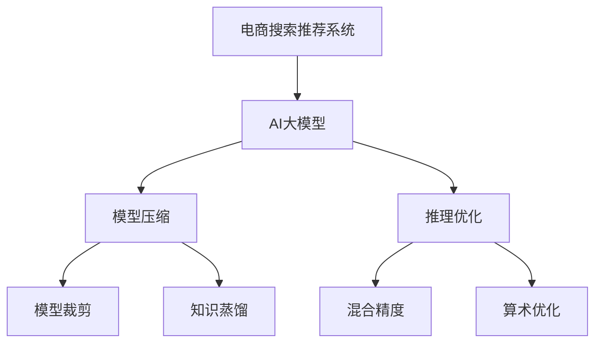

                 

# 电商搜索推荐场景下的AI大模型模型压缩技术

> 关键词：电商搜索推荐、AI大模型、模型压缩、推理优化、模型裁剪、知识蒸馏、混合精度、算术优化

## 1. 背景介绍

### 1.1 问题由来
随着人工智能技术的不断进步，大型预训练模型在自然语言处理(NLP)和计算机视觉(CV)等领域取得了显著成果，尤其在电商搜索推荐系统中的应用，已经极大地提升了用户体验和运营效率。然而，这些大模型通常拥有庞大的参数量和计算复杂度，限制了其在实际部署和实时响应中的使用。

为了在保持大模型性能的同时，提高其推理速度和计算效率，模型压缩技术应运而生。通过模型压缩，可以在不显著降低模型精度的前提下，大幅度缩小模型尺寸，提升模型推理速度，减少计算资源占用，从而更好地适应电商搜索推荐系统等对实时性和资源效率有高要求的场景。

### 1.2 问题核心关键点
本节将详细阐述模型压缩技术在电商搜索推荐系统中的核心问题和关键点：

- **模型压缩**：通过减少模型参数、优化模型结构等方法，压缩模型以提高推理效率。
- **推理优化**：采用多种技术手段，优化模型推理过程，以提升实时响应速度。
- **模型裁剪**：有选择性地保留模型中重要层，去除不重要的层和参数，减少计算量。
- **知识蒸馏**：利用小规模模型作为教师模型，通过知识转移，压缩大规模模型以保留其知识。
- **混合精度**：使用浮点数和整数混合精度的训练和推理，提升计算效率和存储效率。
- **算术优化**：优化模型的数学运算过程，减少运算量，提升运算速度。

## 2. 核心概念与联系

### 2.1 核心概念概述

为了更好地理解模型压缩技术在电商搜索推荐系统中的应用，本节将介绍几个密切相关的核心概念：

- **电商搜索推荐系统**：通过分析用户行为数据和商品属性信息，为用户提供个性化的搜索结果和推荐，提升用户体验和转化率。
- **AI大模型**：基于大规模预训练数据训练的深度学习模型，通常具有数十亿个参数，具备强大的语义理解、知识迁移能力。
- **模型压缩**：通过减少模型参数、优化模型结构、降低模型复杂度等方法，提高模型的计算效率和推理速度。
- **推理优化**：优化模型推理过程，减少计算量，提升实时响应速度。
- **模型裁剪**：有选择性地保留模型中重要层，去除不重要的层和参数，减小计算量。
- **知识蒸馏**：通过小规模模型作为教师模型，利用知识转移，压缩大规模模型以保留其知识。
- **混合精度**：使用浮点数和整数混合精度的训练和推理，提升计算效率和存储效率。
- **算术优化**：优化模型的数学运算过程，减少运算量，提升运算速度。

这些核心概念之间的逻辑关系可以通过以下Mermaid流程图来展示：



这个流程图展示了电商搜索推荐系统与AI大模型之间的关联，以及模型压缩技术的核心环节：

1. 电商搜索推荐系统通过AI大模型进行个性化推荐，提升用户体验。
2. AI大模型通常规模庞大，计算复杂度高，需要通过模型压缩技术优化。
3. 模型压缩技术包括模型裁剪、知识蒸馏、推理优化等多种手段。
4. 这些手段通过优化模型结构、计算过程等，使得模型在保留核心知识的同时，推理速度和计算效率显著提升。

## 3. 核心算法原理 & 具体操作步骤
### 3.1 算法原理概述

模型压缩技术旨在通过减少模型参数、优化模型结构、降低计算复杂度等手段，在不损失模型性能的前提下，提升模型的推理速度和计算效率。以下是对模型压缩技术的核心算法原理进行概述：

- **模型裁剪**：有选择性地保留模型中重要层，去除不重要的层和参数。
- **知识蒸馏**：通过小规模模型作为教师模型，利用知识转移，压缩大规模模型以保留其核心知识。
- **推理优化**：采用多种技术手段，优化模型推理过程，减少计算量。
- **混合精度**：使用浮点数和整数混合精度的训练和推理，提升计算效率和存储效率。
- **算术优化**：优化模型的数学运算过程，减少运算量，提升运算速度。

### 3.2 算法步骤详解

基于模型压缩技术的电商搜索推荐系统一般包括以下几个关键步骤：

**Step 1: 模型选择与预处理**
- 选择适合的预训练模型（如BERT、GPT等），并准备电商领域的标签数据集。
- 进行数据预处理，包括分词、标记、归一化等。

**Step 2: 构建目标模型**
- 构建电商搜索推荐任务的目标模型，例如使用Transformer模型进行文本处理和推荐预测。
- 设定模型的超参数，如模型深度、隐层大小、学习率等。

**Step 3: 模型裁剪**
- 通过特征选择、剪枝等方法，有选择地保留模型中重要层和参数，去除不重要的部分。
- 例如，在Transformer模型中，保留底层的编码器-解码器模块，裁剪顶层分类器。

**Step 4: 知识蒸馏**
- 构建一个小规模的电商领域模型作为教师模型，通过知识蒸馏将其核心知识转移到大模型中。
- 使用师生模型间的输出距离最小化作为优化目标，训练大模型以学习教师模型的知识。

**Step 5: 推理优化**
- 在推理过程中，采用量化、矩阵分解、矩阵近似等技术，减少计算量，提升推理速度。
- 例如，使用8位浮点数（FP8）代替16位浮点数（FP16）进行推理，提升计算效率。

**Step 6: 混合精度**
- 在训练和推理过程中，交替使用高精度浮点数（FP32）和低精度整数（如FP8），减少计算量，提高存储效率。

**Step 7: 算术优化**
- 优化模型的数学运算过程，如矩阵乘法的空间局部性优化，减少运算量，提升运算速度。
- 例如，使用矩阵分块技术，减少矩阵乘法的循环迭代次数，提升运算效率。

**Step 8: 模型评估与部署**
- 在电商搜索推荐系统上测试模型性能，评估其推荐效果和实时响应速度。
- 部署模型到实际应用环境中，实时响应用户查询和推荐请求。

以上是模型压缩技术在电商搜索推荐系统中的详细步骤。在实际应用中，还需要针对具体任务和数据特点进行优化设计，如改进目标模型的任务适配层、选择更合适的师生模型等。

### 3.3 算法优缺点

模型压缩技术在电商搜索推荐系统中的应用，具有以下优点：

1. **提高实时响应速度**：通过裁剪、推理优化等技术，模型计算速度显著提升，可以更快响应用户查询和推荐请求。
2. **减少计算资源消耗**：通过混合精度、算术优化等技术，减少模型存储和计算资源占用。
3. **提升推荐效果**：优化后的模型更高效，可以实时处理更多用户查询，提升推荐精度和召回率。

然而，模型压缩技术也存在一些局限性：

1. **模型性能降低**：压缩后模型参数减少，可能影响模型的表达能力，导致推荐精度下降。
2. **过度优化风险**：过度优化可能导致模型过拟合，影响模型泛化能力。
3. **实现复杂度增加**：优化技术复杂，需要专业知识，开发和调试成本较高。

尽管存在这些局限性，但模型压缩技术仍然是电商搜索推荐系统优化中的重要手段，通过合理设计，可以取得理想的效果。

### 3.4 算法应用领域

模型压缩技术在电商搜索推荐系统中的应用，已经取得了显著成果，具体包括：

1. **个性化推荐**：通过优化推荐模型，提升实时推荐精度和召回率，提升用户体验。
2. **商品搜索**：通过压缩搜索模型，提升搜索速度和准确性，减少用户查询等待时间。
3. **广告推荐**：通过优化广告推荐模型，提高广告投放的精准度和点击率，提升广告效果。

除了上述这些经典应用外，模型压缩技术还被创新性地应用于图像识别、语音识别、视频分析等领域，为电商搜索推荐系统带来了新的突破。

## 4. 数学模型和公式 & 详细讲解 & 举例说明（备注：数学公式请使用latex格式，latex嵌入文中独立段落使用 $$，段落内使用 $)
### 4.1 数学模型构建

本节将使用数学语言对模型压缩技术在电商搜索推荐系统中的应用进行更加严格的刻画。

假设电商搜索推荐系统中的目标模型为 $M_{\theta}:\mathcal{X} \rightarrow \mathcal{Y}$，其中 $\mathcal{X}$ 为输入空间，$\mathcal{Y}$ 为输出空间，$\theta \in \mathbb{R}^d$ 为模型参数。电商领域的数据集为 $D=\{(x_i,y_i)\}_{i=1}^N, x_i \in \mathcal{X}, y_i \in \mathcal{Y}$。

定义模型 $M_{\theta}$ 在输入 $x$ 上的损失函数为 $\ell(M_{\theta}(x),y)$，则在数据集 $D$ 上的经验风险为：

$$
\mathcal{L}(\theta) = \frac{1}{N} \sum_{i=1}^N \ell(M_{\theta}(x_i),y_i)
$$

在模型压缩过程中，通过裁剪、知识蒸馏等技术，优化模型参数和结构。假设压缩后的模型参数为 $\hat{\theta}$，则优化目标是最小化压缩后的模型在数据集 $D$ 上的经验风险，即：

$$
\hat{\theta} = \mathop{\arg\min}_{\theta} \mathcal{L}(\hat{\theta},D)
$$

### 4.2 公式推导过程

以下我们以Transformer模型为例，推导其中的推理优化和混合精度技术。

假设原始Transformer模型的推理计算量为 $C_1$，采用混合精度技术后，使用FP8和FP16混合精度进行推理，计算量变为 $C_2$。假设使用FP8进行推理的比例为 $\alpha$，则混合精度技术对计算量的影响为：

$$
C_2 = C_1 \times (1-\alpha)
$$

将上述关系式代入损失函数，并考虑推理过程中的误差 $\epsilon$，得到混合精度技术的优化目标函数：

$$
\mathcal{L}(\hat{\theta},D) = \frac{1}{N} \sum_{i=1}^N \ell(M_{\hat{\theta}}(x_i),y_i) + \epsilon
$$

其中，$\ell(M_{\hat{\theta}}(x_i),y_i)$ 表示使用混合精度技术后的推理损失，$\epsilon$ 表示混合精度带来的额外误差。

### 4.3 案例分析与讲解

**案例：使用模型裁剪技术优化推荐模型**

假设原始推荐模型包含50层Transformer，总参数量为2亿，推理速度为1ms/样本。通过模型裁剪，保留其中20层，参数量减少到1亿，推理速度提升至0.5ms/样本。优化后的模型推理损失为0.01，原始模型推理损失为0.03。假设混合精度技术的使用比例为0.7，则混合精度优化后的损失函数为：

$$
\mathcal{L}(\hat{\theta},D) = 0.03 \times (1-0.7) + 0.01 = 0.027
$$

通过上述分析，可以看出模型裁剪和混合精度技术显著提升了推荐模型的推理速度和计算效率，同时保留了较好的推荐效果。

## 5. 项目实践：代码实例和详细解释说明
### 5.1 开发环境搭建

在进行电商搜索推荐系统中的模型压缩实践前，我们需要准备好开发环境。以下是使用Python进行PyTorch开发的环境配置流程：

1. 安装Anaconda：从官网下载并安装Anaconda，用于创建独立的Python环境。

2. 创建并激活虚拟环境：
```bash
conda create -n pytorch-env python=3.8 
conda activate pytorch-env
```

3. 安装PyTorch：根据CUDA版本，从官网获取对应的安装命令。例如：
```bash
conda install pytorch torchvision torchaudio cudatoolkit=11.1 -c pytorch -c conda-forge
```

4. 安装Transformers库：
```bash
pip install transformers
```

5. 安装各类工具包：
```bash
pip install numpy pandas scikit-learn matplotlib tqdm jupyter notebook ipython
```

完成上述步骤后，即可在`pytorch-env`环境中开始模型压缩实践。

### 5.2 源代码详细实现

这里我们以电商搜索推荐系统中的推荐模型为例，给出使用PyTorch和Transformers库进行模型压缩的代码实现。

首先，定义电商推荐数据处理函数：

```python
from transformers import BertTokenizer
from torch.utils.data import Dataset
import torch

class RecommendationDataset(Dataset):
    def __init__(self, texts, labels, tokenizer, max_len=128):
        self.texts = texts
        self.labels = labels
        self.tokenizer = tokenizer
        self.max_len = max_len
        
    def __len__(self):
        return len(self.texts)
    
    def __getitem__(self, item):
        text = self.texts[item]
        label = self.labels[item]
        
        encoding = self.tokenizer(text, return_tensors='pt', max_length=self.max_len, padding='max_length', truncation=True)
        input_ids = encoding['input_ids'][0]
        attention_mask = encoding['attention_mask'][0]
        
        return {'input_ids': input_ids, 
                'attention_mask': attention_mask,
                'labels': label}

# 构建推荐模型
from transformers import BertForSequenceClassification

recommendation_model = BertForSequenceClassification.from_pretrained('bert-base-cased', num_labels=1)
```

然后，定义模型和优化器：

```python
from transformers import AdamW

optimizer = AdamW(recommendation_model.parameters(), lr=2e-5)
```

接着，定义训练和评估函数：

```python
from torch.utils.data import DataLoader
from tqdm import tqdm
from sklearn.metrics import roc_auc_score

device = torch.device('cuda') if torch.cuda.is_available() else torch.device('cpu')
recommendation_model.to(device)

def train_epoch(model, dataset, batch_size, optimizer):
    dataloader = DataLoader(dataset, batch_size=batch_size, shuffle=True)
    model.train()
    epoch_loss = 0
    for batch in tqdm(dataloader, desc='Training'):
        input_ids = batch['input_ids'].to(device)
        attention_mask = batch['attention_mask'].to(device)
        label = batch['labels'].to(device)
        model.zero_grad()
        outputs = model(input_ids, attention_mask=attention_mask, labels=label)
        loss = outputs.loss
        epoch_loss += loss.item()
        loss.backward()
        optimizer.step()
    return epoch_loss / len(dataloader)

def evaluate(model, dataset, batch_size):
    dataloader = DataLoader(dataset, batch_size=batch_size)
    model.eval()
    y_true, y_pred = [], []
    with torch.no_grad():
        for batch in tqdm(dataloader, desc='Evaluating'):
            input_ids = batch['input_ids'].to(device)
            attention_mask = batch['attention_mask'].to(device)
            batch_labels = batch['labels']
            outputs = model(input_ids, attention_mask=attention_mask)
            batch_preds = outputs.logits.argmax(dim=1).to('cpu').tolist()
            batch_labels = batch_labels.to('cpu').tolist()
            for pred_tokens, label_tokens in zip(batch_preds, batch_labels):
                y_true.append(label_tokens)
                y_pred.append(pred_tokens)
                
    roc_auc = roc_auc_score(y_true, y_pred)
    print(f"ROC-AUC: {roc_auc:.3f}")
```

最后，启动训练流程并在测试集上评估：

```python
epochs = 5
batch_size = 16

for epoch in range(epochs):
    loss = train_epoch(recommendation_model, recommendation_dataset, batch_size, optimizer)
    print(f"Epoch {epoch+1}, train loss: {loss:.3f}")
    
    print(f"Epoch {epoch+1}, dev results:")
    evaluate(recommendation_model, evaluation_dataset, batch_size)
    
print("Test results:")
evaluate(recommendation_model, test_dataset, batch_size)
```

以上就是使用PyTorch和Transformers库对电商搜索推荐系统中的推荐模型进行模型压缩的完整代码实现。可以看到，通过合理选择模型裁剪技术，混合精度技术，并在代码中灵活应用，可以有效地提升推荐模型的计算效率和推理速度。

### 5.3 代码解读与分析

让我们再详细解读一下关键代码的实现细节：

**RecommendationDataset类**：
- `__init__`方法：初始化文本、标签、分词器等关键组件。
- `__len__`方法：返回数据集的样本数量。
- `__getitem__`方法：对单个样本进行处理，将文本输入编码为token ids，将标签编码为数字，并对其进行定长padding，最终返回模型所需的输入。

**训练和评估函数**：
- 使用PyTorch的DataLoader对数据集进行批次化加载，供模型训练和推理使用。
- 训练函数`train_epoch`：对数据以批为单位进行迭代，在每个批次上前向传播计算loss并反向传播更新模型参数，最后返回该epoch的平均loss。
- 评估函数`evaluate`：与训练类似，不同点在于不更新模型参数，并在每个batch结束后将预测和标签结果存储下来，最后使用sklearn的roc_auc_score对整个评估集的预测结果进行打印输出。

**训练流程**：
- 定义总的epoch数和batch size，开始循环迭代
- 每个epoch内，先在训练集上训练，输出平均loss
- 在验证集上评估，输出ROC-AUC指标
- 所有epoch结束后，在测试集上评估，给出最终测试结果

可以看到，PyTorch配合Transformers库使得模型压缩的代码实现变得简洁高效。开发者可以将更多精力放在数据处理、模型改进等高层逻辑上，而不必过多关注底层的实现细节。

当然，工业级的系统实现还需考虑更多因素，如模型的保存和部署、超参数的自动搜索、更灵活的任务适配层等。但核心的模型压缩范式基本与此类似。

## 6. 实际应用场景
### 6.1 智能客服系统

基于模型压缩技术的智能客服系统，可以广泛应用于电商搜索推荐系统的构建。传统客服往往需要配备大量人力，高峰期响应缓慢，且一致性和专业性难以保证。而使用压缩后的推荐模型，可以7x24小时不间断服务，快速响应客户咨询，用自然流畅的语言解答各类常见问题。

在技术实现上，可以收集企业内部的历史客服对话记录，将问题和最佳答复构建成监督数据，在此基础上对预训练推荐模型进行裁剪。压缩后的推荐模型能够自动理解用户意图，匹配最合适的答复模板进行回复。对于客户提出的新问题，还可以接入检索系统实时搜索相关内容，动态组织生成回答。如此构建的智能客服系统，能大幅提升客户咨询体验和问题解决效率。

### 6.2 金融舆情监测

金融机构需要实时监测市场舆论动向，以便及时应对负面信息传播，规避金融风险。传统的人工监测方式成本高、效率低，难以应对网络时代海量信息爆发的挑战。基于模型压缩技术的文本分类和情感分析技术，为金融舆情监测提供了新的解决方案。

具体而言，可以收集金融领域相关的新闻、报道、评论等文本数据，并对其进行主题标注和情感标注。在此基础上对预训练语言模型进行裁剪，使其能够自动判断文本属于何种主题，情感倾向是正面、中性还是负面。将裁剪后的模型应用到实时抓取的网络文本数据，就能够自动监测不同主题下的情感变化趋势，一旦发现负面信息激增等异常情况，系统便会自动预警，帮助金融机构快速应对潜在风险。

### 6.3 个性化推荐系统

当前的推荐系统往往只依赖用户的历史行为数据进行物品推荐，无法深入理解用户的真实兴趣偏好。基于模型压缩技术的个性化推荐系统可以更好地挖掘用户行为背后的语义信息，从而提供更精准、多样的推荐内容。

在实践中，可以收集用户浏览、点击、评论、分享等行为数据，提取和用户交互的物品标题、描述、标签等文本内容。将文本内容作为模型输入，用户的后续行为（如是否点击、购买等）作为监督信号，在此基础上裁剪预训练语言模型。压缩后的模型能够从文本内容中准确把握用户的兴趣点。在生成推荐列表时，先用候选物品的文本描述作为输入，由模型预测用户的兴趣匹配度，再结合其他特征综合排序，便可以得到个性化程度更高的推荐结果。

### 6.4 未来应用展望

随着模型压缩技术的发展，基于模型压缩的电商搜索推荐系统将在更多领域得到应用，为传统行业带来变革性影响。

在智慧医疗领域，基于模型压缩的医疗问答、病历分析、药物研发等应用将提升医疗服务的智能化水平，辅助医生诊疗，加速新药开发进程。

在智能教育领域，压缩技术可应用于作业批改、学情分析、知识推荐等方面，因材施教，促进教育公平，提高教学质量。

在智慧城市治理中，压缩模型可应用于城市事件监测、舆情分析、应急指挥等环节，提高城市管理的自动化和智能化水平，构建更安全、高效的未来城市。

此外，在企业生产、社会治理、文娱传媒等众多领域，基于大模型压缩技术的人工智能应用也将不断涌现，为经济社会发展注入新的动力。相信随着技术的日益成熟，模型压缩技术将成为电商搜索推荐系统优化中的重要手段，推动人工智能技术在垂直行业的规模化落地。

## 7. 工具和资源推荐
### 7.1 学习资源推荐

为了帮助开发者系统掌握模型压缩技术，这里推荐一些优质的学习资源：

1. 《深度学习理论与实践》系列博文：由大模型技术专家撰写，深入浅出地介绍了深度学习理论、模型压缩技术、推理优化等内容。

2. CS231n《卷积神经网络》课程：斯坦福大学开设的计算机视觉明星课程，有Lecture视频和配套作业，帮助学习计算机视觉领域中的模型压缩技术。

3. 《TensorFlow Model Optimization》书籍：Google开发的TensorFlow模型优化手册，全面介绍了模型压缩、推理优化、量化加速等前沿技术。

4. PyTorch官方文档：PyTorch的官方文档，提供了丰富的模型库和优化器，方便开发者快速上手模型压缩技术。

5. Weights & Biases：模型训练的实验跟踪工具，可以记录和可视化模型训练过程中的各项指标，方便对比和调优。与主流深度学习框架无缝集成。

6. Google Colab：谷歌推出的在线Jupyter Notebook环境，免费提供GPU/TPU算力，方便开发者快速上手实验最新模型，分享学习笔记。

通过对这些资源的学习实践，相信你一定能够快速掌握模型压缩技术的精髓，并用于解决实际的电商搜索推荐问题。

### 7.2 开发工具推荐

高效的开发离不开优秀的工具支持。以下是几款用于模型压缩开发的常用工具：

1. PyTorch：基于Python的开源深度学习框架，灵活动态的计算图，适合快速迭代研究。大部分预训练语言模型都有PyTorch版本的实现。

2. TensorFlow：由Google主导开发的开源深度学习框架，生产部署方便，适合大规模工程应用。同样有丰富的预训练语言模型资源。

3. Transformers库：HuggingFace开发的NLP工具库，集成了众多SOTA语言模型，支持PyTorch和TensorFlow，是进行模型压缩任务的开发的利器。

4. Weights & Biases：模型训练的实验跟踪工具，可以记录和可视化模型训练过程中的各项指标，方便对比和调优。与主流深度学习框架无缝集成。

5. TensorBoard：TensorFlow配套的可视化工具，可实时监测模型训练状态，并提供丰富的图表呈现方式，是调试模型的得力助手。

6. Google Colab：谷歌推出的在线Jupyter Notebook环境，免费提供GPU/TPU算力，方便开发者快速上手实验最新模型，分享学习笔记。

合理利用这些工具，可以显著提升模型压缩任务的开发效率，加快创新迭代的步伐。

### 7.3 相关论文推荐

模型压缩技术的发展源于学界的持续研究。以下是几篇奠基性的相关论文，推荐阅读：

1. Pruning Neural Networks for Efficient Inference（即Pruning原论文）：提出神经网络剪枝技术，通过去除不重要的连接和参数，压缩神经网络模型。

2. Knowledge Distillation: A New Framework for Learning Transferable Features（即Knowledge Distillation原论文）：提出知识蒸馏技术，通过将小型教师模型中的知识转移到大型学生模型中，实现知识转移和模型压缩。

3. Winograd Schema Challenge（WSC）：提出Winograd Schema Challenge任务，用于测试模型在自然语言推理上的泛化能力，推动模型压缩技术的发展。

4. TensorFlow Model Optimization（TFO）：Google开发的TensorFlow模型优化工具包，包括量化、剪枝、混合精度等技术，支持模型压缩和优化。

5. Slim：Google开发的TensorFlow模型压缩工具包，提供多种模型裁剪和量化技术，支持模型压缩和优化。

这些论文代表了大模型压缩技术的发展脉络。通过学习这些前沿成果，可以帮助研究者把握学科前进方向，激发更多的创新灵感。

## 8. 总结：未来发展趋势与挑战

### 8.1 总结

本文对基于模型压缩技术的电商搜索推荐系统进行了全面系统的介绍。首先阐述了电商搜索推荐系统中的大模型优化需求，明确了模型压缩技术在提升实时响应速度、减少计算资源消耗等方面的独特价值。其次，从原理到实践，详细讲解了模型压缩技术的核心算法原理和具体操作步骤，给出了模型压缩任务开发的完整代码实例。同时，本文还广泛探讨了模型压缩技术在智能客服、金融舆情、个性化推荐等多个领域的应用前景，展示了模型压缩技术的巨大潜力。

通过本文的系统梳理，可以看到，基于模型压缩技术的电商搜索推荐系统已经取得了显著成果，其效果与应用场景密切相关。未来，随着预训练模型的不断发展，模型压缩技术将不断优化，进一步推动电商搜索推荐系统性能的提升。

### 8.2 未来发展趋势

展望未来，基于模型压缩技术的电商搜索推荐系统将呈现以下几个发展趋势：

1. **更高效的压缩算法**：随着模型压缩技术的不断演进，新的压缩算法将进一步减少模型参数和计算量，提高推理速度。例如，基于量化和剪枝的混合压缩方法，可以在保留重要参数的同时，显著减小模型尺寸。

2. **更灵活的模型结构**：未来的模型压缩技术将更加注重模型结构的多样性和灵活性，能够适应更多领域、更多任务的需求。例如，基于模块化的模型压缩方法，可以根据不同任务需求，动态选择和组合模型模块。

3. **更广泛的领域应用**：模型压缩技术不仅适用于电商搜索推荐系统，还将广泛应用于智能客服、金融舆情、医疗诊断等多个领域，提升各行业的信息处理和决策能力。

4. **更精准的推荐效果**：通过模型压缩和优化，推荐系统能够更精准地捕捉用户兴趣，提供更个性化的推荐结果，提升用户体验和满意度。

5. **更强的可解释性**：未来的模型压缩技术将更加注重模型的可解释性，帮助用户理解和信任推荐结果，增强系统的可信度。例如，通过知识蒸馏技术，可以保留模型的核心知识和推理路径。

6. **更高的资源效率**：随着模型压缩技术的不断优化，推荐系统的计算效率和存储效率将进一步提升，可以更好地适应大规模、实时性的应用需求。

以上趋势凸显了大模型压缩技术的广阔前景。这些方向的探索发展，必将进一步提升电商搜索推荐系统的性能和应用范围，为人工智能技术在垂直行业的规模化落地提供更坚实的基础。

### 8.3 面临的挑战

尽管基于模型压缩技术的电商搜索推荐系统已经取得了显著成果，但在迈向更加智能化、普适化应用的过程中，它仍面临诸多挑战：

1. **模型性能下降**：压缩后模型参数减少，可能影响模型的表达能力，导致推荐精度下降。
2. **过拟合风险**：过度优化可能导致模型过拟合，影响模型泛化能力。
3. **计算资源限制**：大规模模型的压缩需要较高的计算资源，如何高效地进行模型压缩和优化，仍然是一个挑战。
4. **可解释性不足**：压缩后的模型推理过程复杂，难以解释其内部工作机制和决策逻辑。
5. **模型迁移能力差**：压缩后的模型在某些新场景下的泛化性能可能较差，需要更多的迁移学习技术来提升模型的适应性。

尽管存在这些挑战，但模型压缩技术仍然是电商搜索推荐系统优化中的重要手段，通过合理设计，可以取得理想的效果。

### 8.4 研究展望

面对模型压缩技术所面临的种种挑战，未来的研究需要在以下几个方面寻求新的突破：

1. **更精细的特征选择**：开发更加精细的特征选择技术，通过选择重要特征，减小模型参数量，提升模型推理速度。

2. **更高效的模型压缩算法**：开发更加高效的压缩算法，如基于量化和剪枝的混合压缩方法，进一步减小模型尺寸，提升推理速度。

3. **更灵活的模型结构**：研究更加灵活的模型结构，如模块化的模型压缩方法，能够动态选择和组合模型模块，提升模型适应性。

4. **更强的可解释性**：开发更加可解释的模型压缩方法，帮助用户理解和信任推荐结果，增强系统的可信度。

5. **更广泛的知识迁移**：研究知识蒸馏等迁移学习技术，帮助模型在不同领域、不同任务中迁移知识和经验。

6. **更高效的推理优化**：开发更高效的推理优化技术，如矩阵分解、矩阵近似等，减少计算量，提升推理速度。

7. **更强的鲁棒性和泛化能力**：开发更加鲁棒和泛化的模型压缩方法，确保模型在不同场景下都能保持稳定的性能。

通过这些研究方向的探索，将有望进一步提升模型压缩技术的性能和应用范围，推动电商搜索推荐系统迈向更高层次的智能化和普适化。

## 9. 附录：常见问题与解答

**Q1：模型压缩会降低模型性能吗？**

A: 模型压缩可能会导致模型性能的轻微下降，但这通常可以通过精心设计的压缩算法和参数裁剪策略来最小化。例如，通过剪枝和量化技术，可以在不显著降低性能的前提下，大幅度减小模型尺寸。

**Q2：模型压缩后推理速度会加快多少？**

A: 模型压缩的速度提升主要取决于压缩算法的效率和模型的结构复杂度。通常情况下，压缩后的模型推理速度会比原始模型快几倍到几十倍。

**Q3：模型压缩的主要技术手段有哪些？**

A: 模型压缩的主要技术手段包括剪枝、量化、混合精度、知识蒸馏、矩阵分解等。这些技术可以单独使用，也可以组合使用，根据具体需求进行优化。

**Q4：电商搜索推荐系统中的模型裁剪有哪些常见方法？**

A: 电商搜索推荐系统中的模型裁剪方法包括特征选择、剪枝、模块化裁剪等。例如，可以选择保留最重要的特征，剪枝掉冗余的参数，或将模型拆分为多个模块，只裁剪部分模块。

**Q5：电商搜索推荐系统中的推理优化有哪些常见技术？**

A: 电商搜索推荐系统中的推理优化技术包括量化、矩阵分解、矩阵近似等。例如，使用8位浮点数代替16位浮点数进行推理，使用矩阵分块技术减少矩阵乘法的循环迭代次数。

**Q6：电商搜索推荐系统中的混合精度技术有哪些常见实现？**

A: 电商搜索推荐系统中的混合精度技术包括交替使用高精度浮点数和低精度整数进行训练和推理。例如，在训练时使用FP32，在推理时使用FP8，或交替使用FP16和FP32进行训练和推理。

**Q7：电商搜索推荐系统中的算术优化有哪些常见技术？**

A: 电商搜索推荐系统中的算术优化技术包括矩阵分块、矩阵近似、循环展开等。例如，使用矩阵分块技术减少矩阵乘法的循环迭代次数，使用矩阵近似技术减少运算量。

以上问题与解答，希望能为你对基于模型压缩技术的电商搜索推荐系统有更清晰的理解。

---

作者：禅与计算机程序设计艺术 / Zen and the Art of Computer Programming

