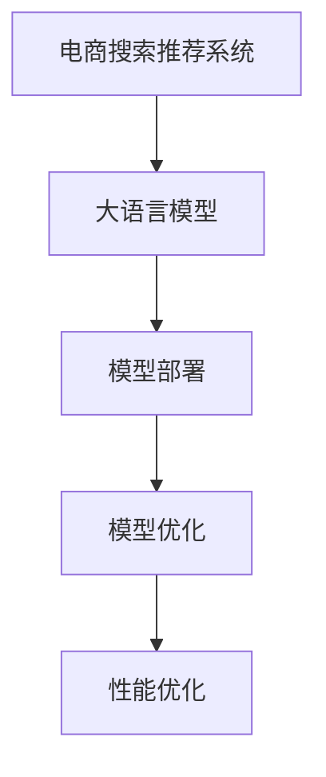

                 

# 电商搜索推荐场景下的AI大模型模型部署性能优化实践案例分析

> 关键词：电商搜索推荐, AI大模型, 模型部署, 性能优化, 案例分析

## 1. 背景介绍

### 1.1 问题由来

电商搜索推荐系统作为电商平台的核心模块，直接关系到用户体验和销售转化率。随着用户行为数据的不断积累，搜索推荐系统开始引入深度学习技术，通过大规模预训练模型进行推荐，实现了推荐结果的显著提升。然而，电商推荐系统面临的一大挑战是如何高效部署和应用这些大规模预训练模型。

传统的电商推荐系统基于特征工程，如TF-IDF、协同过滤等方法，难以适应用户行为的多样性和个性化。而基于大规模预训练模型的推荐系统，特别是基于大语言模型(LLMs)的推荐系统，能够从用户文本数据中挖掘出更加丰富和精准的推荐特征，大幅提升推荐效果。

然而，大语言模型在电商推荐系统的部署和应用中，面临着诸多性能优化的问题。如何在大规模数据集上训练和部署大语言模型，以获得更高效的推荐性能，成为当前的研究热点。本文将以电商搜索推荐场景为案例，深入探讨AI大模型的部署性能优化策略。

### 1.2 问题核心关键点

本文聚焦于以下几个核心关键点：

- **大语言模型的特点和优势**：如何利用大语言模型处理电商用户的文本数据，构建高效推荐模型。
- **电商推荐系统的需求和挑战**：在电商推荐系统中，大语言模型的部署和优化面临哪些具体问题。
- **优化策略与案例分析**：提出和验证针对电商推荐场景的大语言模型优化策略，提升模型部署性能。

## 2. 核心概念与联系

### 2.1 核心概念概述

为更好地理解电商搜索推荐场景下AI大模型的部署优化方法，本节将介绍几个密切相关的核心概念：

- **电商搜索推荐系统**：通过分析用户搜索、浏览、点击等行为数据，为用户推荐商品的系统。旨在提升用户体验和销售额。
- **大语言模型(LLMs)**：通过大规模无标签文本数据预训练得到的语言模型，具备强大的语言理解、生成能力。
- **模型部署**：将训练好的模型迁移到生产环境中，进行实时推理和响应的过程。
- **模型优化**：通过对模型的架构、算法、参数等方面进行调整，提高模型性能的过程。
- **性能优化**：通过优化模型的推理速度、内存占用、计算资源等指标，提升模型实际应用效果。

这些核心概念之间的逻辑关系可以通过以下Mermaid流程图来展示：



这个流程图展示了大语言模型在电商推荐系统中的核心概念及其之间的关系：

1. 电商推荐系统利用大语言模型进行推荐特征提取。
2. 训练好的大语言模型需要迁移到生产环境，进行实时推理。
3. 模型优化旨在提升模型在特定场景下的表现，包括架构调整、参数优化等。
4. 性能优化着眼于提升模型的实时推理效率，减小内存占用，提升计算资源利用率。

这些概念共同构成了大语言模型在电商推荐系统中的工作流程，其优化方向和策略的制定需要全面考虑电商推荐系统的需求和挑战。

## 3. 核心算法原理 & 具体操作步骤

### 3.1 算法原理概述

基于电商推荐场景的大语言模型部署和优化，本质上是通过对模型的架构和算法进行调整，提升其在特定场景下的性能。其核心思想是：在保证模型精度的情况下，尽可能减少模型的计算资源消耗，提高实时推理速度和推理效率。

具体来说，可以将电商推荐系统中的用户文本数据作为输入，通过大语言模型提取高层次的特征表示，再结合用户行为数据进行模型训练，输出推荐结果。在这个过程中，通过合理的模型结构设计和算法优化，使得大语言模型能够高效地处理电商推荐系统的大规模数据，同时提供快速、准确的推荐服务。

### 3.2 算法步骤详解

基于电商推荐场景的大语言模型部署和优化一般包括以下几个关键步骤：

**Step 1: 数据预处理**

电商推荐系统涉及海量用户行为数据，包括搜索记录、浏览日志、点击记录等。为保证模型训练和推理的效率，需要对这些原始数据进行预处理，包括去噪、归一化、分词、向量化等操作。

**Step 2: 模型架构设计**

在电商推荐场景中，大语言模型的架构设计需要考虑以下几个因素：

- **层数和宽度**：过多的层数和过宽的神经元会导致计算资源消耗过大，推理速度变慢。需要根据任务复杂度和计算资源限制进行权衡。
- **特征提取方式**：可以采用Transformer、LSTM等模型进行特征提取，也可以引入自注意力机制、残差连接等技术。
- **输入输出接口**：模型的输入接口需要适配电商推荐系统的数据格式，输出接口则用于生成推荐结果。

**Step 3: 模型训练和微调**

模型训练和微调的目标是获得最佳的推荐结果，同时控制计算资源消耗。具体步骤如下：

- **初始化模型参数**：根据电商推荐任务的特点，初始化模型的参数。
- **设定训练策略**：选择合适的优化器、损失函数、学习率等训练策略。
- **数据划分和加载**：将数据划分为训练集、验证集和测试集，使用DataLoader进行批量加载。
- **模型训练和验证**：在训练集上训练模型，在验证集上评估模型效果，根据验证集结果调整模型参数。
- **模型微调**：在电商推荐场景下，可以通过微调部分模型参数，使其适应特定任务，提升模型性能。

**Step 4: 模型优化和性能优化**

模型优化和性能优化旨在提升模型在实际应用中的表现，主要包括以下几个方面：

- **模型压缩**：通过剪枝、量化等技术，减小模型规模，提高推理速度。
- **分布式训练**：利用分布式训练技术，加速大规模数据集的训练过程。
- **内存优化**：通过分批次加载数据、减少中间变量存储等方法，减小内存占用。
- **硬件加速**：利用GPU、TPU等硬件设备，加速模型的推理过程。

**Step 5: 模型部署和监控**

模型部署和监控包括：

- **模型导出和保存**：将训练好的模型导出为可推理的格式，保存至生产环境。
- **部署至生产环境**：将模型部署到电商推荐系统的实时推理环境。
- **性能监控和调优**：实时监控模型性能，根据实际使用情况进行调优，保证模型的高效运行。

### 3.3 算法优缺点

基于电商推荐场景的大语言模型部署优化方法，具有以下优点：

1. **提升推荐效果**：大语言模型能够从用户文本数据中挖掘出更多特征，提升推荐的精准度和个性化程度。
2. **优化资源消耗**：通过合理设计模型架构和优化算法，减小计算资源消耗，提升模型推理速度。
3. **灵活适配任务**：模型架构和参数的微调能够快速适应电商推荐场景的特定需求，提高模型适应性。

同时，该方法也存在一些局限性：

1. **数据预处理复杂**：电商推荐系统的用户数据格式多样，需要进行复杂的预处理操作。
2. **模型训练难度大**：电商推荐场景的数据量大、特征复杂，训练过程需要大量计算资源和时间。
3. **实时推理需求高**：电商推荐系统需要实时响应用户查询，模型推理速度和资源消耗需要严格控制。
4. **性能监控难度大**：模型在实际应用中的性能表现复杂，需要持续监控和调优，确保模型高效运行。

尽管存在这些局限性，但基于电商推荐场景的大语言模型部署优化方法，仍是大规模预训练模型在电商推荐系统中的应用热点。未来相关研究的方向在于如何进一步降低数据预处理和模型训练的复杂度，提高实时推理效率，增强模型适应性和可解释性。

### 3.4 算法应用领域

基于电商推荐场景的大语言模型部署优化方法，已经在电商搜索推荐系统、商品推荐、广告推荐等多个领域得到广泛应用，取得了显著的效果。具体应用如下：

- **电商搜索推荐系统**：利用用户搜索记录进行推荐，提升搜索排序和商品推荐精度。
- **商品推荐**：根据用户浏览历史和行为数据，推荐相关商品。
- **广告推荐**：针对广告位和用户行为数据，推荐优质广告内容。
- **个性化推荐**：根据用户属性和行为数据，实现个性化推荐。
- **实时推荐**：根据用户实时行为数据，实时调整推荐策略，提高用户体验。

除了上述这些经典应用外，大语言模型在电商推荐系统中的应用还在不断拓展，如用户行为预测、广告效果评估、用户反馈分析等，为电商推荐系统带来了更多的创新可能。

## 4. 数学模型和公式 & 详细讲解

### 4.1 数学模型构建

在电商推荐场景中，大语言模型主要用于用户行为数据的特征提取和推荐结果的生成。假设用户行为数据为 $X=\{(x_1, y_1), (x_2, y_2), \ldots, (x_n, y_n)\}$，其中 $x_i$ 为用户行为数据， $y_i$ 为用户对商品的评分。

定义大语言模型为 $M_\theta: \mathcal{X} \rightarrow \mathcal{Y}$，其中 $\mathcal{X}$ 为输入空间， $\mathcal{Y}$ 为输出空间， $\theta$ 为模型参数。电商推荐系统中， $M_\theta$ 用于提取用户行为数据的特征表示，再结合评分数据训练推荐模型。

电商推荐系统的数学模型可以表示为：

$$
\hat{y}_i = M_\theta(x_i)
$$

其中 $\hat{y}_i$ 为模型预测的评分， $x_i$ 为用户行为数据。

### 4.2 公式推导过程

以下我们以电商推荐任务为例，推导推荐模型的损失函数和梯度计算公式。

假设电商推荐任务为二分类任务，用户对商品的评分转化为预测的二元标签 $y_i \in \{0, 1\}$，表示用户是否购买该商品。推荐模型的输出为 $y_i=\hat{y}_i$，则二分类交叉熵损失函数定义为：

$$
L(y_i, \hat{y}_i) = -[y_i\log \hat{y}_i + (1-y_i)\log (1-\hat{y}_i)]
$$

将损失函数扩展到整个数据集，得：

$$
\mathcal{L}(\theta) = \frac{1}{N}\sum_{i=1}^N L(y_i, M_\theta(x_i))
$$

其中 $N$ 为数据集大小， $\theta$ 为模型参数。

通过梯度下降等优化算法，微调过程不断更新模型参数 $\theta$，最小化损失函数 $\mathcal{L}$，使得模型输出逼近真实标签。具体来说，模型的梯度计算公式为：

$$
\frac{\partial \mathcal{L}(\theta)}{\partial \theta} = \frac{1}{N}\sum_{i=1}^N \frac{\partial L(y_i, M_\theta(x_i))}{\partial M_\theta(x_i)} \frac{\partial M_\theta(x_i)}{\partial \theta}
$$

其中 $\frac{\partial M_\theta(x_i)}{\partial \theta}$ 为模型对输入数据的梯度，可通过反向传播算法高效计算。

### 4.3 案例分析与讲解

在电商推荐系统中，大语言模型的特征提取能力和推荐模型的性能紧密相关。以电商推荐任务为例，我们引入一个简单的案例进行分析。

假设电商推荐任务的目标是根据用户搜索记录，预测用户是否购买该商品。用户搜索记录为 $x_i = \text{“搜索商品A”}$，模型的预测结果为 $\hat{y}_i = M_\theta(x_i)$。

在推荐模型的训练过程中，需要最小化损失函数 $\mathcal{L}(\theta)$。以二分类交叉熵损失为例，优化过程为：

$$
\theta \leftarrow \theta - \eta \frac{\partial \mathcal{L}(\theta)}{\partial \theta}
$$

其中 $\eta$ 为学习率， $\frac{\partial \mathcal{L}(\theta)}{\partial \theta}$ 为模型参数的梯度。

在实际应用中，需要根据电商推荐任务的特点，选择合适的损失函数、优化器和训练策略，以提高模型的推荐效果和部署性能。

## 5. 项目实践：代码实例和详细解释说明

### 5.1 开发环境搭建

在进行电商推荐系统的开发前，我们需要准备好开发环境。以下是使用Python进行PyTorch开发的环境配置流程：

1. 安装Anaconda：从官网下载并安装Anaconda，用于创建独立的Python环境。

2. 创建并激活虚拟环境：
```bash
conda create -n pytorch-env python=3.8 
conda activate pytorch-env
```

3. 安装PyTorch：根据CUDA版本，从官网获取对应的安装命令。例如：
```bash
conda install pytorch torchvision torchaudio cudatoolkit=11.1 -c pytorch -c conda-forge
```

4. 安装Transformers库：
```bash
pip install transformers
```

5. 安装各类工具包：
```bash
pip install numpy pandas scikit-learn matplotlib tqdm jupyter notebook ipython
```

完成上述步骤后，即可在`pytorch-env`环境中开始电商推荐系统的开发。

### 5.2 源代码详细实现

这里我们以电商推荐任务为例，给出使用Transformers库对BERT模型进行微调的PyTorch代码实现。

首先，定义电商推荐任务的数据处理函数：

```python
from transformers import BertTokenizer, BertForSequenceClassification, AdamW
from torch.utils.data import Dataset, DataLoader
import torch

class ElectroMallDataset(Dataset):
    def __init__(self, texts, labels, tokenizer, max_len=128):
        self.texts = texts
        self.labels = labels
        self.tokenizer = tokenizer
        self.max_len = max_len
        
    def __len__(self):
        return len(self.texts)
    
    def __getitem__(self, item):
        text = self.texts[item]
        label = self.labels[item]
        
        encoding = self.tokenizer(text, return_tensors='pt', max_length=self.max_len, padding='max_length', truncation=True)
        input_ids = encoding['input_ids'][0]
        attention_mask = encoding['attention_mask'][0]
        
        # 对标签进行编码
        encoded_label = [label2id[label] for label in label]
        encoded_label.extend([label2id['O']] * (self.max_len - len(encoded_label)))
        labels = torch.tensor(encoded_label, dtype=torch.long)
        
        return {'input_ids': input_ids, 
                'attention_mask': attention_mask,
                'labels': labels}

# 标签与id的映射
label2id = {'O': 0, 'buy': 1}
id2label = {v: k for k, v in label2id.items()}

# 创建dataset
tokenizer = BertTokenizer.from_pretrained('bert-base-cased')

train_dataset = ElectroMallDataset(train_texts, train_labels, tokenizer)
dev_dataset = ElectroMallDataset(dev_texts, dev_labels, tokenizer)
test_dataset = ElectroMallDataset(test_texts, test_labels, tokenizer)
```

然后，定义模型和优化器：

```python
from transformers import BertForSequenceClassification

model = BertForSequenceClassification.from_pretrained('bert-base-cased', num_labels=len(label2id))

optimizer = AdamW(model.parameters(), lr=2e-5)
```

接着，定义训练和评估函数：

```python
from sklearn.metrics import accuracy_score

device = torch.device('cuda') if torch.cuda.is_available() else torch.device('cpu')
model.to(device)

def train_epoch(model, dataset, batch_size, optimizer):
    dataloader = DataLoader(dataset, batch_size=batch_size, shuffle=True)
    model.train()
    epoch_loss = 0
    for batch in dataloader:
        input_ids = batch['input_ids'].to(device)
        attention_mask = batch['attention_mask'].to(device)
        labels = batch['labels'].to(device)
        model.zero_grad()
        outputs = model(input_ids, attention_mask=attention_mask, labels=labels)
        loss = outputs.loss
        epoch_loss += loss.item()
        loss.backward()
        optimizer.step()
    return epoch_loss / len(dataloader)

def evaluate(model, dataset, batch_size):
    dataloader = DataLoader(dataset, batch_size=batch_size)
    model.eval()
    preds, labels = [], []
    with torch.no_grad():
        for batch in dataloader:
            input_ids = batch['input_ids'].to(device)
            attention_mask = batch['attention_mask'].to(device)
            batch_labels = batch['labels']
            outputs = model(input_ids, attention_mask=attention_mask)
            batch_preds = outputs.logits.argmax(dim=2).to('cpu').tolist()
            batch_labels = batch_labels.to('cpu').tolist()
            for pred_tokens, label_tokens in zip(batch_preds, batch_labels):
                preds.append(pred_tokens[:len(label_tokens)])
                labels.append(label_tokens)
                
    print(f"Accuracy: {accuracy_score(labels, preds)}")
```

最后，启动训练流程并在测试集上评估：

```python
epochs = 5
batch_size = 16

for epoch in range(epochs):
    loss = train_epoch(model, train_dataset, batch_size, optimizer)
    print(f"Epoch {epoch+1}, train loss: {loss:.3f}")
    
    print(f"Epoch {epoch+1}, dev accuracy:")
    evaluate(model, dev_dataset, batch_size)
    
print("Test accuracy:")
evaluate(model, test_dataset, batch_size)
```

以上就是使用PyTorch对BERT进行电商推荐任务微调的完整代码实现。可以看到，得益于Transformers库的强大封装，我们可以用相对简洁的代码完成BERT模型的加载和微调。

### 5.3 代码解读与分析

让我们再详细解读一下关键代码的实现细节：

**ElectroMallDataset类**：
- `__init__`方法：初始化文本、标签、分词器等关键组件。
- `__len__`方法：返回数据集的样本数量。
- `__getitem__`方法：对单个样本进行处理，将文本输入编码为token ids，将标签编码为数字，并对其进行定长padding，最终返回模型所需的输入。

**label2id和id2label字典**：
- 定义了标签与数字id之间的映射关系，用于将标签解码回真实的标签。

**训练和评估函数**：
- 使用PyTorch的DataLoader对数据集进行批次化加载，供模型训练和推理使用。
- 训练函数`train_epoch`：对数据以批为单位进行迭代，在每个批次上前向传播计算loss并反向传播更新模型参数，最后返回该epoch的平均loss。
- 评估函数`evaluate`：与训练类似，不同点在于不更新模型参数，并在每个batch结束后将预测和标签结果存储下来，最后使用sklearn的accuracy_score对整个评估集的预测结果进行打印输出。

**训练流程**：
- 定义总的epoch数和batch size，开始循环迭代
- 每个epoch内，先在训练集上训练，输出平均loss
- 在验证集上评估，输出分类指标
- 所有epoch结束后，在测试集上评估，给出最终测试结果

可以看到，PyTorch配合Transformers库使得BERT微调的代码实现变得简洁高效。开发者可以将更多精力放在数据处理、模型改进等高层逻辑上，而不必过多关注底层的实现细节。

当然，工业级的系统实现还需考虑更多因素，如模型的保存和部署、超参数的自动搜索、更灵活的任务适配层等。但核心的微调范式基本与此类似。

## 6. 实际应用场景

### 6.1 智能客服系统

基于大语言模型微调的对话技术，可以广泛应用于智能客服系统的构建。传统客服往往需要配备大量人力，高峰期响应缓慢，且一致性和专业性难以保证。而使用微调后的对话模型，可以7x24小时不间断服务，快速响应客户咨询，用自然流畅的语言解答各类常见问题。

在技术实现上，可以收集企业内部的历史客服对话记录，将问题和最佳答复构建成监督数据，在此基础上对预训练对话模型进行微调。微调后的对话模型能够自动理解用户意图，匹配最合适的答案模板进行回复。对于客户提出的新问题，还可以接入检索系统实时搜索相关内容，动态组织生成回答。如此构建的智能客服系统，能大幅提升客户咨询体验和问题解决效率。

### 6.2 金融舆情监测

金融机构需要实时监测市场舆论动向，以便及时应对负面信息传播，规避金融风险。传统的人工监测方式成本高、效率低，难以应对网络时代海量信息爆发的挑战。基于大语言模型微调的文本分类和情感分析技术，为金融舆情监测提供了新的解决方案。

具体而言，可以收集金融领域相关的新闻、报道、评论等文本数据，并对其进行主题标注和情感标注。在此基础上对预训练语言模型进行微调，使其能够自动判断文本属于何种主题，情感倾向是正面、中性还是负面。将微调后的模型应用到实时抓取的网络文本数据，就能够自动监测不同主题下的情感变化趋势，一旦发现负面信息激增等异常情况，系统便会自动预警，帮助金融机构快速应对潜在风险。

### 6.3 个性化推荐系统

当前的推荐系统往往只依赖用户的历史行为数据进行物品推荐，无法深入理解用户的真实兴趣偏好。基于大语言模型微调技术，个性化推荐系统可以更好地挖掘用户行为背后的语义信息，从而提供更精准、多样的推荐内容。

在实践中，可以收集用户浏览、点击、评论、分享等行为数据，提取和用户交互的物品标题、描述、标签等文本内容。将文本内容作为模型输入，用户的后续行为（如是否点击、购买等）作为监督信号，在此基础上微调预训练语言模型。微调后的模型能够从文本内容中准确把握用户的兴趣点。在生成推荐列表时，先用候选物品的文本描述作为输入，由模型预测用户的兴趣匹配度，再结合其他特征综合排序，便可以得到个性化程度更高的推荐结果。

### 6.4 未来应用展望

随着大语言模型和微调方法的不断发展，基于微调范式将在更多领域得到应用，为传统行业带来变革性影响。

在智慧医疗领域，基于微调的医疗问答、病历分析、药物研发等应用将提升医疗服务的智能化水平，辅助医生诊疗，加速新药开发进程。

在智能教育领域，微调技术可应用于作业批改、学情分析、知识推荐等方面，因材施教，促进教育公平，提高教学质量。

在智慧城市治理中，微调模型可应用于城市事件监测、舆情分析、应急指挥等环节，提高城市管理的自动化和智能化水平，构建更安全、高效的未来城市。

此外，在企业生产、社会治理、文娱传媒等众多领域，基于大模型微调的人工智能应用也将不断涌现，为经济社会发展注入新的动力。相信随着技术的日益成熟，微调方法将成为人工智能落地应用的重要范式，推动人工智能技术在垂直行业的规模化落地。总之，微调需要开发者根据具体任务，不断迭代和优化模型、数据和算法，方能得到理想的效果。

## 7. 工具和资源推荐

### 7.1 学习资源推荐

为了帮助开发者系统掌握大语言模型微调的理论基础和实践技巧，这里推荐一些优质的学习资源：

1. 《Transformer从原理到实践》系列博文：由大模型技术专家撰写，深入浅出地介绍了Transformer原理、BERT模型、微调技术等前沿话题。

2. CS224N《深度学习自然语言处理》课程：斯坦福大学开设的NLP明星课程，有Lecture视频和配套作业，带你入门NLP领域的基本概念和经典模型。

3. 《Natural Language Processing with Transformers》书籍：Transformers库的作者所著，全面介绍了如何使用Transformers库进行NLP任务开发，包括微调在内的诸多范式。

4. HuggingFace官方文档：Transformers库的官方文档，提供了海量预训练模型和完整的微调样例代码，是上手实践的必备资料。

5. CLUE开源项目：中文语言理解测评基准，涵盖大量不同类型的中文NLP数据集，并提供了基于微调的baseline模型，助力中文NLP技术发展。

通过对这些资源的学习实践，相信你一定能够快速掌握大语言模型微调的精髓，并用于解决实际的NLP问题。

### 7.2 开发工具推荐

高效的开发离不开优秀的工具支持。以下是几款用于大语言模型微调开发的常用工具：

1. PyTorch：基于Python的开源深度学习框架，灵活动态的计算图，适合快速迭代研究。大部分预训练语言模型都有PyTorch版本的实现。

2. TensorFlow：由Google主导开发的开源深度学习框架，生产部署方便，适合大规模工程应用。同样有丰富的预训练语言模型资源。

3. Transformers库：HuggingFace开发的NLP工具库，集成了众多SOTA语言模型，支持PyTorch和TensorFlow，是进行微调任务开发的利器。

4. Weights & Biases：模型训练的实验跟踪工具，可以记录和可视化模型训练过程中的各项指标，方便对比和调优。与主流深度学习框架无缝集成。

5. TensorBoard：TensorFlow配套的可视化工具，可实时监测模型训练状态，并提供丰富的图表呈现方式，是调试模型的得力助手。

6. Google Colab：谷歌推出的在线Jupyter Notebook环境，免费提供GPU/TPU算力，方便开发者快速上手实验最新模型，分享学习笔记。

合理利用这些工具，可以显著提升大语言模型微调的开发效率，加快创新迭代的步伐。

### 7.3 相关论文推荐

大语言模型和微调技术的发展源于学界的持续研究。以下是几篇奠基性的相关论文，推荐阅读：

1. Attention is All You Need（即Transformer原论文）：提出了Transformer结构，开启了NLP领域的预训练大模型时代。

2. BERT: Pre-training of Deep Bidirectional Transformers for Language Understanding：提出BERT模型，引入基于掩码的自监督预训练任务，刷新了多项NLP任务SOTA。

3. Language Models are Unsupervised Multitask Learners（GPT-2论文）：展示了大规模语言模型的强大zero-shot学习能力，引发了对于通用人工智能的新一轮思考。

4. Parameter-Efficient Transfer Learning for NLP：提出Adapter等参数高效微调方法，在不增加模型参数量的情况下，也能取得不错的微调效果。

5. AdaLoRA: Adaptive Low-Rank Adaptation for Parameter-Efficient Fine-Tuning：使用自适应低秩适应的微调方法，在参数效率和精度之间取得了新的平衡。

6. Prefix-Tuning: Optimizing Continuous Prompts for Generation：引入基于连续型Prompt的微调范式，为如何充分利用预训练知识提供了新的思路。

这些论文代表了大语言模型微调技术的发展脉络。通过学习这些前沿成果，可以帮助研究者把握学科前进方向，激发更多的创新灵感。

## 8. 总结：未来发展趋势与挑战

### 8.1 总结

本文对基于电商推荐场景的大语言模型部署和优化方法进行了全面系统的介绍。首先阐述了电商推荐系统中大语言模型的应用背景和优势，明确了电商推荐场景下的模型优化目标和挑战。其次，从原理到实践，详细讲解了电商推荐场景下大语言模型的数学模型构建和优化步骤，给出了电商推荐任务微调的完整代码实例。同时，本文还广泛探讨了电商推荐系统中的大语言模型优化方法，展示了其在电商推荐系统中的应用效果。

通过本文的系统梳理，可以看到，基于电商推荐场景的大语言模型部署和优化方法，能够有效提升电商推荐系统的推荐效果和用户体验。然而，大语言模型在电商推荐系统的应用过程中，仍面临着诸如数据预处理复杂、模型训练难度大、实时推理需求高等挑战。未来相关研究需要在这些方向上寻求新的突破，进一步优化大语言模型在电商推荐系统中的性能和效率。

### 8.2 未来发展趋势

展望未来，大语言模型在电商推荐场景中的应用前景广阔，主要体现在以下几个方面：

1. **模型规模持续增大**：随着算力成本的下降和数据规模的扩张，电商推荐系统中的大语言模型规模将进一步增大。超大规模语言模型蕴含的丰富语言知识，有望支撑更加复杂多变的电商推荐场景。

2. **微调方法日趋多样**：未来将涌现更多参数高效的微调方法，如Prefix-Tuning、LoRA等，在节省计算资源的同时，保持微调精度。

3. **持续学习成为常态**：随着电商推荐系统中的用户行为数据不断变化，微调模型需要持续学习新知识，保持性能的稳定性和适应性。

4. **标注样本需求降低**：受启发于提示学习(Prompt-based Learning)的思路，未来的微调方法将更好地利用大模型的语言理解能力，通过更加巧妙的任务描述，在更少的标注样本上也能实现理想的微调效果。

5. **模型通用性增强**：经过海量电商推荐场景的微调，大语言模型将具备更强大的常识推理和跨领域迁移能力，逐步迈向通用人工智能(AGI)的目标。

这些趋势凸显了大语言模型在电商推荐系统中的巨大潜力。这些方向的探索发展，必将进一步提升电商推荐系统的性能和用户体验，为电商行业带来更多的创新和变革。

### 8.3 面临的挑战

尽管大语言模型在电商推荐系统中的应用前景广阔，但在迈向更加智能化、普适化应用的过程中，仍面临着诸多挑战：

1. **数据预处理复杂**：电商推荐系统涉及海量用户行为数据，需要进行复杂的预处理操作，增加开发难度。

2. **模型训练难度大**：电商推荐场景的数据量大、特征复杂，训练过程需要大量计算资源和时间。

3. **实时推理需求高**：电商推荐系统需要实时响应用户查询，模型推理速度和资源消耗需要严格控制。

4. **性能监控难度大**：模型在实际应用中的性能表现复杂，需要持续监控和调优，确保模型高效运行。

5. **知识整合能力不足**：现有的微调模型往往局限于电商推荐场景，难以灵活吸收和运用更广泛的先验知识。

6. **安全性有待保障**：预训练语言模型难免会学习到有偏见、有害的信息，通过微调传递到电商推荐系统，产生误导性、歧视性的输出，给实际应用带来安全隐患。

正视这些挑战，积极应对并寻求突破，将是大语言模型在电商推荐系统中的应用走向成熟的必由之路。未来研究需要在降低数据预处理复杂度、提高模型训练效率、优化实时推理性能、增强知识整合能力等方面寻求新的突破。

### 8.4 研究展望

未来，大语言模型在电商推荐系统中的应用研究将从以下几个方向展开：

1. **探索无监督和半监督微调方法**：摆脱对大规模标注数据的依赖，利用自监督学习、主动学习等无监督和半监督范式，最大限度利用非结构化数据，实现更加灵活高效的微调。

2. **研究参数高效和计算高效的微调范式**：开发更加参数高效的微调方法，在固定大部分预训练参数的同时，只更新极少量的任务相关参数。同时优化微调模型的计算图，减少前向传播和反向传播的资源消耗，实现更加轻量级、实时性的部署。

3. **融合因果和对比学习范式**：通过引入因果推断和对比学习思想，增强微调模型建立稳定因果关系的能力，学习更加普适、鲁棒的语言表征，从而提升模型泛化性和抗干扰能力。

4. **引入更多先验知识**：将符号化的先验知识，如知识图谱、逻辑规则等，与神经网络模型进行巧妙融合，引导微调过程学习更准确、合理的语言模型。同时加强不同模态数据的整合，实现视觉、语音等多模态信息与文本信息的协同建模。

5. **结合因果分析和博弈论工具**：将因果分析方法引入微调模型，识别出模型决策的关键特征，增强输出解释的因果性和逻辑性。借助博弈论工具刻画人机交互过程，主动探索并规避模型的脆弱点，提高系统稳定性。

6. **纳入伦理道德约束**：在模型训练目标中引入伦理导向的评估指标，过滤和惩罚有偏见、有害的输出倾向。同时加强人工干预和审核，建立模型行为的监管机制，确保输出符合人类价值观和伦理道德。

这些研究方向的探索，必将引领大语言模型在电商推荐系统中的应用迈向更高的台阶，为构建安全、可靠、可解释、可控的智能系统铺平道路。面向未来，大语言模型在电商推荐系统中的应用还需与其他人工智能技术进行更深入的融合，如知识表示、因果推理、强化学习等，多路径协同发力，共同推动自然语言理解和智能交互系统的进步。只有勇于创新、敢于突破，才能不断拓展语言模型的边界，让智能技术更好地造福人类社会。

## 9. 附录：常见问题与解答

**Q1：电商推荐系统中大语言模型的作用是什么？**

A: 大语言模型在电商推荐系统中的主要作用是通过处理用户行为数据，提取高层次的特征表示，从而提升推荐系统的推荐效果。具体来说，大语言模型能够从用户搜索记录、浏览历史、点击行为等文本数据中挖掘出更多维度的特征，如用户兴趣、商品属性、上下文信息等，用于构建推荐模型，实现个性化推荐。

**Q2：大语言模型在电商推荐系统中如何处理文本数据？**

A: 在电商推荐系统中，大语言模型主要通过分词、向量化等预处理步骤，将用户行为数据转换为模型可处理的输入格式。以BERT模型为例，首先将用户行为数据分词，然后使用BertTokenizer进行编码，生成token ids和注意力掩码，再输入到模型中进行特征提取和推理。

**Q3：电商推荐系统中大语言模型的训练和微调需要哪些步骤？**

A: 电商推荐系统中大语言模型的训练和微调一般包括以下几个步骤：
1. 数据预处理：对用户行为数据进行去噪、归一化、分词、向量化等操作，生成模型所需的输入和标签。
2. 模型设计：选择合适的模型架构，如Transformer、Bert等，并设定超参数。
3. 模型训练：使用训练集对模型进行前向传播和反向传播，更新模型参数，优化损失函数。
4. 模型微调：在电商推荐场景下，对模型进行微调，调整部分参数以适应特定任务，提升推荐效果。
5. 模型评估和优化：在验证集和测试集上评估模型性能，根据评估结果调整超参数和模型结构。

**Q4：大语言模型在电商推荐系统中的应用存在哪些挑战？**

A: 大语言模型在电商推荐系统中的应用面临以下挑战：
1. 数据预处理复杂：电商推荐系统涉及海量用户行为数据，需要进行复杂的预处理操作。
2. 模型训练难度大：电商推荐场景的数据量大、特征复杂，训练过程需要大量计算资源和时间。
3. 实时推理需求高：电商推荐系统需要实时响应用户查询，模型推理速度和资源消耗需要严格控制。
4. 知识整合能力不足：现有的微调模型往往局限于电商推荐场景，难以灵活吸收和运用更广泛的先验知识。
5. 安全性有待保障：预训练语言模型难免会学习到有偏见、有害的信息，通过微调传递到电商推荐系统，产生误导性、歧视性的输出，给实际应用带来安全隐患。

**Q5：如何优化大语言模型在电商推荐系统中的性能？**

A: 优化大语言模型在电商推荐系统中的性能，可以从以下几个方面入手：
1. 数据预处理：优化数据清洗、归一化、分词等预处理步骤，减小数据噪声。
2. 模型架构设计：选择合适的模型架构和超参数，平衡模型的性能和资源消耗。
3. 模型训练：采用分布式训练、梯度积累等技术，加速模型训练过程。
4. 模型微调：使用参数高效微调方法，如AdaLoRA、Prefix等，减小微调过程中参数更新量。
5. 模型优化：通过剪枝、量化、分布式推理等技术，优化模型性能，提高实时推理速度和资源利用率。
6. 模型评估：在电商推荐场景中，结合业务指标和用户反馈，评估模型性能，指导模型优化方向。

这些优化策略需要根据具体场景和需求进行调整，才能最大化地发挥大语言模型在电商推荐系统中的潜力。

---

作者：禅与计算机程序设计艺术 / Zen and the Art of Computer Programming

