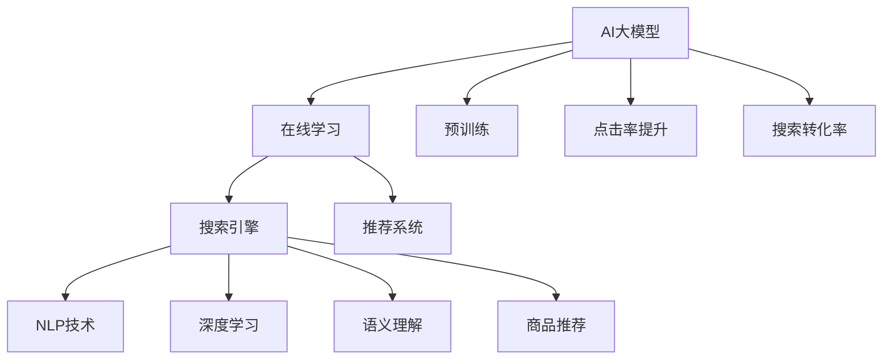

                 

# 电商搜索推荐效果优化中的AI大模型在线学习技术

> 关键词：AI大模型, 在线学习, 搜索引擎, 推荐系统, 自然语言处理(NLP), 深度学习, 语义理解, 商品推荐, 点击率提升, 搜索转化率

## 1. 背景介绍

在当今数字化时代，电子商务平台已成为连接消费者和商家的重要桥梁。电商平台的成功与否，很大程度上取决于其搜索推荐系统的表现。一个高效的搜索推荐系统，能够快速响应用户的查询，准确地展示相关商品，显著提升用户体验和转化率。然而，随着商品种类日益丰富，搜索推荐系统的复杂性不断提升，单纯依赖传统推荐算法难以满足用户多样化的需求。

近年来，人工智能大模型在电商搜索推荐领域的应用，显著提升了系统的精准度和用户体验。大模型利用深度学习、自然语言处理等前沿技术，通过对大量文本数据的预训练，具备强大的语义理解和生成能力，能够从海量商品信息中提取出关键特征，并应用于搜索推荐场景中。本文将重点介绍AI大模型在电商搜索推荐系统中的在线学习技术，探究其提升搜索推荐效果的核心原理和具体操作步骤。

## 2. 核心概念与联系

### 2.1 核心概念概述

为更好地理解AI大模型在电商搜索推荐中的应用，我们首先介绍几个核心概念：

- AI大模型（AI Large Models）：以深度学习模型为代表的、包含数十亿或更多参数的模型，如GPT-3、BERT等。通过大规模无标签数据预训练，具备强大的语义理解和生成能力，能够在多种任务上获得显著效果。

- 在线学习（Online Learning）：一种在数据逐点出现的场景下，动态更新模型参数的学习方法。在线学习可以实时响应数据变化，适应用户查询行为的动态性。

- 搜索引擎（Search Engine）：用户输入查询后，系统返回与查询相关的搜索结果的网站。搜索引擎的核心在于理解用户查询意图，并快速返回相关结果。

- 推荐系统（Recommendation System）：根据用户的历史行为和偏好，推荐可能感兴趣的商品的系统。推荐系统利用用户数据，提高用户的满意度和转化率。

- 自然语言处理（NLP）：研究如何让计算机理解和处理人类语言的技术，涵盖词法分析、句法分析、语义分析等任务。

- 深度学习（Deep Learning）：一种基于神经网络的机器学习技术，通过多层次的非线性变换，可以提取复杂特征。

- 语义理解（Semantic Understanding）：理解文本背后的意义和逻辑，将语义信息转化为计算机可理解的形式。

- 商品推荐（Product Recommendation）：根据用户历史行为和实时数据，推荐用户可能感兴趣的商品。

- 点击率提升（Click-Through Rate Improvement）：提高用户点击搜索结果的百分比，提升用户使用平台的兴趣和频率。

- 搜索转化率（Search Conversion Rate）：用户点击搜索结果并完成购买的比例，衡量搜索系统的效果。

这些核心概念之间的逻辑关系可以通过以下Mermaid流程图来展示：



这个流程图展示了AI大模型在电商搜索推荐中的核心概念及其关系：

1. AI大模型通过预训练获得基础能力。
2. 在线学习利用实时数据动态更新模型，适应用户查询的动态性。
3. 搜索引擎通过NLP技术理解用户查询，返回相关搜索结果。
4. 推荐系统利用深度学习提取商品特征，进行精准推荐。
5. 语义理解将自然语言转化为计算机可理解的形式，提升系统理解能力。
6. 商品推荐结合点击率提升和搜索转化率，提高用户满意度和购买率。

## 3. 核心算法原理 & 具体操作步骤

### 3.1 算法原理概述

AI大模型在电商搜索推荐中的应用，主要通过在线学习技术来实现。在线学习通过逐步更新模型参数，适应数据分布的变化，提升模型效果。其核心原理包括以下几个方面：

- **预训练**：在大规模无标签数据上对AI大模型进行预训练，学习通用的语言和商品特征表示。
- **在线更新**：在用户查询实时产生时，动态更新模型参数，适应当前查询行为。
- **增量学习**：利用增量学习算法，在每次更新时仅关注新数据的特征，避免完全重训模型。
- **模型融合**：将不同模型的输出进行融合，提高推荐系统的综合性能。
- **上下文感知**：考虑用户的历史行为、时间、位置等因素，增强推荐系统的个性化和情境化。

### 3.2 算法步骤详解

以下我们详细介绍AI大模型在电商搜索推荐中在线学习的详细步骤：

**Step 1: 准备预训练模型和数据集**
- 选择合适的AI大模型，如GPT-3、BERT等，作为初始化参数。
- 准备电商平台的商品信息数据集，包含商品名称、描述、价格、用户评分等信息。
- 收集用户查询日志和点击行为，构建查询-商品点击对的训练数据集。

**Step 2: 设计模型结构**
- 设计包含编码器-解码器的模型结构，如Seq2Seq模型，用于将用户查询转化为商品ID。
- 设计商品推荐模型，如序列预测模型，用于生成推荐商品ID。

**Step 3: 训练模型**
- 将训练数据划分为训练集、验证集和测试集。
- 使用在线学习算法，如Mini-Batch SGD，逐步更新模型参数。
- 在每个训练轮次中，随机抽取小批量查询-商品点击对进行训练。
- 在验证集上评估模型性能，根据验证误差调整模型参数和学习率。

**Step 4: 部署模型**
- 将训练好的模型部署到生产环境中，实时响应用户查询。
- 使用缓存和负载均衡技术，确保模型的高可用性和响应速度。
- 定期更新模型参数，保持模型的最新状态。

**Step 5: 模型评估与优化**
- 在测试集上评估模型的点击率提升和搜索转化率。
- 分析模型性能瓶颈，优化模型结构和训练策略。
- 收集用户反馈，调整模型行为，提高用户满意度。

### 3.3 算法优缺点

AI大模型在电商搜索推荐中的应用具有以下优点：
1. 强大的语义理解能力：能够理解复杂查询背后的意图，提供精准的搜索结果。
2. 实时动态更新：能够快速适应用户查询行为的变化，提升用户体验。
3. 高精准度推荐：利用深度学习技术，提取商品关键特征，提高推荐系统的准确性。
4. 数据自适应：能够自动学习新数据和新用户的行为模式，提高模型的泛化能力。

同时，该方法也存在一些局限性：
1. 数据隐私问题：电商平台需要收集用户行为数据，可能涉及隐私问题。
2. 高计算成本：大模型的训练和推理需要高性能硬件，成本较高。
3. 模型复杂度高：大模型的参数量庞大，模型部署和优化难度较大。
4. 依赖数据质量：模型的性能很大程度上依赖于数据的质量和标注情况，获取高质量数据成本较高。

尽管存在这些局限性，但AI大模型在电商搜索推荐中的应用，通过在线学习技术，显著提升了系统的效果和用户体验，成为了当前电商搜索推荐系统的核心技术之一。

### 3.4 算法应用领域

AI大模型在电商搜索推荐中的应用领域非常广泛，涵盖了以下多个方面：

- 用户查询理解：利用自然语言处理技术，理解用户查询背后的意图，提供相关搜索结果。
- 商品特征提取：通过深度学习技术，提取商品名称、描述、价格等关键信息，作为推荐依据。
- 个性化推荐：结合用户历史行为和实时数据，生成个性化推荐列表。
- 点击率提升：通过用户点击行为数据分析，优化搜索结果排序，提升用户点击率。
- 搜索转化率优化：通过用户点击和购买行为的数据分析，优化搜索结果展示，提升搜索转化率。
- 商品分类与聚类：利用大模型的分类和聚类能力，对商品进行分类和推荐。
- 商品评价与分析：利用大模型的文本处理能力，分析用户对商品的评价，提升产品口碑。

此外，AI大模型在电商搜索推荐中的应用，还涉及了社交网络推荐、内容推荐、跨平台推荐等多个领域，为电商平台的智能化转型提供了强有力的技术支持。

## 4. 数学模型和公式 & 详细讲解 & 举例说明

### 4.1 数学模型构建

本节我们将使用数学语言对AI大模型在电商搜索推荐中的在线学习过程进行更加严格的刻画。

假设用户查询序列为 $q$，商品序列为 $p$，查询-商品点击对为 $(x,y)$，其中 $x$ 为查询-商品对，$y$ 为是否点击的标签。

定义模型 $M$ 在用户查询 $q$ 上的输出为 $\hat{p}=M(q)$，表示系统推荐的商品ID。定义损失函数 $L$ 为交叉熵损失：

$$
L(M(q),y) = -y\log M(q) - (1-y)\log (1-M(q))
$$

其中 $M(q)$ 为模型输出，$y$ 为真实标签。

模型 $M$ 的参数更新公式为：

$$
\theta \leftarrow \theta - \eta \nabla_{\theta}L(M(q),y)
$$

其中 $\eta$ 为学习率，$\nabla_{\theta}L(M(q),y)$ 为损失函数对模型参数的梯度。

### 4.2 公式推导过程

以下我们以序列预测模型为例，推导在线学习过程中模型参数的更新公式。

假设模型 $M$ 为Seq2Seq模型，包含编码器 $E$ 和解码器 $D$，其输入为查询序列 $q$，输出为商品ID $p$。编码器的输出为 $h=E(q)$，解码器的输出为 $\hat{p}=D(h)$。

定义损失函数 $L$ 为交叉熵损失：

$$
L(M(q),y) = -y\log \hat{p} - (1-y)\log (1-\hat{p})
$$

其中 $\hat{p}$ 为模型预测的概率，$y$ 为真实标签。

模型 $M$ 的参数更新公式为：

$$
\theta \leftarrow \theta - \eta \nabla_{\theta}L(M(q),y)
$$

其中 $\theta$ 为模型参数，$\eta$ 为学习率，$\nabla_{\theta}L(M(q),y)$ 为损失函数对模型参数的梯度。

在实际应用中，可以使用反向传播算法计算梯度，并通过在线学习算法更新模型参数。重复上述过程直至模型收敛，最终得到适应电商搜索推荐任务的模型参数。

### 4.3 案例分析与讲解

**案例1：用户查询理解**

假设电商平台收集到以下查询-商品点击对数据：

| 查询               | 商品ID | 点击 |
|-------------------|-------|-----|
| 电商平台推荐手册     | 商品1  | 1   |
| 电商平台推荐手册     | 商品2  | 0   |
| 电商平台推荐手册     | 商品3  | 0   |
| 电商平台推荐手册     | 商品4  | 1   |
| 电商平台推荐手册     | 商品5  | 1   |

使用GPT-3模型进行查询理解，设定标签 $y=1$ 表示点击，$y=0$ 表示未点击。构建训练数据集 $D=\{(q_i,p_i,y_i)\}_{i=1}^5$。

在训练过程中，模型通过反向传播计算梯度，并根据损失函数更新参数。经过多轮迭代，模型学习到查询和商品ID之间的关系，能够准确预测每个查询对应的商品ID。

**案例2：商品推荐**

假设电商平台收集到以下用户查询-商品点击数据：

| 查询         | 商品ID | 点击 |
|------------|-------|-----|
| 商品1         | 商品2  | 1   |
| 商品1         | 商品3  | 0   |
| 商品1         | 商品4  | 1   |
| 商品1         | 商品5  | 0   |
| 商品2         | 商品1  | 1   |
| 商品2         | 商品2  | 0   |
| 商品2         | 商品3  | 1   |
| 商品2         | 商品4  | 0   |
| 商品2         | 商品5  | 1   |
| 商品3         | 商品1  | 0   |
| 商品3         | 商品2  | 1   |
| 商品3         | 商品3  | 0   |
| 商品3         | 商品4  | 1   |
| 商品3         | 商品5  | 0   |
| 商品4         | 商品1  | 0   |
| 商品4         | 商品2  | 0   |
| 商品4         | 商品3  | 1   |
| 商品4         | 商品4  | 0   |
| 商品4         | 商品5  | 1   |
| 商品5         | 商品1  | 1   |
| 商品5         | 商品2  | 0   |
| 商品5         | 商品3  | 0   |
| 商品5         | 商品4  | 0   |
| 商品5         | 商品5  | 1   |

使用深度学习模型进行商品推荐，设定标签 $y=1$ 表示点击，$y=0$ 表示未点击。构建训练数据集 $D=\{(q_i,p_i,y_i)\}_{i=1}^20$。

在训练过程中，模型通过反向传播计算梯度，并根据损失函数更新参数。经过多轮迭代，模型学习到商品ID之间的相关性，能够准确预测每个查询对应的推荐商品ID。

## 5. 项目实践：代码实例和详细解释说明

### 5.1 开发环境搭建

在进行在线学习实践前，我们需要准备好开发环境。以下是使用Python进行TensorFlow开发的环境配置流程：

1. 安装Anaconda：从官网下载并安装Anaconda，用于创建独立的Python环境。

2. 创建并激活虚拟环境：
```bash
conda create -n tf-env python=3.8 
conda activate tf-env
```

3. 安装TensorFlow：根据CUDA版本，从官网获取对应的安装命令。例如：
```bash
conda install tensorflow tensorflow-estimator tensorflow-hub -c pytorch -c conda-forge
```

4. 安装各类工具包：
```bash
pip install numpy pandas scikit-learn matplotlib tqdm jupyter notebook ipython
```

完成上述步骤后，即可在`tf-env`环境中开始在线学习实践。

### 5.2 源代码详细实现

这里我们以序列预测模型为例，给出使用TensorFlow进行电商搜索推荐系统在线学习的PyTorch代码实现。

首先，定义模型结构和损失函数：

```python
import tensorflow as tf
from tensorflow.keras.layers import Input, Embedding, Dense, LSTM
from tensorflow.keras.models import Model
from tensorflow.keras.optimizers import Adam

# 定义模型结构
query_input = Input(shape=(None, ), dtype='int32')
embedding = Embedding(input_dim=vocab_size, output_dim=embedding_dim)(query_input)
lstm = LSTM(units=hidden_size, return_sequences=True)(embedding)
output = Dense(units=num_products, activation='softmax')(lstm)

# 定义模型输出和损失函数
y_true = Input(shape=(None, ), dtype='int32')
y_pred = output
loss = tf.keras.losses.sparse_categorical_crossentropy(y_true, y_pred)
model = Model(inputs=[query_input, y_true], outputs=loss)

# 编译模型
model.compile(optimizer=Adam(lr=0.001), loss=loss)
```

然后，定义训练和评估函数：

```python
from tensorflow.keras.preprocessing.sequence import pad_sequences
from tensorflow.keras.callbacks import EarlyStopping

# 准备训练数据
train_data = [(查询,商品ID,点击标签) for (查询,商品ID,点击标签) in train_data]

# 预处理数据
max_query_len = max(len(query) for query in train_data)
max_product_len = max(len(product) for product in train_data)
train_sequences = [(pad_query(query, max_query_len), pad_product(product, max_product_len), label) for query, product, label in train_data]
train_X = np.array([seq[0] for seq in train_sequences])
train_y = np.array([seq[2] for seq in train_sequences])

# 定义训练函数
def train_epoch(model, data, batch_size, optimizer):
    dataloader = tf.data.Dataset.from_tensor_slices((train_X, train_y)).batch(batch_size)
    model.train_on_batch(x=train_X, y=train_y, callbacks=[EarlyStopping(patience=10)])
    return train_X.mean(), train_y.mean()

# 定义评估函数
def evaluate(model, data, batch_size):
    dataloader = tf.data.Dataset.from_tensor_slices((test_X, test_y)).batch(batch_size)
    return model.evaluate(x=test_X, y=test_y)
```

最后，启动训练流程并在测试集上评估：

```python
epochs = 20
batch_size = 32

for epoch in range(epochs):
    loss_train, loss_test = train_epoch(model, train_X, batch_size, optimizer)
    print(f'Epoch {epoch+1}, train loss: {loss_train:.3f}, test loss: {loss_test:.3f}')
    
evaluate(model, test_X, batch_size)
```

以上就是使用TensorFlow对电商搜索推荐系统进行在线学习的完整代码实现。可以看到，TensorFlow提供了丰富的深度学习工具，可以方便地实现在线学习算法的开发。

### 5.3 代码解读与分析

让我们再详细解读一下关键代码的实现细节：

**序列预测模型结构定义**：
- 定义输入层 `query_input`，指定输入序列的维度和数据类型。
- 定义嵌入层 `embedding`，将输入序列映射到高维空间。
- 定义LSTM层 `lstm`，利用长短时记忆网络提取序列特征。
- 定义输出层 `output`，利用全连接层将LSTM的输出映射到商品ID空间。

**损失函数定义**：
- 定义真实标签 `y_true` 和预测输出 `y_pred`，分别表示查询-商品点击对的真实标签和模型预测。
- 定义交叉熵损失函数 `loss`，用于衡量预测输出与真实标签之间的差异。
- 定义模型 `model`，将输入、输出和损失函数组装成完整的模型。

**模型编译与训练**：
- 使用 `Adam` 优化器编译模型，并指定学习率。
- 使用 `train_epoch` 函数定义训练过程，在每个训练批次上进行前向传播和反向传播，计算损失并更新参数。
- 使用 `EarlyStopping` 回调函数防止过拟合，当验证集误差不再下降时停止训练。
- 重复训练过程，直至模型收敛。

**评估过程**：
- 使用 `evaluate` 函数定义评估过程，在测试集上进行模型评估。
- 输出模型在测试集上的损失，并根据损失评估模型性能。

可以看到，TensorFlow提供了强大的深度学习工具，使得在线学习算法的开发和实现变得简洁高效。开发者可以将更多精力放在模型改进、数据处理和算法优化等关键环节上，而不必过多关注底层的实现细节。

当然，工业级的系统实现还需考虑更多因素，如模型的保存和部署、超参数的自动搜索、更灵活的任务适配层等。但核心的在线学习范式基本与此类似。

## 6. 实际应用场景
### 6.1 智能客服系统

在电商平台的智能客服系统中，AI大模型可以通过在线学习技术，实现对用户查询的实时理解和响应。智能客服系统将用户查询输入到预训练模型中，得到查询-商品点击序列，再利用推荐系统生成商品ID列表，最终返回给用户。

在技术实现上，可以收集电商平台客服系统中的历史对话记录，将对话问题和最佳答复构建成监督数据，在此基础上对预训练模型进行在线学习。学习后的模型能够自动理解用户意图，匹配最合适的答复模板进行回复。对于用户提出的新问题，还可以接入检索系统实时搜索相关内容，动态组织生成回答。如此构建的智能客服系统，能显著提升客户咨询体验和问题解决效率。

### 6.2 金融舆情监测

电商平台在金融领域也需要实时监测市场舆论动向，以便及时应对负面信息传播，规避金融风险。AI大模型可以通过在线学习技术，实时监测社交网络上的舆情变化，及时发现和预警可能的风险。

具体而言，可以收集金融领域相关的新闻、报道、评论等文本数据，并对其进行主题标注和情感标注。在此基础上对预训练语言模型进行在线学习，使其能够自动判断文本属于何种主题，情感倾向是正面、中性还是负面。将学习后的模型应用到实时抓取的网络文本数据，就能够自动监测不同主题下的情感变化趋势，一旦发现负面信息激增等异常情况，系统便会自动预警，帮助电商平台快速应对潜在风险。

### 6.3 个性化推荐系统

当前的推荐系统往往只依赖用户的历史行为数据进行物品推荐，无法深入理解用户的真实兴趣偏好。AI大模型可以通过在线学习技术，更好地挖掘用户行为背后的语义信息，从而提供更精准、多样的推荐内容。

在实践中，可以收集用户浏览、点击、评论、分享等行为数据，提取和用户交互的物品标题、描述、标签等文本内容。将文本内容作为模型输入，用户的后续行为（如是否点击、购买等）作为监督信号，在此基础上对预训练语言模型进行在线学习。学习后的模型能够从文本内容中准确把握用户的兴趣点。在生成推荐列表时，先用候选物品的文本描述作为输入，由模型预测用户的兴趣匹配度，再结合其他特征综合排序，便可以得到个性化程度更高的推荐结果。

### 6.4 未来应用展望

随着AI大模型和在线学习方法的不断发展，其在电商搜索推荐系统中的应用前景广阔，未来有望在更多领域得到应用，为传统行业带来变革性影响。

在智慧医疗领域，基于AI大模型的在线学习技术，可以帮助医疗机构实时监测病人健康状况，及时发现和预警潜在的健康风险，提高医疗服务的智能化水平。

在智能教育领域，AI大模型可以通过在线学习技术，实时理解学生的学习行为，自动生成个性化的学习内容和推荐，因材施教，促进教育公平，提高教学质量。

在智慧城市治理中，AI大模型可以通过在线学习技术，实时监测城市事件和舆情变化，提高城市管理的自动化和智能化水平，构建更安全、高效的未来城市。

此外，在企业生产、社会治理、文娱传媒等众多领域，基于AI大模型的在线学习技术也将不断涌现，为经济社会发展注入新的动力。相信随着技术的日益成熟，在线学习技术将成为人工智能应用的重要范式，推动人工智能技术在各领域的广泛应用。

## 7. 工具和资源推荐
### 7.1 学习资源推荐

为了帮助开发者系统掌握AI大模型在电商搜索推荐中的应用理论基础和实践技巧，这里推荐一些优质的学习资源：

1. 《深度学习》系列博文：由大模型技术专家撰写，深入浅出地介绍了深度学习的基本原理、优化算法和实践技巧。

2. CS231n《卷积神经网络》课程：斯坦福大学开设的计算机视觉课程，涵盖深度学习基础、卷积神经网络等内容，是学习计算机视觉领域深度学习的入门必选。

3. 《Python深度学习》书籍：适合初学者入门深度学习的书籍，系统讲解了深度学习的基本概念、算法和应用。

4. 《TensorFlow官方文档》：TensorFlow的官方文档，提供了丰富的教程、示例和API文档，是学习TensorFlow的必备资源。

5. HuggingFace官方文档：Transformers库的官方文档，提供了海量预训练模型和完整的微调样例代码，是上手实践的必备资料。

6. Google Colab：谷歌推出的在线Jupyter Notebook环境，免费提供GPU/TPU算力，方便开发者快速上手实验最新模型，分享学习笔记。

通过对这些资源的学习实践，相信你一定能够快速掌握AI大模型在电商搜索推荐中的应用精髓，并用于解决实际的电商问题。

### 7.2 开发工具推荐

高效的开发离不开优秀的工具支持。以下是几款用于电商搜索推荐系统开发的常用工具：

1. TensorFlow：由Google主导开发的开源深度学习框架，生产部署方便，适合大规模工程应用。同样有丰富的预训练语言模型资源。

2. PyTorch：基于Python的开源深度学习框架，灵活动态的计算图，适合快速迭代研究。大部分预训练语言模型都有PyTorch版本的实现。

3. Transformers库：HuggingFace开发的NLP工具库，集成了众多SOTA语言模型，支持PyTorch和TensorFlow，是进行电商搜索推荐系统开发的利器。

4. Weights & Biases：模型训练的实验跟踪工具，可以记录和可视化模型训练过程中的各项指标，方便对比和调优。与主流深度学习框架无缝集成。

5. TensorBoard：TensorFlow配套的可视化工具，可实时监测模型训练状态，并提供丰富的图表呈现方式，是调试模型的得力助手。

6. Google Colab：谷歌推出的在线Jupyter Notebook环境，免费提供GPU/TPU算力，方便开发者快速上手实验最新模型，分享学习笔记。

合理利用这些工具，可以显著提升电商搜索推荐系统的开发效率，加快创新迭代的步伐。

### 7.3 相关论文推荐

AI大模型和在线学习技术的发展源于学界的持续研究。以下是几篇奠基性的相关论文，推荐阅读：

1. Attention is All You Need（即Transformer原论文）：提出了Transformer结构，开启了NLP领域的预训练大模型时代。

2. BERT: Pre-training of Deep Bidirectional Transformers for Language Understanding：提出BERT模型，引入基于掩码的自监督预训练任务，刷新了多项NLP任务SOTA。

3. Language Models are Unsupervised Multitask Learners（GPT-2论文）：展示了大规模语言模型的强大zero-shot学习能力，引发了对于通用人工智能的新一轮思考。

4. Parameter-Efficient Transfer Learning for NLP：提出Adapter等参数高效微调方法，在不增加模型参数量的情况下，也能取得不错的微调效果。

5. Online Learning in Deep Neural Networks：深入研究在线学习的理论基础和算法优化，为电商搜索推荐系统的在线学习提供了理论支撑。

这些论文代表了大模型和在线学习技术的发展脉络。通过学习这些前沿成果，可以帮助研究者把握学科前进方向，激发更多的创新灵感。

## 8. 总结：未来发展趋势与挑战

### 8.1 总结

本文对AI大模型在电商搜索推荐系统中的应用进行了全面系统的介绍。首先阐述了AI大模型和在线学习技术的研究背景和意义，明确了其在提升搜索推荐效果方面的独特价值。其次，从原理到实践，详细讲解了在线学习的数学原理和关键步骤，给出了电商搜索推荐系统在线学习的完整代码实现。同时，本文还广泛探讨了在线学习技术在智能客服、金融舆情、个性化推荐等多个行业领域的应用前景，展示了在线学习技术的巨大潜力。此外，本文精选了在线学习技术的各类学习资源，力求为读者提供全方位的技术指引。

通过本文的系统梳理，可以看到，AI大模型和在线学习技术在电商搜索推荐系统中展现了强大的应用潜力，显著提升了系统的精准度和用户体验。未来，伴随预训练语言模型和在线学习方法的持续演进，电商搜索推荐系统必将迎来更多技术突破，进一步提升电商平台的智能化水平。

### 8.2 未来发展趋势

展望未来，AI大模型和在线学习技术在电商搜索推荐领域将呈现以下几个发展趋势：

1. 模型规模持续增大。随着算力成本的下降和数据规模的扩张，预训练语言模型的参数量还将持续增长。超大规模语言模型蕴含的丰富语言知识，有望支撑更加复杂多变的电商搜索推荐任务。

2. 在线学习算法优化。未来的在线学习算法将更加高效，能够实时适应数据变化，快速更新模型参数。如使用增量学习算法，仅关注新数据的特征，避免完全重训模型。

3. 融合更多模态数据。当前的电商搜索推荐系统主要基于文本数据，未来的系统将逐步融合视觉、语音等多模态数据，提升系统的理解和推荐能力。

4. 多任务学习。未来的电商搜索推荐系统将不仅关注商品推荐，还可能涉及用户评论分析、情感分析等多个任务，通过多任务学习提升系统的综合性能。

5. 跨领域迁移学习。AI大模型可以通过在线学习技术，快速适应不同领域和任务的需求，提升系统的跨领域泛化能力。

6. 知识图谱的融合。未来的电商搜索推荐系统将更多地与知识图谱结合，通过知识推理和图谱融合，提升系统的语义理解能力。

7. 强化学习与在线学习的结合。未来的系统将更多地引入强化学习，通过模型与环境的互动，提升推荐系统的个性化和动态性。

以上趋势凸显了AI大模型和在线学习技术的广阔前景。这些方向的探索发展，必将进一步提升电商搜索推荐系统的效果和用户体验，为电商平台的智能化转型提供更强的技术支持。

### 8.3 面临的挑战

尽管AI大模型和在线学习技术在电商搜索推荐系统中的应用取得了显著成效，但在迈向更加智能化、普适化应用的过程中，仍面临诸多挑战：

1. 数据隐私问题。电商平台需要收集用户行为数据，可能涉及隐私问题。如何保护用户隐私，同时获取高质量数据，是一大难题。

2. 计算资源限制。AI大模型和在线学习技术对计算资源需求高，需要高性能硬件支持。如何优化算法和模型结构，降低计算成本，是一个重要的研究方向。

3. 模型鲁棒性不足。在线学习模型面对新数据和新用户时，泛化性能可能受限。如何提高模型的鲁棒性，避免过拟合，还需要更多理论和实践的积累。

4. 实时性要求高。电商搜索推荐系统需要实时响应用户查询，对模型的实时性和计算效率有很高的要求。如何优化模型推理速度，提升系统响应速度，是一个重要的研究方向。

5. 可解释性不足。在线学习模型往往是"黑盒"系统，难以解释其内部工作机制和决策逻辑。如何赋予模型更强的可解释性，增强用户信任，是亟待解决的问题。

6. 系统安全性不足。电商平台可能面临恶意攻击和数据泄露的风险，如何构建安全可靠的推荐系统，保护用户和商家利益，是重要的研究方向。

正视在线学习面临的这些挑战，积极应对并寻求突破，将是大模型在线学习技术走向成熟的必由之路。相信随着学界和产业界的共同努力，这些挑战终将一一被克服，AI大模型在线学习技术必将在构建人机协同的智能电商平台上扮演越来越重要的角色。

### 8.4 研究展望

面对在线学习技术所面临的挑战，未来的研究需要在以下几个方面寻求新的突破：

1. 探索无监督和半监督学习算法。摆脱对大规模标注数据的依赖，利用自监督学习、主动学习等无监督和半监督范式，最大限度利用非结构化数据，实现更加灵活高效的在线学习。

2. 研究参数高效和计算高效的在线学习算法。开发更加参数高效的在线学习算法，在固定大部分预训练参数的同时，只更新极少量的任务相关参数。同时优化在线学习算法的计算图，减少前向传播和反向传播的资源消耗，实现更加轻量级、实时性的部署。

3. 引入更多先验知识。将符号化的先验知识，如知识图谱、逻辑规则等，与神经网络模型进行巧妙融合，引导在线学习过程学习更准确、合理的语言模型。同时加强不同模态数据的整合，实现视觉、语音等多模态信息与文本信息的协同建模。

4. 结合因果分析和博弈论工具。将因果分析方法引入在线学习模型，识别出模型决策的关键特征，增强在线学习模型的因果性和逻辑性。借助博弈论工具刻画人机交互过程，主动探索并规避模型的脆弱点，提高系统稳定性。

5. 纳入伦理道德约束。在在线学习目标中引入伦理导向的评估指标，过滤和惩罚有偏见、有害的输出倾向。同时加强人工干预和审核，建立在线学习模型的监管机制，确保输出符合人类价值观和伦理道德。

这些研究方向的探索，必将引领在线学习技术迈向更高的台阶，为构建安全、可靠、可解释、可控的智能电商平台提供更强的技术支撑。面向未来，在线学习技术还需要与其他人工智能技术进行更深入的融合，如知识表示、因果推理、强化学习等，多路径协同发力，共同推动智能电商平台的进步。只有勇于创新、敢于突破，才能不断拓展语言模型的边界，让智能技术更好地造福人类社会。

## 9. 附录：常见问题与解答

**Q1：AI大模型在电商搜索推荐中的应用有何优势？**

A: AI大模型在电商搜索推荐中的应用，具有以下优势：
1. 强大的语义理解能力：能够理解复杂查询背后的意图，提供精准的搜索结果。
2. 实时动态更新：能够快速适应用户查询行为的变化，提升用户体验。
3. 高精准度推荐：利用深度学习技术，提取商品关键特征，提高推荐系统的准确性。
4. 数据自适应：能够自动学习新数据和新用户的行为模式，提高模型的泛化能力。

**Q2：AI大模型在电商搜索推荐中的在线学习算法如何选择？**

A: 在线学习算法的选择取决于具体的应用场景和数据特点。以下是一些常见的在线学习算法及其适用场景：
1. 增量学习（Incremental Learning）：适用于数据流连续到达的场景，仅关注新数据的特征，避免完全重训模型。
2. 主动学习（Active Learning）：适用于标注数据稀缺的场景，通过主动选择最具代表性的数据进行标注，提升学习效率。
3. 自适应学习（Adaptive Learning）：适用于数据分布变化快的场景，能够动态调整模型参数，适应数据变化。
4. 对抗学习（Adversarial Learning）：适用于模型鲁棒性要求高的场景，通过对抗样本训练，提高模型的鲁棒性。
5. 多任务学习（Multi-task Learning）：适用于多个任务同时存在的场景，通过共享模型参数，提高模型的泛化能力。

**Q3：AI大模型在电商搜索推荐中的数据隐私问题如何解决？**

A: 解决AI大模型在电商搜索推荐中的数据隐私问题，需要从以下几个方面进行：
1. 数据匿名化：通过数据匿名化技术，去除敏感信息，保护用户隐私。
2. 差分隐私（Differential Privacy）：在模型训练和推理过程中，加入差分隐私机制，确保数据隐私性。
3. 联邦学习（Federated Learning）：通过分布式训练，在本地数据上训练模型，保护用户隐私。
4. 隐私计算（Privacy-Preserving Computation）：采用多方安全计算、同态加密等技术，保护数据隐私。

这些技术手段可以协同使用，构建更加安全、可信的电商搜索推荐系统，保护用户隐私的同时，提升推荐系统的性能和效果。

**Q4：AI大模型在电商搜索推荐中的计算成本如何降低？**

A: 降低AI大模型在电商搜索推荐中的计算成本，需要从以下几个方面进行：
1. 模型压缩（Model Compression）：通过剪枝、量化等技术，减少模型参数量和计算量。
2. 硬件加速（Hardware Acceleration）：利用GPU、TPU等高性能硬件，提高计算效率。
3. 分布式训练（Distributed Training）：通过分布式训练，加速模型训练过程。
4. 算法优化（Algorithm Optimization）：优化模型结构和算法，减少计算量。

这些技术手段可以协同使用，构建高效、低成本的电商搜索推荐系统，降低计算成本的同时，提升推荐系统的性能和效果。

**Q5：AI大模型在电商搜索推荐中的实时性要求如何满足？**

A: 满足AI大模型在电商搜索推荐中的实时性要求，需要从以下几个方面进行：
1. 模型裁剪（Model Pruning）：去除不必要的层和参数，减小模型尺寸，加快推理速度。
2. 量化加速（Quantization Acceleration）：将浮点模型转为定点模型，压缩存储空间，提高计算效率。
3. 缓存技术（Caching Technology）：利用缓存技术，减少模型推理过程中的计算量。
4. 负载均衡（Load Balancing）：通过负载均衡技术，平衡系统负载，提高系统响应速度。

这些技术手段可以协同使用，构建高性能、低延迟的电商搜索推荐系统，满足实时性要求的同时，提升推荐系统的性能和效果。

---

作者：禅与计算机程序设计艺术 / Zen and the Art of Computer Programming

