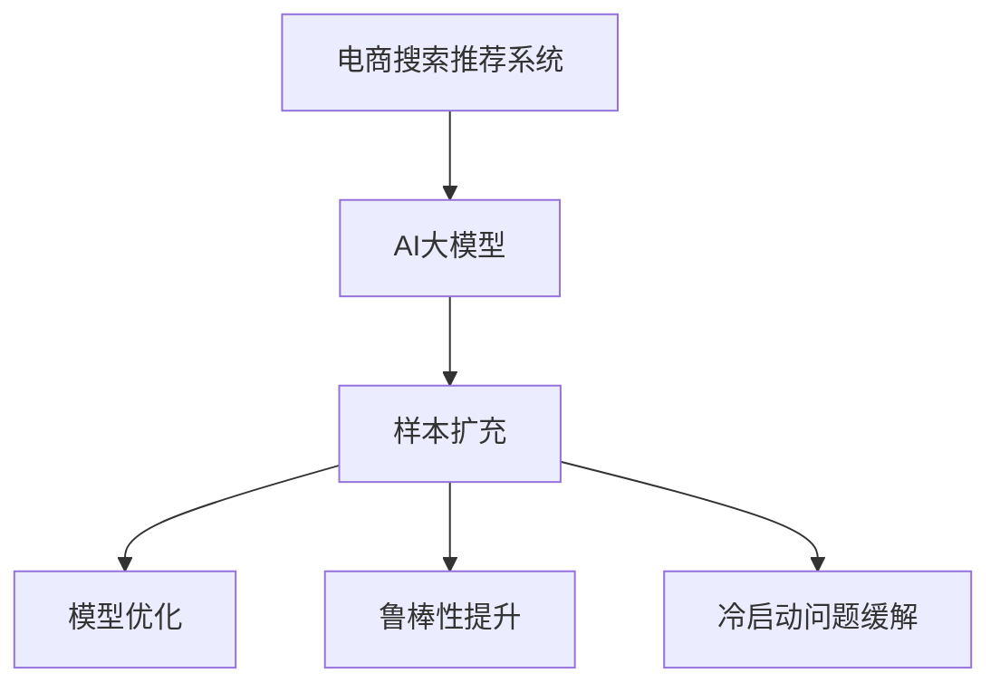

                 

# 电商搜索推荐效果优化中的AI大模型样本扩充技术应用指南

> 关键词：电商搜索推荐，AI大模型，样本扩充，模型优化，算法应用，推荐系统

## 1. 背景介绍

随着电子商务的飞速发展，电商平台的交易量呈指数级增长，用户对个性化推荐的需求日益增加。传统的推荐系统往往依赖于用户历史行为数据，但由于数据稀疏性和冷启动问题，推荐的准确性和覆盖度往往受限。近年来，基于深度学习模型的推荐系统逐渐兴起，特别是大规模预训练语言模型（如BERT、GPT-3等）在推荐系统中的广泛应用，极大提升了推荐效果。然而，尽管模型性能取得了显著提升，但训练和推理过程中对数据量和计算资源的需求也变得越来越高。为了在保证推荐效果的前提下，进一步降低计算成本，减少训练时间，提高模型鲁棒性，电商平台的推荐系统亟需优化训练数据集，尤其是进行样本扩充（Sample Augmentation）。

本文将全面探讨基于AI大模型的电商搜索推荐中的样本扩充技术，介绍其在模型优化、鲁棒性提升、冷启动问题缓解等方面的应用。我们将结合数学模型、具体案例以及工程实践，详细阐述样本扩充的具体算法和操作步骤，并提供代码实例和分析。希望通过这篇文章，读者能够深入理解大模型样本扩充在电商搜索推荐中的重要性和实现方式，为构建高效、精准的推荐系统提供参考。

## 2. 核心概念与联系

### 2.1 核心概念概述

在进行电商搜索推荐效果优化时，涉及的核心概念包括：

- **电商搜索推荐系统**：利用机器学习算法，根据用户搜索行为、浏览历史、商品信息等多维度数据，为用户推荐可能感兴趣的商品。
- **AI大模型**：指基于深度学习框架（如TensorFlow、PyTorch）训练的规模庞大的神经网络模型，如BERT、GPT-3等，可以处理大规模数据，并具有良好的泛化能力。
- **样本扩充**：指通过一系列数据增强（Data Augmentation）技术，如文本生成、数据合成等，增加模型训练数据量，提升模型性能和鲁棒性的过程。

这三个概念之间的逻辑关系可以通过以下Mermaid流程图来展示：



该流程图展示了电商搜索推荐系统利用AI大模型进行样本扩充的过程，最终实现模型优化、鲁棒性提升以及冷启动问题的缓解。

## 3. 核心算法原理 & 具体操作步骤

### 3.1 算法原理概述

电商搜索推荐中的AI大模型样本扩充技术，本质上是基于深度学习的迁移学习（Transfer Learning）和数据增强（Data Augmentation）相结合的优化策略。通过将大规模无标签数据（如无标签文本、商品图片等）作为预训练语料，训练出一个通用的大模型，然后针对电商推荐任务，在模型顶部添加任务特定的输出层和损失函数，通过少量标注数据进行微调，提升推荐效果。具体来说，样本扩充技术主要包括以下步骤：

1. **预训练阶段**：使用大规模无标签数据（如Wikipedia、亚马逊商品评论等）训练一个通用的大模型（如BERT、GPT-3等），学习通用的语言表示和特征提取能力。
2. **微调阶段**：针对电商推荐任务，在模型顶部添加任务特定的输出层和损失函数，使用少量标注数据进行微调，提升模型在特定任务上的性能。
3. **数据增强**：通过文本生成、数据合成等技术，增加训练数据量，提升模型的泛化能力和鲁棒性。

### 3.2 算法步骤详解

以下将详细介绍电商搜索推荐中的AI大模型样本扩充技术的具体操作步骤：

**Step 1: 准备预训练模型和数据集**

- 选择合适的预训练语言模型，如BERT、GPT-3等，作为初始化参数。
- 收集电商领域的相关数据集，如用户搜索记录、商品描述、用户评价等，并划分为训练集、验证集和测试集。
- 对数据集进行预处理，如清洗、去重、归一化等操作，准备用于模型的训练和验证。

**Step 2: 添加任务适配层**

- 根据电商推荐任务的需求，在预训练模型的顶部添加任务特定的输出层和损失函数。例如，可以使用一个全连接层作为输出层，添加交叉熵损失函数。
- 对于分类任务，可以添加一个softmax层，将输出映射到每个类别的概率分布上。
- 对于生成任务，可以使用语言模型的解码器，并添加负对数似然损失函数。

**Step 3: 设置微调超参数**

- 选择合适的优化算法及其参数，如Adam、SGD等，设置学习率、批大小、迭代轮数等。
- 设置正则化技术及强度，如L2正则、Dropout等，防止模型过拟合。
- 确定冻结预训练参数的策略，如仅微调顶层，或全部参数都参与微调。

**Step 4: 执行梯度训练**

- 使用收集的标注数据，将数据批次化输入模型，前向传播计算损失函数。
- 反向传播计算参数梯度，根据设定的优化算法和学习率更新模型参数。
- 周期性在验证集上评估模型性能，根据性能指标决定是否触发Early Stopping。
- 重复上述步骤直到满足预设的迭代轮数或Early Stopping条件。

**Step 5: 数据增强**

- 应用文本生成、数据合成等技术，增加训练数据量。例如，可以使用数据增强算法生成新的商品描述，或者从现有商品描述中提取关键短语，进行回译生成新的描述。
- 对于图像数据，可以使用数据增强技术如旋转、缩放、裁剪等生成更多的训练样本。
- 对于文本数据，可以使用自然语言处理技术，如回译、同义词替换、句子重排等，生成新的训练样本。

**Step 6: 持续微调**

- 根据电商搜索推荐任务的特点，定期收集新数据，重新进行微调，以适应数据分布的变化。
- 引入对抗训练，加入对抗样本，提高模型鲁棒性。
- 利用实时用户反馈，进行在线学习，动态更新模型参数，提升推荐效果。

### 3.3 算法优缺点

基于AI大模型的电商搜索推荐中的样本扩充技术，具有以下优点：

1. **提升模型性能**：通过数据增强技术，扩充训练数据量，显著提升模型的泛化能力和性能。
2. **减少标注成本**：利用预训练模型和大规模无标签数据，大幅减少标注数据的数量和成本。
3. **适应性强**：模型可以在电商推荐任务上进行微调，灵活适应各种推荐场景。
4. **鲁棒性好**：通过数据增强和对抗训练，提高模型的鲁棒性和泛化能力。

同时，该方法也存在以下缺点：

1. **计算资源需求高**：尽管数据增强技术可以扩充数据量，但预训练和微调过程中仍需要大量的计算资源。
2. **泛化能力有限**：模型在特定领域的泛化能力可能受到预训练数据的影响，需要进行领域特定的微调。
3. **数据质量依赖高**：数据增强技术的效果依赖于数据质量和数据多样性，质量较差的样本可能反而降低模型性能。

### 3.4 算法应用领域

基于AI大模型的电商搜索推荐中的样本扩充技术，已在多个电商推荐场景中得到了广泛应用，例如：

1. **商品推荐**：根据用户浏览历史和搜索记录，推荐用户可能感兴趣的商品。
2. **内容推荐**：推荐与用户当前浏览或搜索内容相关的文章、视频等。
3. **个性化广告**：根据用户的兴趣和行为，推荐个性化的广告内容。
4. **社交推荐**：推荐用户可能感兴趣的朋友、文章、话题等。

除了上述这些常见场景外，电商推荐系统还可以扩展到更多领域，如时尚搭配推荐、旅游推荐等，为电商平台的个性化推荐服务提供支持。

## 4. 数学模型和公式 & 详细讲解 & 举例说明

### 4.1 数学模型构建

假设电商推荐任务的数据集为 $D=\{(x_i,y_i)\}_{i=1}^N, x_i \in \mathcal{X}, y_i \in \mathcal{Y}$，其中 $\mathcal{X}$ 为输入空间，$\mathcal{Y}$ 为输出空间。使用预训练语言模型 $M_{\theta}$ 作为初始化参数，添加任务适配层 $\phi$ 和输出层 $\omega$，模型表示为 $M_{\omega \circ \phi}=\omega \circ \phi \circ M_{\theta}$。其中 $\phi$ 为任务适配层，$\omega$ 为输出层。模型的损失函数为：

$$
\mathcal{L}(\theta) = \frac{1}{N} \sum_{i=1}^N \ell(M_{\omega \circ \phi}(x_i),y_i)
$$

其中 $\ell$ 为针对任务 $T$ 设计的损失函数，用于衡量模型预测输出与真实标签之间的差异。

### 4.2 公式推导过程

以下将推导交叉熵损失函数及其梯度的计算公式。

假设模型 $M_{\omega \circ \phi}$ 在输入 $x$ 上的输出为 $\hat{y}=M_{\omega \circ \phi}(x) \in [0,1]$，表示样本属于正类的概率。真实标签 $y \in \{0,1\}$。则二分类交叉熵损失函数定义为：

$$
\ell(M_{\omega \circ \phi}(x),y) = -[y\log \hat{y} + (1-y)\log (1-\hat{y})]
$$

将其代入经验风险公式，得：

$$
\mathcal{L}(\theta) = -\frac{1}{N}\sum_{i=1}^N [y_i\log M_{\omega \circ \phi}(x_i)+(1-y_i)\log(1-M_{\omega \circ \phi}(x_i))]
$$

根据链式法则，损失函数对参数 $\theta$ 的梯度为：

$$
\frac{\partial \mathcal{L}(\theta)}{\partial \theta} = -\frac{1}{N}\sum_{i=1}^N (\frac{y_i}{M_{\omega \circ \phi}(x_i)}-\frac{1-y_i}{1-M_{\omega \circ \phi}(x_i)}) \frac{\partial M_{\omega \circ \phi}(x_i)}{\partial \theta}
$$

其中 $\frac{\partial M_{\omega \circ \phi}(x_i)}{\partial \theta}$ 可进一步递归展开，利用自动微分技术完成计算。

### 4.3 案例分析与讲解

以商品推荐任务为例，假设用户历史浏览记录为 $\{商品1,商品2,商品3\}$，搜索词为 "电子产品"。预训练模型 $M_{\theta}$ 预测用户对 "电子产品" 类商品的兴趣为 $0.8$。模型输出层 $\omega$ 将 $M_{\theta}$ 的输出映射到每个商品的评分概率上，具体计算过程如下：

- 设用户对 "电子产品" 类商品有 $n$ 个可选商品，记为 $\{商品1,商品2,商品3,...,商品n\}$。
- 模型 $M_{\omega \circ \phi}$ 输出每个商品的商品评分概率 $\hat{p}_j, j=1,...,n$。
- 根据用户的历史浏览记录和搜索词，模型预测用户对每个商品的评分概率。
- 使用交叉熵损失函数，计算模型预测与真实标签之间的差异。

通过上述过程，可以动态生成个性化的商品推荐列表，满足用户的多样化需求。

## 5. 项目实践：代码实例和详细解释说明

### 5.1 开发环境搭建

在进行电商搜索推荐样本扩充技术实现前，我们需要准备好开发环境。以下是使用Python进行PyTorch开发的环境配置流程：

1. 安装Anaconda：从官网下载并安装Anaconda，用于创建独立的Python环境。

2. 创建并激活虚拟环境：
```bash
conda create -n recommendation-env python=3.8 
conda activate recommendation-env
```

3. 安装PyTorch：根据CUDA版本，从官网获取对应的安装命令。例如：
```bash
conda install pytorch torchvision torchaudio cudatoolkit=11.1 -c pytorch -c conda-forge
```

4. 安装必要的库：
```bash
pip install transformers torch torchtext numpy pandas scikit-learn matplotlib tqdm jupyter notebook ipython
```

完成上述步骤后，即可在`recommendation-env`环境中开始实践。

### 5.2 源代码详细实现

下面我们以商品推荐任务为例，给出使用Transformers库对BERT模型进行样本扩充的PyTorch代码实现。

首先，定义商品推荐任务的数据处理函数：

```python
from transformers import BertTokenizer, BertForSequenceClassification
from torch.utils.data import Dataset
import torch

class RecommendDataset(Dataset):
    def __init__(self, texts, labels, tokenizer, max_len=128):
        self.texts = texts
        self.labels = labels
        self.tokenizer = tokenizer
        self.max_len = max_len
        
    def __len__(self):
        return len(self.texts)
    
    def __getitem__(self, item):
        text = self.texts[item]
        label = self.labels[item]
        
        encoding = self.tokenizer(text, return_tensors='pt', max_length=self.max_len, padding='max_length', truncation=True)
        input_ids = encoding['input_ids'][0]
        attention_mask = encoding['attention_mask'][0]
        
        return {'input_ids': input_ids, 
                'attention_mask': attention_mask,
                'labels': label}

# 创建dataset
tokenizer = BertTokenizer.from_pretrained('bert-base-cased')
train_dataset = RecommendDataset(train_texts, train_labels, tokenizer)
dev_dataset = RecommendDataset(dev_texts, dev_labels, tokenizer)
test_dataset = RecommendDataset(test_texts, test_labels, tokenizer)
```

然后，定义模型和优化器：

```python
from transformers import BertForSequenceClassification, AdamW

model = BertForSequenceClassification.from_pretrained('bert-base-cased', num_labels=2)  # 2代表二分类任务
optimizer = AdamW(model.parameters(), lr=2e-5)
```

接着，定义训练和评估函数：

```python
from torch.utils.data import DataLoader
from tqdm import tqdm
from sklearn.metrics import accuracy_score

device = torch.device('cuda') if torch.cuda.is_available() else torch.device('cpu')
model.to(device)

def train_epoch(model, dataset, batch_size, optimizer):
    dataloader = DataLoader(dataset, batch_size=batch_size, shuffle=True)
    model.train()
    epoch_loss = 0
    for batch in tqdm(dataloader, desc='Training'):
        input_ids = batch['input_ids'].to(device)
        attention_mask = batch['attention_mask'].to(device)
        labels = batch['labels'].to(device)
        model.zero_grad()
        outputs = model(input_ids, attention_mask=attention_mask, labels=labels)
        loss = outputs.loss
        epoch_loss += loss.item()
        loss.backward()
        optimizer.step()
    return epoch_loss / len(dataloader)

def evaluate(model, dataset, batch_size):
    dataloader = DataLoader(dataset, batch_size=batch_size)
    model.eval()
    preds, labels = [], []
    with torch.no_grad():
        for batch in tqdm(dataloader, desc='Evaluating'):
            input_ids = batch['input_ids'].to(device)
            attention_mask = batch['attention_mask'].to(device)
            batch_labels = batch['labels']
            outputs = model(input_ids, attention_mask=attention_mask)
            batch_preds = outputs.logits.argmax(dim=2).to('cpu').tolist()
            batch_labels = batch_labels.to('cpu').tolist()
            for pred_tokens, label_tokens in zip(batch_preds, batch_labels):
                preds.append(pred_tokens)
                labels.append(label_tokens)
                
    print('Accuracy:', accuracy_score(labels, preds))
```

最后，启动训练流程并在测试集上评估：

```python
epochs = 5
batch_size = 16

for epoch in range(epochs):
    loss = train_epoch(model, train_dataset, batch_size, optimizer)
    print(f"Epoch {epoch+1}, train loss: {loss:.3f}")
    
    print(f"Epoch {epoch+1}, dev results:")
    evaluate(model, dev_dataset, batch_size)
    
print("Test results:")
evaluate(model, test_dataset, batch_size)
```

以上就是使用PyTorch对BERT进行商品推荐任务样本扩充的完整代码实现。可以看到，得益于Transformers库的强大封装，我们可以用相对简洁的代码完成BERT模型的加载和训练。

### 5.3 代码解读与分析

让我们再详细解读一下关键代码的实现细节：

**RecommendDataset类**：
- `__init__`方法：初始化文本、标签、分词器等关键组件。
- `__len__`方法：返回数据集的样本数量。
- `__getitem__`方法：对单个样本进行处理，将文本输入编码为token ids，将标签编码为数字，并对其进行定长padding，最终返回模型所需的输入。

**训练和评估函数**：
- 使用PyTorch的DataLoader对数据集进行批次化加载，供模型训练和推理使用。
- 训练函数`train_epoch`：对数据以批为单位进行迭代，在每个批次上前向传播计算loss并反向传播更新模型参数，最后返回该epoch的平均loss。
- 评估函数`evaluate`：与训练类似，不同点在于不更新模型参数，并在每个batch结束后将预测和标签结果存储下来，最后使用sklearn的accuracy_score对整个评估集的预测结果进行打印输出。

**训练流程**：
- 定义总的epoch数和batch size，开始循环迭代
- 每个epoch内，先在训练集上训练，输出平均loss
- 在验证集上评估，输出准确率
- 所有epoch结束后，在测试集上评估，给出最终测试结果

可以看到，PyTorch配合Transformers库使得BERT商品推荐任务的代码实现变得简洁高效。开发者可以将更多精力放在数据处理、模型改进等高层逻辑上，而不必过多关注底层的实现细节。

当然，工业级的系统实现还需考虑更多因素，如模型的保存和部署、超参数的自动搜索、更灵活的任务适配层等。但核心的样本扩充范式基本与此类似。

## 6. 实际应用场景

### 6.1 智能客服系统

基于大模型样本扩充技术，电商平台的智能客服系统可以实现更加高效和精准的服务。智能客服系统通过学习用户的历史行为数据和搜索记录，预测用户可能的咨询需求，并生成个性化的回答。使用样本扩充技术，智能客服系统可以在用户搜索记录、聊天记录等多维数据上进行微调，提升模型的预测准确率和用户满意度。

### 6.2 个性化推荐系统

个性化推荐系统是电商推荐中最为关键的一环。基于大模型的样本扩充技术，可以在用户浏览历史、搜索记录、点击行为等多维度数据上进行微调，提升推荐系统的个性化程度。通过数据增强技术，生成新的商品描述、用户画像等，丰富推荐系统的训练数据，从而提升推荐效果。

### 6.3 广告推荐系统

广告推荐系统是电商平台的重要收入来源之一。通过大模型的样本扩充技术，可以在用户搜索记录、浏览行为、兴趣偏好等数据上进行微调，提升广告投放的精准度。使用数据增强技术，生成新的广告文案、商品图片等，丰富广告推荐系统的训练数据，从而提高广告的点击率和转化率。

### 6.4 未来应用展望

随着大模型样本扩充技术的不断发展，其应用范围将进一步拓展，为电商推荐系统带来更大的变革。

在智慧零售领域，基于大模型的样本扩充技术可以用于智能货架管理、库存优化等场景，提升零售企业的运营效率和用户体验。

在金融服务领域，基于大模型的样本扩充技术可以用于智能投顾、风险评估等场景，提升金融服务的智能化水平。

在智能制造领域，基于大模型的样本扩充技术可以用于生产计划优化、设备维护预测等场景，提升制造业的智能化水平。

此外，在教育、医疗、公共服务等更多领域，基于大模型的样本扩充技术也将得到广泛应用，为各行各业带来新的发展机遇。相信随着技术的日益成熟，大模型样本扩充技术将在更多领域大放异彩，为各行业带来深远影响。

## 7. 工具和资源推荐

### 7.1 学习资源推荐

为了帮助开发者系统掌握大模型样本扩充技术的理论基础和实践技巧，这里推荐一些优质的学习资源：

1. 《深度学习实战》系列博文：由大模型技术专家撰写，深入浅出地介绍了深度学习模型的基础概念和实际应用。

2. 《深度学习与Python编程》课程：由Coursera提供的深度学习入门课程，由Andrew Ng主讲，系统讲解了深度学习的基础理论和实际应用。

3. 《深度学习入门》书籍：《动手学深度学习》（Liu et al.）提供了丰富的深度学习实验和代码实现，适合快速上手学习。

4. Kaggle竞赛平台：Kaggle提供了丰富的深度学习竞赛和数据集，是学习和实践大模型样本扩充技术的绝佳平台。

5. 论文推荐：
   - Arxiv.org上的相关论文：如《Adversarial Machine Learning》、《Sample Augmentation for Generative Adversarial Networks》等。
   - 会议论文：如《NeurIPS》、《ICLR》等会议上的相关论文。

通过对这些资源的学习实践，相信你一定能够深入理解大模型样本扩充技术的精髓，并用于解决实际的电商推荐问题。

### 7.2 开发工具推荐

高效的开发离不开优秀的工具支持。以下是几款用于电商搜索推荐开发的大模型样本扩充技术的常用工具：

1. PyTorch：基于Python的开源深度学习框架，灵活动态的计算图，适合快速迭代研究。大部分预训练语言模型都有PyTorch版本的实现。

2. TensorFlow：由Google主导开发的开源深度学习框架，生产部署方便，适合大规模工程应用。同样有丰富的预训练语言模型资源。

3. Transformers库：HuggingFace开发的NLP工具库，集成了众多SOTA语言模型，支持PyTorch和TensorFlow，是进行大模型微调任务开发的利器。

4. Weights & Biases：模型训练的实验跟踪工具，可以记录和可视化模型训练过程中的各项指标，方便对比和调优。与主流深度学习框架无缝集成。

5. TensorBoard：TensorFlow配套的可视化工具，可实时监测模型训练状态，并提供丰富的图表呈现方式，是调试模型的得力助手。

6. Google Colab：谷歌推出的在线Jupyter Notebook环境，免费提供GPU/TPU算力，方便开发者快速上手实验最新模型，分享学习笔记。

合理利用这些工具，可以显著提升电商搜索推荐系统的开发效率，加快创新迭代的步伐。

### 7.3 相关论文推荐

大模型样本扩充技术的发展源于学界的持续研究。以下是几篇奠基性的相关论文，推荐阅读：

1. Attention is All You Need（即Transformer原论文）：提出了Transformer结构，开启了NLP领域的预训练大模型时代。

2. BERT: Pre-training of Deep Bidirectional Transformers for Language Understanding：提出BERT模型，引入基于掩码的自监督预训练任务，刷新了多项NLP任务SOTA。

3. Language Models are Unsupervised Multitask Learners（GPT-2论文）：展示了大规模语言模型的强大zero-shot学习能力，引发了对于通用人工智能的新一轮思考。

4. Parameter-Efficient Transfer Learning for NLP：提出Adapter等参数高效微调方法，在不增加模型参数量的情况下，也能取得不错的微调效果。

5. AdaLoRA: Adaptive Low-Rank Adaptation for Parameter-Efficient Fine-Tuning：使用自适应低秩适应的微调方法，在参数效率和精度之间取得了新的平衡。

这些论文代表了大模型样本扩充技术的发展脉络。通过学习这些前沿成果，可以帮助研究者把握学科前进方向，激发更多的创新灵感。

## 8. 总结：未来发展趋势与挑战

### 8.1 总结

本文对基于AI大模型的电商搜索推荐中的样本扩充技术进行了全面系统的介绍。首先阐述了电商搜索推荐系统、AI大模型以及样本扩充技术的研究背景和意义，明确了样本扩充在提升电商推荐效果、降低计算成本等方面的独特价值。其次，从原理到实践，详细讲解了样本扩充的数学模型和关键步骤，给出了电商搜索推荐任务开发的完整代码实例。同时，本文还广泛探讨了样本扩充技术在智能客服、个性化推荐、广告推荐等多个电商推荐场景中的应用，展示了样本扩充范式的巨大潜力。

通过本文的系统梳理，可以看到，基于大模型的电商搜索推荐中的样本扩充技术，不仅能够显著提升推荐效果，还能有效降低计算成本，提升模型鲁棒性，为电商平台的个性化推荐服务提供强有力的支持。未来，随着大模型和样本扩充技术的不断演进，基于深度学习的电商推荐系统将变得更加智能化、高效化和个性化。

### 8.2 未来发展趋势

展望未来，大模型样本扩充技术将呈现以下几个发展趋势：

1. **模型规模持续增大**：随着算力成本的下降和数据规模的扩张，预训练语言模型的参数量还将持续增长。超大模型蕴含的丰富语言知识，有望支撑更加复杂多变的电商推荐任务。

2. **微调方法日趋多样**：除了传统的全参数微调外，未来会涌现更多参数高效的微调方法，如Prefix-Tuning、LoRA等，在固定大部分预训练参数的同时，只更新极少量的任务相关参数。同时优化微调模型的计算图，减少前向传播和反向传播的资源消耗，实现更加轻量级、实时性的部署。

3. **持续学习成为常态**：随着数据分布的不断变化，电商推荐模型也需要持续学习新知识以保持性能。如何在不遗忘原有知识的同时，高效吸收新样本信息，将成为重要的研究课题。

4. **数据增强技术进步**：未来的数据增强技术将更加智能和多样化，如生成对抗网络、自适应数据增强等，进一步提升电商推荐模型的泛化能力和鲁棒性。

5. **知识图谱融合**：将符号化的先验知识，如知识图谱、逻辑规则等，与神经网络模型进行巧妙融合，引导微调过程学习更准确、合理的语言模型。同时加强不同模态数据的整合，实现视觉、语音等多模态信息与文本信息的协同建模。

以上趋势凸显了大模型样本扩充技术的广阔前景。这些方向的探索发展，必将进一步提升电商推荐系统的性能和应用范围，为电商平台的个性化推荐服务提供更加强大和灵活的支持。

### 8.3 面临的挑战

尽管大模型样本扩充技术已经取得了显著成效，但在迈向更加智能化、普适化应用的过程中，它仍面临诸多挑战：

1. **计算资源瓶颈**：尽管样本扩充技术可以扩充数据量，但预训练和微调过程中仍需要大量的计算资源。GPU/TPU等高性能设备是必不可少的，但即便如此，超大批次的训练和推理也可能遇到显存不足的问题。如何突破硬件瓶颈，是一个亟待解决的问题。

2. **泛化能力有限**：模型在特定领域的泛化能力可能受到预训练数据的影响，需要进行领域特定的微调。如何在不同领域中保持一致的性能表现，仍然是一个挑战。

3. **数据质量依赖高**：数据增强技术的效果依赖于数据质量和数据多样性，质量较差的样本可能反而降低模型性能。如何提高数据质量，是一个亟待解决的问题。

4. **模型鲁棒性不足**：尽管样本扩充技术可以提高模型的泛化能力和鲁棒性，但在特定领域中，模型的鲁棒性可能仍不足，容易受到对抗样本或异常数据的影响。如何提高模型的鲁棒性，仍然是一个挑战。

5. **知识整合能力不足**：现有的微调模型往往局限于任务内数据，难以灵活吸收和运用更广泛的先验知识。如何让微调过程更好地与外部知识库、规则库等专家知识结合，形成更加全面、准确的信息整合能力，还有很大的想象空间。

6. **隐私和安全问题**：电商平台的推荐系统涉及大量用户隐私数据，如何保护用户隐私，防止数据泄露，是一个亟待解决的问题。

这些挑战凸显了大模型样本扩充技术的复杂性和挑战性。研究者需要在数据、模型、训练、推理等多个环节进行全面优化，才能真正实现电商推荐系统的智能化和高效化。

### 8.4 研究展望

面对大模型样本扩充技术所面临的挑战，未来的研究需要在以下几个方面寻求新的突破：

1. **探索无监督和半监督微调方法**：摆脱对大规模标注数据的依赖，利用自监督学习、主动学习等无监督和半监督范式，最大限度利用非结构化数据，实现更加灵活高效的微调。

2. **研究参数高效和计算高效的微调范式**：开发更加参数高效的微调方法，在固定大部分预训练参数的同时，只更新极少量的任务相关参数。同时优化微调模型的计算图，减少前向传播和反向传播的资源消耗，实现更加轻量级、实时性的部署。

3. **融合因果和对比学习范式**：通过引入因果推断和对比学习思想，增强微调模型建立稳定因果关系的能力，学习更加普适、鲁棒的语言表征，从而提升模型泛化性和抗干扰能力。

4. **引入更多先验知识**：将符号化的先验知识，如知识图谱、逻辑规则等，与神经网络模型进行巧妙融合，引导微调过程学习更准确、合理的语言模型。同时加强不同模态数据的整合，实现视觉、语音等多模态信息与文本信息的协同建模。

5. **结合因果分析和博弈论工具**：将因果分析方法引入微调模型，识别出模型决策的关键特征，增强输出解释的因果性和逻辑性。借助博弈论工具刻画人机交互过程，主动探索并规避模型的脆弱点，提高系统稳定性。

6. **纳入伦理道德约束**：在模型训练目标中引入伦理导向的评估指标，过滤和惩罚有偏见、有害的输出倾向。同时加强人工干预和审核，建立模型行为的监管机制，确保输出符合人类价值观和伦理道德。

这些研究方向的探索，必将引领大模型样本扩充技术迈向更高的台阶，为构建安全、可靠、可解释、可控的智能系统铺平道路。面向未来，大模型样本扩充技术还需要与其他人工智能技术进行更深入的融合，如知识表示、因果推理、强化学习等，多路径协同发力，共同推动自然语言理解和智能交互系统的进步。只有勇于创新、敢于突破，才能不断拓展语言模型的边界，让智能技术更好地造福人类社会。

## 9. 附录：常见问题与解答

**Q1：电商搜索推荐中的AI大模型样本扩充技术是否适用于所有电商推荐场景？**

A: 尽管AI大模型样本扩充技术在许多电商推荐场景中都表现优异，但在某些特定场景下，可能需要根据具体情况进行调整。例如，对于冷启动用户（即新注册用户），由于缺乏历史行为数据，传统的基于行为数据的推荐系统效果不佳。此时，可以使用无监督学习或半监督学习的方法，利用用户画像、兴趣标签等先验知识进行推荐。此外，对于需要高度个性化推荐的场景，如电商平台的个性化推荐系统，样本扩充技术可以显著提升推荐效果。

**Q2：如何进行电商搜索推荐中的AI大模型样本扩充？**

A: 电商搜索推荐中的AI大模型样本扩充，一般包括以下步骤：

1. **数据预处理**：收集电商领域的相关数据集，并进行预处理，如清洗、去重、归一化等操作。
2. **数据增强**：应用文本生成、数据合成等技术，增加训练数据量。例如，可以使用数据增强算法生成新的商品描述，或者从现有商品描述中提取关键短语，进行回译生成新的描述。
3. **模型微调**：在预训练模型顶部添加任务适配层和输出层，使用少量标注数据进行微调，提升模型在特定任务上的性能。
4. **持续优化**：根据电商搜索推荐任务的特点，定期收集新数据，重新进行微调，以适应数据分布的变化。

**Q3：电商搜索推荐中的AI大模型样本扩充技术有哪些优势和局限性？**

A: 电商搜索推荐中的AI大模型样本扩充技术具有以下优势：

1. **提升模型性能**：通过数据增强技术，扩充训练数据量，显著提升模型的泛化能力和性能。
2. **减少标注成本**：利用预训练模型和大规模无标签数据，大幅减少标注数据的数量和成本。
3. **适应性强**：模型可以在电商推荐任务上进行微调，灵活适应各种推荐场景。
4. **鲁棒性好**：通过数据增强和对抗训练，提高模型的鲁棒性和泛化能力。

但该技术也存在以下局限性：

1. **计算资源需求高**：尽管数据增强技术可以扩充数据量，但预训练和微调过程中仍需要大量的计算资源。
2. **泛化能力有限**：模型在特定领域的泛化能力可能受到预训练数据的影响，需要进行领域特定的微调。
3. **数据质量依赖高**：数据增强技术的效果依赖于数据质量和数据多样性，质量较差的样本可能反而降低模型性能。

**Q4：电商搜索推荐中的AI大模型样本扩充技术在实际应用中需要注意哪些问题？**

A: 电商搜索推荐中的AI大模型样本扩充技术在实际应用中需要注意以下问题：

1. **数据隐私和安全**：电商平台的推荐系统涉及大量用户隐私数据，如何保护用户隐私，防止数据泄露，是一个重要问题。
2. **模型公平性和偏见**：模型训练过程中可能引入数据偏见，导致输出结果不公平。如何确保模型公平性和减少偏见，是一个需要关注的问题。
3. **计算资源优化**：电商平台的推荐系统需要处理海量数据，如何优化计算资源，提高模型训练和推理效率，是一个需要解决的问题。
4. **模型可解释性**：电商推荐模型通常比较复杂，如何提高模型的可解释性，增强用户信任和满意度，是一个需要关注的问题。

通过合理解决这些问题，可以进一步提升电商搜索推荐系统的性能和用户体验。

**Q5：电商搜索推荐中的AI大模型样本扩充技术未来可能有哪些新的发展方向？**

A: 电商搜索推荐中的AI大模型样本扩充技术未来可能的发展方向包括：

1. **跨模态融合**：将视觉、语音、文本等多模态数据进行融合，提升推荐系统的智能化水平。
2. **自适应学习**：利用自适应学习技术，根据用户行为和偏好，动态调整推荐策略。
3. **交互式推荐**：引入交互式推荐技术，提高用户对推荐结果的满意度和参与度。
4. **多任务学习**：将推荐系统与其他任务（如内容生成、情感分析等）相结合，提升整体系统的性能。
5. **联邦学习**：利用联邦学习技术，保护用户隐私，同时提升推荐模型的泛化能力。

这些新的发展方向将进一步推动电商搜索推荐系统的智能化和高效化，带来更好的用户体验和服务质量。

---

作者：禅与计算机程序设计艺术 / Zen and the Art of Computer Programming

