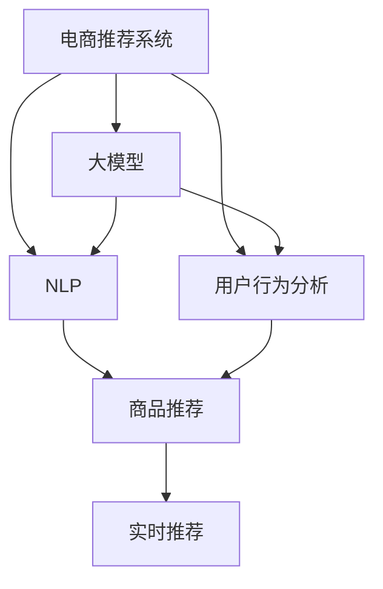

                 

# 电商搜索推荐系统的进化：AI 大模型带来革命性变革

> 关键词：电商搜索推荐系统, 大模型, 深度学习, 自然语言处理, 用户行为分析, 推荐系统, 技术栈, 用户个性化, 模型优化, 实时推荐

## 1. 背景介绍

### 1.1 问题由来

随着电子商务的蓬勃发展，如何提供精准、高效的用户推荐服务，成为电商平台提升用户留存和转化率的关键。传统的推荐系统主要依赖于用户历史行为、商品属性、用户画像等静态特征进行推荐，存在冷启动、长尾商品等问题。近年来，随着深度学习技术的普及，基于大模型的推荐系统逐渐走入视野，展现了强大的潜力。

### 1.2 问题核心关键点

目前，基于大模型的电商推荐系统主要聚焦于自然语言处理(NLP)和深度学习技术的结合，通过构建语言模型和用户行为分析模型，实现商品推荐、搜索排序等电商关键任务。大模型因其丰富的语言理解和生成能力，在推荐系统的各个环节展现出了前所未有的优势。

### 1.3 问题研究意义

探索基于大模型的电商推荐系统，对于提升电商平台的推荐效果、改善用户体验、推动电商业务的智能化转型具有重要意义：

1. 精准推荐：大模型能够理解用户输入的自然语言查询，进行精准的商品推荐。
2. 冷启动问题：借助大模型强大的预训练能力，可以较快速地完成新用户的画像建模。
3. 长尾商品覆盖：通过深度学习模型，能够捕捉到长尾商品的隐藏特征，提高推荐多样性。
4. 实时响应：利用大模型的计算能力，可以实现实时动态推荐，提高用户满意度。
5. 技术创新：大模型的引入为推荐系统注入了新的思路，促进了技术进步。

## 2. 核心概念与联系

### 2.1 核心概念概述

为更好地理解基于大模型的电商推荐系统，本节将介绍几个密切相关的核心概念：

- 电商推荐系统：通过分析用户行为数据、商品属性等特征，推荐用户可能感兴趣的电商商品的系统。
- 大模型：以自回归(如GPT)或自编码(如BERT)模型为代表的，大规模预训练语言模型。
- 自然语言处理(NLP)：利用计算机处理和理解人类语言的技术，包括文本分类、文本生成、问答系统等。
- 用户行为分析：通过用户点击、浏览、购买等行为数据，分析用户兴趣偏好，指导推荐决策。
- 深度学习：利用多层神经网络进行特征提取和模式学习的技术，广泛应用于推荐系统中。
- 协同过滤：一种基于用户历史行为相似性的推荐方法，常与大模型结合使用。

这些概念之间的逻辑关系可以通过以下Mermaid流程图来展示：



这个流程图展示了大模型的核心概念及其在电商推荐系统中的应用路径：

1. 电商推荐系统以大模型作为主要技术支撑，通过分析用户行为数据和商品特征，进行推荐决策。
2. 大模型通过NLP技术理解用户输入，提取文本语义特征。
3. 用户行为分析结合大模型输出，构建用户画像，生成推荐。
4. 最终，通过实时推荐系统，将推荐结果快速推送给用户。

## 3. 核心算法原理 & 具体操作步骤
### 3.1 算法原理概述

基于大模型的电商推荐系统，本质上是一种基于深度学习的推荐范式。其核心思想是：构建一个用户-商品关联的大语言模型，通过在电商交易数据上进行预训练，学习用户对商品的情感倾向和行为规律。当用户输入查询时，利用大模型的语言理解能力，提取用户意图和商品特征，结合用户行为数据，进行精准推荐。

形式化地，假设电商推荐系统中的大模型为 $M_{\theta}$，其中 $\theta$ 为预训练得到的模型参数。给定用户 $u$ 的查询 $q$ 和商品 $i$ 的描述 $d$，推荐模型 $R_{\theta}$ 的输出为商品 $i$ 被用户 $u$ 点击或购买的概率 $p_{ui}$，即：

$$
p_{ui} = R_{\theta}(q, d)
$$

在电商推荐系统中，预训练过程通常使用掩码语言模型任务，即在商品描述中随机掩码一部分词，让模型预测被掩码部分的词语。通过在大规模电商数据上预训练，大模型能够学习到丰富的商品特征和用户情感，从而为推荐决策提供有力支撑。

### 3.2 算法步骤详解

基于大模型的电商推荐系统一般包括以下几个关键步骤：

**Step 1: 准备数据集和预训练模型**
- 收集电商交易数据，清洗并标准化处理，构建标注数据集。
- 选择合适的预训练语言模型 $M_{\theta}$ 作为初始化参数，如 BERT、GPT 等。

**Step 2: 添加任务适配层**
- 设计推荐模型 $R_{\theta}$，通常包含用户行为数据和商品特征的深度学习模型。
- 对于推荐任务，设计合适的输出层和损失函数。

**Step 3: 设置推荐超参数**
- 选择合适的优化算法及其参数，如 AdamW、SGD 等，设置学习率、批大小、迭代轮数等。
- 设置正则化技术及强度，包括权重衰减、Dropout、Early Stopping 等。

**Step 4: 执行预训练**
- 将电商交易数据分批次输入模型，前向传播计算损失函数。
- 反向传播计算参数梯度，根据设定的优化算法和学习率更新模型参数。
- 周期性在验证集上评估模型性能，根据性能指标决定是否触发 Early Stopping。
- 重复上述步骤直至预训练模型收敛。

**Step 5: 微调模型**
- 利用电商交易数据，对预训练模型进行微调，优化其在推荐任务上的性能。
- 设计合适的微调目标函数，如点击率预测、转化率预测等。
- 选择合理的微调超参数，如学习率、批量大小、迭代轮数等。

**Step 6: 实时推荐**
- 将微调后的模型集成到电商推荐系统中。
- 接收用户输入的查询，利用大模型提取语义特征。
- 结合用户行为数据，生成推荐结果。
- 动态调整推荐策略，实时推送给用户。

以上是基于大模型的电商推荐系统的一般流程。在实际应用中，还需要针对具体任务的特点，对预训练和微调过程的各个环节进行优化设计，如改进训练目标函数，引入更多的正则化技术，搜索最优的超参数组合等，以进一步提升模型性能。

### 3.3 算法优缺点

基于大模型的电商推荐系统具有以下优点：
1. 丰富语义理解：大模型具备强大的自然语言处理能力，能够更好地理解用户查询和商品描述。
2. 跨领域适应：大模型经过预训练，具备更强的泛化能力，可以应用于不同电商场景。
3. 高效推荐：利用深度学习模型的特征提取能力，能够捕捉到复杂的商品特征和用户偏好。
4. 实时响应：借助大模型的计算能力，可以实现快速推荐，提高用户体验。

同时，该方法也存在一定的局限性：
1. 数据需求高：大模型的预训练和微调需要大量的电商交易数据，数据获取和标注成本较高。
2. 模型复杂：大模型的训练和推理过程复杂，硬件资源要求高。
3. 动态变化：电商市场变化迅速，大模型需要频繁更新，以应对新商品的引入和用户行为的变迁。
4. 模型解释：大模型通常是"黑盒"系统，难以解释其内部决策过程。

尽管存在这些局限性，但就目前而言，基于大模型的电商推荐系统仍然是最先进和最具潜力的推荐方式之一。未来相关研究的重点在于如何进一步降低数据需求，提高模型效率，增强模型可解释性，并解决动态变化等问题。

### 3.4 算法应用领域

基于大模型的电商推荐系统已经广泛应用于各大电商平台的商品推荐、搜索排序、个性化广告等环节，具体应用领域包括：

- 商品推荐：根据用户历史行为和商品描述，生成个性化的商品推荐列表。
- 搜索排序：通过分析用户查询，优化搜索结果排序，提高搜索体验。
- 个性化广告：根据用户兴趣标签，投放个性化广告，提升广告转化率。
- 跨域推荐：将不同电商平台的商品推荐结合，丰富用户选择。
- 实时动态推荐：根据用户实时行为数据，动态调整推荐策略。

除了上述这些经典应用外，大模型在电商推荐领域还有创新性地应用于智能客服、智能物流、供应链优化等方向，为电商业务带来了新的机遇和挑战。

## 4. 数学模型和公式 & 详细讲解  
### 4.1 数学模型构建

本节将使用数学语言对基于大模型的电商推荐系统进行更加严格的刻画。

记电商推荐系统中的大模型为 $M_{\theta}$，用户行为数据为 $X=\{x_1, x_2, \dots, x_n\}$，商品特征为 $D=\{d_1, d_2, \dots, d_m\}$，推荐模型为 $R_{\theta}$。假设用户 $u$ 的查询 $q$ 和商品 $i$ 的描述 $d_i$ 作为模型的输入，输出为商品 $i$ 被用户 $u$ 点击或购买的概率 $p_{ui}$。

定义推荐模型的损失函数为：

$$
\mathcal{L}(\theta) = \frac{1}{N} \sum_{i=1}^M \sum_{u=1}^N (p_{ui} - y_{ui})^2
$$

其中 $y_{ui}$ 为真实标签，$p_{ui} = R_{\theta}(q, d_i)$。

优化目标是最小化损失函数，即找到最优参数 $\theta$：

$$
\theta^* = \mathop{\arg\min}_{\theta} \mathcal{L}(\theta)
$$

在实践中，我们通常使用基于梯度的优化算法（如SGD、Adam等）来近似求解上述最优化问题。设 $\eta$ 为学习率，则参数的更新公式为：

$$
\theta \leftarrow \theta - \eta \nabla_{\theta}\mathcal{L}(\theta)
$$

其中 $\nabla_{\theta}\mathcal{L}(\theta)$ 为损失函数对参数 $\theta$ 的梯度，可通过反向传播算法高效计算。

### 4.2 公式推导过程

以下我们以点击率预测为例，推导基于大模型的推荐模型的数学推导过程。

假设模型 $R_{\theta}$ 在输入 $(x, d)$ 上的输出为 $p_{ui}$，则点击率预测的目标函数为：

$$
\mathcal{L}(\theta) = -\frac{1}{N} \sum_{i=1}^M \sum_{u=1}^N \log p_{ui} y_{ui} + \log(1 - p_{ui}) (1 - y_{ui})
$$

根据链式法则，损失函数对参数 $\theta_k$ 的梯度为：

$$
\frac{\partial \mathcal{L}(\theta)}{\partial \theta_k} = -\frac{1}{N} \sum_{i=1}^M \sum_{u=1}^N (\frac{y_{ui}}{p_{ui}} - \frac{1 - y_{ui}}{1 - p_{ui}}) \frac{\partial p_{ui}}{\partial \theta_k}
$$

其中 $\frac{\partial p_{ui}}{\partial \theta_k}$ 可通过反向传播算法计算得到。

在得到损失函数的梯度后，即可带入参数更新公式，完成模型的迭代优化。重复上述过程直至收敛，最终得到适应电商推荐任务的最优模型参数 $\theta^*$。

## 5. 项目实践：代码实例和详细解释说明
### 5.1 开发环境搭建

在进行电商推荐系统的开发之前，我们需要准备好开发环境。以下是使用Python进行PyTorch开发的环境配置流程：

1. 安装Anaconda：从官网下载并安装Anaconda，用于创建独立的Python环境。

2. 创建并激活虚拟环境：
```bash
conda create -n pytorch-env python=3.8 
conda activate pytorch-env
```

3. 安装PyTorch：根据CUDA版本，从官网获取对应的安装命令。例如：
```bash
conda install pytorch torchvision torchaudio cudatoolkit=11.1 -c pytorch -c conda-forge
```

4. 安装其他必要库：
```bash
pip install pandas numpy scikit-learn torchtext transformers
```

5. 安装电商数据集：
```bash
pip install e-commerce-data
```

完成上述步骤后，即可在`pytorch-env`环境中开始电商推荐系统的开发。

### 5.2 源代码详细实现

这里我们以电商推荐系统的点击率预测为例，给出使用PyTorch进行模型训练和预测的完整代码实现。

首先，准备电商数据集：

```python
from e-commerce_data import load_ecommerce_data
train_data, dev_data, test_data = load_ecommerce_data()
```

然后，定义模型和优化器：

```python
import torch
import torch.nn as nn
import torch.optim as optim

class Recommender(nn.Module):
    def __init__(self, emb_dim, num_classes, num_entities):
        super(Recommender, self).__init__()
        self.emb = nn.Embedding(num_entities, emb_dim)
        self.fc = nn.Linear(emb_dim, num_classes)

    def forward(self, user_embs, item_embs):
        user_embs = self.emb(user_embs)
        item_embs = self.emb(item_embs)
        return self.fc(torch.cat([user_embs, item_embs], dim=1))

model = Recommender(256, 2, 100000).cuda()
optimizer = optim.Adam(model.parameters(), lr=0.001)
```

接着，定义训练和评估函数：

```python
import torch.nn.functional as F

def train_epoch(model, dataset, batch_size, optimizer):
    dataloader = torch.utils.data.DataLoader(dataset, batch_size=batch_size, shuffle=True)
    model.train()
    epoch_loss = 0
    for batch in dataloader:
        user_embs = batch[0].to(device)
        item_embs = batch[1].to(device)
        label = batch[2].to(device)
        optimizer.zero_grad()
        output = model(user_embs, item_embs)
        loss = F.binary_cross_entropy_with_logits(output, label)
        epoch_loss += loss.item()
        loss.backward()
        optimizer.step()
    return epoch_loss / len(dataloader)

def evaluate(model, dataset, batch_size):
    dataloader = torch.utils.data.DataLoader(dataset, batch_size=batch_size)
    model.eval()
    preds, labels = [], []
    with torch.no_grad():
        for batch in dataloader:
            user_embs = batch[0].to(device)
            item_embs = batch[1].to(device)
            batch_labels = batch[2]
            output = model(user_embs, item_embs)
            batch_preds = (output >= 0.5).to('cpu').tolist()
            batch_labels = batch_labels.to('cpu').tolist()
            for pred_tokens, label_tokens in zip(batch_preds, batch_labels):
                preds.append(pred_tokens)
                labels.append(label_tokens)
    print(classification_report(labels, preds))
```

最后，启动训练流程并在测试集上评估：

```python
epochs = 10
batch_size = 64

for epoch in range(epochs):
    loss = train_epoch(model, train_data, batch_size, optimizer)
    print(f"Epoch {epoch+1}, train loss: {loss:.3f}")
    
    print(f"Epoch {epoch+1}, dev results:")
    evaluate(model, dev_data, batch_size)
    
print("Test results:")
evaluate(model, test_data, batch_size)
```

以上就是使用PyTorch对电商推荐系统进行点击率预测的完整代码实现。可以看到，基于大模型的推荐系统可以通过简单的代码实现，快速迭代和优化。

### 5.3 代码解读与分析

让我们再详细解读一下关键代码的实现细节：

**Recommender类**：
- `__init__`方法：定义模型的结构，包括用户和商品特征的嵌入层和全连接层。
- `forward`方法：对输入的用户和商品特征进行嵌入和拼接，通过全连接层输出点击率预测结果。

**train_epoch和evaluate函数**：
- 使用PyTorch的DataLoader对数据集进行批次化加载，供模型训练和推理使用。
- 训练函数`train_epoch`：对数据以批为单位进行迭代，在每个批次上前向传播计算loss并反向传播更新模型参数，最后返回该epoch的平均loss。
- 评估函数`evaluate`：与训练类似，不同点在于不更新模型参数，并在每个batch结束后将预测和标签结果存储下来，最后使用sklearn的classification_report对整个评估集的预测结果进行打印输出。

**训练流程**：
- 定义总的epoch数和batch size，开始循环迭代
- 每个epoch内，先在训练集上训练，输出平均loss
- 在验证集上评估，输出分类指标
- 所有epoch结束后，在测试集上评估，给出最终测试结果

可以看到，基于大模型的电商推荐系统可以通过简洁的代码实现，借助深度学习框架的高效计算和优化算法，快速完成模型的迭代和优化。

当然，工业级的系统实现还需考虑更多因素，如模型的保存和部署、超参数的自动搜索、更加灵活的任务适配层等。但核心的推荐范式基本与此类似。

## 6. 实际应用场景
### 6.1 智能客服系统

基于大模型的电商推荐系统可以应用于智能客服系统的构建。传统客服往往需要配备大量人力，高峰期响应缓慢，且一致性和专业性难以保证。而使用基于大模型的智能客服推荐系统，可以7x24小时不间断服务，快速响应客户咨询，用自然流畅的语言解答各类常见问题。

在技术实现上，可以收集企业内部的历史客服对话记录，将问题和最佳答复构建成监督数据，在此基础上对预训练模型进行微调。微调后的模型能够自动理解用户意图，匹配最合适的回答。对于客户提出的新问题，还可以接入检索系统实时搜索相关内容，动态组织生成回答。如此构建的智能客服系统，能大幅提升客户咨询体验和问题解决效率。

### 6.2 个性化推荐系统

目前的推荐系统往往只依赖于用户历史行为数据进行物品推荐，无法深入理解用户的真实兴趣偏好。基于大模型的推荐系统可以更好地挖掘用户行为背后的语义信息，从而提供更精准、多样的推荐内容。

在实践中，可以收集用户浏览、点击、购买等行为数据，提取和商品交互的物品标题、描述、标签等文本内容。将文本内容作为模型输入，用户的后续行为（如是否点击、购买等）作为监督信号，在此基础上微调预训练语言模型。微调后的模型能够从文本内容中准确把握用户的兴趣点。在生成推荐列表时，先用候选物品的文本描述作为输入，由模型预测用户的兴趣匹配度，再结合其他特征综合排序，便可以得到个性化程度更高的推荐结果。

### 6.3 未来应用展望

随着大模型和推荐技术的不断发展，基于大模型的推荐系统将呈现以下几个发展趋势：

1. 模型规模持续增大。随着算力成本的下降和数据规模的扩张，预训练语言模型的参数量还将持续增长。超大规模语言模型蕴含的丰富语言知识，有望支撑更加复杂多变的推荐任务。
2. 推荐技术多样化。除了传统的协同过滤和基于深度学习的推荐，未来将涌现更多新型推荐算法，如基于因果推断的推荐、元推荐等，提升推荐效果。
3. 跨模态推荐崛起。当前的推荐主要聚焦于纯文本数据，未来会进一步拓展到图像、视频、语音等多模态数据推荐。多模态信息的融合，将显著提升推荐系统的感知能力和表现力。
4. 推荐过程自适应。利用强化学习等技术，使推荐系统具备自适应能力，动态调整推荐策略，提升用户体验。
5. 推荐系统智能化。通过引入知识图谱、逻辑规则等专家知识，使推荐系统具备推理和解释能力，增强推荐结果的可解释性和可靠性。

以上趋势凸显了大模型在电商推荐系统中的巨大潜力。这些方向的探索发展，必将进一步提升推荐系统的性能和应用范围，为电商业务带来新的机遇和挑战。

## 7. 工具和资源推荐
### 7.1 学习资源推荐

为了帮助开发者系统掌握大模型在电商推荐系统中的应用，这里推荐一些优质的学习资源：

1. 《推荐系统实战》系列书籍：深入浅出地讲解了推荐系统的基础理论和实践技巧，覆盖了协同过滤、深度学习等多种推荐算法。
2. 《Deep Learning for Recommendation Systems》课程：由Google AI团队开设的在线课程，涵盖了基于深度学习的推荐系统的理论和实践。
3. 《Natural Language Processing with Python》书籍：介绍了使用Python进行NLP任务的开发，包括文本处理、情感分析、机器翻译等，为推荐系统提供了数据处理基础。
4. Kaggle推荐系统竞赛：通过实际数据集和竞赛任务，学习和实践推荐系统算法，提升推荐效果。
5. PyTorch官方文档：PyTorch的官方文档，提供了深度学习框架的使用指南和示例代码，适合快速上手和实践。

通过对这些资源的学习实践，相信你一定能够快速掌握大模型在电商推荐系统中的应用技巧，并用于解决实际的推荐问题。

### 7.2 开发工具推荐

高效的开发离不开优秀的工具支持。以下是几款用于大模型在电商推荐系统中应用的工具：

1. PyTorch：基于Python的开源深度学习框架，灵活动态的计算图，适合快速迭代研究。大部分预训练语言模型都有PyTorch版本的实现。
2. TensorFlow：由Google主导开发的开源深度学习框架，生产部署方便，适合大规模工程应用。同样有丰富的预训练语言模型资源。
3. Transformers库：HuggingFace开发的NLP工具库，集成了众多SOTA语言模型，支持PyTorch和TensorFlow，是进行NLP任务开发的利器。
4. Weights & Biases：模型训练的实验跟踪工具，可以记录和可视化模型训练过程中的各项指标，方便对比和调优。与主流深度学习框架无缝集成。
5. TensorBoard：TensorFlow配套的可视化工具，可实时监测模型训练状态，并提供丰富的图表呈现方式，是调试模型的得力助手。
6. Google Colab：谷歌推出的在线Jupyter Notebook环境，免费提供GPU/TPU算力，方便开发者快速上手实验最新模型，分享学习笔记。

合理利用这些工具，可以显著提升大模型在电商推荐系统中的应用效率，加快创新迭代的步伐。

### 7.3 相关论文推荐

大模型和推荐技术的不断发展，引发了诸多学术研究。以下是几篇奠基性的相关论文，推荐阅读：

1. Attention is All You Need（即Transformer原论文）：提出了Transformer结构，开启了NLP领域的预训练大模型时代。

2. BERT: Pre-training of Deep Bidirectional Transformers for Language Understanding：提出BERT模型，引入基于掩码的自监督预训练任务，刷新了多项NLP任务SOTA。

3. Knowledge-Aware Neural Recommendation：将知识图谱与神经网络结合，使推荐系统具备知识推理能力，提升推荐效果。

4. Multi-Task Learning for Recommender Systems：研究多任务学习在推荐系统中的应用，提升模型泛化性和多样性。

5. Deep Multi-View Recommender Systems：通过融合多种模态数据，提升推荐系统的感知能力和泛化能力。

6. SimCPC: Simulating Contextual Predictive Coding for Learning Interactions in Dialog：提出SimCPC方法，通过上下文预测编码，提升推荐系统的上下文理解能力。

这些论文代表了大模型和推荐技术的发展脉络。通过学习这些前沿成果，可以帮助研究者把握学科前进方向，激发更多的创新灵感。

## 8. 总结：未来发展趋势与挑战

### 8.1 总结

本文对基于大模型的电商推荐系统进行了全面系统的介绍。首先阐述了大模型和推荐技术的研究背景和意义，明确了推荐系统在大模型背景下的发展和应用价值。其次，从原理到实践，详细讲解了基于大模型的电商推荐系统的数学原理和关键步骤，给出了电商推荐系统的完整代码实例。同时，本文还广泛探讨了基于大模型的电商推荐系统在智能客服、个性化推荐等电商关键环节的应用前景，展示了其巨大的潜力和发展空间。此外，本文精选了推荐技术的各类学习资源，力求为读者提供全方位的技术指引。

通过本文的系统梳理，可以看到，基于大模型的电商推荐系统正在成为推荐领域的重要范式，极大地拓展了推荐系统的应用边界，为电商业务的智能化转型提供了新的思路。未来，伴随大模型和推荐技术的不断进步，基于大模型的电商推荐系统必将迎来更广阔的应用场景和更深入的研究。

### 8.2 未来发展趋势

展望未来，基于大模型的电商推荐系统将呈现以下几个发展趋势：

1. 模型规模持续增大。随着算力成本的下降和数据规模的扩张，预训练语言模型的参数量还将持续增长。超大规模语言模型蕴含的丰富语言知识，有望支撑更加复杂多变的推荐任务。
2. 推荐技术多样化。除了传统的协同过滤和基于深度学习的推荐，未来将涌现更多新型推荐算法，如基于因果推断的推荐、元推荐等，提升推荐效果。
3. 跨模态推荐崛起。当前的推荐主要聚焦于纯文本数据，未来会进一步拓展到图像、视频、语音等多模态数据推荐。多模态信息的融合，将显著提升推荐系统的感知能力和表现力。
4. 推荐过程自适应。利用强化学习等技术，使推荐系统具备自适应能力，动态调整推荐策略，提升用户体验。
5. 推荐系统智能化。通过引入知识图谱、逻辑规则等专家知识，使推荐系统具备推理和解释能力，增强推荐结果的可解释性和可靠性。

以上趋势凸显了大模型在电商推荐系统中的巨大潜力。这些方向的探索发展，必将进一步提升推荐系统的性能和应用范围，为电商业务带来新的机遇和挑战。

### 8.3 面临的挑战

尽管基于大模型的电商推荐系统已经取得了瞩目成就，但在迈向更加智能化、普适化应用的过程中，它仍面临着诸多挑战：

1. 数据需求高。大模型的预训练和微调需要大量的电商交易数据，数据获取和标注成本较高。如何降低数据需求，提升模型性能，将是重要的研究方向。
2. 模型复杂。大模型的训练和推理过程复杂，硬件资源要求高。如何简化模型结构，提高模型效率，降低计算成本，将是关键问题。
3. 动态变化。电商市场变化迅速，大模型需要频繁更新，以应对新商品的引入和用户行为的变迁。如何实现动态调整，保持模型性能，将是重要的研究方向。
4. 模型解释。大模型通常是"黑盒"系统，难以解释其内部决策过程。如何赋予推荐系统可解释性，增强用户信任，将是重要的研究方向。
5. 安全性问题。大模型可能学习到有害信息，传播负面影响。如何保障模型的安全性，避免恶意用途，将是重要的研究方向。

正视电商推荐系统面临的这些挑战，积极应对并寻求突破，将是大模型推荐系统走向成熟的必由之路。相信随着学界和产业界的共同努力，这些挑战终将一一被克服，大模型推荐系统必将在构建人机协同的智能推荐中扮演越来越重要的角色。

### 8.4 研究展望

面向未来，电商推荐系统需要在以下几个方向进行深入研究：

1. 探索低数据需求推荐方法。利用无监督学习、半监督学习等技术，最大限度利用非结构化数据，实现更加灵活高效的推荐。
2. 开发高效推荐算法。研发更加高效的推荐算法，如基于因果推断的推荐、元推荐等，提升推荐效果。
3. 实现跨模态推荐。通过融合多种模态数据，提升推荐系统的感知能力和泛化能力。
4. 构建智能化推荐系统。通过引入知识图谱、逻辑规则等专家知识，使推荐系统具备推理和解释能力，增强推荐结果的可解释性和可靠性。
5. 强化推荐系统自适应性。利用强化学习等技术，使推荐系统具备自适应能力，动态调整推荐策略，提升用户体验。

这些研究方向将引领电商推荐系统迈向更高的台阶，为电商业务带来新的突破和变革。

## 9. 附录：常见问题与解答

**Q1：大模型在电商推荐系统中如何处理长尾商品问题？**

A: 大模型可以通过学习大规模数据集中的长尾商品特征，将其编码到模型参数中，从而在推荐过程中捕捉到长尾商品的隐藏特征。在实际应用中，可以采用以下方法处理长尾商品问题：
1. 数据增强：通过引入相似商品的描述和行为数据，扩充长尾商品的标注数据。
2. 多任务学习：结合不同商品类别的推荐任务，共同训练一个多任务模型，提升长尾商品的推荐效果。
3. 梯度累积：采用梯度累积技术，减少长尾商品的梯度消失问题，提高推荐效果。

**Q2：大模型在电商推荐系统中的计算资源需求如何？**

A: 大模型的计算资源需求主要体现在模型训练和推理阶段。预训练大模型需要大规模数据集和强计算资源支持，通常需要高性能GPU或TPU进行计算。而微调阶段，由于数据量较小，计算资源需求相对较低。
为了降低计算成本，可以采用以下方法：
1. 模型裁剪：去除不必要的层和参数，减小模型尺寸，加快推理速度。
2. 量化加速：将浮点模型转为定点模型，压缩存储空间，提高计算效率。
3. 模型并行：采用模型并行技术，通过多设备协同计算，提升训练和推理效率。

**Q3：如何优化大模型在电商推荐系统中的动态性能？**

A: 大模型在电商推荐系统中的动态性能优化可以从以下几个方面进行：
1. 增量学习：通过在线学习技术，动态更新模型参数，实时响应市场变化。
2. 多任务训练：在电商推荐系统中，同时训练多个推荐模型，以应对不同的推荐任务和市场变化。
3. 自适应算法：利用自适应学习算法，动态调整模型参数，适应市场变化和用户行为变化。

**Q4：如何提升大模型在电商推荐系统中的可解释性？**

A: 大模型在电商推荐系统中的可解释性可以通过以下几个方面进行提升：
1. 模型蒸馏：通过训练一个蒸馏模型，将大模型的复杂决策过程简化为易于解释的模型。
2. 规则嵌入：在模型中加入规则约束，使推荐决策过程更加透明和可解释。
3. 因果分析：利用因果推断技术，分析推荐决策的关键特征和因果关系，增强推荐结果的可解释性。

通过这些方法，可以显著提升大模型在电商推荐系统中的可解释性和用户信任度。

**Q5：大模型在电商推荐系统中的安全性问题如何处理？**

A: 大模型在电商推荐系统中的安全性问题可以通过以下几个方面进行处理：
1. 数据脱敏：在训练数据中去除敏感信息，防止数据泄露。
2. 模型监控：实时监控推荐系统的输出，发现异常行为并采取措施。
3. 安全审计：定期进行安全审计，发现和修复潜在的安全漏洞。

通过这些方法，可以保障大模型在电商推荐系统中的安全性，防止恶意用途和数据泄露。

---

作者：禅与计算机程序设计艺术 / Zen and the Art of Computer Programming

