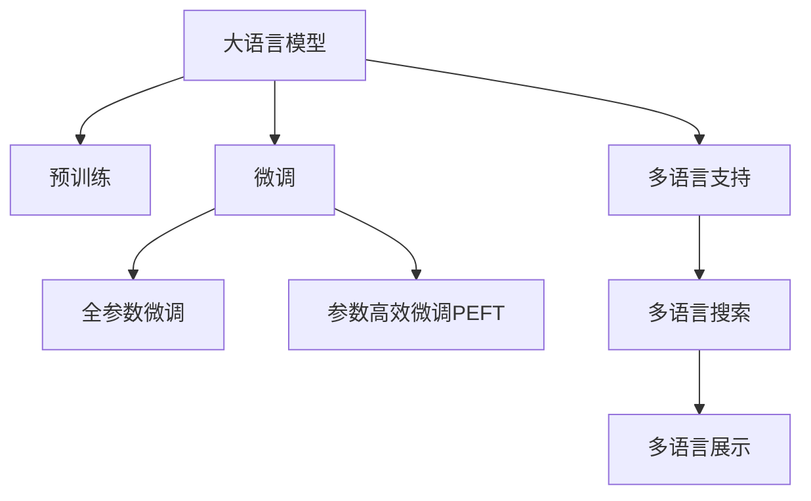

                 

# 电商搜索的多语言支持：AI大模型的新突破

> 关键词：电商搜索，多语言支持，AI大模型，自然语言处理，语言模型，Transformer

## 1. 背景介绍

随着全球化的推进，跨境电商正在成为国际贸易的重要形式。而要抓住这一机遇，电商平台的搜索系统需要具备强大的多语言支持能力，以吸引和满足不同语言和文化背景的消费者。传统的搜索系统依靠人工翻译和规则匹配，难以满足对快速、准确和智能化的需求。基于深度学习的大语言模型提供了新的解决方案。

## 2. 核心概念与联系

### 2.1 核心概念概述

为更好地理解基于大模型的电商搜索多语言支持技术，本节将介绍几个关键概念：

- **大语言模型(Large Language Model, LLM)**：指通过大规模无标签数据预训练获得的语言模型，如BERT、GPT等。这些模型具备强大的自然语言处理能力，能够理解并生成多种语言的文本。

- **预训练(Pre-training)**：指在大规模无标签数据上，通过自监督学习任务训练通用语言模型的过程。常见的预训练任务包括言语建模、掩码语言模型等。预训练使得模型学习到语言的通用表示。

- **微调(Fine-tuning)**：指在预训练模型的基础上，使用下游任务的少量标注数据，通过有监督地训练来优化模型在该任务上的性能。

- **多语言支持(Multi-language Support)**：指支持多种语言的搜索和展示功能，通过模型能够处理不同语言版本的搜索查询和结果。

- **自然语言处理(Natural Language Processing, NLP)**：指使计算机理解、处理和生成人类语言的技术。

- **语言模型(Language Model)**：指用于评估文本序列概率分布的模型，常用于搜索系统中的文本匹配和相关性排序。

- **Transformer**：一种基于自注意力机制的神经网络结构，用于处理序列数据的自然语言处理任务，已经在机器翻译、文本生成、语言模型等方向取得显著进展。

这些核心概念之间的逻辑关系可以通过以下Mermaid流程图来展示：



这个流程图展示了大语言模型的核心概念及其之间的关系：

1. 大语言模型通过预训练获得基础能力。
2. 微调是对预训练模型进行任务特定的优化，可以分为全参数微调和参数高效微调（PEFT）。
3. 多语言支持是语言模型的一项关键应用，通过模型能够处理不同语言版本的查询和结果。
4. 自然语言处理是连接预训练模型与多语言支持任务的技术桥梁，可以通过微调或迁移学习实现。

## 3. 核心算法原理 & 具体操作步骤
### 3.1 算法原理概述

基于大模型的电商搜索多语言支持技术，本质上是一个有监督的微调过程。其核心思想是：利用大语言模型在多种语言上的预训练能力，通过有监督地微调来适应电商搜索任务的特定需求。

具体来说，假设已有基于某种语言的电商搜索系统，现在需要扩展到其他语言。我们可以使用预训练的大语言模型，在新的语言数据集上进行微调，优化模型在该语言下的表现。微调的目标是使得模型在处理新语言的电商搜索查询时，能够获得较好的结果。

### 3.2 算法步骤详解

基于大模型的电商搜索多语言支持方法通常包括以下关键步骤：

**Step 1: 准备预训练模型和数据集**
- 选择合适的预训练语言模型，如BERT、GPT等。
- 准备新语言的电商搜索数据集，包括查询、商品描述、标签等信息。

**Step 2: 添加任务适配层**
- 根据新语言的电商搜索任务，设计合适的任务适配层。
- 对于多语言搜索，通常需要添加语言检测模块，识别查询语言并根据语言适配不同的处理逻辑。

**Step 3: 设置微调超参数**
- 选择合适的优化算法及其参数，如AdamW、SGD等，设置学习率、批大小、迭代轮数等。
- 设置正则化技术及强度，包括权重衰减、Dropout、Early Stopping等。
- 确定冻结预训练参数的策略，如仅微调顶层，或全部参数都参与微调。

**Step 4: 执行梯度训练**
- 将训练集数据分批次输入模型，前向传播计算损失函数。
- 反向传播计算参数梯度，根据设定的优化算法和学习率更新模型参数。
- 周期性在验证集上评估模型性能，根据性能指标决定是否触发Early Stopping。
- 重复上述步骤直到满足预设的迭代轮数或Early Stopping条件。

**Step 5: 测试和部署**
- 在测试集上评估微调后模型在不同语言下的性能，对比微调前后的精度提升。
- 使用微调后的模型对新语言的搜索查询进行推理预测，集成到实际的应用系统中。
- 持续收集新的数据，定期重新微调模型，以适应数据分布的变化。

### 3.3 算法优缺点

基于大模型的电商搜索多语言支持方法具有以下优点：
1. 高效：相比于传统的人工翻译和规则匹配，微调方法可以在较短的时间内快速提升模型性能。
2. 通用性：预训练大模型在多种语言上均具备良好的泛化能力，可以在不同语言环境中稳定运行。
3. 易于扩展：通过微调现有模型，可以轻松支持新的语言版本，无需从头开发。

同时，该方法也存在一些局限性：
1. 依赖高质量数据：微调效果很大程度上取决于新语言的标注数据质量，标注成本较高。
2. 多语言数据较少：当前预训练模型主要基于英语等少数语言，对其他语言的支持有限。
3. 模型复杂度较高：大语言模型的参数量较大，对计算资源有较高要求。
4. 多语言数据标注困难：不同语言版本的标注规范和标准可能不同，标注难度较大。

尽管存在这些局限性，但就目前而言，基于大模型的电商搜索多语言支持方法仍是一种高效且通用的解决方案。未来相关研究的重点在于如何进一步提升多语言数据的质量和数量，以及开发更加轻量级的多语言支持方法。

### 3.4 算法应用领域

基于大模型的电商搜索多语言支持方法已经在多个电商平台的搜索系统中得到了广泛应用，包括亚马逊、阿里巴巴、Walmart等。具体应用场景包括：

- **多语言搜索**：支持用户使用不同语言进行搜索，返回对应语言的搜索结果。
- **多语言推荐**：根据用户的查询和浏览记录，提供多语言版本的商品推荐。
- **多语言客服**：提供多语言自动回复和实时客服支持，提升用户购物体验。
- **多语言广告投放**：根据用户所在地区和语言，定向投放多语言广告，提高广告效果。

这些应用场景覆盖了电商平台的各个环节，极大地提升了用户体验和运营效率。

## 4. 数学模型和公式 & 详细讲解 & 举例说明
### 4.1 数学模型构建

基于大模型的电商搜索多语言支持技术，可以采用基于自回归的语言模型或自编码的语言模型进行构建。这里以BERT为例，介绍其数学模型构建过程。

设预训练语言模型为 $M_{\theta}$，其中 $\theta$ 为预训练得到的模型参数。假设电商搜索任务为 $T$，包含查询 $Q$ 和商品 $P$，查询与商品之间的匹配关系表示为 $R$。则在电商搜索任务上，模型的经验风险为：

$$
\mathcal{L}(\theta) = \mathbb{E}_{(X,Y)} \left[ \ell(M_{\theta}(X),Y) \right]
$$

其中 $X$ 表示查询和商品的数据集，$Y$ 表示查询与商品之间的匹配关系。在电商搜索任务中，查询与商品之间的匹配关系通常是二元关系，即查询匹配或不匹配商品。因此，查询与商品之间的关系可以表示为 $R = \{(q,p)\}$，其中 $q$ 表示查询，$p$ 表示商品。

模型的损失函数可以定义为交叉熵损失，即：

$$
\ell(M_{\theta}(x),y) = -\sum_i y_i \log M_{\theta}(x_i)
$$

其中 $y_i$ 表示查询 $q_i$ 是否匹配商品 $p_i$，$M_{\theta}(x_i)$ 表示模型对查询 $q_i$ 和商品 $p_i$ 之间的关系进行预测的结果。

### 4.2 公式推导过程

在电商搜索任务中，模型的前向传播过程可以表示为：

$$
y_i = \sigma(M_{\theta}(Q_i,P_i))
$$

其中 $Q_i$ 表示查询，$P_i$ 表示商品，$\sigma$ 为激活函数，如sigmoid函数。

模型的损失函数可以进一步展开为：

$$
\mathcal{L}(\theta) = -\frac{1}{N}\sum_{i=1}^N \log M_{\theta}(Q_i,P_i)
$$

其中 $N$ 为数据集大小。

通过梯度下降等优化算法，微调过程不断更新模型参数 $\theta$，最小化损失函数 $\mathcal{L}(\theta)$，使得模型输出逼近真实的查询与商品匹配关系。由于 $\theta$ 已经通过预训练获得了较好的初始化，因此即便在少量标注数据上，微调模型也能较快收敛到理想的状态。

### 4.3 案例分析与讲解

假设我们有一个基于英语的电商搜索系统，现在需要扩展到中文搜索。首先，我们需要准备中文电商搜索的数据集，包括中文查询和商品描述，以及查询与商品之间的中文匹配关系。然后，使用预训练的BERT模型，将中文查询和商品描述作为输入，输出中文查询与商品匹配关系的概率。通过在少量标注数据上进行微调，优化模型在中文电商搜索任务上的性能。

在微调过程中，我们可以使用中文标注数据集，对模型的输出进行监督学习，调整模型参数。例如，对于中文查询 $Q_i$ 和商品 $P_i$，如果查询匹配商品，则期望模型的输出 $y_i$ 接近1，否则接近0。通过不断迭代优化，使得模型能够准确预测查询与商品之间的匹配关系。

## 5. 项目实践：代码实例和详细解释说明
### 5.1 开发环境搭建

在进行多语言支持实践前，我们需要准备好开发环境。以下是使用Python进行PyTorch开发的环境配置流程：

1. 安装Anaconda：从官网下载并安装Anaconda，用于创建独立的Python环境。

2. 创建并激活虚拟环境：
```bash
conda create -n pytorch-env python=3.8 
conda activate pytorch-env
```

3. 安装PyTorch：根据CUDA版本，从官网获取对应的安装命令。例如：
```bash
conda install pytorch torchvision torchaudio cudatoolkit=11.1 -c pytorch -c conda-forge
```

4. 安装Transformers库：
```bash
pip install transformers
```

5. 安装各类工具包：
```bash
pip install numpy pandas scikit-learn matplotlib tqdm jupyter notebook ipython
```

完成上述步骤后，即可在`pytorch-env`环境中开始多语言支持实践。

### 5.2 源代码详细实现

下面我以中文电商搜索为例，给出使用Transformers库进行BERT微调的PyTorch代码实现。

首先，定义中文电商搜索任务的数据处理函数：

```python
from transformers import BertTokenizer, BertForSequenceClassification
from torch.utils.data import Dataset
import torch

class ChineseEcommerceDataset(Dataset):
    def __init__(self, texts, labels, tokenizer, max_len=128):
        self.texts = texts
        self.labels = labels
        self.tokenizer = tokenizer
        self.max_len = max_len
        
    def __len__(self):
        return len(self.texts)
    
    def __getitem__(self, item):
        text = self.texts[item]
        label = self.labels[item]
        
        encoding = self.tokenizer(text, return_tensors='pt', max_length=self.max_len, padding='max_length', truncation=True)
        input_ids = encoding['input_ids'][0]
        attention_mask = encoding['attention_mask'][0]
        
        encoded_label = [label2id[label] for label in self.labels] 
        encoded_label.extend([label2id['O']] * (self.max_len - len(encoded_label)))
        labels = torch.tensor(encoded_label, dtype=torch.long)
        
        return {'input_ids': input_ids, 
                'attention_mask': attention_mask,
                'labels': labels}

# 标签与id的映射
label2id = {'O': 0, 'P': 1}
id2label = {v: k for k, v in label2id.items()}

# 创建dataset
tokenizer = BertTokenizer.from_pretrained('bert-base-cased')

train_dataset = ChineseEcommerceDataset(train_texts, train_labels, tokenizer)
dev_dataset = ChineseEcommerceDataset(dev_texts, dev_labels, tokenizer)
test_dataset = ChineseEcommerceDataset(test_texts, test_labels, tokenizer)
```

然后，定义模型和优化器：

```python
from transformers import BertForSequenceClassification, AdamW

model = BertForSequenceClassification.from_pretrained('bert-base-cased', num_labels=2)

optimizer = AdamW(model.parameters(), lr=2e-5)
```

接着，定义训练和评估函数：

```python
from torch.utils.data import DataLoader
from tqdm import tqdm
from sklearn.metrics import accuracy_score

device = torch.device('cuda') if torch.cuda.is_available() else torch.device('cpu')
model.to(device)

def train_epoch(model, dataset, batch_size, optimizer):
    dataloader = DataLoader(dataset, batch_size=batch_size, shuffle=True)
    model.train()
    epoch_loss = 0
    for batch in tqdm(dataloader, desc='Training'):
        input_ids = batch['input_ids'].to(device)
        attention_mask = batch['attention_mask'].to(device)
        labels = batch['labels'].to(device)
        model.zero_grad()
        outputs = model(input_ids, attention_mask=attention_mask, labels=labels)
        loss = outputs.loss
        epoch_loss += loss.item()
        loss.backward()
        optimizer.step()
    return epoch_loss / len(dataloader)

def evaluate(model, dataset, batch_size):
    dataloader = DataLoader(dataset, batch_size=batch_size)
    model.eval()
    preds, labels = [], []
    with torch.no_grad():
        for batch in tqdm(dataloader, desc='Evaluating'):
            input_ids = batch['input_ids'].to(device)
            attention_mask = batch['attention_mask'].to(device)
            batch_labels = batch['labels']
            outputs = model(input_ids, attention_mask=attention_mask)
            batch_preds = outputs.logits.argmax(dim=2).to('cpu').tolist()
            batch_labels = batch_labels.to('cpu').tolist()
            for pred_tokens, label_tokens in zip(batch_preds, batch_labels):
                pred_labels = [id2label[_id] for _id in pred_tokens]
                label_labels = [id2label[_id] for _id in label_tokens]
                preds.append(pred_labels[:len(label_labels)])
                labels.append(label_labels)
                
    print('Accuracy:', accuracy_score(labels, preds))
```

最后，启动训练流程并在测试集上评估：

```python
epochs = 5
batch_size = 16

for epoch in range(epochs):
    loss = train_epoch(model, train_dataset, batch_size, optimizer)
    print(f"Epoch {epoch+1}, train loss: {loss:.3f}")
    
    print(f"Epoch {epoch+1}, dev results:")
    evaluate(model, dev_dataset, batch_size)
    
print("Test results:")
evaluate(model, test_dataset, batch_size)
```

以上就是使用PyTorch对BERT进行中文电商搜索任务微调的完整代码实现。可以看到，得益于Transformers库的强大封装，我们可以用相对简洁的代码完成BERT模型的加载和微调。

### 5.3 代码解读与分析

让我们再详细解读一下关键代码的实现细节：

**ChineseEcommerceDataset类**：
- `__init__`方法：初始化中文电商搜索数据集的文本、标签、分词器等关键组件。
- `__len__`方法：返回数据集的样本数量。
- `__getitem__`方法：对单个样本进行处理，将中文文本输入编码为token ids，将标签编码为数字，并对其进行定长padding，最终返回模型所需的输入。

**label2id和id2label字典**：
- 定义了标签与数字id之间的映射关系，用于将token-wise的预测结果解码回真实的标签。

**训练和评估函数**：
- 使用PyTorch的DataLoader对数据集进行批次化加载，供模型训练和推理使用。
- 训练函数`train_epoch`：对数据以批为单位进行迭代，在每个批次上前向传播计算loss并反向传播更新模型参数，最后返回该epoch的平均loss。
- 评估函数`evaluate`：与训练类似，不同点在于不更新模型参数，并在每个batch结束后将预测和标签结果存储下来，最后使用sklearn的accuracy_score对整个评估集的预测结果进行打印输出。

**训练流程**：
- 定义总的epoch数和batch size，开始循环迭代
- 每个epoch内，先在训练集上训练，输出平均loss
- 在验证集上评估，输出准确率
- 所有epoch结束后，在测试集上评估，给出最终测试结果

可以看到，PyTorch配合Transformers库使得BERT微调的代码实现变得简洁高效。开发者可以将更多精力放在数据处理、模型改进等高层逻辑上，而不必过多关注底层的实现细节。

当然，工业级的系统实现还需考虑更多因素，如模型的保存和部署、超参数的自动搜索、更灵活的任务适配层等。但核心的微调范式基本与此类似。

## 6. 实际应用场景
### 6.1 智能客服系统

基于大模型多语言支持的技术，智能客服系统可以支持多语言自动回复和实时客服，提升客户服务体验。通过微调预训练语言模型，使其能够理解并生成多语言文本，从而实现多语言客户查询的自动回复和问题解决。

在技术实现上，可以收集不同语言版本的客户查询和历史回复数据，将多语言查询和回复对作为监督数据，训练模型进行语言预测和生成。微调后的模型能够自动理解用户查询意图，匹配最合适的回答模板进行回复。对于客户提出的新问题，还可以接入检索系统实时搜索相关内容，动态组织生成回答。如此构建的智能客服系统，能大幅提升客户咨询体验和问题解决效率。

### 6.2 多语言广告投放

基于大模型的多语言支持技术，广告投放系统可以支持多语言版本的广告创意生成和投放，提高广告效果。通过微调预训练语言模型，使其能够生成多语言版本的广告文案，并进行多语言广告点击率的预测。

在广告投放过程中，可以根据用户的语言偏好和地理位置，定向投放多语言广告，提升广告的点击率和转化率。同时，通过多语言广告创意的生成，可以更贴近用户的语言习惯和需求，提高广告的吸引力和互动性。

### 6.3 旅游和商务出行

基于大模型的多语言支持技术，旅游和商务出行平台可以提供多语言版本的服务指南和推荐，满足全球用户的需求。通过微调预训练语言模型，使其能够理解并生成多语言文本，从而提供多语言的服务指南和旅游推荐。

在服务指南中，可以包含多语言版的地图、酒店、交通、餐饮等信息，帮助用户更好地了解目的地。在旅游推荐中，可以根据用户的语言偏好和地理位置，推荐多语言版的旅游攻略、景点介绍和特色商品。

### 6.4 未来应用展望

随着大语言模型和微调方法的不断发展，基于多语言支持的技术将在更多领域得到应用，为全球化带来新的机遇。

在智慧医疗领域，基于多语言支持的健康问答系统可以提供多语言版本的信息咨询和健康建议，帮助全球患者获取更好的医疗服务。

在智能教育领域，多语言支持的学习助手可以提供多语言版本的学习资源和个性化推荐，帮助全球学生更好地掌握知识。

在智慧城市治理中，基于多语言支持的公共服务平台可以提供多语言版的信息服务和政策咨询，提升城市管理的智能化水平。

此外，在电子商务、金融服务、媒体娱乐等众多领域，基于大模型的多语言支持技术也将不断涌现，为全球化的推进提供新的动力。相信随着技术的日益成熟，多语言支持技术将成为全球化进程的重要工具，推动全球经济和社会的发展。

## 7. 工具和资源推荐
### 7.1 学习资源推荐

为了帮助开发者系统掌握基于大模型的多语言支持技术，这里推荐一些优质的学习资源：

1. 《Transformer从原理到实践》系列博文：由大模型技术专家撰写，深入浅出地介绍了Transformer原理、BERT模型、多语言支持技术等前沿话题。

2. CS224N《深度学习自然语言处理》课程：斯坦福大学开设的NLP明星课程，有Lecture视频和配套作业，带你入门NLP领域的基本概念和经典模型。

3. 《Natural Language Processing with Transformers》书籍：Transformers库的作者所著，全面介绍了如何使用Transformers库进行NLP任务开发，包括多语言支持在内的诸多范式。

4. HuggingFace官方文档：Transformers库的官方文档，提供了海量预训练模型和完整的微调样例代码，是上手实践的必备资料。

5. CLUE开源项目：中文语言理解测评基准，涵盖大量不同类型的中文NLP数据集，并提供了基于多语言支持的baseline模型，助力中文NLP技术发展。

通过对这些资源的学习实践，相信你一定能够快速掌握基于大模型的多语言支持技术，并用于解决实际的NLP问题。
###  7.2 开发工具推荐

高效的开发离不开优秀的工具支持。以下是几款用于基于大模型多语言支持开发的常用工具：

1. PyTorch：基于Python的开源深度学习框架，灵活动态的计算图，适合快速迭代研究。大部分预训练语言模型都有PyTorch版本的实现。

2. TensorFlow：由Google主导开发的开源深度学习框架，生产部署方便，适合大规模工程应用。同样有丰富的预训练语言模型资源。

3. Transformers库：HuggingFace开发的NLP工具库，集成了众多SOTA语言模型，支持PyTorch和TensorFlow，是进行多语言支持开发的利器。

4. Weights & Biases：模型训练的实验跟踪工具，可以记录和可视化模型训练过程中的各项指标，方便对比和调优。与主流深度学习框架无缝集成。

5. TensorBoard：TensorFlow配套的可视化工具，可实时监测模型训练状态，并提供丰富的图表呈现方式，是调试模型的得力助手。

6. Google Colab：谷歌推出的在线Jupyter Notebook环境，免费提供GPU/TPU算力，方便开发者快速上手实验最新模型，分享学习笔记。

合理利用这些工具，可以显著提升基于大模型的多语言支持任务的开发效率，加快创新迭代的步伐。

### 7.3 相关论文推荐

大语言模型和多语言支持技术的发展源于学界的持续研究。以下是几篇奠基性的相关论文，推荐阅读：

1. Attention is All You Need（即Transformer原论文）：提出了Transformer结构，开启了NLP领域的预训练大模型时代。

2. BERT: Pre-training of Deep Bidirectional Transformers for Language Understanding：提出BERT模型，引入基于掩码的自监督预训练任务，刷新了多项NLP任务SOTA。

3. Large-Scale Multi-Language Speech Pre-Training for Speaker Recognition：在多语言演讲识别领域，提出使用多语言语料进行预训练的方法，提升了多语言语言模型的泛化能力。

4. Multi-Language Universal Pre-training for Image-Text Matching：提出使用多语言语料进行多模态预训练的方法，提升了多语言图片与文本匹配任务的性能。

5. Cross-Lingual Language Modeling with Parallel Text and Unsupervised Training Methods：提出使用平行语料和多语言语料进行无监督跨语言语言模型训练的方法，提升了多语言语言模型的泛化能力。

这些论文代表了大语言模型和多语言支持技术的发展脉络。通过学习这些前沿成果，可以帮助研究者把握学科前进方向，激发更多的创新灵感。

## 8. 总结：未来发展趋势与挑战
### 8.1 总结

本文对基于大模型的电商搜索多语言支持技术进行了全面系统的介绍。首先阐述了电商搜索系统对多语言支持的需求，明确了大语言模型和多语言支持技术的核心思想和应用场景。其次，从原理到实践，详细讲解了基于大模型的多语言支持技术的关键步骤和实现细节，给出了基于中文电商搜索任务的微调代码实例。同时，本文还探讨了多语言支持技术在智能客服、多语言广告投放、旅游和商务出行等多个领域的应用前景，展示了多语言支持技术的广阔应用空间。

通过本文的系统梳理，可以看到，基于大模型的多语言支持技术正在成为电商搜索系统的重要组成部分，极大地提升了用户体验和运营效率。未来，伴随大语言模型和多语言支持技术的进一步发展，基于多语言支持的系统将更加智能、高效，为用户提供更优质的服务。

### 8.2 未来发展趋势

展望未来，基于大模型的多语言支持技术将呈现以下几个发展趋势：

1. 模型规模持续增大。随着算力成本的下降和数据规模的扩张，预训练语言模型的参数量还将持续增长。超大规模语言模型蕴含的丰富语言知识，有望支撑更加复杂多变的电商搜索任务。

2. 多语言数据集质量提升。随着预训练数据集的不断丰富，多语言数据的质量将逐步提高，有助于提升模型在不同语言环境下的表现。

3. 多语言数据标注标准化。不同语言版本的标注规范和标准可能不同，通过标准化标注方法，可以提高数据的一致性和可靠性。

4. 轻量级多语言支持方法涌现。随着模型压缩、参数高效微调等技术的发展，未来将有更多轻量级的多语言支持方法出现，提升模型的推理效率和部署灵活性。

5. 多模态语言模型的融合。未来将有更多多模态语言模型的研究，结合视觉、语音等多模态信息，提升模型的语义理解能力和泛化能力。

6. 多语言语言模型的迁移学习。将多语言语言模型在不同语言之间的迁移学习应用推广，提升多语言模型的通用性和跨语言泛化能力。

以上趋势凸显了大语言模型和多语言支持技术的广阔前景。这些方向的探索发展，必将进一步提升多语言搜索系统的性能和应用范围，为电商平台的国际化发展提供新的动力。

### 8.3 面临的挑战

尽管基于大模型的多语言支持技术已经取得了显著成果，但在迈向更加智能化、普适化应用的过程中，它仍面临着诸多挑战：

1. 数据稀缺性。不同语言版本的标注数据稀缺，标注成本较高，难以覆盖所有场景。

2. 多语言数据集质量参差不齐。不同语言版本的标注数据质量参差不齐，对模型的泛化能力有一定影响。

3. 多语言数据标注困难。不同语言版本的标注规范和标准可能不同，标注难度较大。

4. 多语言数据集的不均衡性。不同语言版本的标注数据分布不均衡，可能导致模型在特定语言上的表现不佳。

5. 模型复杂度较高。大语言模型的参数量较大，对计算资源有较高要求。

6. 模型鲁棒性不足。当前多语言支持模型面对域外数据时，泛化性能往往大打折扣。

尽管存在这些挑战，但就目前而言，基于大模型的多语言支持技术仍是一种高效且通用的解决方案。未来相关研究的重点在于如何进一步提升多语言数据的质量和数量，以及开发更加轻量级的多语言支持方法。

### 8.4 研究展望

面对基于大模型的多语言支持技术所面临的种种挑战，未来的研究需要在以下几个方面寻求新的突破：

1. 探索无监督和半监督多语言学习方法。摆脱对大规模标注数据的依赖，利用自监督学习、主动学习等无监督和半监督范式，最大限度利用非结构化数据，实现更加灵活高效的多语言支持。

2. 研究多语言迁移学习方法。将多语言语言模型在不同语言之间的迁移学习应用推广，提升多语言模型的通用性和跨语言泛化能力。

3. 融合因果推断和多语言信息。引入因果推断和多语言信息，增强多语言模型的稳定性和准确性，提升其对复杂多变任务的适应能力。

4. 引入外部知识库和逻辑规则。将符号化的先验知识，如知识图谱、逻辑规则等，与神经网络模型进行巧妙融合，引导多语言模型学习更准确、合理的语言模型。

5. 结合因果分析和博弈论工具。将因果分析方法引入多语言模型，识别出模型决策的关键特征，增强输出解释的因果性和逻辑性。借助博弈论工具刻画人机交互过程，主动探索并规避模型的脆弱点，提高系统稳定性。

6. 纳入伦理道德约束。在模型训练目标中引入伦理导向的评估指标，过滤和惩罚有偏见、有害的输出倾向。同时加强人工干预和审核，建立模型行为的监管机制，确保输出符合人类价值观和伦理道德。

这些研究方向的探索，必将引领基于大模型的多语言支持技术迈向更高的台阶，为构建安全、可靠、可解释、可控的多语言搜索系统铺平道路。面向未来，基于大模型的多语言支持技术还需要与其他人工智能技术进行更深入的融合，如知识表示、因果推理、强化学习等，多路径协同发力，共同推动自然语言理解和智能交互系统的进步。只有勇于创新、敢于突破，才能不断拓展多语言模型的边界，让智能技术更好地造福人类社会。

## 9. 附录：常见问题与解答

**Q1：电商搜索的多语言支持是否需要从头开始构建模型？**

A: 不需要。可以使用预训练的大语言模型，通过有监督地微调来适应电商搜索的多语言需求。微调过程可以在较短的时间内完成，并显著提升模型性能。

**Q2：微调过程中如何缓解过拟合问题？**

A: 过拟合是微调面临的主要挑战，尤其是在标注数据不足的情况下。常见的缓解策略包括数据增强、正则化、对抗训练等。数据增强可以通过改写查询、回译等方式扩充训练集；正则化可以通过L2正则、Dropout等方法防止模型过度适应训练集；对抗训练可以通过加入对抗样本，提高模型的鲁棒性。

**Q3：多语言支持模型在部署时需要注意哪些问题？**

A: 多语言支持模型在部署时需要注意模型裁剪、量化加速、服务化封装、弹性伸缩、监控告警等问题。模型裁剪可以去除不必要的层和参数，减小模型尺寸；量化加速可以将浮点模型转为定点模型，压缩存储空间，提高计算效率；服务化封装可以将模型封装为标准化服务接口，便于集成调用；弹性伸缩可以根据请求流量动态调整资源配置，平衡服务质量和成本；监控告警可以实时采集系统指标，设置异常告警阈值，确保服务稳定性。

**Q4：如何提高多语言支持模型的鲁棒性？**

A: 提高多语言支持模型的鲁棒性需要从数据和模型两个方面入手。数据方面，可以通过收集多语言数据集，提高模型的泛化能力；模型方面，可以通过引入对抗训练、数据增强、正则化等技术，增强模型的鲁棒性。

**Q5：多语言支持模型在实际应用中需要注意哪些问题？**

A: 多语言支持模型在实际应用中需要注意模型裁剪、量化加速、服务化封装、弹性伸缩、监控告警等问题。模型裁剪可以去除不必要的层和参数，减小模型尺寸；量化加速可以将浮点模型转为定点模型，压缩存储空间，提高计算效率；服务化封装可以将模型封装为标准化服务接口，便于集成调用；弹性伸缩可以根据请求流量动态调整资源配置，平衡服务质量和成本；监控告警可以实时采集系统指标，设置异常告警阈值，确保服务稳定性。

通过这些问题的解答，可以帮助开发者更好地理解基于大模型的多语言支持技术，并解决实际应用中可能遇到的问题。

