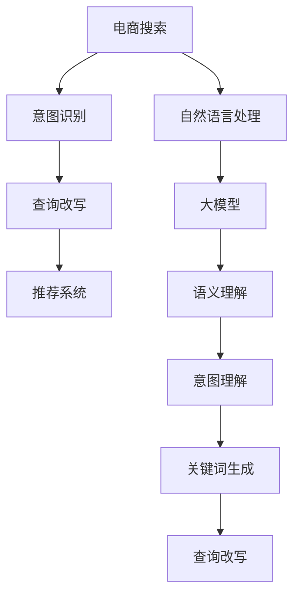

                 

# 电商搜索的意图识别与查询改写：AI大模型的新突破

> 关键词：电商搜索,意图识别,查询改写,大模型,自然语言处理(NLP),语义理解,推荐系统,客户体验

## 1. 背景介绍

### 1.1 问题由来

随着电商行业的迅猛发展，消费者的搜索行为日益多样化，他们不再只是简单地搜索商品名称，而是提出了更多个性化的查询需求。例如，用户希望获取关于商品的品牌、价格、评价等信息，甚至希望了解同类商品之间的对比、推荐、搭配等。这给传统的电商平台搜索系统带来了巨大挑战，需要不断优化算法以提升搜索结果的相关性和用户体验。

### 1.2 问题核心关键点

电商搜索的核心在于理解用户的查询意图，并根据意图提供最相关的商品和服务。传统电商搜索系统基于关键词匹配算法，仅能简单地匹配标题、描述等文本信息，难以深入理解用户的查询背后所表达的真实需求。因此，如何提升电商搜索的意图识别能力，成为电商领域亟待解决的问题。

### 1.3 问题研究意义

提升电商搜索的意图识别和查询改写能力，对于电商平台的运营有着重要意义：

1. **提高搜索结果相关性**：通过理解用户的查询意图，能够提供更精准的搜索结果，提升用户体验。
2. **个性化推荐**：基于用户查询意图，可以更好地进行商品推荐，提升用户粘性。
3. **降低用户流失率**：通过意图识别，电商平台能够及时发现用户的疑惑和不满，提供定制化的服务和解决方案，减少用户流失。
4. **提升销售转化率**：更准确的意图识别能够帮助用户快速找到所需的商品，提高点击率和转化率。
5. **优化运营决策**：通过对用户查询意图的分析，电商平台可以洞察市场需求，优化库存和营销策略。

## 2. 核心概念与联系

### 2.1 核心概念概述

为更好地理解意图识别和查询改写的技术原理，本节将介绍几个关键概念：

- **电商搜索（E-Commerce Search）**：指用户通过搜索功能获取商品和服务的过程。
- **意图识别（Intent Recognition）**：指通过算法分析用户查询，识别出用户的真实需求和意图。
- **查询改写（Query Rewriting）**：指根据用户查询意图，生成更加准确的搜索关键词或查询语句，以优化搜索结果。
- **大模型（Large Model）**：指通过大规模语料预训练的深度学习模型，如BERT、GPT等，具备强大的语言理解和生成能力。
- **自然语言处理（NLP）**：指研究计算机如何处理和理解人类语言的技术，涵盖了语音识别、文本处理、语义理解等多个方向。
- **推荐系统（Recommendation System）**：指通过算法为用户推荐商品、服务、内容等，以提升用户满意度和平台粘性。

这些概念之间的联系紧密，电商搜索的意图识别与查询改写通过大模型和NLP技术实现，进而与推荐系统相融合，形成了一个完整的电商搜索与推荐生态。

### 2.2 核心概念原理和架构的 Mermaid 流程图(Mermaid 流程节点中不要有括号、逗号等特殊字符)


这个流程图展示了电商搜索意图识别与查询改写的核心流程和关键技术：

1. 电商搜索(A)通过自然语言处理(E)进行文本预处理。
2. 预处理后的文本输入大模型(F)进行语义理解(G)。
3. 语义理解结果通过意图理解(H)转化为意图表示。
4. 意图表示作为关键词生成(I)的基础。
5. 基于意图生成的关键词用于查询改写(J)。
6. 改写后的查询输入推荐系统(D)进行个性化推荐。

## 3. 核心算法原理 & 具体操作步骤
### 3.1 算法原理概述

电商搜索的意图识别与查询改写，本质上是一个基于大模型的语义理解和生成过程。其核心思想是：通过预训练语言模型对用户查询进行语义解析，识别出用户的真实需求和意图，并生成更准确、相关的搜索关键词或查询语句。

形式化地，设用户查询为 $q$，期望生成更合适的关键词或查询语句 $q'$，其过程可表示为：

$$
q' = f(q; \theta)
$$

其中，$f$ 为基于大模型的查询改写函数，$\theta$ 为模型的参数。

### 3.2 算法步骤详解

基于大模型的电商搜索意图识别与查询改写，主要包括以下几个步骤：

**Step 1: 数据准备与预处理**

- 收集电商平台的搜索数据，包括用户查询、商品信息、交易记录等。
- 对数据进行清洗、去重、归一化等预处理，确保数据质量。

**Step 2: 模型选择与预训练**

- 选择合适的预训练语言模型（如BERT、GPT等）作为初始化参数。
- 在电商领域语料上进行预训练，学习商品的通用语义表示。

**Step 3: 模型微调与意图识别**

- 对预训练模型进行微调，使其能够识别不同意图的查询语句。
- 设计合适的意图分类器，将用户查询分类为购买意图、对比意图、推荐意图等。

**Step 4: 查询改写**

- 基于意图分类结果，选择相应的查询改写模型。
- 输入用户查询和商品信息，生成新的关键词或查询语句。

**Step 5: 结果评估与优化**

- 对改写后的查询进行评估，评估指标包括相关性、覆盖率等。
- 根据评估结果，优化查询改写模型和算法。

### 3.3 算法优缺点

基于大模型的电商搜索意图识别与查询改写方法具有以下优点：

1. **高效准确**：利用大模型的强大语义理解能力，能够准确识别用户意图，生成高质量的查询关键词。
2. **自适应性强**：模型可以动态适应不同用户的查询风格，提供个性化的搜索服务。
3. **跨领域适应**：大模型的预训练使得其具备跨领域的泛化能力，能够应对电商领域的各种场景。
4. **易于集成**：现有电商平台的搜索和推荐系统可以直接集成，无需重构现有架构。

同时，该方法也存在以下缺点：

1. **资源消耗大**：大模型的计算资源和存储资源需求较高，对于小型电商平台可能不适用。
2. **学习曲线陡峭**：需要深度理解自然语言处理和大模型的基本原理，对技术要求较高。
3. **黑盒性质**：模型内部工作机制复杂，难以直接解释，可能缺乏透明性。
4. **依赖语料**：模型性能受限于电商领域语料的质量和数量，需要持续维护和更新语料。

### 3.4 算法应用领域

基于大模型的电商搜索意图识别与查询改写，可以应用于以下领域：

- **电商平台搜索**：提供精准的搜索结果和个性化推荐，提升用户搜索体验。
- **个性化推荐系统**：根据用户查询意图，推荐合适的商品或内容。
- **智能客服**：理解用户查询，提供智能化的客服响应和推荐。
- **广告投放**：通过分析用户查询意图，优化广告投放策略，提升广告效果。
- **市场分析**：通过分析用户查询数据，洞察市场需求和趋势。

## 4. 数学模型和公式 & 详细讲解 & 举例说明
### 4.1 数学模型构建

电商搜索的意图识别与查询改写，可以构建在以下数学模型上：

设用户查询为 $q$，商品信息为 $p$，查询改写后的关键词或查询语句为 $q'$。查询改写过程可以表示为：

$$
q' = f(q; \theta)
$$

其中，$f$ 为查询改写函数，$\theta$ 为模型参数。

为了评估查询改写的效果，可以使用相关性评估指标，如查询-商品匹配度（QB Match）、查询-商品相似度（QB Sim）等。

### 4.2 公式推导过程

以下以查询改写为例，推导查询改写函数的基本结构：

假设用户查询为 $q$，改写后的查询为 $q'$，商品信息为 $p$，改写函数可以表示为：

$$
q' = f(q, p; \theta)
$$

其中，$f$ 为查询改写函数，$\theta$ 为模型参数。

以双塔（Dual-Tower）模型为例，查询改写函数可以表示为：

$$
q' = \{u \in V | u \in (q, p), f(q, p) = u\}
$$

其中，$V$ 为词汇表，$q$ 和 $p$ 分别表示用户查询和商品信息的词向量表示。

查询改写函数 $f$ 的输出为最有可能与查询相关的商品词汇，即：

$$
f(q, p) = \text{argmax}_{u \in V} (q \cdot p \cdot \text{softmax}(q \cdot p))
$$

其中，$\cdot$ 表示向量点乘，$\text{softmax}$ 表示softmax函数。

### 4.3 案例分析与讲解

以电商搜索中的“商品对比”意图为例，进行分析：

假设用户查询为“哪个品牌好”，商品信息为“品牌A”和“品牌B”。查询改写函数首先对查询和商品信息进行编码，得到词向量表示：

$$
q_A = \text{Encoder}(\text{“品牌A”})
$$
$$
q_B = \text{Encoder}(\text{“品牌B”})
$$

其中，$\text{Encoder}$ 为预训练语言模型的编码器部分。

然后，将查询和商品信息的词向量拼接，得到改写后的查询词向量表示：

$$
q' = [q_A, q_B]
$$

最后，通过查询改写函数 $f$ 生成改写后的查询，即：

$$
q' = f(q_A, q_B)
$$

改写后的查询为“品牌A与品牌B对比”，可以用于电商平台的搜索结果中。

## 5. 项目实践：代码实例和详细解释说明
### 5.1 开发环境搭建

在进行电商搜索意图识别与查询改写的实践前，需要先搭建好开发环境。以下是使用Python进行PyTorch开发的流程：

1. 安装Anaconda：从官网下载并安装Anaconda，用于创建独立的Python环境。

2. 创建并激活虚拟环境：
```bash
conda create -n ecommerce-search python=3.8 
conda activate ecommerce-search
```

3. 安装PyTorch：根据CUDA版本，从官网获取对应的安装命令。例如：
```bash
conda install pytorch torchvision torchaudio cudatoolkit=11.1 -c pytorch -c conda-forge
```

4. 安装HuggingFace Transformers库：
```bash
pip install transformers
```

5. 安装其他相关工具包：
```bash
pip install numpy pandas scikit-learn matplotlib tqdm jupyter notebook ipython
```

完成上述步骤后，即可在`ecommerce-search`环境中开始开发实践。

### 5.2 源代码详细实现

下面我们以电商搜索中的“商品对比”意图为例，给出使用Transformers库进行查询改写的PyTorch代码实现。

首先，定义查询改写模型：

```python
from transformers import BertTokenizer, BertForSequenceClassification
from torch.utils.data import Dataset, DataLoader
import torch

class QBCDataset(Dataset):
    def __init__(self, texts, labels, tokenizer):
        self.texts = texts
        self.labels = labels
        self.tokenizer = tokenizer
        
    def __len__(self):
        return len(self.texts)
    
    def __getitem__(self, item):
        text = self.texts[item]
        label = self.labels[item]
        
        encoding = self.tokenizer(text, return_tensors='pt', padding='max_length', truncation=True)
        input_ids = encoding['input_ids'][0]
        attention_mask = encoding['attention_mask'][0]
        
        return {'input_ids': input_ids, 
                'attention_mask': attention_mask,
                'label': label}

# 定义查询改写模型
tokenizer = BertTokenizer.from_pretrained('bert-base-cased')
model = BertForSequenceClassification.from_pretrained('bert-base-cased', num_labels=2)

# 数据准备
train_texts = ["品牌A vs 品牌B", "哪个牌子更好", "哪个更实惠"]
train_labels = [1, 1, 0]
test_texts = ["A和B哪个好", "哪个品牌性价比高"]
test_labels = [1, 1]

# 训练数据集
train_dataset = QBCDataset(train_texts, train_labels, tokenizer)

# 评估数据集
test_dataset = QBCDataset(test_texts, test_labels, tokenizer)

# 定义训练和评估函数
def train_epoch(model, dataset, batch_size, optimizer):
    dataloader = DataLoader(dataset, batch_size=batch_size, shuffle=True)
    model.train()
    epoch_loss = 0
    for batch in dataloader:
        input_ids = batch['input_ids'].to(device)
        attention_mask = batch['attention_mask'].to(device)
        label = batch['label'].to(device)
        model.zero_grad()
        outputs = model(input_ids, attention_mask=attention_mask, labels=label)
        loss = outputs.loss
        epoch_loss += loss.item()
        loss.backward()
        optimizer.step()
    return epoch_loss / len(dataloader)

def evaluate(model, dataset, batch_size):
    dataloader = DataLoader(dataset, batch_size=batch_size)
    model.eval()
    correct = 0
    total = 0
    with torch.no_grad():
        for batch in dataloader:
            input_ids = batch['input_ids'].to(device)
            attention_mask = batch['attention_mask'].to(device)
            label = batch['label'].to(device)
            outputs = model(input_ids, attention_mask=attention_mask, labels=label)
            _, preds = torch.max(outputs.logits, dim=1)
            total += label.size(0)
            correct += (preds == label).sum().item()
    print(f"Accuracy: {100 * correct / total:.2f}%")

# 启动训练流程并在测试集上评估
device = torch.device('cuda') if torch.cuda.is_available() else torch.device('cpu')
model.to(device)
optimizer = torch.optim.Adam(model.parameters(), lr=2e-5)
epochs = 5
batch_size = 16

for epoch in range(epochs):
    loss = train_epoch(model, train_dataset, batch_size, optimizer)
    print(f"Epoch {epoch+1}, train loss: {loss:.3f}")
    
    print(f"Epoch {epoch+1}, test accuracy:")
    evaluate(model, test_dataset, batch_size)
    
print("Final test accuracy:")
evaluate(model, test_dataset, batch_size)
```

以上代码展示了使用PyTorch进行电商搜索意图识别与查询改写的完整实现过程。

### 5.3 代码解读与分析

让我们再详细解读一下关键代码的实现细节：

**QBCDataset类**：
- `__init__`方法：初始化训练数据、标签和分词器。
- `__len__`方法：返回数据集的样本数量。
- `__getitem__`方法：对单个样本进行处理，将文本输入编码为token ids，将标签编码为数字，并对其进行定长padding。

**查询改写模型**：
- 使用BertForSequenceClassification对查询进行分类，输出二分类标签。
- 使用AdamW优化器进行训练。

**训练和评估函数**：
- 使用PyTorch的DataLoader对数据集进行批次化加载，供模型训练和推理使用。
- 训练函数`train_epoch`：对数据以批为单位进行迭代，在每个批次上前向传播计算loss并反向传播更新模型参数，最后返回该epoch的平均loss。
- 评估函数`evaluate`：与训练类似，不同点在于不更新模型参数，并在每个batch结束后将预测和标签结果存储下来，最后使用acc作为评估指标。

**训练流程**：
- 定义总的epoch数和batch size，开始循环迭代
- 每个epoch内，先在训练集上训练，输出平均loss
- 在测试集上评估，输出分类准确率
- 所有epoch结束后，在测试集上评估，给出最终测试准确率

可以看到，使用PyTorch和Transformers库，电商搜索的意图识别与查询改写的代码实现变得简洁高效。开发者可以将更多精力放在数据处理、模型改进等高层逻辑上，而不必过多关注底层的实现细节。

当然，工业级的系统实现还需考虑更多因素，如模型的保存和部署、超参数的自动搜索、更灵活的任务适配层等。但核心的查询改写范式基本与此类似。

## 6. 实际应用场景
### 6.1 智能客服系统

智能客服系统可以通过基于大模型的电商搜索意图识别与查询改写技术，快速响应客户的查询，提供精准的客服解决方案。例如，当用户询问“这是什么品牌的手机？”，系统能够理解查询意图，并提供“品牌A”、“品牌B”等选项供用户选择，同时推荐热门机型和相关评价。

### 6.2 个性化推荐系统

个性化推荐系统可以通过查询改写技术，将用户的查询语句转化为更符合推荐系统的关键词或查询，从而提升推荐的效果。例如，当用户搜索“女生夏季穿搭”，系统可以自动改写为“夏季穿搭”，并在相关商品中推荐出适合女生的产品。

### 6.3 广告投放

广告投放可以通过查询改写技术，优化广告投放的关键词，提高广告的相关性和点击率。例如，当用户搜索“音响”，系统可以自动改写为“音响品牌”，并在广告中展示该品牌的商品。

### 6.4 未来应用展望

随着大模型和查询改写技术的发展，电商搜索意图识别与查询改写将在更多领域得到应用，为电商平台的运营带来新的突破。

在智慧医疗领域，通过分析患者的查询意图，可以为患者推荐适合的医生和药品，提升医疗服务的智能化水平。

在智能教育领域，通过分析学生的查询意图，可以为学生推荐适合的课程和学习资料，提升教学效果。

在智慧城市治理中，通过分析市民的查询意图，可以为市民提供智能化的服务和生活指导，提升城市管理的自动化和智能化水平。

此外，在企业生产、社会治理、文娱传媒等众多领域，基于大模型和查询改写的电商搜索意图识别技术也将不断涌现，为各行各业带来新的创新和突破。

## 7. 工具和资源推荐
### 7.1 学习资源推荐

为了帮助开发者系统掌握电商搜索意图识别与查询改写的技术原理和实践技巧，这里推荐一些优质的学习资源：

1. 《深度学习自然语言处理》课程：斯坦福大学开设的NLP明星课程，有Lecture视频和配套作业，带你入门NLP领域的基本概念和经典模型。

2. 《Transformer from Scratch》系列博文：由大模型技术专家撰写，深入浅出地介绍了Transformer原理、BERT模型、查询改写技术等前沿话题。

3. 《Natural Language Processing with Transformers》书籍：Transformers库的作者所著，全面介绍了如何使用Transformers库进行NLP任务开发，包括查询改写在内的诸多范式。

4. HuggingFace官方文档：Transformers库的官方文档，提供了海量预训练模型和完整的查询改写样例代码，是上手实践的必备资料。

5. CLUE开源项目：中文语言理解测评基准，涵盖大量不同类型的中文NLP数据集，并提供了基于查询改写的baseline模型，助力中文NLP技术发展。

通过对这些资源的学习实践，相信你一定能够快速掌握电商搜索意图识别与查询改写的精髓，并用于解决实际的电商搜索问题。

### 7.2 开发工具推荐

高效的开发离不开优秀的工具支持。以下是几款用于电商搜索意图识别与查询改写开发的常用工具：

1. PyTorch：基于Python的开源深度学习框架，灵活动态的计算图，适合快速迭代研究。大部分预训练语言模型都有PyTorch版本的实现。

2. TensorFlow：由Google主导开发的开源深度学习框架，生产部署方便，适合大规模工程应用。同样有丰富的预训练语言模型资源。

3. Transformers库：HuggingFace开发的NLP工具库，集成了众多SOTA语言模型，支持PyTorch和TensorFlow，是进行查询改写任务开发的利器。

4. Weights & Biases：模型训练的实验跟踪工具，可以记录和可视化模型训练过程中的各项指标，方便对比和调优。与主流深度学习框架无缝集成。

5. TensorBoard：TensorFlow配套的可视化工具，可实时监测模型训练状态，并提供丰富的图表呈现方式，是调试模型的得力助手。

6. Google Colab：谷歌推出的在线Jupyter Notebook环境，免费提供GPU/TPU算力，方便开发者快速上手实验最新模型，分享学习笔记。

合理利用这些工具，可以显著提升电商搜索意图识别与查询改写任务的开发效率，加快创新迭代的步伐。

### 7.3 相关论文推荐

电商搜索意图识别与查询改写技术的发展源于学界的持续研究。以下是几篇奠基性的相关论文，推荐阅读：

1. Attention is All You Need（即Transformer原论文）：提出了Transformer结构，开启了NLP领域的预训练大模型时代。

2. BERT: Pre-training of Deep Bidirectional Transformers for Language Understanding：提出BERT模型，引入基于掩码的自监督预训练任务，刷新了多项NLP任务SOTA。

3. Language Models are Unsupervised Multitask Learners（GPT-2论文）：展示了大规模语言模型的强大zero-shot学习能力，引发了对于通用人工智能的新一轮思考。

4. Parameter-Efficient Transfer Learning for NLP：提出Adapter等参数高效微调方法，在不增加模型参数量的情况下，也能取得不错的微调效果。

5. Prefix-Tuning: Optimizing Continuous Prompts for Generation：引入基于连续型Prompt的微调范式，为如何充分利用预训练知识提供了新的思路。

6. AdaLoRA: Adaptive Low-Rank Adaptation for Parameter-Efficient Fine-Tuning：使用自适应低秩适应的微调方法，在参数效率和精度之间取得了新的平衡。

这些论文代表了大模型和查询改写技术的发展脉络。通过学习这些前沿成果，可以帮助研究者把握学科前进方向，激发更多的创新灵感。

## 8. 总结：未来发展趋势与挑战
### 8.1 总结

本文对基于大模型的电商搜索意图识别与查询改写方法进行了全面系统的介绍。首先阐述了电商搜索意图识别与查询改写的研究背景和意义，明确了其在提升搜索结果相关性和用户体验方面的独特价值。其次，从原理到实践，详细讲解了电商搜索意图识别与查询改写的数学原理和关键步骤，给出了电商搜索意图识别与查询改写的完整代码实例。同时，本文还广泛探讨了电商搜索意图识别与查询改写技术在智能客服、个性化推荐、广告投放等多个领域的应用前景，展示了其广泛的应用潜力。此外，本文精选了电商搜索意图识别与查询改写技术的各类学习资源，力求为读者提供全方位的技术指引。

通过本文的系统梳理，可以看到，基于大模型的电商搜索意图识别与查询改写技术正在成为NLP领域的重要范式，极大地拓展了电商搜索系统的应用边界，催生了更多的落地场景。受益于大规模语料的预训练和微调方法的不断进步，电商搜索意图识别与查询改写必将在电商平台的运营中发挥越来越重要的作用。

### 8.2 未来发展趋势

展望未来，电商搜索意图识别与查询改写技术将呈现以下几个发展趋势：

1. **模型规模持续增大**：随着算力成本的下降和数据规模的扩张，预训练语言模型的参数量还将持续增长。超大规模语言模型蕴含的丰富语言知识，有望支撑更加复杂多变的电商搜索场景。

2. **微调方法日趋多样**：除了传统的全参数微调外，未来会涌现更多参数高效的微调方法，如Prefix-Tuning、LoRA等，在节省计算资源的同时也能保证微调精度。

3. **持续学习成为常态**：随着数据分布的不断变化，电商搜索意图识别与查询改写模型也需要持续学习新知识以保持性能。如何在不遗忘原有知识的同时，高效吸收新样本信息，将成为重要的研究课题。

4. **标注样本需求降低**：受启发于提示学习(Prompt-based Learning)的思路，未来的查询改写方法将更好地利用大模型的语言理解能力，通过更加巧妙的任务描述，在更少的标注样本上也能实现理想的改写效果。

5. **多模态微调崛起**：当前的电商搜索主要聚焦于纯文本数据，未来会进一步拓展到图像、视频、语音等多模态数据微调。多模态信息的融合，将显著提升语言模型对现实世界的理解和建模能力。

6. **跨领域适应性增强**：电商搜索意图识别与查询改写模型将逐渐具备跨领域的泛化能力，能够应对不同领域的电商搜索任务。

以上趋势凸显了电商搜索意图识别与查询改写技术的广阔前景。这些方向的探索发展，必将进一步提升电商搜索系统的性能和应用范围，为电商平台的运营带来新的突破。

### 8.3 面临的挑战

尽管电商搜索意图识别与查询改写技术已经取得了瞩目成就，但在迈向更加智能化、普适化应用的过程中，它仍面临着诸多挑战：

1. **标注成本瓶颈**：虽然查询改写技术在大规模语料上的微调能力较强，但在某些长尾领域，获取高质量标注数据仍然是一个挑战。如何进一步降低微调对标注样本的依赖，将是一大难题。

2. **模型鲁棒性不足**：当前电商搜索模型面对域外数据时，泛化性能往往大打折扣。对于测试样本的微小扰动，模型的预测也容易发生波动。如何提高电商搜索模型的鲁棒性，避免灾难性遗忘，还需要更多理论和实践的积累。

3. **推理效率有待提高**：虽然大模型的精度高，但在实际部署时往往面临推理速度慢、内存占用大等效率问题。如何在保证性能的同时，简化模型结构，提升推理速度，优化资源占用，将是重要的优化方向。

4. **可解释性亟需加强**：当前电商搜索模型更像是"黑盒"系统，难以直接解释其内部工作机制和决策逻辑。对于高风险应用，算法的可解释性和可审计性尤为重要。如何赋予电商搜索模型更强的可解释性，将是亟待攻克的难题。

5. **安全性有待保障**：电商搜索模型难免会学习到有偏见、有害的信息，通过改写传递到电商平台，产生误导性、歧视性的输出，给实际应用带来安全隐患。如何从数据和算法层面消除模型偏见，避免恶意用途，确保输出的安全性，也将是重要的研究课题。

6. **知识整合能力不足**：现有的电商搜索模型往往局限于商品数据，难以灵活吸收和运用更广泛的先验知识。如何让电商搜索过程更好地与外部知识库、规则库等专家知识结合，形成更加全面、准确的信息整合能力，还有很大的想象空间。

正视电商搜索意图识别与查询改写面临的这些挑战，积极应对并寻求突破，将是大模型微调技术走向成熟的必由之路。相信随着学界和产业界的共同努力，这些挑战终将一一被克服，电商搜索意图识别与查询改写技术必将在构建人机协同的智能电商搜索中扮演越来越重要的角色。

### 8.4 研究展望

面向未来，电商搜索意图识别与查询改写技术的研究可以从以下几个方面进行突破：

1. **探索无监督和半监督微调方法**：摆脱对大规模标注数据的依赖，利用自监督学习、主动学习等无监督和半监督范式，最大限度利用非结构化数据，实现更加灵活高效的改写。

2. **研究参数高效和计算高效的微调范式**：开发更加参数高效的改写方法，在固定大部分预训练参数的同时，只更新极少量的任务相关参数。同时优化改写模型的计算图，减少前向传播和反向传播的资源消耗，实现更加轻量级、实时性的部署。

3. **融合因果和对比学习范式**：通过引入因果推断和对比学习思想，增强电商搜索模型建立稳定因果关系的能力，学习更加普适、鲁棒的语言表征，从而提升模型泛化性和抗干扰能力。

4. **引入更多先验知识**：将符号化的先验知识，如知识图谱、逻辑规则等，与神经网络模型进行巧妙融合，引导电商搜索过程学习更准确、合理的语言模型。同时加强不同模态数据的整合，实现视觉、语音等多模态信息与文本信息的协同建模。

5. **结合因果分析和博弈论工具**：将因果分析方法引入电商搜索模型，识别出模型决策的关键特征，增强输出解释的因果性和逻辑性。借助博弈论工具刻画人机交互过程，主动探索并规避模型的脆弱点，提高系统稳定性。

6. **纳入伦理道德约束**：在模型训练目标中引入伦理导向的评估指标，过滤和惩罚有偏见、有害的输出倾向。同时加强人工干预和审核，建立模型行为的监管机制，确保输出符合人类价值观和伦理道德。

这些研究方向的探索，必将引领电商搜索意图识别与查询改写技术迈向更高的台阶，为构建安全、可靠、可解释、可控的智能电商搜索系统铺平道路。面向未来，电商搜索意图识别与查询改写技术还需要与其他人工智能技术进行更深入的融合，如知识表示、因果推理、强化学习等，多路径协同发力，共同推动电商搜索系统的进步。只有勇于创新、敢于突破，才能不断拓展电商搜索的边界，让智能技术更好地服务于电商平台的运营。

## 9. 附录：常见问题与解答

**Q1：电商搜索的意图识别与查询改写是否适用于所有电商平台？**

A: 电商搜索的意图识别与查询改写技术适用于大多数电商平台，但不同的平台在商品结构、用户需求等方面存在差异。需要根据具体平台的特点，对模型进行适当的调整和优化。

**Q2：如何选择合适的查询改写模型？**

A: 选择合适的查询改写模型需要考虑电商平台的业务需求和数据特点。一般建议从简单易用、可解释性强的模型开始，逐步尝试更加复杂、性能更优的模型。常见的方法包括双塔模型、Transformer模型等。

**Q3：电商搜索意图识别与查询改写在落地部署时需要注意哪些问题？**

A: 将电商搜索意图识别与查询改写技术应用于实际场景时，需要注意以下问题：
1. **模型裁剪**：去除不必要的层和参数，减小模型尺寸，加快推理速度。
2. **量化加速**：将浮点模型转为定点模型，压缩存储空间，提高计算效率。
3. **服务化封装**：将模型封装为标准化服务接口，便于集成调用。
4. **弹性伸缩**：根据请求流量动态调整资源配置，平衡服务质量和成本。
5. **监控告警**：实时采集系统指标，设置异常告警阈值，确保服务稳定性。

大模型和查询改写技术的落地部署，还需要考虑模型的高效性、稳定性和可扩展性，合理设计模型架构和部署策略。

**Q4：如何评估电商搜索意图识别与查询改写的效果？**

A: 电商搜索意图识别与查询改写的效果评估，通常使用以下指标：
1. **准确率（Accuracy）**：模型正确预测的样本数占总样本数的比例。
2. **召回率（Recall）**：正确预测的正样本数占实际正样本数的比例。
3. **F1值（F1 Score）**：准确率和召回率的调和平均值，综合评估模型的性能。
4. **查询-商品匹配度（QB Match）**：改写后的查询与商品的匹配程度。
5. **查询-商品相似度（QB Sim）**：改写后的查询与商品的相似程度。

根据具体应用场景和业务需求，选择合适的评估指标，全面评估模型的效果。

**Q5：电商搜索意图识别与查询改写在不同电商平台上的应用效果是否一致？**

A: 电商搜索意图识别与查询改写技术在不同电商平台上的应用效果可能存在差异，主要受以下因素影响：
1. **平台用户特征**：不同平台的用户年龄、性别、地理位置等特征不同，会影响模型的性能。
2. **商品结构差异**：不同平台上的商品分类、属性、描述等结构不同，需要模型进行适应性调整。
3. **数据质量和数量**：电商平台的数据质量和数量直接影响模型的训练效果，需要持续维护和更新语料。

因此，电商平台需要根据自身特点，对模型进行定制化优化，以适应不同的应用场景。

**Q6：电商搜索意图识别与查询改写技术是否适用于国际市场？**

A: 电商搜索意图识别与查询改写技术同样适用于国际市场，但需要考虑不同语言的语料特点和用户需求。一般建议先在目标市场收集足够的数据，进行模型训练和微调，以适应当地的语言和商务习惯。

**Q7：电商搜索意图识别与查询改写技术在实际应用中是否需要人工干预？**

A: 电商搜索意图识别与查询改写技术在实际应用中，仍然需要一定的人工干预和调整。例如，对模型的输出结果进行人工校验，优化模型的训练目标和超参数，处理异常数据等。合理的人工干预，有助于提升模型的稳定性和性能。

---

作者：禅与计算机程序设计艺术 / Zen and the Art of Computer Programming

