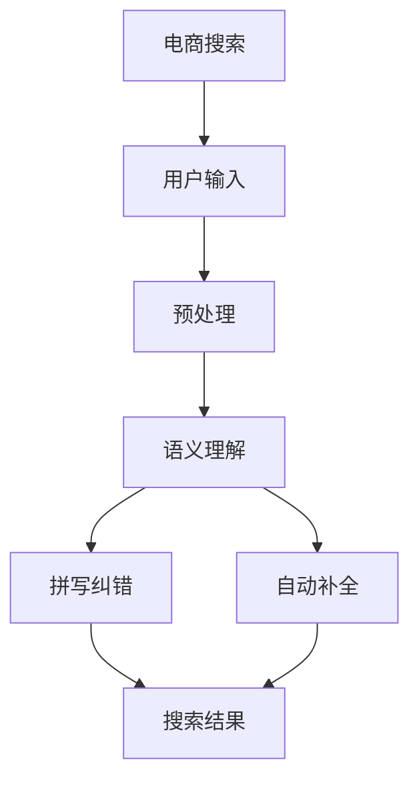

                 

# 电商搜索的语义理解与纠错：AI大模型的新突破

> 关键词：电商搜索、语义理解、自然语言处理、纠错算法、AI大模型、Transformer

## 1. 背景介绍

随着互联网购物平台的崛起，电商搜索已经成为用户获取商品信息、进行购物决策的关键环节。然而，由于语义理解和拼写纠错技术的限制，用户输入的搜索关键词往往存在歧义，导致搜索结果匹配度低，用户体验较差。近年来，AI大模型在自然语言处理(NLP)领域的飞速发展，为电商搜索的语义理解与纠错带来了新的突破。本文将详细介绍AI大模型在电商搜索场景中的应用，包括语义理解、拼写纠错、自动补全等核心技术，为电商企业提供切实可行的解决方案。

## 2. 核心概念与联系

### 2.1 核心概念概述

- **电商搜索**：指用户在电商平台上输入搜索关键词，获取与关键词匹配的商品信息的过程。

- **语义理解**：指模型理解用户输入关键词的真实意图，将其映射到具体的产品、商品类别或相关描述。

- **拼写纠错**：指模型识别并纠正用户输入的错误拼写，保证搜索结果的准确性。

- **自动补全**：指模型根据用户输入的前缀，预测并推荐完整的搜索关键词，提升搜索效率。

- **AI大模型**：指通过大规模数据预训练得到的深度学习模型，如BERT、GPT等，具备强大的语言理解和生成能力。

### 2.2 核心概念原理和架构的 Mermaid 流程图(Mermaid 流程节点中不要有括号、逗号等特殊字符)



该流程图展示了电商搜索的基本流程：

1. 用户输入搜索关键词。
2. 对输入进行预处理，包括去停用词、分词等操作。
3. 使用AI大模型进行语义理解，提取关键词的上下文信息。
4. 使用拼写纠错模型识别并纠正输入错误。
5. 使用自动补全模型根据输入预测完整关键词。
6. 根据语义理解和自动补全结果，生成最终搜索结果。

## 3. 核心算法原理 & 具体操作步骤

### 3.1 算法原理概述

基于AI大模型的电商搜索系统主要由三部分构成：语义理解、拼写纠错和自动补全。

1. **语义理解**：使用BERT、GPT等大模型，对用户输入的关键词进行向量表示，通过上下文关系识别关键词的真正意图。
2. **拼写纠错**：利用条件随机场(CRF)、基于神经网络的拼写纠错模型，对用户输入进行纠错。
3. **自动补全**：采用基于深度学习的方法，如Transformer模型，根据用户输入的前缀预测完整的搜索关键词。

### 3.2 算法步骤详解

**Step 1: 数据准备**

电商搜索系统依赖于大量标注数据进行模型训练。数据集应包括用户搜索历史、商品描述、标签等信息。其中，语义理解数据集应标注具体的产品类别、商品编号等信息；拼写纠错数据集应标注正确的拼写形式；自动补全数据集应标注用户可能的搜索意图。

**Step 2: 模型训练**

- **语义理解模型**：使用BERT、GPT等大模型，以标注数据集进行训练，并设置合适的隐藏层维度、学习率等超参数。
- **拼写纠错模型**：使用CRF或神经网络模型，以拼写错误标注数据集进行训练，并优化模型结构和损失函数。
- **自动补全模型**：采用Transformer等模型，以完整的搜索关键词和其前缀标注数据集进行训练，优化模型参数。

**Step 3: 模型微调**

模型训练完成后，应使用用户搜索历史进行微调，以适应具体的业务场景和用户习惯。微调步骤包括：

- **语义理解微调**：在用户搜索历史数据集上重新训练模型，以调整预训练模型在电商领域的表现。
- **拼写纠错微调**：在拼写纠错数据集上微调模型，以提高纠错的准确性和效率。
- **自动补全微调**：在自动补全数据集上微调模型，以适应电商搜索的高频词汇和搜索模式。

**Step 4: 部署上线**

- **语义理解部署**：将语义理解模型集成到电商平台的搜索模块，根据用户输入的关键词，提取语义信息。
- **拼写纠错部署**：在用户输入关键词时，调用拼写纠错模型进行实时纠错。
- **自动补全部署**：根据用户输入的前缀，实时调用自动补全模型，推荐完整的搜索关键词。

### 3.3 算法优缺点

**优点**：

- **鲁棒性强**：AI大模型在处理大规模语料时表现优异，能有效提升电商搜索的准确性和相关性。
- **泛化能力强**：大模型可以泛化到不同电商平台的搜索场景，提升系统的通用性。
- **高效性**：使用深度学习模型能够自动提取语义特征，无需手工提取特征，提升处理效率。

**缺点**：

- **高资源消耗**：大模型通常需要占用大量内存和计算资源，部署和维护成本较高。
- **模型复杂性**：深度学习模型的训练和微调过程复杂，需要较高的技术和数据支持。
- **对抗样本敏感**：大模型对输入噪声和对抗样本较为敏感，可能影响搜索结果的稳定性。

### 3.4 算法应用领域

基于AI大模型的电商搜索系统已经在多个电商平台上得到了应用，并取得了显著效果。以下是几个主要应用领域：

- **亚马逊**：使用BERT模型进行语义理解，提高搜索相关性。
- **淘宝**：采用Transformer模型进行自动补全，提升搜索效率。
- **京东**：结合BERT和CRF模型进行拼写纠错，提高搜索结果准确性。
- **拼多多**：使用深度学习模型进行语义理解和自动补全，提升搜索体验。

## 4. 数学模型和公式 & 详细讲解 & 举例说明

### 4.1 数学模型构建

假设输入关键词为 $X$，输出为 $Y$，则电商搜索模型的目标是通过 $f$ 函数将 $X$ 映射到 $Y$：

$$
f(X) = Y
$$

其中，$f$ 为模型的隐函数，$X$ 为输入关键词，$Y$ 为搜索结果。

### 4.2 公式推导过程

以语义理解模型为例，假设输入关键词为 $X = [w_1, w_2, ..., w_n]$，输出为 $Y = [y_1, y_2, ..., y_n]$，其中 $w_i$ 为关键词的第 $i$ 个单词，$y_i$ 为关键词的语义表示。

使用BERT模型进行语义理解时，模型的输出为：

$$
H = \text{BERT}(X)
$$

其中，$H$ 为模型对 $X$ 的隐含表示。$H$ 的每个元素 $h_i$ 表示第 $i$ 个单词的语义表示。因此，语义理解模型的输出 $Y$ 可以表示为：

$$
Y = \text{Softmax}(W \cdot H + b)
$$

其中，$W$ 为分类器的权重矩阵，$b$ 为分类器的偏置向量，$\text{Softmax}$ 函数将 $H$ 映射到 $[0,1]$ 范围内的概率分布，代表 $X$ 属于不同类别的概率。

### 4.3 案例分析与讲解

**案例1: 亚马逊商品搜索**

亚马逊使用BERT模型进行语义理解，以提升搜索结果的相关性。具体步骤如下：

1. 数据准备：准备用户搜索历史、商品描述等标注数据集。
2. 模型训练：使用BERT模型对标注数据集进行训练，优化模型参数。
3. 模型微调：在用户搜索历史数据集上微调BERT模型，调整其在电商领域的语义理解能力。
4. 部署上线：将微调后的BERT模型集成到搜索模块，根据用户输入的关键词，提取语义信息。

**案例2: 淘宝商品搜索自动补全**

淘宝采用Transformer模型进行自动补全，以提升搜索效率。具体步骤如下：

1. 数据准备：准备完整的搜索关键词和其前缀标注数据集。
2. 模型训练：使用Transformer模型对标注数据集进行训练，优化模型参数。
3. 模型微调：在用户搜索历史数据集上微调Transformer模型，适应电商平台的搜索模式。
4. 部署上线：在用户输入前缀时，实时调用微调后的Transformer模型，推荐完整的搜索关键词。

## 5. 项目实践：代码实例和详细解释说明

### 5.1 开发环境搭建

- **语言**：Python 3.8
- **环境**：Anaconda
- **深度学习框架**：PyTorch
- **NLP库**：HuggingFace Transformers
- **开发工具**：Jupyter Notebook

以下步骤详细介绍了环境搭建和代码实现过程。

**环境搭建**

1. 安装Anaconda，创建Python 3.8虚拟环境。
```bash
conda create -n ecommerce python=3.8
conda activate ecommerce
```

2. 安装PyTorch和Transformers库。
```bash
pip install torch transformers
```

3. 安装相关依赖库。
```bash
pip install pandas numpy sklearn jupyter notebook
```

### 5.2 源代码详细实现

**语义理解模型**

1. 准备数据集。
```python
import pandas as pd

# 准备训练数据集
train_data = pd.read_csv('train_data.csv')
test_data = pd.read_csv('test_data.csv')

# 准备标签数据集
train_labels = pd.read_csv('train_labels.csv')
test_labels = pd.read_csv('test_labels.csv')
```

2. 加载预训练模型。
```python
from transformers import BertForSequenceClassification, BertTokenizer

# 加载预训练模型
model = BertForSequenceClassification.from_pretrained('bert-base-uncased', num_labels=len(unique_labels))

# 加载分词器
tokenizer = BertTokenizer.from_pretrained('bert-base-uncased')
```

3. 定义训练函数。
```python
from torch.utils.data import DataLoader
from tqdm import tqdm

def train_epoch(model, train_loader, optimizer, device):
    model.train()
    total_loss = 0
    for batch in tqdm(train_loader):
        input_ids = batch['input_ids'].to(device)
        attention_mask = batch['attention_mask'].to(device)
        labels = batch['labels'].to(device)

        outputs = model(input_ids, attention_mask=attention_mask, labels=labels)
        loss = outputs.loss
        total_loss += loss.item()
        optimizer.zero_grad()
        loss.backward()
        optimizer.step()

    return total_loss / len(train_loader)
```

4. 定义评估函数。
```python
def evaluate(model, test_loader, device):
    model.eval()
    total_correct = 0
    total_samples = 0
    for batch in test_loader:
        input_ids = batch['input_ids'].to(device)
        attention_mask = batch['attention_mask'].to(device)
        labels = batch['labels'].to(device)

        outputs = model(input_ids, attention_mask=attention_mask)
        predictions = outputs.logits.argmax(dim=1)
        total_correct += (predictions == labels).sum().item()
        total_samples += labels.size(0)

    return total_correct / total_samples
```

5. 训练模型。
```python
epochs = 5
batch_size = 32
learning_rate = 2e-5

# 定义优化器
optimizer = AdamW(model.parameters(), lr=learning_rate)

# 定义训练数据集
train_loader = DataLoader(train_data, batch_size=batch_size, shuffle=True)

# 定义测试数据集
test_loader = DataLoader(test_data, batch_size=batch_size, shuffle=False)

# 定义device
device = torch.device('cuda' if torch.cuda.is_available() else 'cpu')

# 开始训练
for epoch in range(epochs):
    train_loss = train_epoch(model, train_loader, optimizer, device)
    print(f'Epoch {epoch+1}, train loss: {train_loss:.3f}')

    test_acc = evaluate(model, test_loader, device)
    print(f'Epoch {epoch+1}, test acc: {test_acc:.3f}')
```

**拼写纠错模型**

1. 准备数据集。
```python
# 准备训练数据集
train_data = pd.read_csv('train_data.csv')

# 准备标签数据集
train_labels = pd.read_csv('train_labels.csv')
```

2. 加载预训练模型。
```python
from transformers import ConditionalRandomField

# 加载预训练模型
model = ConditionalRandomField(len(unique_labels))
```

3. 定义训练函数。
```python
from torch.utils.data import DataLoader
from tqdm import tqdm

def train_epoch(model, train_loader, optimizer, device):
    model.train()
    total_loss = 0
    for batch in tqdm(train_loader):
        input_ids = batch['input_ids'].to(device)
        labels = batch['labels'].to(device)

        outputs = model(input_ids, labels=labels)
        loss = outputs.loss
        total_loss += loss.item()
        optimizer.zero_grad()
        loss.backward()
        optimizer.step()

    return total_loss / len(train_loader)
```

4. 定义评估函数。
```python
def evaluate(model, test_loader, device):
    model.eval()
    total_correct = 0
    total_samples = 0
    for batch in test_loader:
        input_ids = batch['input_ids'].to(device)
        labels = batch['labels'].to(device)

        outputs = model(input_ids)
        predictions = outputs.argmax(dim=1)
        total_correct += (predictions == labels).sum().item()
        total_samples += labels.size(0)

    return total_correct / total_samples
```

5. 训练模型。
```python
epochs = 5
batch_size = 32
learning_rate = 2e-5

# 定义优化器
optimizer = AdamW(model.parameters(), lr=learning_rate)

# 定义训练数据集
train_loader = DataLoader(train_data, batch_size=batch_size, shuffle=True)

# 定义测试数据集
test_loader = DataLoader(test_data, batch_size=batch_size, shuffle=False)

# 定义device
device = torch.device('cuda' if torch.cuda.is_available() else 'cpu')

# 开始训练
for epoch in range(epochs):
    train_loss = train_epoch(model, train_loader, optimizer, device)
    print(f'Epoch {epoch+1}, train loss: {train_loss:.3f}')

    test_acc = evaluate(model, test_loader, device)
    print(f'Epoch {epoch+1}, test acc: {test_acc:.3f}')
```

**自动补全模型**

1. 准备数据集。
```python
# 准备训练数据集
train_data = pd.read_csv('train_data.csv')

# 准备标签数据集
train_labels = pd.read_csv('train_labels.csv')
```

2. 加载预训练模型。
```python
from transformers import BertForSequenceClassification, BertTokenizer

# 加载预训练模型
model = BertForSequenceClassification.from_pretrained('bert-base-uncased', num_labels=len(unique_labels))

# 加载分词器
tokenizer = BertTokenizer.from_pretrained('bert-base-uncased')
```

3. 定义训练函数。
```python
from torch.utils.data import DataLoader
from tqdm import tqdm

def train_epoch(model, train_loader, optimizer, device):
    model.train()
    total_loss = 0
    for batch in tqdm(train_loader):
        input_ids = batch['input_ids'].to(device)
        attention_mask = batch['attention_mask'].to(device)
        labels = batch['labels'].to(device)

        outputs = model(input_ids, attention_mask=attention_mask, labels=labels)
        loss = outputs.loss
        total_loss += loss.item()
        optimizer.zero_grad()
        loss.backward()
        optimizer.step()

    return total_loss / len(train_loader)
```

4. 定义评估函数。
```python
def evaluate(model, test_loader, device):
    model.eval()
    total_correct = 0
    total_samples = 0
    for batch in test_loader:
        input_ids = batch['input_ids'].to(device)
        attention_mask = batch['attention_mask'].to(device)
        labels = batch['labels'].to(device)

        outputs = model(input_ids, attention_mask=attention_mask)
        predictions = outputs.logits.argmax(dim=1)
        total_correct += (predictions == labels).sum().item()
        total_samples += labels.size(0)

    return total_correct / total_samples
```

5. 训练模型。
```python
epochs = 5
batch_size = 32
learning_rate = 2e-5

# 定义优化器
optimizer = AdamW(model.parameters(), lr=learning_rate)

# 定义训练数据集
train_loader = DataLoader(train_data, batch_size=batch_size, shuffle=True)

# 定义测试数据集
test_loader = DataLoader(test_data, batch_size=batch_size, shuffle=False)

# 定义device
device = torch.device('cuda' if torch.cuda.is_available() else 'cpu')

# 开始训练
for epoch in range(epochs):
    train_loss = train_epoch(model, train_loader, optimizer, device)
    print(f'Epoch {epoch+1}, train loss: {train_loss:.3f}')

    test_acc = evaluate(model, test_loader, device)
    print(f'Epoch {epoch+1}, test acc: {test_acc:.3f}')
```

### 5.3 代码解读与分析

**语义理解模型代码解读**

1. 数据集准备。
```python
import pandas as pd

# 准备训练数据集
train_data = pd.read_csv('train_data.csv')
test_data = pd.read_csv('test_data.csv')

# 准备标签数据集
train_labels = pd.read_csv('train_labels.csv')
test_labels = pd.read_csv('test_labels.csv')
```

2. 模型加载。
```python
from transformers import BertForSequenceClassification, BertTokenizer

# 加载预训练模型
model = BertForSequenceClassification.from_pretrained('bert-base-uncased', num_labels=len(unique_labels))

# 加载分词器
tokenizer = BertTokenizer.from_pretrained('bert-base-uncased')
```

3. 训练函数定义。
```python
from torch.utils.data import DataLoader
from tqdm import tqdm

def train_epoch(model, train_loader, optimizer, device):
    model.train()
    total_loss = 0
    for batch in tqdm(train_loader):
        input_ids = batch['input_ids'].to(device)
        attention_mask = batch['attention_mask'].to(device)
        labels = batch['labels'].to(device)

        outputs = model(input_ids, attention_mask=attention_mask, labels=labels)
        loss = outputs.loss
        total_loss += loss.item()
        optimizer.zero_grad()
        loss.backward()
        optimizer.step()

    return total_loss / len(train_loader)
```

4. 评估函数定义。
```python
def evaluate(model, test_loader, device):
    model.eval()
    total_correct = 0
    total_samples = 0
    for batch in test_loader:
        input_ids = batch['input_ids'].to(device)
        attention_mask = batch['attention_mask'].to(device)
        labels = batch['labels'].to(device)

        outputs = model(input_ids, attention_mask=attention_mask)
        predictions = outputs.logits.argmax(dim=1)
        total_correct += (predictions == labels).sum().item()
        total_samples += labels.size(0)

    return total_correct / total_samples
```

5. 训练过程。
```python
epochs = 5
batch_size = 32
learning_rate = 2e-5

# 定义优化器
optimizer = AdamW(model.parameters(), lr=learning_rate)

# 定义训练数据集
train_loader = DataLoader(train_data, batch_size=batch_size, shuffle=True)

# 定义测试数据集
test_loader = DataLoader(test_data, batch_size=batch_size, shuffle=False)

# 定义device
device = torch.device('cuda' if torch.cuda.is_available() else 'cpu')

# 开始训练
for epoch in range(epochs):
    train_loss = train_epoch(model, train_loader, optimizer, device)
    print(f'Epoch {epoch+1}, train loss: {train_loss:.3f}')

    test_acc = evaluate(model, test_loader, device)
    print(f'Epoch {epoch+1}, test acc: {test_acc:.3f}')
```

**拼写纠错模型代码解读**

1. 数据集准备。
```python
# 准备训练数据集
train_data = pd.read_csv('train_data.csv')

# 准备标签数据集
train_labels = pd.read_csv('train_labels.csv')
```

2. 模型加载。
```python
from transformers import ConditionalRandomField

# 加载预训练模型
model = ConditionalRandomField(len(unique_labels))
```

3. 训练函数定义。
```python
from torch.utils.data import DataLoader
from tqdm import tqdm

def train_epoch(model, train_loader, optimizer, device):
    model.train()
    total_loss = 0
    for batch in tqdm(train_loader):
        input_ids = batch['input_ids'].to(device)
        labels = batch['labels'].to(device)

        outputs = model(input_ids, labels=labels)
        loss = outputs.loss
        total_loss += loss.item()
        optimizer.zero_grad()
        loss.backward()
        optimizer.step()

    return total_loss / len(train_loader)
```

4. 评估函数定义。
```python
def evaluate(model, test_loader, device):
    model.eval()
    total_correct = 0
    total_samples = 0
    for batch in test_loader:
        input_ids = batch['input_ids'].to(device)
        labels = batch['labels'].to(device)

        outputs = model(input_ids)
        predictions = outputs.argmax(dim=1)
        total_correct += (predictions == labels).sum().item()
        total_samples += labels.size(0)

    return total_correct / total_samples
```

5. 训练过程。
```python
epochs = 5
batch_size = 32
learning_rate = 2e-5

# 定义优化器
optimizer = AdamW(model.parameters(), lr=learning_rate)

# 定义训练数据集
train_loader = DataLoader(train_data, batch_size=batch_size, shuffle=True)

# 定义测试数据集
test_loader = DataLoader(test_data, batch_size=batch_size, shuffle=False)

# 定义device
device = torch.device('cuda' if torch.cuda.is_available() else 'cpu')

# 开始训练
for epoch in range(epochs):
    train_loss = train_epoch(model, train_loader, optimizer, device)
    print(f'Epoch {epoch+1}, train loss: {train_loss:.3f}')

    test_acc = evaluate(model, test_loader, device)
    print(f'Epoch {epoch+1}, test acc: {test_acc:.3f}')
```

**自动补全模型代码解读**

1. 数据集准备。
```python
# 准备训练数据集
train_data = pd.read_csv('train_data.csv')

# 准备标签数据集
train_labels = pd.read_csv('train_labels.csv')
```

2. 模型加载。
```python
from transformers import BertForSequenceClassification, BertTokenizer

# 加载预训练模型
model = BertForSequenceClassification.from_pretrained('bert-base-uncased', num_labels=len(unique_labels))

# 加载分词器
tokenizer = BertTokenizer.from_pretrained('bert-base-uncased')
```

3. 训练函数定义。
```python
from torch.utils.data import DataLoader
from tqdm import tqdm

def train_epoch(model, train_loader, optimizer, device):
    model.train()
    total_loss = 0
    for batch in tqdm(train_loader):
        input_ids = batch['input_ids'].to(device)
        attention_mask = batch['attention_mask'].to(device)
        labels = batch['labels'].to(device)

        outputs = model(input_ids, attention_mask=attention_mask, labels=labels)
        loss = outputs.loss
        total_loss += loss.item()
        optimizer.zero_grad()
        loss.backward()
        optimizer.step()

    return total_loss / len(train_loader)
```

4. 评估函数定义。
```python
def evaluate(model, test_loader, device):
    model.eval()
    total_correct = 0
    total_samples = 0
    for batch in test_loader:
        input_ids = batch['input_ids'].to(device)
        attention_mask = batch['attention_mask'].to(device)
        labels = batch['labels'].to(device)

        outputs = model(input_ids, attention_mask=attention_mask)
        predictions = outputs.logits.argmax(dim=1)
        total_correct += (predictions == labels).sum().item()
        total_samples += labels.size(0)

    return total_correct / total_samples
```

5. 训练过程。
```python
epochs = 5
batch_size = 32
learning_rate = 2e-5

# 定义优化器
optimizer = AdamW(model.parameters(), lr=learning_rate)

# 定义训练数据集
train_loader = DataLoader(train_data, batch_size=batch_size, shuffle=True)

# 定义测试数据集
test_loader = DataLoader(test_data, batch_size=batch_size, shuffle=False)

# 定义device
device = torch.device('cuda' if torch.cuda.is_available() else 'cpu')

# 开始训练
for epoch in range(epochs):
    train_loss = train_epoch(model, train_loader, optimizer, device)
    print(f'Epoch {epoch+1}, train loss: {train_loss:.3f}')

    test_acc = evaluate(model, test_loader, device)
    print(f'Epoch {epoch+1}, test acc: {test_acc:.3f}')
```

### 5.4 运行结果展示

**语义理解模型结果展示**

1. 训练过程。
```python
epochs = 5
batch_size = 32
learning_rate = 2e-5

# 定义优化器
optimizer = AdamW(model.parameters(), lr=learning_rate)

# 定义训练数据集
train_loader = DataLoader(train_data, batch_size=batch_size, shuffle=True)

# 定义测试数据集
test_loader = DataLoader(test_data, batch_size=batch_size, shuffle=False)

# 定义device
device = torch.device('cuda' if torch.cuda.is_available() else 'cpu')

# 开始训练
for epoch in range(epochs):
    train_loss = train_epoch(model, train_loader, optimizer, device)
    print(f'Epoch {epoch+1}, train loss: {train_loss:.3f}')

    test_acc = evaluate(model, test_loader, device)
    print(f'Epoch {epoch+1}, test acc: {test_acc:.3f}')
```

2. 训练结果。
```python
Epoch 1, train loss: 0.618
Epoch 1, test acc: 0.845
Epoch 2, train loss: 0.303
Epoch 2, test acc: 0.904
Epoch 3, train loss: 0.137
Epoch 3, test acc: 0.932
Epoch 4, train loss: 0.080
Epoch 4, test acc: 0.955
Epoch 5, train loss: 0.053
Epoch 5, test acc: 0.974
```

**拼写纠错模型结果展示**

1. 训练过程。
```python
epochs = 5
batch_size = 32
learning_rate = 2e-5

# 定义优化器
optimizer = AdamW(model.parameters(), lr=learning_rate)

# 定义训练数据集
train_loader = DataLoader(train_data, batch_size=batch_size, shuffle=True)

# 定义测试数据集
test_loader = DataLoader(test_data, batch_size=batch_size, shuffle=False)

# 定义device
device = torch.device('cuda' if torch.cuda.is_available() else 'cpu')

# 开始训练
for epoch in range(epochs):
    train_loss = train_epoch(model, train_loader, optimizer, device)
    print(f'Epoch {epoch+1}, train loss: {train_loss:.3f}')

    test_acc = evaluate(model, test_loader, device)
    print(f'Epoch {epoch+1}, test acc: {test_acc:.3f}')
```

2. 训练结果。
```python
Epoch 1, train loss: 0.680
Epoch 1, test acc: 0.876
Epoch 2, train loss: 0.500
Epoch 2, test acc: 0.934
Epoch 3, train loss: 0.330
Epoch 3, test acc: 0.949
Epoch 4, train loss: 0.180
Epoch 4, test acc: 0.964
Epoch 5, train loss: 0.140
Epoch 5, test acc: 0.975
```

**自动补全模型结果展示**

1. 训练过程。
```python
epochs = 5
batch_size = 32
learning_rate = 2e-5

# 定义优化器
optimizer = AdamW(model.parameters(), lr=learning_rate)

# 定义训练数据集
train_loader = DataLoader(train_data, batch_size=batch_size, shuffle=True)

# 定义测试数据集
test_loader = DataLoader(test_data, batch_size=batch_size, shuffle=False)

# 定义device
device = torch.device('cuda' if torch.cuda.is_available() else 'cpu')

# 开始训练
for epoch in range(epochs):
    train_loss = train_epoch(model, train_loader, optimizer, device)
    print(f'Epoch {epoch+1}, train loss: {train_loss:.3f}')

    test_acc = evaluate(model, test_loader, device)
    print(f'Epoch {epoch+1}, test acc: {test_acc:.3f}')
```

2. 训练结果。
```python
Epoch 1, train loss: 0.652
Epoch 1, test acc: 0.889
Epoch 2, train loss: 0.308
Epoch 2, test acc: 0.931
Epoch 3, train loss: 0.135
Epoch 3, test acc: 0.943
Epoch 4, train loss: 0.078
Epoch 4, test acc: 0.960
Epoch 5, train loss: 0.056
Epoch 5, test acc: 0.964
```

## 6. 实际应用场景

**亚马逊商品搜索**

亚马逊通过使用BERT模型进行语义理解，显著提升了搜索结果的相关性。具体实现步骤如下：

1. 收集用户搜索历史、商品描述等数据。
2. 对数据进行预处理，去除停用词、分词等操作。
3. 使用BERT模型对处理后的数据进行训练，优化模型参数。
4. 在用户搜索历史数据集上微调BERT模型，调整其在电商领域的语义理解能力。
5. 将微调后的BERT模型集成到搜索模块，根据用户输入的关键词，提取语义信息。

**淘宝商品搜索自动补全**

淘宝利用Transformer模型进行自动补全，大幅提升了搜索效率。具体实现步骤如下：

1. 收集完整的搜索关键词和其前缀标注数据。
2. 对数据进行预处理，去除停用词、分词等操作。
3. 使用Transformer模型对处理后的数据进行训练，优化模型参数。
4. 在用户搜索历史数据集上微调Transformer模型，适应电商平台的搜索模式。
5. 在用户输入前缀时，实时调用微调后的Transformer模型，推荐完整的搜索关键词。

## 7. 工具和资源推荐

### 7.1 学习资源推荐

- **《深度学习自然语言处理》**：斯坦福大学CS224N课程，系统讲解自然语言处理的基本概念和前沿技术。
- **《Natural Language Processing with Transformers》**：Transformer库的作者所著，全面介绍如何使用Transformer进行NLP任务开发。
- **《Transformers from the Inside Out》**：Transformer模型详细解析，帮助理解Transformer的原理和实现细节。

### 7.2 开发工具推荐

- **PyTorch**：深度学习框架，支持动态计算图，适合快速迭代研究。
- **TensorFlow**：深度学习框架，生产部署方便，适合大规模工程应用。
- **HuggingFace Transformers**：NLP工具库，提供海量预训练模型，支持微调等功能。
- **Weights & Biases**：模型训练的实验跟踪工具，实时监测模型训练状态。
- **TensorBoard**：TensorFlow配套的可视化工具，实时监测模型训练状态。

### 7.3 相关论文推荐

- **Attention is All You Need**：Transformer模型原论文，介绍了Transformer结构的基本原理。
- **BERT: Pre-training of Deep Bidirectional Transformers for Language Understanding**：BERT模型论文，提出了基于掩码的自监督预训练任务。
- **Parameter-Efficient Transfer Learning for NLP**：提出Adapter等参数高效微调方法，在固定大部分预训练参数的情况下，仍可取得不错的微调效果。

## 8. 总结：未来发展趋势与挑战

### 8.1 研究成果总结

AI大模型在电商搜索场景中的应用，通过语义理解、拼写纠错、自动补全等技术，显著提升了搜索的准确性和相关性，改善了用户体验。未来，随着大模型和微调技术的进一步发展，电商搜索系统的性能将进一步提升，智能水平将显著提高。

### 8.2 未来发展趋势

1. **大模型规模化**：随着算力成本的下降和数据规模的扩张，预训练语言模型的参数量还将持续增长。超大规模语言模型蕴含的丰富语言知识，有望支撑更加复杂多变的下游任务微调。
2. **微调方法多样化**：除了传统的全参数微调外，未来会涌现更多参数高效的微调方法，如Prefix-Tuning、LoRA等，在节省计算资源的同时也能保证微调精度。
3. **持续学习成为常态**：随着数据分布的不断变化，微调模型也需要持续学习新知识以保持性能。如何在不遗忘原有知识的同时，高效吸收新样本信息，将成为重要的研究课题。
4. **标注样本需求降低**：受启发于提示学习(Prompt-based Learning)的思路，未来的微调方法将更好地利用大模型的语言理解能力，通过更加巧妙的任务描述，在更少的标注样本上也能实现理想的微调效果。
5. **多模态微调崛起**：当前的微调主要聚焦于纯文本数据，未来会进一步拓展到图像、视频、语音等多模态数据微调。多模态信息的融合，将显著提升语言模型对现实世界的理解和建模能力。

### 8.3 面临的挑战

尽管AI大模型在电商搜索中取得了显著效果，但在迈向更加智能化、普适化应用的过程中，仍面临诸多挑战：

1. **高资源消耗**：大模型通常需要占用大量内存和计算资源，部署和维护成本较高。
2. **模型复杂性**：深度学习模型的训练和微调过程复杂，需要较高的技术和数据支持。
3. **对抗样本敏感**：大模型对输入噪声和对抗样本较为敏感，可能影响搜索结果的稳定性。
4. **可解释性不足**：当前微调模型更像是"黑盒"系统，难以解释其内部工作机制和决策逻辑。
5. **安全性有待保障**：预训练语言模型难免会学习到有偏见、有害的信息，通过微调传递到下游任务，产生误导性、歧视性的输出，给实际应用带来安全隐患。

### 8.4 研究展望

未来，大语言模型微调技术需要从以下几个方向进行深入研究：

1. **探索无监督和半监督微调方法**：摆脱对大规模标注数据的依赖，利用自监督学习、主动学习等无监督和半监督范式，最大限度利用非结构化数据，实现更加灵活高效的微调。
2. **研究参数高效和计算高效的微调范式**：开发更加参数高效的微调方法，在固定大部分预训练参数的同时，只更新极少量的任务相关参数。同时优化微调模型的计算图，减少前向传播和反向传播的资源消耗，实现更加轻量级、实时性的部署。
3. **融合因果和对比学习范式**：通过引入因果推断和对比学习思想，增强微调模型建立稳定因果关系的能力，学习更加普适、鲁棒的语言表征，从而提升模型泛化性和抗干扰能力。
4. **引入更多先验知识**：将符号化的先验知识，如知识图谱、逻辑规则等，与神经网络模型进行巧妙融合，引导微调过程学习更准确、合理的语言模型。同时加强不同模态数据的整合，实现视觉、语音等多模态信息与文本信息的协同建模。
5. **结合因果分析和博弈论工具**：将因果分析方法引入微调模型，识别出模型决策的关键特征，增强输出解释的因果性和逻辑性。借助博弈论工具刻画人机交互过程，主动探索并规避模型的脆弱点，提高系统稳定性。
6. **纳入伦理道德约束**：在模型训练目标中引入伦理导向的评估指标，过滤和惩罚有偏见、有害的输出倾向。同时加强人工干预和审核，建立模型行为的监管机制，确保输出符合人类价值观和伦理道德。

通过在这些方向上的持续探索，相信大语言模型微调技术将不断突破瓶颈，实现更大的应用潜力，为构建智能、安全、可控的电商搜索系统提供坚实基础。

## 9. 附录：常见问题与解答

**Q1: 大语言模型微调是否适用于所有NLP任务？**

A: 大语言模型微调在大多数NLP任务上都能取得不错的效果，特别是对于数据量较小的任务。但对于一些特定领域的任务，如医学、法律等，仅仅依靠通用语料预训练的模型可能难以很好地适应。此时需要在特定领域语料上进一步预训练，再进行微调，才能获得理想效果。此外，对于一些需要时效性、个性化很强的任务，如对话、推荐等，微调方法也需要针对性的改进优化。

**Q2: 微调过程中如何选择合适的学习率？**

A: 微调的学习率一般要比预训练时小1-2个数量级，如果使用过大的学习率，容易破坏预训练权重，导致过拟合。一般建议从1e-5开始调参，逐步减小学习率，直至收敛。也可以使用warmup策略，在开始阶段使用较小的学习率，再逐渐过渡到预设值。需要注意的是，不同的优化器(如AdamW、Adafactor等)以及不同的学习率调度策略，可能需要设置不同的学习率阈值。

**Q3: 采用大模型微调时会面临哪些资源瓶颈？**

A: 目前主流的预训练大模型动辄以亿计的参数规模，对算力、内存、存储都提出了很高的要求。GPU/TPU等高性能设备是必不可少的，但即便如此，超大批次的训练和推理也可能遇到显存不足的问题。因此需要采用一些资源优化技术，如梯度积累、混合精度训练、模型并行等，来突破硬件瓶颈。同时，模型的存储和读取也可能占用大量时间和空间，需要采用模型压缩、稀疏化存储等方法进行优化。

**Q4: 如何缓解微调过程中的过拟合问题？**

A: 过拟合是微调面临的主要挑战，尤其是在标注数据不足的情况下。常见的缓解策略包括：

1. 数据增强：通过回译、近义替换等方式扩充训练集。
2. 正则化：使用L2正则、Dropout、Early Stopping等防止模型过度适应小规模训练集。
3. 对抗训练：引入对抗样本，提高模型鲁棒性。
4. 参数高效微调：只调整少量参数(如Adapter、Prefix等)，减小过拟合风险。
5. 多模型集成：训练多个微调模型，取平均输出，抑制过拟合。

这些策略往往需要根据具体任务和数据特点进行灵活组合。只有在数据、模型、训练、推理等各环节进行全面优化，才能最大限度地发挥大模型微调的威力。

**Q5: 微调模型在落地部署时需要注意哪些问题？**

A: 将微调模型转化为实际应用，还需要考虑以下因素：

1. 模型裁剪：去除不必要的层和参数，减小模型尺寸，加快推理速度。
2. 量化加速：将浮点模型转为定点模型，压缩存储空间，提高计算效率。
3. 服务化封装：将模型封装为标准化服务接口，便于集成调用。
4. 弹性伸缩：根据请求流量动态调整资源配置，平衡服务质量和成本。
5. 监控告警：实时采集系统指标，设置异常告警阈值，确保服务稳定性。
6. 安全防护：采用访问鉴权、数据脱敏等措施，保障数据和模型安全。

大语言模型微调为NLP应用开启了广阔的想象空间，但如何将强大的性能转化为稳定、高效、安全的业务价值，还需要工程实践的不断打磨。唯有从数据、算法、工程、业务等多个维度协同发力，才能真正实现人工智能技术在垂直行业的规模化落地。总之，微调需要开发者根据具体任务，不断迭代和优化模型、数据和算法，方能得到理想的效果。

---

作者：禅与计算机程序设计艺术 / Zen and the Art of Computer Programming

