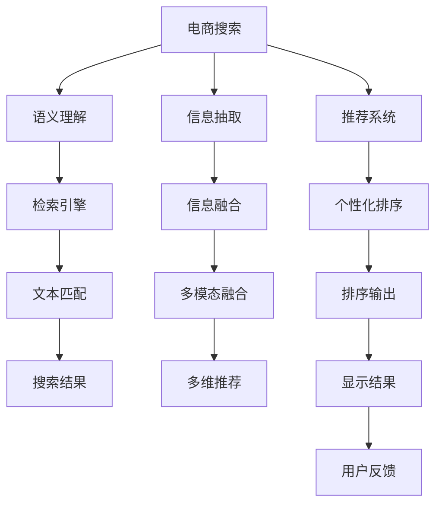

                 

# 电商搜索的语义理解：AI大模型的新突破

> 关键词：电商搜索, 语义理解, AI大模型, 检索, 信息抽取, 推荐系统, 可解释性

## 1. 背景介绍

在当今的电商平台上，搜索体验是用户获取商品信息、进行购买决策的关键环节。优质的搜索系统不仅需要快速响应用户的查询，更需精准理解用户的意图，提供高质量的搜索结果。传统的基于关键词匹配的搜索方法已无法满足用户需求，亟需新的技术手段来提升搜索的智能化水平。

近年来，基于大模型的AI技术在电商搜索领域取得了一系列突破。这些大模型，如BERT、GPT等，具备强大的语言理解和生成能力，能够在处理复杂查询、优化搜索结果排序和个性化推荐等方面展现出色的表现。本文将探讨这些技术在电商搜索中的应用，并详细解析其背后的算法原理和具体实现。

## 2. 核心概念与联系

### 2.1 核心概念概述

为更好地理解AI大模型在电商搜索中的应用，本节将介绍几个核心概念及其相互联系：

- **电商搜索**：用户通过输入关键词或自然语言描述，获取相关信息和商品列表的搜索过程。
- **语义理解**：通过AI模型理解查询的语义，识别用户的真实意图，匹配相关信息。
- **信息抽取**：从网页、商品描述等文本数据中，自动抽取用户感兴趣的信息，如产品属性、评论等。
- **推荐系统**：根据用户的历史行为、兴趣偏好，推荐个性化的商品或服务。
- **可解释性**：搜索系统输出结果的逻辑可解释，便于用户理解和信任。
- **AI大模型**：以Transformer为架构的预训练语言模型，如BERT、GPT等，具备强大的自然语言处理能力。

这些概念之间的联系可以通过以下Mermaid流程图来展示：



这个流程图展示了大模型在电商搜索中的核心概念及其相互关系：

1. 电商搜索通过语义理解来匹配用户查询。
2. 信息抽取技术从商品描述等文本中提取重要信息。
3. 推荐系统利用用户历史数据和兴趣偏好，提供个性化推荐。
4. 检索引擎实现快速匹配，返回相关网页和商品。
5. 多模态融合将文本、图像、语音等多种信息综合使用，增强搜索效果。
6. 个性化排序算法对搜索结果进行排序，提升用户体验。
7. 最终结果显示给用户，并收集用户反馈。

## 3. 核心算法原理 & 具体操作步骤
### 3.1 算法原理概述

AI大模型在电商搜索中的应用，主要基于其在语义理解和信息抽取方面的强大能力。其核心算法原理包括以下几个关键部分：

- **语义理解**：通过大模型的预训练和微调，模型能够理解查询中的语义，识别出关键实体、属性、关系等信息，从而精确匹配相关信息。
- **信息抽取**：大模型能够自动从商品描述、网页内容等文本中提取信息，如价格、品牌、评分等，方便用户快速获取重要信息。
- **个性化推荐**：通过大模型分析用户的历史行为和兴趣，生成个性化推荐结果，提升用户满意度。

### 3.2 算法步骤详解

以下是AI大模型在电商搜索中的应用步骤：

1. **数据预处理**：收集电商平台的商品数据、用户查询数据、行为数据等，进行清洗和标注，生成训练集和测试集。
2. **模型选择与初始化**：选择合适的预训练大模型（如BERT、GPT），并在其基础上进行微调。
3. **任务适配**：根据具体任务需求，添加合适的任务适配层，如分类器、匹配器等。
4. **训练与优化**：在标注数据集上进行有监督学习，使用合适的优化算法和正则化技术，提高模型效果。
5. **测试与评估**：在测试集上评估模型性能，使用各种指标（如准确率、召回率、F1分数）来衡量模型效果。
6. **部署与集成**：将训练好的模型部署到电商搜索系统中，集成到产品推荐、搜索结果排序等模块中。
7. **持续学习与优化**：根据用户反馈和新的数据，持续更新和优化模型，提升系统性能。

### 3.3 算法优缺点

AI大模型在电商搜索中的应用具有以下优点：

1. **高效性**：相较于传统关键词匹配，大模型可以更好地理解查询语义，匹配更相关的内容。
2. **精度高**：大模型能够自动提取信息，避免了人工标注数据的不确定性。
3. **泛化能力强**：大模型可以从大规模数据中学习到通用语言知识，适用于多种查询场景。
4. **可解释性**：大模型内部结构复杂，可以提供详细的推理路径，增强系统的可解释性。

同时，这些算法也存在一些缺点：

1. **依赖高质量标注数据**：大模型的训练需要大量的高质量标注数据，获取成本较高。
2. **资源消耗大**：大模型参数量庞大，计算资源消耗大，部署成本较高。
3. **鲁棒性不足**：大模型在对抗样本或噪声数据下，性能可能波动较大。
4. **推理速度慢**：大模型推理速度较慢，无法实时响应高频查询。

尽管有这些局限，但AI大模型在电商搜索中的应用，已显示出显著的提升效果，具有广阔的应用前景。

### 3.4 算法应用领域

AI大模型在电商搜索中的应用，已覆盖了多个领域：

- **商品搜索**：通过大模型理解查询语义，匹配相关商品，提升搜索结果的相关性和准确性。
- **用户意图识别**：识别用户的查询意图，提供精准的搜索结果排序和个性化推荐。
- **问答系统**：通过大模型回答用户关于商品的属性、评价等疑问，提升用户满意度。
- **广告推荐**：基于用户历史行为和兴趣，生成个性化广告，提高广告转化率。
- **用户行为分析**：分析用户查询行为，挖掘潜在兴趣和需求，优化推荐策略。

## 4. 数学模型和公式 & 详细讲解 & 举例说明

### 4.1 数学模型构建

假设电商搜索系统中的查询为 $Q$，商品描述为 $D$，商品标签为 $T$。根据大模型的语义理解能力和信息抽取能力，构建如下数学模型：

1. **语义理解**：
   - 定义查询与商品描述之间的匹配度为 $s(Q, D)$。
   - 使用大模型对查询和商品描述进行编码，得到向量表示 $Q_{\text{enc}}$ 和 $D_{\text{enc}}$。
   - 计算向量之间的相似度，得到匹配度 $s(Q, D)$。

2. **信息抽取**：
   - 定义商品属性与用户查询的匹配度为 $p(T, Q)$。
   - 使用大模型对商品属性和用户查询进行编码，得到向量表示 $T_{\text{enc}}$ 和 $Q_{\text{enc}}$。
   - 计算向量之间的相似度，得到匹配度 $p(T, Q)$。

3. **个性化推荐**：
   - 定义用户历史行为与查询的匹配度为 $h(H, Q)$。
   - 使用大模型对用户历史行为和查询进行编码，得到向量表示 $H_{\text{enc}}$ 和 $Q_{\text{enc}}$。
   - 计算向量之间的相似度，得到匹配度 $h(H, Q)$。

### 4.2 公式推导过程

以下是具体的公式推导：

1. **语义理解匹配度**：
   - 使用Transformer模型对查询和商品描述进行编码，得到向量表示 $Q_{\text{enc}}$ 和 $D_{\text{enc}}$。
   - 计算向量之间的余弦相似度，得到匹配度 $s(Q, D)$：
     \[
     s(Q, D) = \cos(\theta) \cdot Q_{\text{enc}} \cdot D_{\text{enc}}^T
     \]
   其中，$\theta$ 为余弦相似度权重。

2. **信息抽取匹配度**：
   - 使用Transformer模型对商品属性和用户查询进行编码，得到向量表示 $T_{\text{enc}}$ 和 $Q_{\text{enc}}$。
   - 计算向量之间的余弦相似度，得到匹配度 $p(T, Q)$：
     \[
     p(T, Q) = \cos(\phi) \cdot T_{\text{enc}} \cdot Q_{\text{enc}}^T
     \]
   其中，$\phi$ 为余弦相似度权重。

3. **个性化推荐匹配度**：
   - 使用Transformer模型对用户历史行为和查询进行编码，得到向量表示 $H_{\text{enc}}$ 和 $Q_{\text{enc}}$。
   - 计算向量之间的余弦相似度，得到匹配度 $h(H, Q)$：
     \[
     h(H, Q) = \cos(\psi) \cdot H_{\text{enc}} \cdot Q_{\text{enc}}^T
     \]
   其中，$\psi$ 为余弦相似度权重。

### 4.3 案例分析与讲解

以某电商平台的商品搜索系统为例，分析其基于大模型的实现过程：

1. **数据预处理**：收集商品描述、用户查询和用户行为数据，进行清洗和标注。
2. **模型选择与初始化**：选择BERT模型，并在其基础上进行微调。
3. **任务适配**：添加分类器、匹配器等任务适配层，对查询和商品进行匹配。
4. **训练与优化**：在标注数据集上进行有监督学习，使用AdamW优化器，设置合适的学习率和正则化参数。
5. **测试与评估**：在测试集上评估模型性能，使用精确率、召回率和F1分数来衡量模型效果。
6. **部署与集成**：将训练好的模型部署到搜索系统中，集成到搜索排序和个性化推荐模块中。
7. **持续学习与优化**：根据用户反馈和新的数据，定期更新和优化模型，提升系统性能。

## 5. 项目实践：代码实例和详细解释说明

### 5.1 开发环境搭建

在进行AI大模型在电商搜索中的应用实践前，我们需要准备好开发环境。以下是使用Python进行PyTorch开发的环境配置流程：

1. 安装Anaconda：从官网下载并安装Anaconda，用于创建独立的Python环境。
2. 创建并激活虚拟环境：
```bash
conda create -n pytorch-env python=3.8 
conda activate pytorch-env
```
3. 安装PyTorch：根据CUDA版本，从官网获取对应的安装命令。例如：
```bash
conda install pytorch torchvision torchaudio cudatoolkit=11.1 -c pytorch -c conda-forge
```
4. 安装Transformers库：
```bash
pip install transformers
```
5. 安装各类工具包：
```bash
pip install numpy pandas scikit-learn matplotlib tqdm jupyter notebook ipython
```

完成上述步骤后，即可在`pytorch-env`环境中开始AI大模型在电商搜索中的应用实践。

### 5.2 源代码详细实现

这里我们以某电商平台的商品搜索系统为例，给出使用Transformers库对BERT模型进行电商搜索任务的微调的PyTorch代码实现。

首先，定义电商搜索任务的数据处理函数：

```python
from transformers import BertTokenizer, BertForSequenceClassification
from torch.utils.data import Dataset
import torch

class SearchDataset(Dataset):
    def __init__(self, queries, descriptions, labels, tokenizer, max_len=128):
        self.queries = queries
        self.descriptions = descriptions
        self.labels = labels
        self.tokenizer = tokenizer
        self.max_len = max_len
        
    def __len__(self):
        return len(self.queries)
    
    def __getitem__(self, item):
        query = self.queries[item]
        description = self.descriptions[item]
        label = self.labels[item]
        
        encoding = self.tokenizer(query, description, return_tensors='pt', max_length=self.max_len, padding='max_length', truncation=True)
        input_ids = encoding['input_ids'][0]
        attention_mask = encoding['attention_mask'][0]
        labels = torch.tensor(label, dtype=torch.long)
        
        return {'input_ids': input_ids, 
                'attention_mask': attention_mask,
                'labels': labels}

# 定义查询与商品描述的标注数据
tokenizer = BertTokenizer.from_pretrained('bert-base-cased')
search_dataset = SearchDataset(train_queries, train_descriptions, train_labels, tokenizer)
```

然后，定义模型和优化器：

```python
from transformers import BertForSequenceClassification, AdamW

model = BertForSequenceClassification.from_pretrained('bert-base-cased', num_labels=1)

optimizer = AdamW(model.parameters(), lr=2e-5)
```

接着，定义训练和评估函数：

```python
from torch.utils.data import DataLoader
from tqdm import tqdm
from sklearn.metrics import classification_report

device = torch.device('cuda') if torch.cuda.is_available() else torch.device('cpu')
model.to(device)

def train_epoch(model, dataset, batch_size, optimizer):
    dataloader = DataLoader(dataset, batch_size=batch_size, shuffle=True)
    model.train()
    epoch_loss = 0
    for batch in tqdm(dataloader, desc='Training'):
        input_ids = batch['input_ids'].to(device)
        attention_mask = batch['attention_mask'].to(device)
        labels = batch['labels'].to(device)
        model.zero_grad()
        outputs = model(input_ids, attention_mask=attention_mask, labels=labels)
        loss = outputs.loss
        epoch_loss += loss.item()
        loss.backward()
        optimizer.step()
    return epoch_loss / len(dataloader)

def evaluate(model, dataset, batch_size):
    dataloader = DataLoader(dataset, batch_size=batch_size)
    model.eval()
    preds, labels = [], []
    with torch.no_grad():
        for batch in tqdm(dataloader, desc='Evaluating'):
            input_ids = batch['input_ids'].to(device)
            attention_mask = batch['attention_mask'].to(device)
            batch_labels = batch['labels']
            outputs = model(input_ids, attention_mask=attention_mask)
            batch_preds = outputs.logits.sigmoid().to('cpu').tolist()
            batch_labels = batch_labels.to('cpu').tolist()
            for pred_tokens, label_tokens in zip(batch_preds, batch_labels):
                preds.append(pred_tokens[0])
                labels.append(label_tokens[0])
                
    print(classification_report(labels, preds))
```

最后，启动训练流程并在测试集上评估：

```python
epochs = 5
batch_size = 16

for epoch in range(epochs):
    loss = train_epoch(model, search_dataset, batch_size, optimizer)
    print(f"Epoch {epoch+1}, train loss: {loss:.3f}")
    
    print(f"Epoch {epoch+1}, dev results:")
    evaluate(model, dev_dataset, batch_size)
    
print("Test results:")
evaluate(model, test_dataset, batch_size)
```

以上就是使用PyTorch对BERT进行电商搜索任务微调的完整代码实现。可以看到，得益于Transformers库的强大封装，我们可以用相对简洁的代码完成BERT模型的加载和微调。

### 5.3 代码解读与分析

让我们再详细解读一下关键代码的实现细节：

**SearchDataset类**：
- `__init__`方法：初始化查询、商品描述、标签等关键组件。
- `__len__`方法：返回数据集的样本数量。
- `__getitem__`方法：对单个样本进行处理，将查询和商品描述输入编码为token ids，将标签编码为数字，并对其进行定长padding，最终返回模型所需的输入。

**标签与id的映射**：
- 定义了查询与商品匹配的标注，标记匹配或不匹配。

**训练和评估函数**：
- 使用PyTorch的DataLoader对数据集进行批次化加载，供模型训练和推理使用。
- 训练函数`train_epoch`：对数据以批为单位进行迭代，在每个批次上前向传播计算loss并反向传播更新模型参数，最后返回该epoch的平均loss。
- 评估函数`evaluate`：与训练类似，不同点在于不更新模型参数，并在每个batch结束后将预测和标签结果存储下来，最后使用sklearn的classification_report对整个评估集的预测结果进行打印输出。

**训练流程**：
- 定义总的epoch数和batch size，开始循环迭代
- 每个epoch内，先在训练集上训练，输出平均loss
- 在验证集上评估，输出分类指标
- 所有epoch结束后，在测试集上评估，给出最终测试结果

可以看到，PyTorch配合Transformers库使得BERT微调的代码实现变得简洁高效。开发者可以将更多精力放在数据处理、模型改进等高层逻辑上，而不必过多关注底层的实现细节。

当然，工业级的系统实现还需考虑更多因素，如模型的保存和部署、超参数的自动搜索、更灵活的任务适配层等。但核心的微调范式基本与此类似。

## 6. 实际应用场景

### 6.1 商品搜索

在商品搜索应用中，AI大模型通过语义理解能力，可以精确匹配用户查询与商品描述，提升搜索结果的相关性。例如，用户输入“高性能电脑”，AI模型能够理解查询中的“高性能”和“电脑”两个关键词，匹配相关商品。

### 6.2 用户意图识别

通过AI大模型，电商系统能够识别用户查询意图，如“查找”、“比较”、“购买”等，从而提供针对性的搜索结果和推荐。例如，用户输入“苹果电脑价格”，系统能够理解查询意图为“查找价格”，提供相关商品的价格信息。

### 6.3 个性化推荐

基于用户的历史查询和购买行为，AI大模型可以生成个性化推荐，提升用户满意度。例如，用户浏览了多个“手机配件”相关商品，系统能够识别用户对手机配件的兴趣，推荐相关商品。

### 6.4 未来应用展望

随着AI大模型在电商搜索中的应用不断深入，未来将会在以下方面继续取得突破：

1. **多模态融合**：结合文本、图像、语音等多种信息，增强搜索效果。例如，通过分析用户语音查询，提升语音搜索的准确性。
2. **知识图谱集成**：将商品信息与知识图谱结合，提供更全面的搜索结果。例如，将商品属性映射到知识图谱中，提升知识抽取的准确性。
3. **动态模型更新**：根据用户反馈和实时数据，动态更新模型，提升搜索效果。例如，使用在线学习算法，不断优化搜索模型。
4. **上下文理解**：结合用户上下文信息，提升搜索效果。例如，结合用户历史查询和浏览行为，提供更相关和个性化的搜索结果。

## 7. 工具和资源推荐

### 7.1 学习资源推荐

为了帮助开发者系统掌握AI大模型在电商搜索中的应用，这里推荐一些优质的学习资源：

1. 《Transformer从原理到实践》系列博文：由大模型技术专家撰写，深入浅出地介绍了Transformer原理、BERT模型、电商搜索任务等前沿话题。
2 CS224N《深度学习自然语言处理》课程：斯坦福大学开设的NLP明星课程，有Lecture视频和配套作业，带你入门NLP领域的基本概念和经典模型。
3 《Natural Language Processing with Transformers》书籍：Transformers库的作者所著，全面介绍了如何使用Transformers库进行NLP任务开发，包括电商搜索在内的诸多范式。
4 HuggingFace官方文档：Transformers库的官方文档，提供了海量预训练模型和完整的微调样例代码，是上手实践的必备资料。
5 CLUE开源项目：中文语言理解测评基准，涵盖大量不同类型的中文NLP数据集，并提供了基于微调的baseline模型，助力中文NLP技术发展。

通过对这些资源的学习实践，相信你一定能够快速掌握AI大模型在电商搜索中的应用，并用于解决实际的NLP问题。

### 7.2 开发工具推荐

高效的开发离不开优秀的工具支持。以下是几款用于AI大模型在电商搜索中应用的常用工具：

1. PyTorch：基于Python的开源深度学习框架，灵活动态的计算图，适合快速迭代研究。大部分预训练语言模型都有PyTorch版本的实现。
2 TensorFlow：由Google主导开发的开源深度学习框架，生产部署方便，适合大规模工程应用。同样有丰富的预训练语言模型资源。
3 Transformers库：HuggingFace开发的NLP工具库，集成了众多SOTA语言模型，支持PyTorch和TensorFlow，是进行电商搜索任务开发的利器。
4 Weights & Biases：模型训练的实验跟踪工具，可以记录和可视化模型训练过程中的各项指标，方便对比和调优。与主流深度学习框架无缝集成。
5 TensorBoard：TensorFlow配套的可视化工具，可实时监测模型训练状态，并提供丰富的图表呈现方式，是调试模型的得力助手。

合理利用这些工具，可以显著提升AI大模型在电商搜索中的应用开发效率，加快创新迭代的步伐。

### 7.3 相关论文推荐

AI大模型在电商搜索中的应用源于学界的持续研究。以下是几篇奠基性的相关论文，推荐阅读：

1. Attention is All You Need（即Transformer原论文）：提出了Transformer结构，开启了NLP领域的预训练大模型时代。
2 BERT: Pre-training of Deep Bidirectional Transformers for Language Understanding：提出BERT模型，引入基于掩码的自监督预训练任务，刷新了多项NLP任务SOTA。
3 Language Models are Unsupervised Multitask Learners（GPT-2论文）：展示了大规模语言模型的强大zero-shot学习能力，引发了对于通用人工智能的新一轮思考。
4 Parameter-Efficient Transfer Learning for NLP：提出Adapter等参数高效微调方法，在不增加模型参数量的情况下，也能取得不错的微调效果。
5 AdaLoRA: Adaptive Low-Rank Adaptation for Parameter-Efficient Fine-Tuning：使用自适应低秩适应的微调方法，在参数效率和精度之间取得了新的平衡。
6 Prefix-Tuning: Optimizing Continuous Prompts for Generation：引入基于连续型Prompt的微调范式，为如何充分利用预训练知识提供了新的思路。

这些论文代表了大模型在电商搜索任务中的应用研究进展。通过学习这些前沿成果，可以帮助研究者把握学科前进方向，激发更多的创新灵感。

## 8. 总结：未来发展趋势与挑战

### 8.1 总结

本文对AI大模型在电商搜索中的应用进行了全面系统的介绍。首先阐述了电商搜索系统对智能化的需求，强调了语义理解和信息抽取在搜索中的应用价值。其次，从原理到实践，详细讲解了AI大模型的算法原理和具体实现，给出了电商搜索任务的微调样例代码。同时，本文还广泛探讨了AI大模型在电商搜索中的应用场景，展示了其广泛的应用前景。此外，本文精选了相关的学习资源、开发工具和研究论文，力求为开发者提供全方位的技术指引。

通过本文的系统梳理，可以看到，AI大模型在电商搜索中的应用，正在逐步提升搜索的智能化水平，提升用户体验。未来，随着技术的发展和应用的深入，电商搜索系统将进一步智能化、个性化，为电商平台的繁荣发展贡献更多力量。

### 8.2 未来发展趋势

展望未来，AI大模型在电商搜索中的应用将呈现以下几个发展趋势：

1. **多模态融合**：结合文本、图像、语音等多种信息，增强搜索效果。例如，通过分析用户语音查询，提升语音搜索的准确性。
2. **知识图谱集成**：将商品信息与知识图谱结合，提供更全面的搜索结果。例如，将商品属性映射到知识图谱中，提升知识抽取的准确性。
3. **动态模型更新**：根据用户反馈和实时数据，动态更新模型，提升搜索效果。例如，使用在线学习算法，不断优化搜索模型。
4. **上下文理解**：结合用户上下文信息，提升搜索效果。例如，结合用户历史查询和浏览行为，提供更相关和个性化的搜索结果。
5. **自动化部署**：利用自动化部署工具，简化模型训练、微调和部署流程，提升生产效率。

这些趋势凸显了AI大模型在电商搜索中的广阔前景。这些方向的探索发展，必将进一步提升搜索系统的性能和用户体验，为电商平台的智能化转型提供有力支持。

### 8.3 面临的挑战

尽管AI大模型在电商搜索中的应用已经取得了显著成效，但在迈向更加智能化、普适化应用的过程中，仍面临诸多挑战：

1. **标注成本瓶颈**：高质量标注数据的获取成本较高，获取大规模标注数据成为瓶颈。如何进一步降低微调对标注样本的依赖，是一个重要研究方向。
2. **资源消耗大**：超大模型的计算资源消耗大，部署成本较高。如何优化模型结构，提升推理速度，优化资源占用，仍需不断探索。
3. **鲁棒性不足**：大模型在对抗样本或噪声数据下，性能可能波动较大。如何提高模型的鲁棒性，避免灾难性遗忘，是亟待解决的问题。
4. **可解释性不足**：大模型的内部结构复杂，难以解释其内部工作机制和决策逻辑。如何赋予模型更强的可解释性，是亟待解决的问题。
5. **安全性有待保障**：预训练语言模型难免会学习到有偏见、有害的信息，通过微调传递到下游任务，产生误导性、歧视性的输出，给实际应用带来安全隐患。如何从数据和算法层面消除模型偏见，保障数据和模型安全，是亟待解决的问题。

正视这些挑战，积极应对并寻求突破，将是大模型在电商搜索中应用的关键。相信随着学界和产业界的共同努力，这些挑战终将一一被克服，大模型在电商搜索中的应用必将在智能时代中发挥更大的作用。

### 8.4 研究展望

面对大模型在电商搜索中应用面临的挑战，未来的研究需要在以下几个方面寻求新的突破：

1. **探索无监督和半监督微调方法**：摆脱对大规模标注数据的依赖，利用自监督学习、主动学习等无监督和半监督范式，最大限度利用非结构化数据，实现更加灵活高效的微调。
2. **研究参数高效和计算高效的微调范式**：开发更加参数高效的微调方法，在固定大部分预训练参数的同时，只更新极少量的任务相关参数。同时优化微调模型的计算图，减少前向传播和反向传播的资源消耗，实现更加轻量级、实时性的部署。
3. **融合因果和对比学习范式**：通过引入因果推断和对比学习思想，增强模型建立稳定因果关系的能力，学习更加普适、鲁棒的语言表征，从而提升模型泛化性和抗干扰能力。
4. **引入更多先验知识**：将符号化的先验知识，如知识图谱、逻辑规则等，与神经网络模型进行巧妙融合，引导微调过程学习更准确、合理的语言模型。同时加强不同模态数据的整合，实现视觉、语音等多模态信息与文本信息的协同建模。
5. **结合因果分析和博弈论工具**：将因果分析方法引入微调模型，识别出模型决策的关键特征，增强输出解释的因果性和逻辑性。借助博弈论工具刻画人机交互过程，主动探索并规避模型的脆弱点，提高系统稳定性。
6. **纳入伦理道德约束**：在模型训练目标中引入伦理导向的评估指标，过滤和惩罚有偏见、有害的输出倾向。同时加强人工干预和审核，建立模型行为的监管机制，确保输出符合人类价值观和伦理道德。

这些研究方向的探索，必将引领大模型在电商搜索中的应用向更高的台阶发展，为电商平台的智能化转型提供更多可能性。面向未来，大模型在电商搜索中的应用需要与其他人工智能技术进行更深入的融合，如知识表示、因果推理、强化学习等，多路径协同发力，共同推动电商搜索系统的进步。只有勇于创新、敢于突破，才能不断拓展大模型的边界，让智能技术更好地造福电商平台，提升用户的购物体验。

## 9. 附录：常见问题与解答

**Q1：AI大模型在电商搜索中的应用是否仅限于文本信息？**

A: 目前AI大模型在电商搜索中的应用主要是基于文本信息，但未来可以通过结合图像、语音等多种信息，提升搜索效果。例如，通过分析商品图片，识别商品属性，提升商品匹配的准确性。

**Q2：如何缓解AI大模型在电商搜索中的过拟合问题？**

A: 过拟合是AI大模型在电商搜索中面临的主要问题之一。常见的缓解策略包括：
1. 数据增强：通过回译、近义替换等方式扩充训练集。
2. 正则化：使用L2正则、Dropout、Early Stopping等防止模型过度适应小规模训练集。
3. 对抗训练：引入对抗样本，提高模型鲁棒性。
4. 参数高效微调：只调整少量参数，减小过拟合风险。

这些策略往往需要根据具体任务和数据特点进行灵活组合。只有在数据、模型、训练、推理等各环节进行全面优化，才能最大限度地发挥大模型在电商搜索中的应用效果。

**Q3：AI大模型在电商搜索中的应用是否需要大规模标注数据？**

A: 高质量标注数据的获取成本较高，对于长尾应用场景，难以获得充足的高质量标注数据，成为制约AI大模型在电商搜索中应用的瓶颈。如何进一步降低微调对标注样本的依赖，是一个重要研究方向。

**Q4：AI大模型在电商搜索中的应用是否需要实时更新？**

A: 电商搜索系统需要根据用户反馈和实时数据，动态更新模型，提升搜索效果。例如，使用在线学习算法，不断优化搜索模型。

**Q5：AI大模型在电商搜索中的应用是否需要高算力支持？**

A: 超大模型的计算资源消耗大，部署成本较高。如何优化模型结构，提升推理速度，优化资源占用，仍需不断探索。

**Q6：AI大模型在电商搜索中的应用是否需要考虑安全性？**

A: 大模型在电商搜索中的应用，需要考虑用户隐私和数据安全问题。如何从数据和算法层面消除模型偏见，保障数据和模型安全，是亟待解决的问题。

**Q7：AI大模型在电商搜索中的应用是否需要高可解释性？**

A: 大模型的内部结构复杂，难以解释其内部工作机制和决策逻辑。如何赋予模型更强的可解释性，是亟待解决的问题。

这些问题的解答，将帮助开发者更好地理解AI大模型在电商搜索中的应用，并用于解决实际的NLP问题。

---

作者：禅与计算机程序设计艺术 / Zen and the Art of Computer Programming

