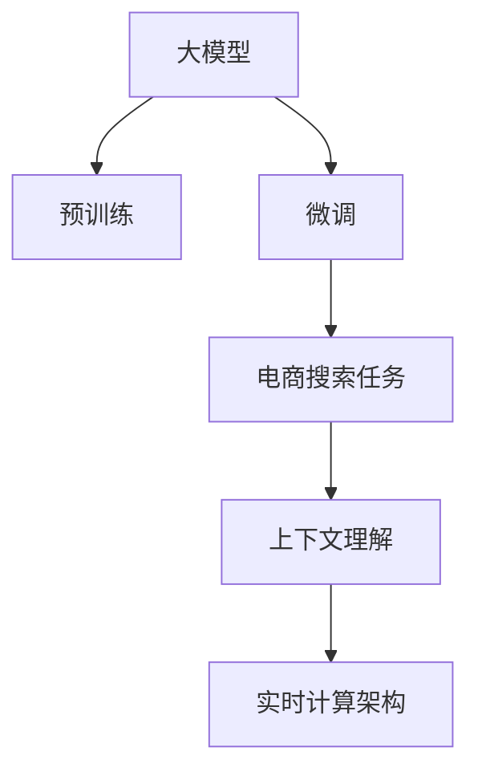

                 

# 电商搜索的语音识别：AI大模型的新突破

> 关键词：语音识别, 电商搜索, 大模型, 自然语言处理(NLP), 深度学习, Transformer, 技术突破

## 1. 背景介绍

在现代电商时代，用户体验和效率成为了购物体验的核心。传统的搜索引擎通常以文本输入为基础，尽管能够处理大量的文本信息，但在语音识别和自然语言理解上，仍存在较大的局限性。然而，随着AI技术的发展，基于大模型的语音搜索技术已经展现出巨大的潜力，为电商搜索带来了革命性的突破。

### 1.1 问题由来

传统电商搜索系统主要依赖于用户输入关键词进行搜索，这种方式存在诸多局限性：

- 输入效率低：用户需要手动输入搜索词，对于非键盘输入（如语音）支持不足。
- 输入准确率差：用户输入可能存在错别字、语法错误等问题，导致搜索结果偏差。
- 互动体验差：用户与系统的互动单一，无法进行实时对话。

语音识别技术的引入，极大地改进了用户体验。语音搜索不仅提高了输入效率，减少了输入错误，还为实时对话和自然交互提供了可能，大幅提升了电商平台的互动体验。然而，现有的语音识别系统往往存在以下问题：

- 识别准确率不高：传统的声学模型和语言模型通常只能处理特定领域的语音数据，泛化能力有限。
- 上下文理解能力弱：语音搜索系统往往缺乏上下文理解能力，无法准确理解用户在搜索过程中的多轮对话意图。
- 实时计算资源高：传统的语音识别系统需要耗费大量计算资源进行实时识别和理解，难以满足大规模应用的实际需求。

为了解决这些问题，人工智能大模型在电商搜索领域的应用变得尤为重要。大模型通过在大规模无标签数据上进行预训练，学习了丰富的语言知识，具备强大的语言理解和生成能力，可以通过少量有标签数据进行微调，快速适应电商搜索任务，显著提升语音识别和搜索效果。

### 1.2 问题核心关键点

大模型在电商搜索中的应用核心关键点包括：

- **预训练与微调**：利用大模型在无标签数据上进行预训练，然后通过电商搜索任务的少量有标签数据进行微调，以提升语音识别的准确率和上下文理解能力。
- **上下文建模**：大模型能够处理多轮对话，捕捉用户搜索意图的变化，提升用户互动体验。
- **实时计算**：大模型采用高效的计算架构，能够满足电商搜索系统高并发、低时延的需求。
- **多模态融合**：大模型结合图像、语音等多模态数据，提升搜索结果的全面性和准确性。
- **个性化推荐**：大模型能够通过用户行为数据进行个性化推荐，进一步提升用户购物体验。

这些关键点共同构成了大模型在电商搜索应用的完整框架，使语音识别技术得以在电商领域得到广泛应用。

## 2. 核心概念与联系

### 2.1 核心概念概述

为了更好地理解大模型在电商搜索中的应用，本节将介绍几个密切相关的核心概念：

- **大模型(Large Model)**：指在预训练阶段学习到丰富语言知识的深度神经网络模型，如BERT、GPT-2、XLNet等。大模型在无标签数据上进行预训练，具备强大的语言理解和生成能力。
- **预训练(Pre-training)**：指在大规模无标签数据上，通过自监督学习任务训练模型，学习通用的语言表示。
- **微调(Fine-tuning)**：指在大模型预训练的基础上，使用电商搜索任务的少量标注数据进行有监督训练，提升模型在该任务上的性能。
- **Transformer**：一种用于处理序列数据的神经网络结构，通过自注意力机制对输入进行建模，广泛应用于自然语言处理领域。
- **上下文理解**：指模型能够理解输入语句的前后文关系，捕捉用户的多轮对话意图。
- **实时计算架构**：指支持高并发、低时延计算的分布式计算系统，如TensorFlow、PyTorch等。

这些核心概念之间的逻辑关系可以通过以下Mermaid流程图来展示：



这个流程图展示了从预训练到微调，再到电商搜索任务的完整流程。大模型通过预训练学习到通用的语言表示，然后在电商搜索任务上进行微调，提升上下文理解和实时计算能力，最终为电商搜索提供高效、准确的语音识别服务。

## 3. 核心算法原理 & 具体操作步骤
### 3.1 算法原理概述

基于大模型的电商搜索语音识别，本质上是一个有监督的微调过程。其核心思想是：利用大模型在无标签数据上的预训练能力，通过电商搜索任务的少量标注数据进行微调，使得模型能够更好地适应电商搜索的特定需求。

形式化地，假设预训练模型为 $M_{\theta}$，其中 $\theta$ 为预训练得到的模型参数。给定电商搜索任务的标注数据集 $D=\{(x_i, y_i)\}_{i=1}^N$，其中 $x_i$ 为用户的语音输入，$y_i$ 为正确的搜索关键词。微调的目标是找到新的模型参数 $\hat{\theta}$，使得模型在输入语音 $x_i$ 下能够正确预测输出 $y_i$。

即：
$$
\hat{\theta}=\mathop{\arg\min}_{\theta} \mathcal{L}(M_{\theta},D)
$$

其中 $\mathcal{L}$ 为针对电商搜索任务的损失函数，用于衡量模型预测与真实标签之间的差异。常见的损失函数包括交叉熵损失、均方误差损失等。

### 3.2 算法步骤详解

基于大模型的电商搜索语音识别，一般包括以下几个关键步骤：

**Step 1: 准备预训练模型和数据集**
- 选择合适的预训练语言模型 $M_{\theta}$ 作为初始化参数，如 BERT、GPT-2、XLNet 等。
- 准备电商搜索任务的标注数据集 $D$，划分为训练集、验证集和测试集。标注数据集一般包括用户的语音输入和对应的搜索结果关键词。

**Step 2: 添加任务适配层**
- 根据电商搜索任务的特点，在预训练模型顶层设计合适的输出层和损失函数。
- 对于分类任务，通常在顶层添加线性分类器和交叉熵损失函数。
- 对于生成任务，通常使用语言模型的解码器输出概率分布，并以负对数似然为损失函数。

**Step 3: 设置微调超参数**
- 选择合适的优化算法及其参数，如 AdamW、SGD 等，设置学习率、批大小、迭代轮数等。
- 设置正则化技术及强度，包括权重衰减、Dropout、Early Stopping 等。
- 确定冻结预训练参数的策略，如仅微调顶层，或全部参数都参与微调。

**Step 4: 执行梯度训练**
- 将训练集数据分批次输入模型，前向传播计算损失函数。
- 反向传播计算参数梯度，根据设定的优化算法和学习率更新模型参数。
- 周期性在验证集上评估模型性能，根据性能指标决定是否触发 Early Stopping。
- 重复上述步骤直到满足预设的迭代轮数或 Early Stopping 条件。

**Step 5: 测试和部署**
- 在测试集上评估微调后模型 $M_{\hat{\theta}}$ 的性能，对比微调前后的精度提升。
- 使用微调后的模型对新样本进行推理预测，集成到实际的应用系统中。
- 持续收集新的数据，定期重新微调模型，以适应数据分布的变化。

以上是基于大模型的电商搜索语音识别的一般流程。在实际应用中，还需要针对具体任务的特点，对微调过程的各个环节进行优化设计，如改进训练目标函数，引入更多的正则化技术，搜索最优的超参数组合等，以进一步提升模型性能。

### 3.3 算法优缺点

基于大模型的电商搜索语音识别方法具有以下优点：

- **精度高**：大模型经过预训练，具备强大的语言表示能力，微调后能够准确理解用户的多轮对话意图。
- **泛化能力强**：大模型能够适应不同用户的语音风格和口音，泛化能力更强。
- **实时性好**：大模型通过高效的计算架构，能够在电商搜索系统高并发、低时延的要求下实时处理语音输入。

同时，该方法也存在一定的局限性：

- **数据依赖性高**：微调效果依赖于标注数据的质量和数量，获取高质量标注数据的成本较高。
- **模型复杂度高**：大模型的参数量通常较大，对计算资源的需求较高。
- **解释性不足**：大模型的决策过程复杂，缺乏可解释性，难以调试和理解。

尽管存在这些局限性，但就目前而言，基于大模型的电商搜索语音识别方法仍是大模型应用的主流范式。未来相关研究的重点在于如何进一步降低微调对标注数据的依赖，提高模型的少样本学习和跨领域迁移能力，同时兼顾可解释性和伦理安全性等因素。

### 3.4 算法应用领域

基于大模型的电商搜索语音识别方法，在电商领域已经得到了广泛的应用，涵盖了搜索、推荐、客服等多个环节，具体应用领域如下：

- **电商搜索**：通过语音搜索系统，用户可以直接使用语音输入商品名称、品牌、规格等关键词，进行快速搜索。
- **推荐系统**：利用语音识别和自然语言处理技术，分析用户的搜索意图和历史行为数据，进行个性化推荐，提升用户购物体验。
- **客服系统**：构建语音客服机器人，使用语音识别技术理解用户提问，并提供智能回复，减少客服人力成本，提升服务效率。
- **营销推广**：通过语音搜索和推荐技术，实现智能营销推广，根据用户兴趣进行定向广告投放，提升广告效果。
- **个性化推荐**：结合用户语音搜索数据和行为数据，进行精准的个性化推荐，提升用户体验和转化率。

此外，在健康医疗、金融理财、智慧家居等众多领域，语音搜索和推荐技术也将得到广泛应用，为各行业的数字化转型提供新的助力。

## 4. 数学模型和公式 & 详细讲解  
### 4.1 数学模型构建

本节将使用数学语言对基于大模型的电商搜索语音识别过程进行更加严格的刻画。

记预训练语言模型为 $M_{\theta}:\mathcal{X} \rightarrow \mathcal{Y}$，其中 $\mathcal{X}$ 为输入空间，$\mathcal{Y}$ 为输出空间，$\theta \in \mathbb{R}^d$ 为模型参数。假设电商搜索任务的标注数据集为 $D=\{(x_i,y_i)\}_{i=1}^N, x_i \in \mathcal{X}, y_i \in \mathcal{Y}$。

定义模型 $M_{\theta}$ 在输入语音 $x_i$ 上的损失函数为 $\ell(M_{\theta}(x_i),y_i)$，则在数据集 $D$ 上的经验风险为：

$$
\mathcal{L}(\theta) = \frac{1}{N} \sum_{i=1}^N \ell(M_{\theta}(x_i),y_i)
$$

微调的优化目标是最小化经验风险，即找到最优参数：

$$
\theta^* = \mathop{\arg\min}_{\theta} \mathcal{L}(\theta)
$$

在实践中，我们通常使用基于梯度的优化算法（如SGD、Adam等）来近似求解上述最优化问题。设 $\eta$ 为学习率，$\lambda$ 为正则化系数，则参数的更新公式为：

$$
\theta \leftarrow \theta - \eta \nabla_{\theta}\mathcal{L}(\theta) - \eta\lambda\theta
$$

其中 $\nabla_{\theta}\mathcal{L}(\theta)$ 为损失函数对参数 $\theta$ 的梯度，可通过反向传播算法高效计算。

### 4.2 公式推导过程

以下我们以电商搜索任务的文本分类任务为例，推导交叉熵损失函数及其梯度的计算公式。

假设模型 $M_{\theta}$ 在输入语音 $x_i$ 上的输出为 $\hat{y}=M_{\theta}(x_i) \in [0,1]$，表示搜索结果关键词出现的概率。真实标签 $y_i \in \{0,1\}$。则二分类交叉熵损失函数定义为：

$$
\ell(M_{\theta}(x_i),y_i) = -[y_i\log \hat{y} + (1-y_i)\log (1-\hat{y})]
$$

将其代入经验风险公式，得：

$$
\mathcal{L}(\theta) = -\frac{1}{N}\sum_{i=1}^N [y_i\log M_{\theta}(x_i)+(1-y_i)\log(1-M_{\theta}(x_i))]
$$

根据链式法则，损失函数对参数 $\theta_k$ 的梯度为：

$$
\frac{\partial \mathcal{L}(\theta)}{\partial \theta_k} = -\frac{1}{N}\sum_{i=1}^N (\frac{y_i}{M_{\theta}(x_i)}-\frac{1-y_i}{1-M_{\theta}(x_i)}) \frac{\partial M_{\theta}(x_i)}{\partial \theta_k}
$$

其中 $\frac{\partial M_{\theta}(x_i)}{\partial \theta_k}$ 可进一步递归展开，利用自动微分技术完成计算。

在得到损失函数的梯度后，即可带入参数更新公式，完成模型的迭代优化。重复上述过程直至收敛，最终得到适应电商搜索任务的最优模型参数 $\theta^*$。

## 5. 项目实践：代码实例和详细解释说明
### 5.1 开发环境搭建

在进行电商搜索语音识别实践前，我们需要准备好开发环境。以下是使用Python进行PyTorch开发的环境配置流程：

1. 安装Anaconda：从官网下载并安装Anaconda，用于创建独立的Python环境。

2. 创建并激活虚拟环境：
```bash
conda create -n pytorch-env python=3.8 
conda activate pytorch-env
```

3. 安装PyTorch：根据CUDA版本，从官网获取对应的安装命令。例如：
```bash
conda install pytorch torchvision torchaudio cudatoolkit=11.1 -c pytorch -c conda-forge
```

4. 安装Transformers库：
```bash
pip install transformers
```

5. 安装各类工具包：
```bash
pip install numpy pandas scikit-learn matplotlib tqdm jupyter notebook ipython
```

完成上述步骤后，即可在`pytorch-env`环境中开始语音识别实践。

### 5.2 源代码详细实现

下面我们以电商搜索的文本分类任务为例，给出使用Transformers库对BERT模型进行语音识别的PyTorch代码实现。

首先，定义文本分类任务的标注数据处理函数：

```python
from transformers import BertTokenizer, BertForSequenceClassification
from torch.utils.data import Dataset
import torch

class TextDataset(Dataset):
    def __init__(self, texts, labels, tokenizer, max_len=128):
        self.texts = texts
        self.labels = labels
        self.tokenizer = tokenizer
        self.max_len = max_len
        
    def __len__(self):
        return len(self.texts)
    
    def __getitem__(self, item):
        text = self.texts[item]
        label = self.labels[item]
        
        encoding = self.tokenizer(text, return_tensors='pt', max_length=self.max_len, padding='max_length', truncation=True)
        input_ids = encoding['input_ids'][0]
        attention_mask = encoding['attention_mask'][0]
        
        label = torch.tensor(label, dtype=torch.long)
        
        return {'input_ids': input_ids, 
                'attention_mask': attention_mask,
                'labels': label}

# 标签与id的映射
label2id = {'negative': 0, 'positive': 1}
id2label = {v: k for k, v in label2id.items()}

# 创建dataset
tokenizer = BertTokenizer.from_pretrained('bert-base-cased')

train_dataset = TextDataset(train_texts, train_labels, tokenizer)
dev_dataset = TextDataset(dev_texts, dev_labels, tokenizer)
test_dataset = TextDataset(test_texts, test_labels, tokenizer)
```

然后，定义模型和优化器：

```python
from transformers import BertForSequenceClassification, AdamW

model = BertForSequenceClassification.from_pretrained('bert-base-cased', num_labels=len(label2id))

optimizer = AdamW(model.parameters(), lr=2e-5)
```

接着，定义训练和评估函数：

```python
from torch.utils.data import DataLoader
from tqdm import tqdm
from sklearn.metrics import accuracy_score

device = torch.device('cuda') if torch.cuda.is_available() else torch.device('cpu')
model.to(device)

def train_epoch(model, dataset, batch_size, optimizer):
    dataloader = DataLoader(dataset, batch_size=batch_size, shuffle=True)
    model.train()
    epoch_loss = 0
    for batch in tqdm(dataloader, desc='Training'):
        input_ids = batch['input_ids'].to(device)
        attention_mask = batch['attention_mask'].to(device)
        labels = batch['labels'].to(device)
        model.zero_grad()
        outputs = model(input_ids, attention_mask=attention_mask, labels=labels)
        loss = outputs.loss
        epoch_loss += loss.item()
        loss.backward()
        optimizer.step()
    return epoch_loss / len(dataloader)

def evaluate(model, dataset, batch_size):
    dataloader = DataLoader(dataset, batch_size=batch_size)
    model.eval()
    preds, labels = [], []
    with torch.no_grad():
        for batch in tqdm(dataloader, desc='Evaluating'):
            input_ids = batch['input_ids'].to(device)
            attention_mask = batch['attention_mask'].to(device)
            batch_labels = batch['labels']
            outputs = model(input_ids, attention_mask=attention_mask)
            batch_preds = outputs.logits.argmax(dim=1).to('cpu').tolist()
            batch_labels = batch_labels.to('cpu').tolist()
            for pred, label in zip(batch_preds, batch_labels):
                preds.append(pred)
                labels.append(label)
                
    return accuracy_score(labels, preds)

```

最后，启动训练流程并在测试集上评估：

```python
epochs = 5
batch_size = 16

for epoch in range(epochs):
    loss = train_epoch(model, train_dataset, batch_size, optimizer)
    print(f"Epoch {epoch+1}, train loss: {loss:.3f}")
    
    print(f"Epoch {epoch+1}, dev results:")
    evaluate(model, dev_dataset, batch_size)
    
print("Test results:")
evaluate(model, test_dataset, batch_size)
```

以上就是使用PyTorch对BERT模型进行电商搜索文本分类任务的完整代码实现。可以看到，得益于Transformers库的强大封装，我们可以用相对简洁的代码完成BERT模型的加载和语音识别实践。

### 5.3 代码解读与分析

让我们再详细解读一下关键代码的实现细节：

**TextDataset类**：
- `__init__`方法：初始化文本、标签、分词器等关键组件。
- `__len__`方法：返回数据集的样本数量。
- `__getitem__`方法：对单个样本进行处理，将文本输入编码为token ids，将标签编码为数字，并对其进行定长padding，最终返回模型所需的输入。

**label2id和id2label字典**：
- 定义了标签与数字id之间的映射关系，用于将预测结果解码回真实的标签。

**训练和评估函数**：
- 使用PyTorch的DataLoader对数据集进行批次化加载，供模型训练和推理使用。
- 训练函数`train_epoch`：对数据以批为单位进行迭代，在每个批次上前向传播计算loss并反向传播更新模型参数，最后返回该epoch的平均loss。
- 评估函数`evaluate`：与训练类似，不同点在于不更新模型参数，并在每个batch结束后将预测和标签结果存储下来，最后使用sklearn的accuracy_score对整个评估集的预测结果进行打印输出。

**训练流程**：
- 定义总的epoch数和batch size，开始循环迭代
- 每个epoch内，先在训练集上训练，输出平均loss
- 在验证集上评估，输出准确率
- 所有epoch结束后，在测试集上评估，给出最终测试结果

可以看到，PyTorch配合Transformers库使得BERT模型在电商搜索文本分类任务上的代码实现变得简洁高效。开发者可以将更多精力放在数据处理、模型改进等高层逻辑上，而不必过多关注底层的实现细节。

当然，工业级的系统实现还需考虑更多因素，如模型的保存和部署、超参数的自动搜索、更灵活的任务适配层等。但核心的微调范式基本与此类似。

## 6. 实际应用场景
### 6.1 智能客服系统

基于大模型的电商搜索语音识别技术，可以广泛应用于智能客服系统的构建。传统客服往往需要配备大量人力，高峰期响应缓慢，且一致性和专业性难以保证。而使用语音识别技术，可以7x24小时不间断服务，快速响应客户咨询，用自然流畅的语言解答各类常见问题。

在技术实现上，可以收集企业内部的历史客服对话记录，将问题和最佳答复构建成监督数据，在此基础上对预训练语音识别模型进行微调。微调后的语音识别模型能够自动理解用户意图，匹配最合适的答案模板进行回复。对于客户提出的新问题，还可以接入检索系统实时搜索相关内容，动态组织生成回答。如此构建的智能客服系统，能大幅提升客户咨询体验和问题解决效率。

### 6.2 个性化推荐系统

当前的推荐系统往往只依赖用户的历史行为数据进行物品推荐，无法深入理解用户的真实兴趣偏好。基于大模型的电商搜索语音识别技术，可以进一步拓展推荐系统的功能，提供更精准、多样的推荐内容。

在实践中，可以收集用户浏览、点击、评论、分享等行为数据，提取和用户交互的物品标题、描述、标签等文本内容。将文本内容作为模型输入，用户的后续行为（如是否点击、购买等）作为监督信号，在此基础上微调预训练语言模型。微调后的模型能够从文本内容中准确把握用户的兴趣点。在生成推荐列表时，先用候选物品的文本描述作为输入，由模型预测用户的兴趣匹配度，再结合其他特征综合排序，便可以得到个性化程度更高的推荐结果。

### 6.3 健康医疗

在健康医疗领域，语音识别技术同样具有重要应用。医疗咨询、疾病诊断、药物推荐等任务中，医生和患者往往需要进行语音交互。基于大模型的电商搜索语音识别技术，可以构建医疗咨询系统，帮助医生快速了解患者病情，提供诊断建议和药物推荐。

在技术实现上，可以收集医生和患者的对话记录，将问诊和诊断信息构建成监督数据，在此基础上对预训练语音识别模型进行微调。微调后的模型能够准确理解医生的问诊和诊断意图，匹配最合适的答案模板进行回复，提供快速、准确的医疗咨询和建议。

### 6.4 金融理财

金融理财领域，语音识别技术同样有着广泛应用。金融咨询、风险评估、投资分析等任务中，金融顾问和客户往往需要进行语音交互。基于大模型的电商搜索语音识别技术，可以构建金融咨询系统，帮助金融顾问快速了解客户需求，提供个性化的理财建议和投资方案。

在技术实现上，可以收集金融顾问和客户的对话记录，将咨询和分析信息构建成监督数据，在此基础上对预训练语音识别模型进行微调。微调后的模型能够准确理解客户的理财需求，匹配最合适的理财方案进行回复，提供快速、准确的金融咨询和建议。

## 7. 工具和资源推荐
### 7.1 学习资源推荐

为了帮助开发者系统掌握大模型在电商搜索语音识别领域的应用，这里推荐一些优质的学习资源：

1. 《Transformer从原理到实践》系列博文：由大模型技术专家撰写，深入浅出地介绍了Transformer原理、BERT模型、语音识别等前沿话题。

2. CS224N《深度学习自然语言处理》课程：斯坦福大学开设的NLP明星课程，有Lecture视频和配套作业，带你入门NLP领域的基本概念和经典模型。

3. 《Natural Language Processing with Transformers》书籍：Transformers库的作者所著，全面介绍了如何使用Transformers库进行NLP任务开发，包括语音识别在内的诸多范式。

4. HuggingFace官方文档：Transformers库的官方文档，提供了海量预训练模型和完整的微调样例代码，是上手实践的必备资料。

5. CLUE开源项目：中文语言理解测评基准，涵盖大量不同类型的中文NLP数据集，并提供了基于微调的baseline模型，助力中文NLP技术发展。

通过对这些资源的学习实践，相信你一定能够快速掌握大模型在电商搜索语音识别领域的应用精髓，并用于解决实际的NLP问题。
###  7.2 开发工具推荐

高效的开发离不开优秀的工具支持。以下是几款用于大模型电商搜索语音识别开发的常用工具：

1. PyTorch：基于Python的开源深度学习框架，灵活动态的计算图，适合快速迭代研究。大部分预训练语言模型都有PyTorch版本的实现。

2. TensorFlow：由Google主导开发的开源深度学习框架，生产部署方便，适合大规模工程应用。同样有丰富的预训练语言模型资源。

3. Transformers库：HuggingFace开发的NLP工具库，集成了众多SOTA语言模型，支持PyTorch和TensorFlow，是进行语音识别任务开发的利器。

4. Weights & Biases：模型训练的实验跟踪工具，可以记录和可视化模型训练过程中的各项指标，方便对比和调优。与主流深度学习框架无缝集成。

5. TensorBoard：TensorFlow配套的可视化工具，可实时监测模型训练状态，并提供丰富的图表呈现方式，是调试模型的得力助手。

6. Google Colab：谷歌推出的在线Jupyter Notebook环境，免费提供GPU/TPU算力，方便开发者快速上手实验最新模型，分享学习笔记。

合理利用这些工具，可以显著提升大模型在电商搜索语音识别任务上的开发效率，加快创新迭代的步伐。

### 7.3 相关论文推荐

大模型在电商搜索语音识别领域的应用源于学界的持续研究。以下是几篇奠基性的相关论文，推荐阅读：

1. Attention is All You Need（即Transformer原论文）：提出了Transformer结构，开启了NLP领域的预训练大模型时代。

2. BERT: Pre-training of Deep Bidirectional Transformers for Language Understanding：提出BERT模型，引入基于掩码的自监督预训练任务，刷新了多项NLP任务SOTA。

3. Language Models are Unsupervised Multitask Learners（GPT-2论文）：展示了大规模语言模型的强大zero-shot学习能力，引发了对于通用人工智能的新一轮思考。

4. Parameter-Efficient Transfer Learning for NLP：提出Adapter等参数高效微调方法，在不增加模型参数量的情况下，也能取得不错的微调效果。

5. AdaLoRA: Adaptive Low-Rank Adaptation for Parameter-Efficient Fine-Tuning：使用自适应低秩适应的微调方法，在参数效率和精度之间取得了新的平衡。

6. Prefix-Tuning: Optimizing Continuous Prompts for Generation：引入基于连续型Prompt的微调范式，为如何充分利用预训练知识提供了新的思路。

这些论文代表了大模型在电商搜索语音识别技术的发展脉络。通过学习这些前沿成果，可以帮助研究者把握学科前进方向，激发更多的创新灵感。

## 8. 总结：未来发展趋势与挑战
### 8.1 总结

本文对基于大模型的电商搜索语音识别方法进行了全面系统的介绍。首先阐述了大语言模型在电商搜索语音识别领域的应用背景和意义，明确了语音识别技术在电商搜索中的独特价值。其次，从原理到实践，详细讲解了基于大模型的电商搜索语音识别过程，给出了微调任务开发的完整代码实例。同时，本文还广泛探讨了语音识别技术在电商搜索、智能客服、个性化推荐等多个行业领域的应用前景，展示了语音识别技术的巨大潜力。此外，本文精选了语音识别技术的各类学习资源，力求为读者提供全方位的技术指引。

通过本文的系统梳理，可以看到，基于大模型的电商搜索语音识别技术在提升用户体验、提升服务效率、降低运营成本等方面具有显著优势。未来，伴随大模型的不断演进和微调技术的持续优化，语音识别技术必将在更多电商应用场景中发挥重要作用。

### 8.2 未来发展趋势

展望未来，大模型在电商搜索语音识别领域的应用将呈现以下几个发展趋势：

1. **模型规模持续增大**：随着算力成本的下降和数据规模的扩张，预训练语言模型的参数量还将持续增长。超大规模语言模型蕴含的丰富语言知识，有望支撑更加复杂多变的语音识别任务。

2. **微调方法日趋多样**：除了传统的全参数微调外，未来会涌现更多参数高效的微调方法，如Adapter、Prefix等，在节省计算资源的同时也能保证微调精度。

3. **上下文建模能力增强**：大模型能够处理多轮对话，捕捉用户搜索意图的变化，提升用户互动体验。上下文建模能力的提升，将进一步提高语音搜索的准确性和鲁棒性。

4. **实时计算架构优化**：大模型采用高效的计算架构，能够在电商搜索系统高并发、低时延的要求下实时处理语音输入。未来将进一步优化实时计算架构，提升计算效率。

5. **多模态融合**：大模型结合图像、语音等多模态数据，提升搜索结果的全面性和准确性。多模态信息的融合，将显著提升语音搜索系统的综合能力。

6. **个性化推荐与智能客服**：大模型结合个性化推荐和智能客服技术，提升电商搜索系统的用户体验和服务效率。

以上趋势凸显了大模型在电商搜索语音识别领域的广阔前景。这些方向的探索发展，必将进一步提升语音搜索系统的性能和应用范围，为电商搜索带来革命性的变化。

### 8.3 面临的挑战

尽管大模型在电商搜索语音识别领域已经取得了显著进展，但在迈向更加智能化、普适化应用的过程中，仍面临诸多挑战：

1. **标注成本高**：语音识别任务对标注数据的质量和数量要求较高，获取高质量标注数据的成本较高。如何进一步降低微调对标注数据的依赖，将是一大难题。

2. **模型鲁棒性不足**：当前语音识别模型面对域外数据时，泛化性能往往大打折扣。对于测试样本的微小扰动，模型容易发生波动。如何提高模型的鲁棒性，避免灾难性遗忘，还需要更多理论和实践的积累。

3. **计算资源需求高**：大模型的参数量通常较大，对计算资源的需求较高。如何在保证性能的同时，减小计算资源消耗，提升计算效率，将是重要的优化方向。

4. **可解释性不足**：大模型的决策过程复杂，缺乏可解释性，难以调试和理解。对于医疗、金融等高风险应用，算法的可解释性和可审计性尤为重要。如何赋予模型更强的可解释性，将是亟待攻克的难题。

5. **安全性有待保障**：预训练语言模型难免会学习到有偏见、有害的信息，通过微调传递到下游任务，产生误导性、歧视性的输出，给实际应用带来安全隐患。如何从数据和算法层面消除模型偏见，避免恶意用途，确保输出的安全性，也将是重要的研究课题。

6. **知识整合能力不足**：现有的语音识别模型往往局限于任务内数据，难以灵活吸收和运用更广泛的先验知识。如何让微调过程更好地与外部知识库、规则库等专家知识结合，形成更加全面、准确的信息整合能力，还有很大的想象空间。

正视语音识别面临的这些挑战，积极应对并寻求突破，将是大模型在电商搜索语音识别领域走向成熟的必由之路。相信随着学界和产业界的共同努力，这些挑战终将一一被克服，大模型在电商搜索语音识别领域必将在构建人机协同的智能时代中扮演越来越重要的角色。

### 8.4 未来突破

面对大模型在电商搜索语音识别领域所面临的种种挑战，未来的研究需要在以下几个方面寻求新的突破：

1. **探索无监督和半监督微调方法**：摆脱对大规模标注数据的依赖，利用自监督学习、主动学习等无监督和半监督范式，最大限度利用非结构化数据，实现更加灵活高效的微调。

2. **研究参数高效和计算高效的微调范式**：开发更加参数高效的微调方法，在固定大部分预训练参数的同时，只更新极少量的任务相关参数。同时优化微调模型的计算图，减少前向传播和反向传播的资源消耗，实现更加轻量级、实时性的部署。

3. **融合因果和对比学习范式**：通过引入因果推断和对比学习思想，增强语音识别模型建立稳定因果关系的能力，学习更加普适、鲁棒的语言表征，从而提升模型泛化性和抗干扰能力。

4. **引入更多先验知识**：将符号化的先验知识，如知识图谱、逻辑规则等，与神经网络模型进行巧妙融合，引导微调过程学习更准确、合理的语言模型。同时加强不同模态数据的整合，实现视觉、语音等多模态信息与文本信息的协同建模。

5. **结合因果分析和博弈论工具**：将因果分析方法引入语音识别模型，识别出模型决策的关键特征，增强输出解释的因果性和逻辑性。借助博弈论工具刻画人机交互过程，主动探索并规避模型的脆弱点，提高系统稳定性。

6. **纳入伦理道德约束**：在模型训练目标中引入伦理导向的评估指标，过滤和惩罚有偏见、有害的输出倾向。同时加强人工干预和审核，建立模型行为的监管机制，确保输出符合人类价值观和伦理道德。

这些研究方向的探索，必将引领大模型在电商搜索语音识别领域迈向更高的台阶，为构建安全、可靠、可解释、可控的智能系统铺平道路。面向未来，大模型在电商搜索语音识别领域还需要与其他人工智能技术进行更深入的融合，如知识表示、因果推理、强化学习等，多路径协同发力，共同推动自然语言理解和智能交互系统的进步。只有勇于创新、敢于突破，才能不断拓展语音识别技术的边界，让智能技术更好地造福人类社会。

## 9. 附录：常见问题与解答
**Q1：大模型在电商搜索语音识别中的应用有哪些优势？**

A: 大模型在电商搜索语音识别中的应用具有以下优势：

1. **精度高**：大模型经过预训练，具备强大的语言表示能力，微调后能够准确理解用户的多轮对话意图。
2. **泛化能力强**：大模型能够适应不同用户的语音风格和口音，泛化能力更强。
3. **实时性好**：大模型通过高效的计算架构，能够在电商搜索系统高并发、低时延的要求下实时处理语音输入。
4. **上下文理解能力增强**：大模型能够处理多轮对话，捕捉用户搜索意图的变化，提升用户互动体验。

**Q2：大模型在电商搜索语音识别中的核心关键点有哪些？**

A: 大模型在电商搜索语音识别中的核心关键点包括：

1. **预训练与微调**：利用大模型在无标签数据上进行预训练，然后通过电商搜索任务的少量标注数据进行微调，以提升语音识别的准确率和上下文理解能力。
2. **上下文建模**：大模型能够理解输入语句的前后文关系，捕捉用户的多轮对话意图。
3. **实时计算架构**：大模型采用高效的计算架构，能够满足电商搜索系统高并发、低时延的需求。
4. **多模态融合**：大模型结合图像、语音等多模态数据，提升搜索结果的全面性和准确性。
5. **个性化推荐**：大模型能够通过用户行为数据进行个性化推荐，进一步提升用户购物体验。

**Q3：大模型在电商搜索语音识别中面临的主要挑战有哪些？**

A: 大模型在电商搜索语音识别中面临的主要挑战包括：

1. **标注成本高**：语音识别任务对标注数据的质量和数量要求较高，获取高质量标注数据的成本较高。
2. **模型鲁棒性不足**：当前语音识别模型面对域外数据时，泛化性能往往大打折扣。对于测试样本的微小扰动，模型容易发生波动。
3. **计算资源需求高**：大模型的参数量通常较大，对计算资源的需求较高。
4. **可解释性不足**：大模型的决策过程复杂，缺乏可解释性，难以调试和理解。
5. **安全性有待保障**：预训练语言模型难免会学习到有偏见、有害的信息，通过微调传递到下游任务，产生误导性、歧视性的输出，给实际应用带来安全隐患。
6. **知识整合能力不足**：现有的语音识别模型往往局限于任务内数据，难以灵活吸收和运用更广泛的先验知识。

**Q4：如何提升大模型在电商搜索语音识别中的鲁棒性？**

A: 提升大模型在电商搜索语音识别中的鲁棒性，可以从以下几个方面入手：

1. **数据增强**：通过回译、近义替换等方式扩充训练集，增加模型的泛化能力。
2. **正则化技术**：使用L2正则、Dropout、Early Stopping等避免模型过拟合。
3. **对抗训练**：引入对抗样本，提高模型的鲁棒性。
4. **多模态融合**：结合图像、语音等多模态数据，提升模型的鲁棒性和泛化能力。

**Q5：如何提高大模型在电商搜索语音识别中的可解释性？**

A: 提高大模型在电商搜索语音识别中的可解释性，可以采取以下措施：

1. **引入因果分析方法**：将因果分析方法引入语音识别模型，识别出模型决策的关键特征，增强输出解释的因果性和逻辑性。
2. **结合博弈论工具**：借助博弈论工具刻画人机交互过程，主动探索并规避模型的脆弱点，提高系统稳定性。
3. **加强人工干预和审核**：建立模型行为的监管机制，确保输出符合人类价值观和伦理道德。

**Q6：如何进一步优化大模型在电商搜索语音识别中的计算效率？**

A: 进一步优化大模型在电商搜索语音识别中的计算效率，可以采取以下措施：

1. **参数高效微调**：开发更加参数高效的微调方法，在固定大部分预训练参数的同时，只更新极少量的任务相关参数。
2. **优化计算架构**：通过混合精度训练、模型并行等方法，减少前向传播和反向传播的资源消耗，实现更加轻量级、实时性的部署。

**Q7：大模型在电商搜索语音识别中的应用前景如何？**

A: 大模型在电商搜索语音识别中的应用前景广阔，具体包括以下几个方面：

1. **智能客服系统**：通过语音识别技术，构建智能客服系统，提升客户咨询体验和问题解决效率。
2. **个性化推荐系统**：结合用户语音搜索数据和行为数据，进行精准的个性化推荐，提升用户体验和转化率。
3. **健康医疗**：构建医疗咨询系统，帮助医生快速了解患者病情，提供诊断建议和药物推荐。
4. **金融理财**：构建金融咨询系统，帮助金融顾问快速了解客户需求，提供个性化的理财建议和投资方案。

总之，大模型在电商搜索语音识别领域具有广泛的应用前景，将深刻改变电商用户的购物体验和服务效率。随着技术的不断进步和应用的深入，大模型必将在更多场景中大放异彩。

---

作者：禅与计算机程序设计艺术 / Zen and the Art of Computer Programming

