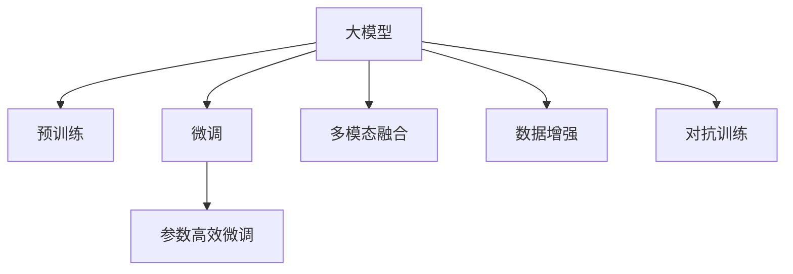

                 

# 电商数据挖掘：AI大模型的新方法

## 1. 背景介绍

### 1.1 问题由来

随着电商市场的迅速发展，电商数据挖掘已成为电商平台运营的重要组成部分。传统的电商数据挖掘方法依赖于复杂的特征工程，需要耗费大量时间和精力。同时，传统的特征工程方法也难以充分利用电商数据中的潜在信息，导致挖掘效果不理想。

近年来，随着大模型技术的发展，电商数据挖掘也逐渐引入AI大模型，成为研究热点。大模型通过对大规模电商数据进行预训练，能够学习到丰富的特征表示，无需复杂的特征工程即可直接应用于电商数据挖掘任务。

### 1.2 问题核心关键点

大模型技术在电商数据挖掘中的应用，主要体现在以下几个方面：

1. **预训练语料的选择**：电商数据通常具有丰富的文本和行为特征，因此选择适当的预训练语料尤为重要。常用的预训练语料包括电商评论、用户行为数据等。

2. **微调任务的设计**：电商数据挖掘任务种类繁多，如商品推荐、价格预测、用户画像等。需要根据具体任务设计合适的微调目标和损失函数。

3. **数据增强方法**：电商数据中存在大量噪声，如拼写错误、低质量评论等。需要通过数据增强方法，提高模型的鲁棒性和泛化能力。

4. **参数高效微调**：电商数据挖掘任务往往对模型的参数量和推理速度要求较高，因此需要采用参数高效微调方法，减少计算资源消耗。

5. **对抗训练**：电商数据挖掘任务中的对抗样本较多，通过对抗训练，可以提高模型的鲁棒性和安全性。

6. **多模态融合**：电商数据不仅包括文本信息，还包括图像、视频等模态信息。需要开发多模态融合技术，提升模型性能。

## 2. 核心概念与联系

### 2.1 核心概念概述

为更好地理解基于大模型的电商数据挖掘方法，本节将介绍几个密切相关的核心概念：

- **大模型**：指使用大规模数据预训练得到的深度学习模型，如BERT、GPT等。这些模型通常具有丰富的语义表示能力。

- **预训练**：指在大规模无标签数据上，通过自监督学习任务训练深度学习模型，学习通用的语言表示。预训练是构建大模型的基础步骤。

- **微调**：指在大模型的基础上，使用特定任务的数据进行有监督学习，优化模型在该任务上的性能。微调是大模型应用的常见方法。

- **参数高效微调**：指在微调过程中，只更新少量的模型参数，而固定大部分预训练权重不变，以提高微调效率，避免过拟合。

- **多模态融合**：指将不同模态的数据进行融合，提高模型的泛化能力。电商数据通常包含多种模态信息，如文本、图像、视频等。

- **数据增强**：指通过各种方法丰富训练集的多样性，提高模型的泛化能力。电商数据存在大量噪声和异常数据，需要有效处理。

- **对抗训练**：指在训练过程中加入对抗样本，提高模型的鲁棒性和安全性。对抗样本在电商数据挖掘中普遍存在。

这些核心概念之间的逻辑关系可以通过以下Mermaid流程图来展示：



这个流程图展示了大模型在电商数据挖掘中的应用框架，包括预训练、微调、参数高效微调、多模态融合、数据增强和对抗训练等关键步骤。

## 3. 核心算法原理 & 具体操作步骤
### 3.1 算法原理概述

基于大模型的电商数据挖掘方法，主要依赖于大模型在电商数据上的预训练和微调。其核心思想是：使用大规模电商数据对大模型进行预训练，学习到电商数据的特征表示。然后，在特定任务上对预训练模型进行微调，优化模型在该任务上的性能。

形式化地，假设预训练模型为 $M_{\theta}$，其中 $\theta$ 为预训练得到的模型参数。给定电商数据挖掘任务 $T$ 的标注数据集 $D=\{(x_i, y_i)\}_{i=1}^N, x_i \in \mathcal{X}, y_i \in \mathcal{Y}$。微调的目标是找到新的模型参数 $\hat{\theta}$，使得：

$$
\hat{\theta}=\mathop{\arg\min}_{\theta} \mathcal{L}(M_{\theta},D)
$$

其中 $\mathcal{L}$ 为针对任务 $T$ 设计的损失函数，用于衡量模型预测输出与真实标签之间的差异。常见的损失函数包括交叉熵损失、均方误差损失等。

通过梯度下降等优化算法，微调过程不断更新模型参数 $\theta$，最小化损失函数 $\mathcal{L}$，使得模型输出逼近真实标签。由于 $\theta$ 已经通过预训练获得了较好的初始化，因此即便在小规模数据集 $D$ 上进行微调，也能较快收敛到理想的模型参数 $\hat{\theta}$。

### 3.2 算法步骤详解

基于大模型的电商数据挖掘方法，通常包括以下几个关键步骤：

**Step 1: 准备预训练模型和数据集**
- 选择合适的预训练语言模型 $M_{\theta}$ 作为初始化参数，如 BERT、GPT 等。
- 准备电商数据挖掘任务 $T$ 的标注数据集 $D$，划分为训练集、验证集和测试集。一般要求标注数据与预训练数据的分布不要差异过大。

**Step 2: 添加任务适配层**
- 根据任务类型，在预训练模型顶层设计合适的输出层和损失函数。
- 对于分类任务，通常在顶层添加线性分类器和交叉熵损失函数。
- 对于生成任务，通常使用语言模型的解码器输出概率分布，并以负对数似然为损失函数。

**Step 3: 设置微调超参数**
- 选择合适的优化算法及其参数，如 AdamW、SGD 等，设置学习率、批大小、迭代轮数等。
- 设置正则化技术及强度，包括权重衰减、Dropout、Early Stopping 等。
- 确定冻结预训练参数的策略，如仅微调顶层，或全部参数都参与微调。

**Step 4: 执行梯度训练**
- 将训练集数据分批次输入模型，前向传播计算损失函数。
- 反向传播计算参数梯度，根据设定的优化算法和学习率更新模型参数。
- 周期性在验证集上评估模型性能，根据性能指标决定是否触发 Early Stopping。
- 重复上述步骤直到满足预设的迭代轮数或 Early Stopping 条件。

**Step 5: 测试和部署**
- 在测试集上评估微调后模型 $M_{\hat{\theta}}$ 的性能，对比微调前后的精度提升。
- 使用微调后的模型对新样本进行推理预测，集成到实际的应用系统中。
- 持续收集新的数据，定期重新微调模型，以适应数据分布的变化。

以上是基于大模型的电商数据挖掘的一般流程。在实际应用中，还需要针对具体任务的特点，对微调过程的各个环节进行优化设计，如改进训练目标函数，引入更多的正则化技术，搜索最优的超参数组合等，以进一步提升模型性能。

### 3.3 算法优缺点

基于大模型的电商数据挖掘方法具有以下优点：
1. 简单高效。只需准备少量标注数据，即可对预训练模型进行快速适配，获得较大的性能提升。
2. 通用适用。适用于各种电商数据挖掘任务，包括商品推荐、价格预测、用户画像等，设计简单的任务适配层即可实现微调。
3. 参数高效。利用参数高效微调技术，在固定大部分预训练权重不变的情况下，仍可取得不错的微调效果。
4. 效果显著。在学术界和工业界的诸多电商任务上，基于微调的方法已经刷新了最先进的性能指标。

同时，该方法也存在一定的局限性：
1. 依赖标注数据。微调的效果很大程度上取决于标注数据的质量和数量，获取高质量标注数据的成本较高。
2. 迁移能力有限。当目标任务与预训练数据的分布差异较大时，微调的性能提升有限。
3. 负面效果传递。预训练模型的固有偏见、有害信息等，可能通过微调传递到下游任务，造成负面影响。
4. 可解释性不足。微调模型的决策过程通常缺乏可解释性，难以对其推理逻辑进行分析和调试。

尽管存在这些局限性，但就目前而言，基于大模型的电商数据挖掘方法仍是最主流范式。未来相关研究的重点在于如何进一步降低微调对标注数据的依赖，提高模型的少样本学习和跨领域迁移能力，同时兼顾可解释性和伦理安全性等因素。

### 3.4 算法应用领域

基于大模型的电商数据挖掘方法，在电商领域已经得到了广泛的应用，覆盖了几乎所有常见任务，例如：

- 商品推荐：利用用户行为数据，推荐用户可能感兴趣的商品。通过微调使模型学习用户行为与商品的相关性。
- 价格预测：预测商品的未来价格变化趋势。利用历史价格数据，微调模型学习价格与相关特征的关联。
- 用户画像：构建用户画像，了解用户的兴趣、偏好等。利用用户行为和评论数据，微调模型学习用户特征。
- 欺诈检测：检测用户交易中的欺诈行为。利用用户交易数据，微调模型学习欺诈行为的模式。
- 商品分类：对商品进行自动分类，便于电商平台的管理和展示。利用商品描述数据，微调模型学习分类边界。

除了上述这些经典任务外，大模型方法也被创新性地应用到更多场景中，如可控商品生成、需求预测、库存优化等，为电商领域的技术进步提供了新的思路。

## 4. 数学模型和公式 & 详细讲解  
### 4.1 数学模型构建

本节将使用数学语言对基于大模型的电商数据挖掘过程进行更加严格的刻画。

记预训练语言模型为 $M_{\theta}$，其中 $\theta$ 为预训练得到的模型参数。假设电商数据挖掘任务 $T$ 的训练集为 $D=\{(x_i,y_i)\}_{i=1}^N, x_i \in \mathcal{X}, y_i \in \mathcal{Y}$。

定义模型 $M_{\theta}$ 在数据样本 $(x,y)$ 上的损失函数为 $\ell(M_{\theta}(x),y)$，则在数据集 $D$ 上的经验风险为：

$$
\mathcal{L}(\theta) = \frac{1}{N} \sum_{i=1}^N \ell(M_{\theta}(x_i),y_i)
$$

微调的优化目标是最小化经验风险，即找到最优参数：

$$
\theta^* = \mathop{\arg\min}_{\theta} \mathcal{L}(\theta)
$$

在实践中，我们通常使用基于梯度的优化算法（如SGD、Adam等）来近似求解上述最优化问题。设 $\eta$ 为学习率，$\lambda$ 为正则化系数，则参数的更新公式为：

$$
\theta \leftarrow \theta - \eta \nabla_{\theta}\mathcal{L}(\theta) - \eta\lambda\theta
$$

其中 $\nabla_{\theta}\mathcal{L}(\theta)$ 为损失函数对参数 $\theta$ 的梯度，可通过反向传播算法高效计算。

### 4.2 公式推导过程

以下我们以电商商品推荐任务为例，推导交叉熵损失函数及其梯度的计算公式。

假设模型 $M_{\theta}$ 在输入 $x$ 上的输出为 $\hat{y}=M_{\theta}(x) \in [0,1]$，表示商品 $x$ 被推荐给用户 $y$ 的概率。真实标签 $y \in \{0,1\}$。则二分类交叉熵损失函数定义为：

$$
\ell(M_{\theta}(x),y) = -[y\log \hat{y} + (1-y)\log (1-\hat{y})]
$$

将其代入经验风险公式，得：

$$
\mathcal{L}(\theta) = -\frac{1}{N}\sum_{i=1}^N [y_i\log M_{\theta}(x_i)+(1-y_i)\log(1-M_{\theta}(x_i))]
$$

根据链式法则，损失函数对参数 $\theta_k$ 的梯度为：

$$
\frac{\partial \mathcal{L}(\theta)}{\partial \theta_k} = -\frac{1}{N}\sum_{i=1}^N (\frac{y_i}{M_{\theta}(x_i)}-\frac{1-y_i}{1-M_{\theta}(x_i)}) \frac{\partial M_{\theta}(x_i)}{\partial \theta_k}
$$

其中 $\frac{\partial M_{\theta}(x_i)}{\partial \theta_k}$ 可进一步递归展开，利用自动微分技术完成计算。

在得到损失函数的梯度后，即可带入参数更新公式，完成模型的迭代优化。重复上述过程直至收敛，最终得到适应电商商品推荐任务的最优模型参数 $\theta^*$。

## 5. 项目实践：代码实例和详细解释说明
### 5.1 开发环境搭建

在进行电商数据挖掘实践前，我们需要准备好开发环境。以下是使用Python进行PyTorch开发的环境配置流程：

1. 安装Anaconda：从官网下载并安装Anaconda，用于创建独立的Python环境。

2. 创建并激活虚拟环境：
```bash
conda create -n pytorch-env python=3.8 
conda activate pytorch-env
```

3. 安装PyTorch：根据CUDA版本，从官网获取对应的安装命令。例如：
```bash
conda install pytorch torchvision torchaudio cudatoolkit=11.1 -c pytorch -c conda-forge
```

4. 安装Transformers库：
```bash
pip install transformers
```

5. 安装各类工具包：
```bash
pip install numpy pandas scikit-learn matplotlib tqdm jupyter notebook ipython
```

完成上述步骤后，即可在`pytorch-env`环境中开始电商数据挖掘实践。

### 5.2 源代码详细实现

这里我们以电商商品推荐任务为例，给出使用Transformers库对BERT模型进行电商数据挖掘的PyTorch代码实现。

首先，定义电商商品推荐任务的数据处理函数：

```python
from transformers import BertTokenizer
from torch.utils.data import Dataset
import torch

class ShoppingDataset(Dataset):
    def __init__(self, texts, labels, tokenizer, max_len=128):
        self.texts = texts
        self.labels = labels
        self.tokenizer = tokenizer
        self.max_len = max_len
        
    def __len__(self):
        return len(self.texts)
    
    def __getitem__(self, item):
        text = self.texts[item]
        label = self.labels[item]
        
        encoding = self.tokenizer(text, return_tensors='pt', max_length=self.max_len, padding='max_length', truncation=True)
        input_ids = encoding['input_ids'][0]
        attention_mask = encoding['attention_mask'][0]
        
        # 将标签编码成数字
        encoded_labels = [label2id[label] for label in self.labels] 
        encoded_labels.extend([label2id['O']] * (self.max_len - len(encoded_labels)))
        labels = torch.tensor(encoded_labels, dtype=torch.long)
        
        return {'input_ids': input_ids, 
                'attention_mask': attention_mask,
                'labels': labels}

# 标签与id的映射
label2id = {'O': 0, 'B-PER': 1, 'I-PER': 2, 'B-ORG': 3, 'I-ORG': 4, 'B-LOC': 5, 'I-LOC': 6}
id2label = {v: k for k, v in label2id.items()}

# 创建dataset
tokenizer = BertTokenizer.from_pretrained('bert-base-cased')

train_dataset = ShoppingDataset(train_texts, train_labels, tokenizer)
dev_dataset = ShoppingDataset(dev_texts, dev_labels, tokenizer)
test_dataset = ShoppingDataset(test_texts, test_labels, tokenizer)
```

然后，定义模型和优化器：

```python
from transformers import BertForTokenClassification, AdamW

model = BertForTokenClassification.from_pretrained('bert-base-cased', num_labels=len(label2id))

optimizer = AdamW(model.parameters(), lr=2e-5)
```

接着，定义训练和评估函数：

```python
from torch.utils.data import DataLoader
from tqdm import tqdm
from sklearn.metrics import classification_report

device = torch.device('cuda') if torch.cuda.is_available() else torch.device('cpu')
model.to(device)

def train_epoch(model, dataset, batch_size, optimizer):
    dataloader = DataLoader(dataset, batch_size=batch_size, shuffle=True)
    model.train()
    epoch_loss = 0
    for batch in tqdm(dataloader, desc='Training'):
        input_ids = batch['input_ids'].to(device)
        attention_mask = batch['attention_mask'].to(device)
        labels = batch['labels'].to(device)
        model.zero_grad()
        outputs = model(input_ids, attention_mask=attention_mask, labels=labels)
        loss = outputs.loss
        epoch_loss += loss.item()
        loss.backward()
        optimizer.step()
    return epoch_loss / len(dataloader)

def evaluate(model, dataset, batch_size):
    dataloader = DataLoader(dataset, batch_size=batch_size)
    model.eval()
    preds, labels = [], []
    with torch.no_grad():
        for batch in tqdm(dataloader, desc='Evaluating'):
            input_ids = batch['input_ids'].to(device)
            attention_mask = batch['attention_mask'].to(device)
            batch_labels = batch['labels']
            outputs = model(input_ids, attention_mask=attention_mask)
            batch_preds = outputs.logits.argmax(dim=2).to('cpu').tolist()
            batch_labels = batch_labels.to('cpu').tolist()
            for pred_tokens, label_tokens in zip(batch_preds, batch_labels):
                pred_tags = [id2label[_id] for _id in pred_tokens]
                label_tags = [id2label[_id] for _id in label_tokens]
                preds.append(pred_tags[:len(label_tags)])
                labels.append(label_tags)
                
    print(classification_report(labels, preds))
```

最后，启动训练流程并在测试集上评估：

```python
epochs = 5
batch_size = 16

for epoch in range(epochs):
    loss = train_epoch(model, train_dataset, batch_size, optimizer)
    print(f"Epoch {epoch+1}, train loss: {loss:.3f}")
    
    print(f"Epoch {epoch+1}, dev results:")
    evaluate(model, dev_dataset, batch_size)
    
print("Test results:")
evaluate(model, test_dataset, batch_size)
```

以上就是使用PyTorch对BERT进行电商商品推荐任务电商数据挖掘的完整代码实现。可以看到，得益于Transformers库的强大封装，我们可以用相对简洁的代码完成BERT模型的加载和电商数据挖掘实践。

### 5.3 代码解读与分析

让我们再详细解读一下关键代码的实现细节：

**ShoppingDataset类**：
- `__init__`方法：初始化文本、标签、分词器等关键组件。
- `__len__`方法：返回数据集的样本数量。
- `__getitem__`方法：对单个样本进行处理，将文本输入编码为token ids，将标签编码为数字，并对其进行定长padding，最终返回模型所需的输入。

**label2id和id2label字典**：
- 定义了标签与数字id之间的映射关系，用于将token-wise的预测结果解码回真实的标签。

**训练和评估函数**：
- 使用PyTorch的DataLoader对数据集进行批次化加载，供模型训练和推理使用。
- 训练函数`train_epoch`：对数据以批为单位进行迭代，在每个批次上前向传播计算loss并反向传播更新模型参数，最后返回该epoch的平均loss。
- 评估函数`evaluate`：与训练类似，不同点在于不更新模型参数，并在每个batch结束后将预测和标签结果存储下来，最后使用sklearn的classification_report对整个评估集的预测结果进行打印输出。

**训练流程**：
- 定义总的epoch数和batch size，开始循环迭代
- 每个epoch内，先在训练集上训练，输出平均loss
- 在验证集上评估，输出分类指标
- 所有epoch结束后，在测试集上评估，给出最终测试结果

可以看到，PyTorch配合Transformers库使得BERT电商数据挖掘的代码实现变得简洁高效。开发者可以将更多精力放在数据处理、模型改进等高层逻辑上，而不必过多关注底层的实现细节。

当然，工业级的系统实现还需考虑更多因素，如模型的保存和部署、超参数的自动搜索、更灵活的任务适配层等。但核心的电商数据挖掘范式基本与此类似。

## 6. 实际应用场景
### 6.1 智能客服系统

基于大模型电商数据挖掘的对话技术，可以广泛应用于智能客服系统的构建。传统客服往往需要配备大量人力，高峰期响应缓慢，且一致性和专业性难以保证。而使用电商数据挖掘技术构建的智能客服系统，可以7x24小时不间断服务，快速响应客户咨询，用自然流畅的语言解答各类常见问题。

在技术实现上，可以收集企业内部的历史客服对话记录，将问题和最佳答复构建成监督数据，在此基础上对预训练对话模型进行电商数据挖掘。电商数据挖掘后的对话模型能够自动理解用户意图，匹配最合适的答案模板进行回复。对于客户提出的新问题，还可以接入检索系统实时搜索相关内容，动态组织生成回答。如此构建的智能客服系统，能大幅提升客户咨询体验和问题解决效率。

### 6.2 金融舆情监测

金融机构需要实时监测市场舆论动向，以便及时应对负面信息传播，规避金融风险。传统的人工监测方式成本高、效率低，难以应对网络时代海量信息爆发的挑战。基于大模型电商数据挖掘的文本分类和情感分析技术，为金融舆情监测提供了新的解决方案。

具体而言，可以收集金融领域相关的新闻、报道、评论等文本数据，并对其进行主题标注和情感标注。在此基础上对预训练语言模型进行电商数据挖掘，使其能够自动判断文本属于何种主题，情感倾向是正面、中性还是负面。将电商数据挖掘后的模型应用到实时抓取的网络文本数据，就能够自动监测不同主题下的情感变化趋势，一旦发现负面信息激增等异常情况，系统便会自动预警，帮助金融机构快速应对潜在风险。

### 6.3 个性化推荐系统

当前的推荐系统往往只依赖用户的历史行为数据进行物品推荐，无法深入理解用户的真实兴趣偏好。基于大模型电商数据挖掘技术，个性化推荐系统可以更好地挖掘用户行为背后的语义信息，从而提供更精准、多样的推荐内容。

在实践中，可以收集用户浏览、点击、评论、分享等行为数据，提取和用户交互的物品标题、描述、标签等文本内容。将文本内容作为模型输入，用户的后续行为（如是否点击、购买等）作为监督信号，在此基础上电商数据挖掘预训练语言模型。电商数据挖掘后的模型能够从文本内容中准确把握用户的兴趣点。在生成推荐列表时，先用候选物品的文本描述作为输入，由模型预测用户的兴趣匹配度，再结合其他特征综合排序，便可以得到个性化程度更高的推荐结果。

### 6.4 未来应用展望

随着大模型和电商数据挖掘技术的发展，基于电商数据挖掘的大模型应用将在更多领域得到应用，为传统行业带来变革性影响。

在智慧医疗领域，基于电商数据挖掘的问答、病历分析、药物研发等应用将提升医疗服务的智能化水平，辅助医生诊疗，加速新药开发进程。

在智能教育领域，电商数据挖掘技术可应用于作业批改、学情分析、知识推荐等方面，因材施教，促进教育公平，提高教学质量。

在智慧城市治理中，电商数据挖掘技术可应用于城市事件监测、舆情分析、应急指挥等环节，提高城市管理的自动化和智能化水平，构建更安全、高效的未来城市。

此外，在企业生产、社会治理、文娱传媒等众多领域，基于电商数据挖掘的大模型应用也将不断涌现，为经济社会发展注入新的动力。相信随着技术的日益成熟，电商数据挖掘方法将成为人工智能落地应用的重要范式，推动人工智能技术在垂直行业的规模化落地。

## 7. 工具和资源推荐
### 7.1 学习资源推荐

为了帮助开发者系统掌握电商数据挖掘的理论基础和实践技巧，这里推荐一些优质的学习资源：

1. 《深度学习入门》书籍：由李航撰写，全面介绍了深度学习的基本概念和算法，是入门必读。

2. 《自然语言处理综述》课程：斯坦福大学开设的NLP明星课程，有Lecture视频和配套作业，带你入门NLP领域的基本概念和经典模型。

3. 《Transformers: From Models to Applications》书籍：Transformers库的作者所著，全面介绍了如何使用Transformers库进行NLP任务开发，包括电商数据挖掘在内的诸多范式。

4. HuggingFace官方文档：Transformers库的官方文档，提供了海量预训练模型和完整的电商数据挖掘样例代码，是上手实践的必备资料。

5. EMNLP 2020论文《Machine Learning with Large Graph Neural Networks for Web-based Recommendation》：介绍如何使用大图神经网络进行电商推荐系统，并获得了最佳论文奖。

通过对这些资源的学习实践，相信你一定能够快速掌握电商数据挖掘的精髓，并用于解决实际的电商问题。
###  7.2 开发工具推荐

高效的开发离不开优秀的工具支持。以下是几款用于电商数据挖掘开发的常用工具：

1. PyTorch：基于Python的开源深度学习框架，灵活动态的计算图，适合快速迭代研究。大部分电商数据挖掘任务都有PyTorch版本的实现。

2. TensorFlow：由Google主导开发的开源深度学习框架，生产部署方便，适合大规模工程应用。同样有丰富的电商数据挖掘任务资源。

3. Transformers库：HuggingFace开发的NLP工具库，集成了众多SOTA语言模型，支持PyTorch和TensorFlow，是进行电商数据挖掘任务开发的利器。

4. Weights & Biases：模型训练的实验跟踪工具，可以记录和可视化模型训练过程中的各项指标，方便对比和调优。与主流深度学习框架无缝集成。

5. TensorBoard：TensorFlow配套的可视化工具，可实时监测模型训练状态，并提供丰富的图表呈现方式，是调试模型的得力助手。

6. Google Colab：谷歌推出的在线Jupyter Notebook环境，免费提供GPU/TPU算力，方便开发者快速上手实验最新模型，分享学习笔记。

合理利用这些工具，可以显著提升电商数据挖掘任务的开发效率，加快创新迭代的步伐。

### 7.3 相关论文推荐

电商数据挖掘技术的发展源于学界的持续研究。以下是几篇奠基性的相关论文，推荐阅读：

1. 《A Survey of E-commerce Recommendation Systems》：全面回顾了电商推荐系统的现状与未来发展方向。

2. 《Deep Learning-based Recommendation Systems: A Survey and Outlook》：介绍了深度学习在电商推荐系统中的应用。

3. 《E-commerce recommendation using deep belief networks》：提出基于深度信念网络的电商推荐方法，并在实际应用中取得了不错的效果。

4. 《NLP-based Recommendation System: A Survey》：综述了NLP在电商推荐系统中的应用。

5. 《Personalized Recommendation via Dynamic User Profiling in E-commerce》：介绍了一种基于动态用户画像的电商推荐方法，并在实际应用中取得了不错的效果。

这些论文代表了大模型电商数据挖掘技术的发展脉络。通过学习这些前沿成果，可以帮助研究者把握学科前进方向，激发更多的创新灵感。

## 8. 总结：未来发展趋势与挑战
### 8.1 总结

本文对基于大模型的电商数据挖掘方法进行了全面系统的介绍。首先阐述了大模型和电商数据挖掘的研究背景和意义，明确了电商数据挖掘在电商平台运营中的重要性。其次，从原理到实践，详细讲解了电商数据挖掘的数学原理和关键步骤，给出了电商数据挖掘任务开发的完整代码实例。同时，本文还广泛探讨了电商数据挖掘方法在智能客服、金融舆情、个性化推荐等多个行业领域的应用前景，展示了电商数据挖掘范式的巨大潜力。此外，本文精选了电商数据挖掘技术的各类学习资源，力求为读者提供全方位的技术指引。

通过本文的系统梳理，可以看到，基于大模型的电商数据挖掘方法正在成为电商领域的重要范式，极大地拓展了电商数据挖掘的应用边界，催生了更多的落地场景。得益于大模型对电商数据的深度理解和表示，电商数据挖掘方法能够在电商任务上取得显著的性能提升，推动电商平台的智能化和个性化发展。未来，伴随电商数据挖掘技术的持续演进，相信电商数据挖掘方法将成为电商平台技术进步的重要推动力。

### 8.2 未来发展趋势

展望未来，电商数据挖掘技术将呈现以下几个发展趋势：

1. 模型规模持续增大。随着算力成本的下降和数据规模的扩张，电商数据挖掘模型也将逐步增大，学习到更加丰富的电商数据特征。

2. 电商数据挖掘模型的迁移能力将进一步提升。未来模型将更注重在不同电商任务间的迁移能力，以应对电商市场的快速变化。

3. 电商数据挖掘方法将与其他人工智能技术进一步融合。如知识表示、因果推理、强化学习等，将更紧密地结合电商数据挖掘技术，推动电商平台的智能化发展。

4. 电商数据挖掘方法将更加注重鲁棒性和泛化能力。面对电商数据的多样性和噪声，电商数据挖掘方法将更加注重模型的鲁棒性和泛化能力。

5. 电商数据挖掘方法将更加注重效率和实时性。面对电商平台的高并发的需求，电商数据挖掘方法将更加注重模型的计算效率和实时性。

6. 电商数据挖掘方法将更加注重可解释性和安全性。电商数据挖掘方法将更注重模型的可解释性和安全性，提升用户体验和数据安全。

以上趋势凸显了电商数据挖掘技术的广阔前景。这些方向的探索发展，必将进一步提升电商平台的智能化和个性化水平，为电商平台的持续发展注入新的动力。

### 8.3 面临的挑战

尽管电商数据挖掘技术已经取得了瞩目成就，但在迈向更加智能化、普适化应用的过程中，它仍面临着诸多挑战：

1. 电商数据标注成本高。电商数据挖掘模型的训练需要大量的标注数据，但电商数据的多样性和复杂性使得标注成本较高。如何降低电商数据挖掘模型的标注成本，是未来的研究热点。

2. 电商数据挖掘模型对电商数据的多样性要求较高。电商数据的多样性使得电商数据挖掘模型的泛化能力较弱。如何提高电商数据挖掘模型的泛化能力，是未来的研究重点。

3. 电商数据挖掘模型对电商数据的噪声要求较高。电商数据中存在大量的噪声，如何处理电商数据中的噪声，是未来的研究重点。

4. 电商数据挖掘模型对电商数据的多维度要求较高。电商数据挖掘模型需要同时考虑电商数据的多个维度，如何高效融合电商数据的多个维度，是未来的研究重点。

5. 电商数据挖掘模型的实时性要求较高。电商平台的高并发需求使得电商数据挖掘模型的实时性要求较高。如何提高电商数据挖掘模型的实时性，是未来的研究重点。

6. 电商数据挖掘模型的可解释性要求较高。电商数据挖掘模型的可解释性要求较高，如何提高电商数据挖掘模型的可解释性，是未来的研究重点。

这些挑战凸显了电商数据挖掘技术的复杂性和多样性，但同时也为电商数据挖掘技术的研究提供了广阔的空间。只有勇于创新、敢于突破，才能不断提升电商数据挖掘技术的水平，推动电商平台的智能化和个性化发展。

### 8.4 研究展望

面对电商数据挖掘技术所面临的种种挑战，未来的研究需要在以下几个方面寻求新的突破：

1. 探索无监督和半监督电商数据挖掘方法。摆脱对大规模标注数据的依赖，利用自监督学习、主动学习等无监督和半监督范式，最大限度利用非结构化数据，实现更加灵活高效的电商数据挖掘。

2. 研究电商数据挖掘方法的鲁棒性和泛化能力。提高电商数据挖掘模型在不同电商任务间的迁移能力，以应对电商市场的快速变化。

3. 开发电商数据挖掘方法的对抗训练方法。引入对抗训练技术，提高电商数据挖掘模型的鲁棒性和安全性。

4. 融合因果分析和博弈论工具。将因果分析方法引入电商数据挖掘模型，识别出模型决策的关键特征，增强模型输出解释的因果性和逻辑性。

5. 结合电商数据挖掘方法的计算高效性。优化电商数据挖掘模型的计算图，减少前向传播和反向传播的资源消耗，实现更加轻量级、实时性的部署。

6. 纳入伦理道德约束。在电商数据挖掘模型的训练目标中引入伦理导向的评估指标，过滤和惩罚有偏见、有害的输出倾向。

这些研究方向的探索，必将引领电商数据挖掘技术迈向更高的台阶，为电商平台的发展注入新的动力。面向未来，电商数据挖掘技术还需要与其他人工智能技术进行更深入的融合，如知识表示、因果推理、强化学习等，多路径协同发力，共同推动电商平台的智能化发展。只有勇于创新、敢于突破，才能不断提升电商数据挖掘技术的水平，推动电商平台的智能化和个性化发展。

## 9. 附录：常见问题与解答

**Q1：电商数据挖掘是否适用于所有电商平台？**

A: 电商数据挖掘方法适用于各种类型的电商平台，包括B2B、B2C、C2C等。但不同类型电商平台的数据特性不同，需要根据具体类型选择适合的电商数据挖掘方法。

**Q2：电商数据挖掘对标注数据的需求量是否很大？**

A: 电商数据挖掘对标注数据的需求量较大，尤其是在电商数据中存在大量噪声的情况下。建议尽可能多地收集标注数据，以提高电商数据挖掘模型的泛化能力。

**Q3：电商数据挖掘模型的泛化能力如何提升？**

A: 电商数据挖掘模型的泛化能力可以通过以下方法提升：
1. 数据增强：通过数据增强技术，丰富电商数据的多样性，提高模型的泛化能力。
2. 对抗训练：引入对抗样本，提高模型的鲁棒性和泛化能力。
3. 模型集成：通过模型集成技术，提高电商数据挖掘模型的泛化能力。

**Q4：电商数据挖掘模型在实时性要求较高的场景中如何使用？**

A: 电商数据挖掘模型在实时性要求较高的场景中，可以通过以下方法提升实时性：
1. 模型裁剪：去除不必要的层和参数，减小模型尺寸，加快推理速度。
2. 量化加速：将浮点模型转为定点模型，压缩存储空间，提高计算效率。
3. 服务化封装：将电商数据挖掘模型封装为标准化服务接口，便于集成调用。

这些方法可以显著提升电商数据挖掘模型的实时性，满足电商平台的实时性需求。

**Q5：电商数据挖掘模型的可解释性如何提升？**

A: 电商数据挖掘模型的可解释性可以通过以下方法提升：
1. 引入可解释性技术：如LIME、SHAP等，对电商数据挖掘模型的输出进行解释。
2. 设计更直观的输出格式：如部分结果展示、原因说明等，提高电商数据挖掘模型的可解释性。

这些方法可以显著提升电商数据挖掘模型的可解释性，帮助电商平台更好地理解模型的决策过程。

---

作者：禅与计算机程序设计艺术 / Zen and the Art of Computer Programming

