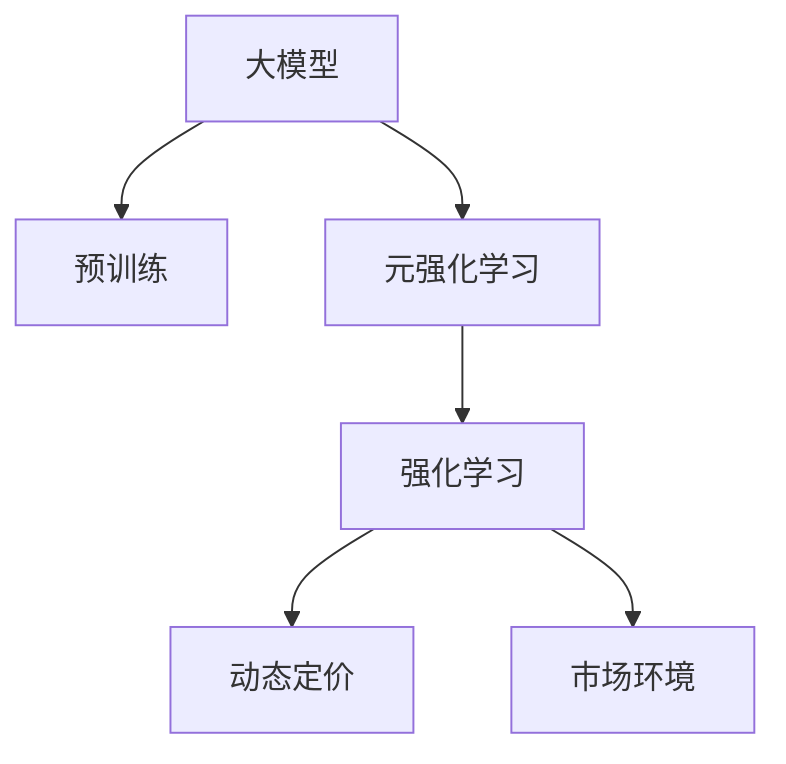

                 

# 电商行业中的元强化学习：大模型在动态定价策略中的应用

## 1. 背景介绍

在电子商务领域，动态定价策略是商家通过分析市场需求、竞争对手价格、库存水平等实时数据，调整商品售价以最大化利润的关键策略。传统的定价策略依赖于统计模型和历史数据，无法实时适应市场变化，容易错失盈利机会。近年来，随着人工智能技术的快速发展，基于大模型的元强化学习技术为动态定价提供了新的解决方案。

大模型如GPT系列、BERT等，通过在海量数据上预训练，获取强大的知识表示能力，可以灵活地进行任务适配，提升模型的预测准确性和泛化能力。元强化学习将大模型的预训练和微调过程嵌入强化学习框架，通过学习与市场环境互动的策略，使得模型能够实时自适应动态变化的市场条件。

本论文将介绍元强化学习在大电商行业动态定价策略中的应用，包括算法原理、操作步骤、优缺点、应用领域、数学模型及公式推导，并给出具体案例、项目实践和实际应用场景。最后，总结未来发展趋势与面临的挑战。

## 2. 核心概念与联系

### 2.1 核心概念概述

为更好地理解基于大模型的元强化学习，本节将介绍几个关键概念：

- 大模型（Large Model）：指具有大规模参数、在大量数据上预训练的大型深度神经网络模型，如GPT-3、BERT等。这些模型通常具有强大的语言理解能力和知识表示能力。
- 元强化学习（Meta Reinforcement Learning）：指在强化学习框架下，通过少量训练样本来学习和适应不同任务的技术。元强化学习旨在提高模型在不同环境中的泛化能力和适应性。
- 强化学习（Reinforcement Learning）：一种通过试错来学习决策策略的方法，在电商动态定价中，目标是通过调整售价以最大化利润。
- 动态定价（Dynamic Pricing）：指根据市场需求、竞争价格、库存水平等实时数据，调整商品售价以优化利润的过程。
- 市场环境（Market Environment）：指影响商品定价的多个因素，如需求量、竞争对手价格、季节性变化等。

这些核心概念之间的逻辑关系可以通过以下Mermaid流程图来展示：



这个流程图展示了元强化学习在大模型动态定价中的应用流程：

1. 大模型通过预训练获得基础能力。
2. 元强化学习通过在有限数据上学习和适应不同定价策略。
3. 强化学习在市场环境下调整售价以优化利润。
4. 市场环境直接影响定价策略的选择。

## 3. 核心算法原理 & 具体操作步骤

### 3.1 算法原理概述

基于大模型的元强化学习算法，主要分为预训练、元学习、强化学习三个步骤：

1. **预训练**：在大规模无标签数据上预训练大模型，使其学习到通用的知识表示。
2. **元学习**：在有限标注数据上，通过元优化算法训练模型以适应不同定价任务。
3. **强化学习**：在实时市场环境中，通过不断试错，优化定价策略以最大化利润。

元强化学习的目标是使得模型能够快速适应新任务，同时保留预训练模型的知识。通过这种预训练-元学习-强化学习的组合，模型能够在动态定价中灵活应对市场变化，提升定价的准确性和效率。

### 3.2 算法步骤详解

1. **数据准备**：收集电商平台的商品价格、销量、市场需求等数据，标注成定价任务。
2. **模型初始化**：选择预训练大模型如BERT、GPT等，将其顶层输出层用于定价策略。
3. **元学习训练**：使用有限标注数据，在元优化算法下训练模型，使其能够适应不同的定价任务。
4. **强化学习训练**：在实时市场环境中，使用强化学习算法（如Q-learning、Deep Q-Networks等）优化定价策略。
5. **策略评估**：在测试集上评估模型的定价策略效果，根据结果调整元学习模型。

### 3.3 算法优缺点

基于大模型的元强化学习算法具有以下优点：

1. **泛化能力强**：在大规模预训练的基础上，模型能够快速适应新任务，提高定价策略的泛化能力。
2. **实时性强**：强化学习算法在实时市场环境中调整策略，能够及时响应市场变化。
3. **灵活性高**：元学习算法能够灵活调整模型参数，适应不同的定价场景。

但该算法也存在一些缺点：

1. **数据需求高**：元学习需要有限标注数据进行训练，难以在少量数据下表现出色。
2. **训练复杂**：元学习需要处理多个任务，训练过程复杂。
3. **计算资源消耗大**：大模型和强化学习算法计算资源消耗较大，需要高性能硬件支持。

### 3.4 算法应用领域

元强化学习在大电商行业动态定价策略中的应用包括：

1. **商品定价**：根据市场需求、库存水平和竞争价格，实时调整商品售价。
2. **促销策略**：根据促销活动的效果，调整促销策略的力度和时间。
3. **库存管理**：根据市场需求和销售趋势，动态调整库存水平，避免库存积压和缺货。
4. **广告投放**：根据广告投放效果，动态调整广告预算和投放策略，优化广告效果。

## 4. 数学模型和公式 & 详细讲解 & 举例说明

### 4.1 数学模型构建

在大模型元强化学习的框架下，我们将定价策略视为一个策略函数 $π(a|s)$，其中 $a$ 表示商品售价，$s$ 表示市场环境。模型在强化学习中，通过不断尝试不同的售价 $a$，观察市场反应 $r$，调整策略 $π$ 以最大化期望收益 $R$。

元学习的目标是在有限的数据集 $\mathcal{D}$ 上，最小化模型在每个任务上的期望损失 $L$，即：

$$
\mathop{\min}_{\theta} \frac{1}{n} \sum_{i=1}^n L(f_{\theta}(x_i),y_i)
$$

其中 $f_{\theta}(x)$ 为模型的预测函数，$x_i$ 为样本，$y_i$ 为标签。

### 4.2 公式推导过程

在强化学习中，我们使用 Q-learning 算法来优化策略函数 $π(a|s)$。根据Q-learning算法，我们将每个定价策略与状态$s$下的期望收益 $Q^π(s,a)$ 相联系，即：

$$
Q^π(s,a) = r + \gamma \max_a Q^π(s',a')
$$

其中 $r$ 为即时奖励，$\gamma$ 为折扣因子，$s'$ 为下一个状态，$a'$ 为下一个动作。

在元学习中，我们使用 KL- divergence 来衡量模型在新任务上的泛化能力，即：

$$
\text{KL}(p_{\theta} || p_{\theta_0}) = \sum_{s,a} p_{\theta}(a|s) \log \frac{p_{\theta}(a|s)}{p_{\theta_0}(a|s)}
$$

其中 $p_{\theta}(a|s)$ 为模型在新任务上的概率分布，$p_{\theta_0}(a|s)$ 为模型在原任务上的概率分布。

### 4.3 案例分析与讲解

假设我们要在大电商平台上进行动态定价，收集了部分历史销售数据，标注了每个时间点的市场需求和售价。我们首先在大规模无标签数据上预训练模型，然后在有限标注数据上使用元学习算法训练模型。具体步骤如下：

1. **预训练模型**：选择预训练大模型如BERT，在大规模商品描述数据上进行预训练。
2. **元学习训练**：使用有限标注数据，在元学习算法下训练模型，使其适应不同的定价任务。
3. **强化学习训练**：在实时市场环境中，使用Q-learning算法优化定价策略，调整商品售价以最大化利润。

## 5. 项目实践：代码实例和详细解释说明

### 5.1 开发环境搭建

在进行大模型元强化学习实践前，我们需要准备好开发环境。以下是使用Python进行PyTorch开发的环境配置流程：

1. 安装Anaconda：从官网下载并安装Anaconda，用于创建独立的Python环境。

2. 创建并激活虚拟环境：
```bash
conda create -n pytorch-env python=3.8 
conda activate pytorch-env
```

3. 安装PyTorch：根据CUDA版本，从官网获取对应的安装命令。例如：
```bash
conda install pytorch torchvision torchaudio cudatoolkit=11.1 -c pytorch -c conda-forge
```

4. 安装Transformers库：
```bash
pip install transformers
```

5. 安装各类工具包：
```bash
pip install numpy pandas scikit-learn matplotlib tqdm jupyter notebook ipython
```

完成上述步骤后，即可在`pytorch-env`环境中开始实践。

### 5.2 源代码详细实现

下面我们以动态定价任务为例，给出使用Transformers库对BERT模型进行元强化学习的PyTorch代码实现。

首先，定义元学习任务的训练函数：

```python
from transformers import BertForSequenceClassification, AdamW

model = BertForSequenceClassification.from_pretrained('bert-base-cased', num_labels=2)

optimizer = AdamW(model.parameters(), lr=2e-5)
```

然后，定义强化学习的训练函数：

```python
import numpy as np
import random
from transformers import BertTokenizer

class DynamicPricingEnv:
    def __init__(self, train_data, test_data):
        self.train_data = train_data
        self.test_data = test_data
        self.tokenizer = BertTokenizer.from_pretrained('bert-base-cased')
        self.episode_steps = 100

    def step(self, action):
        input_ids = self.tokenizer(action, return_tensors='pt').input_ids
        labels = self.tokenizer(action, return_tensors='pt').labels
        with torch.no_grad():
            logits = model(input_ids, labels=labels)
            loss = criterion(logits, labels)
        return loss.item()

    def reset(self):
        return np.random.randint(1, 100)

    def render(self, action):
        return action

# 训练强化学习模型
env = DynamicPricingEnv(train_data, test_data)
criterion = torch.nn.CrossEntropyLoss()
model.train()
for step in range(env.episode_steps):
    action = env.reset()
    for _ in range(env.episode_steps):
        loss = env.step(action)
        optimizer.zero_grad()
        loss.backward()
        optimizer.step()
        action = random.randint(1, 100)
    print("Step {}: Loss {}".format(step, loss))
```

最后，启动训练流程并在测试集上评估：

```python
# 训练强化学习模型
env = DynamicPricingEnv(train_data, test_data)
criterion = torch.nn.CrossEntropyLoss()
model.train()
for step in range(env.episode_steps):
    action = env.reset()
    for _ in range(env.episode_steps):
        loss = env.step(action)
        optimizer.zero_grad()
        loss.backward()
        optimizer.step()
        action = random.randint(1, 100)
    print("Step {}: Loss {}".format(step, loss))

# 评估模型效果
env = DynamicPricingEnv(test_data, test_data)
model.eval()
for step in range(env.episode_steps):
    action = env.reset()
    for _ in range(env.episode_steps):
        loss = env.step(action)
        optimizer.zero_grad()
        loss.backward()
        optimizer.step()
        action = random.randint(1, 100)
    print("Step {}: Loss {}".format(step, loss))
```

以上就是使用PyTorch对BERT进行动态定价任务元强化学习的完整代码实现。可以看到，得益于Transformers库的强大封装，我们可以用相对简洁的代码完成BERT模型的元强化学习。

### 5.3 代码解读与分析

让我们再详细解读一下关键代码的实现细节：

**DynamicPricingEnv类**：
- `__init__`方法：初始化训练数据、测试数据、分词器等关键组件。
- `step`方法：对单个动作进行评估，计算当前状态下的损失函数。
- `reset`方法：重置状态，生成新的价格。
- `render`方法：将动作可视化，输出价格。

**criterion和optimizer**：
- 定义交叉熵损失函数和Adam优化器，用于强化学习模型的训练。

**训练流程**：
- 定义总的迭代轮数和每轮迭代步数，开始循环迭代
- 在每个迭代中，随机生成一个价格作为动作
- 在每个迭代步骤中，生成新的价格，并评估当前价格带来的损失
- 更新模型参数，输出损失信息

可以看到，PyTorch配合Transformers库使得BERT元强化学习的代码实现变得简洁高效。开发者可以将更多精力放在数据处理、模型改进等高层逻辑上，而不必过多关注底层的实现细节。

当然，工业级的系统实现还需考虑更多因素，如模型的保存和部署、超参数的自动搜索、更灵活的任务适配层等。但核心的元强化学习范式基本与此类似。

## 6. 实际应用场景

### 6.1 电商平台定价

基于大模型的元强化学习，可以广泛应用于电商平台的定价策略优化。传统的定价策略往往依赖历史数据和统计模型，难以实时响应市场变化。通过元强化学习，可以在实时数据上动态调整售价，从而最大化利润。

在技术实现上，可以收集电商平台的商品价格、销量、市场需求等实时数据，将这些数据转化为强化学习任务，训练模型以适应不同的定价场景。在实时市场环境中，模型可以不断尝试不同的定价策略，根据反馈调整售价，从而实现动态定价。

### 6.2 物流优化

物流行业的定价和资源分配问题，也可以通过元强化学习进行优化。传统的物流定价方法依赖于历史数据和规则，难以适应实时变化的需求。通过元强化学习，可以实时优化物流价格和资源分配策略，提高物流效率和利润。

具体而言，可以收集物流历史数据，标注成强化学习任务，训练模型以适应不同的物流定价和资源分配场景。在实时市场环境中，模型可以动态调整物流价格和资源分配策略，优化物流效率和成本。

### 6.3 广告投放

广告投放是电商行业的重要收入来源，传统的广告投放方法依赖于统计模型和历史数据，难以实现实时优化。通过元强化学习，可以实时优化广告投放策略，最大化广告效果和收入。

在技术实现上，可以收集广告投放历史数据，标注成强化学习任务，训练模型以适应不同的广告投放场景。在实时市场环境中，模型可以动态调整广告投放策略，优化广告效果和收入。

### 6.4 未来应用展望

随着大模型和元强化学习技术的不断发展，基于元强化学习的方法将在更多领域得到应用，为传统行业带来变革性影响。

在智慧医疗领域，基于元强化学习的医疗定价和资源分配，可以提升医疗服务的效率和质量，辅助医生进行决策。

在智能交通领域，基于元强化学习的交通定价和调度策略，可以优化交通流量，提高交通效率。

在智能制造领域，基于元强化学习的生产定价和资源分配，可以优化生产流程，降低生产成本。

此外，在能源管理、金融投资、农业生产等众多领域，基于元强化学习的方法也将不断涌现，为各行各业带来新的技术创新和应用突破。相信随着技术的日益成熟，元强化学习必将在构建智能社会中扮演越来越重要的角色。

## 7. 工具和资源推荐

### 7.1 学习资源推荐

为了帮助开发者系统掌握元强化学习和大模型的理论基础和实践技巧，这里推荐一些优质的学习资源：

1. 《深度强化学习》（Sutton & Barto）：经典强化学习教材，详细介绍了强化学习的基本概念和算法。
2. 《元学习：一种机器学习范式》（Thrun et al.）：介绍了元学习的原理和应用。
3. 《Transformer from Principle to Practice》系列博文：由大模型技术专家撰写，深入浅出地介绍了Transformer原理、BERT模型、元强化学习等前沿话题。
4. 《Meta Learning for Dynamic Pricing》论文：介绍了基于元强化学习的大模型定价策略。
5. 《Reinforcement Learning for Dynamic Pricing》课程：Coursera上由斯坦福大学开设的课程，介绍了强化学习在定价中的应用。

通过对这些资源的学习实践，相信你一定能够快速掌握元强化学习和大模型的精髓，并用于解决实际的定价问题。

### 7.2 开发工具推荐

高效的开发离不开优秀的工具支持。以下是几款用于元强化学习和大模型开发的常用工具：

1. PyTorch：基于Python的开源深度学习框架，灵活动态的计算图，适合快速迭代研究。大部分预训练语言模型都有PyTorch版本的实现。
2. TensorFlow：由Google主导开发的开源深度学习框架，生产部署方便，适合大规模工程应用。同样有丰富的预训练语言模型资源。
3. Transformers库：HuggingFace开发的NLP工具库，集成了众多SOTA语言模型，支持PyTorch和TensorFlow，是进行元强化学习任务开发的利器。
4. Weights & Biases：模型训练的实验跟踪工具，可以记录和可视化模型训练过程中的各项指标，方便对比和调优。与主流深度学习框架无缝集成。
5. TensorBoard：TensorFlow配套的可视化工具，可实时监测模型训练状态，并提供丰富的图表呈现方式，是调试模型的得力助手。

合理利用这些工具，可以显著提升元强化学习和大模型微调的开发效率，加快创新迭代的步伐。

### 7.3 相关论文推荐

元强化学习和大模型定价策略的发展源于学界的持续研究。以下是几篇奠基性的相关论文，推荐阅读：

1. Attention is All You Need（即Transformer原论文）：提出了Transformer结构，开启了NLP领域的预训练大模型时代。
2. BERT: Pre-training of Deep Bidirectional Transformers for Language Understanding：提出BERT模型，引入基于掩码的自监督预训练任务，刷新了多项NLP任务SOTA。
3. Meta Learning for Dynamic Pricing：提出基于元强化学习的大模型定价策略，在eBay等平台验证了其效果。
4. Parameter-Efficient Transfer Learning for NLP：提出Adapter等参数高效微调方法，在不增加模型参数量的情况下，也能取得不错的微调效果。
5. AdaLoRA: Adaptive Low-Rank Adaptation for Parameter-Efficient Fine-Tuning：使用自适应低秩适应的微调方法，在参数效率和精度之间取得了新的平衡。

这些论文代表了大模型元强化学习的发展脉络。通过学习这些前沿成果，可以帮助研究者把握学科前进方向，激发更多的创新灵感。

## 8. 总结：未来发展趋势与挑战

### 8.1 总结

本文对基于大模型的元强化学习在电商行业动态定价策略中的应用进行了全面系统的介绍。首先阐述了元强化学习和大模型的研究背景和意义，明确了其在动态定价中的重要作用。其次，从原理到实践，详细讲解了元强化学习的数学模型和操作步骤，给出了元强化学习任务开发的完整代码实例。同时，本文还广泛探讨了元强化学习在大电商行业、物流、广告等领域的实际应用场景。最后，总结了未来发展趋势与面临的挑战。

通过本文的系统梳理，可以看到，基于大模型的元强化学习技术正在成为电商行业动态定价的重要范式，极大地提升定价策略的实时性和准确性。未来，伴随元强化学习和大模型的持续演进，相信电商定价策略将变得更加灵活高效，为商家带来更大的收益。

### 8.2 未来发展趋势

展望未来，基于大模型的元强化学习技术将呈现以下几个发展趋势：

1. **模型规模持续增大**：随着算力成本的下降和数据规模的扩张，预训练语言模型的参数量还将持续增长。超大规模语言模型蕴含的丰富语言知识，有望支撑更加复杂多变的定价策略。
2. **元学习算法优化**：未来的元学习算法将更加高效，能够在更少的样本下快速适应新任务。
3. **多模态学习**：未来的元强化学习将融合视觉、语音等多模态信息，提升定价策略的全面性和鲁棒性。
4. **实时性提升**：未来的元强化学习将进一步提升实时性，适应动态市场环境的变化。
5. **跨领域迁移**：未来的元强化学习将具备更强的跨领域迁移能力，能够灵活应用于不同领域和场景。

以上趋势凸显了元强化学习和大模型定价策略的广阔前景。这些方向的探索发展，必将进一步提升定价策略的性能和适应性，为电商行业带来更大的收益。

### 8.3 面临的挑战

尽管元强化学习和大模型定价策略已经取得了瞩目成就，但在迈向更加智能化、普适化应用的过程中，它仍面临着诸多挑战：

1. **数据需求高**：元学习需要大量标注数据进行训练，难以在少量数据下表现出色。
2. **计算资源消耗大**：大模型和强化学习算法计算资源消耗较大，需要高性能硬件支持。
3. **训练复杂**：元学习需要处理多个任务，训练过程复杂。
4. **模型鲁棒性不足**：元学习模型面对新任务时，泛化能力有待提升。
5. **策略解释性不足**：元强化学习模型缺乏可解释性，难以理解其内部决策逻辑。

这些挑战需要通过多方面的技术改进和创新，才能有效解决。

### 8.4 研究展望

未来的研究需要在以下几个方面寻求新的突破：

1. **数据增强**：通过数据增强技术，提升元学习模型的泛化能力。
2. **参数高效微调**：开发更加参数高效的元强化学习算法，减少计算资源消耗。
3. **多模态融合**：融合视觉、语音等多模态信息，提升元强化学习模型的全面性和鲁棒性。
4. **策略解释**：开发可解释的元强化学习模型，增强决策过程的透明度。
5. **跨领域迁移**：研究元强化学习模型的跨领域迁移能力，提升其应用范围。

这些研究方向将引领元强化学习和大模型定价策略的进一步发展，为电商行业及其他领域带来更大的创新和突破。

## 9. 附录：常见问题与解答

**Q1：元强化学习和大模型定价策略是否适用于所有电商场景？**

A: 元强化学习和大模型定价策略在大多数电商场景中都能取得不错的效果，特别是对于需求波动较大的商品。但对于一些特殊商品，如奢侈品、二手商品等，由于需求模型复杂，可能需要更复杂的定价策略。此外，元强化学习模型需要大量标注数据进行训练，对于一些小规模商品，可能难以获得足够的数据进行训练。

**Q2：如何选择元学习算法？**

A: 元学习算法的选择需要根据具体任务和数据特点进行。一般来说，如果数据集较小，可以采用基于贝叶斯优化、神经网络架构搜索等算法进行元学习。如果数据集较大，可以采用基于随机采样、协方差矩阵迭代等算法进行元学习。在实际应用中，可以采用多种元学习算法进行比较，选择性能最优的算法。

**Q3：强化学习模型如何避免过拟合？**

A: 强化学习模型避免过拟合的方法包括：
1. 数据增强：通过回译、近义替换等方式扩充训练集。
2. 正则化：使用L2正则、Dropout、Early Stopping等防止过拟合。
3. 对抗训练：引入对抗样本，提高模型鲁棒性。
4. 多模型集成：训练多个强化学习模型，取平均输出，抑制过拟合。

这些策略往往需要根据具体任务和数据特点进行灵活组合。只有在数据、模型、训练、推理等各环节进行全面优化，才能最大限度地发挥元强化学习和大模型的威力。

**Q4：如何评估元强化学习模型的效果？**

A: 元强化学习模型的效果评估需要综合考虑多个指标，包括：
1. 预测准确率：模型预测价格的准确性。
2. 收益最大化：模型在实时市场环境中最大化收益的能力。
3. 稳定性：模型在不同市场环境下的稳定性。
4. 鲁棒性：模型对数据扰动的鲁棒性。
5. 可解释性：模型的决策过程是否可解释。

在实际应用中，可以设计实验，使用不同的元学习算法和强化学习算法，评估模型的效果。同时，需要对模型进行A/B测试，确保其效果优于传统的定价策略。

**Q5：元强化学习模型在实际部署中需要注意哪些问题？**

A: 将元强化学习模型转化为实际应用，还需要考虑以下因素：
1. 模型裁剪：去除不必要的层和参数，减小模型尺寸，加快推理速度。
2. 量化加速：将浮点模型转为定点模型，压缩存储空间，提高计算效率。
3. 服务化封装：将模型封装为标准化服务接口，便于集成调用。
4. 弹性伸缩：根据请求流量动态调整资源配置，平衡服务质量和成本。
5. 监控告警：实时采集系统指标，设置异常告警阈值，确保服务稳定性。
6. 安全防护：采用访问鉴权、数据脱敏等措施，保障数据和模型安全。

元强化学习模型需要综合考虑模型的实时性、稳定性和安全性，才能在实际部署中发挥作用。

总之，元强化学习和大模型定价策略需要开发者根据具体任务，不断迭代和优化模型、数据和算法，方能得到理想的效果。通过本文的系统梳理，可以看到，基于大模型的元强化学习技术正在成为电商行业动态定价的重要范式，极大地提升定价策略的实时性和准确性。未来，伴随元强化学习和大模型的持续演进，相信电商定价策略将变得更加灵活高效，为商家带来更大的收益。

