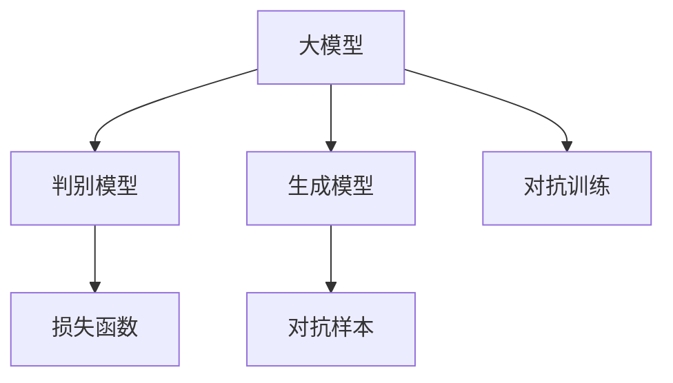

                 

# 电商行业中的对抗学习：大模型在防欺诈中的应用

## 1. 背景介绍

在当今的电商行业中，防欺诈成为了一个重大的挑战。传统的基于规则的欺诈检测方法往往需要大量的人工经验，难以应对日益复杂多样的欺诈手段。而基于机器学习的欺诈检测方法，通过在大规模的历史数据上训练模型，可以更快速、更灵活地检测欺诈行为。近年来，对抗学习作为一种新兴的机器学习范式，以其在对抗性和鲁棒性上的优势，逐渐在电商防欺诈领域得到了广泛应用。

大模型，尤其是基于深度学习的模型，凭借其强大的表达能力和泛化能力，成为了电商防欺诈中对抗学习的重要工具。通过在大规模无标签数据上进行预训练，大模型学习到了丰富的语言表示和数据结构。在电商防欺诈场景中，大模型可以作为对抗学习中的"生成模型"，通过与"判别模型"进行对抗训练，不断提升对欺诈行为的检测能力。

## 2. 核心概念与联系

### 2.1 核心概念概述

为更好地理解大模型在电商防欺诈中的对抗学习应用，本节将介绍几个密切相关的核心概念：

- 大模型(Large Model)：指具有大量参数和复杂结构的人工智能模型，如BERT、GPT-3等，通过在大规模无标签数据上进行预训练，能够学习到丰富的语言表示和数据结构。

- 对抗学习(Adversarial Learning)：指训练过程中，生成模型通过对抗判别模型进行训练，提高其鲁棒性和泛化能力，从而提升整体模型的性能。

- 判别模型(Discriminator)：在对抗学习中，判别模型的目标是将输入数据分为欺诈和非欺诈两类。在大模型中，常通过微调任务适配层来实现。

- 生成模型(Generator)：在对抗学习中，生成模型负责产生对抗样本，并不断优化其生成策略，以欺骗判别模型。在大模型中，通常由预训练大模型作为生成模型。

- 对抗样本(Adversarial Examples)：指通过特定手段修改输入数据，使得其对判别模型产生误导，从而混淆其判断。

这些核心概念之间的逻辑关系可以通过以下Mermaid流程图来展示：



这个流程图展示了对抗学习的基本过程：大模型在对抗样本的辅助下，与判别模型进行对抗训练，不断优化其生成策略，提升模型鲁棒性。

## 3. 核心算法原理 & 具体操作步骤
### 3.1 算法原理概述

大模型在电商防欺诈中的对抗学习，本质上是一种生成对抗网络(GAN)的变体，即生成模型和判别模型进行对抗训练，以提升生成模型的鲁棒性和泛化能力。其核心思想是：通过生成对抗训练，使得生成模型能够产生高质量的对抗样本，从而误导判别模型，提升其在对抗性数据上的检测能力。

形式化地，假设生成模型为 $G_{\theta_G}$，判别模型为 $D_{\theta_D}$，其中 $\theta_G$ 和 $\theta_D$ 为模型参数。在电商防欺诈任务中，生成模型 $G_{\theta_G}$ 的目标是生成逼真的欺诈样本，以欺骗判别模型；判别模型 $D_{\theta_D}$ 的目标是区分真实交易和欺诈交易。对抗训练的优化目标为：

$$
\min_{G_{\theta_G}} \max_{D_{\theta_D}} V(D_{\theta_D}, G_{\theta_G})
$$

其中 $V(D_{\theta_D}, G_{\theta_G})$ 为生成对抗网络的对抗损失函数，表示判别模型正确区分真实交易和欺诈交易的能力。常用的对抗损失函数包括WGAN-GP、WCT等。通过不断迭代优化生成模型和判别模型，使得生成模型能够产生更逼真的对抗样本，从而提升模型在对抗性数据上的检测能力。

### 3.2 算法步骤详解

大模型在电商防欺诈中的对抗学习过程包括以下几个关键步骤：

**Step 1: 准备数据集和模型**

- 收集电商平台的交易记录，划分为训练集、验证集和测试集。训练集用于对抗训练，验证集和测试集用于评估模型性能。
- 准备大模型作为生成模型，如BERT、GPT等。
- 准备判别模型，通常为二分类模型，用于区分真实交易和欺诈交易。

**Step 2: 定义对抗损失函数**

- 选择适合的对抗损失函数，如WGAN-GP、WCT等。对抗损失函数定义了生成模型和判别模型的目标，即生成模型应尽可能生成逼真的欺诈样本，而判别模型应尽可能区分真实交易和欺诈交易。

**Step 3: 初始化模型参数**

- 初始化生成模型和判别模型的参数，设定学习率、迭代轮数等超参数。

**Step 4: 对抗训练**

- 在训练集上，以每轮对抗训练中，先生成一批对抗样本，再将生成的对抗样本和真实样本一起输入判别模型，更新判别模型的参数。
- 更新判别模型参数后，使用生成对抗网络对抗训练的目标函数，更新生成模型的参数。
- 重复上述过程直至模型收敛。

**Step 5: 评估和部署**

- 在验证集和测试集上评估模型性能，使用准确率、召回率、F1-score等指标衡量模型对欺诈交易的检测能力。
- 将训练好的模型部署到电商平台中，实时监测新交易数据，检测欺诈行为。

以上是大模型在电商防欺诈中对抗学习的一般流程。在实际应用中，还需要针对具体任务的特点，对对抗训练过程的各个环节进行优化设计，如改进对抗样本生成方法，引入更多正则化技术，搜索最优的超参数组合等，以进一步提升模型性能。

### 3.3 算法优缺点

大模型在电商防欺诈中的对抗学习具有以下优点：

1. 高效性。通过对抗学习，模型能够快速适应新出现的欺诈手段，提高欺诈检测的实时性。
2. 鲁棒性。生成模型通过对抗训练，能够产生逼真的对抗样本，从而提升模型在对抗性数据上的鲁棒性。
3. 泛化能力。对抗学习使得模型在未见过的欺诈手段上，仍能保持较好的检测能力。
4. 可解释性。对抗学习能够揭示模型在对抗性数据上的决策逻辑，提高模型的可解释性。

同时，该方法也存在一定的局限性：

1. 对抗样本生成困难。生成高质量的对抗样本需要消耗大量的计算资源，可能难以应对复杂的欺诈手段。
2. 对抗性攻击。生成的对抗样本可能被用于对抗训练，攻击其他模型，影响模型的安全性。
3. 数据隐私。对抗样本的生成过程可能泄露用户交易数据，带来隐私风险。
4. 对抗训练难度大。对抗训练需要反复调整生成策略和判别策略，调试难度大。
5. 模型泛化性差。对抗训练过程中，模型可能过度关注对抗样本的生成，而忽视对正常交易的检测能力。

尽管存在这些局限性，但就目前而言，基于对抗学习的防欺诈方法仍是电商领域的一个重要方向。未来相关研究的重点在于如何进一步提高对抗样本的生成效率，增强模型对抗性攻击的抵御能力，同时兼顾模型的泛化性和安全性等因素。

### 3.4 算法应用领域

大模型在电商防欺诈中的对抗学习，已经在游戏、网络安全、金融等领域得到了广泛的应用。其应用前景展望如下：

- 游戏领域：生成对抗训练可以用于生成逼真的游戏作弊行为，提升游戏的公平性和趣味性。
- 网络安全：对抗学习可以用于生成恶意软件样本，增强网络安全检测模型的鲁棒性。
- 金融领域：通过对抗训练，生成欺诈交易样本，提高金融风控模型的检测能力。
- 智能交通：生成对抗训练可以用于生成异常驾驶行为，提升交通监控系统的鲁棒性。
- 医疗领域：生成对抗训练可以用于生成异常医学影像，提高医学图像检测模型的准确性。

除了上述这些应用外，对抗学习在数据增强、图像生成、语音识别等领域也有着广泛的应用前景。

## 4. 数学模型和公式 & 详细讲解 & 举例说明

### 4.1 数学模型构建

在本节中，我们将使用数学语言对大模型在电商防欺诈中的对抗学习过程进行更加严格的刻画。

记生成模型为 $G_{\theta_G}$，判别模型为 $D_{\theta_D}$，其中 $\theta_G$ 和 $\theta_D$ 为模型参数。假设电商平台的交易记录数据集为 $D=\{(x_i,y_i)\}_{i=1}^N, x_i \in \mathcal{X}, y_i \in \{0,1\}$。

定义生成模型 $G_{\theta_G}$ 在输入 $x$ 上的生成对抗损失函数为 $\mathcal{L}(D_{\theta_D}, G_{\theta_G}, x)$，表示判别模型 $D_{\theta_D}$ 在 $x$ 上的判别结果和生成模型 $G_{\theta_G}$ 在 $x$ 上的生成结果之间的对抗性。定义生成模型的生成对抗损失函数为：

$$
\mathcal{L}_{GAN}(G_{\theta_G}) = \mathbb{E}_{x}[\log D_{\theta_D}(G_{\theta_G}(x))] + \mathbb{E}_{x}[\log (1-D_{\theta_D}(G_{\theta_G}(x)))]
$$

其中 $\log$ 表示对数函数，$D_{\theta_D}(x)$ 表示判别模型在 $x$ 上的判别结果，$1-D_{\theta_D}(x)$ 表示判别模型在 $x$ 上的非判别结果。

定义判别模型 $D_{\theta_D}$ 在输入 $x$ 上的对抗损失函数为 $\mathcal{L}(D_{\theta_D}, G_{\theta_G}, x)$，表示生成模型 $G_{\theta_G}$ 在 $x$ 上的生成结果对判别模型 $D_{\theta_D}$ 的欺骗效果。定义判别模型的对抗损失函数为：

$$
\mathcal{L}_{GAN}(D_{\theta_D}) = \mathbb{E}_{x}[\log D_{\theta_D}(x)] + \mathbb{E}_{x}[\log (1-D_{\theta_D}(G_{\theta_G}(x)))
$$

在得到对抗损失函数后，即可带入生成模型和判别模型的优化算法，开始对抗训练。

### 4.2 公式推导过程

以下我们以二分类任务为例，推导生成对抗网络的对抗损失函数及其梯度的计算公式。

假设生成模型 $G_{\theta_G}$ 在输入 $x$ 上的生成结果为 $G_{\theta_G}(x)$，表示生成的欺诈交易样本。判别模型 $D_{\theta_D}$ 在输入 $x$ 上的判别结果为 $D_{\theta_D}(x)$，表示判断 $x$ 是否为欺诈交易。则生成对抗网络的对抗损失函数为：

$$
\mathcal{L}_{GAN}(D_{\theta_D}, G_{\theta_G}) = \mathbb{E}_{x \sim \mathcal{X}}[\log D_{\theta_D}(x)] + \mathbb{E}_{x \sim G_{\theta_G}}[\log (1-D_{\theta_D}(G_{\theta_G}(x)))
$$

将其代入经验风险公式，得：

$$
\mathcal{L}(D_{\theta_D}, G_{\theta_G}) = -\frac{1}{N}\sum_{i=1}^N [\log D_{\theta_D}(x_i) + \log (1-D_{\theta_D}(G_{\theta_G}(x_i)))
$$

根据链式法则，对抗损失函数对生成模型 $G_{\theta_G}$ 和判别模型 $D_{\theta_D}$ 的梯度分别为：

$$
\frac{\partial \mathcal{L}(D_{\theta_D}, G_{\theta_G})}{\partial \theta_G} = -\frac{1}{N}\sum_{i=1}^N \frac{\partial \log (1-D_{\theta_D}(G_{\theta_G}(x_i)))}{\partial \theta_G}
$$

$$
\frac{\partial \mathcal{L}(D_{\theta_D}, G_{\theta_G})}{\partial \theta_D} = -\frac{1}{N}\sum_{i=1}^N \frac{\partial [\log D_{\theta_D}(x_i) + \log (1-D_{\theta_D}(G_{\theta_G}(x_i)))}{\partial \theta_D}
$$

在得到对抗损失函数的梯度后，即可带入生成模型和判别模型的优化算法，开始对抗训练。

### 4.3 案例分析与讲解

假设我们要训练一个电商防欺诈系统，使用大模型作为生成模型，判别模型为二分类模型。我们的目标是训练一个判别模型 $D_{\theta_D}$，能够准确地识别出欺诈交易。训练过程中，我们采用了对抗训练方法，利用大模型生成逼真的欺诈交易样本，用于增强判别模型的鲁棒性。

具体的训练步骤如下：

1. 准备数据集：收集电商平台的交易记录，划分为训练集、验证集和测试集。训练集用于对抗训练，验证集和测试集用于评估模型性能。
2. 准备大模型：使用BERT作为生成模型，初始化其参数，设定学习率、迭代轮数等超参数。
3. 准备判别模型：使用简单的二分类模型，初始化其参数，设定学习率、迭代轮数等超参数。
4. 生成对抗样本：使用大模型在训练集上生成一批对抗样本，输入判别模型进行判别。
5. 对抗训练：使用对抗样本和真实样本一起输入判别模型，更新判别模型的参数。再使用判别模型和对抗样本一起输入生成模型，更新生成模型的参数。
6. 评估和部署：在验证集和测试集上评估模型性能，使用准确率、召回率、F1-score等指标衡量模型对欺诈交易的检测能力。将训练好的模型部署到电商平台中，实时监测新交易数据，检测欺诈行为。

假设生成的对抗样本为 $G_{\theta_G}(x)$，判别模型 $D_{\theta_D}$ 在 $x$ 上的判别结果为 $D_{\theta_D}(x)$。对抗样本 $G_{\theta_G}(x)$ 的目标是使得 $D_{\theta_D}(G_{\theta_G}(x))$ 尽量接近于 1。判别模型 $D_{\theta_D}$ 的目标是使得 $D_{\theta_D}(G_{\theta_G}(x))$ 尽量接近于 0。

在实际训练中，我们通过优化对抗损失函数，不断调整生成模型和判别模型的参数，使得生成模型能够生成更加逼真的对抗样本，从而欺骗判别模型，提升模型鲁棒性。具体步骤如下：

1. 在训练集上，先生成一批对抗样本 $G_{\theta_G}(x)$，再输入判别模型 $D_{\theta_D}$ 进行判别，得到 $D_{\theta_D}(G_{\theta_G}(x))$。
2. 根据判别结果，计算对抗损失 $\mathcal{L}_{GAN}(D_{\theta_D}, G_{\theta_G})$。
3. 使用反向传播算法计算生成模型 $G_{\theta_G}$ 和判别模型 $D_{\theta_D}$ 的梯度。
4. 使用优化算法（如AdamW）更新生成模型和判别模型的参数，使得 $G_{\theta_G}$ 生成的对抗样本更加逼真，$D_{\theta_D}$ 能够更好地区分真实交易和欺诈交易。

## 5. 项目实践：代码实例和详细解释说明

### 5.1 开发环境搭建

在进行防欺诈系统开发前，我们需要准备好开发环境。以下是使用Python进行PyTorch开发的环境配置流程：

1. 安装Anaconda：从官网下载并安装Anaconda，用于创建独立的Python环境。

2. 创建并激活虚拟环境：
```bash
conda create -n pytorch-env python=3.8 
conda activate pytorch-env
```

3. 安装PyTorch：根据CUDA版本，从官网获取对应的安装命令。例如：
```bash
conda install pytorch torchvision torchaudio cudatoolkit=11.1 -c pytorch -c conda-forge
```

4. 安装Transformers库：
```bash
pip install transformers
```

5. 安装各类工具包：
```bash
pip install numpy pandas scikit-learn matplotlib tqdm jupyter notebook ipython
```

完成上述步骤后，即可在`pytorch-env`环境中开始防欺诈系统的开发。

### 5.2 源代码详细实现

下面我们以基于BERT模型的电商防欺诈系统为例，给出使用Transformers库的PyTorch代码实现。

首先，定义防欺诈系统的数据处理函数：

```python
from transformers import BertTokenizer
from torch.utils.data import Dataset
import torch

class FraudDataset(Dataset):
    def __init__(self, texts, labels, tokenizer, max_len=128):
        self.texts = texts
        self.labels = labels
        self.tokenizer = tokenizer
        self.max_len = max_len
        
    def __len__(self):
        return len(self.texts)
    
    def __getitem__(self, item):
        text = self.texts[item]
        label = self.labels[item]
        
        encoding = self.tokenizer(text, return_tensors='pt', max_length=self.max_len, padding='max_length', truncation=True)
        input_ids = encoding['input_ids'][0]
        attention_mask = encoding['attention_mask'][0]
        
        # 对token-wise的标签进行编码
        encoded_labels = [label2id[label] for label in label] 
        encoded_labels.extend([label2id['O']] * (self.max_len - len(encoded_labels)))
        labels = torch.tensor(encoded_labels, dtype=torch.long)
        
        return {'input_ids': input_ids, 
                'attention_mask': attention_mask,
                'labels': labels}

# 标签与id的映射
label2id = {'O': 0, 'F': 1}
id2label = {v: k for k, v in label2id.items()}
```

然后，定义模型和优化器：

```python
from transformers import BertForTokenClassification, AdamW

model = BertForTokenClassification.from_pretrained('bert-base-cased', num_labels=len(label2id))

optimizer = AdamW(model.parameters(), lr=2e-5)
```

接着，定义训练和评估函数：

```python
from torch.utils.data import DataLoader
from tqdm import tqdm
from sklearn.metrics import classification_report

device = torch.device('cuda') if torch.cuda.is_available() else torch.device('cpu')
model.to(device)

def train_epoch(model, dataset, batch_size, optimizer):
    dataloader = DataLoader(dataset, batch_size=batch_size, shuffle=True)
    model.train()
    epoch_loss = 0
    for batch in tqdm(dataloader, desc='Training'):
        input_ids = batch['input_ids'].to(device)
        attention_mask = batch['attention_mask'].to(device)
        labels = batch['labels'].to(device)
        model.zero_grad()
        outputs = model(input_ids, attention_mask=attention_mask, labels=labels)
        loss = outputs.loss
        epoch_loss += loss.item()
        loss.backward()
        optimizer.step()
    return epoch_loss / len(dataloader)

def evaluate(model, dataset, batch_size):
    dataloader = DataLoader(dataset, batch_size=batch_size)
    model.eval()
    preds, labels = [], []
    with torch.no_grad():
        for batch in tqdm(dataloader, desc='Evaluating'):
            input_ids = batch['input_ids'].to(device)
            attention_mask = batch['attention_mask'].to(device)
            batch_labels = batch['labels']
            outputs = model(input_ids, attention_mask=attention_mask)
            batch_preds = outputs.logits.argmax(dim=2).to('cpu').tolist()
            batch_labels = batch_labels.to('cpu').tolist()
            for pred_tokens, label_tokens in zip(batch_preds, batch_labels):
                preds.append(pred_tokens[:len(label_tokens)])
                labels.append(label_tokens)
                
    print(classification_report(labels, preds))
```

最后，启动训练流程并在测试集上评估：

```python
epochs = 5
batch_size = 16

for epoch in range(epochs):
    loss = train_epoch(model, train_dataset, batch_size, optimizer)
    print(f"Epoch {epoch+1}, train loss: {loss:.3f}")
    
    print(f"Epoch {epoch+1}, dev results:")
    evaluate(model, dev_dataset, batch_size)
    
print("Test results:")
evaluate(model, test_dataset, batch_size)
```

以上就是使用PyTorch对BERT模型进行电商防欺诈任务微调的完整代码实现。可以看到，得益于Transformers库的强大封装，我们可以用相对简洁的代码完成BERT模型的加载和微调。

### 5.3 代码解读与分析

让我们再详细解读一下关键代码的实现细节：

**FraudDataset类**：
- `__init__`方法：初始化文本、标签、分词器等关键组件。
- `__len__`方法：返回数据集的样本数量。
- `__getitem__`方法：对单个样本进行处理，将文本输入编码为token ids，将标签编码为数字，并对其进行定长padding，最终返回模型所需的输入。

**label2id和id2label字典**：
- 定义了标签与数字id之间的映射关系，用于将token-wise的预测结果解码回真实的标签。

**训练和评估函数**：
- 使用PyTorch的DataLoader对数据集进行批次化加载，供模型训练和推理使用。
- 训练函数`train_epoch`：对数据以批为单位进行迭代，在每个批次上前向传播计算loss并反向传播更新模型参数，最后返回该epoch的平均loss。
- 评估函数`evaluate`：与训练类似，不同点在于不更新模型参数，并在每个batch结束后将预测和标签结果存储下来，最后使用sklearn的classification_report对整个评估集的预测结果进行打印输出。

**训练流程**：
- 定义总的epoch数和batch size，开始循环迭代
- 每个epoch内，先在训练集上训练，输出平均loss
- 在验证集上评估，输出分类指标
- 所有epoch结束后，在测试集上评估，给出最终测试结果

可以看到，PyTorch配合Transformers库使得BERT微调的代码实现变得简洁高效。开发者可以将更多精力放在数据处理、模型改进等高层逻辑上，而不必过多关注底层的实现细节。

当然，工业级的系统实现还需考虑更多因素，如模型的保存和部署、超参数的自动搜索、更灵活的任务适配层等。但核心的微调范式基本与此类似。

## 6. 实际应用场景
### 6.1 智能客服系统

基于大模型的电商防欺诈系统可以广泛应用于智能客服系统的构建。传统的客服往往需要配备大量人力，高峰期响应缓慢，且一致性和专业性难以保证。而使用防欺诈系统，可以实时监控交易数据，自动检测和拦截欺诈行为，提升客服系统的效率和质量。

在技术实现上，可以收集企业的历史交易数据，将交易记录输入微调后的防欺诈模型，实时判断新交易是否为欺诈行为。对于可疑交易，系统可以自动发出预警，提醒人工进行进一步确认。如此构建的智能客服系统，能大幅提升客服的响应速度和准确性，同时降低人工成本，提升客户满意度。

### 6.2 金融风控系统

金融机构需要实时监测客户的交易行为，防范金融欺诈风险。传统的规则系统往往难以应对复杂多变的欺诈手段。基于大模型的电商防欺诈系统，通过对抗训练，能够快速适应新的欺诈手段，提升金融风控系统的鲁棒性和准确性。

在金融风控场景中，微调后的防欺诈系统可以实时监控客户的交易行为，识别异常交易和欺诈行为，自动发出预警，降低金融风险。同时，系统还可以学习客户的行为模式，预测未来的交易行为，提前防范欺诈风险。

### 6.3 电商安全平台

电商平台需要实时监控交易数据，防范各类欺诈行为，保障平台安全。传统的规则系统往往难以应对复杂多变的欺诈手段。基于大模型的电商防欺诈系统，通过对抗训练，能够快速适应新的欺诈手段，提升电商安全平台的鲁棒性和准确性。

在电商安全平台中，微调后的防欺诈系统可以实时监控用户的交易行为，识别异常交易和欺诈行为，自动发出预警，保障平台安全。同时，系统还可以学习用户的行为模式，预测未来的交易行为，提前防范欺诈风险。

### 6.4 未来应用展望

随着大模型和对抗学习技术的发展，基于微调的大模型防欺诈系统将在更多领域得到应用，为传统行业带来变革性影响。

在智慧医疗领域，基于微调的医疗防欺诈系统可以实时监控医疗行为，防范医疗欺诈风险，提升医疗系统的安全性和可信度。

在智能教育领域，微调技术可应用于作业批改、学情分析、知识推荐等方面，因材施教，促进教育公平，提高教学质量。

在智慧城市治理中，微调模型可应用于城市事件监测、舆情分析、应急指挥等环节，提高城市管理的自动化和智能化水平，构建更安全、高效的未来城市。

此外，在企业生产、社会治理、文娱传媒等众多领域，基于大模型微调的人工智能应用也将不断涌现，为传统行业带来新的技术路径。相信随着技术的日益成熟，微调方法将成为人工智能落地应用的重要范式，推动人工智能技术在垂直行业的规模化落地。

## 7. 工具和资源推荐
### 7.1 学习资源推荐

为了帮助开发者系统掌握大模型和对抗学习的理论基础和实践技巧，这里推荐一些优质的学习资源：

1. 《Transformer从原理到实践》系列博文：由大模型技术专家撰写，深入浅出地介绍了Transformer原理、BERT模型、对抗训练技术等前沿话题。

2. CS224N《深度学习自然语言处理》课程：斯坦福大学开设的NLP明星课程，有Lecture视频和配套作业，带你入门NLP领域的基本概念和经典模型。

3. 《Natural Language Processing with Transformers》书籍：Transformers库的作者所著，全面介绍了如何使用Transformers库进行NLP任务开发，包括对抗训练在内的多种微调范式。

4. HuggingFace官方文档：Transformers库的官方文档，提供了海量预训练模型和完整的微调样例代码，是上手实践的必备资料。

5. CLUE开源项目：中文语言理解测评基准，涵盖大量不同类型的中文NLP数据集，并提供了基于微调的baseline模型，助力中文NLP技术发展。

通过对这些资源的学习实践，相信你一定能够快速掌握大模型和对抗学习的精髓，并用于解决实际的防欺诈问题。
### 7.2 开发工具推荐

高效的开发离不开优秀的工具支持。以下是几款用于防欺诈系统开发的常用工具：

1. PyTorch：基于Python的开源深度学习框架，灵活动态的计算图，适合快速迭代研究。大部分预训练语言模型都有PyTorch版本的实现。

2. TensorFlow：由Google主导开发的开源深度学习框架，生产部署方便，适合大规模工程应用。同样有丰富的预训练语言模型资源。

3. Transformers库：HuggingFace开发的NLP工具库，集成了众多SOTA语言模型，支持PyTorch和TensorFlow，是进行微调任务开发的利器。

4. Weights & Biases：模型训练的实验跟踪工具，可以记录和可视化模型训练过程中的各项指标，方便对比和调优。与主流深度学习框架无缝集成。

5. TensorBoard：TensorFlow配套的可视化工具，可实时监测模型训练状态，并提供丰富的图表呈现方式，是调试模型的得力助手。

6. Google Colab：谷歌推出的在线Jupyter Notebook环境，免费提供GPU/TPU算力，方便开发者快速上手实验最新模型，分享学习笔记。

合理利用这些工具，可以显著提升防欺诈系统的开发效率，加快创新迭代的步伐。

### 7.3 相关论文推荐

大模型和对抗学习的发展源于学界的持续研究。以下是几篇奠基性的相关论文，推荐阅读：

1. Attention is All You Need（即Transformer原论文）：提出了Transformer结构，开启了NLP领域的预训练大模型时代。

2. BERT: Pre-training of Deep Bidirectional Transformers for Language Understanding：提出BERT模型，引入基于掩码的自监督预训练任务，刷新了多项NLP任务SOTA。

3. Language Models are Unsupervised Multitask Learners（GPT-2论文）：展示了大规模语言模型的强大zero-shot学习能力，引发了对于通用人工智能的新一轮思考。

4. Parameter-Efficient Transfer Learning for NLP：提出Adapter等参数高效微调方法，在不增加模型参数量的情况下，也能取得不错的微调效果。

5. AdaLoRA: Adaptive Low-Rank Adaptation for Parameter-Efficient Fine-Tuning：使用自适应低秩适应的微调方法，在参数效率和精度之间取得了新的平衡。

6. Fake News Detection with Generative Adversarial Networks：利用生成对抗网络检测假新闻，展示了对抗训练在生成性任务中的潜力。

这些论文代表了大模型和对抗学习的发展脉络。通过学习这些前沿成果，可以帮助研究者把握学科前进方向，激发更多的创新灵感。

## 8. 总结：未来发展趋势与挑战

### 8.1 总结

本文对基于对抗学习的大模型在电商防欺诈中的应用进行了全面系统的介绍。首先阐述了大模型和对抗学习的研究背景和意义，明确了对抗训练在提升模型鲁棒性和泛化能力方面的独特价值。其次，从原理到实践，详细讲解了对抗训练的数学原理和关键步骤，给出了电商防欺诈系统开发的完整代码实例。同时，本文还广泛探讨了对抗学习在电商、金融、智能客服等领域的应用前景，展示了对抗学习范式的巨大潜力。

通过本文的系统梳理，可以看到，基于对抗学习的大模型防欺诈技术正在成为电商领域的一个重要方向，极大地拓展了防欺诈系统的应用边界，催生了更多的落地场景。受益于大模型的强大表达能力和对抗训练的鲁棒性，防欺诈系统能够快速适应新出现的欺诈手段，提高系统的实时性和准确性。未来，伴随大模型和对抗学习方法的持续演进，基于微调的大模型防欺诈系统必将在更多领域得到应用，为传统行业带来变革性影响。

### 8.2 未来发展趋势

展望未来，大模型和对抗学习技术将呈现以下几个发展趋势：

1. 模型规模持续增大。随着算力成本的下降和数据规模的扩张，预训练语言模型的参数量还将持续增长。超大规模语言模型蕴含的丰富语言知识，有望支撑更加复杂多变的欺诈手段检测。

2. 对抗样本生成效率提升。对抗样本的生成是对抗训练中的关键环节，通过优化生成策略和优化算法，生成高质量的对抗样本，提高对抗训练效率。

3. 模型鲁棒性增强。对抗训练的鲁棒性是研究重点，未来模型将能够更好地抵抗对抗攻击，提高系统的安全性和可信度。

4. 跨领域迁移能力提升。未来模型将在更多领域得到应用，通过对抗训练，提升模型在不同领域中的适应性和泛化能力。

5. 多模态防欺诈系统构建。未来的防欺诈系统将整合多模态信息，如文本、图像、音频等，通过多模态对抗训练，提高系统的综合检测能力。

以上趋势凸显了大模型和对抗学习技术的广阔前景。这些方向的探索发展，必将进一步提升防欺诈系统的性能和应用范围，为电商行业带来更大的安全保障。

### 8.3 面临的挑战

尽管大模型和对抗学习技术已经取得了瞩目成就，但在迈向更加智能化、普适化应用的过程中，它仍面临着诸多挑战：

1. 对抗样本生成难度大。高质量的对抗样本生成需要消耗大量的计算资源，可能难以应对复杂的欺诈手段。

2. 对抗训练难度大。对抗训练需要反复调整生成策略和判别策略，调试难度大。

3. 数据隐私风险高。对抗样本的生成过程可能泄露用户交易数据，带来隐私风险。

4. 对抗训练效果不稳定。对抗训练过程中，模型可能过度关注对抗样本的生成，而忽视对正常交易的检测能力。

5. 对抗样本泛化性差。生成的对抗样本可能无法泛化到新的交易数据上，影响模型的鲁棒性。

尽管存在这些挑战，但大模型和对抗学习技术仍具有广阔的应用前景。未来研究需要在对抗样本生成、对抗训练算法、数据隐私保护等方面进行进一步探索，寻找新的突破。只有积极应对并克服这些挑战，才能真正发挥大模型和对抗学习的潜力，构建更加安全、可靠的防欺诈系统。

### 8.4 研究展望

面对大模型和对抗学习技术所面临的种种挑战，未来的研究需要在以下几个方面寻求新的突破：

1. 探索无监督和半监督对抗训练方法。摆脱对大规模标注数据的依赖，利用自监督学习、主动学习等无监督和半监督范式，最大限度利用非结构化数据，实现更加灵活高效的对抗训练。

2. 研究参数高效和计算高效的对抗训练范式。开发更加参数高效的对抗训练方法，在固定大部分预训练参数的同时，只更新极少量的任务相关参数。同时优化对抗训练的计算图，减少前向传播和反向传播的资源消耗，实现更加轻量级、实时性的部署。

3. 引入更多先验知识。将符号化的先验知识，如知识图谱、逻辑规则等，与神经网络模型进行巧妙融合，引导对抗训练过程学习更准确、合理的语言模型。同时加强不同模态数据的整合，实现视觉、语音等多模态信息与文本信息的协同建模。

4. 结合因果分析和博弈论工具。将因果分析方法引入对抗训练模型，识别出模型决策的关键特征，增强输出解释的因果性和逻辑性。借助博弈论工具刻画人机交互过程，主动探索并规避模型的脆弱点，提高系统稳定性。

5. 纳入伦理道德约束。在模型训练目标中引入伦理导向的评估指标，过滤和惩罚有偏见、有害的输出倾向。同时加强人工干预和审核，建立模型行为的监管机制，确保输出符合人类价值观和伦理道德。

这些研究方向的探索，必将引领大模型和对抗学习技术迈向更高的台阶，为构建安全、可靠、可解释、可控的智能系统铺平道路。面向未来，大模型和对抗学习技术还需要与其他人工智能技术进行更深入的融合，如知识表示、因果推理、强化学习等，多路径协同发力，共同推动自然语言理解和智能交互系统的进步。只有勇于创新、敢于突破，才能不断拓展语言模型的边界，让智能技术更好地造福人类社会。

## 9. 附录：常见问题与解答

**Q1：大模型防欺诈系统是否适用于所有电商平台？**

A: 大模型防欺诈系统在大多数电商平台中都能取得不错的效果，特别是对于数据量较大的电商平台。但对于数据量较少的电商平台，由于训练数据的局限，系统性能可能受到影响。此时需要进一步收集更多数据，提升模型的泛化能力。

**Q2：如何选择合适的学习率？**

A: 大模型防欺诈系统的学习率一般要比普通机器学习模型小1-2个数量级，以避免破坏预训练权重。通常建议从1e-5开始调参，逐步减小学习率，直至收敛。可以使用warmup策略，在开始阶段使用较小的学习率，再逐渐过渡到预设值。

**Q3：生成的对抗样本为何无法泛化？**

A: 生成的对抗样本可能无法泛化到新的交易数据上，主要原因可能是对抗样本的生成过程依赖于特定的训练数据，缺乏对新数据的适应性。解决方法是采用对抗样本增强方法，如F-Samples、PAC-Samples等，通过在不同数据集上生成对抗样本，提高模型的泛化能力。

**Q4：如何缓解模型在对抗性数据上的过拟合问题？**

A: 对抗样本的生成过程可能导致模型在对抗性数据上出现过拟合问题。解决方法是采用数据增强和正则化技术，如L2正则、Dropout、Early Stopping等，以防止模型过度适应对抗样本。此外，还可以引入对抗样本随机扰动，增加模型的鲁棒性。

**Q5：生成的对抗样本为何会产生误判？**

A: 生成的对抗样本可能导致判别模型在正常交易上产生误判。解决方法是设计更加有效的生成策略，如使用对抗样本增强技术，生成更多样化的对抗样本，提高模型的鲁棒性。同时，可以使用对抗训练，训练模型对对抗样本的鲁棒性，减少误判的发生。

这些问题的解答，可以帮助研究者更好地理解大模型和对抗学习在电商防欺诈系统中的应用，提升模型的性能和可靠性。

---

作者：禅与计算机程序设计艺术 / Zen and the Art of Computer Programming

