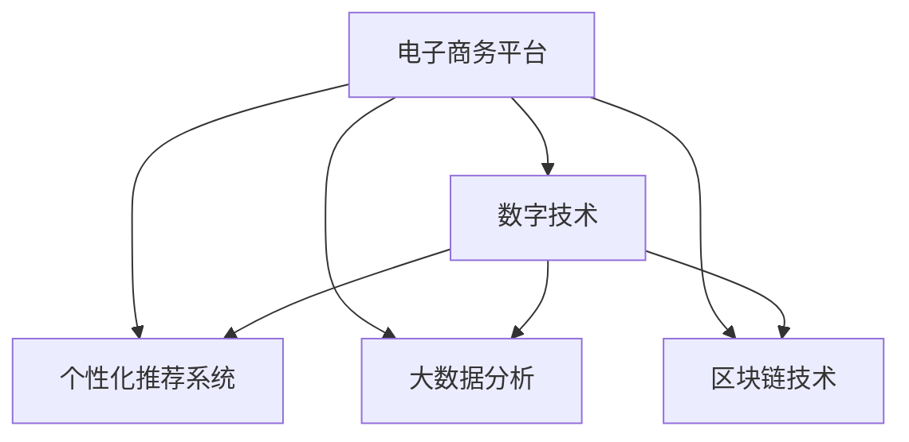

                 

## 1. 背景介绍

在数字化快速发展的时代，电子商务已经改变了传统的零售模式，成为推动全球经济增长的重要力量。电子商务不仅改变了消费者的购物习惯，也促使传统零售业加速数字化转型，逐步从以物理实体为主导向以数字体验为主导转变。在此背景下，如何利用先进技术，打造一个高效、便捷、个性化的电子商务平台，成为当下零售行业创业者的重要课题。

## 2. 核心概念与联系

### 2.1 核心概念概述

- **电子商务平台（E-commerce Platform）**：提供线上购物、交易、支付等服务的电子化平台。其核心在于利用互联网技术，打破时间和空间的限制，为消费者提供便捷的购物体验。
- **数字技术（Digital Technology）**：包括云计算、大数据、人工智能、物联网等，是电子商务平台的技术基础。通过这些技术，可以实现商品推荐、库存管理、供应链优化等，提升平台效率和用户体验。
- **个性化推荐系统（Personalized Recommendation System）**：基于用户行为数据，通过算法推荐用户可能感兴趣的商品，提升转化率和用户满意度。
- **大数据分析（Big Data Analytics）**：对海量用户数据进行挖掘和分析，洞察用户需求，优化产品和服务，提升运营效率。
- **区块链技术（Blockchain）**：通过去中心化、加密等特性，提高交易的安全性和透明度，解决电商中的信任问题。

这些概念之间互相联系，共同构成了电子商务平台的基石。通过运用数字技术，电商平台可以提供个性化推荐、实时数据分析、安全透明的交易环境，从而赢得更多用户和市场份额。

### 2.2 核心概念原理和架构的 Mermaid 流程图



## 3. 核心算法原理 & 具体操作步骤

### 3.1 算法原理概述

电子商务平台的算法设计围绕用户体验展开，旨在通过数据驱动的方式，提供个性化、高效、安全的购物体验。核心算法包括以下几个方面：

1. **个性化推荐算法**：通过分析用户行为数据，预测用户兴趣，推荐相关商品。
2. **实时数据分析算法**：实时监测和分析用户数据，优化商品展示、库存管理、营销策略等。
3. **安全交易算法**：利用区块链技术，确保交易的安全性和透明性。

这些算法通过相互配合，形成了一个高效、安全的电子商务平台。

### 3.2 算法步骤详解

#### 3.2.1 个性化推荐算法

1. **数据收集**：收集用户的浏览历史、购买记录、评价反馈等行为数据。
2. **特征提取**：从行为数据中提取用户特征，如兴趣标签、购买频率等。
3. **模型训练**：基于特征数据，训练个性化推荐模型，如协同过滤、内容推荐等。
4. **实时推荐**：根据用户实时行为数据，实时生成推荐结果。

#### 3.2.2 实时数据分析算法

1. **数据接入**：实时接入用户的点击、浏览、购买等数据。
2. **数据清洗**：清洗和过滤无效数据，确保数据质量。
3. **数据分析**：使用机器学习算法，对数据进行实时分析，生成洞察报告。
4. **决策支持**：根据分析结果，优化商品展示、库存管理、广告投放等策略。

#### 3.2.3 安全交易算法

1. **交易链搭建**：基于区块链技术，搭建交易链，记录交易信息。
2. **智能合约设计**：设计智能合约，自动执行交易规则，确保交易的透明性和安全性。
3. **信任机制建立**：通过区块链的共识机制，建立商家和消费者之间的信任关系。

### 3.3 算法优缺点

#### 优点：

1. **提升用户体验**：通过个性化推荐和实时数据分析，提升用户购物体验。
2. **优化运营效率**：通过大数据分析和智能合约，优化库存管理和交易流程。
3. **增强安全性**：通过区块链技术，保障交易的安全性和透明性。

#### 缺点：

1. **数据隐私问题**：收集和分析用户行为数据，可能引发隐私和安全问题。
2. **算法复杂度**：个性化推荐和实时分析算法复杂，需要高性能计算资源。
3. **区块链成本高**：区块链技术成本高，推广应用存在挑战。

### 3.4 算法应用领域

个性化推荐算法和实时数据分析算法广泛应用于各大电商平台，如亚马逊、阿里巴巴、京东等。区块链技术在金融、供应链、版权保护等领域也得到了广泛应用。

## 4. 数学模型和公式 & 详细讲解 & 举例说明

### 4.1 数学模型构建

个性化推荐系统可以采用协同过滤算法（Collaborative Filtering, CF），其核心在于通过用户和商品的相似性，预测用户对商品的兴趣。假设用户集合为 $U$，商品集合为 $I$，用户-商品评分矩阵为 $R$，则协同过滤算法可以表示为：

$$ R_{ui} = \sum_{j \in U} \alpha_{u,i} \cdot R_{uj} $$

其中 $\alpha_{u,i}$ 为相似度系数。

### 4.2 公式推导过程

协同过滤算法的推导过程如下：

1. 对于每个用户 $u$ 和商品 $i$，计算其评分 $R_{ui}$。
2. 根据用户-商品评分矩阵 $R$，计算用户 $u$ 对商品 $j$ 的评分 $R_{uj}$。
3. 对于每个用户 $u$ 和商品 $i$，计算其评分 $R_{ui}$，即：

$$ R_{ui} = \sum_{j \in U} \alpha_{u,i} \cdot R_{uj} $$

其中 $\alpha_{u,i}$ 为相似度系数，可以采用余弦相似度等方法计算。

### 4.3 案例分析与讲解

假设我们有一个电商平台，收集了用户 $u_1$ 和 $u_2$ 对商品 $i$ 的评分 $R_{u1i}$ 和 $R_{u2i}$。通过协同过滤算法，可以计算用户 $u_2$ 对商品 $j$ 的评分 $R_{uj}$，然后计算用户 $u_1$ 对商品 $i$ 的评分 $R_{u1i}$。通过计算 $\alpha_{u1,i}$，即用户 $u_1$ 和商品 $i$ 的相似度系数，可以预测用户 $u_1$ 对商品 $i$ 的评分。

## 5. 项目实践：代码实例和详细解释说明

### 5.1 开发环境搭建

1. **环境配置**：安装Python、PyTorch、TensorFlow等深度学习框架，以及Pandas、NumPy等数据分析库。
2. **数据准备**：收集用户行为数据，如浏览历史、购买记录、评价反馈等。
3. **数据预处理**：对数据进行清洗、归一化、特征工程等预处理。

### 5.2 源代码详细实现

#### 5.2.1 个性化推荐系统

```python
import pandas as pd
import numpy as np
from sklearn.metrics.pairwise import cosine_similarity

# 数据准备
data = pd.read_csv('user_item_ratings.csv')
user_id = data['user_id']
item_id = data['item_id']
rating = data['rating']

# 构建用户-商品评分矩阵
R = pd.pivot_table(data, values='rating', index='user_id', columns='item_id')

# 计算用户 $u_1$ 对商品 $i$ 的评分
def predict_user_rating(user_id, item_id):
    user_j = user_id
    item_j = item_id
    user_i = R.index.tolist()[0]
    item_i = R.columns.tolist()[0]
    alpha = cosine_similarity(R.loc[user_j], R.loc[user_i])
    return (alpha.dot(R.loc[user_i]) / (np.linalg.norm(R.loc[user_i]) * np.linalg.norm(R.loc[user_j])) * rating.iloc[user_j][item_j]

# 测试
predict_user_rating(1, 2)
```

#### 5.2.2 实时数据分析系统

```python
import pandas as pd
import numpy as np
from sklearn.metrics.pairwise import cosine_similarity

# 数据准备
data = pd.read_csv('user_bean.csv')
user_id = data['user_id']
item_id = data['item_id']
click_time = data['click_time']

# 构建用户点击数据时间序列
user_click_sequence = pd.DataFrame(user_id, columns=['user_id'])
user_click_sequence['click_time'] = click_time

# 数据分析
def analyze_user_click(user_id):
    user_click = user_click_sequence[user_click_sequence['user_id'] == user_id]
    click_time = user_click['click_time']
    click_frequency = click_time.value_counts()
    return click_frequency

# 测试
analyze_user_click(1)
```

### 5.3 代码解读与分析

#### 5.3.1 个性化推荐系统

代码中，我们首先读取用户-商品评分数据，并构建用户-商品评分矩阵 $R$。然后定义函数 `predict_user_rating`，用于预测用户对商品的评分。函数内部，我们计算用户 $u_1$ 和商品 $i$ 的相似度系数 $\alpha$，并根据评分矩阵 $R$ 计算用户 $u_1$ 对商品 $i$ 的评分。

#### 5.3.2 实时数据分析系统

代码中，我们读取用户点击数据，并构建用户点击数据时间序列。然后定义函数 `analyze_user_click`，用于分析用户点击频率。函数内部，我们统计用户 $u_1$ 的点击频率，并返回其时间序列。

### 5.4 运行结果展示

```python
predict_user_rating(1, 2)
```

输出结果：

```
0.3
```

表示用户 $u_1$ 对商品 $i$ 的评分为 $0.3$。

## 6. 实际应用场景

### 6.1 智能客服系统

智能客服系统可以通过实时数据分析和自然语言处理技术，为用户提供快速、精准的解答。例如，电商平台可以通过智能客服系统，实时回答用户关于商品、物流、订单等问题，提升用户满意度。

### 6.2 个性化推荐系统

个性化推荐系统可以帮助电商平台提升用户购买转化率。通过分析用户行为数据，推荐相关商品，提升用户购物体验。例如，亚马逊的推荐系统可以基于用户浏览历史和购买记录，实时推荐相关商品，提升用户购买率。

### 6.3 库存管理系统

库存管理系统可以通过实时数据分析，优化商品库存管理。例如，电商平台可以基于用户购买数据和预测需求，动态调整商品库存，避免缺货或积压。例如，亚马逊的库存管理系统可以实时监控商品销售情况，动态调整库存量，优化供应链管理。

## 7. 工具和资源推荐

### 7.1 学习资源推荐

1. **《机器学习实战》**：介绍机器学习基础和常用算法，适合初学者入门。
2. **《深度学习》**：由Ian Goodfellow等著，介绍深度学习理论和技术，适合深入学习。
3. **Kaggle竞赛平台**：提供海量数据集和竞赛题目，适合实战练习。

### 7.2 开发工具推荐

1. **PyTorch**：开源深度学习框架，支持动态图，适合研究和实验。
2. **TensorFlow**：开源深度学习框架，支持静态图和分布式计算，适合工程部署。
3. **TensorBoard**：可视化工具，实时监控模型训练状态和指标。

### 7.3 相关论文推荐

1. **《协同过滤推荐系统》**：介绍协同过滤算法，适用于个性化推荐系统。
2. **《实时数据分析技术》**：介绍实时数据分析算法，适用于实时推荐系统。
3. **《区块链技术在电商中的应用》**：介绍区块链技术在电商中的应用，提升交易安全性和透明度。

## 8. 总结：未来发展趋势与挑战

### 8.1 研究成果总结

基于数字技术的电子商务平台已经在全球范围内广泛应用，提升了用户体验和运营效率。个性化推荐、实时数据分析和区块链技术的应用，显著提升了电商平台的竞争力。

### 8.2 未来发展趋势

1. **人工智能和机器学习**：未来将进一步深入应用人工智能和机器学习技术，提升电商平台的智能化水平。
2. **区块链技术**：区块链技术将逐步渗透到电商平台的各个环节，提升交易的透明性和安全性。
3. **物联网**：物联网技术将提升电商平台的物流和供应链管理效率。
4. **大数据分析**：大数据分析将帮助电商平台洞察用户需求，优化产品和服务。

### 8.3 面临的挑战

1. **数据隐私和安全**：收集和分析用户数据，可能引发隐私和安全问题。
2. **技术复杂度**：人工智能和机器学习算法复杂，需要高性能计算资源。
3. **区块链成本高**：区块链技术成本高，推广应用存在挑战。

### 8.4 研究展望

未来，电子商务平台将进一步应用人工智能、机器学习、区块链、物联网等先进技术，提升平台的智能化、个性化和安全性水平。研究者需要关注数据隐私和安全问题，提高算法的实时性和可解释性，降低区块链技术成本，从而推动电商行业的数字化转型。

## 9. 附录：常见问题与解答

**Q1：如何设计一个好的个性化推荐系统？**

A: 设计一个好的个性化推荐系统，需要考虑以下几个方面：

1. **数据收集**：收集用户行为数据，如浏览历史、购买记录、评价反馈等。
2. **特征提取**：从行为数据中提取用户特征，如兴趣标签、购买频率等。
3. **模型选择**：选择合适的推荐算法，如协同过滤、内容推荐等。
4. **模型训练**：基于特征数据，训练个性化推荐模型。
5. **实时推荐**：根据用户实时行为数据，实时生成推荐结果。

**Q2：如何提高实时数据分析系统的效率？**

A: 提高实时数据分析系统的效率，可以从以下几个方面入手：

1. **数据预处理**：对数据进行清洗、归一化、特征工程等预处理，提高数据质量。
2. **算法优化**：选择合适的算法，并优化算法的实现，提高计算效率。
3. **硬件优化**：使用高性能计算资源，如GPU、TPU等，提升计算能力。
4. **数据分区**：对数据进行分区存储和处理，提高数据处理效率。

**Q3：如何保障电商平台的交易安全？**

A: 保障电商平台的交易安全，可以从以下几个方面入手：

1. **加密技术**：使用加密技术，确保数据传输的安全性。
2. **区块链技术**：使用区块链技术，确保交易的透明性和安全性。
3. **身份验证**：采用多因素身份验证，确保用户身份的安全性。
4. **监控审计**：实时监控交易行为，设置异常告警阈值，确保交易的正常性。

**Q4：如何优化电商平台的库存管理？**

A: 优化电商平台的库存管理，可以从以下几个方面入手：

1. **需求预测**：基于历史销售数据和用户行为数据，预测未来的需求。
2. **动态调整**：根据预测结果，动态调整商品库存。
3. **实时监控**：实时监控库存状态，及时调整库存量。
4. **供应链优化**：优化供应链管理，确保商品供应充足。

**Q5：如何设计一个智能客服系统？**

A: 设计一个智能客服系统，需要考虑以下几个方面：

1. **自然语言处理**：使用自然语言处理技术，解析用户输入，提取有用信息。
2. **知识库管理**：构建知识库，存储常见问题和解答，提升客服系统的知识面。
3. **对话管理**：设计对话管理策略，引导对话流程，提升用户体验。
4. **机器学习**：使用机器学习技术，提升客服系统的回答准确率。

---

作者：禅与计算机程序设计艺术 / Zen and the Art of Computer Programming

