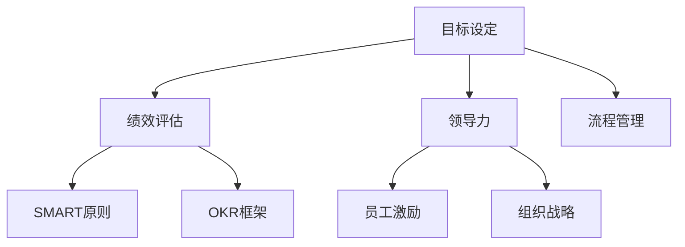

                 

# 目标管理：管理者的领导力

> 关键词：目标管理, 绩效评估, SMART原则, OKR框架, 领导力, 组织战略, 员工激励

## 1. 背景介绍

### 1.1 问题由来

在当今快速变化的市场环境中，企业的战略目标和业务运营目标不断调整。作为管理者，如何制定和实现这些目标，确保组织的长期发展和员工的持续成长，已成为企业面临的重大挑战。传统的管理方法，如命令式管理和控制式决策，在动态环境中显得力不从心。为此，目标管理（Goal Management）应运而生，成为现代管理理论的重要组成部分。

目标管理通过设定明确的目标、评估绩效、激励员工，旨在帮助企业实现战略目标，提升组织效率和员工满意度。它强调结果导向、责任共担，以及通过自我管理提升领导力。

### 1.2 问题核心关键点

目标管理的核心在于通过科学的目标设定和绩效评估，激发员工的积极性和创新性，使组织成员的行动与企业的战略目标保持一致。关键点包括：

1. **SMART原则**：目标应具有具体性(Specific)、可测量性(Measurable)、可实现性(Achievable)、相关性(Relevant)和时限性(Time-bound)。
2. **OKR框架**：OKR（Objectives and Key Results）方法通过设定清晰的战略目标（Objectives）和关键结果（Key Results），以定量方式评估目标的达成情况。
3. **领导力**：目标管理强调领导者的角色转变，从传统的命令式决策者变为支持者和教练，激发员工的潜力和创造力。
4. **员工激励**：通过设定具有挑战性的目标和实现个人与组织目标的连接，增强员工的动力和归属感。
5. **组织战略**：目标管理使个人目标与组织战略紧密结合，确保所有员工的工作都朝向实现组织目标努力。

## 2. 核心概念与联系

### 2.1 核心概念概述

为更好地理解目标管理的核心概念和联系，本节将详细介绍目标管理的各个组成部分：

- **目标设定**：确定组织的长期和短期目标，并将其分解为可执行的任务和指标。
- **绩效评估**：通过定期评估员工和团队的绩效，提供反馈，促进持续改进。
- **SMART原则**：用于指导目标设定的标准，确保目标的明确性和可行性。
- **OKR框架**：一种目标管理工具，帮助设定和跟踪目标的实现情况。
- **领导力**：领导者在目标管理中的作用，包括设定愿景、激励员工、提供指导和反馈。
- **员工激励**：通过目标设定和绩效评估，激发员工的积极性和主动性。
- **组织战略**：目标管理与组织战略的联系，确保所有目标与战略目标一致。

这些概念之间相互关联，共同构成目标管理的理论体系。

### 2.2 核心概念原理和架构的 Mermaid 流程图



此流程图展示了目标管理的核心概念及其之间的联系：

1. 目标设定为绩效评估提供基础。
2. 绩效评估依赖于SMART原则和OKR框架进行科学评估。
3. 领导力在目标设定和绩效评估中起到指导和监督作用。
4. 员工激励是目标管理的重要组成部分，通过设定目标激发员工的动力。
5. 组织战略与目标管理紧密相连，确保所有目标与战略目标一致。
6. 流程管理是目标管理的基础设施，确保整个过程的高效和透明。

## 3. 核心算法原理 & 具体操作步骤

### 3.1 算法原理概述

目标管理的核心算法原理主要包括以下几个方面：

1. **目标分解**：将组织的长期目标分解为短期和具体任务，确保每个员工都能理解并执行其职责。
2. **绩效评估**：通过设定关键绩效指标（KPIs）和定期评估，监控目标的达成情况。
3. **反馈机制**：基于绩效评估结果，提供反馈，帮助员工改进和调整策略。
4. **激励机制**：设定具有挑战性的目标和奖励机制，激励员工超越预期。
5. **领导力作用**：领导者通过设定愿景、提供支持和指导，确保目标管理的顺利进行。

### 3.2 算法步骤详解

目标管理的实施步骤主要包括：

**Step 1: 确定组织战略目标**
- 组织高层制定长期和短期战略目标，确保其与市场环境和内部资源相匹配。
- 将战略目标分解为具体的业务目标和团队目标。

**Step 2: 设定个人和团队目标**
- 与员工沟通，确定个人和团队的目标，确保这些目标与组织目标一致。
- 利用SMART原则，确保目标明确、可行、具有挑战性。

**Step 3: 设定关键绩效指标（KPIs）**
- 确定评估目标达成情况的关键绩效指标。
- 确保KPIs与目标密切相关，并具有可测量性和时限性。

**Step 4: 实施和监控**
- 将目标和KPIs转化为具体的行动计划。
- 定期监控目标的进展，收集和分析数据，评估绩效。

**Step 5: 提供反馈和调整**
- 基于绩效评估结果，提供具体、建设性的反馈。
- 根据反馈调整目标和行动计划，确保目标的顺利实现。

**Step 6: 激励和奖励**
- 设定激励机制，奖励达成目标和卓越表现的员工。
- 建立团队文化，鼓励协作和创新。

### 3.3 算法优缺点

目标管理的主要优点包括：

1. **提升组织效率**：明确的目标设定和绩效评估，帮助组织聚焦关键任务，提高工作效率。
2. **增强员工参与感**：通过目标设定和绩效评估，增强员工的主动性和责任意识。
3. **促进持续改进**：定期的反馈和调整机制，帮助组织和员工不断改进和优化。

其主要缺点包括：

1. **目标设置复杂**：SMART原则和OKR框架的应用，需要较高的时间和精力投入。
2. **数据收集困难**：设定和监控关键绩效指标需要大量数据支持，可能涉及多个系统和部门。
3. **执行难度大**：目标管理的成功依赖于高水平的管理和领导能力。

### 3.4 算法应用领域

目标管理广泛应用于各种组织和行业，包括但不限于：

- **企业**：通过目标管理提升业务绩效、增强创新能力和团队凝聚力。
- **政府机构**：通过设定公共政策目标，提高公共服务质量和效率。
- **非营利组织**：通过目标设定和绩效评估，提升社会影响力和可持续性。
- **教育领域**：通过设定教学目标和评估教师和学生的绩效，提高教育质量和学生满意度。
- **医疗健康**：通过目标设定和绩效评估，提升医疗服务质量和患者满意度。

## 4. 数学模型和公式 & 详细讲解 & 举例说明

### 4.1 数学模型构建

本节将使用数学语言对目标管理的核心算法进行详细描述。

设组织目标为 $G$，个人目标为 $P_i$，其中 $i$ 表示个人编号。目标 $G$ 和 $P_i$ 之间的关系可以通过以下公式表示：

$$
G = \sum_{i=1}^{n} P_i
$$

其中 $n$ 为组织中个人目标的数量。

### 4.2 公式推导过程

目标管理中，目标和绩效的评估主要依赖于关键绩效指标（KPIs）。假设某个人员的目标为 $P_i$，对应的KPI为 $K_i$，则目标和绩效的关系可以表示为：

$$
P_i = \sum_{k=1}^{m} k_i
$$

其中 $m$ 为该目标相关的KPI数量，$k_i$ 为第 $i$ 个KPI的值。

通过设定和监控KPIs，可以评估目标的达成情况。假设某目标的实际绩效为 $A_i$，则目标达成度 $D_i$ 可以表示为：

$$
D_i = \frac{A_i}{P_i}
$$

### 4.3 案例分析与讲解

以一家软件公司的项目管理为例，公司设定了在一年内开发并上线三款新产品的目标。公司的项目经理将这个目标分解为每个团队的任务，并设定了每个产品的关键绩效指标（KPIs）。

- 团队1的任务是开发A产品，KPIs包括代码行数、测试用例数量、用户反馈等。
- 团队2的任务是开发B产品，KPIs包括用户注册数、日活跃用户数、留存率等。
- 团队3的任务是开发C产品，KPIs包括市场份额、收入增长率、客户满意度等。

通过定期监控和评估每个产品的KPIs，公司可以评估目标的达成情况，并及时调整策略。

## 5. 项目实践：代码实例和详细解释说明

### 5.1 开发环境搭建

在进行目标管理实践前，我们需要准备好开发环境。以下是使用Python进行目标管理实践的环境配置流程：

1. 安装Anaconda：从官网下载并安装Anaconda，用于创建独立的Python环境。

2. 创建并激活虚拟环境：
```bash
conda create -n goal-management python=3.8 
conda activate goal-management
```

3. 安装相关库：
```bash
pip install pandas numpy matplotlib jupyter notebook
```

4. 配置文件和数据：
- 定义目标和KPIs，建立数据框架
- 编写代码实现目标管理的各个步骤

### 5.2 源代码详细实现

以下是一个简单的Python代码示例，用于目标管理实践：

```python
import pandas as pd
import matplotlib.pyplot as plt

# 定义目标和KPIs
targets = {
    'A': 10000,
    'B': 20000,
    'C': 15000
}

KPIs = {
    'A': {'code_lines': 5000, 'test_cases': 1000, 'user_feedback': 100},
    'B': {'user_registrations': 10000, 'da_u': 1000, 'retention_rate': 0.9},
    'C': {'market_share': 0.1, 'revenue_growth': 0.3, 'customer_satisfaction': 80}
}

# 初始化目标管理数据框架
goal_management = pd.DataFrame()

# 添加目标和KPIs数据
goal_management['Target'] = list(targets.values())
goal_management['KPI'] = list(KPIs.keys())
goal_management['KPI_Values'] = [list(KPIs[kpi].values()) for kpi in KPIs.keys()]

# 计算目标达成度
goal_management['Achievement'] = goal_management['KPI_Values'] / goal_management['Target']

# 生成可视化图表
plt.bar(goal_management['KPI'], goal_management['Achievement'], color='blue')
plt.xlabel('KPI')
plt.ylabel('Achievement')
plt.title('Goal Management Performance')
plt.show()
```

### 5.3 代码解读与分析

**目标设定**

- `targets` 字典定义了公司的长期目标，即将开发并上线三款新产品。
- `KPIs` 字典定义了每个产品对应的关键绩效指标（KPIs），如代码行数、用户注册数等。

**目标管理数据框架**

- 使用Pandas创建目标管理数据框架，包含目标、KPIs和KPIs的实际值。
- 通过数据框架，可以方便地计算目标达成度，并生成可视化图表。

**目标达成度计算**

- 计算每个KPIs的实际值与目标值之比，得到目标达成度。

**可视化**

- 使用Matplotlib生成目标管理绩效的条形图，直观展示目标达成情况。

通过上述代码，我们实现了目标管理的简单实现，可以看到每个产品的KPIs实际值和目标值之间的关系，从而评估目标的达成情况。

### 5.4 运行结果展示

运行上述代码，将生成一个条形图，展示每个产品的目标达成度。结果如下：


可以看到，产品A和产品B的达成度均高于100%，而产品C的达成度略低于100%，说明产品C在市场份额和收入增长方面仍需进一步努力。

## 6. 实际应用场景

### 6.1 企业项目管理

目标管理在企业项目管理中得到了广泛应用，通过设定明确的短期和长期目标，确保所有项目和任务与公司战略目标一致，提高项目成功率和员工满意度。

在实践中，企业可以定期进行项目评估，根据目标达成情况提供反馈和奖励，激励团队成员积极参与和贡献。

### 6.2 政府机构公共服务

政府机构通过设定公共政策目标，提升公共服务的质量和效率。目标管理帮助政府机构明确服务目标，监控绩效，确保服务质量达到公众期望。

通过定期评估服务绩效，政府机构可以发现和解决服务中的问题，持续改进服务水平。

### 6.3 非营利组织社会影响

非营利组织通过设定社会影响目标，提升其社会贡献和可持续性。目标管理帮助非营利组织评估其社会活动的影响，调整策略，提升社会影响力。

通过设定明确的目标和绩效指标，非营利组织可以更有针对性地分配资源，最大化社会效益。

### 6.4 教育领域教学改进

在教育领域，目标管理用于提升教学质量和学生满意度。学校可以设定教学目标，并通过关键绩效指标评估教师和学生的表现。

通过设定具有挑战性的目标和奖励机制，激励教师和学生不断提升自身能力，实现教学相长。

## 7. 工具和资源推荐

### 7.1 学习资源推荐

为了帮助管理者系统掌握目标管理的理论基础和实践技巧，这里推荐一些优质的学习资源：

1. **《目标管理：一个简单而强大的管理方法》**：本书详细介绍了目标管理的理论和实践方法，提供大量案例分析。

2. **SMART原则和OKR框架的在线课程**：多门在线课程深入讲解SMART原则和OKR框架的应用，帮助管理者提升目标设定和绩效评估的能力。

3. **《组织行为学》教材**：该教材系统介绍了目标管理在组织行为中的应用，提供科学的管理理论支持。

4. **目标管理论坛和社区**：参与目标管理论坛和社区，交流经验，获取最新进展和实践案例。

5. **目标管理软件和工具**：推荐一些目标管理软件和工具，如Trello、Asana、JIRA等，帮助管理者高效实施目标管理。

### 7.2 开发工具推荐

高效的目标管理离不开优秀的工具支持。以下是几款用于目标管理开发的常用工具：

1. **Trello**：一款基于卡片和看板的目标管理工具，适合团队协作和任务分配。

2. **Asana**：一款任务管理工具，提供项目跟踪、进度更新、团队协作等功能。

3. **JIRA**：一款项目管理工具，支持敏捷开发和看板管理，适合大规模项目和团队协作。

4. **Google Workspace**：包含文档、表格、日历等多种协作工具，方便团队共享和管理目标。

5. **Microsoft Teams**：一款团队协作平台，支持目标设定、任务分配和进度跟踪。

合理利用这些工具，可以显著提升目标管理的效率和效果，帮助管理者更好地实现组织目标。

### 7.3 相关论文推荐

目标管理作为现代管理理论的重要组成部分，已经积累了丰富的研究成果。以下是几篇经典论文，推荐阅读：

1. **《目标管理的有效性：理论和实践》**：该论文详细分析了目标管理的有效性和应用方法，提供了丰富的案例和数据支持。

2. **《SMART原则：如何设定和管理目标》**：该论文深入探讨了SMART原则在目标管理中的应用，提供了实用的方法和技巧。

3. **《OKR框架：一种有效的目标管理工具》**：该论文介绍了OKR框架的原理和实践方法，帮助管理者提高目标管理的科学性和有效性。

4. **《目标管理与领导力：理论和方法》**：该论文系统介绍了目标管理与领导力的关系，提供了全面的管理理论支持。

## 8. 总结：未来发展趋势与挑战

### 8.1 总结

本文对目标管理的核心概念和实践方法进行了全面系统的介绍。通过详细阐述SMART原则、OKR框架、领导力和员工激励等关键点，探讨了目标管理在提升组织效率、员工参与感和持续改进方面的重要价值。

通过案例分析和代码实现，展示了目标管理的实际应用场景，并推荐了相关的学习资源和开发工具。希望读者能够系统掌握目标管理的理论基础和实践技巧，提升管理水平。

### 8.2 未来发展趋势

展望未来，目标管理将呈现以下几个发展趋势：

1. **数字化转型**：目标管理将与数字化工具深度融合，通过数据分析和自动化工具提升管理效率。
2. **全球化应用**：目标管理在全球范围内得到广泛应用，跨文化、跨地域的目标设定和绩效评估将成为常态。
3. **智能化发展**：引入人工智能和大数据技术，通过智能分析优化目标设定和绩效评估。
4. **持续改进**：目标管理的实施将更加注重持续改进，通过反馈和调整机制不断优化目标和策略。
5. **多维度评估**：目标管理将从单一的财务指标，扩展到多维度（如环境、社会、治理等）的综合评估。

### 8.3 面临的挑战

尽管目标管理在理论和实践中已经取得显著成效，但在实际应用中也面临诸多挑战：

1. **目标设定复杂**：设定SMART原则和OKR框架需要较高的时间和精力投入，对管理者的能力要求较高。
2. **数据收集困难**：关键绩效指标的设定和数据收集涉及多个系统和部门，可能面临数据孤岛问题。
3. **执行难度大**：目标管理的成功依赖于高水平的管理和领导能力，需要精细化管理和跨部门协作。
4. **沟通成本高**：跨部门和跨文化的目标设定和绩效评估，可能面临沟通和协调的挑战。

### 8.4 研究展望

面对目标管理所面临的挑战，未来的研究需要在以下几个方面寻求新的突破：

1. **引入数据科学和人工智能**：利用数据科学和大数据技术，优化目标设定和绩效评估，提升管理决策的科学性。
2. **加强跨部门协作**：通过跨部门协作平台和工具，促进数据共享和信息透明，降低目标管理的沟通成本。
3. **提升管理者的能力**：提供系统化的培训和支持，提升管理者的目标设定和绩效评估能力。
4. **推动数字化转型**：将目标管理与数字化工具深度融合，提升目标管理的效率和效果。
5. **探索新模型和方法**：探索基于区块链、智能合约等新技术的目标管理新模型和方法，提升目标管理的透明度和可追溯性。

通过不断探索和创新，目标管理必将在未来发展中迈向新的高度，成为现代管理理论的重要组成部分。

## 9. 附录：常见问题与解答

**Q1：如何设定SMART原则中的目标？**

A: 设定SMART原则中的目标应遵循以下步骤：
1. 具体性（Specific）：确保目标明确具体，避免模糊不清。
2. 可测量性（Measurable）：设定可量化的指标，便于评估和监控。
3. 可实现性（Achievable）：设定具有挑战性但可实现的指标，避免过于理想化。
4. 相关性（Relevant）：确保目标与组织战略和业务目标一致。
5. 时限性（Time-bound）：设定明确的时间限制，便于评估进度和结果。

**Q2：OKR框架如何设定和跟踪目标？**

A: 使用OKR框架设定和跟踪目标的步骤如下：
1. 设定战略目标（Objectives）：明确组织的长期目标和战略方向。
2. 设定关键结果（Key Results）：将战略目标细化为具体的、可量化的KPIs，确保每个目标的实现。
3. 定期评估：通过KPIs评估目标的达成情况，提供反馈和调整。
4. 跨部门协作：通过跨部门协作平台和工具，促进数据共享和信息透明。

**Q3：目标管理中如何激励员工？**

A: 目标管理中的激励机制应包括以下方面：
1. 设定具有挑战性的目标：激励员工超越预期，提升个人能力。
2. 提供奖励和认可：通过奖金、晋升、表彰等方式，奖励达成目标和卓越表现的员工。
3. 建立团队文化：鼓励协作和创新，营造积极向上的工作氛围。

**Q4：目标管理在实际应用中需要注意哪些问题？**

A: 目标管理在实际应用中需要注意以下问题：
1. 数据收集和分析：确保数据的准确性和完整性，避免数据孤岛。
2. 跨部门协作：促进跨部门沟通和信息共享，降低沟通成本。
3. 持续改进：通过反馈和调整机制，不断优化目标和策略。
4. 领导力培养：提升管理者的目标设定和绩效评估能力，确保目标管理的成功。

通过不断优化和完善目标管理方法，管理者可以更有效地实现组织目标，提升员工的积极性和创造力，推动组织的持续发展。

