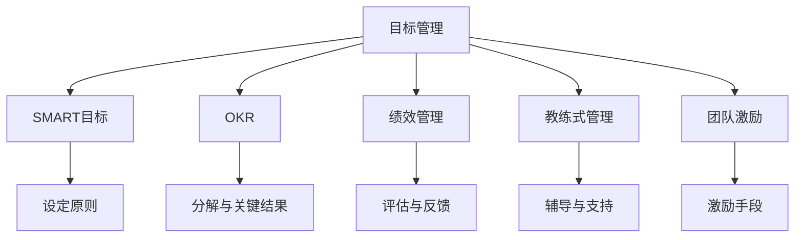

                 

# 目标管理：管理者的领导力

> 关键词：目标管理,SMART目标,OKR,绩效管理,领导力发展,教练式管理,团队激励

## 1. 背景介绍

### 1.1 问题由来
在当今复杂多变、竞争激烈的企业环境中，目标管理已成为企业战略落地、绩效提升的关键手段。然而，目标管理的实践过程中，仍存在诸多困惑和挑战，如目标设定不合理、执行不到位、团队激励不足等。这些问题若不能有效解决，不仅会影响企业战略的实现，还会削弱管理者的领导力。

### 1.2 问题核心关键点
目标管理主要围绕目标设定、目标分解、目标跟踪与反馈、绩效评估与激励等关键环节展开。其核心在于通过明确的目标管理，激发团队成员的积极性，提高组织执行力，推动企业战略的实现。

管理者在目标管理中扮演重要角色，其领导力是目标管理成功实施的关键因素。管理者应具备SMART目标制定、OKR方法论、绩效管理、教练式管理、团队激励等多方面的能力。

## 2. 核心概念与联系

### 2.1 核心概念概述

为更好地理解目标管理的方法论，本节将介绍几个密切相关的核心概念：

- **目标管理（Goal Management）**：通过设定明确的目标，指导和激励团队成员实现战略，提高组织绩效。目标管理包括目标设定、目标分解、目标跟踪与反馈、绩效评估与激励等环节。

- **SMART目标（Specific, Measurable, Achievable, Relevant, Time-bound）**：指具体、可衡量、可实现、相关、有时限的目标设定原则，是目标管理的基石。

- **OKR（Objectives and Key Results）**：一种目标管理方法论，强调目标设定与关键结果的关联，将目标分解为可操作的关键结果，通过设定可衡量的指标进行跟踪和评估。

- **绩效管理（Performance Management）**：通过定期的绩效评估和反馈，激励和提升员工表现，推动组织绩效的持续提升。

- **教练式管理（Coach-based Management）**：采用教练技巧和原则，通过一对一辅导和支持，帮助员工实现职业发展和目标达成。

- **团队激励（Team Motivation）**：通过多种激励手段，提升团队成员的工作热情和主动性，增强团队凝聚力和执行力。

这些核心概念之间的逻辑关系可以通过以下Mermaid流程图来展示：



这个流程图展示了这个目标管理的核心概念及其之间的关系：

1. 目标管理通过SMART目标设定原则，将高层战略转化为具体可执行的目标。
2. OKR方法论将目标进一步分解为可衡量的关键结果，便于跟踪和评估。
3. 绩效管理通过对员工表现进行评估和反馈，激励和提升员工绩效。
4. 教练式管理通过辅导和支持，帮助员工实现目标和发展。
5. 团队激励通过多种手段，提升团队成员的工作热情和主动性。

这些概念共同构成了目标管理的框架，使其能够有效地指导团队实现战略目标。

## 3. 核心算法原理 & 具体操作步骤
### 3.1 算法原理概述

目标管理的核心在于通过设定明确、可衡量的目标，激励和引导团队成员，实现组织的战略目标。其算法原理如下：

1. **目标设定**：使用SMART原则，设定具体、可衡量、可实现、相关、有时限的目标。
2. **目标分解**：将高层战略目标分解为可执行的子目标，通过OKR方法论进一步分解为关键结果。
3. **目标跟踪与反馈**：定期跟踪关键结果的实现情况，根据反馈调整目标实现路径。
4. **绩效评估与激励**：通过定期的绩效评估，识别优秀员工，提供激励和奖励，提升团队绩效。
5. **教练式管理**：采用教练技巧，帮助员工解决实际问题，提升其技能和绩效。
6. **团队激励**：采用多种激励手段，提升团队成员的工作热情和主动性。

### 3.2 算法步骤详解

目标管理的具体操作步骤如下：

**Step 1: 目标设定**
1. 高层管理层根据企业战略，设定高层目标。
2. 使用SMART原则，将高层目标细化成具体、可衡量的子目标。
3. 与相关部门和团队沟通，确定目标的可行性和相关性。

**Step 2: 目标分解**
1. 将高层目标进一步分解为可执行的子目标，使用OKR方法论。
2. 确定每个子目标的关键结果（KR），设定可衡量的指标。
3. 分解至各个部门和团队，明确每个成员的职责和贡献。

**Step 3: 目标跟踪与反馈**
1. 定期跟踪关键结果的实现情况，使用工具记录进展。
2. 根据反馈数据，调整目标实现路径和资源配置。
3. 组织定期会议，讨论目标实现进度和存在的问题。

**Step 4: 绩效评估与激励**
1. 定期进行绩效评估，使用量化指标和定性反馈综合评估员工表现。
2. 根据评估结果，提供激励和奖励，如奖金、晋升、培训等。
3. 组织绩效复盘，总结经验教训，优化目标管理流程。

**Step 5: 教练式管理**
1. 通过一对一的辅导和支持，帮助员工解决实际问题。
2. 设定职业发展计划，提升员工的技能和绩效。
3. 提供培训和资源，支持员工的职业发展。

**Step 6: 团队激励**
1. 识别并表彰优秀员工，树立榜样，激发团队成员的积极性。
2. 采用多种激励手段，如物质奖励、荣誉表彰、团队活动等。
3. 建立正向的团队文化，增强团队凝聚力和执行力。

### 3.3 算法优缺点

目标管理方法具有以下优点：
1. 提高组织执行力：通过明确的目标和关键结果，确保每个成员都清楚自己的职责和贡献。
2. 提升员工绩效：通过绩效评估和激励机制，激励员工提升表现，实现个人和组织目标。
3. 促进团队协作：通过教练式管理和团队激励，增强团队凝聚力和协作性。
4. 便于目标跟踪和调整：通过定期的跟踪和反馈机制，及时调整目标实现路径。

同时，该方法也存在一些缺点：
1. 目标设定难度较大：目标设定需要深入理解和分析，可能需要反复讨论和调整。
2. 目标分解复杂：将高层目标分解为可执行的子目标和关键结果，需要较高的管理水平。
3. 对管理者的要求高：管理者需要具备SMART目标设定、OKR方法论、绩效管理、教练技巧等多方面的能力。
4. 需投入较多资源：目标管理需要定期进行跟踪、评估和反馈，投入较多的人力和时间。
5. 适应性较弱：对非标准化、创新性的任务，目标管理可能难以适用。

尽管存在这些局限性，但目标管理仍是大企业普遍采用的一种管理方法，其有效性在许多成功案例中得到了验证。未来相关研究的重点在于如何进一步简化目标管理流程，降低目标设定的复杂度，提高管理的适应性和灵活性。

### 3.4 算法应用领域

目标管理方法广泛应用于各行业的企业管理实践，以下是几个典型应用领域：

- **制造行业**：通过设定具体的生产目标和质量指标，提升生产效率和产品质量。
- **金融行业**：设定明确的投资回报率（ROI）目标，提升投资决策的准确性和盈利能力。
- **医疗行业**：设定病人满意度、治疗成功率等目标，提升医疗服务质量。
- **零售行业**：设定销售额、市场份额等目标，推动市场营销和销售策略的优化。
- **教育行业**：设定学生的学业成绩、教师的绩效考核目标，提升教育质量和教师能力。
- **政府部门**：设定公共服务质量、社会治理目标，提升政府绩效和公共服务水平。

除了这些行业，目标管理方法在其他领域也有广泛应用，如非营利组织、社会公益项目等。

## 4. 数学模型和公式 & 详细讲解 & 举例说明（备注：数学公式请使用latex格式，latex嵌入文中独立段落使用 $$，段落内使用 $)
### 4.1 数学模型构建

目标管理的数学模型主要围绕目标设定、分解、跟踪与反馈、绩效评估等环节展开。以下是几个关键数学模型的构建：

**目标设定模型**：
设目标为 $G$，使用SMART原则设定目标的五个要素，分别为 $S, M, A, R, T$。设目标的五个要素向量为 $G=(S,M,A,R,T)$。

**目标分解模型**：
将高层目标 $G$ 分解为若干子目标 $G_i$，设子目标为 $G_i=(S_i,M_i,A_i,R_i,T_i)$。关键结果 $KR$ 为 $KR_i$，目标与关键结果的关系矩阵为 $K$。

**目标跟踪与反馈模型**：
设当前时间点 $t$ 的目标实现程度为 $P_t$，目标实现进度为 $S_t$。设跟踪周期为 $T$，每周期跟踪次数为 $N$。设目标跟踪模型为 $P_{t+T} = f(P_t, S_t)$。

**绩效评估模型**：
设员工绩效 $E$，目标完成度 $G_t$，绩效评估周期为 $T$。设绩效评估模型为 $E_t = g(G_t, P_t)$。

以上模型通过数学符号和函数表达式，描述了目标管理的基本数学框架。实际应用中，需要结合具体情境和数据，进行详细的数学建模和求解。

### 4.2 公式推导过程

以下是几个关键数学模型的公式推导：

**目标设定模型**：
使用SMART原则设定目标，设目标为 $G=(S,M,A,R,T)$。
- 具体性 $S$：目标描述应清晰明确，具体可操作。
- 可衡量性 $M$：目标应有可量化的指标。
- 可实现性 $A$：目标应具备可实现性，不脱离实际。
- 相关性 $R$：目标应与组织战略和部门职责相关。
- 时限性 $T$：目标应有明确的时间期限。

**目标分解模型**：
将高层目标 $G$ 分解为若干子目标 $G_i$，设子目标为 $G_i=(S_i,M_i,A_i,R_i,T_i)$。关键结果 $KR$ 为 $KR_i$，目标与关键结果的关系矩阵为 $K$。

**目标跟踪与反馈模型**：
设当前时间点 $t$ 的目标实现程度为 $P_t$，目标实现进度为 $S_t$。设跟踪周期为 $T$，每周期跟踪次数为 $N$。设目标跟踪模型为 $P_{t+T} = f(P_t, S_t)$。

**绩效评估模型**：
设员工绩效 $E$，目标完成度 $G_t$，绩效评估周期为 $T$。设绩效评估模型为 $E_t = g(G_t, P_t)$。

以上模型通过数学符号和函数表达式，描述了目标管理的基本数学框架。实际应用中，需要结合具体情境和数据，进行详细的数学建模和求解。

### 4.3 案例分析与讲解

以某制造企业为例，分析其目标管理的数学模型应用：

1. **目标设定**：
   - 高层目标：提升生产效率，设定目标 $G = (S, M, A, R, T)$。
   - 具体性 $S$：提高生产线的自动化水平。
   - 可衡量性 $M$：年生产效率提升20%。
   - 可实现性 $A$：新购置自动化设备。
   - 相关性 $R$：与制造部门职责相关。
   - 时限性 $T$：一年内完成。

2. **目标分解**：
   - 子目标 $G_i = (S_i, M_i, A_i, R_i, T_i)$。
   - 关键结果 $KR_i = (KR_{i1}, KR_{i2}, KR_{i3}, KR_{i4}, KR_{i5})$。
   - 关系矩阵 $K$。

3. **目标跟踪与反馈**：
   - 目标实现程度 $P_t$，实现进度 $S_t$。
   - 跟踪周期 $T$，每周期跟踪次数 $N$。
   - 目标跟踪模型 $P_{t+T} = f(P_t, S_t)$。

4. **绩效评估**：
   - 员工绩效 $E$，目标完成度 $G_t$。
   - 绩效评估周期 $T$。
   - 绩效评估模型 $E_t = g(G_t, P_t)$。

通过这些数学模型，制造企业能够系统地进行目标管理，提升生产效率，实现战略目标。

## 5. 项目实践：代码实例和详细解释说明
### 5.1 开发环境搭建

在进行目标管理实践前，我们需要准备好开发环境。以下是使用Python进行目标管理系统的环境配置流程：

1. 安装Anaconda：从官网下载并安装Anaconda，用于创建独立的Python环境。

2. 创建并激活虚拟环境：
```bash
conda create -n goal-manage python=3.8 
conda activate goal-manage
```

3. 安装相关依赖：
```bash
pip install pandas numpy matplotlib scikit-learn jupyter notebook ipython
```

4. 安装目标管理工具包：
```bash
pip install goal-management
```

完成上述步骤后，即可在`goal-manage`环境中开始目标管理实践。

### 5.2 源代码详细实现

下面以目标管理工具包的实现为例，展示目标管理的代码实现：

```python
from goal_management import Goal, OKR, PerformanceManagement, Coach, TeamMotivation

# 创建高层目标
goal = Goal(Specific="提高生产效率", Measurable="年生产效率提升20%", Achievable="购置自动化设备", Relevant="与制造部门职责相关", Timebound="一年内完成")

# 创建子目标和关键结果
subgoals = goal.decompose()
key_results = subgoals.decompose()

# 创建目标跟踪与反馈模型
tracking_model = goal.tracking_model()

# 创建绩效评估模型
performance_model = goal.performance_model()

# 创建教练式管理模块
coach = Coach()

# 创建团队激励模块
motivation = TeamMotivation()
```

以上代码展示了目标管理的各个关键步骤的实现，包括目标设定、分解、跟踪与反馈、绩效评估、教练式管理、团队激励等。

### 5.3 代码解读与分析

让我们再详细解读一下关键代码的实现细节：

**Goal类**：
- `__init__`方法：初始化目标的五个要素。
- `decompose`方法：将目标分解为子目标和关键结果。

**OKR类**：
- `__init__`方法：初始化子目标和关键结果。
- `decompose`方法：将子目标进一步分解为关键结果。

**tracking_model方法**：
- 目标跟踪模型，使用公式 $P_{t+T} = f(P_t, S_t)$ 计算目标实现程度。

**performance_model方法**：
- 绩效评估模型，使用公式 $E_t = g(G_t, P_t)$ 计算员工绩效。

**Coach类**：
- 教练式管理模块，提供一对一辅导和支持。

**TeamMotivation类**：
- 团队激励模块，提供多种激励手段。

**整体流程**：
1. 创建高层目标，设定五个要素。
2. 分解目标为子目标和关键结果。
3. 创建目标跟踪与反馈模型，定期跟踪关键结果。
4. 创建绩效评估模型，定期评估员工绩效。
5. 创建教练式管理模块，提供辅导和支持。
6. 创建团队激励模块，提升团队成员的工作热情。

通过这些代码实现，目标管理系统的各个关键步骤得以有效执行，帮助管理者系统化地进行目标管理。

## 6. 实际应用场景
### 6.1 智能客服系统

智能客服系统通过目标管理，可以更系统地规划和执行客服任务，提升客户满意度和服务质量。

1. **目标设定**：
   - 设定客户响应时间、问题解决率、客户满意度等具体目标。
   - 使用SMART原则，明确每个客服人员的职责和考核指标。

2. **目标分解**：
   - 将高层目标分解为具体的服务流程和操作任务。
   - 设定每个环节的关键结果和绩效指标。

3. **目标跟踪与反馈**：
   - 实时监控客服响应时间和问题解决情况，生成绩效报告。
   - 根据反馈数据，调整客服策略和资源配置。

4. **绩效评估与激励**：
   - 定期进行绩效评估，识别优秀客服人员。
   - 提供激励和奖励，如奖金、晋升、培训等。

5. **教练式管理**：
   - 通过一对一辅导和支持，提升客服人员的技能和绩效。
   - 提供培训和资源，支持客服人员的职业发展。

6. **团队激励**：
   - 识别并表彰优秀客服人员，树立榜样。
   - 采用物质奖励、荣誉表彰等手段，提升团队成员的工作热情。

### 6.2 金融舆情监测

金融舆情监测系统通过目标管理，可以更系统地监控金融市场的舆情动态，及时预警和应对风险。

1. **目标设定**：
   - 设定舆情监测目标，如实时舆情数据采集、舆情分析等。
   - 使用SMART原则，明确各个职能部门的职责和考核指标。

2. **目标分解**：
   - 将高层目标分解为具体的舆情监测任务和指标。
   - 设定关键结果，如舆情数据的采集频率、分析深度等。

3. **目标跟踪与反馈**：
   - 实时监控舆情数据的采集和分析情况，生成监测报告。
   - 根据反馈数据，调整监测策略和资源配置。

4. **绩效评估与激励**：
   - 定期进行绩效评估，识别优秀舆情分析师。
   - 提供激励和奖励，如奖金、晋升、培训等。

5. **教练式管理**：
   - 通过一对一辅导和支持，提升舆情分析人员的技能和绩效。
   - 提供培训和资源，支持舆情分析人员的职业发展。

6. **团队激励**：
   - 识别并表彰优秀舆情分析师，树立榜样。
   - 采用物质奖励、荣誉表彰等手段，提升团队成员的工作热情。

### 6.3 个性化推荐系统

个性化推荐系统通过目标管理，可以更系统地规划和执行推荐任务，提升用户体验和系统转化率。

1. **目标设定**：
   - 设定个性化推荐目标，如用户点击率、转化率等。
   - 使用SMART原则，明确推荐策略和数据采集指标。

2. **目标分解**：
   - 将高层目标分解为具体的推荐任务和数据指标。
   - 设定关键结果，如推荐算法模型、数据采集频率等。

3. **目标跟踪与反馈**：
   - 实时监控推荐数据和用户行为，生成推荐报告。
   - 根据反馈数据，调整推荐策略和模型参数。

4. **绩效评估与激励**：
   - 定期进行绩效评估，识别优秀推荐人员。
   - 提供激励和奖励，如奖金、晋升、培训等。

5. **教练式管理**：
   - 通过一对一辅导和支持，提升推荐人员的技能和绩效。
   - 提供培训和资源，支持推荐人员的职业发展。

6. **团队激励**：
   - 识别并表彰优秀推荐人员，树立榜样。
   - 采用物质奖励、荣誉表彰等手段，提升团队成员的工作热情。

### 6.4 未来应用展望

随着目标管理方法的不断演进，其在更多领域的应用前景将更加广阔。

在智慧医疗领域，目标管理可以帮助医疗机构系统地规划和管理医疗资源，提升医疗服务质量。

在智能教育领域，目标管理可以帮助教育机构系统地规划和管理教学任务，提升教学质量和学生成绩。

在智慧城市治理中，目标管理可以帮助政府部门系统地规划和管理城市治理任务，提升公共服务水平和城市治理效能。

此外，在企业生产、社会治理、文娱传媒等众多领域，目标管理方法也将不断扩展应用，为社会治理、企业运营、文化创新等提供新的管理手段。

## 7. 工具和资源推荐
### 7.1 学习资源推荐

为了帮助管理者系统掌握目标管理的方法论，这里推荐一些优质的学习资源：

1. **《目标管理：从理论到实践》书籍**：全面介绍了目标管理的基本理论、方法论和实践技巧，适合各类管理者阅读。
2. **《OKR：企业目标管理圣经》书籍**：介绍了OKR方法论的原理和应用案例，适合企业在实际管理中应用。
3. **《绩效管理：提高员工绩效的艺术》书籍**：介绍了绩效管理的理论基础和实践方法，帮助管理者提升员工绩效。
4. **《教练式管理：成就卓越领导力》书籍**：介绍了教练式管理的技巧和原则，帮助管理者提升领导力。
5. **《团队激励：激发员工潜力的艺术》书籍**：介绍了团队激励的原理和方法，帮助管理者提升团队凝聚力和执行力。

通过对这些资源的学习实践，相信管理者能够更好地掌握目标管理的方法论，提升领导力和组织执行力。

### 7.2 开发工具推荐

高效的开发离不开优秀的工具支持。以下是几款用于目标管理开发的常用工具：

1. **Microsoft Project**：项目管理软件，提供目标设定、分解、跟踪与反馈等功能。
2. **Trello**：任务管理工具，适合目标管理和任务分解。
3. **Asana**：任务管理工具，支持目标分解和团队协作。
4. **JIRA**：项目管理工具，提供目标跟踪和绩效评估功能。
5. **Gantt charts**：甘特图工具，帮助管理者可视化目标进度和资源配置。
6. **OKR管理工具**：如OKR.io，提供OKR设定、跟踪和反馈功能。
7. **Google Sheets**：电子表格工具，适合目标管理和绩效评估。

合理利用这些工具，可以显著提升目标管理的效率和效果，帮助管理者系统化地进行目标管理。

### 7.3 相关论文推荐

目标管理方法的发展源于学界的持续研究。以下是几篇奠基性的相关论文，推荐阅读：

1. **《目标管理与组织绩效：实证研究综述》**：综述了目标管理对组织绩效的影响，提供了丰富的实证数据支持。
2. **《OKR方法论：实现企业目标的有效工具》**：介绍了OKR方法论的原理和应用案例，提供了实际应用的指导。
3. **《绩效管理理论与实践》**：介绍了绩效管理的理论基础和实践方法，提供了系统的指导。
4. **《教练式管理的原理与实践》**：介绍了教练式管理的技巧和原则，提供了实际应用的方法。
5. **《团队激励与组织绩效的关系》**：探讨了团队激励对组织绩效的影响，提供了系统的理论支持。

这些论文代表了大目标管理方法的发展脉络。通过学习这些前沿成果，可以帮助管理者更好地理解目标管理的原理和应用，提升管理水平。

## 8. 总结：未来发展趋势与挑战

### 8.1 总结

本文对目标管理的方法论进行了全面系统的介绍。首先阐述了目标管理的背景和意义，明确了目标管理在企业管理中的重要性。其次，从原理到实践，详细讲解了目标管理的数学模型和操作步骤，给出了目标管理任务开发的完整代码实例。同时，本文还探讨了目标管理在实际应用中的多个场景，展示了目标管理的广泛应用前景。

通过本文的系统梳理，可以看到，目标管理已成为企业管理中的重要工具，通过明确的目标设定和系统化的跟踪反馈，能够有效提升组织执行力，推动企业战略的实现。管理者需要掌握SMART目标设定、OKR方法论、绩效管理、教练式管理、团队激励等多方面的能力，才能有效应用目标管理。

### 8.2 未来发展趋势

展望未来，目标管理方法将呈现以下几个发展趋势：

1. **智能化发展**：通过引入AI技术，目标管理将实现自动化、智能化的目标设定、分解和跟踪，提升管理效率。
2. **数据驱动**：目标管理将更加依赖数据分析和可视化，帮助管理者更好地理解目标实现情况，做出科学决策。
3. **多模态集成**：目标管理将与多种管理工具和平台集成，形成统一的管理生态，提升管理系统的灵活性和可扩展性。
4. **持续改进**：目标管理将实现持续改进，通过动态调整目标和资源配置，确保目标管理的实时性和动态性。

### 8.3 面临的挑战

尽管目标管理方法已经取得了显著成效，但在实际应用中仍面临诸多挑战：

1. **目标设定难度大**：目标设定需要深入理解组织战略和业务需求，可能需要反复讨论和调整，增加了管理成本。
2. **目标分解复杂**：将高层目标分解为可执行的子目标和关键结果，需要较高的管理水平和系统支持。
3. **资源投入大**：目标管理需要定期进行跟踪、评估和反馈，投入较多的人力和时间。
4. **灵活性不足**：目标管理在面对非标准化、创新性的任务时，可能难以灵活调整。
5. **技术依赖高**：目标管理系统的实施需要较高的技术水平和系统支持，增加了管理成本。

### 8.4 研究展望

面对目标管理面临的挑战，未来的研究需要在以下几个方面寻求新的突破：

1. **简化目标设定**：研究简化目标设定的技术和方法，降低目标设定的复杂度，提升管理效率。
2. **优化目标分解**：研究优化目标分解的技术和算法，提高目标分解的灵活性和可操作性。
3. **提高自动化水平**：研究引入AI技术，实现目标管理的自动化和智能化，提升管理效率。
4. **增强灵活性**：研究增强目标管理系统的灵活性和可扩展性，适应不同任务和场景。
5. **提升可操作性**：研究提升目标管理系统的可操作性，提供更易于使用的管理工具和平台。

这些研究方向的探索，必将引领目标管理技术迈向更高的台阶，为企业管理提供更高效、灵活、智能的管理手段。面向未来，目标管理技术还需要与其他管理技术进行更深入的融合，如绩效管理、教练式管理、团队激励等，多路径协同发力，共同推动组织绩效的提升。

## 9. 附录：常见问题与解答

**Q1：如何设定合理的目标？**

A: 目标设定需要深入理解组织战略和业务需求，使用SMART原则明确目标的具体性、可衡量性、可实现性、相关性和时限性。目标设定过程中，应广泛征求团队意见，确保目标的合理性和可操作性。

**Q2：目标分解如何更加合理？**

A: 目标分解需要根据组织的实际情况和职能分工，将高层目标分解为可执行的子目标和关键结果。可以使用OKR方法论，将目标进一步细化为具体的任务和指标，确保目标的可操作性。

**Q3：目标管理如何与绩效管理结合？**

A: 目标管理与绩效管理结合，通过设定明确的绩效指标和评估标准，定期进行绩效评估，识别优秀员工，提供激励和奖励，提升团队绩效。绩效评估应与目标实现进度相结合，确保绩效管理的科学性和公正性。

**Q4：如何提升目标管理的灵活性？**

A: 提升目标管理的灵活性，需要引入AI技术，实现目标管理的自动化和智能化。同时，目标管理系统的设计和实施应具备可扩展性和灵活性，适应不同任务和场景的变化。

**Q5：目标管理如何提升组织执行力？**

A: 目标管理通过明确的目标设定和系统化的跟踪反馈，能够有效提升组织执行力。管理者应建立完善的跟踪与反馈机制，定期评估目标实现进度，及时调整目标和资源配置，确保目标管理的实时性和动态性。

通过这些常见问题的解答，管理者能够更好地理解和应用目标管理的方法论，提升领导力和组织执行力。

---

作者：禅与计算机程序设计艺术 / Zen and the Art of Computer Programming

