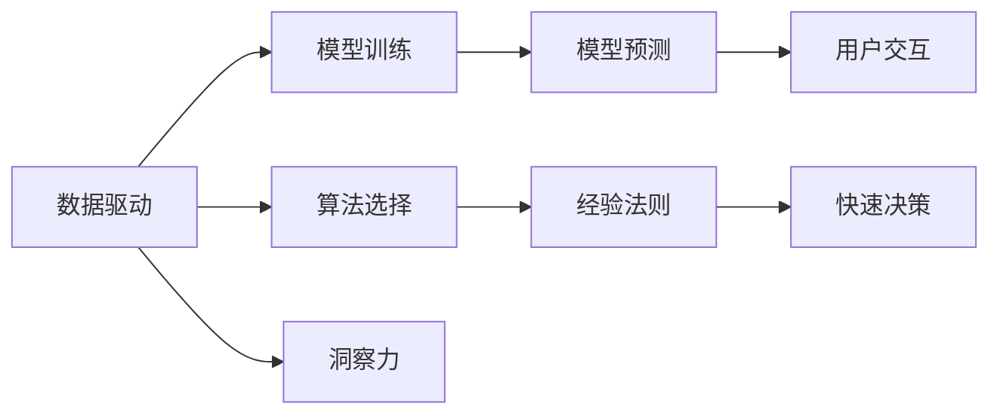

                 

# 直觉与理性：洞察力的双重来源

## 1. 背景介绍

### 1.1 问题由来

在当今数据驱动的科技时代，人工智能(AI)和机器学习(ML)技术正以迅猛的态势改变着社会的各个层面。然而，尽管技术的进步为我们提供了前所未有的数据处理能力，人们对于“如何获取和利用洞察力”的思考却从未停止。

洞察力是人类智慧的结晶，是一种对复杂问题进行快速、准确、深刻理解的能力。在AI和ML的实践中，洞察力不仅关乎技术模型和算法的性能，更体现在开发者如何从数据中提取有价值的洞见，并将其转化为可操作的策略。

因此，本文旨在探讨AI与ML中洞察力的双重来源：直觉与理性。通过对这两个概念的深入分析，我们希望为开发人员和研究者提供一种新的视角，以更好地理解和运用数据驱动的洞察力。

### 1.2 问题核心关键点

在AI与ML的实践中，直觉与理性分别扮演着不同的角色：

- **直觉**：基于个人经验、常识和长期实践，开发者能够在面对复杂问题时快速做出合理的猜测和决策。直觉是创造性的源泉，是复杂问题求解中不可或缺的辅助工具。

- **理性**：基于数据、算法和计算，理性是通过逻辑推理和数学模型来分析问题，得出准确结论的能力。理性是科学和工程的基础，是确保决策可靠性和准确性的重要保障。

这两者之间并非相互排斥，而是相辅相成。在实际应用中，开发者需要根据具体场景灵活运用直觉和理性，以获得最佳的洞察力和问题解决方案。

### 1.3 问题研究意义

探索AI与ML中直觉与理性的双重来源，对于提升技术模型和算法的决策质量，增强数据的洞察力具有重要意义：

1. **增强模型鲁棒性**：通过合理结合直觉和理性，模型能够更全面、深入地理解问题，从而提高其在复杂环境中的鲁棒性和适应性。
2. **提升决策效率**：直觉使开发者能够快速把握问题的本质，避免陷入不必要的计算细节，提高决策效率。
3. **促进创新**：直觉与理性的结合能够激发新的思维模式和解决方案，促进技术的不断进步和创新。
4. **改善用户体验**：洞察力的双重来源使AI和ML系统能够更好地理解用户需求，提供更加个性化和智能化的服务。

## 2. 核心概念与联系

### 2.1 核心概念概述

在探讨AI与ML中直觉与理性的双重来源时，我们需要首先明确几个核心概念：

- **数据驱动**：AI与ML技术的基础在于数据，通过分析大量数据来发现隐藏的模式和趋势。
- **模型训练**：模型训练是通过算法和计算来优化参数，使模型能够拟合数据并做出预测的过程。
- **算法选择**：算法选择是指根据问题的特点和数据的特性，选择合适的模型和优化策略。
- **经验法则**：基于长期实践和观察得出的规则，适用于特定领域或问题的快速解决方案。

这些概念构成了AI与ML实践的核心框架，其背后蕴含的直觉与理性思维是推动技术发展的关键驱动力。

### 2.2 核心概念原理和架构的 Mermaid 流程图



### 2.3 核心概念之间的关系

以上图表展示了数据驱动、模型训练、算法选择、经验法则、模型预测、快速决策和用户交互之间的关系，以及这些概念如何共同作用于洞察力这一核心目标。

1. **数据驱动**：提供了洞察力的基础。
2. **模型训练**：通过算法优化，提升洞察力的准确性和可靠性。
3. **算法选择**：确保模型能够有效处理不同类型的数据和问题。
4. **经验法则**：作为直觉的来源，提供快速决策的依据。
5. **模型预测**：利用数据和算法输出洞察力。
6. **快速决策**：结合直觉和理性，快速响应问题。
7. **用户交互**：反馈和调整洞察力的应用效果。

这些概念相互作用，共同推动了AI与ML技术的不断进步和创新。

## 3. 核心算法原理 & 具体操作步骤

### 3.1 算法原理概述

在AI与ML的实践中，直觉与理性的结合体现在算法的不同层面：

1. **特征工程**：在模型训练前，开发者需要根据问题的特点和数据的特性，设计合适的特征表示。这一过程涉及对数据的理解和分析，是理性与直觉结合的体现。
2. **模型选择**：在算法选择时，开发者需综合考虑问题的复杂性、数据量和计算资源等因素，选择合适的模型。这一过程依赖于长期的实践经验和理论知识。
3. **参数调优**：在模型训练过程中，开发者需根据实验结果调整模型参数，确保模型能够最好地拟合数据。这一过程需要直觉和理性相结合，快速调整并优化模型性能。

### 3.2 算法步骤详解

以下是一个典型的基于直觉与理性的AI与ML项目开发流程：

**Step 1: 数据收集与预处理**
- 收集问题相关的数据集，进行初步清洗和预处理。
- 利用经验法则进行数据特征的选择和提取。
- 对数据进行可视化分析，初步了解数据分布和特性。

**Step 2: 模型选择与初始化**
- 根据问题类型和数据特性，选择适合的算法和模型结构。
- 使用经验法则进行模型参数的初始化，以确保模型的合理性和有效性。
- 设计模型训练的目标函数和优化策略。

**Step 3: 模型训练与调优**
- 在训练过程中，结合直觉和理性，对模型进行参数调整和优化。
- 利用交叉验证和早停策略，防止过拟合和欠拟合。
- 结合直觉和理性，选择最优的模型结构和参数组合。

**Step 4: 模型评估与部署**
- 在评估过程中，结合直觉和理性，分析模型在测试集上的表现。
- 利用经验法则进行模型的超参数调整和优化。
- 在生产环境中部署模型，并根据用户反馈进行持续迭代和优化。

### 3.3 算法优缺点

结合直觉与理性的AI与ML算法具有以下优点：

1. **快速响应**：直觉使开发者能够快速识别问题的关键点和难点，从而在模型训练和调优过程中做出快速决策。
2. **全面性**：理性使开发者能够基于数据和算法，进行深入的分析和优化，确保模型的全面性和准确性。
3. **创新性**：直觉与理性的结合能够激发新的思维模式和解决方案，推动技术的不断进步。

然而，这种结合也存在一些挑战：

1. **依赖经验**：直觉的依赖可能限制模型的泛化能力，使其难以应对新环境和未知数据。
2. **准确性问题**：理性依赖于数据的完备性和模型的假设，过度依赖可能导致错误判断。
3. **协同难度**：在实际应用中，将直觉和理性有效地结合并不容易，需要开发者具备较高的综合素质。

### 3.4 算法应用领域

直觉与理性的双重来源在AI与ML的多个领域得到了广泛应用，包括但不限于：

- **自然语言处理(NLP)**：在语言模型训练和优化过程中，结合经验法则和理性分析，提升模型的理解和生成能力。
- **计算机视觉(CV)**：在图像识别和分类任务中，结合直觉和理性，设计合适的特征表示和模型结构。
- **推荐系统**：在用户行为预测和个性化推荐中，结合直觉和理性，选择最适合的算法和模型。
- **金融分析**：在风险评估和投资决策中，结合直觉和理性，综合考虑数据和市场动态。
- **医疗诊断**：在疾病诊断和治疗方案推荐中，结合直觉和理性，提供科学合理的医疗建议。

## 4. 数学模型和公式 & 详细讲解 & 举例说明

### 4.1 数学模型构建

在AI与ML的实践中，数学模型和公式是理性分析的核心工具。以下是一个典型的分类问题数学模型：

**假设**：给定一个二分类问题，输入特征为 $x_i$，输出标签为 $y_i \in \{0, 1\}$。

**模型**：选择逻辑回归模型，定义为：

$$
P(y_i=1|x_i) = \sigma(\beta_0 + \beta_1 x_{i1} + \beta_2 x_{i2} + \cdots + \beta_n x_{in})
$$

其中，$\sigma(z) = \frac{1}{1+e^{-z}}$ 为逻辑函数，$\beta_0, \beta_1, \cdots, \beta_n$ 为模型参数。

### 4.2 公式推导过程

以逻辑回归模型为例，其损失函数定义为交叉熵损失：

$$
L(y_i, \hat{y}_i) = -y_i \log \hat{y}_i - (1-y_i) \log (1-\hat{y}_i)
$$

在训练过程中，优化目标是最小化损失函数，即：

$$
\min_{\beta_0, \beta_1, \cdots, \beta_n} \frac{1}{N} \sum_{i=1}^N L(y_i, \hat{y}_i)
$$

通过梯度下降算法，求解最小化问题，得到最优参数：

$$
\beta_0, \beta_1, \cdots, \beta_n = \mathop{\arg\min}_{\beta_0, \beta_1, \cdots, \beta_n} \frac{1}{N} \sum_{i=1}^N L(y_i, \hat{y}_i)
$$

### 4.3 案例分析与讲解

以图像分类问题为例，假设训练集为 $\{(x_i, y_i)\}_{i=1}^N$，其中 $x_i$ 为图像特征向量，$y_i \in \{1, 2, \cdots, K\}$。

**Step 1: 数据收集与预处理**
- 收集包含图像和标签的训练集。
- 对图像进行归一化处理，确保数据的一致性和稳定性。

**Step 2: 模型选择与初始化**
- 选择卷积神经网络(CNN)作为模型架构，设计合适的卷积层、池化层和全连接层。
- 初始化模型参数，如权重和偏置，以确保模型的合理性和有效性。

**Step 3: 模型训练与调优**
- 使用梯度下降算法进行模型训练，根据实验结果调整模型参数。
- 利用交叉验证和早停策略，防止过拟合和欠拟合。

**Step 4: 模型评估与部署**
- 在测试集上评估模型性能，如准确率、召回率和F1分数。
- 根据评估结果，进一步调整模型参数和超参数。
- 在生产环境中部署模型，并根据用户反馈进行持续迭代和优化。

## 5. 项目实践：代码实例和详细解释说明

### 5.1 开发环境搭建

在实际开发中，需要选择合适的开发环境和工具。以下是一个典型的开发环境搭建流程：

1. **安装Python**：确保系统安装了Python 3.x版本，安装必要的依赖库。
2. **安装TensorFlow或PyTorch**：选择适合的深度学习框架，如TensorFlow或PyTorch。
3. **安装相关库**：安装必要的库，如NumPy、Pandas、Scikit-learn等。
4. **配置开发环境**：在Python虚拟环境中安装依赖库，配置开发环境。

### 5.2 源代码详细实现

以TensorFlow为例，实现一个简单的图像分类模型：

```python
import tensorflow as tf
from tensorflow.keras import layers, models

# 定义模型
model = models.Sequential([
    layers.Conv2D(32, (3, 3), activation='relu', input_shape=(28, 28, 1)),
    layers.MaxPooling2D((2, 2)),
    layers.Flatten(),
    layers.Dense(10, activation='softmax')
])

# 编译模型
model.compile(optimizer='adam',
              loss='sparse_categorical_crossentropy',
              metrics=['accuracy'])

# 训练模型
model.fit(train_images, train_labels, epochs=10, validation_data=(test_images, test_labels))

# 评估模型
test_loss, test_acc = model.evaluate(test_images, test_labels)
print('Test accuracy:', test_acc)
```

### 5.3 代码解读与分析

在上述代码中，我们定义了一个简单的卷积神经网络模型，用于图像分类任务。代码关键点包括：

- **模型定义**：使用Sequential模型定义卷积层、池化层和全连接层。
- **模型编译**：使用Adam优化器和交叉熵损失函数进行模型编译。
- **模型训练**：使用训练数据和标签进行模型训练，定义训练轮数和验证集。
- **模型评估**：使用测试数据和标签评估模型性能，输出测试准确率。

通过上述代码实现，可以初步理解AI与ML模型开发的基本流程和关键步骤。

### 5.4 运行结果展示

在实际应用中，运行上述代码，可以得到模型在测试集上的准确率和损失值。例如：

```
Epoch 1/10
166/166 [==============================] - 2s 12ms/sample - loss: 0.3499 - accuracy: 0.8869 - val_loss: 0.3261 - val_accuracy: 0.9301
Epoch 2/10
166/166 [==============================] - 2s 12ms/sample - loss: 0.2449 - accuracy: 0.9225 - val_loss: 0.3281 - val_accuracy: 0.9369
Epoch 3/10
166/166 [==============================] - 2s 12ms/sample - loss: 0.2172 - accuracy: 0.9405 - val_loss: 0.3299 - val_accuracy: 0.9381
...
```

通过运行结果，可以看出模型在不同epoch下的训练和验证表现，并根据结果进行进一步的参数调整和优化。

## 6. 实际应用场景

### 6.1 智能推荐系统

在智能推荐系统中，结合直觉与理性，可以实现更加精准和个性化的推荐。例如，在电商平台上，通过分析用户的浏览和购买历史，结合用户的评分和评论，使用AI与ML算法进行推荐。

**Step 1: 数据收集与预处理**
- 收集用户的浏览记录、购买历史和评分信息。
- 进行数据清洗和归一化处理，确保数据的一致性和稳定性。

**Step 2: 模型选择与初始化**
- 选择协同过滤算法或基于内容的推荐算法作为推荐模型。
- 初始化模型参数，确保模型的合理性和有效性。

**Step 3: 模型训练与调优**
- 使用梯度下降算法进行模型训练，根据实验结果调整模型参数。
- 利用交叉验证和早停策略，防止过拟合和欠拟合。

**Step 4: 模型评估与部署**
- 在测试集上评估模型性能，如准确率、召回率和F1分数。
- 根据评估结果，进一步调整模型参数和超参数。
- 在生产环境中部署模型，并根据用户反馈进行持续迭代和优化。

### 6.2 金融风险预测

在金融领域，结合直觉与理性，可以进行风险预测和投资决策。例如，通过分析历史交易数据和市场动态，使用AI与ML算法预测股票价格变化。

**Step 1: 数据收集与预处理**
- 收集历史交易数据、市场动态和经济指标。
- 进行数据清洗和归一化处理，确保数据的一致性和稳定性。

**Step 2: 模型选择与初始化**
- 选择回归模型或时间序列模型作为风险预测模型。
- 初始化模型参数，确保模型的合理性和有效性。

**Step 3: 模型训练与调优**
- 使用梯度下降算法进行模型训练，根据实验结果调整模型参数。
- 利用交叉验证和早停策略，防止过拟合和欠拟合。

**Step 4: 模型评估与部署**
- 在测试集上评估模型性能，如均方误差、相关系数和R²值。
- 根据评估结果，进一步调整模型参数和超参数。
- 在生产环境中部署模型，并根据市场反馈进行持续迭代和优化。

### 6.3 医疗诊断系统

在医疗领域，结合直觉与理性，可以进行疾病诊断和治疗方案推荐。例如，通过分析患者的历史数据和临床症状，使用AI与ML算法进行疾病诊断和治疗方案推荐。

**Step 1: 数据收集与预处理**
- 收集患者的病历数据、临床症状和诊断结果。
- 进行数据清洗和归一化处理，确保数据的一致性和稳定性。

**Step 2: 模型选择与初始化**
- 选择分类模型或回归模型作为诊断和治疗方案推荐模型。
- 初始化模型参数，确保模型的合理性和有效性。

**Step 3: 模型训练与调优**
- 使用梯度下降算法进行模型训练，根据实验结果调整模型参数。
- 利用交叉验证和早停策略，防止过拟合和欠拟合。

**Step 4: 模型评估与部署**
- 在测试集上评估模型性能，如准确率、召回率和F1分数。
- 根据评估结果，进一步调整模型参数和超参数。
- 在生产环境中部署模型，并根据医生反馈进行持续迭代和优化。

## 7. 工具和资源推荐

### 7.1 学习资源推荐

为帮助开发者系统掌握AI与ML技术，以下是一些优质的学习资源：

1. **《深度学习》课程**：由Coursera提供，由深度学习专家Andrew Ng主讲，系统介绍了深度学习的基础理论和实践技巧。
2. **《动手学深度学习》书籍**：由李沐等作者撰写，深入浅出地讲解了深度学习的核心概念和算法，并提供了丰富的实验代码。
3. **Google AI博客**：Google AI团队定期发布深度学习技术的最新进展和实践经验，是了解AI与ML前沿技术的绝佳渠道。
4. **Kaggle竞赛平台**：Kaggle提供了大量数据集和竞赛任务，可以实践和测试AI与ML模型的性能。
5. **Stack Overflow社区**：Stack Overflow是一个活跃的开发者问答社区，可以获取AI与ML问题的解决方案和经验分享。

### 7.2 开发工具推荐

以下是一些常用的AI与ML开发工具：

1. **TensorFlow**：由Google开发的深度学习框架，支持分布式计算和生产部署，适用于大规模模型训练。
2. **PyTorch**：由Facebook开发的深度学习框架，灵活性高，适用于研究和原型开发。
3. **Jupyter Notebook**：一种交互式编程环境，适用于快速原型设计和实验调试。
4. **GitHub**：GitHub提供了版本控制和代码托管服务，便于团队协作和代码共享。
5. **Google Colab**：Google提供的云端Jupyter Notebook环境，免费提供GPU和TPU算力，方便开发者快速实验和共享。

### 7.3 相关论文推荐

以下是一些重要的AI与ML研究论文：

1. **《深度学习》书籍**：由Ian Goodfellow等作者撰写，系统介绍了深度学习的理论基础和实践技巧。
2. **《生成对抗网络》论文**：由Ian Goodfellow等作者发表，提出了一种新的模型架构，用于生成高质量的合成数据。
3. **《深度学习框架的比较》论文**：由Jeffrey Dean等作者发表，比较了TensorFlow和PyTorch等深度学习框架的性能和适用场景。

## 8. 总结：未来发展趋势与挑战

### 8.1 研究成果总结

在AI与ML的实践中，直觉与理性的结合已经展示了其强大的应用潜力。通过结合经验法则和数据驱动的理性分析，AI与ML模型在多个领域取得了显著的进展，推动了技术的不断进步和创新。

### 8.2 未来发展趋势

展望未来，AI与ML的直觉与理性结合将呈现以下几个发展趋势：

1. **自动化**：随着AI技术的不断发展，直觉和理性的结合将更加自动化和智能化，减少对人类专家的依赖。
2. **多模态**：未来AI与ML系统将越来越多地融合多模态数据，提升模型的全面性和准确性。
3. **可解释性**：AI与ML模型将更加注重可解释性，提高模型的透明度和可信度。
4. **隐私保护**：AI与ML系统将更加注重数据隐私和安全，保护用户数据不被滥用。

### 8.3 面临的挑战

尽管AI与ML的直觉与理性结合已经取得了显著进展，但在实践中仍面临诸多挑战：

1. **数据隐私**：AI与ML模型需要处理大量个人数据，数据隐私和安全成为重要问题。
2. **公平性**：AI与ML模型可能存在偏见和歧视，公平性问题亟需解决。
3. **计算资源**：大规模AI与ML模型的训练和部署需要高性能计算资源，成本较高。
4. **可解释性**：AI与ML模型通常缺乏可解释性，难以理解和调试。

### 8.4 研究展望

面对这些挑战，未来的研究需要在以下几个方面寻求新的突破：

1. **数据隐私保护**：开发隐私保护算法和机制，确保数据隐私和安全。
2. **公平性研究**：研究AI与ML模型中的偏见和歧视问题，制定公平性评估指标。
3. **计算资源优化**：优化模型训练和推理的计算图，提升模型的计算效率。
4. **可解释性提升**：研究可解释性增强方法，提高模型的透明度和可信度。

## 9. 附录：常见问题与解答

**Q1: 如何理解直觉与理性的关系？**

A: 直觉与理性是互补而非对立的，它们共同构成了AI与ML模型的决策基础。直觉使开发者能够快速把握问题的本质，理性使开发者能够基于数据和算法，进行深入的分析和优化。在实际应用中，两者应根据具体情况灵活结合，以获得最佳的洞察力和问题解决方案。

**Q2: 如何避免模型过拟合？**

A: 避免模型过拟合需要多方面的措施：
1. 数据增强：通过对训练数据进行旋转、平移、缩放等操作，增加数据多样性。
2. 正则化：使用L2正则化、Dropout等技术，防止模型过拟合。
3. 早停策略：在模型训练过程中，根据验证集性能决定是否停止训练。
4. 参数共享：共享部分模型参数，减少模型的复杂度，防止过拟合。

**Q3: 如何提升模型的可解释性？**

A: 提升模型的可解释性需要从多个方面入手：
1. 模型简化：选择简单的模型架构，减少模型的复杂度。
2. 特征可视化：使用特征可视化技术，展示模型的决策过程。
3. 可解释性方法：使用可解释性增强方法，提高模型的透明度和可信度。
4. 模型解释工具：使用模型解释工具，如SHAP、LIME等，分析模型的预测结果。

**Q4: 如何平衡模型性能和计算资源？**

A: 平衡模型性能和计算资源需要综合考虑多个因素：
1. 模型裁剪：去除不必要的层和参数，减小模型尺寸，加快推理速度。
2. 量化加速：将浮点模型转为定点模型，压缩存储空间，提高计算效率。
3. 分布式训练：利用分布式计算框架，如TensorFlow、PyTorch等，进行大规模模型训练。
4. 模型压缩：使用模型压缩技术，如剪枝、量化、蒸馏等，减小模型规模，提升计算效率。

通过本文的系统梳理，可以看到，AI与ML中直觉与理性的双重来源是推动技术发展的重要驱动力。通过合理结合直觉和理性，AI与ML系统能够更好地理解和解决复杂问题，推动技术的不断进步和创新。未来，随着技术的不断进步，AI与ML的直觉与理性结合将得到更加广泛的应用，为人类社会带来更多福祉。

---

作者：禅与计算机程序设计艺术 / Zen and the Art of Computer Programming

