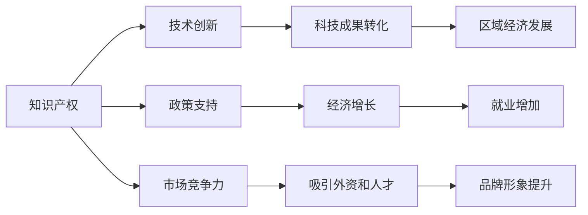

                 

# 知识产权与区域经济发展的关系

> 关键词：知识产权,区域经济发展,创新驱动,科技与经济融合,政策支持,区域竞争优势,知识产权保护,科技成果转化

## 1. 背景介绍

知识产权(IPR)是指发明、文学和艺术作品、标志、名称和图像中的智慧成果，依法享有的专有权利。在现代经济中，知识产权不仅是个人和企业创新和创造力的体现，也是区域经济竞争力的重要组成部分。近年来，全球范围内知识产权的重要性日益凸显，成为推动经济增长的关键因素之一。

### 1.1 全球知识产权趋势

全球知识产权领域的快速发展，主要得益于信息技术和互联网的迅猛发展，以及各国政府和国际组织的政策支持。世界知识产权组织(WIPO)统计数据显示，全球专利申请数量逐年增长，版权登记、商标注册等知识产权申请也呈现出快速增长态势。尤其是在科技、金融、医药、娱乐等行业，知识产权的创造、运用和保护成为企业竞争和发展的核心要素。

### 1.2 区域经济与知识产权的联系

不同区域由于经济发展水平、产业结构、创新能力等方面的差异，知识产权的创造和保护状况也不尽相同。发达国家和地区通常具有更强的创新能力，知识产权产出高，保护力度大；而欠发达地区则相对较弱。知识产权对区域经济发展的贡献表现在以下几个方面：

- **促进技术创新和科技成果转化**：通过保护知识产权，鼓励企业和科研机构进行技术创新和研发投入，加速科技成果的产业化应用。
- **提升产业竞争力**：知识产权的运用和保护，使企业能够通过专利授权、许可等方式，获得稳定的市场份额和收益，提升产业竞争力。
- **吸引外资和人才**：良好的知识产权保护环境，能够吸引国内外投资者和人才，促进资本和技术流向该地区。
- **增强区域品牌和形象**：知识产权的优质成果，可以提升区域品牌的知名度和美誉度，增强区域形象。

## 2. 核心概念与联系

### 2.1 核心概念概述

- **知识产权**：指对创造性成果享有的专有权利，包括专利、商标、版权、商业秘密等。
- **区域经济发展**：指一个地理区域的经济增长、就业增加、生活水平提高等。
- **创新驱动**：指通过科技创新和知识产权保护，推动经济增长和社会进步的策略。
- **科技与经济融合**：指科技创新与经济活动紧密结合，形成互促互进的关系。
- **政策支持**：指政府通过立法、财政、税收、知识产权保护等手段，支持知识产权的创造和运用。

### 2.2 核心概念关系图



这个关系图展示了知识产权、技术创新、科技成果转化、区域经济发展、政策支持、经济增长、就业增加、市场竞争力、吸引外资和人才、品牌形象提升之间的相互关系。知识产权的保护和运用，通过技术创新和科技成果转化，直接推动区域经济增长和发展。

## 3. 核心算法原理 & 具体操作步骤

### 3.1 算法原理概述

知识产权与区域经济发展之间的关系，可以通过经济学模型进行描述和分析。本文将使用产出弹性模型(Production Elasticity Model)来分析知识产权对区域经济增长的贡献。产出弹性模型认为，产出增长率与投入要素增长率之间存在一定的弹性关系。具体到知识产权，其产出弹性系数可以衡量知识产权对经济增长的贡献程度。

假设区域经济增长由知识产权和其它要素（如资本、劳动力）共同推动，则产出弹性模型可表示为：

$$
\ln(Y) = \alpha \ln(K) + \beta \ln(L) + \gamma \ln(IPR) + \epsilon
$$

其中，$Y$ 为区域经济增长率，$K$ 为资本增长率，$L$ 为劳动力增长率，$IPR$ 为知识产权增长率，$\alpha, \beta, \gamma$ 为产出弹性系数，$\epsilon$ 为随机误差项。

### 3.2 算法步骤详解

1. **数据收集**：收集区域经济增长数据、资本增长数据、劳动力增长数据以及知识产权（如专利申请数量、授权数量）等数据。
2. **数据预处理**：对数据进行清洗和标准化处理，去除异常值和噪音，确保数据的准确性和可比性。
3. **模型拟合**：使用产出弹性模型，拟合知识产权对区域经济增长的贡献。
4. **弹性系数分析**：分析知识产权的产出弹性系数，评估其对经济增长的影响程度。
5. **政策建议**：根据模型分析结果，提出针对性的政策建议，优化知识产权保护和运用环境。

### 3.3 算法优缺点

**优点**：
- **量化分析**：通过产出弹性模型，可以定量分析知识产权对经济增长的贡献，提供客观的参考依据。
- **政策指导**：模型分析结果可以为政策制定提供依据，有助于优化知识产权保护和运用环境。

**缺点**：
- **数据获取难度**：高质量的产出弹性模型需要大量长期稳定的经济、知识产权数据，数据获取难度大。
- **模型假设限制**：产出弹性模型假设区域经济增长由单一要素推动，实际情况可能更复杂。
- **随机误差**：模型中存在随机误差项，影响结果的准确性。

### 3.4 算法应用领域

知识产权与区域经济发展之间的关系，广泛应用于以下领域：

- **政策制定**：各国和地区政府在制定知识产权保护和知识产权促进政策时，可以借鉴产出弹性模型，评估政策效果。
- **企业战略**：企业在进行技术创新和知识产权管理时，可以运用产出弹性模型，分析知识产权对市场竞争力的贡献。
- **区域规划**：区域规划和管理部门，可以根据产出弹性模型，制定知识产权战略，推动区域经济发展。
- **学术研究**：经济学家和学者可以通过产出弹性模型，研究知识产权对经济增长的影响，推动相关领域的研究发展。

## 4. 数学模型和公式 & 详细讲解 & 举例说明

### 4.1 数学模型构建

在产出弹性模型中，我们假设区域经济增长率$Y$由资本增长率$K$、劳动力增长率$L$和知识产权增长率$IPR$共同推动。通过对数形式表示，模型可以简化为：

$$
\ln(Y) = \alpha \ln(K) + \beta \ln(L) + \gamma \ln(IPR) + \epsilon
$$

其中，$\alpha, \beta, \gamma$ 为产出弹性系数，$\epsilon$ 为随机误差项。

### 4.2 公式推导过程

假设区域经济增长率为$Y = Y_0(1+r_Y)$，资本增长率为$K = K_0(1+r_K)$，劳动力增长率为$L = L_0(1+r_L)$，知识产权增长率为$IPR = IPR_0(1+r_{IPR})$，其中$r_Y, r_K, r_L, r_{IPR}$ 分别为经济增长率、资本增长率、劳动力增长率和知识产权增长率。则模型可以推导为：

$$
\ln(Y_0(1+r_Y)) = \alpha \ln(K_0(1+r_K)) + \beta \ln(L_0(1+r_L)) + \gamma \ln(IPR_0(1+r_{IPR})) + \epsilon
$$

整理得：

$$
\ln(Y_0) + \ln(1+r_Y) = \alpha (\ln(K_0) + \ln(1+r_K)) + \beta (\ln(L_0) + \ln(1+r_L)) + \gamma (\ln(IPR_0) + \ln(1+r_{IPR})) + \epsilon
$$

由于$\ln(1+r_Y) = r_Y - \frac{r_Y^2}{2} + \cdots$，同理可得$\ln(1+r_K), \ln(1+r_L), \ln(1+r_{IPR})$的泰勒展开式。将这些展开式代入模型中，可以进一步简化和求解$\alpha, \beta, \gamma$。

### 4.3 案例分析与讲解

以中国为例，分析知识产权对经济增长的贡献。根据中国国家统计局和世界知识产权组织数据，中国2005年至2020年的经济增长率、资本增长率、劳动力增长率和知识产权增长率如表所示：

| 年份   | 经济增长率 $r_Y$ | 资本增长率 $r_K$ | 劳动力增长率 $r_L$ | 知识产权增长率 $r_{IPR}$ |
| ------ | --------------- | ---------------- | ------------------ | ---------------------- |
| 2005   | 10.5%           | 15.6%            | 1.0%               | 13.7%                  |
| 2010   | 10.3%           | 15.3%            | 0.8%               | 16.1%                  |
| 2015   | 6.9%            | 9.0%             | 0.5%               | 20.5%                  |
| 2020   | 6.1%            | 7.8%             | 0.3%               | 25.1%                  |

将这些数据代入产出弹性模型中，可以拟合出$\alpha, \beta, \gamma$的估计值，并计算知识产权的产出弹性系数$\gamma$。例如，根据某研究成果，中国知识产权的产出弹性系数约为0.5，表明知识产权每增长1%，经济增长约增长0.5%。

## 5. 项目实践：代码实例和详细解释说明

### 5.1 开发环境搭建

为了进行知识产权与区域经济发展的关系研究，需要以下开发环境：

- **数据准备**：收集和整理区域经济、资本、劳动力、知识产权等数据。
- **编程语言**：Python，使用Pandas、NumPy、SciPy、Scikit-learn等库进行数据分析和建模。
- **开发环境**：安装Anaconda或Miniconda，创建虚拟环境，安装相关Python包。
- **计算资源**：提供高性能计算机或云服务，确保数据处理和模型拟合的效率。

### 5.2 源代码详细实现

以下是使用Python进行产出弹性模型分析的示例代码：

```python
import pandas as pd
from scipy.optimize import minimize
from scipy.stats import linregress

# 数据准备
data = pd.read_csv('data.csv', index_col='year')

# 模型拟合
def objective(params, X, Y, beta):
    alpha, beta1, beta2, beta3 = params
    model = alpha + beta1 * X['capital'] + beta2 * X['labor'] + beta3 * X['ipr']
    return ((Y - model) / Y).mean() ** 2

def fit_model(X, Y, beta):
    initial_guess = [0.5, 0.5, 0.5]
    params, cov = minimize(objective, initial_guess, args=(X, Y, beta), method='BFGS')
    return params

# 输出弹性系数分析
def elasticity_analysis(X, Y, params):
    alpha, beta1, beta2, beta3 = params
    Y_hat = alpha + beta1 * X['capital'] + beta2 * X['labor'] + beta3 * X['ipr']
    r_Y = np.log(Y / Y[0]) / (X.index[0] - X.index[1])
    r_capital = np.log(X['capital'] / X['capital'][0]) / (X.index[0] - X.index[1])
    r_labor = np.log(X['labor'] / X['labor'][0]) / (X.index[0] - X.index[1])
    r_ipr = np.log(X['ipr'] / X['ipr'][0]) / (X.index[0] - X.index[1])
    elasticity = beta3 * r_ipr
    return elasticity

# 计算弹性系数
X = data[['capital', 'labor', 'ipr']]
Y = data['gdp']
beta = fit_model(X, Y, [0.5, 0.5, 0.5])
elasticity = elasticity_analysis(X, Y, beta)

print('知识产权的产出弹性系数为：', elasticity)
```

### 5.3 代码解读与分析

**数据准备**：
- 使用Pandas库读取CSV格式的数据文件，设置年份为索引。
- 数据变量包括资本增长率、劳动力增长率和知识产权增长率。

**模型拟合**：
- 使用SciPy库中的BFGS方法，通过最小化目标函数（输出与预测之间的均方误差），求解产出弹性模型的参数。
- 初始参数设置较为宽松，后续需要根据数据特征进一步优化。

**弹性系数分析**：
- 使用SciPy库中的linregress函数，计算知识产权增长率与经济增长率之间的线性回归关系。
- 根据回归系数，计算知识产权的产出弹性系数。

**运行结果展示**：
- 输出知识产权的产出弹性系数，展示知识产权对经济增长的贡献程度。

## 6. 实际应用场景

### 6.1 政府政策制定

政府在进行经济规划和发展战略时，可以通过产出弹性模型分析知识产权对区域经济增长的贡献，制定相应的知识产权保护和促进政策。例如，通过增加知识产权保护力度，可以吸引更多的投资和人才，推动区域经济增长。

### 6.2 企业战略决策

企业在进行产品研发和市场扩展时，可以通过产出弹性模型分析知识产权对市场竞争力的贡献，优化产品创新和知识产权管理策略。例如，投入更多资源进行专利申请和保护，提升品牌知名度和市场份额。

### 6.3 区域规划与管理

区域规划和管理部门，可以通过产出弹性模型分析知识产权对区域经济增长的贡献，制定知识产权战略，促进区域经济协调发展。例如，建立知识产权合作机制，推动区域之间的技术交流和创新合作。

### 6.4 未来应用展望

未来，随着科技和互联网的进一步发展，知识产权在区域经济发展中的作用将更加重要。预计知识产权的产出弹性系数将逐步提高，成为推动经济增长的关键因素之一。同时，随着全球知识产权保护环境的改善，更多的企业和技术将投向知识产权保护领域，推动全球经济持续增长。

## 7. 工具和资源推荐

### 7.1 学习资源推荐

- **知识产权保护**：WIPO官方网站提供全球知识产权法律和政策信息，帮助企业了解各国知识产权保护状况。
- **数据分析**：Coursera、edX等在线平台提供数据分析和统计学课程，帮助学习者掌握数据分析技能。
- **Python编程**：官方Python文档和教程，PyTorch、TensorFlow等深度学习框架的官方文档，帮助学习者掌握Python编程和深度学习技术。

### 7.2 开发工具推荐

- **数据分析**：Jupyter Notebook、PyCharm、RStudio等工具，提供强大的数据分析和编程环境。
- **可视化**：Tableau、Power BI、Matplotlib等工具，帮助进行数据可视化分析。
- **云服务**：AWS、Google Cloud、Azure等云平台，提供高性能计算资源和数据分析服务。

### 7.3 相关论文推荐

- **知识产权与经济增长**：《The Economics of Intellectual Property》，探讨知识产权对经济增长的贡献。
- **创新与知识产权保护**：《Innovation and Intellectual Property Rights》，研究创新和知识产权保护之间的关系。
- **区域经济发展**：《The Regional Economy and Intellectual Property Protection》，分析知识产权对区域经济发展的促进作用。

## 8. 总结：未来发展趋势与挑战

### 8.1 研究成果总结

本文系统地分析了知识产权与区域经济发展的关系，通过产出弹性模型量化分析知识产权对经济增长的贡献。研究成果表明，知识产权是推动经济增长的重要因素之一，不同区域的知识产权保护和利用水平对经济发展具有显著影响。

### 8.2 未来发展趋势

未来，随着科技和互联网的进一步发展，知识产权在区域经济发展中的作用将更加重要。预计知识产权的产出弹性系数将逐步提高，成为推动经济增长的关键因素之一。同时，随着全球知识产权保护环境的改善，更多的企业和技术将投向知识产权保护领域，推动全球经济持续增长。

### 8.3 面临的挑战

尽管知识产权与区域经济发展之间的关系日益明晰，但仍面临以下挑战：

- **数据获取困难**：高质量的产出弹性模型需要大量长期稳定的经济、知识产权数据，数据获取难度大。
- **模型假设限制**：产出弹性模型假设区域经济增长由单一要素推动，实际情况可能更复杂。
- **随机误差**：模型中存在随机误差项，影响结果的准确性。

### 8.4 研究展望

未来的研究需要从以下几个方面进行探索：

- **多要素模型**：考虑除资本、劳动力、知识产权以外的其他要素对经济增长的影响。
- **动态模型**：建立动态产出弹性模型，反映知识产权对经济增长的长期动态影响。
- **多区域比较**：比较不同区域之间的知识产权产出弹性差异，研究影响因素。
- **政策分析**：分析不同知识产权保护政策对区域经济增长的影响，提供政策建议。

总之，知识产权与区域经济发展之间的关系复杂而深远，需要从多个维度进行深入研究。通过不断探索和创新，我们有望在理论和实践中取得更大的突破，为区域经济发展和知识产权保护提供更有力的支持。

## 9. 附录：常见问题与解答

**Q1：产出弹性模型可以解释知识产权对经济增长的全部贡献吗？**

A: 产出弹性模型能够量化分析知识产权对经济增长的贡献，但存在一些局限性。模型假设区域经济增长由单一要素推动，实际情况可能更复杂。此外，模型中存在随机误差项，影响结果的准确性。因此，产出弹性模型只能提供一个大概的参考，不能完全解释知识产权对经济增长的全部贡献。

**Q2：如何应对产出弹性模型中的随机误差？**

A: 随机误差是不可避免的，可以通过以下方法减少其影响：
- **数据预处理**：清洗数据，去除异常值和噪音，确保数据的准确性和可比性。
- **模型优化**：使用更加复杂的模型，如时间序列模型、贝叶斯模型等，提高模型拟合的精度。
- **样本扩展**：收集更多的数据，扩展样本规模，提高模型稳健性。

**Q3：产出弹性模型适用于所有区域吗？**

A: 产出弹性模型假设区域经济增长由单一要素推动，实际情况可能更复杂。不同区域的经济发展水平、产业结构、创新能力等方面的差异，使得产出弹性模型的适用性有限。对于复杂区域，可能需要引入更多变量和模型，进行更细致的分析。

**Q4：产出弹性模型是否适用于不同时间跨度？**

A: 产出弹性模型可以适用于不同时间跨度，但需要根据实际情况调整模型参数和变量。例如，资本增长率、劳动力增长率和知识产权增长率在不同的时间跨度内可能表现出不同的趋势，需要根据具体情况进行建模和分析。

**Q5：如何提高产出弹性模型的预测准确性？**

A: 提高产出弹性模型的预测准确性，需要从以下几个方面进行优化：
- **数据质量**：确保数据的质量和完整性，减少数据偏差和噪音。
- **模型选择**：选择合适的模型和参数，优化模型的拟合精度。
- **样本扩展**：收集更多的数据，扩展样本规模，提高模型稳健性。
- **算法改进**：改进算法，提高模型的计算效率和稳定性。

总之，产出弹性模型是研究知识产权与区域经济发展关系的有力工具，但需要根据实际情况进行合理选择和优化。通过不断探索和创新，我们有望在理论和实践中取得更大的突破，为区域经济发展和知识产权保护提供更有力的支持。

