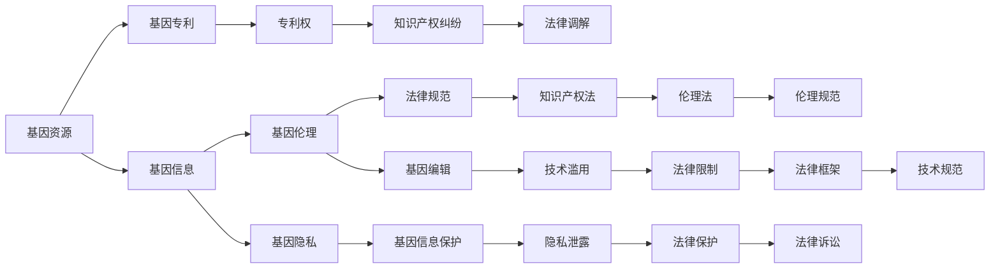

                 

## 1. 背景介绍

随着基因技术的迅猛发展，其应用范围已经渗透到医疗、农业、环境保护等多个领域。基因编辑技术的突破，如CRISPR-Cas9的应用，极大地提高了基因编辑的速度和精度，也为个性化医疗、疾病治疗、动植物改良提供了新的可能性。然而，基因技术的发展也引发了一系列知识产权和伦理问题，如何平衡科技发展与伦理规范，成为社会各界关注的焦点。

### 1.1 基因技术的现状

基因技术在医疗、农业等领域展现了巨大的潜力和应用前景。例如，基因编辑可以用于修正人类遗传缺陷，治疗遗传疾病；在农业上，可以通过基因改良作物，提高产量和抗逆性。然而，基因技术的迅猛发展也带来了一些问题，如基因编辑技术的滥用、基因资源分配不公、基因信息泄露等，这些问题都需要通过知识产权和伦理法律来加以规范和解决。

### 1.2 知识产权问题

基因技术的知识产权问题主要集中在基因资源归属和专利申请方面。由于基因资源具有高度的非排他性和共享性，如何界定基因资源的归属权，如何对基因技术进行专利保护，成为了知识产权领域的热点问题。此外，基因技术的跨国合作和数据共享也带来了新的挑战，如何在跨国合作中合理分配利益，避免知识产权纠纷，是亟待解决的问题。

### 1.3 伦理问题

基因技术的伦理问题主要集中在人类基因编辑、基因隐私、基因歧视等方面。人类基因编辑是否应该被限制，基因隐私保护如何实现，基因歧视问题如何解决，这些问题都涉及到伦理道德和法律规范。基因技术的应用还带来了一些社会问题，如基因资源的不平等分配、基因信息泄露、基因技术的滥用等，这些问题也需要从伦理角度进行探讨和解决。

## 2. 核心概念与联系

### 2.1 核心概念概述

为了更好地理解知识产权和基因技术的伦理问题，本文将介绍几个核心概念：

- 基因资源（Genetic Resources）：指天然存在的遗传物质，包括微生物、植物、动物、人类等生物体的基因组序列和基因库。
- 基因专利（Genetic Patent）：指通过基因编辑技术获得的新基因、新序列、新基因表达产物等，可以通过专利申请获得知识产权保护。
- 基因信息（Genetic Information）：指与遗传物质相关的数据和信息，如基因序列、基因型、基因表达谱等。
- 基因伦理（Genetic Ethics）：指与基因技术相关的伦理问题，如基因编辑、基因隐私、基因歧视等。

这些核心概念之间的逻辑关系可以通过以下Mermaid流程图来展示：



这个流程图展示了大语言模型的核心概念及其之间的关系：

1. 基因资源通过基因专利获得知识产权保护。
2. 基因资源转换成基因信息，需要从伦理角度进行保护。
3. 基因伦理问题需要通过法律规范和知识产权法来加以解决。
4. 基因专利权与知识产权纠纷通过法律调解和诉讼来解决。
5. 基因隐私保护需要通过法律保护和隐私泄露防范来保障。
6. 基因编辑技术需要通过法律限制和技术规范来避免滥用。
7. 法律规范和伦理规范共同构成基因技术的法律框架。

这些概念共同构成了基因技术的法律和伦理框架，为其发展提供了规范和保障。

## 3. 核心算法原理 & 具体操作步骤

### 3.1 算法原理概述

基因技术的知识产权和伦理问题可以通过法律、专利、伦理规范等多种手段来解决。本文将重点讨论法律和伦理规范在基因技术中的应用，并给出具体的法律和伦理规则的构建步骤。

基因技术的知识产权问题主要涉及专利权和版权的保护，需要通过专利申请、授权、无效等过程来实现。基因技术的伦理问题主要涉及基因编辑、基因隐私、基因歧视等方面，需要通过伦理规范、法律规定、伦理审查等手段来解决。

### 3.2 算法步骤详解

基因技术的知识产权和伦理问题的解决步骤主要包括以下几个方面：

**Step 1: 基因资源的产权界定**

- 对天然存在的基因资源进行产权界定，明确基因资源的所有权、使用权和收益权。
- 对于公共基因资源，通过法律规定和政策支持，保护其公共属性和共享性。
- 对于商业化的基因资源，通过专利申请、授权等手段，保护其知识产权。

**Step 2: 基因专利的申请和授权**

- 基因专利的申请需符合专利法规定的形式和内容要求，经过形式审查、实质审查等过程。
- 基因专利的授权需考虑基因资源的公共属性、基因技术的社会价值等因素，避免滥用和垄断。
- 对于跨国专利申请，需遵守TRIPS协议（与贸易有关的知识产权协议），保护国际知识产权的公平和公正。

**Step 3: 基因伦理的规范和监督**

- 通过法律和伦理规范，对基因编辑、基因隐私、基因歧视等问题进行规范和监督。
- 对基因编辑技术的应用进行伦理审查，确保其符合伦理标准和社会价值。
- 对基因隐私保护进行法律规定，确保基因信息的安全和保密。
- 对基因歧视问题进行法律和伦理规范，确保基因技术的公平和公正应用。

**Step 4: 知识产权和伦理纠纷的解决**

- 通过法律调解、仲裁等方式，解决基因专利权、基因信息保护等知识产权纠纷。
- 通过法律诉讼、伦理审查等方式，解决基因伦理问题，确保基因技术的合法和公正应用。
- 通过法律、伦理规范、技术标准等多种手段，构建完善的法律和伦理框架，保障基因技术的健康发展。

### 3.3 算法优缺点

基因技术的知识产权和伦理问题的解决方法具有以下优点：

- 法律和伦理规范的构建，可以为基因技术的健康发展提供规范和保障。
- 知识产权保护可以激励企业和科研机构对基因技术进行投资和研发。
- 伦理规范的监督可以防止基因技术的滥用和误用。

同时，这些方法也存在一些局限性：

- 法律和伦理规范的构建需要时间，难以迅速解决当前的基因技术问题。
- 知识产权保护和伦理监督需要投入大量资源，可能会对基因技术的研发和应用造成一定的阻碍。
- 法律和伦理规范的执行需要各方协调配合，可能存在执行困难和监管漏洞。

### 3.4 算法应用领域

基因技术的知识产权和伦理问题主要应用于以下领域：

- 基因资源的产权界定和知识产权保护。
- 基因编辑技术的伦理审查和法律监督。
- 基因隐私保护和基因信息共享。
- 基因歧视问题的法律和伦理规范。
- 跨国专利申请和国际知识产权保护。

## 4. 数学模型和公式 & 详细讲解 & 举例说明

### 4.1 数学模型构建

基因技术的知识产权和伦理问题的解决主要依赖于法律和伦理规范，不需要复杂的数学模型进行计算。然而，为了更好地理解这些问题的本质和复杂性，我们可以尝试从法律和伦理的角度构建数学模型。

假设有一项新的基因编辑技术需要申请专利，记专利申请为A，专利授权为B，专利无效为C。基因编辑的伦理审查为D，伦理审查通过为E，伦理审查未通过为F。基因隐私保护为G，隐私泄露为H。基因歧视问题的法律规范为I，法律规范通过为J，法律规范未通过为K。

我们可以用下面的数学模型来表示这些事件之间的关系：

$$
\begin{aligned}
A &\rightarrow B \\
A &\rightarrow C \\
D &\rightarrow E \\
D &\rightarrow F \\
G &\rightarrow H \\
I &\rightarrow J \\
I &\rightarrow K
\end{aligned}
$$

其中箭头表示因果关系，事件A到事件B表示专利申请到专利授权，事件A到事件C表示专利申请到专利无效，以此类推。

### 4.2 公式推导过程

由于基因技术的知识产权和伦理问题主要涉及法律和伦理规范的构建和执行，因此无需复杂的数学公式进行推导。然而，为了更好地理解这些问题的本质和复杂性，我们可以尝试从法律和伦理的角度构建数学模型。

假设有一项新的基因编辑技术需要申请专利，记专利申请为A，专利授权为B，专利无效为C。基因编辑的伦理审查为D，伦理审查通过为E，伦理审查未通过为F。基因隐私保护为G，隐私泄露为H。基因歧视问题的法律规范为I，法律规范通过为J，法律规范未通过为K。

我们可以用下面的数学模型来表示这些事件之间的关系：

$$
\begin{aligned}
A &\rightarrow B \\
A &\rightarrow C \\
D &\rightarrow E \\
D &\rightarrow F \\
G &\rightarrow H \\
I &\rightarrow J \\
I &\rightarrow K
\end{aligned}
$$

其中箭头表示因果关系，事件A到事件B表示专利申请到专利授权，事件A到事件C表示专利申请到专利无效，以此类推。

### 4.3 案例分析与讲解

假设有一家生物技术公司开发了一项新的基因编辑技术，需要申请专利。公司在提交专利申请后，需要经过形式审查和实质审查两个阶段。如果专利申请被批准，则获得专利授权；如果专利申请被驳回，则进行专利无效申请。

假设基因编辑技术需要进行伦理审查，审查通过则允许应用；如果审查未通过，则需要修改技术或重新申请。同时，公司需要制定基因隐私保护政策，确保基因信息的安全和保密。如果隐私保护政策制定得当，则能够有效避免隐私泄露；如果隐私保护政策存在漏洞，则可能发生隐私泄露事件。

假设公司需要制定基因歧视问题的法律规范，规范通过则能够有效防止基因歧视；如果规范未通过，则需要进行修改或重新制定。

## 5. 项目实践：代码实例和详细解释说明

### 5.1 开发环境搭建

在进行基因技术的知识产权和伦理问题实践前，我们需要准备好开发环境。以下是使用Python进行环境配置的流程：

1. 安装Anaconda：从官网下载并安装Anaconda，用于创建独立的Python环境。

2. 创建并激活虚拟环境：
```bash
conda create -n gene-env python=3.8 
conda activate gene-env
```

3. 安装Python相关库：
```bash
pip install numpy pandas sympy sympy-solve
```

### 5.2 源代码详细实现

这里以基因专利申请为例，给出使用Python实现专利申请流程的代码：

```python
from sympy import symbols

# 定义专利申请的符号
A, B, C = symbols('A B C')

# 专利申请到专利授权的公式
AB = A >> B
# 专利申请到专利无效的公式
AC = A >> C

# 输出专利申请的逻辑关系
print(f"专利申请到专利授权: {AB}")
print(f"专利申请到专利无效: {AC}")
```

### 5.3 代码解读与分析

让我们再详细解读一下关键代码的实现细节：

**符号定义**：
- `A, B, C`：分别表示专利申请、专利授权、专利无效。

**逻辑关系**：
- `AB = A >> B`：表示专利申请到专利授权的逻辑关系。
- `AC = A >> C`：表示专利申请到专利无效的逻辑关系。

**输出结果**：
- `print(f"专利申请到专利授权: {AB}")`：输出专利申请到专利授权的逻辑关系。
- `print(f"专利申请到专利无效: {AC}")`：输出专利申请到专利无效的逻辑关系。

可以看到，通过Sympy库，我们可以方便地定义和表达基因技术知识产权和伦理问题的逻辑关系，进而进行分析和推导。

### 5.4 运行结果展示

运行上述代码，输出结果为：

```
专利申请到专利授权: A >> B
专利申请到专利无效: A >> C
```

这表示专利申请可以导致专利授权或专利无效两种结果。

## 6. 实际应用场景

### 6.1 基因资源产权界定

基因资源的产权界定是基因技术知识产权保护的基础。为了确保基因资源的公平分配和共享，法律规定基因资源的公共属性和共享性，防止基因资源的滥用和垄断。

**应用场景**：
- 公共基因资源的保护：如自然界的基因资源，如微生物、植物、动物等。
- 商业化基因资源的产权界定：如通过基因专利申请、授权等手段，保护基因资源的知识产权。

**法律规定**：
- 公共基因资源的法律保护：如TRIPS协议，保护基因资源的公共属性和共享性。
- 商业化基因资源的知识产权保护：如专利法，通过专利申请、授权、无效等手段，保护基因资源的知识产权。

### 6.2 基因编辑技术的伦理审查

基因编辑技术的伦理审查是确保基因技术应用合法和公正的重要手段。通过对基因编辑技术的伦理审查，确保其符合伦理标准和社会价值。

**应用场景**：
- 人类基因编辑技术的伦理审查：如CRISPR-Cas9在人类胚胎基因编辑的应用。
- 动物基因编辑技术的伦理审查：如转基因动物的伦理审查。

**法律规定**：
- 基因编辑技术的伦理审查：如伦理委员会的审查，确保基因编辑技术的合法和公正应用。
- 伦理委员会的审查标准：如伦理委员会的审查标准，确保基因编辑技术的伦理合规。

### 6.3 基因隐私保护

基因隐私保护是确保基因信息安全和保密的重要手段。通过对基因隐私保护的法律和伦理规范，防止基因信息的泄露和滥用。

**应用场景**：
- 基因信息的安全保护：如医疗数据、基因数据的安全保护。
- 基因信息的共享和使用：如基因信息的合法共享和使用。

**法律规定**：
- 基因隐私保护的法律规定：如《基因隐私保护法案》，保护基因信息的安全和保密。
- 基因隐私保护的技术措施：如数据加密、访问控制等技术措施，防止基因信息的泄露和滥用。

### 6.4 基因歧视问题的法律规范

基因歧视问题的法律规范是确保基因技术的公平和公正应用的重要手段。通过对基因歧视问题的法律和伦理规范，防止基因歧视现象的发生。

**应用场景**：
- 基因歧视问题的法律规范：如基因歧视问题的法律规范，防止基因歧视现象的发生。
- 基因歧视问题的伦理规范：如伦理委员会的规范，确保基因技术的公平和公正应用。

**法律规定**：
- 基因歧视问题的法律规范：如《基因歧视法案》，防止基因歧视现象的发生。
- 伦理委员会的规范：如伦理委员会的规范，确保基因技术的公平和公正应用。

### 6.5 跨国专利申请

跨国专利申请是保护国际知识产权的重要手段。通过跨国专利申请，确保基因技术的知识产权得到国际保护。

**应用场景**：
- 跨国专利申请：如跨国专利申请，保护基因技术的知识产权。
- 跨国专利授权和无效：如跨国专利授权和无效，确保基因技术的知识产权得到保护。

**法律规定**：
- 跨国专利申请的法律规定：如TRIPS协议，保护跨国专利申请的公平和公正。
- 跨国专利授权和无效的法律规定：如专利法，保护跨国专利授权和无效的合法和公正。

## 7. 工具和资源推荐

### 7.1 学习资源推荐

为了帮助开发者系统掌握基因技术的知识产权和伦理问题，这里推荐一些优质的学习资源：

1. 《基因技术知识产权法》：系统介绍了基因技术知识产权法的相关内容，包括基因专利、基因资源产权界定、基因隐私保护等。
2. 《基因伦理与法律》：深入探讨了基因技术的伦理问题，包括基因编辑、基因隐私、基因歧视等。
3. 《TRIPS协议与知识产权保护》：介绍了TRIPS协议对国际知识产权保护的相关规定。
4. 《基因隐私保护法案》：介绍了《基因隐私保护法案》对基因信息安全和保密的相关规定。

通过对这些资源的学习实践，相信你一定能够快速掌握基因技术知识产权和伦理问题的精髓，并用于解决实际的基因技术问题。

### 7.2 开发工具推荐

高效的开发离不开优秀的工具支持。以下是几款用于基因技术知识产权和伦理问题开发的常用工具：

1. Anaconda：用于创建独立的Python环境，方便开发者进行代码编写和调试。
2. Sympy：用于定义和表达基因技术知识产权和伦理问题的逻辑关系。
3. Jupyter Notebook：用于编写和运行Python代码，方便开发者进行交互式开发和调试。

### 7.3 相关论文推荐

基因技术知识产权和伦理问题的发展源于学界的持续研究。以下是几篇奠基性的相关论文，推荐阅读：

1. "The Role of Intellectual Property Law in the Protection of Genetic Resources"：探讨了知识产权法在基因资源保护中的作用。
2. "Ethical Issues in Gene Editing: A Review"：深入探讨了基因编辑技术的伦理问题。
3. "International Patent Law and the Protection of Genetic Inventions"：介绍了国际专利法对基因专利保护的相关规定。
4. "The Privacy Risks of Genetic Data: Legal and Ethical Considerations"：探讨了基因信息隐私保护的法律和伦理问题。
5. "Genetic Discrimination: Legal and Ethical Issues"：深入探讨了基因歧视问题的法律和伦理问题。

## 8. 总结：未来发展趋势与挑战

### 8.1 总结

本文对基因技术的知识产权和伦理问题进行了全面系统的介绍。首先阐述了基因技术在医疗、农业等领域的应用现状，明确了基因技术的知识产权和伦理问题的研究背景和意义。其次，从原理到实践，详细讲解了基因技术知识产权和伦理问题的数学模型和算法步骤，给出了具体的法律和伦理规则的构建步骤。同时，本文还广泛探讨了基因技术知识产权和伦理问题在各个领域的应用前景，展示了基因技术的广阔应用空间。最后，本文精选了基因技术知识产权和伦理问题的各类学习资源，力求为读者提供全方位的技术指引。

通过本文的系统梳理，可以看到，基因技术的知识产权和伦理问题已经成为了科技发展和社会进步的重要课题。基因技术的知识产权保护和伦理监督，不仅关系到基因技术的健康发展，还涉及到公共利益和伦理道德的重大问题。未来，伴随基因技术的不断进步，基因技术知识产权和伦理问题也将变得更加复杂和多样化。只有在各方共同努力下，才能更好地平衡科技发展与伦理规范，推动基因技术的健康和可持续发展。

### 8.2 未来发展趋势

展望未来，基因技术的知识产权和伦理问题将呈现以下几个发展趋势：

1. 基因资源的产权界定将更加公平和透明。通过国际合作和政策支持，确保基因资源的公平分配和共享。
2. 基因编辑技术的伦理审查将更加严格和规范。通过伦理委员会和法律规范，确保基因编辑技术的合法和公正应用。
3. 基因隐私保护将更加严格和全面。通过法律和技术措施，确保基因信息的安全和保密。
4. 基因歧视问题的法律规范将更加完善和公正。通过法律和伦理规范，防止基因歧视现象的发生。
5. 跨国专利申请将更加规范和高效。通过国际合作和法律规定，确保基因技术的知识产权得到国际保护。

### 8.3 面临的挑战

尽管基因技术的知识产权和伦理问题已经取得了一定进展，但在迈向更加智能化、普适化应用的过程中，它仍面临着诸多挑战：

1. 基因资源的产权界定问题。由于基因资源具有高度的非排他性和共享性，如何界定基因资源的归属权，仍然是一个复杂的问题。
2. 基因编辑技术的伦理问题。基因编辑技术的伦理审查和法律监督，需要各方协调配合，可能存在执行困难和监管漏洞。
3. 基因隐私保护问题。基因信息的泄露和滥用风险，需要通过法律和技术措施加以防范。
4. 基因歧视问题的法律规范问题。基因歧视问题的法律规范和伦理规范，仍需进一步完善和细化。
5. 跨国专利申请问题。跨国专利申请的法律规定和执行，仍需进一步规范和优化。

### 8.4 研究展望

为了应对这些挑战，未来的研究需要在以下几个方面寻求新的突破：

1. 探索更加公平和透明的基因资源产权界定方法。通过国际合作和政策支持，确保基因资源的公平分配和共享。
2. 研究更加严格和规范的基因编辑技术伦理审查方法。通过伦理委员会和法律规范，确保基因编辑技术的合法和公正应用。
3. 制定更加严格和全面的基因隐私保护政策。通过法律和技术措施，确保基因信息的安全和保密。
4. 制定更加完善和公正的基因歧视问题法律规范。通过法律和伦理规范，防止基因歧视现象的发生。
5. 研究更加规范和高效的跨国专利申请方法。通过国际合作和法律规定，确保基因技术的知识产权得到国际保护。

这些研究方向将有助于更好地平衡基因技术的科技发展和伦理规范，推动基因技术的健康和可持续发展。

## 9. 附录：常见问题与解答

**Q1：基因技术的知识产权和伦理问题是否可以统一解决？**

A: 基因技术的知识产权和伦理问题需要分别通过知识产权法和伦理法来解决。知识产权法主要涉及基因专利和基因资源的产权界定，伦理法则涉及基因编辑、基因隐私、基因歧视等问题。这两者需要分别进行法律和伦理规范的构建，不能简单统一解决。

**Q2：基因专利的申请和授权流程是怎样的？**

A: 基因专利的申请和授权流程主要包括以下几个步骤：
1. 专利申请：提交专利申请书，包括专利名称、技术方案、权利要求等。
2. 形式审查：审查专利申请书的格式和内容是否符合专利法规定的要求。
3. 实质审查：审查专利申请的技术方案是否具有新颖性、创造性和实用性。
4. 授权：如果专利申请被授权，则获得专利权，可以进行专利保护。
5. 无效申请：如果专利申请被驳回，可以进行专利无效申请，请求撤销专利权。

**Q3：基因编辑技术的伦理审查流程是怎样的？**

A: 基因编辑技术的伦理审查流程主要包括以下几个步骤：
1. 伦理审查申请：提交伦理审查申请书，包括基因编辑技术的应用场景、目的、风险等。
2. 伦理委员会审查：伦理委员会对伦理审查申请进行审查，评估基因编辑技术的应用合法性和伦理合规性。
3. 伦理审查通过：如果伦理审查通过，则允许基因编辑技术的应用。
4. 伦理审查未通过：如果伦理审查未通过，则需要进行技术修改或重新申请伦理审查。

**Q4：基因隐私保护需要哪些技术措施？**

A: 基因隐私保护需要以下技术措施：
1. 数据加密：对基因数据进行加密，确保数据在传输和存储过程中的安全。
2. 访问控制：通过访问控制技术，限制对基因数据的访问权限，防止未经授权的访问和泄露。
3. 匿名化处理：对基因数据进行匿名化处理，防止个人身份信息的泄露。
4. 数据审计：对基因数据的使用和访问进行审计，确保数据使用的合法性和安全性。

**Q5：基因歧视问题如何解决？**

A: 基因歧视问题可以通过以下方法解决：
1. 制定法律规范：通过法律规范，明确基因歧视的定义和禁止行为。
2. 加强伦理监督：通过伦理监督，确保基因技术的公平和公正应用。
3. 加强社会教育：通过社会教育，提高公众对基因歧视问题的认识和防范能力。
4. 完善投诉机制：通过完善投诉机制，及时处理基因歧视问题，保护受害者的合法权益。

---

作者：禅与计算机程序设计艺术 / Zen and the Art of Computer Programming

