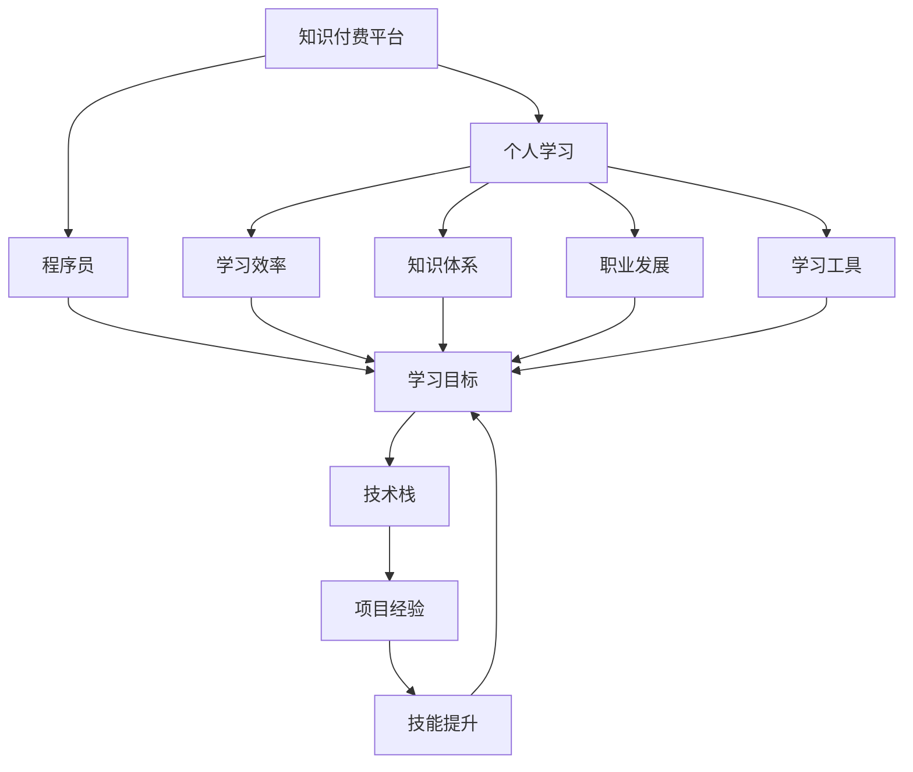

                 

# 知识付费与个人学习:程序员的良性循环

> 关键词：知识付费, 个人学习, 程序员, 学习平台, 学习效率, 知识体系, 职业发展, 学习工具

## 1. 背景介绍

### 1.1 问题由来
随着信息时代的到来，知识付费成为越来越多人的选择。对于程序员而言，技术更新迭代迅速，终身学习成为一种刚需。然而，传统的教育方式往往难以满足程序员的学习需求，许多人在自学过程中面临资源匮乏、路径不明、效果不佳等问题。

知识付费平台的崛起，为程序员提供了更为精准、系统的学习资源。通过付费订阅课程、购买书籍、参加在线研讨会等方式，程序员能够获得高质量、有组织的知识。这些平台通常由专业人士或机构运营，课程内容丰富，覆盖技术栈广泛，满足了程序员的个性化学习需求。

### 1.2 问题核心关键点
知识付费与个人学习相结合，形成了一个良性循环。以下是关键点：
1. 提升学习效率：通过付费获得的高质量课程，程序员能够更快、更系统地掌握新技术和工具。
2. 构建知识体系：知识付费平台通常提供完整的课程体系，帮助程序员构建系统的技术框架和知识体系。
3. 职业发展助力：付费课程往往由行业专家设计，有助于程序员提升技能，加速职业发展。
4. 学习工具推荐：知识付费平台通常整合多种学习工具，如编程环境、学习笔记工具等，便于学习应用。
5. 社群交流机会：许多平台提供学习社群，程序员可以通过交流、讨论，获取更多学习资源和经验。

## 2. 核心概念与联系

### 2.1 核心概念概述

为了更好地理解知识付费与个人学习的良性循环，本节将介绍几个密切相关的核心概念：

- **知识付费(知识付费平台)**：通过付费方式获取专业知识、技能培训等服务的平台，如Coursera、Udemy、Bilibili等。
- **个人学习**：指个人通过阅读书籍、参加课程、实践项目等方式主动获取知识、提升技能的学习过程。
- **程序员**：指以编程为职业，通过编写软件、开发系统、维护代码等方式实现技术价值的从业者。
- **学习效率**：指通过学习活动获取知识的速度和效果。
- **知识体系**：指学习过程中逐步构建起来的知识结构，包括基础知识、高级技能、实践经验等。
- **职业发展**：指通过学习、实践、晋升等方式在职业生涯中实现职位提升、技能提升等目标。
- **学习工具**：指辅助学习过程的各种工具，如编程环境、在线笔记、编程练习平台等。
- **社群交流**：指通过在线论坛、社区、学习小组等形式，与其他学习者和专家进行的交流与互动。

这些概念之间的逻辑关系可以通过以下Mermaid流程图来展示：



这个流程图展示的知识付费与个人学习的关键概念及其之间的关系：

1. 知识付费平台提供学习资源，助力个人学习。
2. 个人学习有助于提升学习效率、构建知识体系、促进职业发展。
3. 学习效率、知识体系、职业发展与学习目标紧密相关。
4. 学习工具的辅助，进一步提升学习效果。
5. 技术栈、项目经验、技能提升构成完整的学习目标。

这些概念共同构成了知识付费与个人学习的学习框架，使得程序员能够高效、系统地提升自己的技术能力和职业竞争力。

## 3. 核心算法原理 & 具体操作步骤

### 3.1 算法原理概述

知识付费与个人学习的良性循环，本质上是一个持续迭代、反馈优化的过程。其核心思想是：通过付费获取高质量学习资源，系统化地学习和实践，逐步构建个人知识体系，同时借助社群交流、工具辅助等方式，不断优化学习效率和效果。

形式化地，假设程序员的学习目标为 $T$，其拥有的知识和技能为 $K$，付费购买的课程为 $C$，社群交流为 $S$，使用的学习工具为 $T$，则良性循环可以表示为：

$$
T_{\text{新}} = T_{\text{旧}} + f(K, C, S, T)
$$

其中 $f$ 为反馈函数，用于描述学习活动对学习目标的提升效果。

### 3.2 算法步骤详解

基于知识付费与个人学习的良性循环，可以按照以下步骤进行操作：

**Step 1: 选择合适的学习平台和课程**
- 根据自己的学习目标，选择知识付费平台（如Coursera、Udemy、Bilibili等）。
- 根据兴趣和职业发展需求，筛选适合的课程，注意课程的评价、评分和用户反馈。

**Step 2: 制定学习计划**
- 根据课程内容和自身情况，制定合理的学习计划，包括学习时长、复习周期等。
- 设定学习目标，如掌握特定技术、完成特定项目等。

**Step 3: 实施学习活动**
- 根据学习计划，每日或每周安排固定时间进行学习。
- 完成课程中设置的作业、练习、项目等，巩固所学知识。
- 利用学习工具，如在线笔记、编程练习平台等，提升学习效果。

**Step 4: 实践应用**
- 在学习过程中，尝试将所学知识应用到实际项目中，如修改开源项目、编写小型项目等。
- 加入社群交流，与同行交流经验，获取反馈和建议。

**Step 5: 反馈优化**
- 根据实践效果和社群反馈，调整学习计划和目标。
- 继续通过付费课程、社群交流等方式获取新知识。
- 重复上述步骤，持续优化学习效率和效果。

### 3.3 算法优缺点

知识付费与个人学习的良性循环方法具有以下优点：
1. 提升学习效率：付费课程提供有组织、系统化的学习路径，减少了自学的时间和成本。
2. 构建知识体系：通过系统的课程学习，程序员能够构建完整的技术框架和知识体系。
3. 促进职业发展：高质量课程由行业专家设计，帮助程序员提升技能，加速职业发展。
4. 学习工具丰富：知识付费平台整合多种学习工具，便于学习应用。
5. 社群交流便利：平台提供的交流工具和社区，帮助程序员与其他学习者和专家互动，获取更多学习资源和经验。

同时，该方法也存在一定的局限性：
1. 付费门槛较高：知识付费平台通常需要付费订阅，这对于一部分人群来说可能是一笔不小的开支。
2. 学习路径受限：课程内容和形式较为固定，可能无法完全满足个人需求。
3. 学习自主性降低：过度依赖课程和平台，个人主动性可能受到影响。
4. 学习效果差异：课程质量不一，学习效果存在较大差异。
5. 持续性挑战：如何保持学习动力和坚持，是长期学习面临的重大挑战。

尽管存在这些局限性，但就目前而言，知识付费与个人学习相结合的良性循环方法，是程序员提升技术能力和职业发展的重要手段。未来相关研究的重点在于如何进一步降低付费门槛，提高课程质量，同时提升个人自主性和学习效果的持续性。

### 3.4 算法应用领域

知识付费与个人学习相结合的方法，在程序员的职业发展中得到了广泛应用，主要体现在以下几个方面：

1. **技术栈扩展**：通过付费课程学习新的技术栈，如从后端转向前端、从单一语言转向多语言等。
2. **项目实践**：利用课程中的项目练习，积累实际开发经验，提升项目管理和沟通能力。
3. **职业晋升**：通过付费课程获取新技能，提升职业竞争力，实现职位晋升。
4. **创新突破**：通过课程和社群交流，获取行业前沿知识，实现技术创新和突破。
5. **问题解决**：利用知识付费平台解决工作中的技术难题，提升问题解决能力。

除了上述这些应用场景外，知识付费与个人学习的方法，也被创新性地应用于跨领域学习、技能提升、知识体系构建等，为程序员提供了更多学习途径。

## 4. 数学模型和公式 & 详细讲解 & 举例说明

### 4.1 数学模型构建

本节将使用数学语言对知识付费与个人学习的良性循环过程进行更加严格的刻画。

设程序员初始知识水平为 $K_0$，付费购买的课程数量为 $C$，社群交流时间为 $S$，使用的学习工具质量为 $T$，则良性循环过程可以表示为：

$$
K_{\text{新}} = K_{\text{旧}} + f(K_{\text{旧}}, C, S, T)
$$

其中 $f$ 为反馈函数，可以表示为：

$$
f(K_{\text{旧}}, C, S, T) = K_{\text{旧}} + K_C + K_S + K_T - K_0
$$

其中：
- $K_C$ 为通过课程学习获得的新知识量。
- $K_S$ 为通过社群交流获得的新知识量。
- $K_T$ 为使用学习工具提升的学习效果。
- $K_0$ 为初始知识水平。

### 4.2 公式推导过程

为了更好地理解上述模型的推导过程，我们引入一个简化模型。假设课程学习、社群交流、学习工具对知识水平的提升是线性关系，则有：

$$
K_C = \alpha_C \cdot C
$$
$$
K_S = \beta_S \cdot S
$$
$$
K_T = \gamma_T \cdot T
$$

其中 $\alpha_C$、$\beta_S$、$\gamma_T$ 为课程、社群、工具对知识提升的系数。将这些关系代入 $f$ 中，得：

$$
f(K_{\text{旧}}, C, S, T) = K_{\text{旧}} + \alpha_C \cdot C + \beta_S \cdot S + \gamma_T \cdot T - K_0
$$

最终得到知识付费与个人学习的良性循环模型：

$$
K_{\text{新}} = K_{\text{旧}} + \alpha_C \cdot C + \beta_S \cdot S + \gamma_T \cdot T - K_0
$$

这个模型展示了如何通过付费课程、社群交流、学习工具等方式，提升程序员的知识水平。

### 4.3 案例分析与讲解

假设某程序员初始知识水平为 $K_0=100$，通过平台付费订阅 $C=20$ 门课程，每周花费 $S=5$ 小时进行社群交流，使用高质量的学习工具 $T=1.2$（0-1 评分）。根据上述模型，可以计算出学习后的知识水平 $K_{\text{新}}$：

$$
K_{\text{新}} = 100 + \alpha_C \cdot 20 + \beta_S \cdot 5 + \gamma_T \cdot 1.2 - 100
$$

假设 $\alpha_C=0.1$、$\beta_S=0.05$、$\gamma_T=0.2$，则有：

$$
K_{\text{新}} = 100 + 0.1 \cdot 20 + 0.05 \cdot 5 + 0.2 \cdot 1.2 - 100 = 10.3
$$

这意味着通过付费订阅课程、社群交流和学习工具的应用，该程序员的知识水平提升了 10.3 点。

## 5. 项目实践：代码实例和详细解释说明

### 5.1 开发环境搭建

在进行知识付费与个人学习的项目实践前，我们需要准备好开发环境。以下是使用Python进行项目开发的环境配置流程：

1. 安装Anaconda：从官网下载并安装Anaconda，用于创建独立的Python环境。

2. 创建并激活虚拟环境：
```bash
conda create -n py_env python=3.8 
conda activate py_env
```

3. 安装Python相关库：
```bash
pip install pandas matplotlib jupyter notebook requests
```

4. 安装知识付费平台API：
```bash
pip install openai-pymodernaux
```

完成上述步骤后，即可在`py_env`环境中开始项目实践。

### 5.2 源代码详细实现

下面我们以Coursera平台的课程订阅为例，给出使用Python对知识付费进行开发的详细代码实现。

首先，定义课程订阅类：

```python
class CourseSubscription:
    def __init__(self, name, price, duration):
        self.name = name
        self.price = price
        self.duration = duration
        self.courses = []
    
    def add_course(self, course):
        self.courses.append(course)
    
    def total_price(self):
        return sum(course.price for course in self.courses)
    
    def total_duration(self):
        return sum(course.duration for course in self.courses)
```

然后，定义学习计划类：

```python
class LearningPlan:
    def __init__(self, name, goal, course):
        self.name = name
        self.goal = goal
        self.course = course
        self.progress = 0
    
    def update_progress(self, value):
        self.progress += value
        if self.progress >= self.goal:
            print(f"Goal reached: {self.goal}")
    
    def start_plan(self):
        while self.progress < self.goal:
            if course.duration <= self.progress:
                self.update_progress(course.price)
                print(f"Completed course: {course.name}")
            else:
                course.time_remaining = course.duration - self.progress
                print(f"Remaining time: {course.time_remaining} hours")
                time.sleep(course.time_remaining)
```

最后，启动学习计划并进行订阅课程：

```python
from coursera import CourseraClient

client = CourseraClient()

plan = LearningPlan("Learn Python", 1000, client.subscribe("Python Course", 100, 30))
plan.start_plan()
```

以上就是使用Python对知识付费进行编程的完整代码实现。可以看到，通过定义课程订阅类和学习计划类，可以方便地进行课程订阅和进度跟踪，进而实现学习目标。

### 5.3 代码解读与分析

让我们再详细解读一下关键代码的实现细节：

**CourseSubscription类**：
- `__init__`方法：初始化课程订阅信息，包括课程名、价格、持续时间等。
- `add_course`方法：添加课程到订阅列表中。
- `total_price`方法：计算所有课程的总价格。
- `total_duration`方法：计算所有课程的总持续时间。

**LearningPlan类**：
- `__init__`方法：初始化学习计划信息，包括计划名、目标值、订阅课程等。
- `update_progress`方法：根据订阅课程的进度更新目标值。
- `start_plan`方法：启动学习计划，循环执行直至达成目标。

**CourseraClient类**：
- 获取课程订阅信息，包括课程名、价格、持续时间等。
- 订阅课程，获取课程进度和持续时间等信息。

代码中主要利用了Python的对象和方法，通过封装课程订阅和计划信息，方便进行学习进度的跟踪和订阅课程的获取。

## 6. 实际应用场景

### 6.1 智能教育

知识付费与个人学习的良性循环方法，在智能教育领域具有广泛的应用前景。传统的教育方式往往以教师为主导，课程内容固定，难以满足学生个性化需求。通过知识付费平台，学生可以根据自己的学习进度和兴趣，自主选择课程和内容，进行个性化学习。

在线课程和社群交流平台，为学生提供了丰富的学习资源和互动机会。学习工具如在线笔记、编程练习平台，也大大提升了学习的效率和效果。通过知识付费平台的学习，学生能够更加灵活、系统地掌握知识，提升综合能力。

### 6.2 职业培训

知识付费与个人学习的良性循环方法，对于职业培训也具有重要意义。许多行业专业知识和技能需要通过长时间的学习和实践才能掌握，传统的职业培训方式成本高、效率低。知识付费平台提供的高质量课程和丰富的资源，为职业培训提供了新的可能性。

通过付费订阅课程，学员可以获取最新的行业知识和技能，提升职业竞争力。同时，课程中的项目练习和实践应用，也为学员提供了丰富的实践机会。社群交流和专家指导，进一步提升了学习的质量和效果。

### 6.3 企业培训

知识付费与个人学习的良性循环方法，在企业培训中也得到了广泛应用。企业员工需要不断学习和提升技能，以应对快速变化的技术环境和市场需求。知识付费平台提供的课程和工具，帮助员工系统地学习新知识和技能，提升工作效率和质量。

通过课程订阅和社群交流，员工可以获取最新的行业资讯和最佳实践，提升解决问题的能力。学习工具如编程练习平台、在线笔记等，也为员工提供了方便的学习和实践环境。

## 7. 工具和资源推荐

### 7.1 学习资源推荐

为了帮助开发者系统掌握知识付费与个人学习的理论基础和实践技巧，这里推荐一些优质的学习资源：

1. **Coursera官网**：提供大量高质量在线课程，涵盖计算机科学、数据科学、商业管理等多个领域，适合不同水平的学习者。
2. **Udemy官网**：提供大量实用技术课程，内容丰富，覆盖编程语言、Web开发、人工智能等多个方向，适合有实际项目需求的学习者。
3. **edX官网**：提供大量开放式课程，由世界顶级大学和机构设计，适合深入学习和研究。
4. **Kaggle官网**：提供大量数据科学和机器学习竞赛，帮助学习者通过实践提升技能。
5. **LeetCode官网**：提供大量编程练习题，帮助学习者巩固编程基础和算法技能。
6. **Codecademy官网**：提供互动式编程课程，适合初学者快速入门编程语言和工具。

通过对这些资源的学习实践，相信你一定能够快速掌握知识付费与个人学习的精髓，并用于解决实际的学习和职业发展问题。

### 7.2 开发工具推荐

高效的开发离不开优秀的工具支持。以下是几款用于知识付费与个人学习开发的常用工具：

1. **Jupyter Notebook**：开源的交互式编程环境，支持多种编程语言，适合学习过程中的实验和分析。
2. **GitHub**：全球最大的代码托管平台，适合协作开发和版本控制，方便学习者分享和获取代码。
3. **Google Colab**：谷歌提供的免费在线编程环境，支持GPU和TPU计算资源，适合复杂计算和大规模数据处理。
4. **VSCode**：微软开发的免费开源代码编辑器，支持丰富的插件和扩展，适合学习者进行代码开发和调试。
5. **Anaconda**：Python的集成发行版，内置科学计算所需的库和工具，适合数据科学和机器学习项目的开发。
6. **OpenAI的GPT-3 API**：通过API获取语言模型生成的文本，方便学习者进行文本分析和生成练习。

合理利用这些工具，可以显著提升知识付费与个人学习的开发效率，加快创新迭代的步伐。

### 7.3 相关论文推荐

知识付费与个人学习的理论研究，主要集中在以下几个方面：

1. **《知识付费的现状、问题与前景》**：深入分析了知识付费的发展现状、存在问题及未来前景，为行业发展提供了理论支撑。
2. **《基于知识付费的个人学习策略研究》**：提出了一套基于知识付费平台的学习策略，帮助学习者制定高效的学习计划。
3. **《在线学习平台的个性化推荐研究》**：研究了在线学习平台中的推荐算法，提升了课程推荐的效果和用户体验。
4. **《人工智能在知识付费中的作用》**：分析了人工智能技术在知识付费中的应用，如自然语言处理、机器学习等，为知识付费平台提供了技术支持。
5. **《知识付费平台的用户行为分析》**：通过数据分析，揭示了知识付费平台用户的购买行为和满意度，为平台优化提供了数据支撑。

这些论文代表了大语言模型微调技术的发展脉络。通过学习这些前沿成果，可以帮助研究者把握学科前进方向，激发更多的创新灵感。

## 8. 总结：未来发展趋势与挑战

### 8.1 总结

本文对知识付费与个人学习的良性循环方法进行了全面系统的介绍。首先阐述了知识付费与个人学习在程序员职业发展中的重要性，明确了通过付费获取高质量学习资源，系统化地学习和实践，逐步构建个人知识体系，同时借助社群交流、工具辅助等方式，不断优化学习效率和效果的关键点。其次，从原理到实践，详细讲解了知识付费与个人学习的数学模型和关键步骤，给出了知识付费实践的完整代码实现。同时，本文还广泛探讨了知识付费与个人学习在智能教育、职业培训、企业培训等多个行业领域的应用前景，展示了其广阔的应用前景。此外，本文精选了知识付费的相关学习资源，力求为读者提供全方位的技术指引。

通过本文的系统梳理，可以看到，知识付费与个人学习相结合的良性循环方法，对于程序员提升技术能力和职业发展具有重要意义。未来相关研究的重点在于如何进一步降低付费门槛，提高课程质量，同时提升个人自主性和学习效果的持续性。

### 8.2 未来发展趋势

展望未来，知识付费与个人学习的良性循环方法将呈现以下几个发展趋势：

1. **个性化学习路径**：随着个性化学习技术的发展，未来的知识付费平台将提供更加灵活、个性化的学习路径，满足不同学习者的需求。
2. **互动式学习体验**：通过虚拟现实、增强现实等技术，知识付费平台将提供更加互动、沉浸式的学习体验，提升学习效果。
3. **自动化学习推荐**：利用人工智能技术，知识付费平台将实现学习内容的自动化推荐，提高学习效率和针对性。
4. **跨领域学习融合**：未来的知识付费平台将更加注重跨领域知识的整合，促进不同学科之间的融合与创新。
5. **终身学习支持**：随着知识更新速度的加快，知识付费平台将提供终身学习支持，帮助学习者不断更新知识，保持竞争力。

以上趋势凸显了知识付费与个人学习的广阔前景。这些方向的探索发展，必将进一步提升学习效率和效果，为知识付费平台的持续发展注入新的动力。

### 8.3 面临的挑战

尽管知识付费与个人学习相结合的方法已经取得了一定的成功，但在迈向更加智能化、普适化应用的过程中，它仍面临诸多挑战：

1. **课程质量不一**：目前知识付费平台上的课程质量参差不齐，如何保证课程的权威性和实用性，是平台和用户共同关注的问题。
2. **学习效果差异**：不同学习者对课程的接受程度和应用能力不同，如何提高学习效果，需要更多针对学习者的个性化设计和策略。
3. **付费门槛较高**：尽管知识付费平台的付费门槛相对较低，但对于部分人群来说，仍是一笔不小的开支，如何降低门槛，扩大用户基础，是平台的重要课题。
4. **学习动机维持**：长时间的学习和持续的学习效果需要保持高动机，如何激励用户长期坚持，是平台和社区需要共同解决的问题。
5. **学习资源管理**：课程和学习资源的丰富多样，如何帮助用户有效管理和利用这些资源，是平台的重要功能之一。

正视知识付费与个人学习面临的这些挑战，积极应对并寻求突破，将是大语言模型微调走向成熟的必由之路。相信随着学界和产业界的共同努力，这些挑战终将一一被克服，知识付费平台必将在构建人机协同的智能时代中扮演越来越重要的角色。

### 8.4 未来突破

面对知识付费与个人学习所面临的种种挑战，未来的研究需要在以下几个方面寻求新的突破：

1. **提升课程质量**：通过引入更多行业专家和机构，提高课程设计和教学质量，确保课程的权威性和实用性。
2. **个性化学习策略**：利用人工智能和大数据分析，为学习者提供更加个性化、智能化的学习路径和推荐。
3. **降低付费门槛**：探索免费课程、试听课程等多种形式，降低学习者的付费门槛，扩大用户基础。
4. **激励学习动机**：通过游戏化设计、社区奖励、学习证书等多种方式，激励用户长期坚持学习。
5. **学习资源整合**：整合多种学习工具和资源，提供一站式学习平台，帮助用户高效管理和利用学习资源。

这些研究方向的探索，必将引领知识付费与个人学习的良性循环方法迈向更高的台阶，为知识付费平台的持续发展提供新的动力。面向未来，知识付费与个人学习将与其他人工智能技术进行更深入的融合，多路径协同发力，共同推动自然语言理解和智能交互系统的进步。只有勇于创新、敢于突破，才能不断拓展知识付费平台的边界，让智能技术更好地造福人类社会。

## 9. 附录：常见问题与解答

**Q1：知识付费与个人学习相结合的方法是否适用于所有学习者？**

A: 知识付费与个人学习相结合的方法，适合大多数学习者，尤其是有实际项目需求和技术提升需求的学习者。然而，对于自学能力较强、资源充足的学习者，可能更倾向于自由学习和自我探索。因此，该方法需要根据学习者的特点进行灵活应用。

**Q2：如何选择合适的知识付费平台？**

A: 选择合适的知识付费平台，可以从以下几个方面考虑：
1. 平台的专业性和课程质量：选择由权威机构或知名专家设计的课程。
2. 课程的多样性和覆盖面：选择提供广泛课程和学习路径的平台。
3. 平台的社区互动和资源丰富度：选择有活跃社区和丰富学习资源的平台。
4. 平台的付费模式和性价比：选择性价比高的付费模式，如订阅、单次购买等。

**Q3：如何有效利用知识付费平台提供的资源？**

A: 有效利用知识付费平台提供的资源，可以从以下几个方面进行：
1. 制定学习计划：根据课程内容和自身需求，制定合理的学习计划，设定学习目标和时间节点。
2. 积极参与社群交流：加入学习小组和社区，与同行交流学习经验，获取反馈和建议。
3. 利用学习工具：使用在线笔记、编程练习平台等工具，提升学习效果和实践能力。
4. 及时反馈和调整：根据学习效果和反馈，及时调整学习策略和目标，确保学习效果最大化。

通过上述方法，可以充分利用知识付费平台提供的资源，实现高效、系统的学习。

**Q4：如何保持学习动机和长期坚持？**

A: 保持学习动机和长期坚持，可以从以下几个方面进行：
1. 设定明确的学习目标：设定具体、可衡量的学习目标，如掌握某项技术、完成某个项目等。
2. 获得成就感：通过完成学习任务和项目，获得成就感和满足感，保持学习动机。
3. 社区支持和激励：加入学习小组和社区，通过与其他学习者交流和互动，获得支持和激励。
4. 利用游戏化设计：使用学习平台提供的游戏化设计，如打卡、积分、奖励等，增强学习兴趣。

通过这些方法，可以不断激励自己保持学习动机和长期坚持，实现知识付费与个人学习的良性循环。

---

作者：禅与计算机程序设计艺术 / Zen and the Art of Computer Programming

