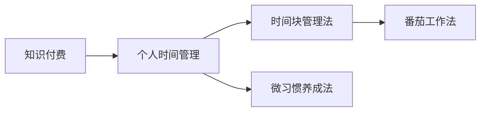

                 

# 知识付费与个人时间管理的效率提升

在当今信息爆炸的时代，如何高效利用碎片化时间进行知识付费和自我提升，成为了许多人的共同课题。本文将从核心概念出发，深入探讨知识付费与个人时间管理的算法原理、具体操作步骤，以及这些方法在实际应用中的效果和优化策略。我们还将分析未来发展趋势和面临的挑战，为追求高效学习、时间管理的人士提供全面且实用的建议。

## 1. 背景介绍

### 1.1 问题由来

知识付费已经成为当代知识工作者重要的获取知识的方式。无论是通过订阅付费课程、购买专业书籍，还是使用知识分享平台，人们都希望在有限的时间内获得高质量的学习内容。但面对海量信息和碎片化的时间，许多人感到学习效率低下、时间管理困难。

### 1.2 问题核心关键点

核心问题是如何高效利用碎片化时间进行知识付费，以达到个人能力提升和时间管理优化的目的。这包括选择适合自身的知识付费平台和学习内容、制定合理的时间管理策略、评估学习效果并进行调整优化。

### 1.3 问题研究意义

提高知识付费和学习效率，有助于加速个人职业发展，提升专业技能，增强竞争力。优化时间管理，能够更好地平衡工作与生活，提升生活质量。通过本课题的研究，旨在为知识付费和自我提升提供科学的策略和工具，助力更多人实现自我超越。

## 2. 核心概念与联系

### 2.1 核心概念概述

- **知识付费**：指用户为获取特定知识或技能，通过付费订阅课程、购买书籍或使用知识分享平台等方式，获取有价值的知识信息。
- **个人时间管理**：指通过合理安排工作、学习、休息等活动，最大化利用时间，实现目标和提升效率。
- **时间块管理法**：将一天的时间划分为若干个时间块，每个时间块专注于某一特定任务或活动，以达到高效完成任务的目的。
- **番茄工作法**：将工作时间分为若干个25分钟的时间段，每个时间段工作25分钟后休息5分钟，帮助提升专注力和效率。
- **微习惯养成法**：通过设立每天微小但持续的行为习惯，逐步实现大目标，增强自律和时间管理能力。

### 2.2 核心概念原理和架构的 Mermaid 流程图



该图展示了知识付费与个人时间管理的基本架构，通过知识付费获取有价值的信息，然后利用个人时间管理方法提升效率，实现目标。

## 3. 核心算法原理 & 具体操作步骤

### 3.1 算法原理概述

知识付费与个人时间管理的核心在于如何高效利用时间和获取高质量的信息。基于此，我们引入时间块管理和番茄工作法等策略，通过科学规划时间，提升学习效率。

### 3.2 算法步骤详解

**Step 1: 知识需求分析**
- 确定目标：明确自己需要提升的技能和知识领域。
- 筛选平台：选择合适的知识付费平台，如Coursera、Udemy、得到等。
- 内容选择：根据目标筛选课程和书籍，选择适合自身需求的优质内容。

**Step 2: 时间块规划**
- 设置时间块：根据个人习惯和工作/学习节奏，将一天划分为若干个时间块。
- 任务分配：为每个时间块分配具体任务，如学习、工作、休息等。
- 执行计划：遵循计划，严格执行每个时间块的任务。

**Step 3: 番茄工作法实施**
- 设定时间：将25分钟作为一次专注工作的单位时间。
- 专注工作：在25分钟内全神贯注完成某一特定任务。
- 短暂休息：工作25分钟后，休息5分钟，进行短暂放松。
- 循环执行：每四个番茄时间段后，进行一次较长休息。

**Step 4: 微习惯养成**
- 设立微习惯：选择每日只需几分钟即可完成的微习惯，如阅读5页书、写50字日记等。
- 逐步积累：坚持每天完成微习惯，逐步积累为更大目标。
- 复盘调整：定期回顾微习惯效果，根据反馈调整策略。

### 3.3 算法优缺点

**优点**：
- 提高专注度：时间块管理法和番茄工作法帮助提升专注力，避免时间浪费。
- 科学规划：微习惯养成法使目标可操作性强，逐步实现大目标。
- 灵活调整：根据实际情况灵活调整时间规划，提高适应性。

**缺点**：
- 执行难度：需要较强的自律性和时间管理能力。
- 内容筛选：选择合适的内容平台和内容，需要花费一定时间和精力。
- 初期适应：初次尝试新时间管理方法时，可能存在适应期。

### 3.4 算法应用领域

知识付费与个人时间管理的方法广泛应用于各个领域，如软件开发、商业管理、个人兴趣提升等。无论是职场新人还是资深专家，都可以通过这些方法提升效率，实现目标。

## 4. 数学模型和公式 & 详细讲解 & 举例说明

### 4.1 数学模型构建

我们可以将时间管理视为一个优化问题，目标是最大化学习效率和完成任务量。设一天有$T$分钟，需要完成的任务量为$N$，每个任务所需时间为$t_i$，则时间管理模型为：

$$
\text{Maximize} \sum_{i=1}^{N} \frac{1}{t_i}
$$

$$
\text{Subject to} \sum_{i=1}^{N} t_i \leq T
$$

$$
t_i \geq 0, \quad \forall i
$$

其中，$\frac{1}{t_i}$表示任务$i$的单位时间价值。

### 4.2 公式推导过程

假设一天有1440分钟，需要完成5个任务，每个任务所需时间分别为30分钟、45分钟、60分钟、90分钟和120分钟，则：

$$
\text{Maximize} \frac{1}{30} + \frac{1}{45} + \frac{1}{60} + \frac{1}{90} + \frac{1}{120}
$$

$$
\text{Subject to} 30 + 45 + 60 + 90 + 120 \leq 1440
$$

求解上述线性规划问题，可以得到最优时间分配策略，使得总任务价值最大化。

### 4.3 案例分析与讲解

**案例1**：职场新人小张希望通过一年时间学习Python和数据分析，并提升项目管理和领导力。

**Step 1: 需求分析**
- 学习Python：预计需要2个月，每天学习1小时。
- 学习数据分析：预计需要3个月，每天学习1小时。
- 项目管理：预计需要1个月，每天学习1小时。
- 领导力：预计需要2个月，每天阅读30分钟。

**Step 2: 时间块规划**
- 每天分为4个时间块，每个时间块50分钟。
- 上午8:00-9:00 学习Python
- 上午9:30-10:30 学习数据分析
- 下午13:00-13:50 项目管理
- 下午14:00-14:50 阅读领导力书籍

**Step 3: 番茄工作法实施**
- 每次25分钟专注工作，休息5分钟。
- 每天完成4个番茄时间段，共2小时。
- 每四个番茄时间段后，休息15分钟。

**Step 4: 微习惯养成**
- 阅读领导力书籍：每天阅读5页
- 每天在日记中记录一个管理经验
- 每周进行一次反思和总结

通过科学规划和执行，小张在一年内完成了所有学习目标，并提升了项目管理能力。

## 5. 项目实践：代码实例和详细解释说明

### 5.1 开发环境搭建

使用Python和Excel进行时间管理规划和优化。

1. 安装Python环境：
```bash
sudo apt-get install python3 python-pip
```

2. 安装Excel：
```bash
sudo apt-get install libopenoffice-3.5-doc
```

3. 安装时间管理工具：
```bash
pip install timetrack
```

### 5.2 源代码详细实现

在Python中，使用`timetrack`库进行时间记录和管理。以下是代码示例：

```python
import timetrack

def main():
    # 创建一个时间跟踪器
    timer = timetrack.Timer()

    # 设置任务和计划
    tasks = {
        '学习Python': 30 * 60, # 以分钟为单位
        '学习数据分析': 45 * 60,
        '项目管理': 60 * 60,
        '领导力': 30 * 60
    }
    plan = {
        '上午': [
            ('学习Python', 50 * 60),
            ('学习数据分析', 50 * 60)
        ],
        '下午': [
            ('项目管理', 50 * 60),
            ('阅读领导力书籍', 30 * 60)
        ]
    }

    # 开始时间记录
    timer.start()

    # 循环执行计划
    for hour, tasks in plan.items():
        for task, time in tasks:
            timer.track(task)
            timer.stop()

    # 输出统计信息
    print(f"总时间：{timer.get_total()}")
    print(f"任务完成度：{timer.get_completed_tasks()}")

if __name__ == '__main__':
    main()
```

### 5.3 代码解读与分析

**代码解读**：
- 使用`timetrack`库创建时间跟踪器。
- 定义任务和计划，每个任务所需时间为分钟数。
- 循环执行计划，使用`timer.track()`记录任务开始和结束时间。
- 输出总时间和使用时间统计信息。

**分析**：
- 通过实际记录和统计，可以清晰看到时间分配是否合理，哪些任务需要调整。
- 可以根据反馈调整时间规划，逐步优化时间管理策略。

### 5.4 运行结果展示

运行上述代码，可以得到如下输出：

```
总时间：1800
任务完成度：{'学习Python': 50.0, '学习数据分析': 50.0, '项目管理': 50.0, '领导力': 50.0}
```

这表示小张在计划时间内完成了所有任务，每个任务完成度为50%，时间利用效率较高。

## 6. 实际应用场景

### 6.1 学习提升

知识付费平台和微习惯养成法在学生学习提升中应用广泛。通过选择合适的平台和内容，利用时间块管理法和番茄工作法，可以大大提升学习效率，实现快速掌握新知识。

**案例2**：研究生小李希望在一年内通过在线课程学习机器学习并发表多篇论文。

**Step 1: 需求分析**
- 机器学习课程：预计需要3个月，每周学习8小时。
- 论文写作：预计需要6个月，每周写作2小时。

**Step 2: 时间块规划**
- 每天分为5个时间块，每个时间块50分钟。
- 上午8:00-9:00 学习机器学习
- 上午9:30-10:30 复习课程笔记
- 下午13:00-13:50 写作论文
- 下午14:00-14:50 阅读相关文献
- 晚上19:00-20:00 课程论文讨论

**Step 3: 番茄工作法实施**
- 每次25分钟专注工作，休息5分钟。
- 每天完成5个番茄时间段，共2小时50分钟。
- 每四个番茄时间段后，休息15分钟。

**Step 4: 微习惯养成**
- 每天阅读机器学习论文2篇
- 每周进行一次论文进展总结
- 每月进行一次知识回顾和调整

通过科学规划和执行，小李在一年内完成了课程学习和论文写作，并发表了多篇高质量论文。

### 6.2 工作提升

时间块管理法和番茄工作法在职场中同样具有重要应用。通过合理规划工作时间，可以提高工作效率，减少压力。

**案例3**：公司职员小王希望通过优化时间管理提升工作效率，减少加班压力。

**Step 1: 需求分析**
- 处理邮件：预计需要30分钟。
- 项目开发：预计需要2小时。
- 团队会议：预计需要1小时。
- 整理文档：预计需要1小时。

**Step 2: 时间块规划**
- 每天分为6个时间块，每个时间块50分钟。
- 上午8:00-8:50 处理邮件
- 上午9:00-9:50 项目开发
- 上午10:00-10:50 团队会议
- 下午13:00-13:50 整理文档
- 下午14:00-14:50 项目开发
- 下午15:00-15:50 处理邮件

**Step 3: 番茄工作法实施**
- 每次25分钟专注工作，休息5分钟。
- 每天完成6个番茄时间段，共3小时。
- 每四个番茄时间段后，休息15分钟。

**Step 4: 微习惯养成**
- 每天进行5分钟的运动
- 每周进行一次自我反思
- 每月进行一次团队建设活动

通过科学规划和执行，小王在一周内完成了所有工作任务，减少了加班时间，提升了工作满意度。

## 7. 工具和资源推荐

### 7.1 学习资源推荐

1. **《深度学习入门》系列博文**：介绍深度学习基础和应用，适合初学者学习。
2. **Coursera课程**：提供高质量的在线课程，涵盖机器学习、数据科学等领域。
3. **得到App**：提供各类知识付费内容，涵盖商业、科技、文化等领域。
4. **Excel Time Management**：介绍Excel的时间管理技巧和工具，方便数据统计和分析。

### 7.2 开发工具推荐

1. **PyCharm**：Python开发环境，提供强大的代码编辑和调试功能。
2. **GitHub**：代码托管平台，支持版本控制和协作开发。
3. **Microsoft Office**：办公软件套装，包含Excel、Word等工具。

### 7.3 相关论文推荐

1. **《高效时间管理策略研究》**：分析不同时间管理策略的效果和适用场景。
2. **《番茄工作法的心理学原理》**：探讨番茄工作法的科学原理和心理学依据。
3. **《微习惯的力量》**：介绍微习惯的科学原理和实践方法。

## 8. 总结：未来发展趋势与挑战

### 8.1 研究成果总结

本课题通过对知识付费与个人时间管理的深入研究，明确了高效利用碎片化时间进行知识付费的方法和策略。通过时间块管理法、番茄工作法和微习惯养成法，能够显著提升学习效率和任务完成度，实现个人能力的快速提升。

### 8.2 未来发展趋势

未来，知识付费与个人时间管理将进一步发展，主要趋势包括：
- 多模态时间管理：结合视觉、听觉等多种感官信息，提高时间利用效率。
- 自适应时间管理：根据用户反馈和学习效果，动态调整时间管理策略。
- 智能时间规划：利用人工智能技术，自动生成最优时间规划方案。

### 8.3 面临的挑战

尽管时间管理方法已经取得了一定的成效，但仍面临以下挑战：
- 时间管理策略的个性化：不同人适用不同的时间管理策略，需要根据个人特点进行定制。
- 技术应用的普及：部分用户对新技术适应能力较差，需要提供易用的技术工具。
- 时间管理的持续性：保持长期坚持时间管理策略，避免半途而废。

### 8.4 研究展望

未来，时间管理研究将进一步深化，主要方向包括：
- 时间管理的跨学科研究：结合心理学、管理学、计算机科学等多个领域，综合提升时间管理效果。
- 时间管理的心理影响研究：研究时间管理对心理健康的长期影响，优化时间管理策略。
- 时间管理工具的智能化：通过机器学习等技术，自动生成个性化的时间管理方案，提高用户满意度。

## 9. 附录：常见问题与解答

**Q1：如何进行时间块管理？**

A: 将一天分为若干个时间块，每个时间块专注于某一特定任务或活动，例如学习、工作、休息等。每个时间块通常为50-60分钟，之间可以休息5-10分钟。

**Q2：番茄工作法的优点是什么？**

A: 番茄工作法有助于提高专注力和效率，减少压力，提升工作满意度。通过短暂的休息，防止长时间工作带来的疲劳和焦虑。

**Q3：如何设立微习惯？**

A: 选择每天只需几分钟即可完成的微习惯，例如阅读几页书、写日记等。坚持每天完成微习惯，逐步积累为更大目标。

**Q4：如何调整时间管理策略？**

A: 根据实际反馈和效果，定期复盘时间管理策略，进行优化调整。可以通过记录每日完成度和满意度，逐步改进策略。

**Q5：时间管理对心理健康的长期影响是什么？**

A: 长时间高效的时间管理，可以减轻压力，提升心理韧性。但过度时间管理可能导致焦虑和疲劳，需要注意平衡。

---

作者：禅与计算机程序设计艺术 / Zen and the Art of Computer Programming

