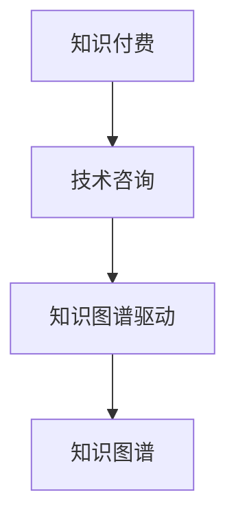

                 

## 1. 背景介绍

### 1.1 问题由来
随着互联网科技的迅猛发展，程序员已成为推动社会发展的重要力量。然而，技术更新换代速度的加快，以及企业对创新与效率的迫切需求，使得程序员的职业生涯面临前所未有的挑战。传统的单一技术技能已经不能满足市场需求，跨界和复合技能成为新的发展方向。在此背景下，知识付费与技术咨询作为程序员双线发展的两条路径，受到越来越多从业者的关注。

### 1.2 问题核心关键点
知识付费与技术咨询是当前程序员职业发展中的两个热门话题。通过深入分析其核心关键点，可以更清楚地理解两者之间的关系及其对个人职业发展的影响。

#### 1.2.1 知识付费
知识付费是指通过购买或订阅形式获取专业知识的经济活动。知识付费平台如知乎、得到、网易云课堂等，为程序员提供了丰富的学习资源。它主要涉及以下几个方面：
- **内容形式**：视频教程、文本课程、音频播客等。
- **内容覆盖**：编程语言、开发工具、软件架构、项目管理等。
- **付费模式**：单次购买、订阅服务、按需支付等。

#### 1.2.2 技术咨询
技术咨询是指通过向企业或个人提供专业建议和解决方案，帮助客户解决技术问题。它通常涉及以下几个方面：
- **技术领域**：软件开发、系统架构、网络安全、大数据等。
- **服务模式**：远程技术支持、现场技术指导、技术培训等。
- **客户对象**：中小型企业、初创公司、个人开发者等。

### 1.3 问题研究意义
研究知识付费与技术咨询对程序员职业发展的双重影响，对于明确个人发展方向、提升专业水平、拓展职业机会具有重要意义：

1. **职业多元化**：通过知识付费与技术咨询的结合，程序员可以掌握更多技能，从而实现职业多元化，避免单一技能带来的风险。
2. **专业提升**：持续的学习和咨询能帮助程序员保持技术领先，解决复杂的技术难题。
3. **拓展网络**：通过知识付费和咨询业务，程序员可以建立广泛的技术网络，拓展职业发展空间。
4. **收入多样化**：不仅依赖工资收入，还可以通过知识付费与技术咨询获得更多额外的收入来源。
5. **提高竞争力**：拥有多样化技能和丰富经验的技术咨询，将使程序员在职场上更具竞争力。

## 2. 核心概念与联系

### 2.1 核心概念概述

为更好地理解知识付费与技术咨询的关系，本节将介绍几个密切相关的核心概念：

- **知识付费**：通过购买或订阅形式获取专业知识的经济活动。知识付费平台如知乎、得到、网易云课堂等。
- **技术咨询**：向企业或个人提供专业建议和解决方案，帮助客户解决技术问题的服务模式。
- **知识图谱**：描述知识之间关系的图结构，用于知识组织和检索。
- **知识图谱驱动技术咨询**：结合知识图谱的查询和推理能力，提供更加智能化的技术咨询服务。
- **知识付费与技术咨询的结合**：通过知识付费获取专业知识和技能，在技术咨询中应用所学，形成良性循环。

这些核心概念之间的逻辑关系可以通过以下Mermaid流程图来展示：



这个流程图展示了几者之间的核心联系：

1. 知识付费是获取专业知识和技能的主要途径。
2. 技术咨询是应用这些知识解决实际问题的服务方式。
3. 知识图谱可以用于组织和检索知识，从而提高技术咨询的智能化水平。
4. 知识付费与技术咨询相结合，形成良性的知识获取与应用循环。

## 3. 核心算法原理 & 具体操作步骤
### 3.1 算法原理概述

知识付费与技术咨询的结合，本质上是通过知识的获取与应用，提升技术咨询的效果。其核心思想是：将知识付费作为技术咨询的前提，通过持续的学习和积累，形成专业化的知识体系，从而提供更高质量的技术咨询服务。

### 3.2 算法步骤详解

知识付费与技术咨询的结合，主要包括以下几个关键步骤：

**Step 1: 选择合适的知识付费平台和资源**
- 根据个人兴趣和职业需求，选择适合自己的知识付费平台如知乎、得到、网易云课堂等。
- 关注热门技术领域如编程语言、软件开发、人工智能等，订阅相关课程和讲座。

**Step 2: 设定学习计划和目标**
- 制定详细的学习计划，合理分配时间，设置短期和长期学习目标。
- 学习前先了解课程大纲和知识点，预习并记录难点。

**Step 3: 应用知识解决问题**
- 在实际工作中，遇到技术问题时，首先使用知识图谱查找相关知识，验证问题是否已有解决方案。
- 若知识图谱中无解决方案，可调用外部API或查阅相关文档，寻找解决思路。
- 在解决问题的过程中，持续更新知识图谱，丰富专业知识体系。

**Step 4: 提供技术咨询**
- 通过社交媒体、技术论坛、企业内部网络等方式，主动提供技术咨询服务。
- 针对客户提出的问题，结合所学知识进行分析和解决。
- 在咨询过程中，不断积累实战经验，提升解决复杂问题的能力。

**Step 5: 反馈与持续优化**
- 定期收集客户反馈，评估技术咨询的效果。
- 根据客户反馈，持续优化知识图谱和咨询方法，提升服务质量。

以上是知识付费与技术咨询结合的一般流程。在实际应用中，还需要根据具体任务的特点，对各环节进行优化设计，如改进知识图谱的查询算法、引入更多正则化技术、搜索最优的学习计划等，以进一步提升服务效果。

### 3.3 算法优缺点

知识付费与技术咨询的结合，具有以下优点：

1. **提升技术水平**：通过持续学习，掌握更多前沿技术和最佳实践。
2. **解决问题能力提升**：将所学知识应用于实际问题，解决复杂技术难题。
3. **拓展业务范围**：除了编程开发，还可以提供技术咨询、项目管理、技术培训等服务。
4. **增加收入来源**：知识付费与技术咨询相结合，增加额外的收入渠道。

同时，该方法也存在一定的局限性：

1. **成本较高**：知识付费需要持续投入时间和金钱，部分课程可能价格较高。
2. **学习效果不一**：不同的课程和平台质量参差不齐，需要精选课程。
3. **时间管理困难**：平衡工作和学习的时间，可能会造成一定压力。
4. **咨询服务质量不稳定**：受客户需求和问题复杂度影响，服务质量存在波动。

尽管存在这些局限性，但就目前而言，知识付费与技术咨询的结合仍是一种有效的双线发展模式，适合具有较强学习能力、时间管理和项目执行能力的程序员。

### 3.4 算法应用领域

知识付费与技术咨询的结合，在多个行业领域都有广泛应用，例如：

- **IT企业**：软件开发、系统架构、测试、运维等。
- **初创公司**：技术选型、产品设计、团队管理等。
- **教育机构**：技术培训、课程开发、教学研究等。
- **互联网公司**：产品设计、用户研究、数据分析等。
- **创业团队**：技术指导、商业计划、市场调研等。

除了上述这些常见应用外，知识付费与技术咨询的结合，还将进一步拓展到更多行业和场景中，为各类技术难题提供解决方案，推动技术进步和行业发展。

## 4. 数学模型和公式 & 详细讲解  
### 4.1 数学模型构建

本节将使用数学语言对知识付费与技术咨询的结合过程进行更加严格的刻画。

设知识付费平台上的课程为 $C=\{(c_i,s_i)\}_{i=1}^N, c_i$ 表示课程内容，$s_i$ 表示课程价格。假设程序员在平台上订阅了 $K$ 门课程，课程价格总和为 $S$。设技术咨询项目为 $P=\{(p_j,b_j)\}_{j=1}^M, p_j$ 表示咨询项目内容，$b_j$ 表示咨询项目收费。假设程序员完成了 $T$ 个技术咨询项目，收费总和为 $B$。

定义知识付费与技术咨询的综合收益为：

$$
\text{综合收益} = \sum_{i=1}^K w_i s_i + \sum_{j=1}^M w_j b_j
$$

其中 $w_i$ 和 $w_j$ 为课程和咨询项目的权重，反映了其对个人职业发展的重要性。

### 4.2 公式推导过程

以下我们以一个简单的案例来推导知识付费与技术咨询的综合收益计算公式。

假设程序员订阅了三门课程：Python基础、数据结构和算法、机器学习。课程价格分别为 $100$、$200$、$300$。设其在知识付费平台上的总花费为 $S=100+200+300=600$。

假设程序员完成了两个咨询项目：网站开发和数据分析，收费分别为 $1000$、$2000$。设其咨询收费总和为 $B=1000+2000=3000$。

假设程序员通过学习提升了自己的开发能力，从而获得了额外的收入 $E$。我们将其分解为两个部分：
- 通过知识付费学习获得的收入 $E_{\text{付费}}$：假设每次技术咨询消耗的时间为 $t_j$，共花费 $T$ 小时。知识付费所学习的技能，能够使程序员在 $T$ 小时内多获得 $E_{\text{付费}}$ 元收入。
- 通过技术咨询获得的收入 $E_{\text{咨询}}$：假设通过技术咨询项目获得的额外客户量为 $n$，每个客户能够增加 $E_{\text{咨询}}$ 元的收入。

因此，综合收益 $R$ 可以表示为：

$$
R = E_{\text{付费}} + E_{\text{咨询}} = \frac{E_{\text{付费}} + E_{\text{咨询}}}{T}
$$

将 $E_{\text{付费}}$ 和 $E_{\text{咨询}}$ 代入，得：

$$
R = \frac{S}{\sum_{j=1}^M \frac{b_j t_j}{T}} + \frac{n E_{\text{咨询}}}{T}
$$

公式中 $T$ 表示知识付费和咨询项目的总耗时，$M$ 表示咨询项目数。

### 4.3 案例分析与讲解

假设程序员订阅了三门课程，共花费 $600$ 元，完成了两个咨询项目，共耗时 $8$ 小时，咨询收费总和为 $3000$ 元。如果通过学习提升的开发能力使程序员在 $10$ 小时内多获得 $100$ 元的收入，每个客户能够增加 $50$ 元的收入。

设 $E_{\text{付费}} = 600/10 = 60$ 元，$E_{\text{咨询}} = 10 \times 50 = 500$ 元。

则综合收益为：

$$
R = \frac{60 + 500}{8} = 100 \text{ 元/小时}
$$

这意味着程序员在知识付费与技术咨询结合的过程中，每小时可以获得 $100$ 元的收益。

## 5. 项目实践：代码实例和详细解释说明
### 5.1 开发环境搭建

在进行知识付费与技术咨询的结合实践前，我们需要准备好开发环境。以下是使用Python进行开发的环境配置流程：

1. 安装Anaconda：从官网下载并安装Anaconda，用于创建独立的Python环境。

2. 创建并激活虚拟环境：
```bash
conda create -n pytorch-env python=3.8 
conda activate pytorch-env
```

3. 安装PyTorch：根据CUDA版本，从官网获取对应的安装命令。例如：
```bash
conda install pytorch torchvision torchaudio cudatoolkit=11.1 -c pytorch -c conda-forge
```

4. 安装TensorFlow：由Google主导开发的开源深度学习框架，生产部署方便，适合大规模工程应用。同样有丰富的预训练语言模型资源。

5. 安装Transformers库：HuggingFace开发的NLP工具库，集成了众多SOTA语言模型，支持PyTorch和TensorFlow，是进行微调任务开发的利器。

6. 安装各类工具包：
```bash
pip install numpy pandas scikit-learn matplotlib tqdm jupyter notebook ipython
```

完成上述步骤后，即可在`pytorch-env`环境中开始微调实践。

### 5.2 源代码详细实现

下面我们以一个简单的知识付费平台应用为例，给出使用Python的代码实现。

首先，定义知识付费平台的数据模型：

```python
class Course:
    def __init__(self, name, price, duration):
        self.name = name
        self.price = price
        self.duration = duration
        self.completed = False
        
class Consultation:
    def __init__(self, name, price, duration):
        self.name = name
        self.price = price
        self.duration = duration
        self.completed = False
        
class Programmer:
    def __init__(self):
        self.courses = []
        self.consultations = []
        self.earnings = 0
        self.spent = 0
        
    def subscribe(self, course):
        self.courses.append(course)
        self.spent += course.price
        
    def complete_consultation(self, consultation):
        self.consultations.append(consultation)
        
    def calculate_earnings(self, consultation_rate, consultation_duration):
        consultation = Consultation('Consultation', consultation_rate, consultation_duration)
        self.complete_consultation(consultation)
        self.earnings += consultation_rate * consultation_duration
```

然后，定义知识付费平台的功能实现：

```python
def calculate_revenue(courses, consultations):
    programmer = Programmer()
    for course in courses:
        programmer.subscribe(course)
    for consultation in consultations:
        consultation_duration = consultation.duration
        consultation_rate = consultation.price
        programmer.calculate_earnings(consultation_rate, consultation_duration)
    return programmer.earnings, programmer.spent
```

最后，启动模拟计算：

```python
courses = [Course('Python基础', 100, 10),
           Course('数据结构和算法', 200, 15),
           Course('机器学习', 300, 20)]

consultations = [Consultation('网站开发', 1000, 2),
                 Consultation('数据分析', 2000, 5)]

revenue, spent = calculate_revenue(courses, consultations)
print(f"Revenue: {revenue}, Spent: {spent}")
```

以上就是使用Python对知识付费平台应用进行开发的完整代码实现。可以看到，通过自定义数据模型和计算函数，知识付费与技术咨询的结合过程可以高效实现。

### 5.3 代码解读与分析

让我们再详细解读一下关键代码的实现细节：

**Course类和Consultation类**：
- `Course`类表示知识付费平台上的课程，包括课程名称、价格、时长、是否已完成等属性。
- `Consultation`类表示技术咨询项目，包括咨询项目名称、价格、时长、是否已完成等属性。

**Programmer类**：
- `Programmer`类表示知识付费与技术咨询结合过程中的主要参与者，包括订阅的课程、完成的咨询、获得的收入和花费等属性。
- `subscribe`方法：程序员订阅课程，更新课程列表和花费。
- `complete_consultation`方法：程序员完成咨询，更新咨询列表和收入。

**calculate_revenue函数**：
- 根据课程和咨询项目的列表，计算程序员的综合收益和花费。
- 对每门课程和每个咨询项目，分别调用`subscribe`和`calculate_earnings`方法，更新程序员的属性。

**calculate_earnings方法**：
- 计算咨询项目的收入，公式为咨询项目价格乘以咨询项目时长。
- 更新程序员的收入和咨询列表，表示完成咨询项目。

以上代码实现了知识付费与技术咨询结合的基础计算，可以进一步扩展为更加复杂的场景和功能，如课程推荐、咨询排期、收益分析等。

## 6. 实际应用场景
### 6.1 智能客服系统

知识付费与技术咨询的结合，可以广泛应用于智能客服系统的构建。传统客服往往需要配备大量人力，高峰期响应缓慢，且一致性和专业性难以保证。通过知识付费与技术咨询的结合，构建智能客服系统，可以大幅提升客服效率和质量。

在技术实现上，可以收集企业内部的历史客服对话记录，将问题和最佳答复构建成监督数据，在此基础上对预训练语言模型进行微调。微调后的语言模型能够自动理解用户意图，匹配最合适的答案模板进行回复。对于客户提出的新问题，还可以接入检索系统实时搜索相关内容，动态组织生成回答。如此构建的智能客服系统，能大幅提升客户咨询体验和问题解决效率。

### 6.2 金融舆情监测

金融机构需要实时监测市场舆论动向，以便及时应对负面信息传播，规避金融风险。传统的人工监测方式成本高、效率低，难以应对网络时代海量信息爆发的挑战。通过知识付费与技术咨询的结合，可以构建金融舆情监测系统，提高实时性和准确性。

具体而言，可以收集金融领域相关的新闻、报道、评论等文本数据，并对其进行主题标注和情感标注。在此基础上对预训练语言模型进行微调，使其能够自动判断文本属于何种主题，情感倾向是正面、中性还是负面。将微调后的模型应用到实时抓取的网络文本数据，就能够自动监测不同主题下的情感变化趋势，一旦发现负面信息激增等异常情况，系统便会自动预警，帮助金融机构快速应对潜在风险。

### 6.3 个性化推荐系统

当前的推荐系统往往只依赖用户的历史行为数据进行物品推荐，无法深入理解用户的真实兴趣偏好。通过知识付费与技术咨询的结合，可以构建个性化推荐系统，更好地挖掘用户行为背后的语义信息，从而提供更精准、多样的推荐内容。

在实践中，可以收集用户浏览、点击、评论、分享等行为数据，提取和用户交互的物品标题、描述、标签等文本内容。将文本内容作为模型输入，用户的后续行为（如是否点击、购买等）作为监督信号，在此基础上微调预训练语言模型。微调后的模型能够从文本内容中准确把握用户的兴趣点。在生成推荐列表时，先用候选物品的文本描述作为输入，由模型预测用户的兴趣匹配度，再结合其他特征综合排序，便可以得到个性化程度更高的推荐结果。

### 6.4 未来应用展望

随着知识付费与技术咨询的不断发展，结合过程将在更多领域得到应用，为各类技术难题提供解决方案，推动技术进步和行业发展。

在智慧医疗领域，通过知识付费与技术咨询的结合，可以构建医疗问答系统、病历分析系统、药物研发系统等，提升医疗服务的智能化水平，辅助医生诊疗，加速新药开发进程。

在智能教育领域，可以构建智能学习系统、作业批改系统、学情分析系统等，因材施教，促进教育公平，提高教学质量。

在智慧城市治理中，可以构建城市事件监测系统、舆情分析系统、应急指挥系统等，提高城市管理的自动化和智能化水平，构建更安全、高效的未来城市。

此外，在企业生产、社会治理、文娱传媒等众多领域，知识付费与技术咨询的结合还将不断涌现，为各行各业带来变革性影响。相信随着技术的日益成熟，结合过程必将在构建人机协同的智能时代中扮演越来越重要的角色。

## 7. 工具和资源推荐
### 7.1 学习资源推荐

为了帮助开发者系统掌握知识付费与技术咨询的理论基础和实践技巧，这里推荐一些优质的学习资源：

1. 《知识付费与技术咨询：程序员的双线发展》系列博文：由大模型技术专家撰写，深入浅出地介绍了知识付费与技术咨询的基本概念和应用场景。

2. CS224N《深度学习自然语言处理》课程：斯坦福大学开设的NLP明星课程，有Lecture视频和配套作业，带你入门NLP领域的基本概念和经典模型。

3. 《自然语言处理与知识图谱》书籍：深度介绍自然语言处理和知识图谱技术，涵盖知识图谱构建、知识图谱查询、知识图谱应用等主题。

4. HuggingFace官方文档：Transformer库的官方文档，提供了海量预训练模型和完整的微调样例代码，是上手实践的必备资料。

5. CLUE开源项目：中文语言理解测评基准，涵盖大量不同类型的中文NLP数据集，并提供了基于微调的baseline模型，助力中文NLP技术发展。

通过对这些资源的学习实践，相信你一定能够快速掌握知识付费与技术咨询的精髓，并用于解决实际的NLP问题。

### 7.2 开发工具推荐

高效的开发离不开优秀的工具支持。以下是几款用于知识付费与技术咨询开发的常用工具：

1. PyTorch：基于Python的开源深度学习框架，灵活动态的计算图，适合快速迭代研究。大部分预训练语言模型都有PyTorch版本的实现。

2. TensorFlow：由Google主导开发的开源深度学习框架，生产部署方便，适合大规模工程应用。同样有丰富的预训练语言模型资源。

3. Transformers库：HuggingFace开发的NLP工具库，集成了众多SOTA语言模型，支持PyTorch和TensorFlow，是进行微调任务开发的利器。

4. Weights & Biases：模型训练的实验跟踪工具，可以记录和可视化模型训练过程中的各项指标，方便对比和调优。与主流深度学习框架无缝集成。

5. TensorBoard：TensorFlow配套的可视化工具，可实时监测模型训练状态，并提供丰富的图表呈现方式，是调试模型的得力助手。

6. Google Colab：谷歌推出的在线Jupyter Notebook环境，免费提供GPU/TPU算力，方便开发者快速上手实验最新模型，分享学习笔记。

合理利用这些工具，可以显著提升知识付费与技术咨询任务的开发效率，加快创新迭代的步伐。

### 7.3 相关论文推荐

知识付费与技术咨询的发展源于学界的持续研究。以下是几篇奠基性的相关论文，推荐阅读：

1. 《知识图谱与自然语言处理》论文：介绍了知识图谱的构建、查询和应用，为知识付费与技术咨询提供了重要的技术基础。

2. 《知识付费的市场规模与影响因素分析》论文：分析了知识付费市场的发展趋势和影响因素，为知识付费平台提供了重要的理论依据。

3. 《技术咨询的智能化实现》论文：探讨了如何将人工智能技术应用于技术咨询，提升咨询质量和效率。

4. 《基于知识图谱的智能客服系统设计》论文：介绍了如何将知识图谱与自然语言处理技术结合，构建智能客服系统。

5. 《智能推荐系统中的知识图谱应用》论文：探讨了如何在推荐系统中引入知识图谱，提升推荐效果。

这些论文代表了大语言模型微调技术的发展脉络。通过学习这些前沿成果，可以帮助研究者把握学科前进方向，激发更多的创新灵感。

## 8. 总结：未来发展趋势与挑战
### 8.1 总结

本文对知识付费与技术咨询的结合进行了全面系统的介绍。首先阐述了知识付费与技术咨询的背景和意义，明确了两者之间的关系及其对个人职业发展的影响。其次，从原理到实践，详细讲解了知识付费与技术咨询的数学模型和操作步骤，给出了代码实现和详细解释。同时，本文还广泛探讨了知识付费与技术咨询在多个行业领域的应用前景，展示了其广阔的应用前景。此外，本文精选了知识付费与技术咨询的学习资源、开发工具和相关论文，力求为读者提供全方位的技术指引。

通过本文的系统梳理，可以看到，知识付费与技术咨询的结合，正在成为程序员职业发展的重要方向。通过持续学习和知识应用，程序员可以提升技术水平，拓展业务范围，增加收入来源，在激烈的市场竞争中保持领先。未来，伴随知识付费与技术咨询的不断演进，必将推动程序员的职业发展迈向新的高度。

### 8.2 未来发展趋势

展望未来，知识付费与技术咨询的结合将呈现以下几个发展趋势：

1. **知识图谱驱动**：知识图谱技术的发展，将使得知识付费与技术咨询更加智能化、自动化。通过知识图谱的查询和推理能力，提升咨询效果。
2. **多模态融合**：知识付费与技术咨询将不仅仅局限于文本数据，还将拓展到图像、视频、语音等多模态数据。多模态信息的融合，将显著提升语言模型对现实世界的理解和建模能力。
3. **个性化推荐**：结合知识付费与技术咨询，可以构建更加精准的个性化推荐系统，提升用户满意度。
4. **跨领域应用**：知识付费与技术咨询的应用范围将不断拓展，涉及医疗、教育、金融等多个行业。
5. **智能客服**：通过知识付费与技术咨询的结合，构建智能客服系统，大幅提升客户咨询体验和问题解决效率。
6. **数据驱动**：知识付费与技术咨询将更加依赖于数据驱动，通过数据分析和机器学习，提升咨询效果和用户体验。

以上趋势凸显了知识付费与技术咨询的广阔前景。这些方向的探索发展，必将推动知识付费与技术咨询技术迈向更高的台阶，为各行各业带来变革性影响。

### 8.3 面临的挑战

尽管知识付费与技术咨询结合已经取得了一定的进展，但在迈向更加智能化、普适化应用的过程中，仍面临诸多挑战：

1. **数据隐私保护**：知识付费与技术咨询涉及大量用户数据，如何保护用户隐私成为一大难题。
2. **用户数据质量**：知识付费平台上的数据质量参差不齐，需要筛选和清洗，以提升咨询效果。
3. **技术复杂度**：知识图谱构建、知识付费平台开发、技术咨询系统设计等，需要较高的技术门槛。
4. **平台可持续性**：知识付费平台需要持续更新内容，保持竞争力，同时维护系统稳定运行。
5. **盈利模式**：知识付费与技术咨询的结合，需要建立可持续的盈利模式，以支持平台长期发展。

尽管面临这些挑战，但相信通过学界和产业界的共同努力，这些挑战终将一一克服，知识付费与技术咨询必将走向成熟，为各行各业带来新的发展机遇。

### 8.4 研究展望

面对知识付费与技术咨询面临的挑战，未来的研究需要在以下几个方面寻求新的突破：

1. **数据治理**：建立数据治理体系，规范数据采集、存储、使用流程，保护用户隐私。
2. **算法优化**：开发更加高效、智能的算法，提升知识付费与技术咨询的效率和效果。
3. **多模态融合**：将文本、图像、视频、语音等多模态数据进行融合，提升系统的智能水平。
4. **用户体验**：优化用户体验，通过自然语言交互、智能推荐等技术，提升用户满意度。
5. **平台生态**：构建知识付费与技术咨询的平台生态，吸引更多内容创作者和用户。
6. **市场推广**：通过市场营销、品牌建设等手段，提升平台的知名度和影响力。

这些研究方向的探索，必将引领知识付费与技术咨询技术迈向更高的台阶，为构建安全、可靠、可解释、可控的智能系统铺平道路。面向未来，知识付费与技术咨询技术还需要与其他人工智能技术进行更深入的融合，如知识表示、因果推理、强化学习等，多路径协同发力，共同推动自然语言理解和智能交互系统的进步。只有勇于创新、敢于突破，才能不断拓展语言模型的边界，让智能技术更好地造福人类社会。

## 9. 附录：常见问题与解答

**Q1：知识付费与技术咨询是否适用于所有技术领域？**

A: 知识付费与技术咨询在大多数技术领域都能取得不错的效果，特别是对于数据量较小的任务。但对于一些特定领域的任务，如医学、法律等，仅仅依靠通用语料预训练的模型可能难以很好地适应。此时需要在特定领域语料上进一步预训练，再进行微调，才能获得理想效果。

**Q2：如何选择合适的知识付费平台和资源？**

A: 根据个人兴趣和职业需求，选择适合自己的知识付费平台如知乎、得到、网易云课堂等。关注热门技术领域如编程语言、软件开发、人工智能等，订阅相关课程和讲座。同时，可以利用平台提供的推荐系统，筛选高质量资源。

**Q3：知识付费与技术咨询结合时如何平衡时间和精力？**

A: 制定详细的时间管理计划，合理安排学习、工作和咨询任务。可以利用碎片时间进行学习，如上下班通勤、午休等。同时，优化学习资源和咨询任务，避免重复学习，提升学习效率。

**Q4：如何评估知识付费与技术咨询的收益？**

A: 根据实际案例，计算程序员的综合收益和花费，评估知识付费与技术咨询的效果。可以通过实际客户反馈、收入增长、问题解决效率等指标，综合评估收益和效果。

**Q5：知识付费与技术咨询结合时需要注意哪些问题？**

A: 知识付费与技术咨询结合时，需要注意以下几点：
1. 数据隐私保护：确保用户数据安全，遵守相关法律法规。
2. 数据质量管理：清洗、筛选数据，确保咨询效果。
3. 技术复杂度控制：合理设计技术架构，提升系统效率和稳定性。
4. 用户体验优化：通过自然语言交互、智能推荐等技术，提升用户满意度。

以上问题在实际操作中需要不断优化和改进，才能实现知识付费与技术咨询的最大化效益。

---

作者：禅与计算机程序设计艺术 / Zen and the Art of Computer Programming

